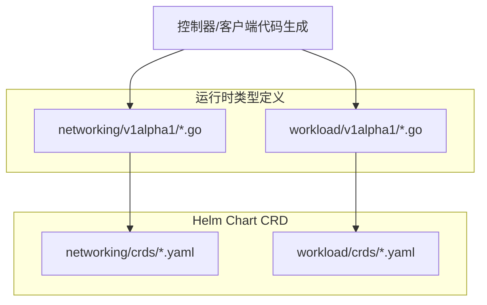
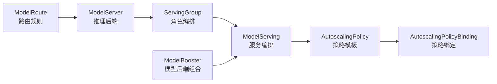
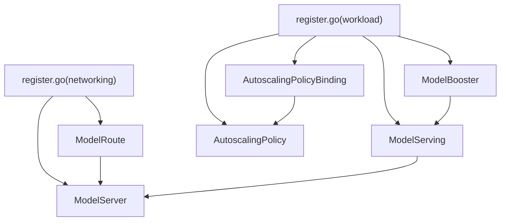

# CRD API 参考

<cite>
**本文引用的文件**
- [modelroute_types.go](file://pkg/apis/networking/v1alpha1/modelroute_types.go)
- [modelserver_types.go](file://pkg/apis/networking/v1alpha1/modelserver_types.go)
- [model_serving_types.go](file://pkg/apis/workload/v1alpha1/model_serving_types.go)
- [autoscalingpolicy_types.go](file://pkg/apis/workload/v1alpha1/autoscalingpolicy_types.go)
- [autoscalingpolicybinding_types.go](file://pkg/apis/workload/v1alpha1/autoscalingpolicybinding_types.go)
- [model_booster_types.go](file://pkg/apis/workload/v1alpha1/model_booster_types.go)
- [servinggroup_types.go](file://pkg/apis/workload/v1alpha1/servinggroup_types.go)
- [register.go（networking）](file://pkg/apis/networking/v1alpha1/register.go)
- [register.go（workload）](file://pkg/apis/workload/v1alpha1/register.go)
- [modelroutes.yaml](file://charts/kthena/charts/networking/crds/networking.serving.volcano.sh_modelroutes.yaml)
- [modelservers.yaml](file://charts/kthena/charts/networking/crds/networking.serving.volcano.sh_modelservers.yaml)
- [modelservings.yaml](file://charts/kthena/charts/workload/crds/workload.serving.volcano.sh_modelservings.yaml)
- [autoscalingpolicies.yaml](file://charts/kthena/charts/workload/crds/workload.serving.volcano.sh_autoscalingpolicies.yaml)
- [autoscalingpolicybindings.yaml](file://charts/kthena/charts/workload/crds/workload.serving.volcano.sh_autoscalingpolicybindings.yaml)
- [modelboosters.yaml](file://charts/kthena/charts/workload/crds/workload.serving.volcano.sh_modelboosters.yaml)
- [examples 模板](file://cli/kthena/helm/templates/)
- [示例集合](file://examples/)
</cite>

## 目录
1. [简介](#简介)
2. [项目结构](#项目结构)
3. [核心组件](#核心组件)
4. [架构总览](#架构总览)
5. [详细组件分析](#详细组件分析)
6. [依赖关系分析](#依赖关系分析)
7. [性能与扩展性考量](#性能与扩展性考量)
8. [故障排查指南](#故障排查指南)
9. [结论](#结论)
10. [附录：配置示例与最佳实践](#附录配置示例与最佳实践)

## 简介
本文件为 Kthena 平台所有 Custom Resource Definition（CRD）的完整 API 参考，覆盖网络路由与推理工作负载两大域：
- 网络域（networking.serving.volcano.sh）
  - ModelRoute：基于 Gateway API 的 LLM 路由与流量分发
  - ModelServer：推理后端抽象与访问策略
- 工作负载域（workload.serving.volcano.sh）
  - ModelServing：推理服务编排与滚动升级
  - ModelBooster：模型后端与多 Worker 组合编排
  - AutoscalingPolicy：弹性伸缩策略模板
  - AutoscalingPolicyBinding：策略绑定到具体部署目标

文档提供字段定义、数据类型、验证规则、使用约束、默认值、可选性/必填性、字段语义说明，并给出常见与高级用法的 YAML 示例路径与最佳实践建议。

## 项目结构
Kthena 将 CRD 定义分为两类来源：
- 运行时类型定义：位于 pkg/apis/*/v1alpha1/*.go，用于控制器与客户端代码生成
- Helm Chart CRD：位于 charts/kthena/charts/*/crds/*，用于安装与版本化管理

图表来源
- [modelroute_types.go:24-194](file://pkg/apis/networking/v1alpha1/modelroute_types.go#L24-L194)
- [modelserver_types.go:23-172](file://pkg/apis/networking/v1alpha1/modelserver_types.go#L23-L172)
- [model_serving_types.go:35-262](file://pkg/apis/workload/v1alpha1/model_serving_types.go#L35-L262)
- [autoscalingpolicy_types.go:24-153](file://pkg/apis/workload/v1alpha1/autoscalingpolicy_types.go#L24-L153)
- [autoscalingpolicybinding_types.go:24-153](file://pkg/apis/workload/v1alpha1/autoscalingpolicybinding_types.go#L24-L153)
- [model_booster_types.go:26-208](file://pkg/apis/workload/v1alpha1/model_booster_types.go#L26-L208)
- [modelroutes.yaml:1-366](file://charts/kthena/charts/networking/crds/networking.serving.volcano.sh_modelroutes.yaml#L1-L366)
- [modelservers.yaml:1-168](file://charts/kthena/charts/networking/crds/networking.serving.volcano.sh_modelservers.yaml#L1-L168)
- [modelservings.yaml:1-800](file://charts/kthena/charts/workload/crds/workload.serving.volcano.sh_modelservings.yaml#L1-L800)
- [autoscalingpolicies.yaml:1-213](file://charts/kthena/charts/workload/crds/workload.serving.volcano.sh_autoscalingpolicies.yaml#L1-L213)
- [autoscalingpolicybindings.yaml:1-401](file://charts/kthena/charts/workload/crds/workload.serving.volcano.sh_autoscalingpolicybindings.yaml#L1-L401)
- [modelboosters.yaml:1-800](file://charts/kthena/charts/workload/crds/workload.serving.volcano.sh_modelboosters.yaml#L1-L800)

章节来源
- [register.go（networking）:25-33](file://pkg/apis/networking/v1alpha1/register.go#L25-L33)
- [register.go（workload）:25-29](file://pkg/apis/workload/v1alpha1/register.go#L25-L29)

## 核心组件
- ModelRoute（networking.serving.volcano.sh/v1alpha1）
  - 作用：将 LLM 请求按模型名/LoRA 适配器/请求体匹配规则路由至指定 ModelServer
  - 关键字段：modelName、loraAdapters、parentRefs、rules、rateLimit
- ModelServer（networking.serving.volcano.sh/v1alpha1）
  - 作用：抽象推理后端，绑定到一组 Pod，暴露端口与协议，支持 KV Connector 与重试/超时策略
  - 关键字段：model、inferenceEngine、workloadSelector、workloadPort、trafficPolicy、kvConnector
- ModelServing（workload.serving.volcano.sh/v1alpha1）
  - 作用：编排推理服务，定义 ServingGroup 角色、插件、回滚策略、恢复策略等
  - 关键字段：replicas、schedulerName、plugins、template、rolloutStrategy、recoveryPolicy
- ModelBooster（workload.serving.volcano.sh/v1alpha1）
  - 作用：声明式描述模型后端与多 Worker 组合，支持 vLLM/SGLang/MindIE 等引擎
  - 关键字段：name、owner、backend（含 workers）、autoscalingPolicy、modelMatch
- AutoscalingPolicy（workload.serving.volcano.sh/v1alpha1）
  - 作用：定义弹性伸缩策略模板（容忍度、指标、行为）
  - 关键字段：tolerancePercent、metrics、behavior
- AutoscalingPolicyBinding（workload.serving.volcano.sh/v1alpha1）
  - 作用：将策略绑定到具体目标（单目标或异构多目标），支持指标端点选择
  - 关键字段：policyRef、homogeneousTarget 或 heterogeneousTarget

章节来源
- [modelroute_types.go:24-194](file://pkg/apis/networking/v1alpha1/modelroute_types.go#L24-L194)
- [modelserver_types.go:23-172](file://pkg/apis/networking/v1alpha1/modelserver_types.go#L23-L172)
- [model_serving_types.go:35-262](file://pkg/apis/workload/v1alpha1/model_serving_types.go#L35-L262)
- [model_booster_types.go:26-208](file://pkg/apis/workload/v1alpha1/model_booster_types.go#L26-L208)
- [autoscalingpolicy_types.go:24-153](file://pkg/apis/workload/v1alpha1/autoscalingpolicy_types.go#L24-L153)
- [autoscalingpolicybinding_types.go:24-153](file://pkg/apis/workload/v1alpha1/autoscalingpolicybinding_types.go#L24-L153)

## 架构总览
Kthena 的 CRD 通过控制器驱动实现“路由—后端—编排—弹性”的闭环：
- ModelRoute 决策流量归属
- ModelServer 抽象后端实例
- ModelServing/ModelBooster 编排 Pod 与角色
- AutoscalingPolicy 与 Binding 实现自动扩缩容

图表来源
- [modelroute_types.go:24-194](file://pkg/apis/networking/v1alpha1/modelroute_types.go#L24-L194)
- [modelserver_types.go:23-172](file://pkg/apis/networking/v1alpha1/modelserver_types.go#L23-L172)
- [model_serving_types.go:35-262](file://pkg/apis/workload/v1alpha1/model_serving_types.go#L35-L262)
- [model_booster_types.go:26-208](file://pkg/apis/workload/v1alpha1/model_booster_types.go#L26-L208)
- [autoscalingpolicy_types.go:24-153](file://pkg/apis/workload/v1alpha1/autoscalingpolicy_types.go#L24-L153)
- [autoscalingpolicybinding_types.go:24-153](file://pkg/apis/workload/v1alpha1/autoscalingpolicybinding_types.go#L24-L153)

## 详细组件分析

### ModelRoute（networking.serving.volcano.sh/v1alpha1）
- 字段与验证要点
  - modelName：字符串；不可变（XValidation）
  - loraAdapters：数组，最多 10 项
  - parentRefs：Gateway 引用列表（Gateway API ParentReference）
  - rules：数组，每条规则包含 modelMatch（头/URI/Body 匹配）与 targetModels（至少 1 项，最多 16）
  - rateLimit：全局令牌桶限流，支持本地/分布式（Redis），单位枚举 second/minute/hour/day/month
- 默认值与可选性
  - modelName 可空但需与 loraAdapters 至少一项非空（XValidation）
  - rateLimit 可空；单位默认 second；权重默认 100（targetModels.weight）
- 使用约束
  - 若未命中任何规则，返回 404
  - modelMatch 多条件 AND 条件
- 常见场景
  - 基于模型名/LoRA 名称分流
  - 基于请求头/URI/Body 内容分流
  - 全局/本地限流策略

章节来源
- [modelroute_types.go:24-194](file://pkg/apis/networking/v1alpha1/modelroute_types.go#L24-L194)
- [modelroutes.yaml:1-366](file://charts/kthena/charts/networking/crds/networking.serving.volcano.sh_modelroutes.yaml#L1-L366)

### ModelServer（networking.serving.volcano.sh/v1alpha1）
- 字段与验证要点
  - model：真实运行模型名（可空，用于覆盖请求中的 model）
  - inferenceEngine：枚举 vLLM/SGLang
  - workloadSelector：匹配标签与 PDGroup（预取/解码角色分组）
  - workloadPort：port（1-65535）、protocol（http/https，默认 http）
  - trafficPolicy：timeout、retry（attempts、retryInterval）
  - kvConnector：类型枚举 http/lmcache/nixl/mooncake
- 默认值与可选性
  - workloadPort.protocol 默认 http
  - retry.retryInterval 默认 100ms
- 使用约束
  - workloadSelector.matchLabels 必填
  - PDGroup.groupKey、prefillLabels、decodeLabels 必填
- 常见场景
  - vLLM/SGLang 后端接入
  - PD 解耦路由（prefill/decode 分组）
  - 重试与超时控制

章节来源
- [modelserver_types.go:23-172](file://pkg/apis/networking/v1alpha1/modelserver_types.go#L23-L172)
- [modelservers.yaml:1-168](file://charts/kthena/charts/networking/crds/networking.serving.volcano.sh_modelservers.yaml#L1-L168)

### ModelServing（workload.serving.volcano.sh/v1alpha1）
- 字段与验证要点
  - replicas：默认 1
  - schedulerName：默认 volcano
  - plugins：插件链（name/type/config/scope）
  - template：ServingGroup 模板（roles、gangPolicy、networkTopology、restartGracePeriodSeconds）
  - rolloutStrategy：type（ServingGroupRollingUpdate/RoleRollingUpdate，默认前者）、rollingUpdateConfiguration（maxUnavailable/partition）
  - recoveryPolicy：枚举 ServingGroupRecreate/RoleRecreate/None，默认 RoleRecreate
- 默认值与可选性
  - replicas 默认 1
  - schedulerName 默认 volcano
  - rolloutStrategy.type 默认 ServingGroupRollingUpdate
  - recoveryPolicy 默认 RoleRecreate
- 使用约束
  - roles 数量 1-4；role.name 唯一；workerReplicas 必填
  - gangPolicy.minRoleReplicas 不可变更（XValidation）
- 常见场景
  - 多角色（Entry/Worker）编排
  - 网络拓扑感知调度
  - 滚动更新分区与最大不可用控制

章节来源
- [model_serving_types.go:35-262](file://pkg/apis/workload/v1alpha1/model_serving_types.go#L35-L262)
- [servinggroup_types.go:54-131](file://pkg/apis/workload/v1alpha1/servinggroup_types.go#L54-L131)
- [modelservings.yaml:1-800](file://charts/kthena/charts/workload/crds/workload.serving.volcano.sh_modelservings.yaml#L1-L800)

### ModelBooster（workload.serving.volcano.sh/v1alpha1）
- 字段与验证要点
  - name/owner：元信息
  - backend：name（唯一）、type（vLLM/vLLMDisaggregated/SGLang/MindIE/MindIEDisaggregated）、modelURI（支持 hf://、s3://、pvc://、ms://）、cacheURI（hostpath://、pvc://）
  - env/envFrom：环境变量注入（不可更新）
  - minReplicas/maxReplicas：范围校验
  - workers：至少 1 项，至多 1000；支持资源、亲和性、JSON 配置
  - autoscalingPolicy：可选，复用弹性策略模板
  - modelMatch：可选，与 ModelRoute 共享匹配能力
- 默认值与可选性
  - workers[].type 默认 server
- 使用约束
  - 更新 backend.name 会触发重建
- 常见场景
  - 多 Worker 组合（server/prefill/decode/controller/coordinator）
  - 引擎参数透传（vLLM 配置）

章节来源
- [model_booster_types.go:26-208](file://pkg/apis/workload/v1alpha1/model_booster_types.go#L26-L208)
- [modelboosters.yaml:1-800](file://charts/kthena/charts/workload/crds/workload.serving.volcano.sh_modelboosters.yaml#L1-L800)

### AutoscalingPolicy（workload.serving.volcano.sh/v1alpha1）
- 字段与验证要点
  - tolerancePercent：0-100，默认 10
  - metrics：至少 1 项，每项包含 metricName 与 targetValue（支持整数/数量格式）
  - behavior：scaleUp（stablePolicy/panicPolicy）、scaleDown（stablePolicy）
  - panicPolicy：panicThresholdPercent（≥110，≤1000，默认 200）、panicModeHold（默认 60s）、percent（默认 1000）
  - stablePolicy：instances（≥0，默认 1）、percent（0-1000，默认 100）、period（默认 15s）、selectPolicy（Or/And，默认 Or）、stabilizationWindow
- 默认值与可选性
  - 多数字段有明确默认值
- 常见场景
  - CPU/内存/自定义指标阈值触发
  - 紧急扩容（panic）与稳定窗口抑制抖动

章节来源
- [autoscalingpolicy_types.go:24-153](file://pkg/apis/workload/v1alpha1/autoscalingpolicy_types.go#L24-L153)
- [autoscalingpolicies.yaml:1-213](file://charts/kthena/charts/workload/crds/workload.serving.volcano.sh_autoscalingpolicies.yaml#L1-L213)

### AutoscalingPolicyBinding（workload.serving.volcano.sh/v1alpha1）
- 字段与验证要点
  - policyRef：引用策略
  - heterogeneousTarget 或 homogeneousTarget 二选一（XValidation）
  - heterogeneousTarget：params（多目标优化）、costExpansionRatePercent（≥0，默认 200）
  - homogeneousTarget：minReplicas/maxReplicas（0-1000000）、target（targetRef/subTargets/metricEndpoint）
  - metricEndpoint：uri（默认 /metrics）、port（默认 8100）、labelSelector（可选）
- 默认值与可选性
  - metricEndpoint.uri/port 有默认值
- 使用约束
  - 仅支持 ModelServing 目标（含 Role 子目标）
- 常见场景
  - 单目标传统指标伸缩
  - 多目标异构资源成本优化

章节来源
- [autoscalingpolicybinding_types.go:24-153](file://pkg/apis/workload/v1alpha1/autoscalingpolicybinding_types.go#L24-L153)
- [autoscalingpolicybindings.yaml:1-401](file://charts/kthena/charts/workload/crds/workload.serving.volcano.sh_autoscalingpolicybindings.yaml#L1-L401)

## 依赖关系分析
- 控制器注册
  - networking/v1alpha1.register：注册 ModelRoute/ModelServer
  - workload/v1alpha1.register：注册 ModelServing/ModelBooster/AutoscalingPolicy/AutoscalingPolicyBinding
- CRD 版本与存储
  - 所有 CRD 在 v1alpha1 下声明 served/storage=true，具备存储版本
- 组件间依赖
  - ModelRoute → ModelServer（通过 targetModels.modelServerName）
  - ModelServing/ModelBooster → ModelServer（通过 workloadSelector/roles）
  - AutoscalingPolicyBinding → AutoscalingPolicy（通过 policyRef）
  - ModelBooster → ModelServing（通过 backend/workers 编排）

图表来源
- [register.go（networking）:61-71](file://pkg/apis/networking/v1alpha1/register.go#L61-L71)
- [register.go（workload）:67-81](file://pkg/apis/workload/v1alpha1/register.go#L67-L81)

章节来源
- [register.go（networking）:25-71](file://pkg/apis/networking/v1alpha1/register.go#L25-L71)
- [register.go（workload）:25-81](file://pkg/apis/workload/v1alpha1/register.go#L25-L81)

## 性能与扩展性考量
- 路由与限流
  - ModelRoute 支持全局/本地限流，结合 rateLimit.unit 与 Redis 全局限流，适合高并发场景
- 后端与 PD 解耦
  - ModelServer 的 PDGroup 支持 prefill/decode 角色分离，提升吞吐与延迟表现
- 编排与滚动升级
  - ModelServing 的 rolloutStrategy 支持分区与最大不可用控制，降低升级风险
- 弹性伸缩
  - AutoscalingPolicy 的 panicPolicy 与 stablePolicy 组合，兼顾突发与稳定
  - AutoscalingPolicyBinding 的 heterogeneousTarget 支持跨硬件异构优化

[本节为通用指导，无需特定文件引用]

## 故障排查指南
- 常见错误与定位
  - 字段校验失败：检查必填项、枚举值、范围限制（如 port、replicas、权重范围）
  - XValidation 失败：如 modelName 不可变、minRoleReplicas 不可变更、modelName 与 loraAdapters 不能同时为空
  - 策略绑定冲突：homogeneousTarget 与 heterogeneousTarget 二选一
- 排查步骤
  - 查看 CRD 定义与默认值，确认字段是否遗漏或越界
  - 检查控制器日志与事件，关注准入/校验 Webhook 报错
  - 对照示例配置，逐步缩小差异

章节来源
- [modelroute_types.go:25-35](file://pkg/apis/networking/v1alpha1/modelroute_types.go#L25-L35)
- [servinggroup_types.go:41-43](file://pkg/apis/workload/v1alpha1/servinggroup_types.go#L41-L43)
- [autoscalingpolicybinding_types.go:25-25](file://pkg/apis/workload/v1alpha1/autoscalingpolicybinding_types.go#L25-L25)

## 结论
本文档系统梳理了 Kthena 平台的全部 CRD，覆盖字段定义、验证规则、默认值、可选性/必填性、语义说明与使用约束，并提供了从入门到进阶的配置示例路径与最佳实践建议。建议在生产环境中结合限流、弹性与编排策略，确保稳定性与性能的平衡。

[本节为总结，无需特定文件引用]

## 附录：配置示例与最佳实践

### 示例清单与路径
- ModelRoute 常见用法
  - 基础模型路由与 LoRA 适配器匹配
  - 基于请求头/URI/Body 的精细分流
  - 全局/本地限流
  - 示例路径参考：[examples/kthena-router/ModelRoute*.yaml](file://examples/kthena-router/)
- ModelServer 常见用法
  - vLLM/SGLang 后端接入
  - PD 解耦（prefill/decode）与 KV Connector
  - 重试/超时策略
  - 示例路径参考：[examples/kthena-router/ModelServer*.yaml](file://examples/kthena-router/)
- ModelServing 常见用法
  - 多角色（Entry/Worker）编排
  - 滚动升级策略与恢复策略
  - 插件链与网络拓扑调度
  - 示例路径参考：[examples/model-serving/*.yaml](file://examples/model-serving/)
- ModelBooster 常见用法
  - 多 Worker 组合（server/prefill/decode/controller/coordinator）
  - 引擎参数透传与环境变量注入
  - 示例路径参考：[examples/model-booster/*.yaml](file://examples/model-booster/)
- 弹性伸缩
  - 单目标指标伸缩与多目标异构优化
  - 示例路径参考：[examples/keda-autoscaling/*.yaml](file://examples/keda-autoscaling/)

### 最佳实践
- 路由层
  - 使用 modelMatch 的 AND 组合精确匹配，避免误判
  - 对关键业务开启全局限流并配合 Redis
- 后端层
  - 明确 PDGroup 的 groupKey 与角色标签，保证 prefill/decode 成对调度
  - 合理设置 retry.attempts 与 retryInterval，避免雪崩
- 编排层
  - 使用 rolloutStrategy.partition 与 maxUnavailable 控制升级节奏
  - 启用 networkTopology 以降低跨节点通信开销
- 弹性层
  - tolerancePercent 设置为 5%-20% 以减少频繁抖动
  - panicThresholdPercent ≥ 150%，panicModeHold ≥ 30s，避免短期波动触发紧急扩容

[本节为通用指导，示例路径来自仓库示例目录]