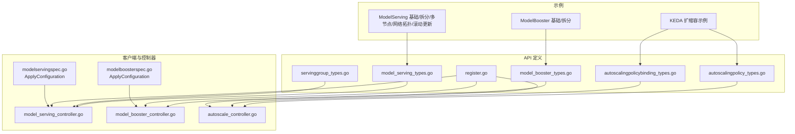
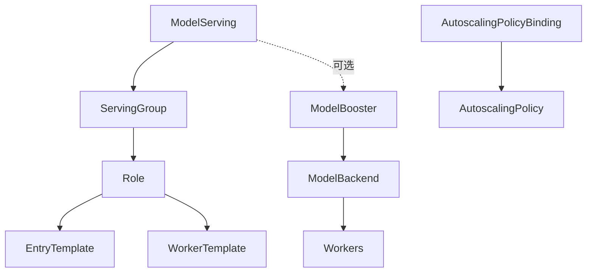
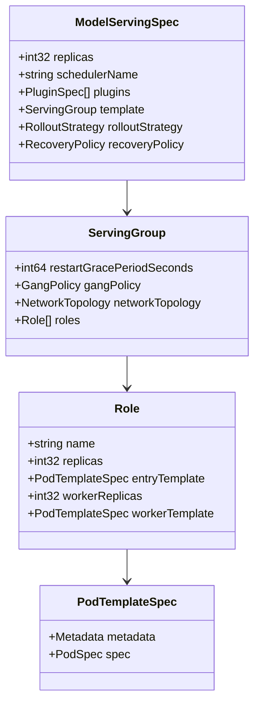
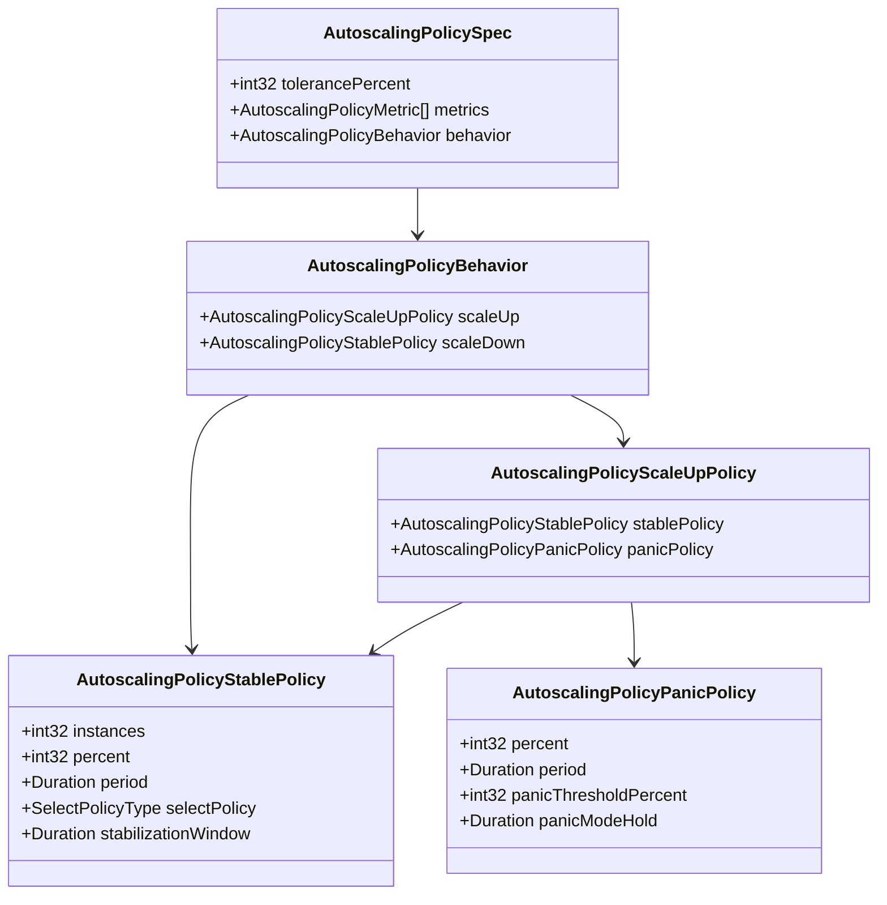
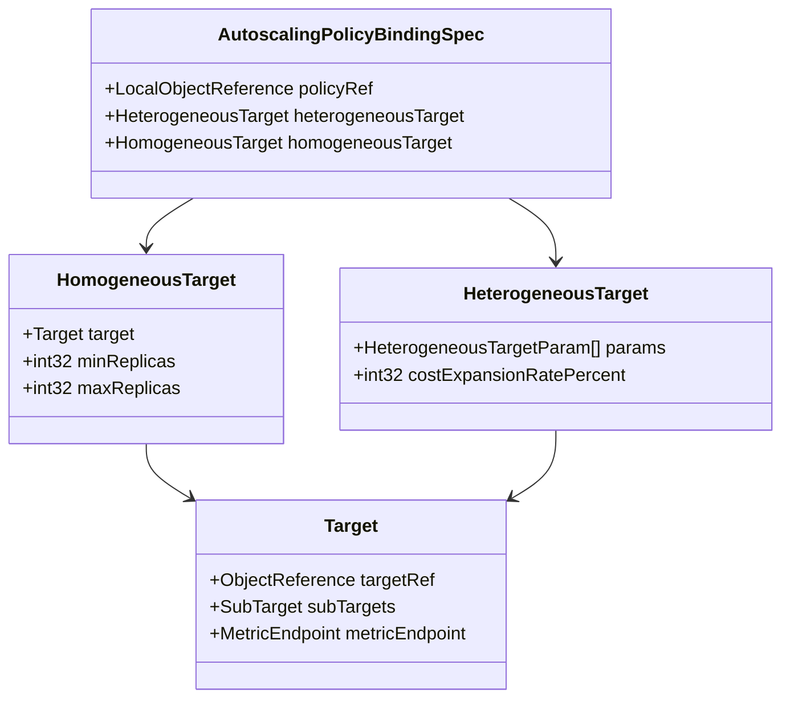
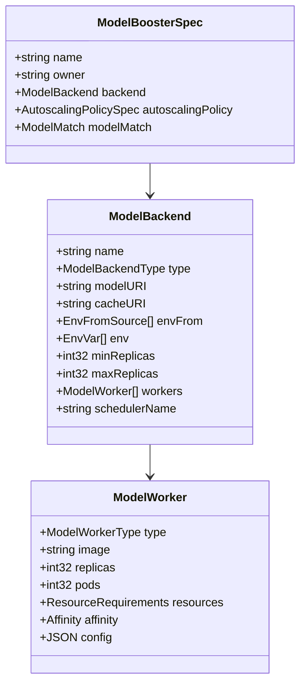
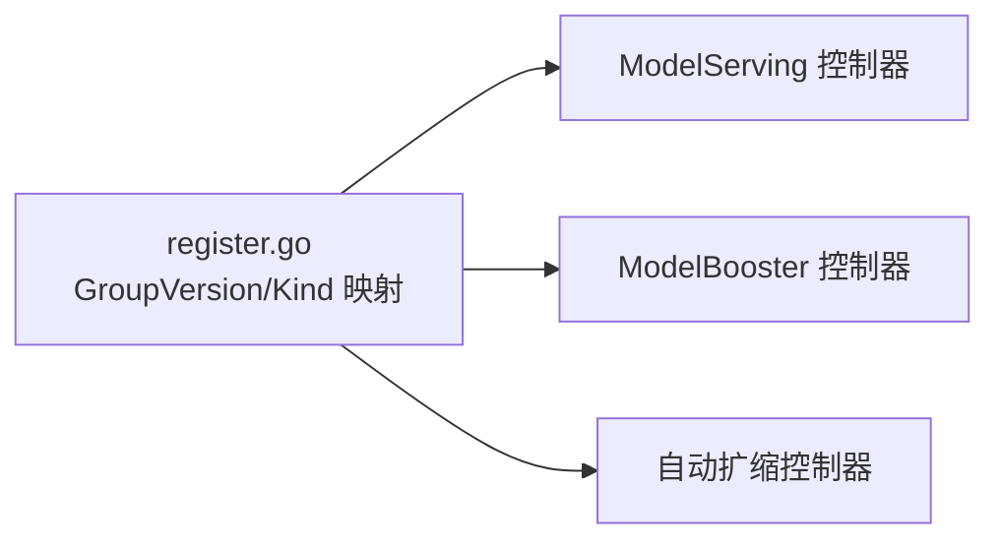

# 工作负载相关 CRD

<cite>
**本文引用的文件**
- [model_serving_types.go](file://pkg/apis/workload/v1alpha1/model_serving_types.go)
- [servinggroup_types.go](file://pkg/apis/workload/v1alpha1/servinggroup_types.go)
- [autoscalingpolicy_types.go](file://pkg/apis/workload/v1alpha1/autoscalingpolicy_types.go)
- [autoscalingpolicybinding_types.go](file://pkg/apis/workload/v1alpha1/autoscalingpolicybinding_types.go)
- [model_booster_types.go](file://pkg/apis/workload/v1alpha1/model_booster_types.go)
- [register.go](file://pkg/apis/workload/v1alpha1/register.go)
- [modelservingspec.go](file://client-go/applyconfiguration/workload/v1alpha1/modelservingspec.go)
- [modelboosterspec.go](file://client-go/applyconfiguration/workload/v1alpha1/modelboosterspec.go)
- [model_serving_controller.go](file://pkg/controller/model-serving-controller/controller/model_serving_controller.go)
- [model_booster_controller.go](file://pkg/model-booster-controller/controller/model_booster_controller.go)
- [autoscale_controller.go](file://pkg/autoscaler/controller/autoscale_controller.go)
- [model_serving_types.go](file://examples/kthena-router/ModelServing-ds1.5b-pd-disaggregation.yaml)
- [prefill-decode-disaggregation.yaml](file://examples/kthena-router/ModelRoute-prefill-decode-disaggregation.yaml)
- [model-serving-rollout.yaml](file://examples/model-serving/role-rollingupdate.yaml)
- [model-serving-rollingupdate.yaml](file://examples/model-serving/rollingupdate.yaml)
- [model-serving-multi-node.yaml](file://examples/model-serving/multi-node.yaml)
- [model-serving-data-parallel.yaml](file://examples/model-serving/data-parallel-deployment.yaml)
- [model-serving-network-topology.yaml](file://examples/model-serving/network-topology.yaml)
- [model-serving-gang-policy.yaml](file://examples/model-serving/gangPolicy.yaml)
- [model-booster-basic.yaml](file://examples/model-booster/Qwen2.5-0.5B-Instruct.yaml)
- [model-booster-disaggregation.yaml](file://examples/model-booster/prefill-decode-disaggregation.yaml)
- [keda-autoscaling-example.yaml](file://examples/keda-autoscaling/modelserving.yaml)
- [keda-autoscaling-route.yaml](file://examples/keda-autoscaling/route.yaml)
- [keda-autoscaling-scaledobject.yaml](file://examples/keda-autoscaling/scaledobject.yaml)
- [keda-autoscaling-service-monitor.yaml](file://examples/keda-autoscaling/servicemonitor.yaml)
</cite>

## 目录
1. [简介](#简介)
2. [项目结构](#项目结构)
3. [核心组件](#核心组件)
4. [架构总览](#架构总览)
5. [详细组件分析](#详细组件分析)
6. [依赖关系分析](#依赖关系分析)
7. [性能与扩展性考虑](#性能与扩展性考虑)
8. [故障排查指南](#故障排查指南)
9. [结论](#结论)
10. [附录：配置示例与参考](#附录配置示例与参考)

## 简介
本文件为 Kthena 工作负载相关 CRD 的完整 API 参考与实践指南，覆盖以下资源：
- ModelServing：统一的推理服务编排入口，负责实例副本、滚动升级、恢复策略、插件链等。
- AutoscalingPolicy：定义扩缩容策略（容忍度、指标、稳定与紧急策略）。
- AutoscalingPolicyBinding：将策略绑定到具体目标（单体或异构多目标），支持传统指标与成本驱动优化。
- ModelBooster：面向模型的增强与后端抽象，支持多后端类型、多 Worker 角色、环境变量与资源约束。
- ServingGroup：最小推理执行单元，定义角色、入场/工人类模板、网络拓扑与 Gang 调度策略。

本文同时解释字段验证规则、默认值、约束条件，并给出从基础部署到高级定制（预取-解码分离、动态 LoRA、成本驱动扩缩容、插件框架）的完整示例路径与最佳实践。

## 项目结构
Kthena 将工作负载相关 CRD 定义集中在 workload/v1alpha1 包中，并通过控制器实现业务逻辑；client-go 提供 ApplyConfiguration 以简化声明式构建；examples 提供丰富的使用样例。

图表来源
- [model_serving_types.go:35-262](file://pkg/apis/workload/v1alpha1/model_serving_types.go#L35-L262)
- [servinggroup_types.go:108-131](file://pkg/apis/workload/v1alpha1/servinggroup_types.go#L108-L131)
- [autoscalingpolicy_types.go:24-153](file://pkg/apis/workload/v1alpha1/autoscalingpolicy_types.go#L24-L153)
- [autoscalingpolicybinding_types.go:24-153](file://pkg/apis/workload/v1alpha1/autoscalingpolicybinding_types.go#L24-L153)
- [model_booster_types.go:26-208](file://pkg/apis/workload/v1alpha1/model_booster_types.go#L26-L208)
- [register.go:25-82](file://pkg/apis/workload/v1alpha1/register.go#L25-L82)
- [modelservingspec.go:25-94](file://client-go/applyconfiguration/workload/v1alpha1/modelservingspec.go#L25-L94)
- [modelboosterspec.go:25-80](file://client-go/applyconfiguration/workload/v1alpha1/modelboosterspec.go#L25-L80)
- [model_serving_controller.go](file://pkg/controller/model-serving-controller/controller/model_serving_controller.go)
- [model_booster_controller.go](file://pkg/model-booster-controller/controller/model_booster_controller.go)
- [autoscale_controller.go](file://pkg/autoscaler/controller/autoscale_controller.go)

章节来源
- [model_serving_types.go:35-262](file://pkg/apis/workload/v1alpha1/model_serving_types.go#L35-L262)
- [servinggroup_types.go:108-131](file://pkg/apis/workload/v1alpha1/servinggroup_types.go#L108-L131)
- [autoscalingpolicy_types.go:24-153](file://pkg/apis/workload/v1alpha1/autoscalingpolicy_types.go#L24-L153)
- [autoscalingpolicybinding_types.go:24-153](file://pkg/apis/workload/v1alpha1/autoscalingpolicybinding_types.go#L24-L153)
- [model_booster_types.go:26-208](file://pkg/apis/workload/v1alpha1/model_booster_types.go#L26-L208)
- [register.go:25-82](file://pkg/apis/workload/v1alpha1/register.go#L25-L82)

## 核心组件
本节对各 CRD 的关键字段进行逐项说明，包括默认值、校验规则与典型用途。

- ModelServing
  - replicas：默认 1，控制实例数量。
  - schedulerName：默认调度器名称，默认值在注解中指定。
  - plugins：可选插件链，支持 BuiltIn 类型与 All/Entry/Worker 目标范围。
  - template：ServingGroup 模板，定义角色、入场/工人类模板、网络拓扑与 Gang 策略。
  - rolloutStrategy：支持按 ServingGroup 或 Role 分区滚动更新，含 maxUnavailable、partition 等参数。
  - recoveryPolicy：支持 ServingGroupRecreate、RoleRecreate、None 三种策略。
  - 状态字段：observedGeneration、replicas、currentReplicas、updatedReplicas、availableReplicas、conditions、labelSelector 等。

- ServingGroup
  - roles：至少 1 个，最多 4 个；角色名唯一；每个角色包含 entryTemplate、workerReplicas、可选 workerTemplate。
  - gangPolicy：可配置每角色最小副本数，实现严格 Gang 调度。
  - networkTopology：支持组级与角色级网络拓扑亲和策略（需调度器支持）。
  - restartGracePeriodSeconds：错误重建的宽限时间。

- AutoscalingPolicy
  - tolerancePercent：容忍度百分比，默认 10，范围 0~100。
  - metrics：至少 1 项，每项包含 metricName 与 targetValue。
  - behavior：scaleUp（稳定策略+紧急策略）、scaleDown（稳定策略）。
  - 稳定策略：instances、percent、period、selectPolicy（Or/And）、stabilizationWindow。
  - 紧急策略：panicPercent、panicPeriod、panicThresholdPercent、panicModeHold。

- AutoscalingPolicyBinding
  - policyRef：引用策略对象。
  - heterogeneousTarget 或 homogeneousTarget 二选一：
    - homogeneousTarget：单目标指标驱动，含 target、minReplicas、maxReplicas。
    - heterogeneousTarget：多目标优化，含 params（含 target、cost、min/maxReplicas）、costExpansionRatePercent。
  - metricEndpoint：自定义指标抓取端点（uri、port、labelSelector）。

- ModelBooster
  - name/owner：元信息。
  - backend：后端类型（vLLM、vLLMDisaggregated、SGLang、MindIE、MindIEDisaggregated），包含 modelURI、cacheURI、env/envFrom、min/maxReplicas、workers 列表、可选 schedulerName。
  - autoscalingPolicy：可选引用全局策略。
  - modelMatch：匹配推理请求的目标模型谓词（来自 networking 组）。

章节来源
- [model_serving_types.go:35-262](file://pkg/apis/workload/v1alpha1/model_serving_types.go#L35-L262)
- [servinggroup_types.go:24-131](file://pkg/apis/workload/v1alpha1/servinggroup_types.go#L24-L131)
- [autoscalingpolicy_types.go:24-153](file://pkg/apis/workload/v1alpha1/autoscalingpolicy_types.go#L24-L153)
- [autoscalingpolicybinding_types.go:24-153](file://pkg/apis/workload/v1alpha1/autoscalingpolicybinding_types.go#L24-L153)
- [model_booster_types.go:26-208](file://pkg/apis/workload/v1alpha1/model_booster_types.go#L26-L208)

## 架构总览
下图展示了各 CRD 之间的关系与协作流程：ModelServing 通过 ServingGroup 编排角色与模板；AutoscalingPolicy 与 Binding 决策扩缩容；ModelBooster 抽象模型后端与 Worker 角色，可与 ModelServing 协同实现多后端与预取-解码分离。

图表来源
- [model_serving_types.go:35-262](file://pkg/apis/workload/v1alpha1/model_serving_types.go#L35-L262)
- [servinggroup_types.go:108-131](file://pkg/apis/workload/v1alpha1/servinggroup_types.go#L108-L131)
- [autoscalingpolicy_types.go:24-153](file://pkg/apis/workload/v1alpha1/autoscalingpolicy_types.go#L24-L153)
- [autoscalingpolicybinding_types.go:24-153](file://pkg/apis/workload/v1alpha1/autoscalingpolicybinding_types.go#L24-L153)
- [model_booster_types.go:26-208](file://pkg/apis/workload/v1alpha1/model_booster_types.go#L26-L208)

## 详细组件分析

### ModelServing API 详解
- 字段与默认值
  - replicas：默认 1
  - schedulerName：默认调度器名称
  - recoveryPolicy：默认 RoleRecreate
  - rolloutStrategy.type：默认 ServingGroupRollingUpdate
  - rollingUpdateConfiguration.maxUnavailable：默认 1
  - 条件类型：Available、Progressing、UpdateInProgress
- 关键能力
  - 多后端支持：通过 ModelBooster 与后端类型组合实现（见 ModelBooster 部分）
  - 预取-解码分离：通过 ServingGroup 中的角色拆分与模板配置实现（见示例）
  - 动态 LoRA 管理：通过 ModelBooster 的模型匹配与后端配置实现（见示例）
  - 插件框架：通过 plugins 字段注入 BuiltIn 插件链，限定作用域（All/Entry/Worker）
  - 滚动升级：支持按 ServingGroup 或 Role 分区滚动更新，配合 partition 控制升级分区
- 典型用法
  - 基础部署：单实例、单角色、默认调度器
  - 高级配置：多角色（如 P/D）、网络拓扑、Gang 调度、滚动更新策略
  - 扩缩容策略：结合 AutoscalingPolicy 与 Binding 实现
  - 模型增强：通过 ModelBooster 与后端模板系统实现

图表来源
- [model_serving_types.go:35-262](file://pkg/apis/workload/v1alpha1/model_serving_types.go#L35-L262)
- [servinggroup_types.go:108-131](file://pkg/apis/workload/v1alpha1/servinggroup_types.go#L108-L131)

章节来源
- [model_serving_types.go:35-262](file://pkg/apis/workload/v1alpha1/model_serving_types.go#L35-L262)
- [servinggroup_types.go:24-131](file://pkg/apis/workload/v1alpha1/servinggroup_types.go#L24-L131)
- [modelservingspec.go:25-94](file://client-go/applyconfiguration/workload/v1alpha1/modelservingspec.go#L25-L94)

### AutoscalingPolicy API 详解
- 字段与默认值
  - tolerancePercent：默认 10
  - metrics：至少 1 项（metricName、targetValue）
  - behavior.scaleUp.stablePolicy.instances：默认 1
  - behavior.scaleUp.stablePolicy.percent：默认 100
  - behavior.scaleUp.stablePolicy.period：默认 15s
  - behavior.scaleUp.stablePolicy.selectPolicy：默认 Or
  - behavior.scaleDown.stablePolicy.instances：默认 1
  - behavior.scaleDown.stablePolicy.percent：默认 100
  - behavior.scaleUp.panicPolicy.percent：默认 1000
  - behavior.scaleUp.panicPolicy.panicThresholdPercent：默认 200
  - behavior.scaleUp.panicPolicy.panicModeHold：默认 60s
- 行为设置
  - 稳定策略：通过 instances/percent/period/selectPolicy/stabilizationWindow 控制平滑扩缩
  - 紧急策略：在突发流量时快速扩容，防止超时
- 典型用法
  - 成本驱动扩缩容：与 Binding 的 heterogeneousTarget 结合，基于多目标优化与成本系数
  - 指标驱动扩缩容：与 Binding 的 homogeneousTarget 结合，按单目标指标阈值扩缩

图表来源
- [autoscalingpolicy_types.go:24-153](file://pkg/apis/workload/v1alpha1/autoscalingpolicy_types.go#L24-L153)

章节来源
- [autoscalingpolicy_types.go:24-153](file://pkg/apis/workload/v1alpha1/autoscalingpolicy_types.go#L24-L153)

### AutoscalingPolicyBinding API 详解
- 字段与约束
  - policyRef：引用策略对象
  - heterogeneousTarget 与 homogeneousTarget 二选一（XValidation）
  - metricEndpoint：可自定义 uri/port/labelSelector
- 目标类型
  - homogeneousTarget：单目标指标驱动（target、min/maxReplicas）
  - heterogeneousTarget：多目标优化（params、costExpansionRatePercent）
- 典型用法
  - 单集群内按指标扩缩容
  - 多硬件异构场景的成本驱动优化

图表来源
- [autoscalingpolicybinding_types.go:24-153](file://pkg/apis/workload/v1alpha1/autoscalingpolicybinding_types.go#L24-L153)

章节来源
- [autoscalingpolicybinding_types.go:24-153](file://pkg/apis/workload/v1alpha1/autoscalingpolicybinding_types.go#L24-L153)

### ModelBooster API 详解
- 字段与默认值
  - name：限制长度与正则
  - owner：所有者信息
  - backend.type：支持 vLLM、vLLMDisaggregated、SGLang、MindIE、MindIEDisaggregated
  - backend.modelURI：支持 hf://、s3://、pvc://、ms://
  - backend.cacheURI：支持 hostpath://、pvc://
  - backend.min/maxReplicas：范围校验
  - workers：至少 1 个，至多 1000 个；支持 server、prefill、decode、controller、coordinator 等类型
  - autoscalingPolicy：可选引用全局策略
  - modelMatch：可选匹配谓词
- 典型用法
  - 多后端支持：通过 backend.type 选择不同引擎
  - 模型增强：通过 workers 与 env/envFrom 注入运行时参数
  - 模板系统：通过 backend.config 传递引擎配置（如 vLLM 引擎参数）

图表来源
- [model_booster_types.go:26-208](file://pkg/apis/workload/v1alpha1/model_booster_types.go#L26-L208)

章节来源
- [model_booster_types.go:26-208](file://pkg/apis/workload/v1alpha1/model_booster_types.go#L26-L208)
- [modelboosterspec.go:25-80](file://client-go/applyconfiguration/workload/v1alpha1/modelboosterspec.go#L25-L80)

### ServingGroup API 详解
- 字段与默认值
  - restartGracePeriodSeconds：默认 0
  - roles：至少 1、最多 4；角色名唯一
  - gangPolicy.minRoleReplicas：可配置每角色最小副本数
  - networkTopology.groupPolicy/rolePolicy：网络拓扑亲和策略
- 典型用法
  - 预取-解码分离：通过 roles 拆分 prefill 与 decode 角色
  - 多节点/数据并行：通过 roles 与网络拓扑策略实现
  - Gang 调度：保证角色间严格的 Pod 同步启动

章节来源
- [servinggroup_types.go:24-131](file://pkg/apis/workload/v1alpha1/servinggroup_types.go#L24-L131)

## 依赖关系分析
- 组与版本
  - GroupName：workload.serving.volcano.sh
  - GroupVersion：v1alpha1
  - Kind 映射：ModelServing、ModelBooster、AutoscalingPolicy、AutoscalingPolicyBinding
- 控制器职责
  - ModelServing 控制器：根据 Spec 生成 ServingGroup，处理滚动更新与恢复策略
  - ModelBooster 控制器：解析后端与 Worker 角色，生成对应推理实例
  - 自动扩缩控制器：根据 Binding 与策略计算目标副本数并下发

图表来源
- [register.go:25-82](file://pkg/apis/workload/v1alpha1/register.go#L25-L82)
- [model_serving_controller.go](file://pkg/controller/model-serving-controller/controller/model_serving_controller.go)
- [model_booster_controller.go](file://pkg/model-booster-controller/controller/model_booster_controller.go)
- [autoscale_controller.go](file://pkg/autoscaler/controller/autoscale_controller.go)

章节来源
- [register.go:25-82](file://pkg/apis/workload/v1alpha1/register.go#L25-L82)

## 性能与扩展性考虑
- 模型生命周期管理
  - 通过 ModelBooster 的 backend 与 workers 管理模型下载、缓存与运行时参数，支持多种后端类型以适配不同硬件与推理需求。
- 多后端支持
  - vLLM、vLLMDisaggregated、SGLang、MindIE、MindIEDisaggregated 等类型满足不同推理范式与硬件特性。
- 预取-解码分离
  - 通过 ServingGroup 的 roles 将 prefill 与 decode 角色拆分，提升吞吐与延迟表现。
- 动态 LoRA 管理
  - 通过 ModelBooster 的 modelMatch 与后端配置，实现针对不同 LoRA 模型的路由与实例化。
- 成本驱动扩缩容
  - 通过 AutoscalingPolicyBinding 的 heterogeneousTarget 与 costExpansionRatePercent，在多硬件异构场景下平衡性能与成本。
- 滚动更新与恢复策略
  - 支持按 ServingGroup 或 Role 分区滚动更新，配合 recoveryPolicy 保障一致性与可用性。

[本节为通用指导，不直接分析具体文件]

## 故障排查指南
- 字段校验失败
  - replicas/minReplicas/maxReplicas 等数值范围校验未通过
  - roles 数量超出上限或角色名重复
  - heterogeneousTarget 与 homogeneousTarget 同时设置或均未设置
- 扩缩容异常
  - 策略 tolerancePercent 设置过小导致频繁震荡
  - 指标端点配置错误（uri/port/labelSelector）导致无法抓取指标
- 滚动更新卡住
  - rolloutStrategy.partition 配置不当导致分区不生效
  - recoveryPolicy 与 rolloutStrategy 类型冲突导致整组删除
- 预取-解码分离问题
  - roles 缺少 prefill/decode 角色或模板配置不一致
  - Gang 调度未满足最小副本要求导致 Pod 无法调度

章节来源
- [servinggroup_types.go:126-131](file://pkg/apis/workload/v1alpha1/servinggroup_types.go#L126-L131)
- [autoscalingpolicybinding_types.go:25-39](file://pkg/apis/workload/v1alpha1/autoscalingpolicybinding_types.go#L25-L39)
- [autoscalingpolicy_types.go:26-33](file://pkg/apis/workload/v1alpha1/autoscalingpolicy_types.go#L26-L33)

## 结论
本文系统梳理了 Kthena 工作负载相关 CRD 的 API 定义、字段规则、默认值与约束，并结合控制器职责与示例路径，给出了从基础部署到高级定制（多后端、预取-解码分离、动态 LoRA、成本驱动扩缩容、插件框架）的完整实践指南。建议在生产环境中优先采用稳定的指标驱动策略与合理的分区滚动更新策略，结合网络拓扑与 Gang 调度保障高可用与高性能。

[本节为总结性内容，不直接分析具体文件]

## 附录：配置示例与参考
- ModelServing 基础/拆分/多节点/网络拓扑/滚动更新
  - 基础部署：[示例路径](file://examples/model-serving/sample.yaml)
  - 预取-解码拆分：[示例路径](file://examples/model-serving/prefill-decode-disaggregation.yaml)
  - 多节点部署：[示例路径](file://examples/model-serving/multi-node.yaml)
  - 数据并行部署：[示例路径](file://examples/model-serving/data-parallel-deployment.yaml)
  - 网络拓扑：[示例路径](file://examples/model-serving/network-topology.yaml)
  - Gang 调度：[示例路径](file://examples/model-serving/gangPolicy.yaml)
  - 滚动更新（按 Role）：[示例路径](file://examples/model-serving/role-rollingupdate.yaml)
  - 滚动更新（全局）：[示例路径](file://examples/model-serving/rollingupdate.yaml)
- ModelBooster 基础/拆分
  - 基础模型增强：[示例路径](file://examples/model-booster/Qwen2.5-0.5B-Instruct.yaml)
  - 预取-解码拆分：[示例路径](file://examples/model-booster/prefill-decode-disaggregation.yaml)
- KEDA 扩缩容示例
  - ModelServing：[示例路径](file://examples/keda-autoscaling/modelserving.yaml)
  - 路由与绑定：[示例路径](file://examples/keda-autoscaling/route.yaml)
  - ScaledObject：[示例路径](file://examples/keda-autoscaling/scaledobject.yaml)
  - ServiceMonitor：[示例路径](file://examples/keda-autoscaling/servicemonitor.yaml)

章节来源
- [model_serving_types.go](file://examples/kthena-router/ModelServing-ds1.5b-pd-disaggregation.yaml)
- [prefill-decode-disaggregation.yaml](file://examples/kthena-router/ModelRoute-prefill-decode-disaggregation.yaml)
- [model-serving-rollout.yaml](file://examples/model-serving/role-rollingupdate.yaml)
- [model-serving-rollingupdate.yaml](file://examples/model-serving/rollingupdate.yaml)
- [model-serving-multi-node.yaml](file://examples/model-serving/multi-node.yaml)
- [model-serving-data-parallel.yaml](file://examples/model-serving/data-parallel-deployment.yaml)
- [model-serving-network-topology.yaml](file://examples/model-serving/network-topology.yaml)
- [model-serving-gang-policy.yaml](file://examples/model-serving/gangPolicy.yaml)
- [model-booster-basic.yaml](file://examples/model-booster/Qwen2.5-0.5B-Instruct.yaml)
- [model-booster-disaggregation.yaml](file://examples/model-booster/prefill-decode-disaggregation.yaml)
- [keda-autoscaling-example.yaml](file://examples/keda-autoscaling/modelserving.yaml)
- [keda-autoscaling-route.yaml](file://examples/keda-autoscaling/route.yaml)
- [keda-autoscaling-scaledobject.yaml](file://examples/keda-autoscaling/scaledobject.yaml)
- [keda-autoscaling-service-monitor.yaml](file://examples/keda-autoscaling/servicemonitor.yaml)