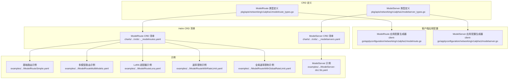
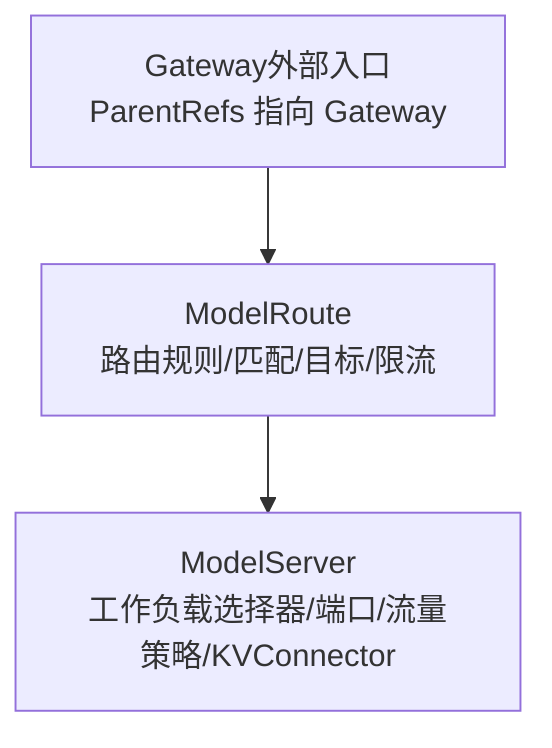
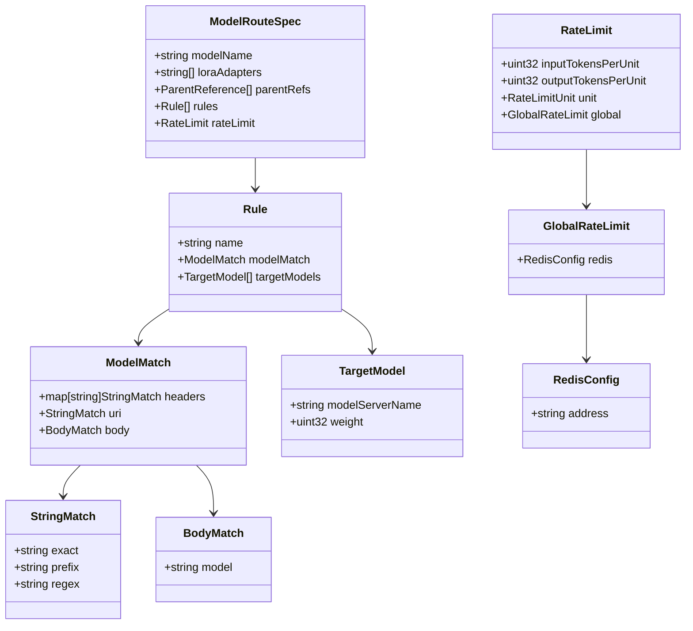
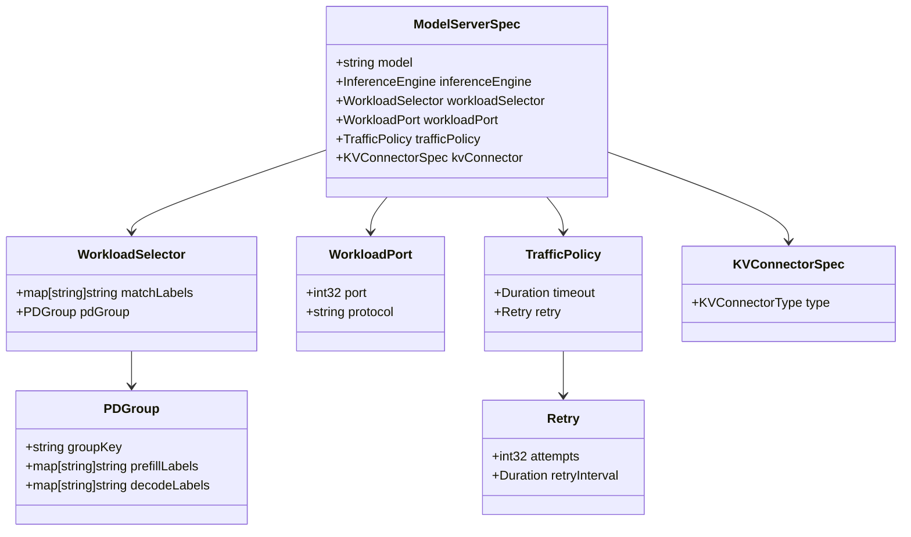

# 网络相关 CRD

<cite>
**本文引用的文件**
- [modelroute_types.go](file://pkg/apis/networking/v1alpha1/modelroute_types.go)
- [modelserver_types.go](file://pkg/apis/networking/v1alpha1/modelserver_types.go)
- [modelroute.go](file://client-go/applyconfiguration/networking/v1alpha1/modelroute.go)
- [modelserver.go](file://client-go/applyconfiguration/networking/v1alpha1/modelserver.go)
- [ModelRouteSimple.yaml](file://examples/kthena-router/ModelRouteSimple.yaml)
- [ModelRouteMultiModels.yaml](file://examples/kthena-router/ModelRouteMultiModels.yaml)
- [ModelRouteLora.yaml](file://examples/kthena-router/ModelRouteLora.yaml)
- [ModelRouteWithRateLimit.yaml](file://examples/kthena-router/ModelRouteWithRateLimit.yaml)
- [ModelRouteWithGlobalRateLimit.yaml](file://examples/kthena-router/ModelRouteWithGlobalRateLimit.yaml)
- [ModelServer-ds1.5b.yaml](file://examples/kthena-router/ModelServer-ds1.5b.yaml)
- [networking.serving.volcano.sh_modelroutes.yaml](file://charts/kthena/charts/networking/crds/networking.serving.volcano.sh_modelroutes.yaml)
- [networking.serving.volcano.sh_modelservers.yaml](file://charts/kthena/charts/networking/crds/networking.serving.volcano.sh_modelservers.yaml)
</cite>

## 目录
1. [简介](#简介)
2. [项目结构](#项目结构)
3. [核心组件](#核心组件)
4. [架构总览](#架构总览)
5. [详细组件分析](#详细组件分析)
6. [依赖关系分析](#依赖关系分析)
7. [性能与扩展性](#性能与扩展性)
8. [故障排查指南](#故障排查指南)
9. [结论](#结论)
10. [附录：YAML 示例与字段参考](#附录yaml-示例与字段参考)

## 简介
本文件为 Kthena 网络相关 CRD 的权威 API 参考，聚焦于两个核心资源：
- ModelRoute：用于定义 LLM 推理请求的路由规则、匹配条件、目标模型与速率限制策略
- ModelServer：用于声明推理后端（如 vLLM/SGLang）的工作负载选择器、端口协议、流量策略与 KV Connector

文档覆盖字段定义、数据类型、验证规则、使用约束、默认值、可选性/必填性、字段语义说明，并结合示例 YAML 展示常见用法（基础路由、多模型路由、LoRA 适配器支持、全局与本地速率限制）。同时解释 ModelRoute 与 ModelServer 的关系，以及如何通过 Gateway API 进行集成。

## 项目结构
Kthena 将网络相关 CRD 定义置于 networking/v1alpha1 包中，并通过 Helm Chart 提供 CRD 清单；示例位于 examples/kthena-router 目录；客户端应用配置生成器位于 client-go/applyconfiguration/networking/v1alpha1。

**图表来源**
- [modelroute_types.go:24-194](file://pkg/apis/networking/v1alpha1/modelroute_types.go#L24-L194)
- [modelserver_types.go:23-172](file://pkg/apis/networking/v1alpha1/modelserver_types.go#L23-L172)
- [modelroute.go:28-244](file://client-go/applyconfiguration/networking/v1alpha1/modelroute.go#L28-L244)
- [modelserver.go:28-244](file://client-go/applyconfiguration/networking/v1alpha1/modelserver.go#L28-L244)
- [networking.serving.volcano.sh_modelroutes.yaml](file://charts/kthena/charts/networking/crds/networking.serving.volcano.sh_modelroutes.yaml)
- [networking.serving.volcano.sh_modelservers.yaml](file://charts/kthena/charts/networking/crds/networking.serving.volcano.sh_modelservers.yaml)
- [ModelRouteSimple.yaml:1-12](file://examples/kthena-router/ModelRouteSimple.yaml#L1-L12)
- [ModelRouteMultiModels.yaml:1-19](file://examples/kthena-router/ModelRouteMultiModels.yaml#L1-L19)
- [ModelRouteLora.yaml:1-14](file://examples/kthena-router/ModelRouteLora.yaml#L1-L14)
- [ModelRouteWithRateLimit.yaml:1-18](file://examples/kthena-router/ModelRouteWithRateLimit.yaml#L1-L18)
- [ModelRouteWithGlobalRateLimit.yaml:1-22](file://examples/kthena-router/ModelRouteWithGlobalRateLimit.yaml#L1-L22)
- [ModelServer-ds1.5b.yaml:1-16](file://examples/kthena-router/ModelServer-ds1.5b.yaml#L1-L16)

**章节来源**
- [modelroute_types.go:24-194](file://pkg/apis/networking/v1alpha1/modelroute_types.go#L24-L194)
- [modelserver_types.go:23-172](file://pkg/apis/networking/v1alpha1/modelserver_types.go#L23-L172)
- [networking.serving.volcano.sh_modelroutes.yaml](file://charts/kthena/charts/networking/crds/networking.serving.volcano.sh_modelroutes.yaml)
- [networking.serving.volcano.sh_modelservers.yaml](file://charts/kthena/charts/networking/crds/networking.serving.volcano.sh_modelservers.yaml)

## 核心组件
- ModelRoute：定义路由规则、匹配条件、目标模型与速率限制
- ModelServer：声明推理后端的工作负载选择器、端口协议、流量策略与 KV Connector

两者通过 TargetModel 中的 modelServerName 建立直接关联：ModelRoute 的规则将请求转发到对应的 ModelServer 所代表的后端实例集合。

**章节来源**
- [modelroute_types.go:24-194](file://pkg/apis/networking/v1alpha1/modelroute_types.go#L24-L194)
- [modelserver_types.go:23-172](file://pkg/apis/networking/v1alpha1/modelserver_types.go#L23-L172)

## 架构总览
下图展示了 ModelRoute 与 ModelServer 的关系，以及与 Gateway API 的集成位置（ParentRefs 指向 Gateway）：

**图表来源**
- [modelroute_types.go:40-56](file://pkg/apis/networking/v1alpha1/modelroute_types.go#L40-L56)
- [modelserver_types.go:23-50](file://pkg/apis/networking/v1alpha1/modelserver_types.go#L23-L50)

## 详细组件分析

### ModelRoute API 参考
ModelRoute 的核心结构由以下字段组成：

- spec.modelName
  - 类型：字符串
  - 必填性：可选
  - 语义：与 LLM 请求中的 model 字段匹配的“基础模型名”或“虚拟模型名”
  - 验证：不可与 loraAdapters 同时为空
  - 默认值：无
  - 备注：一旦设置不可变更（不可变字段）

- spec.loraAdapters
  - 类型：字符串数组
  - 必填性：可选
  - 语义：与 LLM 请求中的 model 字段匹配的 LoRA 适配器名称列表
  - 验证：最多 10 个
  - 默认值：空数组

- spec.parentRefs
  - 类型：Gateway ParentReference 列表
  - 必填性：可选
  - 语义：绑定到的 Gateway 引用；若为空则在同命名空间内绑定所有 Gateway
  - 默认值：空

- spec.rules
  - 类型：Rule 数组
  - 必填性：必填（至少 1）
  - 语义：按顺序匹配的路由规则；首个匹配规则生效；均不匹配返回 404
  - 验证：最多 16 条
  - 子字段：
    - name：字符串，规则名称
    - modelMatch：ModelMatch，匹配条件（可选）
    - targetModels：TargetModel 数组（至少 1，至多 16），流量目标

- spec.rateLimit
  - 类型：RateLimit
  - 必填性：可选
  - 语义：整 Route 生效的速率限制（作用于所有规则）
  - 子字段：
    - inputTokensPerUnit：整数（最小 1），输入令牌/单位
    - outputTokensPerUnit：整数（最小 1），输出令牌/单位
    - unit：枚举（second/minute/hour/day/month，默认 second）
    - global：GlobalRateLimit（可选）
      - redis：RedisConfig（可选）
        - address：字符串（格式 host:port，必填）

匹配与目标：
- ModelMatch：支持头部匹配（headers）、URI 匹配（uri）、请求体匹配（body）
  - StringMatch：exact/prefix/regex 三选一
  - BodyMatch：可按 model 字段进行匹配
- TargetModel：
  - modelServerName：必填，指向同一命名空间内的 ModelServer
  - weight：0~100 的权重，默认 100

**图表来源**
- [modelroute_types.go:24-194](file://pkg/apis/networking/v1alpha1/modelroute_types.go#L24-L194)

**章节来源**
- [modelroute_types.go:24-194](file://pkg/apis/networking/v1alpha1/modelroute_types.go#L24-L194)

### ModelServer API 参考
ModelServer 的核心结构由以下字段组成：

- spec.model
  - 类型：字符串（最大长度 256）
  - 必填性：可选
  - 语义：后端实际运行的模型标识；若请求中的 model 与其不同，将被覆盖

- spec.inferenceEngine
  - 类型：枚举（vLLM/SGLang）
  - 必填性：必填
  - 语义：推理引擎类型

- spec.workloadSelector
  - 类型：WorkloadSelector
  - 必填性：必填
  - 子字段：
    - matchLabels：标签选择器（必填）
    - pdGroup：PDGroup（可选），用于预取/解码角色分组

- spec.workloadPort
  - 类型：WorkloadPort
  - 必填性：可选
  - 子字段：
    - port：1~65535（必填）
    - protocol：http/https（默认 http）

- spec.trafficPolicy
  - 类型：TrafficPolicy（可选）
  - 子字段：
    - timeout：请求超时（可选）
    - retry：重试策略（可选）
      - attempts：重试次数（可选）
      - retryInterval：重试间隔（默认 100ms）

- spec.kvConnector
  - 类型：KVConnectorSpec（可选）
  - 子字段：
    - type：枚举（http/lmcache/nixl/mooncake，默认 http）

PD 分离与 KV Connector：
- PDGroup：通过 groupKey 与 prefillLabels/decodeLabels 区分不同 PD 组的角色实例
- KVConnectorType：用于 PD 解耦场景下的 KV 缓存桥接

**图表来源**
- [modelserver_types.go:23-172](file://pkg/apis/networking/v1alpha1/modelserver_types.go#L23-L172)

**章节来源**
- [modelserver_types.go:23-172](file://pkg/apis/networking/v1alpha1/modelserver_types.go#L23-L172)

## 依赖关系分析
- ModelRoute 与 ModelServer 的耦合点
  - ModelRoute.spec.rules[*].targetModels[*].modelServerName → ModelServer.metadata.name（同命名空间）
  - ModelRoute.parentRefs → Gateway（外部入口）

- 与 Gateway API 的集成
  - ModelRoute 支持通过 parentRefs 关联到 Gateway，未设置时默认绑定同命名空间内所有 Gateway

**图表来源**
- [modelroute_types.go:40-56](file://pkg/apis/networking/v1alpha1/modelroute_types.go#L40-L56)

**章节来源**
- [modelroute_types.go:40-56](file://pkg/apis/networking/v1alpha1/modelroute_types.go#L40-L56)

## 性能与扩展性
- 路由匹配复杂度
  - 规则线性扫描，首条匹配即停止；建议将高命中率规则前置
  - 单条规则内的匹配条件为 AND 关系，建议精简匹配键以降低开销

- 速率限制
  - 本地限流：基于本地状态，简单低开销
  - 全局限流：通过 Redis 实现跨实例一致性，带来网络与序列化开销，适合多副本部署

- 流量策略
  - 超时与重试可提升鲁棒性，但会增加端到端延迟与后端压力
  - 建议根据模型吞吐与网络状况调优 retry.attempts 与 retry.retryInterval

[本节为通用指导，无需特定文件来源]

## 故障排查指南
- 常见校验错误
  - modelName 与 loraAdapters 同时为空：需至少设置其一
  - modelName 不可变更：更新时保持一致
  - rules 至少 1 条且不超过 16 条
  - targetModels 至少 1 个且不超过 16 个
  - weight 在 0~100 之间
  - rateLimit.inputTokensPerUnit/outputTokensPerUnit 最小为 1
  - unit 限定枚举值
  - GlobalRateLimit.redis.address 必填

- 路由不生效
  - 检查 parentRefs 是否正确指向目标 Gateway
  - 检查 modelMatch（headers/uri/body）是否与请求匹配
  - 检查 targetModels.modelServerName 是否存在且同命名空间

- 限流异常
  - 本地限流：确认未误配 global.redis
  - 全局限流：确认 Redis 地址可达且格式正确

**章节来源**
- [modelroute_types.go:24-194](file://pkg/apis/networking/v1alpha1/modelroute_types.go#L24-L194)
- [modelserver_types.go:23-172](file://pkg/apis/networking/v1alpha1/modelserver_types.go#L23-L172)

## 结论
ModelRoute 与 ModelServer 通过清晰的字段边界与严格的校验规则，提供了灵活而可控的 LLM 推理路由能力。配合 Gateway API 的 parentRefs，可无缝对接外部入口；通过 TargetModel 与 TrafficPolicy，可实现多模型、多副本与高可用的推理服务编排；通过 RateLimit（本地/全局）保障系统稳定性与公平性。

[本节为总结，无需特定文件来源]

## 附录：YAML 示例与字段参考

### 基础路由配置
- 示例路径：[ModelRouteSimple.yaml:1-12](file://examples/kthena-router/ModelRouteSimple.yaml#L1-L12)
- 关键字段
  - spec.modelName：基础模型名
  - spec.rules[*].targetModels[*].modelServerName：指向 ModelServer 名称

**章节来源**
- [ModelRouteSimple.yaml:1-12](file://examples/kthena-router/ModelRouteSimple.yaml#L1-L12)

### 多模型路由（基于头部匹配）
- 示例路径：[ModelRouteMultiModels.yaml:1-19](file://examples/kthena-router/ModelRouteMultiModels.yaml#L1-L19)
- 关键字段
  - spec.rules[*].modelMatch.headers：按用户类型分流
  - 多条规则按顺序匹配，第一条命中的规则生效

**章节来源**
- [ModelRouteMultiModels.yaml:1-19](file://examples/kthena-router/ModelRouteMultiModels.yaml#L1-L19)

### LoRA 适配器支持
- 示例路径：[ModelRouteLora.yaml:1-14](file://examples/kthena-router/ModelRouteLora.yaml#L1-L14)
- 关键字段
  - spec.loraAdapters：适配器名称列表
  - spec.rules[*].targetModels[*].modelServerName：对应后端

**章节来源**
- [ModelRouteLora.yaml:1-14](file://examples/kthena-router/ModelRouteLora.yaml#L1-L14)

### 全局速率限制（基于 Redis）
- 示例路径：[ModelRouteWithGlobalRateLimit.yaml:1-22](file://examples/kthena-router/ModelRouteWithGlobalRateLimit.yaml#L1-L22)
- 关键字段
  - spec.rateLimit.global.redis.address：Redis 地址
  - spec.rateLimit.inputTokensPerUnit/outputTokensPerUnit/unit：令牌/时间单位

**章节来源**
- [ModelRouteWithGlobalRateLimit.yaml:1-22](file://examples/kthena-router/ModelRouteWithGlobalRateLimit.yaml#L1-L22)

### 本地速率限制
- 示例路径：[ModelRouteWithRateLimit.yaml:1-18](file://examples/kthena-router/ModelRouteWithRateLimit.yaml#L1-L18)
- 关键字段
  - spec.rateLimit.inputTokensPerUnit/outputTokensPerUnit/unit：本地限流参数

**章节来源**
- [ModelRouteWithRateLimit.yaml:1-18](file://examples/kthena-router/ModelRouteWithRateLimit.yaml#L1-L18)

### ModelServer 配置示例
- 示例路径：[ModelServer-ds1.5b.yaml:1-16](file://examples/kthena-router/ModelServer-ds1.5b.yaml#L1-L16)
- 关键字段
  - spec.workloadSelector.matchLabels：匹配后端 Pod
  - spec.workloadPort.port/protocol：后端监听端口与协议
  - spec.trafficPolicy.timeout/retry：超时与重试策略
  - spec.model/inferenceEngine：模型与推理引擎

**章节来源**
- [ModelServer-ds1.5b.yaml:1-16](file://examples/kthena-router/ModelServer-ds1.5b.yaml#L1-L16)

### 字段清单与默认值摘要
- ModelRoute
  - spec.modelName：可选，不可变
  - spec.loraAdapters：可选，最多 10
  - spec.parentRefs：可选，缺省绑定同命名空间全部 Gateway
  - spec.rules：必填，1~16
  - spec.rateLimit：可选
    - inputTokensPerUnit/outputTokensPerUnit：最小 1
    - unit：默认 second，枚举值 second/minute/hour/day/month
    - global.redis.address：可选，启用全局限流

- ModelServer
  - spec.model：可选，最大长度 256
  - spec.inferenceEngine：必填，枚举 vLLM/SGLang
  - spec.workloadSelector：必填
    - matchLabels：必填
    - pdGroup：可选
  - spec.workloadPort：可选
    - port：必填，1~65535
    - protocol：默认 http，枚举 http/https
  - spec.trafficPolicy：可选
    - timeout：可选
    - retry：可选
      - attempts：可选
      - retryInterval：默认 100ms
  - spec.kvConnector：可选
    - type：默认 http，枚举 http/lmcache/nixl/mooncake

**章节来源**
- [modelroute_types.go:24-194](file://pkg/apis/networking/v1alpha1/modelroute_types.go#L24-L194)
- [modelserver_types.go:23-172](file://pkg/apis/networking/v1alpha1/modelserver_types.go#L23-L172)