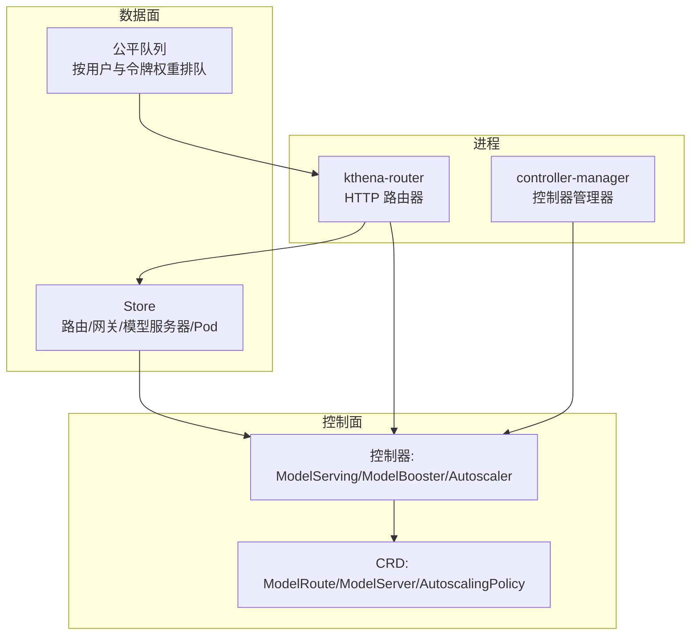
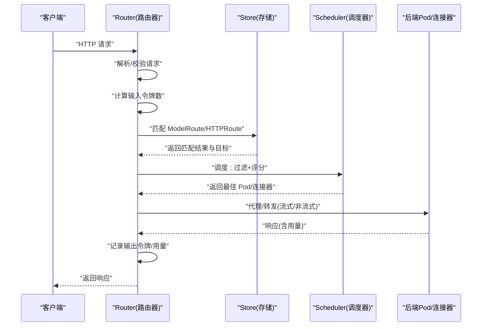
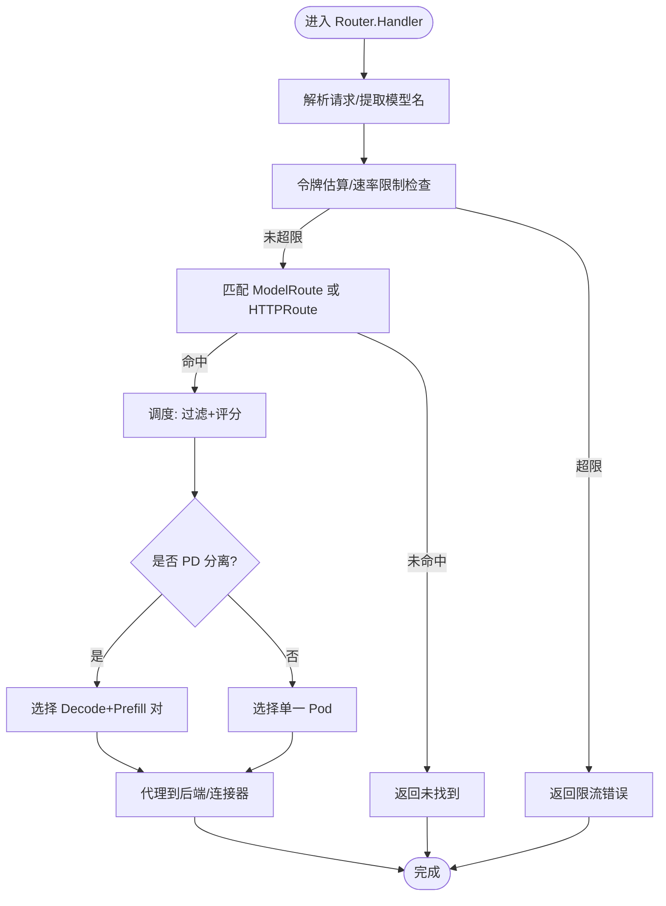
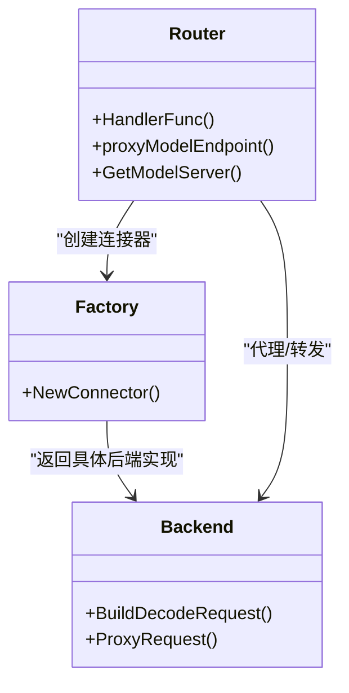
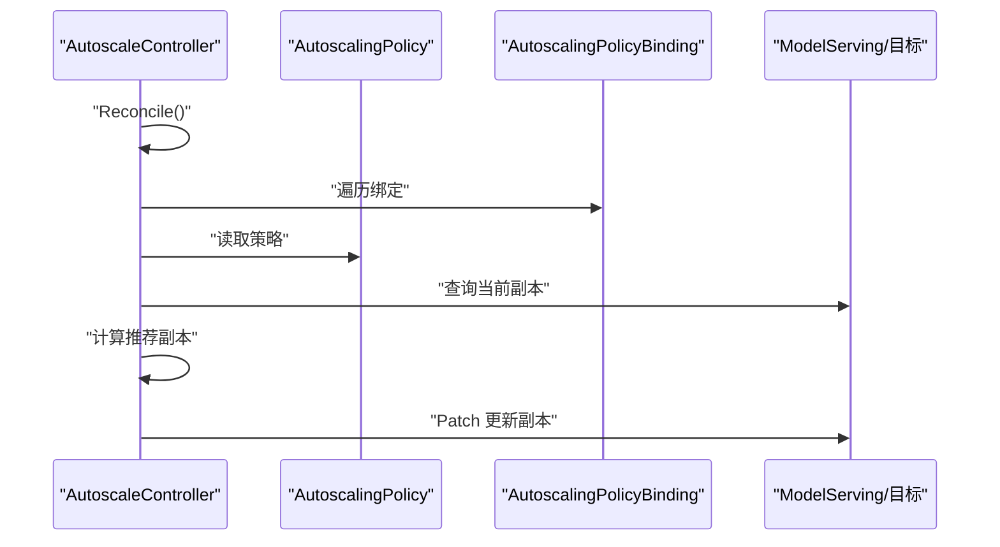
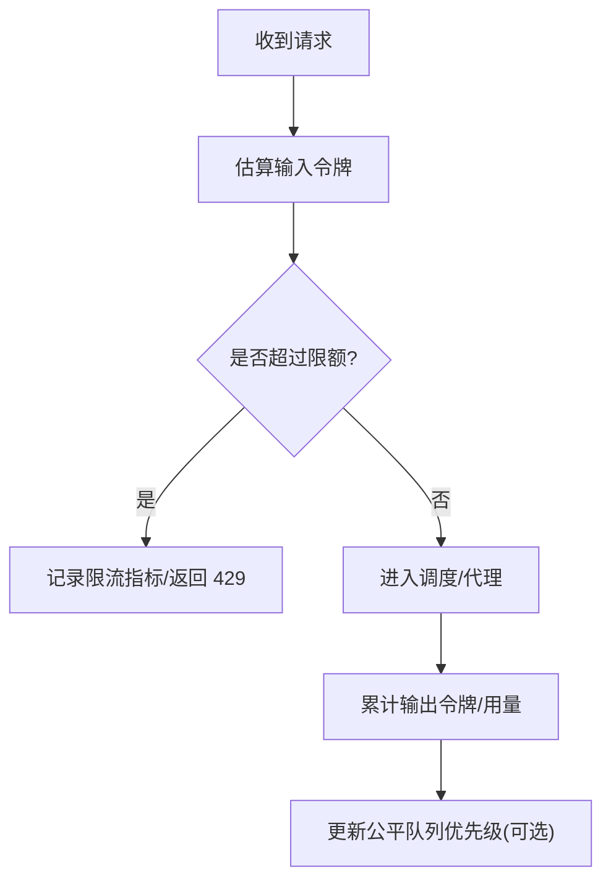
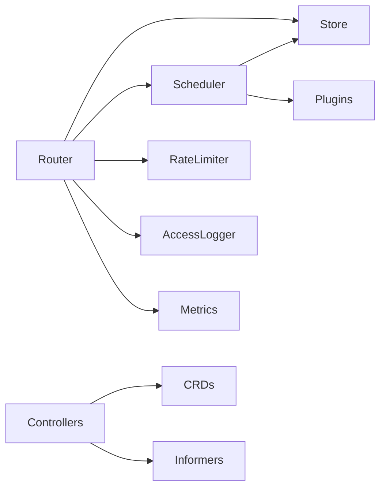

# 功能实现

<cite>
**本文引用的文件**
- [cmd/kthena-router/main.go](file://cmd/kthena-router/main.go)
- [pkg/kthena-router/router/router.go](file://pkg/kthena-router/router/router.go)
- [pkg/kthena-router/scheduler/scheduler.go](file://pkg/kthena-router/scheduler/scheduler.go)
- [pkg/kthena-router/scheduler/scheduler_impl.go](file://pkg/kthena-router/scheduler/scheduler_impl.go)
- [pkg/kthena-router/datastore/store.go](file://pkg/kthena-router/datastore/store.go)
- [pkg/kthena-router/datastore/fairness_queue.go](file://pkg/kthena-router/datastore/fairness_queue.go)
- [pkg/controller/controller.go](file://pkg/controller/controller.go)
- [pkg/autoscaler/controller/autoscale_controller.go](file://pkg/autoscaler/controller/autoscale_controller.go)
- [pkg/apis/networking/v1alpha1/modelroute_types.go](file://pkg/apis/networking/v1alpha1/modelroute_types.go)
- [examples/kthena-router/ModelRouteWithRateLimit.yaml](file://examples/kthena-router/ModelRouteWithRateLimit.yaml)
- [examples/kthena-router/ModelRouteSimple.yaml](file://examples/kthena-router/ModelRouteSimple.yaml)
</cite>

## 目录
1. [简介](#简介)
2. [项目结构](#项目结构)
3. [核心组件](#核心组件)
4. [架构总览](#架构总览)
5. [详细组件分析](#详细组件分析)
6. [依赖分析](#依赖分析)
7. [性能考虑](#性能考虑)
8. [故障排查指南](#故障排查指南)
9. [结论](#结论)
10. [附录](#附录)

## 简介
本文件面向 Kthena 平台的核心功能实现，系统性阐述以下能力与其实现要点：
- 智能路由与调度：基于 ModelRoute/HTTPRoute 的匹配与调度，支持 PD 分离与聚合两种模式，插件化评分与过滤。
- 多后端推理引擎支持：通过连接器抽象适配不同后端（如 vLLM、SGLang 等），统一请求编解码与转发。
- 自动扩缩容：控制器根据策略与指标对模型服务进行同构/异构扩缩容与优化。
- 流量控制与速率限制：支持按输入/输出令牌与请求数的全局/本地速率限制，并与公平队列结合。
- 认证授权与速率限制：内置 JWT 认证中间件，配合速率限制与访问日志。
- 配置与使用模式：提供环境变量、CRD 字段与 Helm/示例清单的使用指引。

## 项目结构
Kthena 由“路由器”和“控制器管理器”两大进程组成，分别负责请求接入与资源编排；数据面通过 Store 维护模型服务器、Pod、路由与网关信息，调度器基于插件完成选择与打分。

图示来源
- [cmd/kthena-router/main.go:1-226](file://cmd/kthena-router/main.go#L1-L226)
- [pkg/controller/controller.go:52-141](file://pkg/controller/controller.go#L52-L141)
- [pkg/kthena-router/router/router.go:73-169](file://pkg/kthena-router/router/router.go#L73-L169)
- [pkg/kthena-router/datastore/store.go:316-342](file://pkg/kthena-router/datastore/store.go#L316-L342)

章节来源
- [cmd/kthena-router/main.go:40-122](file://cmd/kthena-router/main.go#L40-L122)
- [pkg/controller/controller.go:52-141](file://pkg/controller/controller.go#L52-L141)

## 核心组件
- 路由器 Router：解析请求、计算令牌数、应用速率限制、匹配路由、调度到最佳 Pod、代理到后端或 KV 连接器。
- 调度器 Scheduler：插件化过滤与评分，支持 PD 聚合/分离两种路径，产出最佳候选 Pod 列表。
- Store：集中式缓存与索引，维护模型服务器、Pod、路由、网关、HTTPRoute、InferencePool 等，提供回调与公平队列接口。
- 控制器管理器：启动并协调多个控制器（模型服务、模型增强、自动扩缩容）。
- 自动扩缩容控制器：根据绑定策略与目标，更新模型服务副本数或角色副本数。

章节来源
- [pkg/kthena-router/router/router.go:73-169](file://pkg/kthena-router/router/router.go#L73-L169)
- [pkg/kthena-router/scheduler/scheduler.go:25-28](file://pkg/kthena-router/scheduler/scheduler.go#L25-L28)
- [pkg/kthena-router/scheduler/scheduler_impl.go:59-99](file://pkg/kthena-router/scheduler/scheduler_impl.go#L59-L99)
- [pkg/kthena-router/datastore/store.go:162-240](file://pkg/kthena-router/datastore/store.go#L162-L240)
- [pkg/controller/controller.go:52-141](file://pkg/controller/controller.go#L52-L141)
- [pkg/autoscaler/controller/autoscale_controller.go:64-96](file://pkg/autoscaler/controller/autoscale_controller.go#L64-L96)

## 架构总览
下图展示了从客户端到后端推理引擎的完整链路，以及与控制器、存储、速率限制与认证的关系。

图示来源
- [pkg/kthena-router/router/router.go:204-315](file://pkg/kthena-router/router/router.go#L204-L315)
- [pkg/kthena-router/scheduler/scheduler_impl.go:101-165](file://pkg/kthena-router/scheduler/scheduler_impl.go#L101-L165)
- [pkg/kthena-router/datastore/store.go:179-234](file://pkg/kthena-router/datastore/store.go#L179-L234)

## 详细组件分析

### 智能路由与调度
- 路由匹配
  - 优先匹配 ModelRoute（支持按模型名、LoRA 适配器、Header/URI/Body 匹配规则），再回退到 Gateway API 的 HTTPRoute 与 InferencePool。
  - 支持 URL 重写（主机名与路径前缀替换）。
- 调度策略
  - 插件化过滤与评分（默认启用 least-request、least-latency、prefix-cache 等），TopN 选择。
  - PD 分离模式：先选 Decode Pod，再按组匹配对应 Prefill Pod，提升吞吐与延迟。
- 公平调度
  - 可开启公平队列，按用户令牌数与请求次数加权计算优先级，支持并发门限或 QPS 模式。

图示来源
- [pkg/kthena-router/router/router.go:204-315](file://pkg/kthena-router/router/router.go#L204-L315)
- [pkg/kthena-router/router/router.go:317-464](file://pkg/kthena-router/router/router.go#L317-L464)
- [pkg/kthena-router/scheduler/scheduler_impl.go:101-165](file://pkg/kthena-router/scheduler/scheduler_impl.go#L101-L165)

章节来源
- [pkg/kthena-router/router/router.go:204-315](file://pkg/kthena-router/router/router.go#L204-L315)
- [pkg/kthena-router/router/router.go:317-464](file://pkg/kthena-router/router/router.go#L317-L464)
- [pkg/kthena-router/scheduler/scheduler_impl.go:101-165](file://pkg/kthena-router/scheduler/scheduler_impl.go#L101-L165)

### 多后端推理引擎支持
- 连接器抽象
  - 通过工厂创建后端连接器（如 vLLM、SGLang、Mooncake 等），统一封装请求编解码与传输层细节。
  - PD 分离模式下，使用 KV 连接器进行预取/解码协同。
- 代理流程
  - 聚合模式：直接将转换后的请求转发至目标 Pod 端口。
  - 分离模式：通过 KV 连接器与后端交互，边解码边预取，减少等待。

图示来源
- [pkg/kthena-router/router/router.go:732-780](file://pkg/kthena-router/router/router.go#L732-L780)

章节来源
- [pkg/kthena-router/router/router.go:732-780](file://pkg/kthena-router/router/router.go#L732-L780)

### 自动扩缩容
- 同构扩缩容
  - 基于当前实例数与策略计算推荐副本数，更新模型服务或角色副本。
- 异构优化
  - 针对多子目标的组合场景，综合各目标的推荐值进行整体优化与分配。
- 控制循环
  - 定期拉取绑定、策略与 Pod 列表，执行 Scale/Optimize 并落盘更新。

图示来源
- [pkg/autoscaler/controller/autoscale_controller.go:124-171](file://pkg/autoscaler/controller/autoscale_controller.go#L124-L171)
- [pkg/autoscaler/controller/autoscale_controller.go:316-348](file://pkg/autoscaler/controller/autoscale_controller.go#L316-L348)

章节来源
- [pkg/autoscaler/controller/autoscale_controller.go:64-96](file://pkg/autoscaler/controller/autoscale_controller.go#L64-L96)
- [pkg/autoscaler/controller/autoscale_controller.go:124-171](file://pkg/autoscaler/controller/autoscale_controller.go#L124-L171)
- [pkg/autoscaler/controller/autoscale_controller.go:316-348](file://pkg/autoscaler/controller/autoscale_controller.go#L316-L348)

### 流量控制与速率限制
- 令牌估算
  - 使用分词器估算输入令牌数，用于速率限制与计费统计。
- 速率限制
  - 支持按输入/输出令牌与请求数的单位速率限制（秒/分钟/小时/天/月）。
  - 支持本地与全局（Redis）两种模式，全局模式适合多实例一致性。
- 公平队列
  - 按用户令牌数与请求次数加权，避免大用户饿死，支持并发门限或 QPS 模式。

图示来源
- [pkg/kthena-router/router/router.go:250-292](file://pkg/kthena-router/router/router.go#L250-L292)
- [pkg/kthena-router/datastore/fairness_queue.go:71-88](file://pkg/kthena-router/datastore/fairness_queue.go#L71-L88)

章节来源
- [pkg/kthena-router/router/router.go:250-292](file://pkg/kthena-router/router/router.go#L250-L292)
- [pkg/kthena-router/datastore/fairness_queue.go:71-88](file://pkg/kthena-router/datastore/fairness_queue.go#L71-L88)
- [pkg/apis/networking/v1alpha1/modelroute_types.go:122-141](file://pkg/apis/networking/v1alpha1/modelroute_types.go#L122-L141)

### 认证授权与访问日志
- JWT 认证
  - 提供 JWT 认证中间件，可在路由处理前进行鉴权。
- 访问日志
  - 支持文本/JSON 输出，记录模型名、令牌用量、路由信息、上游/下游状态等。
- 调试与可观测性
  - 提供调试端口与访问日志字段，便于问题定位。

章节来源
- [pkg/kthena-router/router/router.go:798-800](file://pkg/kthena-router/router/router.go#L798-L800)
- [pkg/kthena-router/router/router.go:125-154](file://pkg/kthena-router/router/router.go#L125-L154)

### 配置与使用模式
- 路由器参数
  - 端口、TLS、Webhook 开关、Gateway API 扩展开关、调试端口、K8s API QPS/Burst 等。
- 公平调度与队列
  - 通过环境变量设置窗口大小、令牌/请求数权重、最大并发、最大 QPS、重建阈值等。
- 示例清单
  - ModelRoute（简单/带速率限制）、HTTPRoute 与 InferencePool 的典型用法。

章节来源
- [cmd/kthena-router/main.go:67-80](file://cmd/kthena-router/main.go#L67-L80)
- [pkg/kthena-router/datastore/store.go:70-111](file://pkg/kthena-router/datastore/store.go#L70-L111)
- [examples/kthena-router/ModelRouteSimple.yaml:1-12](file://examples/kthena-router/ModelRouteSimple.yaml#L1-L12)
- [examples/kthena-router/ModelRouteWithRateLimit.yaml:1-18](file://examples/kthena-router/ModelRouteWithRateLimit.yaml#L1-L18)

## 依赖分析
- 组件耦合
  - Router 依赖 Store（匹配/调度）、Scheduler（插件化评分）、RateLimiter（令牌/请求数限制）、AccessLogger（日志）、Metrics（指标）。
  - Scheduler 依赖 Store（PD 分组、Pod 信息）与插件注册表。
  - 控制器管理器统一启动多个控制器，控制器依赖 CRD 与 Informer。
- 外部依赖
  - Kubernetes API、Gateway API、Gateway API Inference Extension、Prometheus 指标。

图示来源
- [pkg/kthena-router/router/router.go:73-169](file://pkg/kthena-router/router/router.go#L73-L169)
- [pkg/kthena-router/scheduler/scheduler_impl.go:59-99](file://pkg/kthena-router/scheduler/scheduler_impl.go#L59-L99)
- [pkg/controller/controller.go:52-141](file://pkg/controller/controller.go#L52-L141)

章节来源
- [pkg/kthena-router/router/router.go:73-169](file://pkg/kthena-router/router/router.go#L73-L169)
- [pkg/kthena-router/scheduler/scheduler_impl.go:59-99](file://pkg/kthena-router/scheduler/scheduler_impl.go#L59-L99)
- [pkg/controller/controller.go:52-141](file://pkg/controller/controller.go#L52-L141)

## 性能考虑
- 调度性能
  - 过滤/评分插件数量与参数需平衡；TopN 降低后续代理成本。
  - PD 分离模式减少跨实例等待，提高吞吐。
- 速率限制
  - 全局模式使用 Redis，注意网络延迟与一致性权衡；本地模式适合单实例或低延迟场景。
- 公平队列
  - 并发门限模式适合严格容量控制；QPS 模式适合弹性场景；合理设置重建阈值与刷新重试上限。
- 日志与指标
  - 文本格式更轻量，JSON 便于结构化采集；避免高频细粒度过大指标。

## 故障排查指南
- 路由不生效
  - 检查 ModelRoute/HTTPRoute 是否正确匹配（模型名、Header/URI/Body、ParentRefs）。
  - 查看访问日志中的路由信息与错误字段。
- 调度失败
  - 查看过滤插件输出与评分结果；确认 Pod 状态与标签、PD 分组是否正确。
- 代理失败
  - 检查后端端口、目标模型名、连接器配置；查看上游/下游计数变化。
- 限流频繁
  - 调整速率限制参数或切换到更高配额；评估令牌估算误差。
- 公平队列积压
  - 提升 MaxConcurrent 或调整 QPS；检查优先级刷新与堆重建频率。

章节来源
- [pkg/kthena-router/router/router.go:204-315](file://pkg/kthena-router/router/router.go#L204-L315)
- [pkg/kthena-router/router/router.go:317-464](file://pkg/kthena-router/router/router.go#L317-L464)
- [pkg/kthena-router/datastore/fairness_queue.go:336-412](file://pkg/kthena-router/datastore/fairness_queue.go#L336-L412)

## 结论
Kthena 将“路由/调度/速率限制/公平队列/多后端连接器/控制器编排”有机整合，既满足高吞吐与低延迟需求，又提供灵活的策略与可观测性。通过 CRD 与控制器实现声明式编排，结合路由器的插件化调度与连接器抽象，可在多后端、多模型场景下稳定扩展。

## 附录
- 关键配置项
  - 路由器：端口、TLS、Webhook、Gateway API 开关、调试端口、K8s API QPS/Burst。
  - 公平队列：窗口大小、令牌/请求数权重、最大并发、最大 QPS、重建阈值、刷新重试上限。
- 示例参考
  - ModelRoute（简单/带速率限制）
  - HTTPRoute 与 InferencePool 的典型用法

章节来源
- [cmd/kthena-router/main.go:67-80](file://cmd/kthena-router/main.go#L67-L80)
- [pkg/kthena-router/datastore/store.go:70-111](file://pkg/kthena-router/datastore/store.go#L70-L111)
- [examples/kthena-router/ModelRouteSimple.yaml:1-12](file://examples/kthena-router/ModelRouteSimple.yaml#L1-L12)
- [examples/kthena-router/ModelRouteWithRateLimit.yaml:1-18](file://examples/kthena-router/ModelRouteWithRateLimit.yaml#L1-L18)