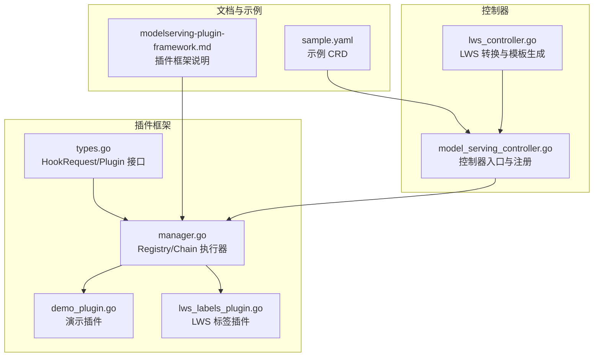
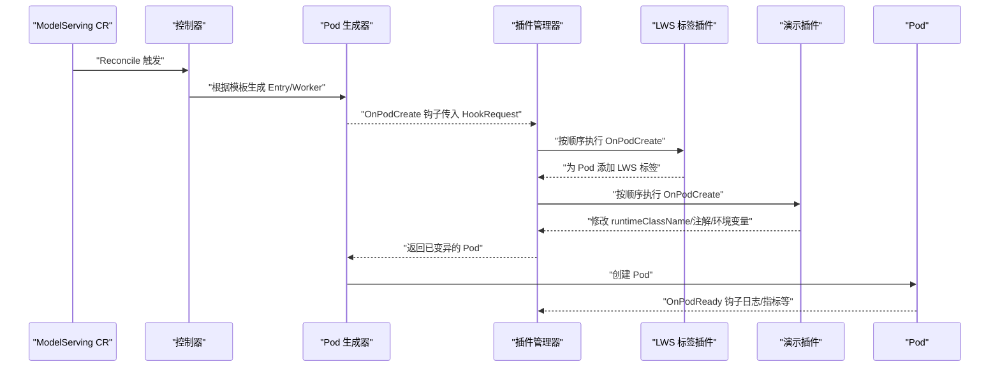
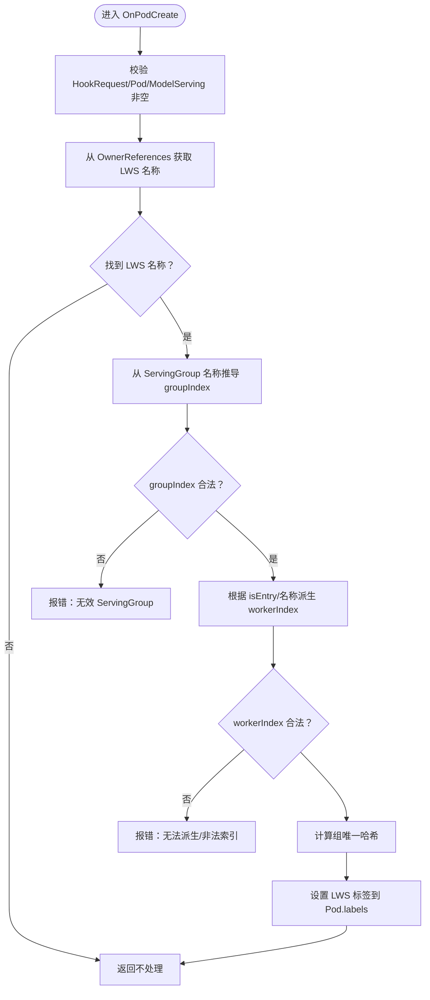
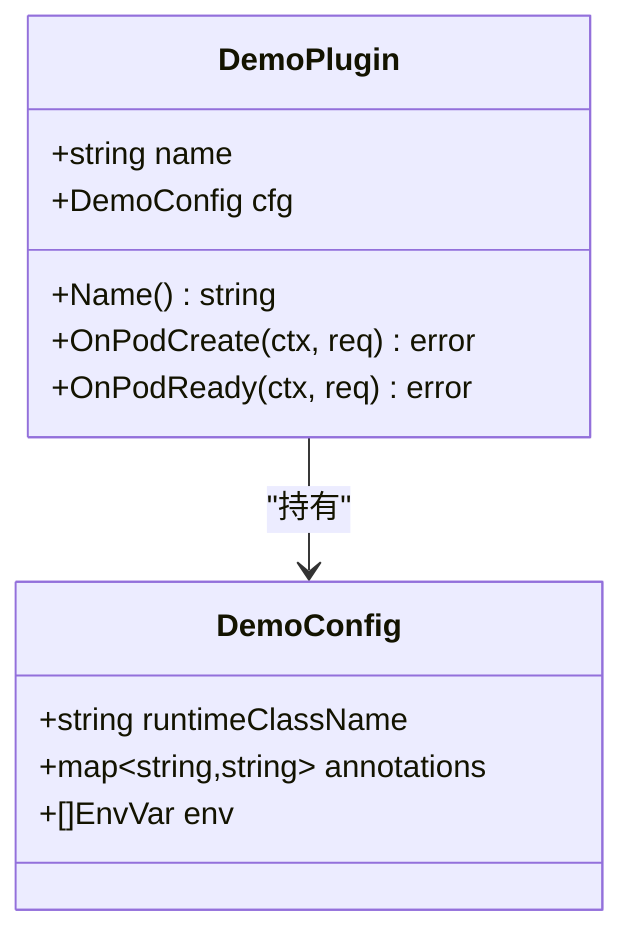
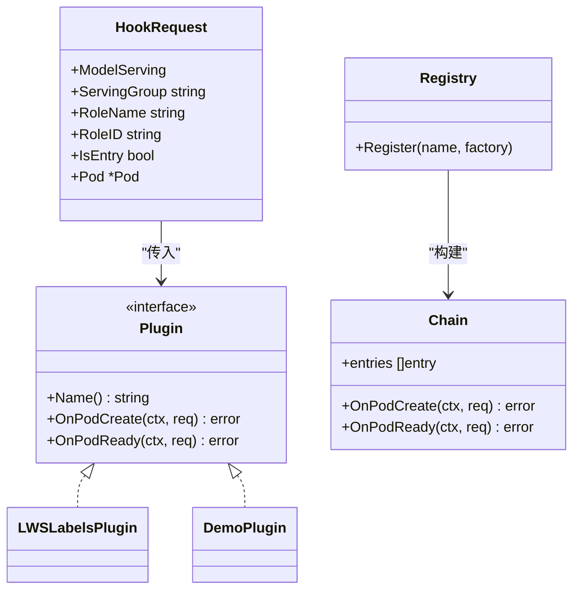
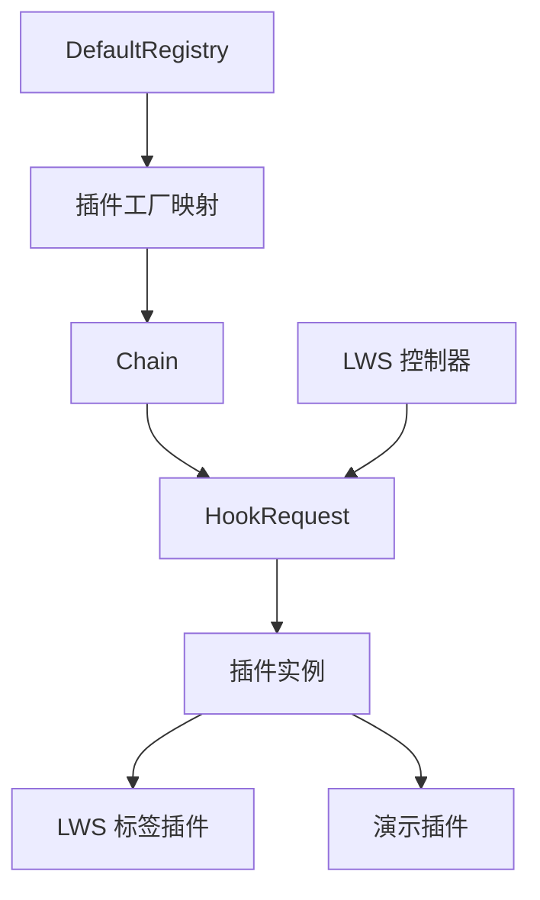

# 内置插件实现

<cite>
**本文引用的文件**
- [lws_labels_plugin.go](file://pkg/model-serving-controller/plugins/lws_labels_plugin.go)
- [demo_plugin.go](file://pkg/model-serving-controller/plugins/demo_plugin.go)
- [types.go](file://pkg/model-serving-controller/plugins/types.go)
- [manager.go](file://pkg/model-serving-controller/plugins/manager.go)
- [model_serving_controller.go](file://pkg/model-serving-controller/controller/model_serving_controller.go)
- [lws_controller.go](file://pkg/model-serving-controller/controller/lws_controller.go)
- [modelserving-plugin-framework.md](file://docs/kthena/docs/user-guide/modelserving-plugin-framework.md)
- [sample.yaml](file://examples/model-serving/sample.yaml)
</cite>

## 目录
1. [简介](#简介)
2. [项目结构](#项目结构)
3. [核心组件](#核心组件)
4. [架构总览](#架构总览)
5. [详细组件分析](#详细组件分析)
6. [依赖分析](#依赖分析)
7. [性能考虑](#性能考虑)
8. [故障排查指南](#故障排查指南)
9. [结论](#结论)
10. [附录](#附录)

## 简介
本文件面向 Kthena 模型推理工作负载控制器中的“内置插件实现”，重点解析以下内容：
- LWS 标签插件（LeaderWorkerSet 标签）的添加逻辑与标签命名规范
- 演示插件的功能与用途，作为插件开发的参考模板
- 插件的作用域配置（角色匹配、目标类型、条件执行）
- 插件配置参数的定义与使用方法
- 插件行为对 Pod 的影响与副作用
- 插件的启用/禁用机制与配置示例
- 插件与其他组件的交互与集成点

## 项目结构
与内置插件实现直接相关的代码位于模型推理控制器的插件框架目录，并与控制器生成 Pod 的流程紧密耦合。

**图表来源**
- [types.go:27-44](file://pkg/model-serving-controller/plugins/types.go#L27-L44)
- [manager.go:30-147](file://pkg/model-serving-controller/plugins/manager.go#L30-L147)
- [lws_labels_plugin.go:34-112](file://pkg/model-serving-controller/plugins/lws_labels_plugin.go#L34-L112)
- [demo_plugin.go:28-88](file://pkg/model-serving-controller/plugins/demo_plugin.go#L28-L88)
- [model_serving_controller.go:104-171](file://pkg/model-serving-controller/controller/model_serving_controller.go#L104-L171)
- [lws_controller.go:319-340](file://pkg/model-serving-controller/controller/lws_controller.go#L319-L340)
- [modelserving-plugin-framework.md:1-166](file://docs/kthena/docs/user-guide/modelserving-plugin-framework.md#L1-L166)
- [sample.yaml:1-46](file://examples/model-serving/sample.yaml#L1-L46)

**章节来源**
- [types.go:27-44](file://pkg/model-serving-controller/plugins/types.go#L27-L44)
- [manager.go:30-147](file://pkg/model-serving-controller/plugins/manager.go#L30-L147)
- [model_serving_controller.go:104-171](file://pkg/model-serving-controller/controller/model_serving_controller.go#L104-L171)

## 核心组件
- 插件接口与请求上下文：定义插件生命周期钩子与调用时携带的上下文信息（如 ModelServing、ServingGroup、Role、是否 Entry Pod、目标 Pod）。
- 插件注册表与执行链：负责按顺序构建与执行插件链，支持作用域过滤（角色、目标类型）。
- LWS 标签插件：在 Pod 创建前为其打上 LWS 相关标签，确保与 LeaderWorkerSet 协同。
- 演示插件：展示如何通过配置变更 Pod 的 runtimeClassName、注解与环境变量，作为自定义插件开发模板。

**章节来源**
- [types.go:27-44](file://pkg/model-serving-controller/plugins/types.go#L27-L44)
- [manager.go:30-147](file://pkg/model-serving-controller/plugins/manager.go#L30-L147)
- [lws_labels_plugin.go:34-112](file://pkg/model-serving-controller/plugins/lws_labels_plugin.go#L34-L112)
- [demo_plugin.go:28-88](file://pkg/model-serving-controller/plugins/demo_plugin.go#L28-L88)

## 架构总览
下图展示了插件在控制器中的执行路径与数据流：

**图表来源**
- [manager.go:82-112](file://pkg/model-serving-controller/plugins/manager.go#L82-L112)
- [lws_labels_plugin.go:50-81](file://pkg/model-serving-controller/plugins/lws_labels_plugin.go#L50-L81)
- [demo_plugin.go:58-83](file://pkg/model-serving-controller/plugins/demo_plugin.go#L58-L83)
- [model_serving_controller.go:104-171](file://pkg/model-serving-controller/controller/model_serving_controller.go#L104-L171)

## 详细组件分析

### LWS 标签插件（LeaderWorkerSet 标签）
- 插件名称与注册：插件以固定名称注册到默认注册表，用于自动发现与实例化。
- 执行时机：在 Pod 创建前调用 OnPodCreate，对 req.Pod 做原地修改。
- 关键逻辑：
  - 从 OwnerReferences 中识别所属 LeaderWorkerSet 名称。
  - 从 ServingGroup 名称中推导组索引（groupIndex），若无效则报错。
  - 从 Pod 名称派生 workerIndex：Entry Pod 固定为 0；非 Entry Pod 从名称末尾数字提取，失败或非法时返回错误。
  - 计算组唯一哈希：基于 LWS 名称与组索引计算哈希，作为组级唯一标识。
  - 设置 LWS 标签：SetName、GroupIndex、WorkerIndex、GroupUniqueHash。
- 标签命名规范（来自 LWS 官方常量）：
  - SetNameLabelKey：标识 Pod 所属的 LeaderWorkerSet 名称
  - GroupIndexLabelKey：标识 Pod 所属组索引
  - WorkerIndexLabelKey：标识 Worker 在组内的索引（Entry 为 0）
  - GroupUniqueHashLabelKey：组唯一哈希，用于跨 Pod 的一致性分组
- 副作用与影响：
  - 使 Pod 与 LWS 控制器正确关联，便于调度、网络拓扑与状态管理
  - 为上层组件（如路由/观测）提供稳定的分组与定位依据

**图表来源**
- [lws_labels_plugin.go:50-112](file://pkg/model-serving-controller/plugins/lws_labels_plugin.go#L50-L112)

**章节来源**
- [lws_labels_plugin.go:34-112](file://pkg/model-serving-controller/plugins/lws_labels_plugin.go#L34-L112)

### 演示插件（参考模板）
- 插件名称与注册：同样注册到默认注册表，便于在 ModelServing 中启用。
- 配置结构：包含 runtimeClassName、annotations、env 三类字段，分别用于设置 Pod 运行时、合并注解、追加环境变量。
- 执行逻辑：
  - 若配置了 runtimeClassName，则设置到 Pod 的 Spec
  - 合并 annotations 到 Pod 注解
  - 将 env 追加到所有容器与 InitContainer
- 适用场景：验证插件链路、作为自定义插件开发模板

**图表来源**
- [demo_plugin.go:28-88](file://pkg/model-serving-controller/plugins/demo_plugin.go#L28-L88)

**章节来源**
- [demo_plugin.go:28-88](file://pkg/model-serving-controller/plugins/demo_plugin.go#L28-L88)

### 插件接口与执行链
- 接口定义：Plugin 接口包含 Name、OnPodCreate、OnPodReady 三个方法，统一插件行为契约。
- HookRequest：承载触发上下文，包括 ModelServing、ServingGroup、RoleName/ID、是否 Entry、目标 Pod。
- 执行链：
  - Registry 维护插件工厂映射
  - Chain 按顺序构建插件实例列表
  - shouldRun 根据 Scope（roles/target）决定是否执行
  - OnPodCreate/OnPodReady 依次调用，错误会中断并重试

**图表来源**
- [types.go:27-44](file://pkg/model-serving-controller/plugins/types.go#L27-L44)
- [manager.go:30-147](file://pkg/model-serving-controller/plugins/manager.go#L30-L147)
- [lws_labels_plugin.go:34-46](file://pkg/model-serving-controller/plugins/lws_labels_plugin.go#L34-L46)
- [demo_plugin.go:43-54](file://pkg/model-serving-controller/plugins/demo_plugin.go#L43-L54)

**章节来源**
- [types.go:27-44](file://pkg/model-serving-controller/plugins/types.go#L27-L44)
- [manager.go:54-147](file://pkg/model-serving-controller/plugins/manager.go#L54-L147)

### 插件作用域与条件执行
- 角色匹配：Scope.Roles 为空表示不限定；否则仅当 HookRequest.RoleName 在 Roles 列表中才执行。
- 目标类型：Scope.Target 支持 Entry、Worker、All；未设置时视为 All。
  - 当 req.IsEntry 为真时，匹配 Entry；否则匹配 Worker。
- 执行顺序：按 ModelServing.spec.plugins 列表顺序执行，每个插件看到的是前序插件已应用的 Pod 变更。

**章节来源**
- [manager.go:114-139](file://pkg/model-serving-controller/plugins/manager.go#L114-L139)

### 插件配置参数定义与使用
- 配置来源：ModelServingSpec.plugins[].config 为任意 JSON 对象，由各插件自行解码。
- 解码工具：DecodeJSON 提供统一的 JSON 解码辅助，避免重复样板代码。
- 使用示例（演示插件）：
  - runtimeClassName：设置 Pod 的运行时类名
  - annotations：合并注解
  - env：追加环境变量到容器与 InitContainer

**章节来源**
- [manager.go:141-147](file://pkg/model-serving-controller/plugins/manager.go#L141-L147)
- [demo_plugin.go:48-54](file://pkg/model-serving-controller/plugins/demo_plugin.go#L48-L54)

### 插件启用/禁用与配置示例
- 启用方式：在 ModelServingSpec.plugins 中声明插件名称、类型（BuiltIn）、可选作用域与配置。
- 禁用方式：不配置 plugins 字段或清空列表，控制器保持原有行为不变。
- 示例参考：用户指南文档提供了完整的 YAML 示例与字段说明，涵盖作用域与配置项。

**章节来源**
- [modelserving-plugin-framework.md:110-166](file://docs/kthena/docs/user-guide/modelserving-plugin-framework.md#L110-L166)

## 依赖分析
- 插件与控制器的耦合：
  - 控制器在初始化时注入 DefaultRegistry，从而获得插件工厂映射
  - 控制器在生成 Pod 前后调用插件链的 OnPodCreate/OnPodReady
- 与 LWS 的集成：
  - LWS 标签插件依赖 LWS 官方标签键常量，确保与 LWS 控制器一致
  - LWS 控制器负责将 LeaderWorkerSet 资源转换为 ModelServing 的 Role/Template，为插件提供上下文（如 ServingGroup、Role）

**图表来源**
- [model_serving_controller.go:104-171](file://pkg/model-serving-controller/controller/model_serving_controller.go#L104-L171)
- [manager.go:59-80](file://pkg/model-serving-controller/plugins/manager.go#L59-L80)
- [lws_controller.go:319-340](file://pkg/model-serving-controller/controller/lws_controller.go#L319-L340)

**章节来源**
- [model_serving_controller.go:104-171](file://pkg/model-serving-controller/controller/model_serving_controller.go#L104-L171)
- [lws_controller.go:319-340](file://pkg/model-serving-controller/controller/lws_controller.go#L319-L340)

## 性能考虑
- 插件链顺序：插件越多，Pod 变更链越长，建议将轻量插件前置，复杂插件靠后。
- 作用域限制：合理使用 Scope.roles 与 Scope.target，减少不必要的插件执行。
- 失败重试：任一插件返回错误会导致控制器重试，应保证插件幂等与快速失败。

## 故障排查指南
- 常见问题与定位：
  - 插件未生效：检查 ModelServing 是否配置 plugins、插件名称是否注册、Scope 是否匹配
  - LWS 标签缺失：确认 Pod 的 OwnerReferences 包含 LeaderWorkerSet，且 ServingGroup 名称格式正确
  - workerIndex 派生失败：检查 Pod 名称格式，确保末尾为数字且非负
- 日志与可观测性：
  - 插件执行状态可通过控制器事件与状态条件进行追踪（参考插件框架文档）

**章节来源**
- [modelserving-plugin-framework.md:1-166](file://docs/kthena/docs/user-guide/modelserving-plugin-framework.md#L1-L166)
- [lws_labels_plugin.go:96-112](file://pkg/model-serving-controller/plugins/lws_labels_plugin.go#L96-L112)

## 结论
- LWS 标签插件通过标准化标签与 LWS 控制器协同，确保 Pod 在多副本/多组场景下的正确识别与管理
- 演示插件提供了清晰的配置与修改模式，是自定义插件开发的最佳实践模板
- 插件框架通过注册表与执行链实现了可组合、可观察、可扩展的定制能力
- 合理配置作用域与顺序，可在保证功能的同时兼顾性能与稳定性

## 附录
- 参考示例：示例 CRD 展示了多角色与多副本的典型配置，可结合插件进行验证与调试

**章节来源**
- [sample.yaml:1-46](file://examples/model-serving/sample.yaml#L1-L46)