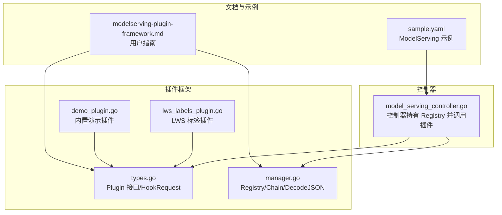
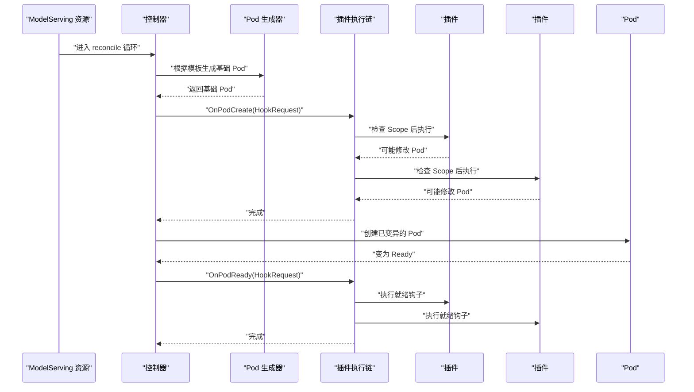
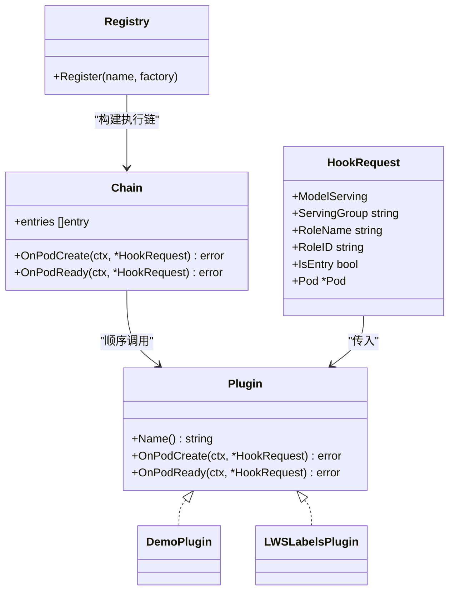
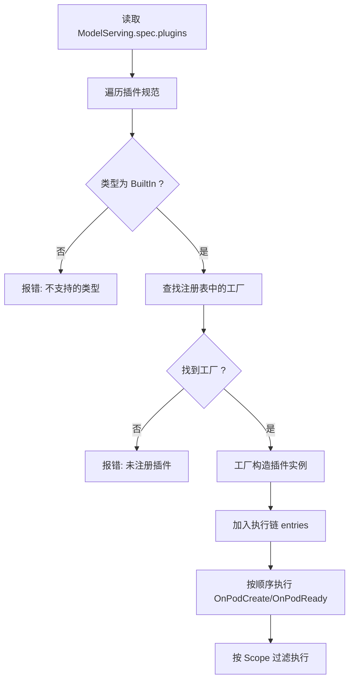
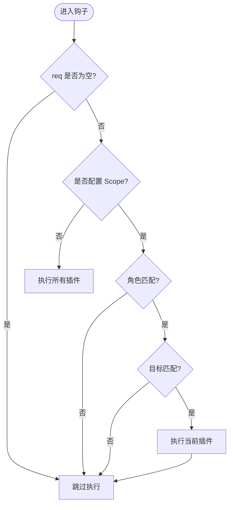
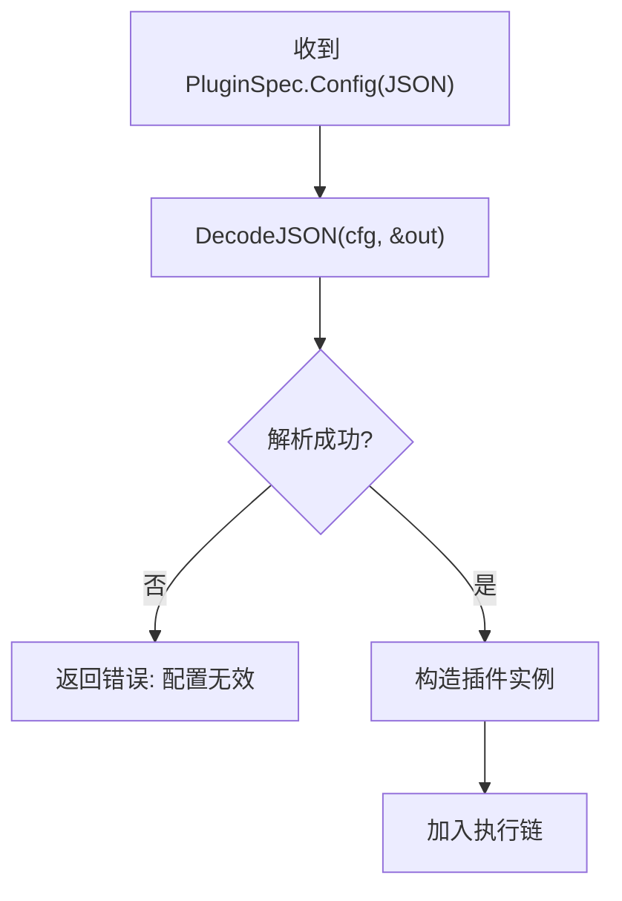
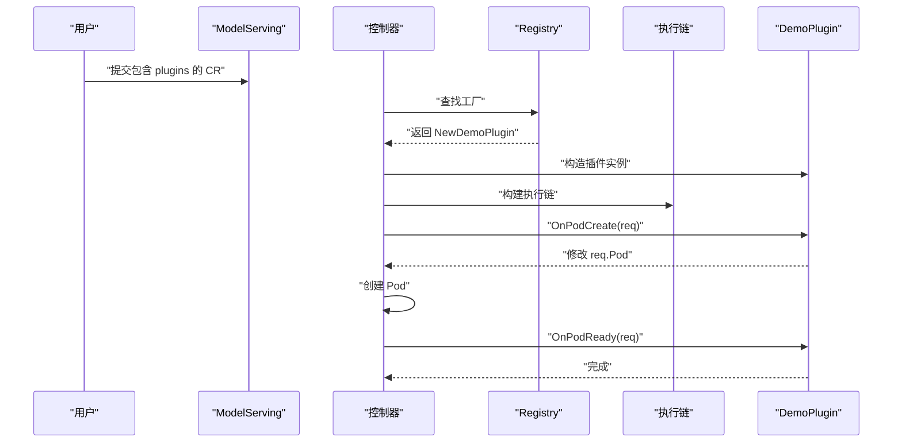
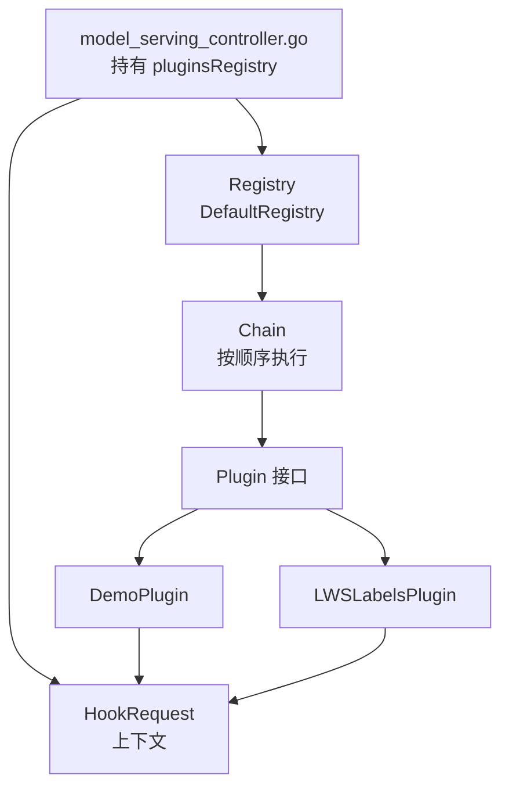

# 插件开发指南

<cite>
**本文引用的文件**
- [types.go](file://pkg/model-serving-controller/plugins/types.go)
- [manager.go](file://pkg/model-serving-controller/plugins/manager.go)
- [demo_plugin.go](file://pkg/model-serving-controller/plugins/demo_plugin.go)
- [lws_labels_plugin.go](file://pkg/model-serving-controller/plugins/lws_labels_plugin.go)
- [modelserving-plugin-framework.md](file://docs/kthena/docs/user-guide/modelserving-plugin-framework.md)
- [pluginspec.go](file://client-go/applyconfiguration/workload/v1alpha1/pluginspec.go)
- [manager_test.go](file://pkg/model-serving-controller/plugins/manager_test.go)
- [demo_plugin_test.go](file://pkg/model-serving-controller/plugins/demo_plugin_test.go)
- [model_serving_controller.go](file://pkg/model-serving-controller/controller/model_serving_controller.go)
- [sample.yaml](file://examples/model-serving/sample.yaml)
</cite>

## 目录
1. [简介](#简介)
2. [项目结构](#项目结构)
3. [核心组件](#核心组件)
4. [架构总览](#架构总览)
5. [详细组件分析](#详细组件分析)
6. [依赖分析](#依赖分析)
7. [性能考虑](#性能考虑)
8. [故障排查指南](#故障排查指南)
9. [结论](#结论)
10. [附录](#附录)

## 简介
本指南面向希望为 Kthena ModelServing 控制器开发自定义插件的开发者，系统讲解插件接口与生命周期钩子、插件注册与配置解析、HookRequest 上下文使用、作用域控制（角色与目标）、错误处理与可观测性、测试与调试方法、性能优化建议，以及版本兼容与迁移注意事项。文档同时提供从零到一的完整开发流程与参考实现。

## 项目结构
与插件框架直接相关的核心位置如下：
- 插件接口与执行链：pkg/model-serving-controller/plugins
- 控制器集成点：pkg/model-serving-controller/controller/model_serving_controller.go
- 用户指南与示例：docs/kthena/docs/user-guide/modelserving-plugin-framework.md
- 配置结构声明：client-go/applyconfiguration/workload/v1alpha1/pluginspec.go
- 示例清单：examples/model-serving/sample.yaml

**图表来源**
- [types.go:27-44](file://pkg/model-serving-controller/plugins/types.go#L27-L44)
- [manager.go:30-80](file://pkg/model-serving-controller/plugins/manager.go#L30-L80)
- [demo_plugin.go:28-54](file://pkg/model-serving-controller/plugins/demo_plugin.go#L28-L54)
- [lws_labels_plugin.go:34-46](file://pkg/model-serving-controller/plugins/lws_labels_plugin.go#L34-L46)
- [model_serving_controller.go:100-102](file://pkg/model-serving-controller/controller/model_serving_controller.go#L100-L102)
- [modelserving-plugin-framework.md:1-166](file://docs/kthena/docs/user-guide/modelserving-plugin-framework.md#L1-L166)
- [sample.yaml:1-46](file://examples/model-serving/sample.yaml#L1-L46)

**章节来源**
- [types.go:27-44](file://pkg/model-serving-controller/plugins/types.go#L27-L44)
- [manager.go:30-80](file://pkg/model-serving-controller/plugins/manager.go#L30-L80)
- [model_serving_controller.go:100-102](file://pkg/model-serving-controller/controller/model_serving_controller.go#L100-L102)
- [modelserving-plugin-framework.md:1-166](file://docs/kthena/docs/user-guide/modelserving-plugin-framework.md#L1-L166)
- [pluginspec.go:26-39](file://client-go/applyconfiguration/workload/v1alpha1/pluginspec.go#L26-L39)
- [sample.yaml:1-46](file://examples/model-serving/sample.yaml#L1-L46)

## 核心组件
- 插件接口 Plugin
  - 必需方法：Name()、OnPodCreate(ctx, *HookRequest)、OnPodReady(ctx, *HookRequest)
  - 插件通过工厂函数由 Registry 注册并实例化
- HookRequest 上下文
  - 携带 ModelServing、ServingGroup、RoleName、RoleID、IsEntry、Pod 等信息
- 执行链 Chain
  - 按配置顺序执行插件；支持按 Scope 过滤（角色与目标 Entry/Worker/All）
- 工厂与注册表 Registry
  - 提供默认注册表 DefaultRegistry，支持注册与查找
- JSON 解析工具 DecodeJSON
  - 将 apiextensions v1 JSON 配置解码到插件配置结构体

**章节来源**
- [types.go:27-44](file://pkg/model-serving-controller/plugins/types.go#L27-L44)
- [manager.go:30-80](file://pkg/model-serving-controller/plugins/manager.go#L30-L80)
- [manager.go:141-147](file://pkg/model-serving-controller/plugins/manager.go#L141-L147)

## 架构总览
插件在 Pod 生成前与就绪时分别触发 OnPodCreate 与 OnPodReady 钩子，按配置顺序执行，且可通过 Scope 控制运行范围。

**图表来源**
- [modelserving-plugin-framework.md:13-39](file://docs/kthena/docs/user-guide/modelserving-plugin-framework.md#L13-L39)
- [manager.go:82-112](file://pkg/model-serving-controller/plugins/manager.go#L82-L112)
- [types.go:27-35](file://pkg/model-serving-controller/plugins/types.go#L27-L35)

## 详细组件分析

### 插件接口与 HookRequest
- Plugin 接口
  - Name(): 返回插件名称（用于事件与日志）
  - OnPodCreate(ctx, *HookRequest): 在 Pod 创建前进行就地变更（标签、注解、环境变量、容器等）
  - OnPodReady(ctx, *HookRequest): 在 Pod 就绪后进行记录或指标上报等操作
- HookRequest 字段
  - ModelServing: 当前 ModelServing 对象
  - ServingGroup: 所属 Serving 组名
  - RoleName/RoleID: 角色名与角色 ID
  - IsEntry: 是否为入口 Pod
  - Pod: 待修改的 Pod 指针（可为空）

**图表来源**
- [types.go:27-44](file://pkg/model-serving-controller/plugins/types.go#L27-L44)
- [manager.go:30-57](file://pkg/model-serving-controller/plugins/manager.go#L30-L57)
- [demo_plugin.go:37-41](file://pkg/model-serving-controller/plugins/demo_plugin.go#L37-L41)
- [lws_labels_plugin.go:36-38](file://pkg/model-serving-controller/plugins/lws_labels_plugin.go#L36-L38)

**章节来源**
- [types.go:27-44](file://pkg/model-serving-controller/plugins/types.go#L27-L44)

### 插件注册与执行链
- Registry
  - 默认注册表 DefaultRegistry
  - Register(name, factory) 完成插件注册
- Chain
  - NewChain(registry, specs) 基于插件规范列表构建有序执行链
  - OnPodCreate/OnPodReady 依次调用每个插件钩子
  - shouldRun 根据 Scope 决定是否执行（角色匹配、目标匹配）
- DecodeJSON
  - 将 apiextensions v1 JSON 解码到插件配置结构体

**图表来源**
- [manager.go:59-80](file://pkg/model-serving-controller/plugins/manager.go#L59-L80)
- [manager.go:122-139](file://pkg/model-serving-controller/plugins/manager.go#L122-L139)

**章节来源**
- [manager.go:30-80](file://pkg/model-serving-controller/plugins/manager.go#L30-L80)
- [manager.go:122-139](file://pkg/model-serving-controller/plugins/manager.go#L122-L139)

### HookRequest 上下文与作用域
- 上下文字段
  - 通过 HookRequest 传递给插件，插件可在 OnPodCreate 中直接修改 req.Pod
- 作用域控制
  - Scope.Roles：限制仅在指定角色中运行
  - Scope.Target：限制在 Entry、Worker 或 All 中运行
  - shouldRun 会综合角色与目标进行判断

**图表来源**
- [manager.go:122-139](file://pkg/model-serving-controller/plugins/manager.go#L122-L139)

**章节来源**
- [manager.go:122-139](file://pkg/model-serving-controller/plugins/manager.go#L122-L139)

### JSON 配置解析与验证
- 插件配置以 apiextensions v1 JSON 形式存储在 PluginSpec.Config
- 插件侧使用 DecodeJSON(cfg, &out) 解析到自定义配置结构体
- 若配置为空或格式不合法，应在工厂函数中返回错误，避免后续执行

**图表来源**
- [manager.go:141-147](file://pkg/model-serving-controller/plugins/manager.go#L141-L147)
- [demo_plugin.go:47-54](file://pkg/model-serving-controller/plugins/demo_plugin.go#L47-L54)

**章节来源**
- [manager.go:141-147](file://pkg/model-serving-controller/plugins/manager.go#L141-L147)
- [demo_plugin.go:47-54](file://pkg/model-serving-controller/plugins/demo_plugin.go#L47-L54)

### 完整开发示例：演示插件
- 插件名称：demo-pod-tweaks
- 功能：设置 runtimeClassName、合并注解、为所有容器追加环境变量
- 关键步骤
  - 定义 DemoConfig 结构体
  - 实现 NewDemoPlugin 工厂函数，使用 DecodeJSON 解析配置
  - 实现 Plugin 接口：Name、OnPodCreate、OnPodReady
  - 在 init() 中注册到 DefaultRegistry
- 使用示例
  - 在 ModelServing.spec.plugins 中添加该插件，并提供 config

**图表来源**
- [demo_plugin.go:28-88](file://pkg/model-serving-controller/plugins/demo_plugin.go#L28-L88)
- [modelserving-plugin-framework.md:110-137](file://docs/kthena/docs/user-guide/modelserving-plugin-framework.md#L110-L137)

**章节来源**
- [demo_plugin.go:28-88](file://pkg/model-serving-controller/plugins/demo_plugin.go#L28-L88)
- [modelserving-plugin-framework.md:110-137](file://docs/kthena/docs/user-guide/modelserving-plugin-framework.md#L110-L137)

### 参考实现：LWS 标签插件
- 用途：为基于 LeaderWorkerSet 的 Pod 设置标准标签（SetName、GroupIndex、WorkerIndex、GroupUniqueHash）
- 关键逻辑
  - 从 ModelServing.OwnerReferences 中提取 LWS 名称
  - 从 ServingGroup 推导组索引
  - 从 Pod 名称推导 Worker 索引
  - 将标签写入 req.Pod.Labels

**章节来源**
- [lws_labels_plugin.go:34-113](file://pkg/model-serving-controller/plugins/lws_labels_plugin.go#L34-L113)

## 依赖分析
- 控制器持有插件注册表并负责在 Pod 生成前后调用插件
- 插件通过 Registry 与 Chain 解耦，便于扩展与测试
- 插件配置通过 apiextensions v1 JSON 传递，确保跨版本兼容

**图表来源**
- [model_serving_controller.go:100-102](file://pkg/model-serving-controller/controller/model_serving_controller.go#L100-L102)
- [manager.go:30-57](file://pkg/model-serving-controller/plugins/manager.go#L30-L57)
- [types.go:27-44](file://pkg/model-serving-controller/plugins/types.go#L27-L44)

**章节来源**
- [model_serving_controller.go:100-102](file://pkg/model-serving-controller/controller/model_serving_controller.go#L100-L102)
- [manager.go:30-57](file://pkg/model-serving-controller/plugins/manager.go#L30-L57)
- [types.go:27-44](file://pkg/model-serving-controller/plugins/types.go#L27-L44)

## 性能考虑
- 插件应尽量轻量，避免在 OnPodCreate 中进行阻塞操作
- 复用 DecodeJSON，减少重复解析开销
- 合理使用 Scope，避免不必要的插件执行
- 在 OnPodReady 中仅做非关键路径操作（如日志与指标），避免影响 Pod 就绪时间
- 大规模部署时，建议将插件拆分为多个小功能，降低单个插件复杂度

## 故障排查指南
- 常见问题
  - 插件未注册：NewChain 报错“未注册插件”
  - 类型不支持：NewChain 报错“不支持的类型”
  - 配置解析失败：DecodeJSON 返回错误
  - 插件执行失败：OnPodCreate/OnPodReady 返回错误导致重试
- 调试建议
  - 使用控制器事件与状态条件观察插件执行情况
  - 在插件内部增加日志，定位具体失败点
  - 单元测试覆盖 OnPodCreate/OnPodReady 的关键分支
- 测试要点
  - 验证作用域过滤（角色与目标）行为
  - 验证错误传播与重试机制
  - 验证配置解析边界情况（空配置、非法 JSON）

**章节来源**
- [manager_test.go:95-115](file://pkg/model-serving-controller/plugins/manager_test.go#L95-L115)
- [demo_plugin_test.go:30-73](file://pkg/model-serving-controller/plugins/demo_plugin_test.go#L30-L73)

## 结论
Kthena 的 ModelServing 插件框架提供了清晰的接口、灵活的作用域控制与可靠的执行链管理。遵循本文档的开发流程与最佳实践，可以快速实现稳定、可维护、可测试的插件，并在生产环境中安全演进。

## 附录

### 开发标准流程
- 实现 Plugin 接口：Name、OnPodCreate、OnPodReady
- 定义配置结构体并使用 DecodeJSON 解析
- 编写工厂函数与 init() 注册
- 编写单元测试与集成测试
- 在 ModelServing 中启用插件并验证效果

**章节来源**
- [modelserving-plugin-framework.md:62-108](file://docs/kthena/docs/user-guide/modelserving-plugin-framework.md#L62-L108)

### HookRequest 字段说明
- ModelServing：当前资源对象
- ServingGroup：所属 Serving 组名
- RoleName/RoleID：角色名与角色 ID
- IsEntry：是否为入口 Pod
- Pod：待修改的 Pod 指针

**章节来源**
- [types.go:27-35](file://pkg/model-serving-controller/plugins/types.go#L27-L35)

### 插件配置 JSON 解析与验证
- 使用 DecodeJSON 将 apiextensions v1 JSON 解析到结构体
- 对空配置与非法 JSON 进行显式校验
- 在工厂函数中尽早返回错误，避免后续执行

**章节来源**
- [manager.go:141-147](file://pkg/model-serving-controller/plugins/manager.go#L141-L147)
- [demo_plugin.go:47-54](file://pkg/model-serving-controller/plugins/demo_plugin.go#L47-L54)

### 插件测试方法与调试技巧
- 单元测试：验证 OnPodCreate/OnPodReady 行为、作用域过滤、错误传播
- 集成测试：在控制器中启用插件并验证 Pod 变更
- 调试：利用控制器事件与日志定位问题

**章节来源**
- [manager_test.go:59-93](file://pkg/model-serving-controller/plugins/manager_test.go#L59-L93)
- [demo_plugin_test.go:30-73](file://pkg/model-serving-controller/plugins/demo_plugin_test.go#L30-L73)

### 版本兼容性、向后兼容与迁移指南
- 插件配置采用 apiextensions v1 JSON，具备较好的跨版本稳定性
- 新增插件时保持接口不变，避免破坏现有插件
- 迁移时优先通过 Scope 控制运行范围，逐步替换旧逻辑
- 发布新版本时保留对旧配置字段的兼容解析（如必要）

**章节来源**
- [pluginspec.go:26-39](file://client-go/applyconfiguration/workload/v1alpha1/pluginspec.go#L26-L39)