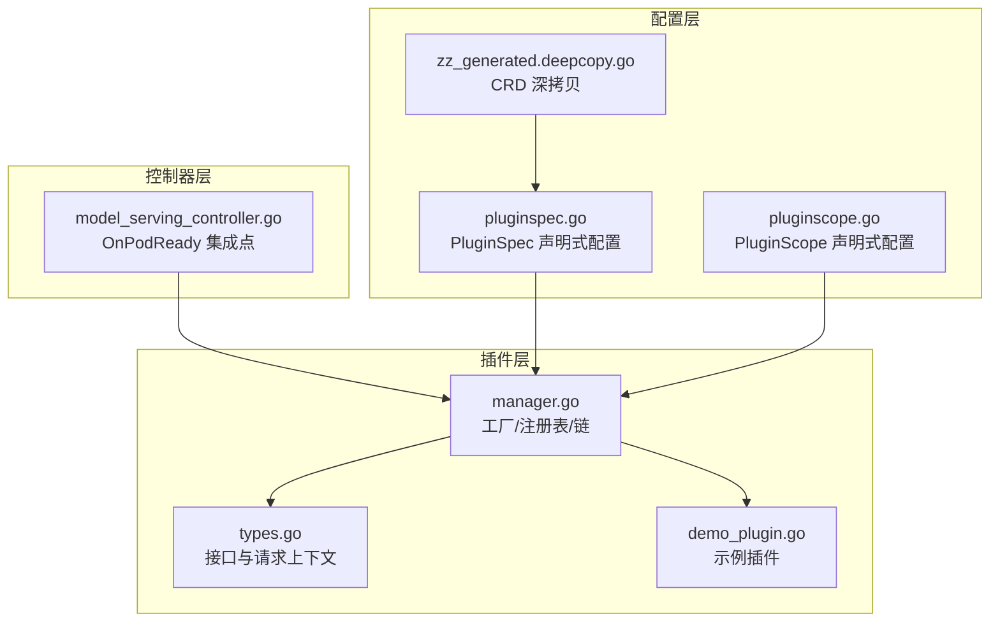
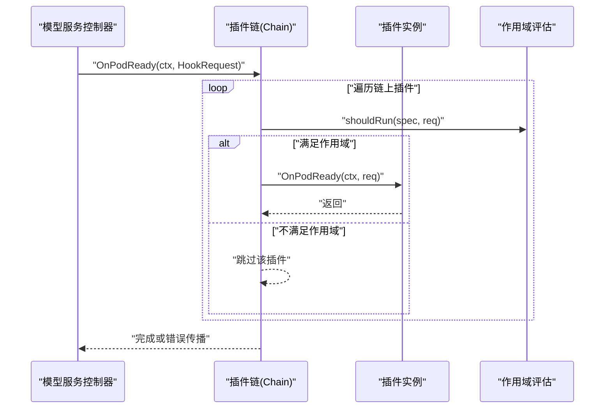
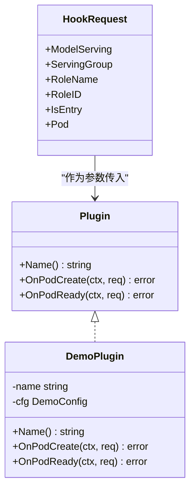
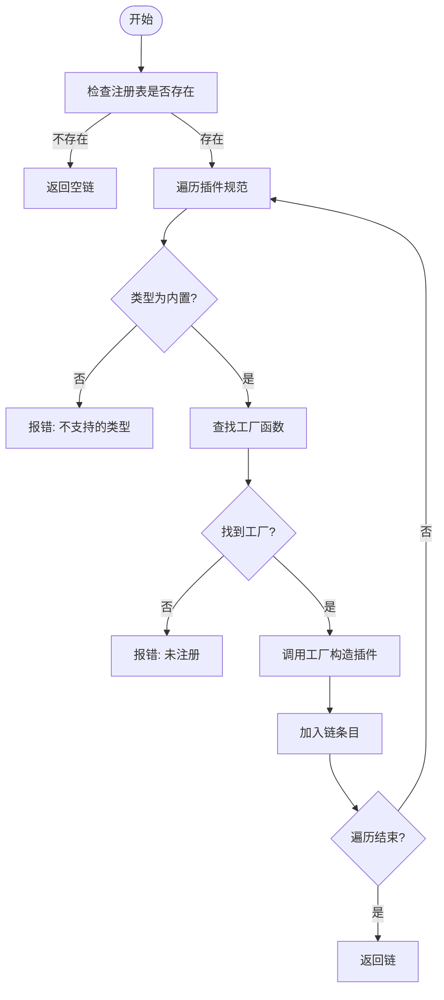
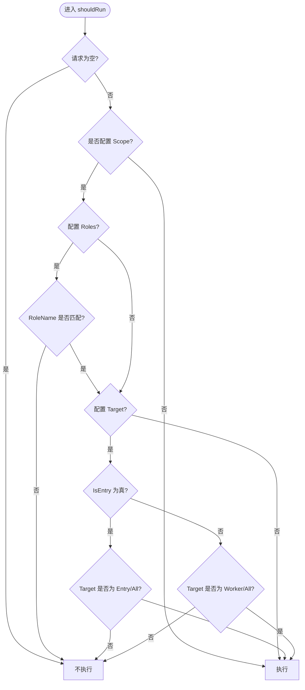
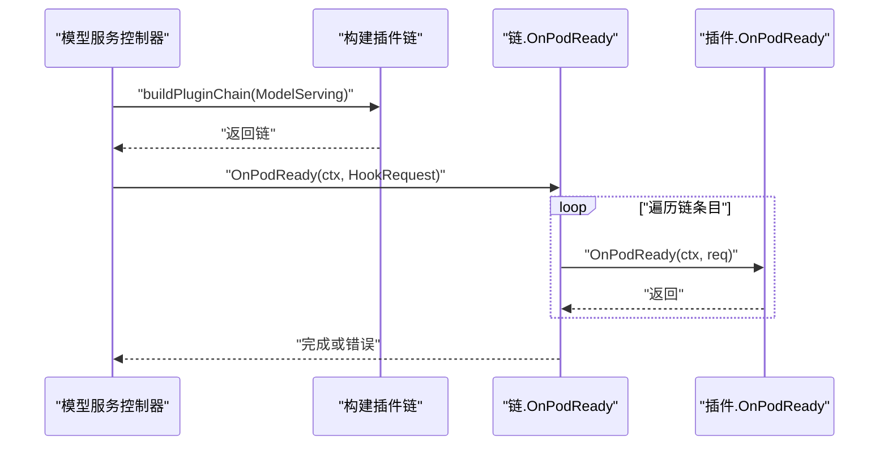
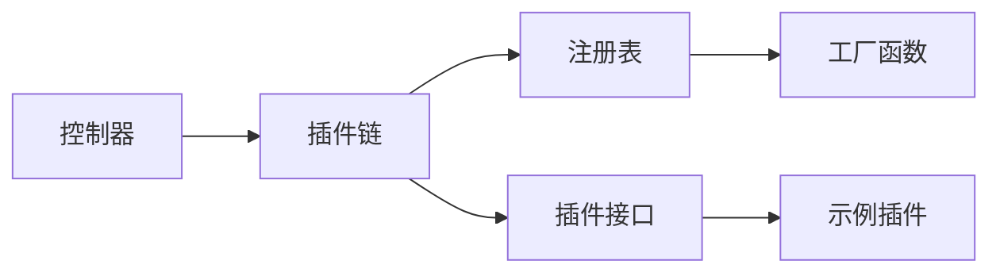

# 插件架构设计

<cite>
**本文引用的文件**
- [types.go](file://pkg/model-serving-controller/plugins/types.go)
- [manager.go](file://pkg/model-serving-controller/plugins/manager.go)
- [demo_plugin.go](file://pkg/model-serving-controller/plugins/demo_plugin.go)
- [model_serving_controller.go](file://pkg/model-serving-controller/controller/model_serving_controller.go)
- [pluginspec.go](file://client-go/applyconfiguration/workload/v1alpha1/pluginspec.go)
- [pluginscope.go](file://client-go/applyconfiguration/workload/v1alpha1/pluginscope.go)
- [zz_generated.deepcopy.go](file://pkg/apis/workload/v1alpha1/zz_generated.deepcopy.go)
</cite>

## 目录
1. [引言](#引言)
2. [项目结构](#项目结构)
3. [核心组件](#核心组件)
4. [架构总览](#架构总览)
5. [详细组件分析](#详细组件分析)
6. [依赖分析](#依赖分析)
7. [性能考虑](#性能考虑)
8. [故障排查指南](#故障排查指南)
9. [结论](#结论)
10. [附录](#附录)

## 引言
本文件面向 Kthena 模型服务控制器中的插件框架，系统性阐述插件接口定义、工厂模式与注册表机制、插件链构建流程、生命周期钩子（OnPodCreate、OnPodReady）的执行顺序与作用域评估、以及插件作用域系统（角色匹配、目标类型判断、条件执行逻辑）。同时给出扩展点、设计原则与最佳实践，帮助开发者在保证插件隔离、健壮错误处理与性能的前提下进行扩展。

## 项目结构
Kthena 的插件体系主要位于模型服务控制器的插件包中，并通过 CRD 配置对象进行声明式编排。关键位置如下：
- 插件接口与链：pkg/model-serving-controller/plugins
- 控制器集成点：pkg/model-serving-controller/controller/model_serving_controller.go
- 插件配置声明式 API：client-go/applyconfiguration/workload/v1alpha1
- CRD 类型深度拷贝：pkg/apis/workload/v1alpha1

图表来源
- [types.go:27-44](file://pkg/model-serving-controller/plugins/types.go#L27-L44)
- [manager.go:30-147](file://pkg/model-serving-controller/plugins/manager.go#L30-L147)
- [demo_plugin.go:28-88](file://pkg/model-serving-controller/plugins/demo_plugin.go#L28-L88)
- [model_serving_controller.go:1240-1256](file://pkg/model-serving-controller/controller/model_serving_controller.go#L1240-L1256)
- [pluginspec.go:26-71](file://client-go/applyconfiguration/workload/v1alpha1/pluginspec.go#L26-L71)
- [pluginscope.go:25-54](file://client-go/applyconfiguration/workload/v1alpha1/pluginscope.go#L25-L54)
- [zz_generated.deepcopy.go:791-814](file://pkg/apis/workload/v1alpha1/zz_generated.deepcopy.go#L791-L814)

章节来源
- [types.go:19-44](file://pkg/model-serving-controller/plugins/types.go#L19-L44)
- [manager.go:30-147](file://pkg/model-serving-controller/plugins/manager.go#L30-L147)
- [model_serving_controller.go:1240-1256](file://pkg/model-serving-controller/controller/model_serving_controller.go#L1240-L1256)
- [pluginspec.go:26-71](file://client-go/applyconfiguration/workload/v1alpha1/pluginspec.go#L26-L71)
- [pluginscope.go:25-54](file://client-go/applyconfiguration/workload/v1alpha1/pluginscope.go#L25-L54)
- [zz_generated.deepcopy.go:791-814](file://pkg/apis/workload/v1alpha1/zz_generated.deepcopy.go#L791-L814)

## 核心组件
- 插件接口与请求上下文
  - 接口定义包含名称、OnPodCreate、OnPodReady 三个方法，用于在 Pod 创建前与就绪后执行插件逻辑。
  - 请求上下文携带 ModelServing、ServingGroup、RoleName、RoleID、IsEntry、Pod 等信息，便于插件按角色与目标类型做条件执行。
- 工厂与注册表
  - Registry 维护插件名到工厂函数的映射；默认注册表在包初始化时注册内置插件。
  - Factory 负责从 PluginSpec 构造具体插件实例，支持配置解码。
- 插件链
  - Chain 由有序的插件条目组成，按配置顺序依次执行；支持作用域评估决定是否执行。
  - 提供 OnPodCreate 与 OnPodReady 两个钩子的顺序执行能力。
- 作用域系统
  - 支持基于角色（Roles）与目标类型（Target）的条件执行；支持 Entry/Worker/All 三种目标类型。
- 控制器集成
  - 控制器在观察到 Pod 就绪后调用链的 OnPodReady，完成插件执行。

章节来源
- [types.go:27-44](file://pkg/model-serving-controller/plugins/types.go#L27-L44)
- [manager.go:30-147](file://pkg/model-serving-controller/plugins/manager.go#L30-L147)
- [demo_plugin.go:28-88](file://pkg/model-serving-controller/plugins/demo_plugin.go#L28-L88)
- [model_serving_controller.go:1240-1256](file://pkg/model-serving-controller/controller/model_serving_controller.go#L1240-L1256)

## 架构总览
下图展示插件框架的整体交互：控制器在 Pod 就绪时触发插件链执行，链根据作用域评估决定每个插件是否运行，最终逐个调用插件的 OnPodReady 钩子。

图表来源
- [model_serving_controller.go:1240-1256](file://pkg/model-serving-controller/controller/model_serving_controller.go#L1240-L1256)
- [manager.go:98-139](file://pkg/model-serving-controller/plugins/manager.go#L98-L139)

## 详细组件分析

### 插件接口与生命周期
- 接口职责
  - Name(): 返回插件标识，用于错误报告与日志。
  - OnPodCreate(ctx, req): 在 Pod 创建前执行，可对 req.Pod 进行原地变更。
  - OnPodReady(ctx, req): 在 Pod 就绪后执行，通常用于状态同步、指标上报等。
- 生命周期顺序
  - OnPodCreate 在 Pod 创建前按链顺序执行。
  - OnPodReady 在 Pod 就绪后按链顺序执行。
- 执行控制
  - 若链为空或为 nil，钩子直接返回。
  - 每个插件的错误会被包装并向上返回，中断后续执行。

图表来源
- [types.go:27-44](file://pkg/model-serving-controller/plugins/types.go#L27-L44)
- [demo_plugin.go:37-88](file://pkg/model-serving-controller/plugins/demo_plugin.go#L37-L88)

章节来源
- [types.go:27-44](file://pkg/model-serving-controller/plugins/types.go#L27-L44)
- [demo_plugin.go:37-88](file://pkg/model-serving-controller/plugins/demo_plugin.go#L37-L88)

### 工厂模式与注册表
- 注册表
  - Registry 维护插件名到工厂函数的映射；提供 Register 方法注册插件。
  - 默认注册表在包初始化时注册内置插件（如 DemoPlugin）。
- 工厂
  - Factory 函数接收 PluginSpec 并返回具体插件实例；负责解析配置并构造插件。
- 插件链构建
  - NewChain 从插件规范列表构建链：校验类型、查找工厂、实例化插件并记录原始规范以供作用域评估。

图表来源
- [manager.go:59-80](file://pkg/model-serving-controller/plugins/manager.go#L59-L80)

章节来源
- [manager.go:30-80](file://pkg/model-serving-controller/plugins/manager.go#L30-L80)

### 插件链执行与作用域评估
- 作用域评估 shouldRun
  - 若请求为空，直接不执行。
  - 若未设置 Scope，则默认执行。
  - 若配置了 Roles，仅当 RoleName 匹配时才执行。
  - 若未设置 Target 或 Target 为 All，则默认执行。
  - 否则根据 IsEntry 判断是否匹配 Entry 或 Worker。
- 执行顺序
  - OnPodCreate 与 OnPodReady 均按链上顺序依次执行。
  - 每个插件的错误被包装并立即返回，避免后续插件继续执行。

图表来源
- [manager.go:122-139](file://pkg/model-serving-controller/plugins/manager.go#L122-L139)

章节来源
- [manager.go:82-139](file://pkg/model-serving-controller/plugins/manager.go#L82-L139)

### 控制器集成点：OnPodReady 钩子
- 控制器在观察到 Pod 就绪后，会构建插件链并调用链的 OnPodReady。
- 请求上下文包含模型服务、所属 ServingGroup、角色名/ID、是否入口 Pod、以及 Pod 对象本身。
- 任一插件执行失败将导致错误返回，避免后续插件继续执行。

图表来源
- [model_serving_controller.go:1240-1256](file://pkg/model-serving-controller/controller/model_serving_controller.go#L1240-L1256)
- [manager.go:98-112](file://pkg/model-serving-controller/plugins/manager.go#L98-L112)

章节来源
- [model_serving_controller.go:1240-1256](file://pkg/model-serving-controller/controller/model_serving_controller.go#L1240-L1256)
- [manager.go:82-112](file://pkg/model-serving-controller/plugins/manager.go#L82-L112)

### 配置与声明式 API
- PluginSpec
  - 字段包含 name、type、config、scope；可通过声明式构建器设置。
- PluginScope
  - 字段包含 roles（字符串数组）与 target（枚举），用于作用域控制。
- CRD 深拷贝
  - 自动生成的深度拷贝函数确保 PluginSpec 与 PodTemplateSpec 的安全复制。

章节来源
- [pluginspec.go:26-71](file://client-go/applyconfiguration/workload/v1alpha1/pluginspec.go#L26-L71)
- [pluginscope.go:25-54](file://client-go/applyconfiguration/workload/v1alpha1/pluginscope.go#L25-L54)
- [zz_generated.deepcopy.go:791-814](file://pkg/apis/workload/v1alpha1/zz_generated.deepcopy.go#L791-L814)

## 依赖分析
- 组件耦合
  - 插件链依赖注册表与工厂；插件实现依赖 HookRequest 上下文。
  - 控制器仅依赖链接口，不关心具体插件实现，保持良好解耦。
- 外部依赖
  - 使用 Kubernetes JSON 解析工具进行配置反序列化。
  - 使用 slices.Contains 进行角色匹配，提升可读性与性能。
- 循环依赖
  - 未发现循环导入；插件接口与链位于同一包，控制器通过链接口调用。

图表来源
- [manager.go:30-80](file://pkg/model-serving-controller/plugins/manager.go#L30-L80)
- [demo_plugin.go:43-45](file://pkg/model-serving-controller/plugins/demo_plugin.go#L43-L45)
- [model_serving_controller.go:1240-1256](file://pkg/model-serving-controller/controller/model_serving_controller.go#L1240-L1256)

章节来源
- [manager.go:30-80](file://pkg/model-serving-controller/plugins/manager.go#L30-L80)
- [demo_plugin.go:43-45](file://pkg/model-serving-controller/plugins/demo_plugin.go#L43-L45)
- [model_serving_controller.go:1240-1256](file://pkg/model-serving-controller/controller/model_serving_controller.go#L1240-L1256)

## 性能考虑
- 插件链顺序执行
  - 顺序执行确保语义正确，但可能成为瓶颈。建议：
    - 将轻量插件前置，耗时插件尽量异步化或延迟执行。
    - 合理使用作用域过滤，避免不必要的插件执行。
- 配置解析
  - 使用 DecodeJSON 进行一次性解析，避免重复解析开销。
- 角色与目标匹配
  - 使用 slices.Contains 与常量比较，时间复杂度低；若角色集合较大，可考虑哈希集优化。

## 故障排查指南
- 插件未注册
  - 现象：构建链时报“插件未注册”。
  - 排查：确认插件已在包初始化阶段注册到默认注册表。
- 类型不支持
  - 现象：构建链时报“不支持的类型”。
  - 排查：确保 PluginSpec 的 Type 为内置类型。
- 插件执行错误
  - 现象：OnPodReady 报错，错误信息包含插件名。
  - 排查：定位具体插件实现，检查配置与上下文；必要时在插件内部增加日志。
- 作用域不生效
  - 现象：插件未按预期执行。
  - 排查：核对 PluginScope 的 Roles 与 Target 设置；确认 Pod 的角色与 IsEntry 标记。

章节来源
- [manager.go:60-79](file://pkg/model-serving-controller/plugins/manager.go#L60-L79)
- [manager.go:98-112](file://pkg/model-serving-controller/plugins/manager.go#L98-L112)
- [manager.go:122-139](file://pkg/model-serving-controller/plugins/manager.go#L122-L139)

## 结论
Kthena 的插件框架以清晰的接口、工厂与注册表机制为基础，结合声明式配置与作用域评估，实现了可扩展、可维护且可控的插件链执行模型。通过 OnPodCreate 与 OnPodReady 的生命周期钩子，插件可在关键节点对 Pod 进行精细化控制。遵循本文的设计原则与最佳实践，可进一步增强插件隔离、错误处理与性能表现。

## 附录
- 设计原则
  - 单一职责：每个插件专注一个领域。
  - 可测试性：插件实现应易于单元测试与集成测试。
  - 可观测性：插件应在关键路径输出日志与指标。
  - 安全性：插件不得越权修改非预期字段。
- 扩展点
  - 新增插件：实现 Plugin 接口并通过 init 注册到默认注册表。
  - 自定义作用域：在 shouldRun 中扩展匹配规则。
  - 配置解码：利用 DecodeJSON 解析复杂配置结构。