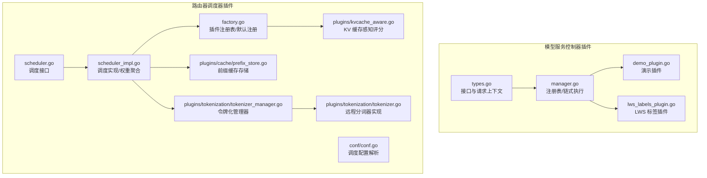
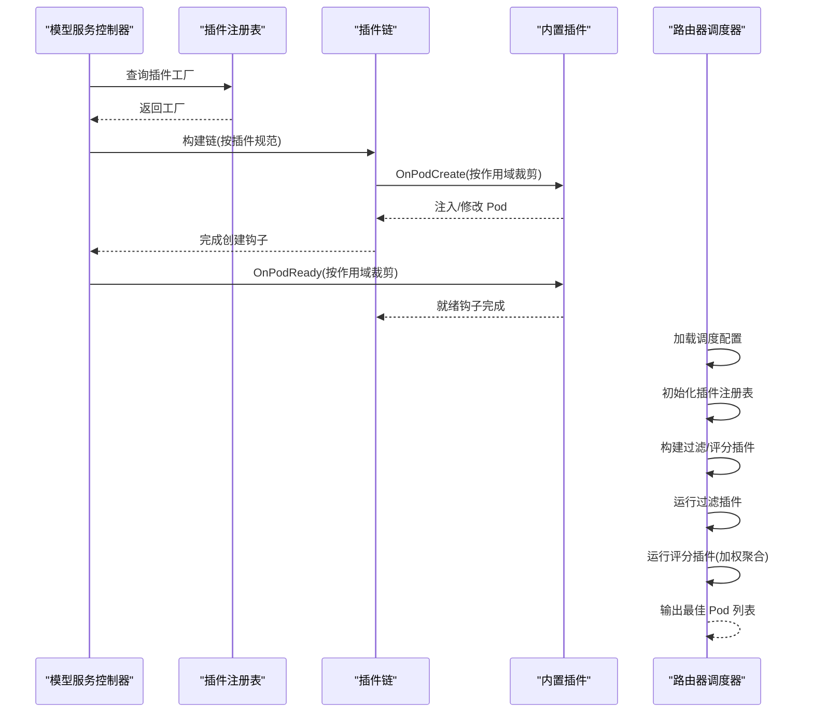
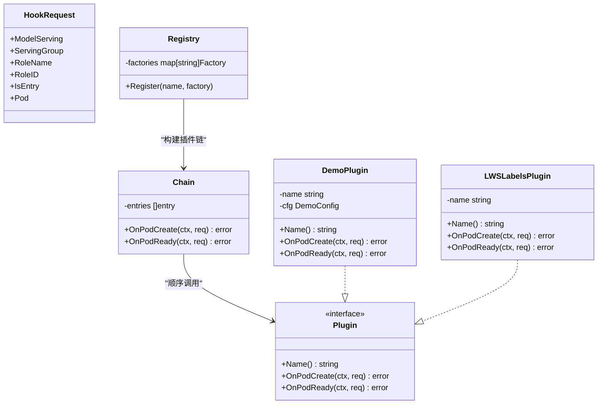
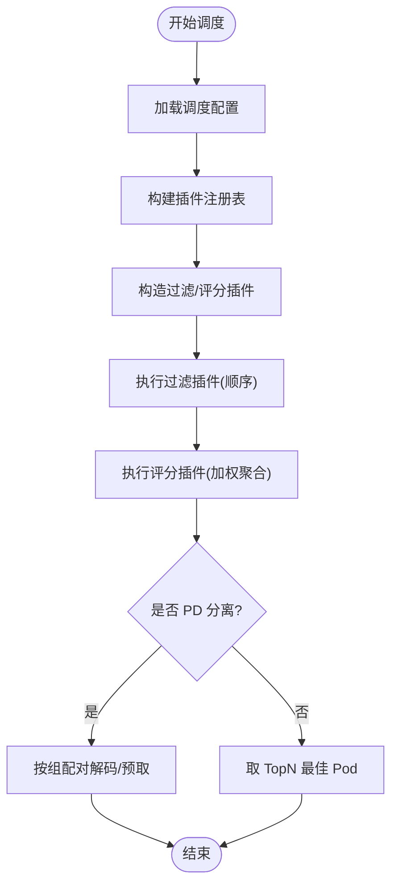
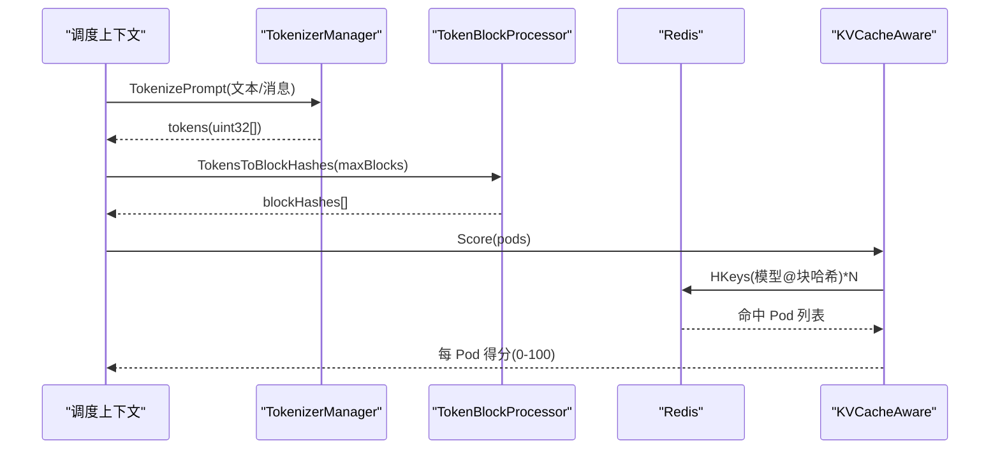
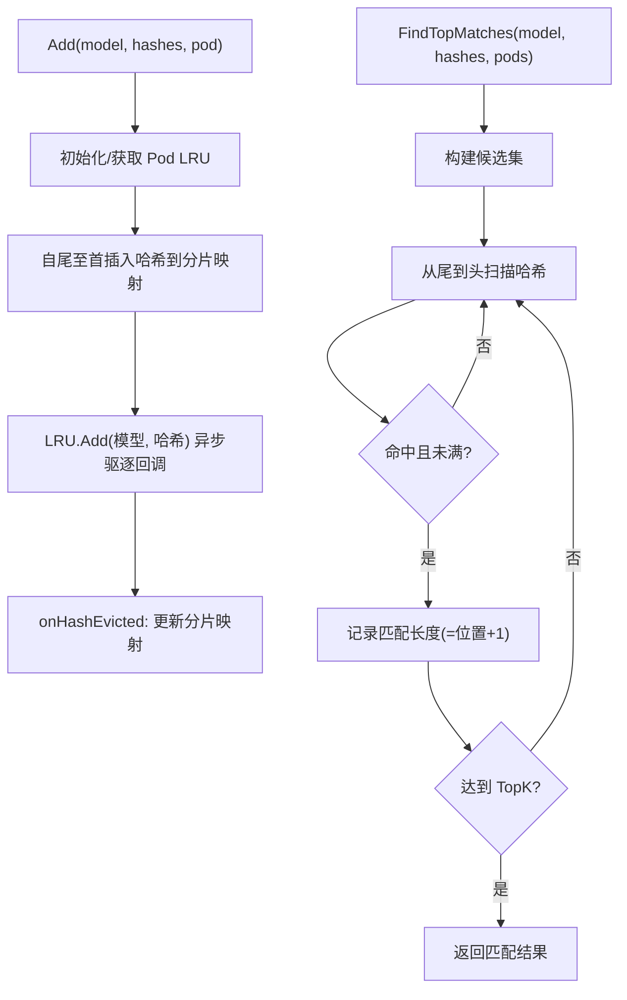
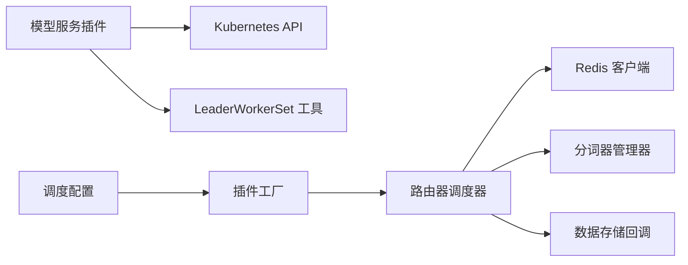

# 插件框架

<cite>
**本文引用的文件**
- [pkg/model-serving-controller/plugins/types.go](file://pkg/model-serving-controller/plugins/types.go)
- [pkg/model-serving-controller/plugins/manager.go](file://pkg/model-serving-controller/plugins/manager.go)
- [pkg/model-serving-controller/plugins/demo_plugin.go](file://pkg/model-serving-controller/plugins/demo_plugin.go)
- [pkg/model-serving-controller/plugins/lws_labels_plugin.go](file://pkg/model-serving-controller/plugins/lws_labels_plugin.go)
- [pkg/kthena-router/scheduler/scheduler.go](file://pkg/kthena-router/scheduler/scheduler.go)
- [pkg/kthena-router/scheduler/scheduler_impl.go](file://pkg/kthena-router/scheduler/scheduler_impl.go)
- [pkg/kthena-router/scheduler/factory.go](file://pkg/kthena-router/scheduler/factory.go)
- [pkg/kthena-router/scheduler/plugins/conf/conf.go](file://pkg/kthena-router/scheduler/plugins/conf/conf.go)
- [pkg/kthena-router/scheduler/plugins/cache/prefix_store.go](file://pkg/kthena-router/scheduler/plugins/cache/prefix_store.go)
- [pkg/kthena-router/scheduler/plugins/kvcache_aware.go](file://pkg/kthena-router/scheduler/plugins/kvcache_aware.go)
- [pkg/kthena-router/scheduler/plugins/tokenization/tokenizer_manager.go](file://pkg/kthena-router/scheduler/plugins/tokenization/tokenizer_manager.go)
- [pkg/kthena-router/scheduler/plugins/tokenization/tokenizer.go](file://pkg/kthena-router/scheduler/plugins/tokenization/tokenizer.go)
- [pkg/model-serving-controller/plugins/manager_test.go](file://pkg/model-serving-controller/plugins/manager_test.go)
</cite>

## 目录
1. [简介](#简介)
2. [项目结构](#项目结构)
3. [核心组件](#核心组件)
4. [架构总览](#架构总览)
5. [详细组件分析](#详细组件分析)
6. [依赖分析](#依赖分析)
7. [性能考量](#性能考量)
8. [故障排查指南](#故障排查指南)
9. [结论](#结论)
10. [附录](#附录)

## 简介
本文件面向 Kthena 的插件框架，系统化阐述模型服务控制器（Model Serving Controller）与路由器调度器（Router Scheduler）两大插件体系：前者负责在 Pod 生命周期钩子中进行声明式注入与标签增强；后者负责推理实例的过滤与评分调度，并通过缓存与远程分词器提升命中率与吞吐。文档覆盖插件注册、生命周期管理、动态加载、插件间通信与状态共享、内置插件实现、调度器缓存与配置、令牌化插件系统、开发指南、性能优化、错误处理与版本兼容性建议。

## 项目结构
- 模型服务控制器插件体系位于 pkg/model-serving-controller/plugins，包含插件接口、注册表、链式执行与内置插件（演示插件、LWS 标签插件）。
- 路由器调度器插件体系位于 pkg/kthena-router/scheduler，包含调度接口、实现、插件工厂、默认插件注册、配置解析、缓存与令牌化子系统。

**图表来源**
- [pkg/model-serving-controller/plugins/types.go:27-44](file://pkg/model-serving-controller/plugins/types.go#L27-L44)
- [pkg/model-serving-controller/plugins/manager.go:30-80](file://pkg/model-serving-controller/plugins/manager.go#L30-L80)
- [pkg/model-serving-controller/plugins/demo_plugin.go:28-54](file://pkg/model-serving-controller/plugins/demo_plugin.go#L28-L54)
- [pkg/model-serving-controller/plugins/lws_labels_plugin.go:34-46](file://pkg/model-serving-controller/plugins/lws_labels_plugin.go#L34-L46)
- [pkg/kthena-router/scheduler/scheduler.go:25-28](file://pkg/kthena-router/scheduler/scheduler.go#L25-L28)
- [pkg/kthena-router/scheduler/scheduler_impl.go:59-99](file://pkg/kthena-router/scheduler/scheduler_impl.go#L59-L99)
- [pkg/kthena-router/scheduler/factory.go:29-95](file://pkg/kthena-router/scheduler/factory.go#L29-L95)
- [pkg/kthena-router/scheduler/plugins/conf/conf.go:28-67](file://pkg/kthena-router/scheduler/plugins/conf/conf.go#L28-L67)
- [pkg/kthena-router/scheduler/plugins/kvcache_aware.go:107-140](file://pkg/kthena-router/scheduler/plugins/kvcache_aware.go#L107-L140)
- [pkg/kthena-router/scheduler/plugins/cache/prefix_store.go:68-94](file://pkg/kthena-router/scheduler/plugins/cache/prefix_store.go#L68-L94)
- [pkg/kthena-router/scheduler/plugins/tokenization/tokenizer_manager.go:31-44](file://pkg/kthena-router/scheduler/plugins/tokenization/tokenizer_manager.go#L31-L44)
- [pkg/kthena-router/scheduler/plugins/tokenization/tokenizer.go:23-37](file://pkg/kthena-router/scheduler/plugins/tokenization/tokenizer.go#L23-L37)

**章节来源**
- [pkg/model-serving-controller/plugins/types.go:27-44](file://pkg/model-serving-controller/plugins/types.go#L27-L44)
- [pkg/model-serving-controller/plugins/manager.go:30-80](file://pkg/model-serving-controller/plugins/manager.go#L30-L80)
- [pkg/kthena-router/scheduler/scheduler.go:25-28](file://pkg/kthena-router/scheduler/scheduler.go#L25-L28)
- [pkg/kthena-router/scheduler/scheduler_impl.go:59-99](file://pkg/kthena-router/scheduler/scheduler_impl.go#L59-L99)
- [pkg/kthena-router/scheduler/factory.go:29-95](file://pkg/kthena-router/scheduler/factory.go#L29-L95)

## 核心组件
- 插件接口与请求上下文：定义 HookRequest 与 Plugin 接口，统一生命周期钩子（创建前、就绪后）。
- 注册表与链式执行：Registry 提供名称到工厂函数映射；Chain 按顺序执行插件，支持按作用域（角色、入口/工作节点）裁剪执行。
- 内置插件：演示插件用于运行时类名、注解与环境变量注入；LWS 标签插件为 LeaderWorkerSet 场景注入标准标签。
- 调度器接口与实现：Scheduler/SchedulerImpl 统一调度流程，先过滤再评分，支持 PD 分离场景的预取/解码配对。
- 插件注册表：默认注册若干评分/过滤插件，支持从配置加载插件列表与参数。
- 配置解析：从 YAML 解析调度器插件启用列表、权重与参数。
- 缓存与令牌化：前缀缓存（LRU+分片哈希）与 KV 缓存命中感知评分；远程分词器（vLLM）按候选 Pod 随机选择可用端点。

**章节来源**
- [pkg/model-serving-controller/plugins/types.go:27-44](file://pkg/model-serving-controller/plugins/types.go#L27-L44)
- [pkg/model-serving-controller/plugins/manager.go:30-80](file://pkg/model-serving-controller/plugins/manager.go#L30-L80)
- [pkg/model-serving-controller/plugins/demo_plugin.go:28-54](file://pkg/model-serving-controller/plugins/demo_plugin.go#L28-L54)
- [pkg/model-serving-controller/plugins/lws_labels_plugin.go:34-46](file://pkg/model-serving-controller/plugins/lws_labels_plugin.go#L34-L46)
- [pkg/kthena-router/scheduler/scheduler.go:25-28](file://pkg/kthena-router/scheduler/scheduler.go#L25-L28)
- [pkg/kthena-router/scheduler/scheduler_impl.go:59-99](file://pkg/kthena-router/scheduler/scheduler_impl.go#L59-L99)
- [pkg/kthena-router/scheduler/factory.go:66-95](file://pkg/kthena-router/scheduler/factory.go#L66-L95)
- [pkg/kthena-router/scheduler/plugins/conf/conf.go:82-103](file://pkg/kthena-router/scheduler/plugins/conf/conf.go#L82-L103)

## 架构总览
下图展示控制器插件链与路由器调度器插件的交互关系与数据流。

**图表来源**
- [pkg/model-serving-controller/plugins/manager.go:59-112](file://pkg/model-serving-controller/plugins/manager.go#L59-L112)
- [pkg/kthena-router/scheduler/scheduler_impl.go:101-165](file://pkg/kthena-router/scheduler/scheduler_impl.go#L101-L165)
- [pkg/kthena-router/scheduler/factory.go:66-95](file://pkg/kthena-router/scheduler/factory.go#L66-L95)

## 详细组件分析

### 控制器插件体系
- 接口与请求上下文
  - HookRequest 携带 ModelServing、ServingGroup、RoleName/ID、是否入口 Pod、以及待变更的 Pod 引用。
  - Plugin 接口定义 Name、OnPodCreate、OnPodReady 三个方法，确保插件可被链式调用。
- 注册表与链式执行
  - Registry 维护名称到工厂函数映射；NewChain 仅支持内置类型，按规范构建插件实例并记录其 Spec。
  - Chain.OnPodCreate/OnPodReady 依次执行，shouldRun 基于 Scope（角色、目标类型）决定是否执行。
  - DecodeJSON 辅助内置插件从 JSON 配置反序列化。
- 内置插件
  - 演示插件：根据配置设置 RuntimeClassName、注解与容器环境变量，仅在 OnPodCreate 生效。
  - LWS 标签插件：从 OwnerReference 中识别 LWS 名称，结合 ServingGroup 与 Pod 名称推导索引，写入 LWS 标签键值。

**图表来源**
- [pkg/model-serving-controller/plugins/types.go:27-44](file://pkg/model-serving-controller/plugins/types.go#L27-L44)
- [pkg/model-serving-controller/plugins/manager.go:30-80](file://pkg/model-serving-controller/plugins/manager.go#L30-L80)
- [pkg/model-serving-controller/plugins/demo_plugin.go:28-54](file://pkg/model-serving-controller/plugins/demo_plugin.go#L28-L54)
- [pkg/model-serving-controller/plugins/lws_labels_plugin.go:34-46](file://pkg/model-serving-controller/plugins/lws_labels_plugin.go#L34-L46)

**章节来源**
- [pkg/model-serving-controller/plugins/types.go:27-44](file://pkg/model-serving-controller/plugins/types.go#L27-L44)
- [pkg/model-serving-controller/plugins/manager.go:30-80](file://pkg/model-serving-controller/plugins/manager.go#L30-L80)
- [pkg/model-serving-controller/plugins/demo_plugin.go:28-54](file://pkg/model-serving-controller/plugins/demo_plugin.go#L28-L54)
- [pkg/model-serving-controller/plugins/lws_labels_plugin.go:34-46](file://pkg/model-serving-controller/plugins/lws_labels_plugin.go#L34-L46)

### 调度器插件体系
- 调度接口与实现
  - Scheduler 接口定义 Schedule 与 RunPostHooks；SchedulerImpl 实现中先执行过滤插件，再对候选 Pod 执行评分插件并加权聚合，PD 分离场景下优先匹配解码/预取配对。
- 插件注册表与默认注册
  - PluginRegistry 维护评分/过滤插件工厂；registerDefaultPlugins 注册默认插件集合。
  - getFilterPlugins/getScorePlugins 从注册表与配置中构造插件实例与权重。
- 配置解析
  - conf.RouterConfiguration/Plugins/PluginWithWeight/PluginConfig 定义配置结构；LoadSchedulerConfig 解析启用列表、权重与参数映射。
- 缓存与令牌化
  - ModelPrefixStore 使用分片哈希与 LRU 管理每个 Pod 的哈希集合，支持按模型维度查找 TopK 匹配；在 Pod 删除事件时清理。
  - TokenizerManager 随机选择候选 Pod 上的 vLLM 端点，创建远程分词器；支持文本与聊天模板两种输入，输出固定宽度整数序列。

**图表来源**
- [pkg/kthena-router/scheduler/scheduler_impl.go:101-165](file://pkg/kthena-router/scheduler/scheduler_impl.go#L101-L165)
- [pkg/kthena-router/scheduler/factory.go:66-95](file://pkg/kthena-router/scheduler/factory.go#L66-L95)
- [pkg/kthena-router/scheduler/plugins/conf/conf.go:82-103](file://pkg/kthena-router/scheduler/plugins/conf/conf.go#L82-L103)

**章节来源**
- [pkg/kthena-router/scheduler/scheduler.go:25-28](file://pkg/kthena-router/scheduler/scheduler.go#L25-L28)
- [pkg/kthena-router/scheduler/scheduler_impl.go:59-99](file://pkg/kthena-router/scheduler/scheduler_impl.go#L59-L99)
- [pkg/kthena-router/scheduler/factory.go:29-95](file://pkg/kthena-router/scheduler/factory.go#L29-L95)
- [pkg/kthena-router/scheduler/plugins/conf/conf.go:28-67](file://pkg/kthena-router/scheduler/plugins/conf/conf.go#L28-L67)

### KV 缓存感知评分插件
- 设计要点
  - 将提示词分块为 token 块，计算标准化哈希，查询 Redis 中“模型@块哈希”键对应的 Pod 列表，统计连续匹配长度作为得分。
  - 通过 TokenizerManager 获取候选 Pod 的 vLLM 分词端点，避免本地分词开销。
- 关键流程
  - 规范化与分词 → 计算块哈希 → 批量查询 Redis → 计算命中分数 → 归一化为百分比。

**图表来源**
- [pkg/kthena-router/scheduler/plugins/kvcache_aware.go:146-192](file://pkg/kthena-router/scheduler/plugins/kvcache_aware.go#L146-L192)
- [pkg/kthena-router/scheduler/plugins/kvcache_aware.go:194-238](file://pkg/kthena-router/scheduler/plugins/kvcache_aware.go#L194-L238)
- [pkg/kthena-router/scheduler/plugins/kvcache_aware.go:247-299](file://pkg/kthena-router/scheduler/plugins/kvcache_aware.go#L247-L299)
- [pkg/kthena-router/scheduler/plugins/tokenization/tokenizer_manager.go:89-147](file://pkg/kthena-router/scheduler/plugins/tokenization/tokenizer_manager.go#L89-L147)

**章节来源**
- [pkg/kthena-router/scheduler/plugins/kvcache_aware.go:48-140](file://pkg/kthena-router/scheduler/plugins/kvcache_aware.go#L48-L140)
- [pkg/kthena-router/scheduler/plugins/kvcache_aware.go:146-192](file://pkg/kthena-router/scheduler/plugins/kvcache_aware.go#L146-L192)
- [pkg/kthena-router/scheduler/plugins/kvcache_aware.go:194-238](file://pkg/kthena-router/scheduler/plugins/kvcache_aware.go#L194-L238)
- [pkg/kthena-router/scheduler/plugins/kvcache_aware.go:247-299](file://pkg/kthena-router/scheduler/plugins/kvcache_aware.go#L247-L299)
- [pkg/kthena-router/scheduler/plugins/tokenization/tokenizer_manager.go:31-44](file://pkg/kthena-router/scheduler/plugins/tokenization/tokenizer_manager.go#L31-L44)
- [pkg/kthena-router/scheduler/plugins/tokenization/tokenizer_manager.go:89-147](file://pkg/kthena-router/scheduler/plugins/tokenization/tokenizer_manager.go#L89-L147)
- [pkg/kthena-router/scheduler/plugins/tokenization/tokenizer.go:23-37](file://pkg/kthena-router/scheduler/plugins/tokenization/tokenizer.go#L23-L37)

### 前缀缓存与 LRU 管理
- 数据结构
  - 三层映射：模型 -> 哈希分片 -> 哈希集合(Set[Pod])；每 Pod 维护独立 LRU（容量由配置控制），异步驱逐回调更新全局映射。
- 核心能力
  - Add：自尾至首插入哈希，保证长前缀优先匹配；同时写入 Pod 的 LRU。
  - FindTopMatches：从尾到头扫描哈希，返回候选集中 TopK 匹配长度。
  - onPodDeleted：删除 Pod 时清理其 LRU 与全局映射，必要时回收空分片。

**图表来源**
- [pkg/kthena-router/scheduler/plugins/cache/prefix_store.go:68-94](file://pkg/kthena-router/scheduler/plugins/cache/prefix_store.go#L68-L94)
- [pkg/kthena-router/scheduler/plugins/cache/prefix_store.go:138-195](file://pkg/kthena-router/scheduler/plugins/cache/prefix_store.go#L138-L195)
- [pkg/kthena-router/scheduler/plugins/cache/prefix_store.go:197-238](file://pkg/kthena-router/scheduler/plugins/cache/prefix_store.go#L197-L238)
- [pkg/kthena-router/scheduler/plugins/cache/prefix_store.go:240-260](file://pkg/kthena-router/scheduler/plugins/cache/prefix_store.go#L240-L260)

**章节来源**
- [pkg/kthena-router/scheduler/plugins/cache/prefix_store.go:68-94](file://pkg/kthena-router/scheduler/plugins/cache/prefix_store.go#L68-L94)
- [pkg/kthena-router/scheduler/plugins/cache/prefix_store.go:138-195](file://pkg/kthena-router/scheduler/plugins/cache/prefix_store.go#L138-L195)
- [pkg/kthena-router/scheduler/plugins/cache/prefix_store.go:197-238](file://pkg/kthena-router/scheduler/plugins/cache/prefix_store.go#L197-L238)
- [pkg/kthena-router/scheduler/plugins/cache/prefix_store.go:240-260](file://pkg/kthena-router/scheduler/plugins/cache/prefix_store.go#L240-L260)

## 依赖分析
- 控制器插件链
  - 依赖 Kubernetes API 类型（Pod、OwnerReference）、LWS 工具库；通过 HookRequest 传递上下文，插件仅在 OnPodCreate/OnPodReady 期间修改 Pod。
- 调度器插件
  - 依赖 Redis 客户端、分词器管理器、数据存储回调；过滤/评分插件均实现统一框架接口，便于扩展与组合。
- 配置与工厂
  - 通过 YAML 配置驱动插件启用与权重；工厂函数延迟构造插件实例，支持参数注入。

**图表来源**
- [pkg/model-serving-controller/plugins/lws_labels_plugin.go:27-31](file://pkg/model-serving-controller/plugins/lws_labels_plugin.go#L27-L31)
- [pkg/kthena-router/scheduler/plugins/kvcache_aware.go:38-45](file://pkg/kthena-router/scheduler/plugins/kvcache_aware.go#L38-L45)
- [pkg/kthena-router/scheduler/factory.go:66-95](file://pkg/kthena-router/scheduler/factory.go#L66-L95)
- [pkg/kthena-router/scheduler/plugins/conf/conf.go:82-103](file://pkg/kthena-router/scheduler/plugins/conf/conf.go#L82-L103)

**章节来源**
- [pkg/model-serving-controller/plugins/lws_labels_plugin.go:27-31](file://pkg/model-serving-controller/plugins/lws_labels_plugin.go#L27-L31)
- [pkg/kthena-router/scheduler/plugins/kvcache_aware.go:38-45](file://pkg/kthena-router/scheduler/plugins/kvcache_aware.go#L38-L45)
- [pkg/kthena-router/scheduler/factory.go:66-95](file://pkg/kthena-router/scheduler/factory.go#L66-L95)
- [pkg/kthena-router/scheduler/plugins/conf/conf.go:82-103](file://pkg/kthena-router/scheduler/plugins/conf/conf.go#L82-L103)

## 性能考量
- 调度器评分
  - 过滤阶段尽早剔除无效候选，减少后续评分成本；评分阶段对各插件耗时进行指标记录，便于定位瓶颈。
  - PD 分离场景优先匹配解码/预取配对，降低跨实例往返延迟。
- 前缀缓存
  - 分片哈希与 LRU 结合，避免全局锁竞争；异步驱逐回调降低同步阻塞风险。
- KV 缓存命中
  - 限制最大块数与批处理查询，避免 Redis 热点；分块哈希采用标准化算法，确保跨实例一致性。
- 分词器
  - 随机选择可用端点，失败时自动回退；超时控制保障调度不被阻塞。

[本节为通用指导，无需具体文件分析]

## 故障排查指南
- 插件链错误传播
  - 若某插件在 OnPodCreate/OnPodReady 抛错，链会立即停止并返回错误，定位需检查对应插件实现与 HookRequest 参数。
- 作用域裁剪
  - 若插件未生效，确认 Scope.Roles 与 RoleName 是否匹配，Scope.Target 与 IsEntry/Worker 是否一致。
- 调度器配置
  - 当启用随机插件与其他评分插件共存时，随机插件会被移除并告警；请单独使用随机插件或替换为有意义评分。
- KV 缓存
  - Redis 客户端未初始化或查询超时会导致评分为空；检查 Redis 连接与键空间格式。
- 前缀缓存
  - Pod 删除事件未触发清理可能造成内存增长；确认数据存储回调已注册。

**章节来源**
- [pkg/model-serving-controller/plugins/manager_test.go:95-104](file://pkg/model-serving-controller/plugins/manager_test.go#L95-L104)
- [pkg/kthena-router/scheduler/plugins/conf/conf.go:105-125](file://pkg/kthena-router/scheduler/plugins/conf/conf.go#L105-L125)
- [pkg/kthena-router/scheduler/plugins/kvcache_aware.go:196-204](file://pkg/kthena-router/scheduler/plugins/kvcache_aware.go#L196-L204)
- [pkg/kthena-router/scheduler/plugins/cache/prefix_store.go:90-94](file://pkg/kthena-router/scheduler/plugins/cache/prefix_store.go#L90-L94)

## 结论
Kthena 插件框架以清晰的接口与注册表机制实现了控制器与路由器两侧的可扩展性。控制器侧通过 HookRequest 与链式执行实现声明式 Pod 注入与标签增强；路由器侧通过插件工厂与配置驱动实现灵活的过滤/评分组合，并辅以前缀缓存与 KV 命中感知评分提升命中率与吞吐。建议在生产环境中结合指标监控与限流策略，持续优化插件权重与缓存参数。

[本节为总结，无需具体文件分析]

## 附录

### 开发指南：如何实现一个内置插件
- 步骤
  - 在插件包内定义结构体并实现 Plugin 接口（Name、OnPodCreate、OnPodReady）。
  - 在 init 中向 DefaultRegistry 注册工厂函数。
  - 使用 DecodeJSON 从 PluginSpec.Config 反序列化配置。
  - 在 OnPodCreate 中对 req.Pod 做就地修改；OnPodReady 做轻量态后处理。
- 参考
  - [pkg/model-serving-controller/plugins/demo_plugin.go:28-54](file://pkg/model-serving-controller/plugins/demo_plugin.go#L28-L54)
  - [pkg/model-serving-controller/plugins/lws_labels_plugin.go:34-46](file://pkg/model-serving-controller/plugins/lws_labels_plugin.go#L34-L46)
  - [pkg/model-serving-controller/plugins/manager.go:142-147](file://pkg/model-serving-controller/plugins/manager.go#L142-L147)

**章节来源**
- [pkg/model-serving-controller/plugins/demo_plugin.go:28-54](file://pkg/model-serving-controller/plugins/demo_plugin.go#L28-L54)
- [pkg/model-serving-controller/plugins/lws_labels_plugin.go:34-46](file://pkg/model-serving-controller/plugins/lws_labels_plugin.go#L34-L46)
- [pkg/model-serving-controller/plugins/manager.go:142-147](file://pkg/model-serving-controller/plugins/manager.go#L142-L147)

### 配置参数与测试方法
- 调度器配置
  - 通过 RouterConfiguration.scheduler.plugins.score.enabled 与 filter.enabled 控制启用插件及权重；通过 pluginConfig 注入参数。
  - 参考：[pkg/kthena-router/scheduler/plugins/conf/conf.go:28-67](file://pkg/kthena-router/scheduler/plugins/conf/conf.go#L28-L67)
- 测试
  - 使用链式执行单元测试验证顺序、作用域裁剪与错误传播。
  - 参考：[pkg/model-serving-controller/plugins/manager_test.go:59-93](file://pkg/model-serving-controller/plugins/manager_test.go#L59-L93)

**章节来源**
- [pkg/kthena-router/scheduler/plugins/conf/conf.go:28-67](file://pkg/kthena-router/scheduler/plugins/conf/conf.go#L28-L67)
- [pkg/model-serving-controller/plugins/manager_test.go:59-93](file://pkg/model-serving-controller/plugins/manager_test.go#L59-L93)

### 版本兼容性与最佳实践
- 版本兼容
  - 插件接口保持稳定，新增插件应遵循现有生命周期与作用域约定；配置结构通过 YAML 解析，建议保留默认值以兼容未来扩展。
- 最佳实践
  - 控制器插件：尽量在 OnPodCreate 完成所有必要注入，避免在 OnPodReady 产生副作用；严格校验 HookRequest 字段。
  - 路由器插件：评分插件应短路返回与幂等；过滤插件应尽早剔除无效候选；缓存插件需处理驱逐与并发安全。
  - 错误处理：对外部依赖（Redis、分词器）增加超时与降级策略；日志记录关键路径耗时与失败原因。

[本节为通用指导，无需具体文件分析]