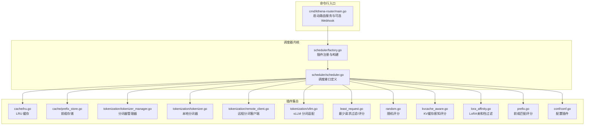
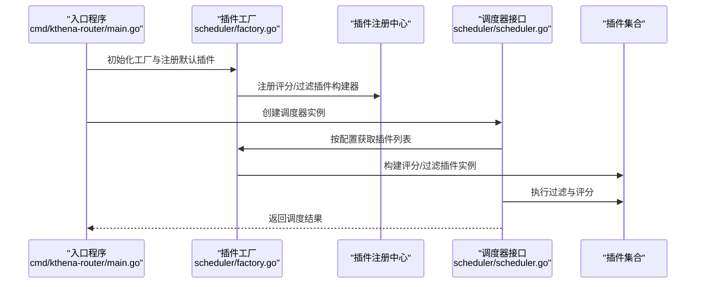
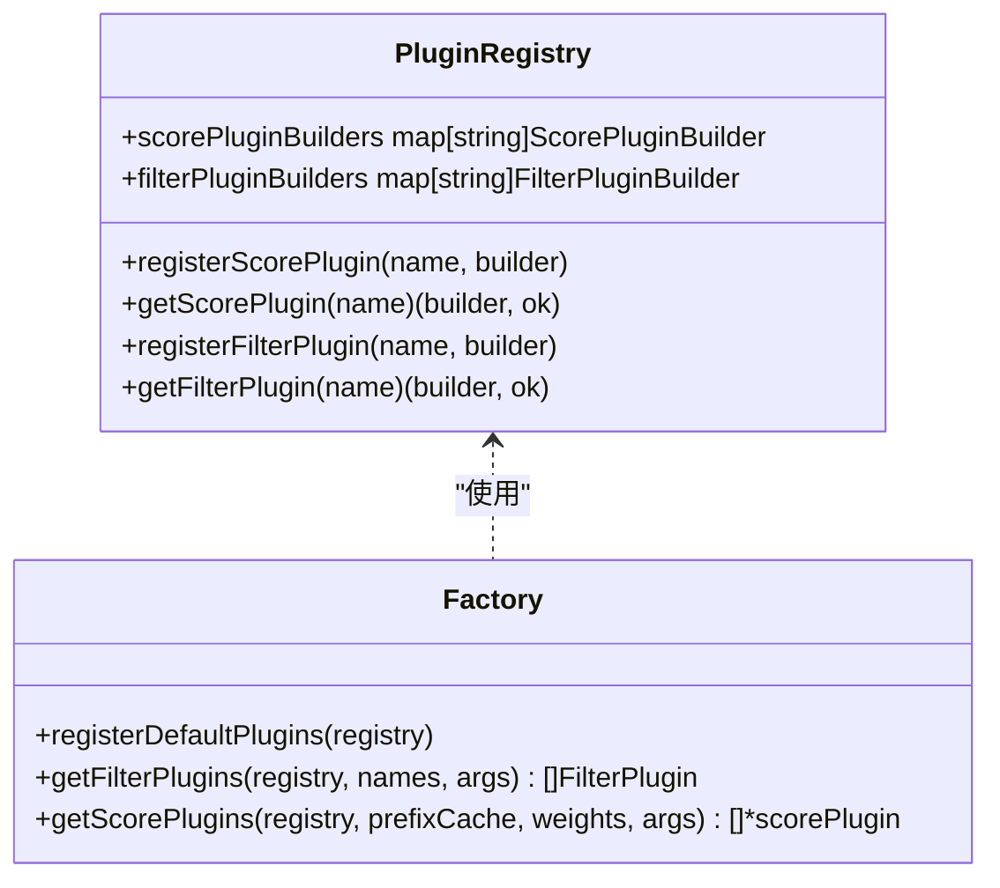
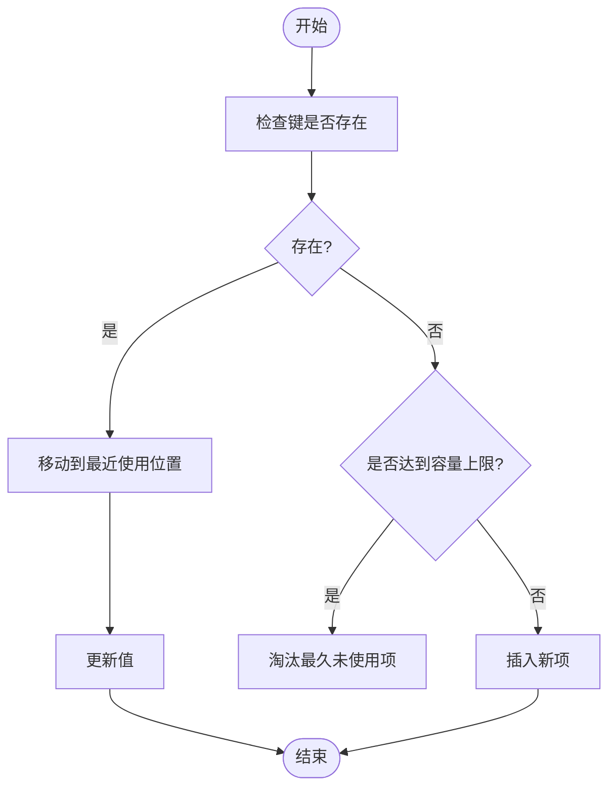
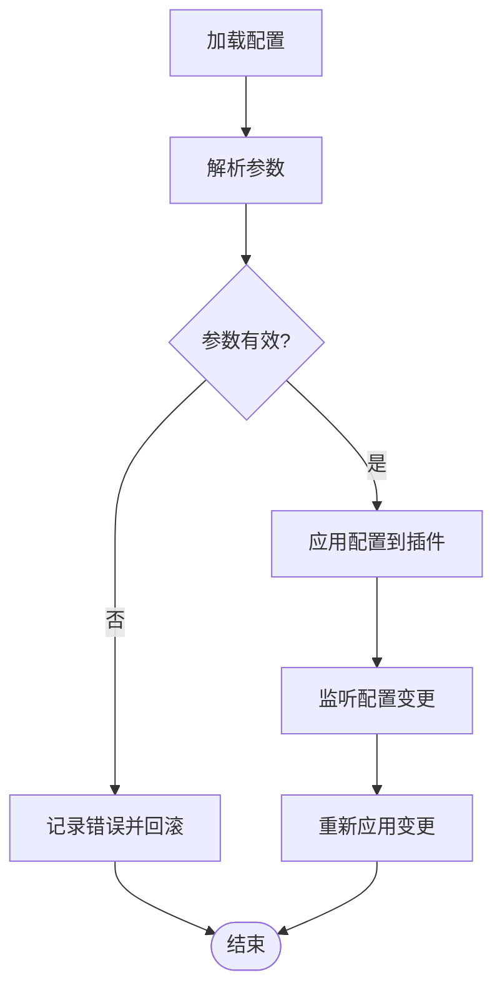
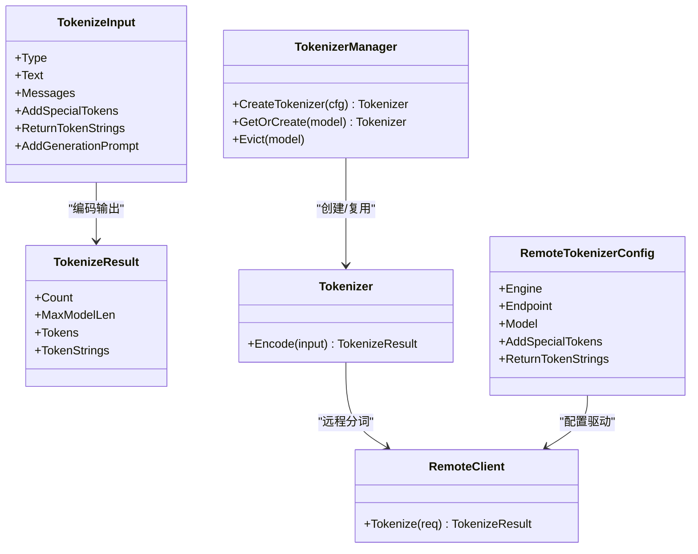
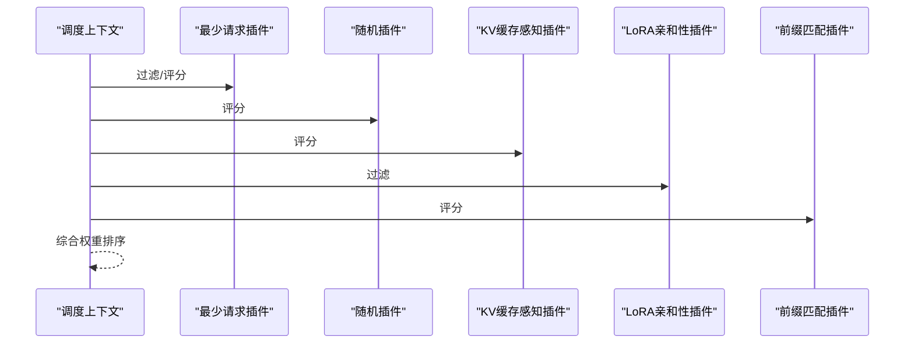
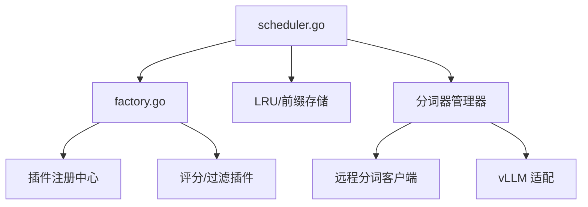

# 路由器调度器插件

<cite>
**本文引用的文件**
- [cmd/kthena-router/main.go](file://cmd/kthena-router/main.go)
- [pkg/kthena-router/scheduler/factory.go](file://pkg/kthena-router/scheduler/factory.go)
- [pkg/kthena-router/scheduler/scheduler.go](file://pkg/kthena-router/scheduler/scheduler.go)
- [pkg/kthena-router/scheduler/plugins/cache/lru.go](file://pkg/kthena-router/scheduler/plugins/cache/lru.go)
- [pkg/kthena-router/scheduler/plugins/cache/prefix_store.go](file://pkg/kthena-router/scheduler/plugins/cache/prefix_store.go)
- [pkg/kthena-router/scheduler/plugins/conf/conf.go](file://pkg/kthena-router/scheduler/plugins/conf/conf.go)
- [pkg/kthena-router/scheduler/plugins/tokenization/types.go](file://pkg/kthena-router/scheduler/plugins/tokenization/types.go)
- [pkg/kthena-router/scheduler/plugins/tokenization/tokenizer_manager.go](file://pkg/kthena-router/scheduler/plugins/tokenization/tokenizer_manager.go)
- [pkg/kthena-router/scheduler/plugins/tokenization/tokenizer.go](file://pkg/kthena-router/scheduler/plugins/tokenization/tokenizer.go)
- [pkg/kthena-router/scheduler/plugins/tokenization/remote_client.go](file://pkg/kthena-router/scheduler/plugins/tokenization/remote_client.go)
- [pkg/kthena-router/scheduler/plugins/tokenization/vllm.go](file://pkg/kthena-router/scheduler/plugins/tokenization/vllm.go)
- [pkg/kthena-router/scheduler/plugins/least_request.go](file://pkg/kthena-router/scheduler/plugins/least_request.go)
- [pkg/kthena-router/scheduler/plugins/random.go](file://pkg/kthena-router/scheduler/plugins/random.go)
- [pkg/kthena-router/scheduler/plugins/kvcache_aware.go](file://pkg/kthena-router/scheduler/plugins/kvcache_aware.go)
- [pkg/kthena-router/scheduler/plugins/lora_affinity.go](file://pkg/kthena-router/scheduler/plugins/lora_affinity.go)
- [pkg/kthena-router/scheduler/plugins/prefix.go](file://pkg/kthena-router/scheduler/plugins/prefix.go)
</cite>

## 目录
1. [简介](#简介)
2. [项目结构](#项目结构)
3. [核心组件](#核心组件)
4. [架构总览](#架构总览)
5. [详细组件分析](#详细组件分析)
6. [依赖分析](#依赖分析)
7. [性能考虑](#性能考虑)
8. [故障排查指南](#故障排查指南)
9. [结论](#结论)
10. [附录](#附录)

## 简介
本文件面向 Kthena 路由器调度器插件系统，提供从架构到实现细节的完整文档。重点覆盖以下方面：
- 插件接口与注册机制：如何定义插件接口、注册默认插件、按需构建插件实例。
- 缓存插件：LRU 缓存与前缀存储的实现与使用场景。
- 配置插件：配置加载、参数校验与动态更新机制。
- 令牌化插件管理器：分词器创建、远程分词、缓存策略与性能优化。
- 开发指南：如何实现新插件、配置参数与测试方法。
- 插件间通信与状态共享：通过上下文与共享数据结构进行协作。
- 性能监控与调优：指标采集、瓶颈定位与优化建议。

## 项目结构
路由器调度器位于 pkg/kthena-router/scheduler 子目录，包含工厂、框架接口与多种插件实现；入口程序在 cmd/kthena-router 中启动服务与 Webhook。

图表来源
- [cmd/kthena-router/main.go:1-226](file://cmd/kthena-router/main.go#L1-L226)
- [pkg/kthena-router/scheduler/factory.go:1-144](file://pkg/kthena-router/scheduler/factory.go#L1-L144)
- [pkg/kthena-router/scheduler/scheduler.go:1-29](file://pkg/kthena-router/scheduler/scheduler.go#L1-L29)
- [pkg/kthena-router/scheduler/plugins/cache/lru.go:1-200](file://pkg/kthena-router/scheduler/plugins/cache/lru.go#L1-L200)
- [pkg/kthena-router/scheduler/plugins/cache/prefix_store.go:1-200](file://pkg/kthena-router/scheduler/plugins/cache/prefix_store.go#L1-L200)
- [pkg/kthena-router/scheduler/plugins/tokenization/tokenizer_manager.go:1-200](file://pkg/kthena-router/scheduler/plugins/tokenization/tokenizer_manager.go#L1-L200)
- [pkg/kthena-router/scheduler/plugins/tokenization/tokenizer.go:1-200](file://pkg/kthena-router/scheduler/plugins/tokenization/tokenizer.go#L1-L200)
- [pkg/kthena-router/scheduler/plugins/tokenization/remote_client.go:1-200](file://pkg/kthena-router/scheduler/plugins/tokenization/remote_client.go#L1-L200)
- [pkg/kthena-router/scheduler/plugins/tokenization/vllm.go:1-200](file://pkg/kthena-router/scheduler/plugins/tokenization/vllm.go#L1-L200)
- [pkg/kthena-router/scheduler/plugins/least_request.go:1-200](file://pkg/kthena-router/scheduler/plugins/least_request.go#L1-L200)
- [pkg/kthena-router/scheduler/plugins/random.go:1-200](file://pkg/kthena-router/scheduler/plugins/random.go#L1-L200)
- [pkg/kthena-router/scheduler/plugins/kvcache_aware.go:1-200](file://pkg/kthena-router/scheduler/plugins/kvcache_aware.go#L1-L200)
- [pkg/kthena-router/scheduler/plugins/lora_affinity.go:1-200](file://pkg/kthena-router/scheduler/plugins/lora_affinity.go#L1-L200)
- [pkg/kthena-router/scheduler/plugins/prefix.go:1-200](file://pkg/kthena-router/scheduler/plugins/prefix.go#L1-L200)
- [pkg/kthena-router/scheduler/plugins/conf/conf.go:1-200](file://pkg/kthena-router/scheduler/plugins/conf/conf.go#L1-L200)

章节来源
- [cmd/kthena-router/main.go:1-226](file://cmd/kthena-router/main.go#L1-L226)
- [pkg/kthena-router/scheduler/factory.go:1-144](file://pkg/kthena-router/scheduler/factory.go#L1-L144)
- [pkg/kthena-router/scheduler/scheduler.go:1-29](file://pkg/kthena-router/scheduler/scheduler.go#L1-L29)

## 核心组件
- 调度器接口：定义调度入口与后处理钩子，统一调度流程控制点。
- 插件注册中心：集中注册与检索评分/过滤插件，支持默认插件集与按需扩展。
- 缓存插件：LRU 缓存用于热点命中加速；前缀存储用于前缀匹配与快速查找。
- 配置插件：负责读取与校验配置参数，并支持动态更新。
- 令牌化插件管理器：封装本地与远程分词器，提供统一的分词能力与缓存策略。

章节来源
- [pkg/kthena-router/scheduler/scheduler.go:25-28](file://pkg/kthena-router/scheduler/scheduler.go#L25-L28)
- [pkg/kthena-router/scheduler/factory.go:29-63](file://pkg/kthena-router/scheduler/factory.go#L29-L63)
- [pkg/kthena-router/scheduler/plugins/cache/lru.go:1-200](file://pkg/kthena-router/scheduler/plugins/cache/lru.go#L1-L200)
- [pkg/kthena-router/scheduler/plugins/cache/prefix_store.go:1-200](file://pkg/kthena-router/scheduler/plugins/cache/prefix_store.go#L1-L200)
- [pkg/kthena-router/scheduler/plugins/conf/conf.go:1-200](file://pkg/kthena-router/scheduler/plugins/conf/conf.go#L1-L200)
- [pkg/kthena-router/scheduler/plugins/tokenization/tokenizer_manager.go:1-200](file://pkg/kthena-router/scheduler/plugins/tokenization/tokenizer_manager.go#L1-L200)

## 架构总览
调度器采用“工厂 + 插件”的架构模式。入口程序负责初始化与运行时参数解析，工厂负责插件注册与实例化，调度器接口定义统一的调度流程，各插件实现具体策略。

图表来源
- [cmd/kthena-router/main.go:121-121](file://cmd/kthena-router/main.go#L121-L121)
- [pkg/kthena-router/scheduler/factory.go:66-95](file://pkg/kthena-router/scheduler/factory.go#L66-L95)
- [pkg/kthena-router/scheduler/scheduler.go:25-28](file://pkg/kthena-router/scheduler/scheduler.go#L25-L28)

## 详细组件分析

### 插件接口与注册机制
- 接口定义：评分插件与过滤插件均通过工厂函数进行实例化，支持带参数的构造。
- 注册中心：集中维护插件名称到构建器的映射，支持查询与构建。
- 默认插件：工厂内置默认评分/过滤插件清单，便于开箱即用。

图表来源
- [pkg/kthena-router/scheduler/factory.go:29-63](file://pkg/kthena-router/scheduler/factory.go#L29-L63)
- [pkg/kthena-router/scheduler/factory.go:66-95](file://pkg/kthena-router/scheduler/factory.go#L66-L95)
- [pkg/kthena-router/scheduler/factory.go:97-143](file://pkg/kthena-router/scheduler/factory.go#L97-L143)

章节来源
- [pkg/kthena-router/scheduler/factory.go:26-63](file://pkg/kthena-router/scheduler/factory.go#L26-L63)
- [pkg/kthena-router/scheduler/factory.go:66-95](file://pkg/kthena-router/scheduler/factory.go#L66-L95)
- [pkg/kthena-router/scheduler/factory.go:97-143](file://pkg/kthena-router/scheduler/factory.go#L97-L143)

### 缓存插件：LRU 与前缀存储
- LRU 缓存：基于链表与哈希表实现，支持 O(1) 查找与更新，淘汰策略为最近最少使用。
- 前缀存储：用于高效匹配输入前缀，适合前缀相关的评分或过滤逻辑。
- 使用场景：在令牌化与 KV 缓存感知等插件中作为底层缓存层，提升命中率与响应速度。

图表来源
- [pkg/kthena-router/scheduler/plugins/cache/lru.go:1-200](file://pkg/kthena-router/scheduler/plugins/cache/lru.go#L1-L200)
- [pkg/kthena-router/scheduler/plugins/cache/prefix_store.go:1-200](file://pkg/kthena-router/scheduler/plugins/cache/prefix_store.go#L1-L200)

章节来源
- [pkg/kthena-router/scheduler/plugins/cache/lru.go:1-200](file://pkg/kthena-router/scheduler/plugins/cache/lru.go#L1-L200)
- [pkg/kthena-router/scheduler/plugins/cache/prefix_store.go:1-200](file://pkg/kthena-router/scheduler/plugins/cache/prefix_store.go#L1-L200)

### 配置插件：加载、校验与动态更新
- 加载：从配置源读取参数，解析为插件可用的数据结构。
- 校验：对必填字段与取值范围进行校验，确保插件运行安全。
- 动态更新：监听配置变更事件，平滑更新插件内部状态，避免中断服务。

图表来源
- [pkg/kthena-router/scheduler/plugins/conf/conf.go:1-200](file://pkg/kthena-router/scheduler/plugins/conf/conf.go#L1-L200)

章节来源
- [pkg/kthena-router/scheduler/plugins/conf/conf.go:1-200](file://pkg/kthena-router/scheduler/plugins/conf/conf.go#L1-L200)

### 令牌化插件管理器：创建、管理与缓存策略
- 数据模型：定义输入类型（补全/对话）、分词结果结构与远程分词器配置。
- 管理器职责：统一创建本地与远程分词器，维护生命周期与缓存策略。
- 远程分词：通过 HTTP 客户端对接 vLLM 等后端，支持补全与聊天两种请求格式。
- 缓存策略：结合 LRU 与前缀存储，减少重复分词开销，提升吞吐。

图表来源
- [pkg/kthena-router/scheduler/plugins/tokenization/types.go:21-77](file://pkg/kthena-router/scheduler/plugins/tokenization/types.go#L21-L77)
- [pkg/kthena-router/scheduler/plugins/tokenization/tokenizer_manager.go:1-200](file://pkg/kthena-router/scheduler/plugins/tokenization/tokenizer_manager.go#L1-L200)
- [pkg/kthena-router/scheduler/plugins/tokenization/tokenizer.go:1-200](file://pkg/kthena-router/scheduler/plugins/tokenization/tokenizer.go#L1-L200)
- [pkg/kthena-router/scheduler/plugins/tokenization/remote_client.go:1-200](file://pkg/kthena-router/scheduler/plugins/tokenization/remote_client.go#L1-L200)
- [pkg/kthena-router/scheduler/plugins/tokenization/vllm.go:1-200](file://pkg/kthena-router/scheduler/plugins/tokenization/vllm.go#L1-L200)

章节来源
- [pkg/kthena-router/scheduler/plugins/tokenization/types.go:21-77](file://pkg/kthena-router/scheduler/plugins/tokenization/types.go#L21-L77)
- [pkg/kthena-router/scheduler/plugins/tokenization/tokenizer_manager.go:1-200](file://pkg/kthena-router/scheduler/plugins/tokenization/tokenizer_manager.go#L1-L200)
- [pkg/kthena-router/scheduler/plugins/tokenization/tokenizer.go:1-200](file://pkg/kthena-router/scheduler/plugins/tokenization/tokenizer.go#L1-L200)
- [pkg/kthena-router/scheduler/plugins/tokenization/remote_client.go:1-200](file://pkg/kthena-router/scheduler/plugins/tokenization/remote_client.go#L1-L200)
- [pkg/kthena-router/scheduler/plugins/tokenization/vllm.go:1-200](file://pkg/kthena-router/scheduler/plugins/tokenization/vllm.go#L1-L200)

### 典型插件：最少请求、随机、KV缓存感知、LoRA 亲和性、前缀匹配
- 最少请求：过滤阶段按负载最小化选择候选；评分阶段按请求数加权。
- 随机：评分阶段随机打分，适用于需要均衡分布的场景。
- KV缓存感知：根据 KV 缓存使用情况评分，优先选择缓存友好的后端。
- LoRA 亲和性：过滤阶段确保模型 LoRA 配置一致。
- 前缀匹配：评分阶段对输入前缀进行匹配，提升命中率。

图表来源
- [pkg/kthena-router/scheduler/plugins/least_request.go:1-200](file://pkg/kthena-router/scheduler/plugins/least_request.go#L1-L200)
- [pkg/kthena-router/scheduler/plugins/random.go:1-200](file://pkg/kthena-router/scheduler/plugins/random.go#L1-L200)
- [pkg/kthena-router/scheduler/plugins/kvcache_aware.go:1-200](file://pkg/kthena-router/scheduler/plugins/kvcache_aware.go#L1-L200)
- [pkg/kthena-router/scheduler/plugins/lora_affinity.go:1-200](file://pkg/kthena-router/scheduler/plugins/lora_affinity.go#L1-L200)
- [pkg/kthena-router/scheduler/plugins/prefix.go:1-200](file://pkg/kthena-router/scheduler/plugins/prefix.go#L1-L200)

章节来源
- [pkg/kthena-router/scheduler/plugins/least_request.go:1-200](file://pkg/kthena-router/scheduler/plugins/least_request.go#L1-L200)
- [pkg/kthena-router/scheduler/plugins/random.go:1-200](file://pkg/kthena-router/scheduler/plugins/random.go#L1-L200)
- [pkg/kthena-router/scheduler/plugins/kvcache_aware.go:1-200](file://pkg/kthena-router/scheduler/plugins/kvcache_aware.go#L1-L200)
- [pkg/kthena-router/scheduler/plugins/lora_affinity.go:1-200](file://pkg/kthena-router/scheduler/plugins/lora_affinity.go#L1-L200)
- [pkg/kthena-router/scheduler/plugins/prefix.go:1-200](file://pkg/kthena-router/scheduler/plugins/prefix.go#L1-L200)

### 调度器插件开发指南
- 实现步骤
  - 定义插件接口：实现评分或过滤接口，明确输入输出。
  - 工厂注册：在注册中心注册插件名称与构建器。
  - 参数配置：通过配置插件接收参数，进行校验与应用。
  - 测试：编写单元测试与集成测试，覆盖边界条件与异常路径。
- 关键要点
  - 插件应尽量无副作用，避免共享状态导致竞态。
  - 权重与评分需归一化，保证不同插件之间可比性。
  - 日志与指标：为每个插件埋点关键指标，便于性能分析与问题定位。

章节来源
- [pkg/kthena-router/scheduler/factory.go:66-95](file://pkg/kthena-router/scheduler/factory.go#L66-L95)
- [pkg/kthena-router/scheduler/plugins/conf/conf.go:1-200](file://pkg/kthena-router/scheduler/plugins/conf/conf.go#L1-L200)

### 插件间通信与状态共享
- 上下文传递：调度上下文承载共享状态（如候选列表、已评分结果）。
- 缓存共享：LRU 与前缀存储作为跨插件共享的缓存层，降低重复计算。
- 配置共享：通过配置插件集中管理参数，插件在运行期读取最新配置。

章节来源
- [pkg/kthena-router/scheduler/plugins/cache/lru.go:1-200](file://pkg/kthena-router/scheduler/plugins/cache/lru.go#L1-L200)
- [pkg/kthena-router/scheduler/plugins/cache/prefix_store.go:1-200](file://pkg/kthena-router/scheduler/plugins/cache/prefix_store.go#L1-L200)
- [pkg/kthena-router/scheduler/plugins/conf/conf.go:1-200](file://pkg/kthena-router/scheduler/plugins/conf/conf.go#L1-L200)

## 依赖分析
- 组件耦合：调度器通过工厂与注册中心解耦插件实现；插件之间通过共享缓存与配置进行弱耦合。
- 外部依赖：远程分词依赖 HTTP 客户端与后端服务；缓存依赖标准容器库。
- 循环依赖：当前设计避免循环依赖，插件仅依赖共享层（缓存、配置、上下文）。

图表来源
- [pkg/kthena-router/scheduler/factory.go:1-144](file://pkg/kthena-router/scheduler/factory.go#L1-L144)
- [pkg/kthena-router/scheduler/scheduler.go:1-29](file://pkg/kthena-router/scheduler/scheduler.go#L1-L29)
- [pkg/kthena-router/scheduler/plugins/cache/lru.go:1-200](file://pkg/kthena-router/scheduler/plugins/cache/lru.go#L1-L200)
- [pkg/kthena-router/scheduler/plugins/cache/prefix_store.go:1-200](file://pkg/kthena-router/scheduler/plugins/cache/prefix_store.go#L1-L200)
- [pkg/kthena-router/scheduler/plugins/tokenization/tokenizer_manager.go:1-200](file://pkg/kthena-router/scheduler/plugins/tokenization/tokenizer_manager.go#L1-L200)
- [pkg/kthena-router/scheduler/plugins/tokenization/remote_client.go:1-200](file://pkg/kthena-router/scheduler/plugins/tokenization/remote_client.go#L1-L200)
- [pkg/kthena-router/scheduler/plugins/tokenization/vllm.go:1-200](file://pkg/kthena-router/scheduler/plugins/tokenization/vllm.go#L1-L200)

## 性能考虑
- 缓存优化：合理设置 LRU 容量与淘汰策略，结合前缀存储提升热点命中率。
- 并发与锁：缓存与分词器管理器需注意并发安全，避免全局锁争用。
- 远程调用：远程分词引入网络延迟，应启用连接池、超时与重试策略。
- 指标监控：为每个插件输出评分耗时、命中率、错误率等指标，便于定位瓶颈。
- 调优建议：根据业务流量特征调整权重、缓存大小与远程分词阈值。

## 故障排查指南
- 插件未生效：检查插件名称是否正确注册，权重是否被置零，参数是否通过校验。
- 缓存异常：确认缓存容量与淘汰策略配置，观察命中率与失效率趋势。
- 远程分词失败：检查后端可达性、认证信息与请求格式，关注超时与重试次数。
- 性能抖动：对比不同插件的评分耗时与命中率，逐步排除可疑插件。

章节来源
- [pkg/kthena-router/scheduler/factory.go:114-143](file://pkg/kthena-router/scheduler/factory.go#L114-L143)
- [pkg/kthena-router/scheduler/plugins/cache/lru.go:1-200](file://pkg/kthena-router/scheduler/plugins/cache/lru.go#L1-L200)
- [pkg/kthena-router/scheduler/plugins/tokenization/remote_client.go:1-200](file://pkg/kthena-router/scheduler/plugins/tokenization/remote_client.go#L1-L200)

## 结论
Kthena 路由器调度器插件体系以工厂与注册中心为核心，实现了高内聚、低耦合的插件化调度框架。通过 LRU 与前缀存储提升缓存命中，借助配置插件与令牌化管理器提供灵活的参数与分词能力。遵循本文的开发与调优建议，可快速扩展新的调度策略并稳定运行于生产环境。

## 附录
- 入口程序参数：包括路由端口、TLS 证书、Webhook 开关与端口、调试端口、K8s API QPS/Burst 等。
- 插件清单：默认包含最少请求、随机、KV 缓存感知、LoRA 亲和性、前缀匹配等插件。

章节来源
- [cmd/kthena-router/main.go:67-80](file://cmd/kthena-router/main.go#L67-L80)
- [pkg/kthena-router/scheduler/factory.go:66-95](file://pkg/kthena-router/scheduler/factory.go#L66-L95)