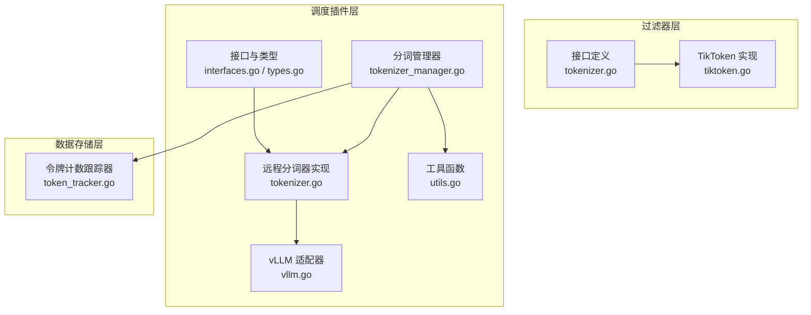
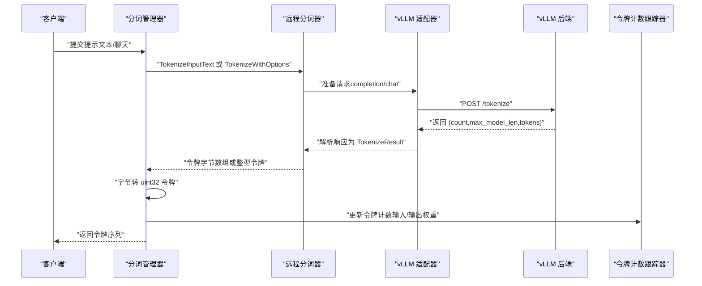
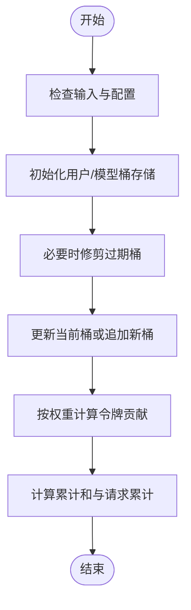
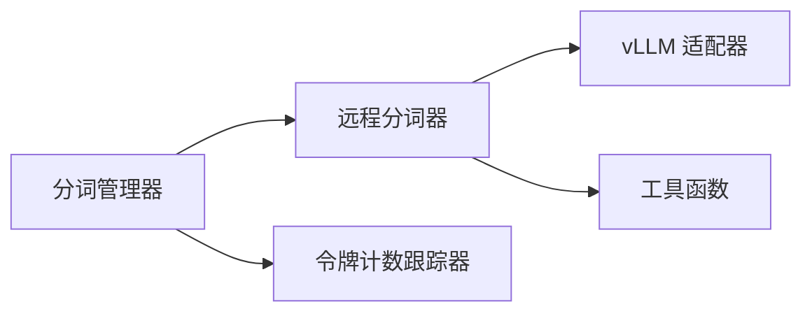

# 分词与估算

<cite>
**本文引用的文件**
- [tiktoken.go](file://pkg/kthena-router/filters/tokenizer/tiktoken.go)
- [tokenizer.go](file://pkg/kthena-router/filters/tokenizer/tokenizer.go)
- [types.go](file://pkg/kthena-router/scheduler/plugins/tokenization/types.go)
- [interfaces.go](file://pkg/kthena-router/scheduler/plugins/tokenization/interfaces.go)
- [tokenizer.go](file://pkg/kthena-router/scheduler/plugins/tokenization/tokenizer.go)
- [tokenizer_manager.go](file://pkg/kthena-router/scheduler/plugins/tokenization/tokenizer_manager.go)
- [vllm.go](file://pkg/kthena-router/scheduler/plugins/tokenization/vllm.go)
- [utils.go](file://pkg/kthena-router/scheduler/plugins/tokenization/utils.go)
- [token_tracker.go](file://pkg/kthena-router/datastore/token_tracker.go)
- [kvcache_aware_test.go](file://pkg/kthena-router/scheduler/plugins/kvcache_aware_test.go)
- [tokenization_test.go](file://pkg/kthena-router/scheduler/plugins/tokenization/tokenization_test.go)
</cite>

## 目录
1. [简介](#简介)
2. [项目结构](#项目结构)
3. [核心组件](#核心组件)
4. [架构总览](#架构总览)
5. [详细组件分析](#详细组件分析)
6. [依赖关系分析](#依赖关系分析)
7. [性能考量](#性能考量)
8. [故障排查指南](#故障排查指南)
9. [结论](#结论)
10. [附录](#附录)

## 简介
本文件面向 Kthena 的分词与估算系统，聚焦以下目标：
- 设计并实现统一的分词接口，支持文本与聊天消息两类输入，并可扩展到多模型后端（如 vLLM）。
- 提供令牌估算能力：通过分词结果统计令牌数量，结合滑动窗口计数器进行请求与令牌用量统计。
- 解释 TikToken 实现（OpenAI 模型的分词算法），包括编码映射与性能优化思路。
- 文档化令牌计数的实现细节：文本预处理、特殊标记处理、上下文长度计算与成本估算。
- 给出配置示例、估算精度分析与性能基准测试方法，以及模型兼容性与优化建议。

## 项目结构
围绕分词与估算的相关代码主要分布在如下模块：
- 过滤器层：提供通用的分词接口与 TikToken 实现，便于在路由或接入层快速使用。
- 调度插件层：定义分词接口、远程分词器（vLLM）、分词管理器与适配器，负责将文本/聊天消息转换为令牌序列。
- 数据存储层：提供基于滑动窗口的令牌计数跟踪器，用于估算与成本控制。



图表来源
- [tokenizer.go:19-21](file://pkg/kthena-router/filters/tokenizer/tokenizer.go#L19-L21)
- [tiktoken.go:26-35](file://pkg/kthena-router/filters/tokenizer/tiktoken.go#L26-L35)
- [interfaces.go:21-43](file://pkg/kthena-router/scheduler/plugins/tokenization/interfaces.go#L21-L43)
- [tokenizer.go:23-95](file://pkg/kthena-router/scheduler/plugins/tokenization/tokenizer.go#L23-L95)
- [tokenizer_manager.go:31-87](file://pkg/kthena-router/scheduler/plugins/tokenization/tokenizer_manager.go#L31-L87)
- [vllm.go:24-84](file://pkg/kthena-router/scheduler/plugins/tokenization/vllm.go#L24-L84)
- [utils.go:21-27](file://pkg/kthena-router/scheduler/plugins/tokenization/utils.go#L21-L27)
- [token_tracker.go:34-110](file://pkg/kthena-router/datastore/token_tracker.go#L34-L110)

章节来源
- [tokenizer.go:19-21](file://pkg/kthena-router/filters/tokenizer/tokenizer.go#L19-L21)
- [tiktoken.go:26-35](file://pkg/kthena-router/filters/tokenizer/tiktoken.go#L26-L35)
- [interfaces.go:21-43](file://pkg/kthena-router/scheduler/plugins/tokenization/interfaces.go#L21-L43)
- [tokenizer.go:23-95](file://pkg/kthena-router/scheduler/plugins/tokenization/tokenizer.go#L23-L95)
- [tokenizer_manager.go:31-87](file://pkg/kthena-router/scheduler/plugins/tokenization/tokenizer_manager.go#L31-L87)
- [vllm.go:24-84](file://pkg/kthena-router/scheduler/plugins/tokenization/vllm.go#L24-L84)
- [utils.go:21-27](file://pkg/kthena-router/scheduler/plugins/tokenization/utils.go#L21-L27)
- [token_tracker.go:34-110](file://pkg/kthena-router/datastore/token_tracker.go#L34-L110)

## 核心组件
- 分词接口与 TikToken 实现（过滤器层）
  - 接口定义：统一的分词入口，返回文本的令牌数量。
  - TikToken 实现：基于 cl100k_base 编码，离线加载 BPE 字节对编码器，调用 OpenAI 风格的分词库完成编码。
- 分词器接口与远程分词器（调度插件层）
  - 基础接口：TokenizeInputText 返回字节数组形式的令牌。
  - 扩展接口：TokenizeWithOptions 支持聊天模板、特殊标记等高级选项。
  - 远程分词器：封装 HTTP 客户端与 vLLM 适配器，将输入转换为 JSON 请求并解析响应。
  - 分词管理器：从可用 Pod 中随机选择一个作为分词后端，支持文本与聊天两种输入。
  - vLLM 适配器：根据输入类型生成 completion/chat 请求体，解析响应中的令牌数组。
  - 工具函数：将整型令牌数组转换为字节数组，便于网络传输与内存表示。
- 令牌计数跟踪器（数据存储层）
  - 滑动窗口：固定时间窗口内按桶记录令牌累计值与请求数，支持权重计算（输入/输出不同权重）。
  - 并发安全：读写锁保护，惰性修剪过期桶，降低内存占用。
  - 查询与更新：O(1) 均摊时间复杂度（摊还），最坏情况 O(B_u) 线性扫描桶。

章节来源
- [tokenizer.go:19-21](file://pkg/kthena-router/filters/tokenizer/tokenizer.go#L19-L21)
- [tiktoken.go:26-35](file://pkg/kthena-router/filters/tokenizer/tiktoken.go#L26-L35)
- [interfaces.go:21-43](file://pkg/kthena-router/scheduler/plugins/tokenization/interfaces.go#L21-L43)
- [tokenizer.go:23-95](file://pkg/kthena-router/scheduler/plugins/tokenization/tokenizer.go#L23-L95)
- [tokenizer_manager.go:31-147](file://pkg/kthena-router/scheduler/plugins/tokenization/tokenizer_manager.go#L31-L147)
- [vllm.go:24-84](file://pkg/kthena-router/scheduler/plugins/tokenization/vllm.go#L24-L84)
- [utils.go:21-27](file://pkg/kthena-router/scheduler/plugins/tokenization/utils.go#L21-L27)
- [token_tracker.go:34-357](file://pkg/kthena-router/datastore/token_tracker.go#L34-L357)

## 架构总览
下图展示了从请求进入，到分词、令牌转换、KV 缓存块哈希计算，再到令牌计数统计的整体流程。



图表来源
- [tokenizer_manager.go:89-147](file://pkg/kthena-router/scheduler/plugins/tokenization/tokenizer_manager.go#L89-L147)
- [tokenizer.go:39-82](file://pkg/kthena-router/scheduler/plugins/tokenization/tokenizer.go#L39-L82)
- [vllm.go:42-84](file://pkg/kthena-router/scheduler/plugins/tokenization/vllm.go#L42-L84)
- [token_tracker.go:245-307](file://pkg/kthena-router/datastore/token_tracker.go#L245-L307)

## 详细组件分析

### TikToken 实现（OpenAI 模型分词）
- 设计要点
  - 使用 cl100k_base 编码，覆盖大多数 OpenAI 模型的词汇表。
  - 通过离线加载器避免运行时网络依赖，提升稳定性与性能。
  - 封装为单一方法，直接返回令牌数量，适合快速估算与校验。
- 复杂度与精度
  - 时间复杂度近似 O(n)，n 为输入文本长度；空间复杂度 O(k)，k 为生成的子词数量。
  - 精度高，与官方 OpenAI 分词行为一致，适合用于成本估算与上下文长度预估。
- 性能优化
  - 预加载编码器，避免重复初始化。
  - 对于批量估算，建议复用同一编码器实例以减少开销。

章节来源
- [tiktoken.go:24-35](file://pkg/kthena-router/filters/tokenizer/tiktoken.go#L24-L35)

### 分词器接口设计与多模型支持
- 接口层次
  - 基础 Tokenizer：TokenizeInputText，返回字节数组形式的令牌。
  - 扩展 Tokenizer：TokenizeWithOptions，支持聊天模板、特殊标记、生成提示等。
  - 远程分词器：封装 HTTP 客户端与引擎适配器，统一请求/响应格式。
- 输入类型与处理
  - completion：纯文本输入，可选添加特殊标记与返回 token 字符串。
  - chat：消息列表，支持添加生成提示、工具调用参数等。
- 多模型支持
  - 通过模型名注入到请求体中，适配不同后端模型的分词行为。
  - 分词管理器从可用 Pod 列表中随机选择后端，提升可用性与容错。

```mermaid
classDiagram
class Tokenizer {
+TokenizeInputText(text) []byte
}
class ExtendedTokenizer {
+TokenizeWithOptions(ctx, input) TokenizeResult
}
class remoteTokenizerImpl {
-config RemoteTokenizerConfig
-client httpClient
-adapter engineAdapter
+TokenizeInputText(text) []byte
+TokenizeWithOptions(ctx, input) TokenizeResult
+GetEndpoint() string
+Close() error
}
class vllmAdapter {
-model string
+PrepareTokenizeRequest(input) interface{}
+ParseTokenizeResponse(data) TokenizeResult
+GetTokenizePath() string
}
class TokenizerManager {
-config TokenizerManagerConfig
+GetTokenizer(model, pods) Tokenizer
+TokenizePrompt(model, prompt, pods) []uint32
}
ExtendedTokenizer <|.. remoteTokenizerImpl
Tokenizer <|.. remoteTokenizerImpl
remoteTokenizerImpl --> vllmAdapter : "使用"
TokenizerManager --> remoteTokenizerImpl : "创建/选择"
```

图表来源
- [interfaces.go:21-43](file://pkg/kthena-router/scheduler/plugins/tokenization/interfaces.go#L21-L43)
- [tokenizer.go:23-95](file://pkg/kthena-router/scheduler/plugins/tokenization/tokenizer.go#L23-L95)
- [vllm.go:28-84](file://pkg/kthena-router/scheduler/plugins/tokenization/vllm.go#L28-L84)
- [tokenizer_manager.go:31-87](file://pkg/kthena-router/scheduler/plugins/tokenization/tokenizer_manager.go#L31-L87)

章节来源
- [interfaces.go:21-43](file://pkg/kthena-router/scheduler/plugins/tokenization/interfaces.go#L21-L43)
- [tokenizer.go:23-95](file://pkg/kthena-router/scheduler/plugins/tokenization/tokenizer.go#L23-L95)
- [vllm.go:28-84](file://pkg/kthena-router/scheduler/plugins/tokenization/vllm.go#L28-L84)
- [tokenizer_manager.go:31-147](file://pkg/kthena-router/scheduler/plugins/tokenization/tokenizer_manager.go#L31-L147)

### 令牌估算策略与算法实现
- 估算策略
  - 基于分词结果统计令牌数量，支持输入/输出不同权重，便于成本估算。
  - 结合滑动窗口，按用户与模型维度统计令牌总量与请求次数。
- 算法实现
  - 滑动窗口：固定窗口大小，按秒级桶记录令牌累计值与请求累计值。
  - 权重计算：输入令牌权重与输出令牌权重可配置，默认输出权重更高。
  - 惰性修剪：仅在需要时获取写锁修剪过期桶，降低锁竞争。
- 精度控制
  - 窗口大小与权重直接影响估算精度与时效性，需结合业务场景调优。
  - 对于高频短窗口场景，建议适当放宽窗口大小以减少频繁修剪带来的抖动。



图表来源
- [token_tracker.go:118-156](file://pkg/kthena-router/datastore/token_tracker.go#L118-L156)
- [token_tracker.go:245-307](file://pkg/kthena-router/datastore/token_tracker.go#L245-L307)

章节来源
- [token_tracker.go:27-357](file://pkg/kthena-router/datastore/token_tracker.go#L27-L357)

### 特殊标记处理与上下文长度计算
- 特殊标记
  - 可配置是否添加特殊标记，影响最终令牌数量与上下文长度。
  - 在聊天模板场景下，可通过参数控制是否添加生成提示与继续最后一条消息。
- 上下文长度
  - 通过 max_model_len 字段与令牌计数共同评估是否超出模型上下文限制。
  - 结合滑动窗口统计，动态监控用户/模型维度的使用趋势。

章节来源
- [types.go:28-70](file://pkg/kthena-router/scheduler/plugins/tokenization/types.go#L28-L70)
- [vllm.go:42-84](file://pkg/kthena-router/scheduler/plugins/tokenization/vllm.go#L42-L84)

### KV 缓存块哈希与令牌分块（用于缓存命中优化）
- 目标
  - 将长序列令牌划分为固定大小的块，计算块级哈希，用于 KV 缓存命中判断与负载均衡。
- 方法
  - TokenBlockProcessor：按 blockSize 将令牌分块，计算块哈希；支持最大块数限制。
  - 测试覆盖边界条件、碰撞抗性、性能与内存效率。
- 关键点
  - 块大小与最大块数影响缓存命中率与内存占用，需结合模型与部署规模调优。

章节来源
- [kvcache_aware_test.go:257-313](file://pkg/kthena-router/scheduler/plugins/kvcache_aware_test.go#L257-L313)
- [kvcache_aware_test.go:597-639](file://pkg/kthena-router/scheduler/plugins/kvcache_aware_test.go#L597-L639)
- [kvcache_aware_test.go:1284-1375](file://pkg/kthena-router/scheduler/plugins/kvcache_aware_test.go#L1284-L1375)

## 依赖关系分析
- 组件耦合
  - 分词管理器依赖远程分词器与工具函数；远程分词器依赖适配器与 HTTP 客户端。
  - 令牌计数跟踪器独立于分词模块，仅接收令牌统计结果，低耦合设计便于替换或扩展。
- 外部依赖
  - TikToken 依赖外部 BPE 编码器与离线加载器。
  - vLLM 适配器依赖后端 /tokenize 接口，需确保后端版本与字段兼容。



图表来源
- [tokenizer_manager.go:46-87](file://pkg/kthena-router/scheduler/plugins/tokenization/tokenizer_manager.go#L46-L87)
- [tokenizer.go:23-95](file://pkg/kthena-router/scheduler/plugins/tokenization/tokenizer.go#L23-L95)
- [vllm.go:28-84](file://pkg/kthena-router/scheduler/plugins/tokenization/vllm.go#L28-L84)
- [utils.go:21-27](file://pkg/kthena-router/scheduler/plugins/tokenization/utils.go#L21-L27)
- [token_tracker.go:34-110](file://pkg/kthena-router/datastore/token_tracker.go#L34-L110)

## 性能考量
- 分词性能
  - TikToken：单次分词近似 O(n)，适合轻量估算；批量估算建议复用编码器实例。
  - 远程分词器：受网络延迟与后端处理时间影响，建议启用连接池与超时控制。
- 令牌计数性能
  - 滑动窗口查询与更新均为摊还 O(1)，最坏 O(B_u)；通过惰性修剪与切片紧凑降低内存占用。
- KV 缓存分块
  - 分块大小与最大块数影响哈希计算与缓存命中；建议通过基准测试确定最优参数。

章节来源
- [tiktoken.go:24-35](file://pkg/kthena-router/filters/tokenizer/tiktoken.go#L24-L35)
- [token_tracker.go:194-243](file://pkg/kthena-router/datastore/token_tracker.go#L194-L243)
- [kvcache_aware_test.go:989-996](file://pkg/kthena-router/scheduler/plugins/kvcache_aware_test.go#L989-L996)

## 故障排查指南
- 常见错误类型
  - 令牌化失败：请求准备失败、HTTP 请求失败、响应解析失败。
  - 无可用分词器：Pod 列表为空或均不可用。
  - 空提示：未提供文本或消息列表。
- 排查步骤
  - 检查分词管理器日志，确认已成功创建远程分词器。
  - 校验 vLLM 后端 /tokenize 接口返回格式与字段一致性。
  - 确认 TikToken 加载器与编码器初始化成功。
  - 对令牌计数异常，检查窗口大小与权重配置，验证桶修剪逻辑是否触发。
- 单元测试与基准
  - 提供远程分词器、适配器、错误类型与并发请求的测试用例。
  - 提供 intToByteArray 与 TokenizeInputText 的基准测试，便于性能回归。

章节来源
- [tokenization_test.go:119-153](file://pkg/kthena-router/scheduler/plugins/tokenization/tokenization_test.go#L119-L153)
- [tokenization_test.go:292-337](file://pkg/kthena-router/scheduler/plugins/tokenization/tokenization_test.go#L292-L337)
- [tokenization_test.go:511-548](file://pkg/kthena-router/scheduler/plugins/tokenization/tokenization_test.go#L511-L548)
- [kvcache_aware_test.go:894-933](file://pkg/kthena-router/scheduler/plugins/kvcache_aware_test.go#L894-L933)

## 结论
Kthena 的分词与估算系统通过清晰的接口分层与模块化设计，实现了从文本/聊天消息到令牌序列的高效转换，并提供了基于滑动窗口的成本估算能力。TikToken 与 vLLM 适配器分别满足了快速估算与多模型后端的需求；令牌计数跟踪器则为资源控制与成本预测提供了可靠支撑。通过合理的参数配置与性能基准测试，可在精度与性能之间取得平衡。

## 附录

### 分词配置示例
- TikToken 快速估算
  - 使用 cl100k_base 编码，离线加载 BPE，直接计算令牌数量。
- 远程分词器配置
  - 指定后端引擎（如 vLLM）、服务地址与模型名，控制是否添加特殊标记与返回 token 字符串。
- 分词管理器配置
  - 设置端点模板与启用远程分词开关，从可用 Pod 列表中选择后端。
- 令牌计数跟踪器配置
  - 设置窗口大小与输入/输出权重，确保符合业务成本模型。

章节来源
- [tiktoken.go:24-35](file://pkg/kthena-router/filters/tokenizer/tiktoken.go#L24-L35)
- [tokenizer.go:29-37](file://pkg/kthena-router/scheduler/plugins/tokenization/tokenizer.go#L29-L37)
- [tokenizer_manager.go:31-44](file://pkg/kthena-router/scheduler/plugins/tokenization/tokenizer_manager.go#L31-L44)
- [token_tracker.go:66-94](file://pkg/kthena-router/datastore/token_tracker.go#L66-L94)

### 估算精度分析
- TikToken：与官方 OpenAI 分词高度一致，适合成本估算与上下文长度预估。
- vLLM：严格遵循后端接口返回的令牌序列，适合多模型一致性评估。
- 滑动窗口：通过权重与窗口大小控制估算偏差，建议结合历史数据校准。

章节来源
- [tiktoken.go:24-35](file://pkg/kthena-router/filters/tokenizer/tiktoken.go#L24-L35)
- [vllm.go:72-84](file://pkg/kthena-router/scheduler/plugins/tokenization/vllm.go#L72-L84)
- [token_tracker.go:27-32](file://pkg/kthena-router/datastore/token_tracker.go#L27-L32)

### 性能基准测试
- 基准项
  - intToByteArray：将整型令牌数组转换为字节数组。
  - TokenizeInputText：远程分词器整体吞吐。
- 建议
  - 在相同硬件与后端条件下重复测试，记录吞吐与延迟，建立回归基线。
  - 针对不同块大小与最大块数进行对比实验，评估缓存命中与内存占用。

章节来源
- [tokenization_test.go:511-548](file://pkg/kthena-router/scheduler/plugins/tokenization/tokenization_test.go#L511-L548)
- [kvcache_aware_test.go:989-996](file://pkg/kthena-router/scheduler/plugins/kvcache_aware_test.go#L989-L996)

### 模型兼容性与优化建议
- 兼容性
  - TikToken：适用于 OpenAI 官方模型族；对于非标准模型，建议使用远程分词器。
  - vLLM：确保后端 /tokenize 接口字段与适配器一致；模型名需与后端注册模型匹配。
- 优化建议
  - 优先使用离线加载器与预热编码器，减少冷启动开销。
  - 合理设置滑动窗口与权重，避免过度修剪导致统计波动。
  - 对长序列采用分块与哈希策略，提升缓存命中与推理效率。

章节来源
- [tiktoken.go:24-35](file://pkg/kthena-router/filters/tokenizer/tiktoken.go#L24-L35)
- [vllm.go:24-84](file://pkg/kthena-router/scheduler/plugins/tokenization/vllm.go#L24-L84)
- [token_tracker.go:66-94](file://pkg/kthena-router/datastore/token_tracker.go#L66-L94)
- [kvcache_aware_test.go:1284-1375](file://pkg/kthena-router/scheduler/plugins/kvcache_aware_test.go#L1284-L1375)