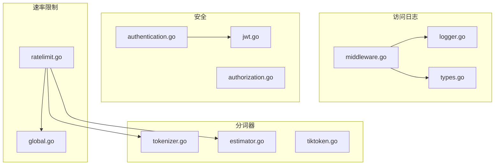
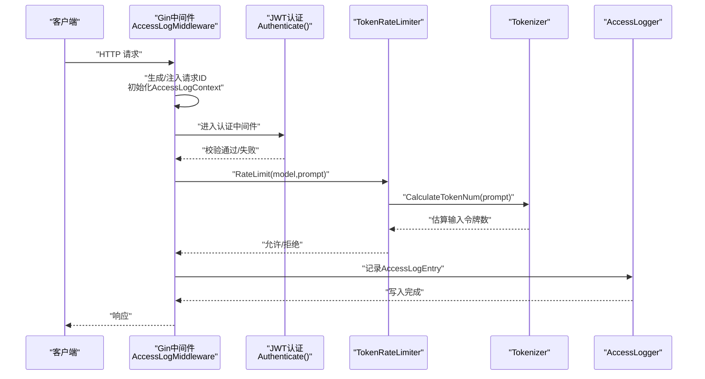
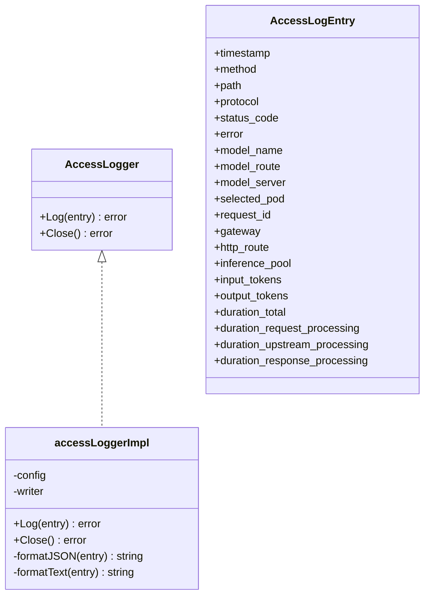
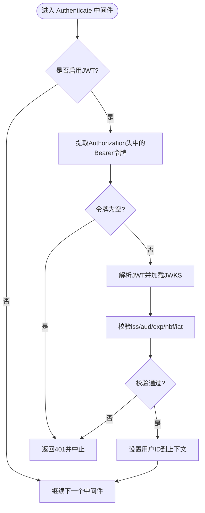
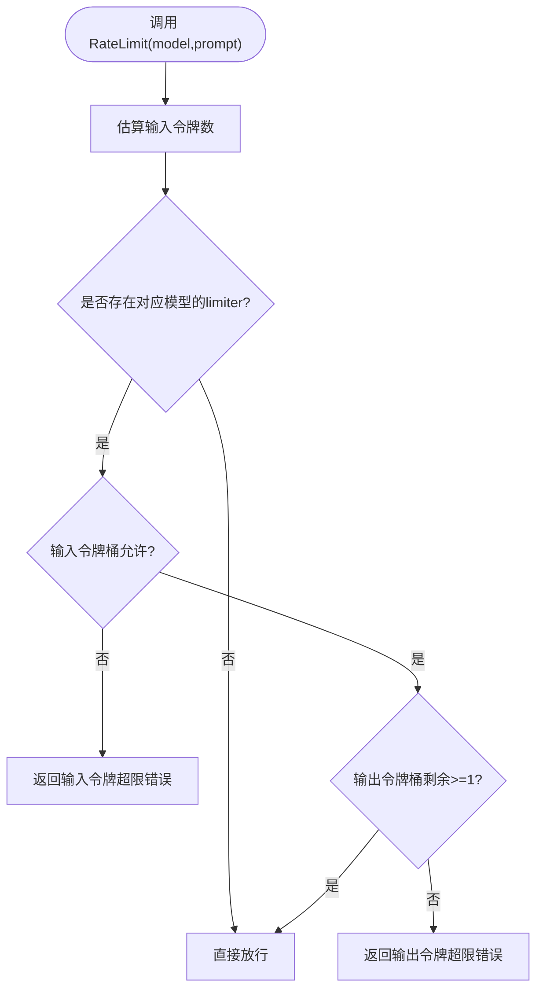
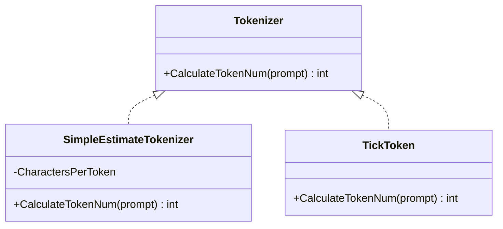
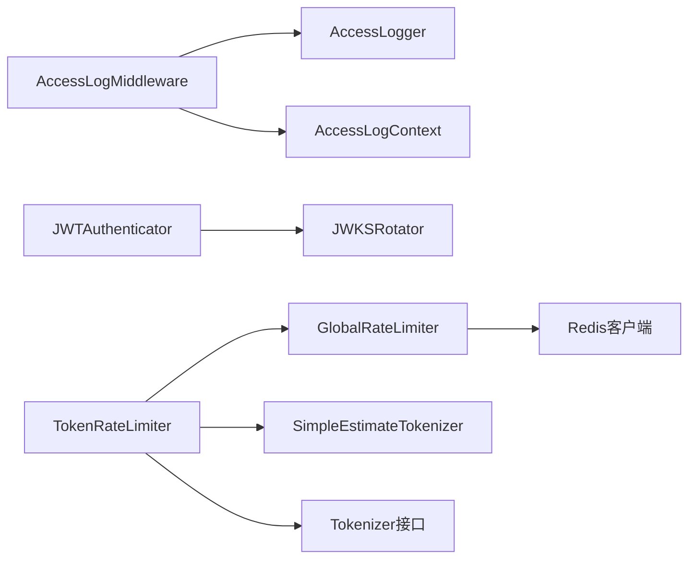

# 流量控制与安全

<cite>
**本文引用的文件**
- [logger.go](file://pkg/kthena-router/accesslog/logger.go)
- [middleware.go](file://pkg/kthena-router/accesslog/middleware.go)
- [types.go](file://pkg/kthena-router/accesslog/types.go)
- [authentication.go](file://pkg/kthena-router/filters/auth/authentication.go)
- [jwt.go](file://pkg/kthena-router/filters/auth/jwt.go)
- [authorization.go](file://pkg/kthena-router/filters/auth/authorization.go)
- [ratelimit.go](file://pkg/kthena-router/filters/ratelimit/ratelimit.go)
- [global.go](file://pkg/kthena-router/filters/ratelimit/global.go)
- [estimator.go](file://pkg/kthena-router/filters/tokenizer/estimator.go)
- [tokenizer.go](file://pkg/kthena-router/filters/tokenizer/tokenizer.go)
- [tiktoken.go](file://pkg/kthena-router/filters/tokenizer/tiktoken.go)
- [ratelimit_test.go](file://pkg/kthena-router/filters/ratelimit/ratelimit_test.go)
</cite>

## 目录
1. [简介](#简介)
2. [项目结构](#项目结构)
3. [核心组件](#核心组件)
4. [架构总览](#架构总览)
5. [详细组件分析](#详细组件分析)
6. [依赖分析](#依赖分析)
7. [性能考虑](#性能考虑)
8. [故障排查指南](#故障排查指南)
9. [结论](#结论)
10. [附录](#附录)

## 简介
本文件面向 Kthena 的“流量控制与安全”子系统，系统性梳理并文档化以下能力：
- 速率限制：本地与全局（基于 Redis）的令牌桶算法实现，支持输入/输出令牌独立限流与退避策略。
- 认证授权：基于 JWKS 的 JWT 验证、声明校验与 Gin 中间件集成；当前授权逻辑预留扩展点。
- 访问日志：结构化日志输出（JSON/文本），包含请求生命周期时间拆解、AI 路由信息、令牌用量等。
- 分词器估算器：简单字符估算与 TikToken 实现，用于输入令牌估算与成本粗略评估。

## 项目结构
围绕“流量控制与安全”，关键代码位于 pkg/kthena-router 下的 accesslog、filters 子目录：
- 访问日志：logger、middleware、types
- 安全：auth（authentication、jwt、authorization）
- 速率限制：ratelimit（local 与 global 基于 Redis 的实现）
- 分词器：tokenizer（接口、简单估算、TikToken）

**图表来源**
- [logger.go:1-220](file://pkg/kthena-router/accesslog/logger.go#L1-L220)
- [middleware.go:1-138](file://pkg/kthena-router/accesslog/middleware.go#L1-L138)
- [types.go:1-224](file://pkg/kthena-router/accesslog/types.go#L1-L224)
- [authentication.go:1-331](file://pkg/kthena-router/filters/auth/authentication.go#L1-L331)
- [jwt.go:1-144](file://pkg/kthena-router/filters/auth/jwt.go#L1-L144)
- [authorization.go:1-25](file://pkg/kthena-router/filters/auth/authorization.go#L1-L25)
- [ratelimit.go:1-231](file://pkg/kthena-router/filters/ratelimit/ratelimit.go#L1-L231)
- [global.go:1-292](file://pkg/kthena-router/filters/ratelimit/global.go#L1-L292)
- [tokenizer.go:1-22](file://pkg/kthena-router/filters/tokenizer/tokenizer.go#L1-L22)
- [estimator.go:1-45](file://pkg/kthena-router/filters/tokenizer/estimator.go#L1-L45)
- [tiktoken.go:1-36](file://pkg/kthena-router/filters/tokenizer/tiktoken.go#L1-L36)

**章节来源**
- [logger.go:1-220](file://pkg/kthena-router/accesslog/logger.go#L1-L220)
- [middleware.go:1-138](file://pkg/kthena-router/accesslog/middleware.go#L1-L138)
- [types.go:1-224](file://pkg/kthena-router/accesslog/types.go#L1-L224)
- [authentication.go:1-331](file://pkg/kthena-router/filters/auth/authentication.go#L1-L331)
- [jwt.go:1-144](file://pkg/kthena-router/filters/auth/jwt.go#L1-L144)
- [authorization.go:1-25](file://pkg/kthena-router/filters/auth/authorization.go#L1-L25)
- [ratelimit.go:1-231](file://pkg/kthena-router/filters/ratelimit/ratelimit.go#L1-L231)
- [global.go:1-292](file://pkg/kthena-router/filters/ratelimit/global.go#L1-L292)
- [tokenizer.go:1-22](file://pkg/kthena-router/filters/tokenizer/tokenizer.go#L1-L22)
- [estimator.go:1-45](file://pkg/kthena-router/filters/tokenizer/estimator.go#L1-L45)
- [tiktoken.go:1-36](file://pkg/kthena-router/filters/tokenizer/tiktoken.go#L1-L36)

## 核心组件
- 访问日志模块：提供可插拔的日志输出（JSON/文本）、Gin 中间件、生命周期计时与 AI 路由/令牌字段聚合。
- 安全模块：JWT 验证（含 JWKS 自动轮转）、声明校验（签发者、受众、有效期等）、Gin 中间件注入。
- 速率限制模块：统一 TokenRateLimiter，支持本地令牌桶与分布式 Redis 令牌桶；分别对输入/输出令牌进行限流与退避。
- 分词器模块：Tokenizer 接口抽象，SimpleEstimateTokenizer 提供字符密度估算，TikToken 提供更精确的编码估算。

**章节来源**
- [logger.go:28-98](file://pkg/kthena-router/accesslog/logger.go#L28-L98)
- [middleware.go:30-63](file://pkg/kthena-router/accesslog/middleware.go#L30-L63)
- [authentication.go:56-80](file://pkg/kthena-router/filters/auth/authentication.go#L56-L80)
- [jwt.go:54-85](file://pkg/kthena-router/filters/auth/jwt.go#L54-L85)
- [ratelimit.go:51-98](file://pkg/kthena-router/filters/ratelimit/ratelimit.go#L51-L98)
- [global.go:74-96](file://pkg/kthena-router/filters/ratelimit/global.go#L74-L96)
- [tokenizer.go:19-21](file://pkg/kthena-router/filters/tokenizer/tokenizer.go#L19-L21)

## 架构总览
下图展示从请求进入路由到完成处理的关键路径：中间件采集元数据与计时，安全过滤器执行 JWT 校验，速率限制器进行令牌桶检查，分词器估算输入令牌，最终访问日志记录完整生命周期指标。

**图表来源**
- [middleware.go:30-63](file://pkg/kthena-router/accesslog/middleware.go#L30-L63)
- [authentication.go:310-330](file://pkg/kthena-router/filters/auth/authentication.go#L310-L330)
- [ratelimit.go:100-126](file://pkg/kthena-router/filters/ratelimit/ratelimit.go#L100-L126)
- [estimator.go:35-44](file://pkg/kthena-router/filters/tokenizer/estimator.go#L35-L44)
- [logger.go:100-128](file://pkg/kthena-router/accesslog/logger.go#L100-L128)

## 详细组件分析

### 访问日志系统
- 日志接口与实现：定义 AccessLogger 接口，支持 JSON/文本两种格式；默认启用，支持 stdout/stderr/file 输出。
- Gin 中间件：自动注入请求 ID、记录请求阶段起止时间点，完成后汇总为 AccessLogEntry 并写入。
- 日志条目字段：标准 HTTP 字段、错误信息、AI 路由信息（模型名/路由/服务/Pod）、Gateway API 扩展字段、令牌用量、完整耗时与三段式耗时分解。

**图表来源**
- [logger.go:28-136](file://pkg/kthena-router/accesslog/logger.go#L28-L136)
- [types.go:23-56](file://pkg/kthena-router/accesslog/types.go#L23-L56)

**章节来源**
- [logger.go:28-136](file://pkg/kthena-router/accesslog/logger.go#L28-L136)
- [types.go:23-97](file://pkg/kthena-router/accesslog/types.go#L23-L97)
- [middleware.go:30-63](file://pkg/kthena-router/accesslog/middleware.go#L30-L63)

### 认证授权系统
- JWT 验证：从 Authorization 头提取 Bearer 令牌，使用 JWKS 进行密钥解析与签名验证。
- 声明校验：签发者（iss）、受众（aud，可多值）、过期时间（exp）、生效时间（nbf）、签发时间（iat）等。
- JWKS 轮转：定时拉取 JWKS，支持并发读写保护与停止信号。
- Gin 中间件：在启用时拦截请求，校验失败返回 401；成功则将用户标识写入上下文键。

**图表来源**
- [authentication.go:310-330](file://pkg/kthena-router/filters/auth/authentication.go#L310-L330)
- [authentication.go:286-303](file://pkg/kthena-router/filters/auth/authentication.go#L286-L303)
- [jwt.go:63-104](file://pkg/kthena-router/filters/auth/jwt.go#L63-L104)

**章节来源**
- [authentication.go:56-80](file://pkg/kthena-router/filters/auth/authentication.go#L56-L80)
- [authentication.go:104-118](file://pkg/kthena-router/filters/auth/authentication.go#L104-L118)
- [authentication.go:286-303](file://pkg/kthena-router/filters/auth/authentication.go#L286-L303)
- [jwt.go:106-120](file://pkg/kthena-router/filters/auth/jwt.go#L106-L120)

### 速率限制机制
- 统一 TokenRateLimiter：对输入/输出令牌分别维护 limiter 映射；支持本地与全局两种模式。
- 本地令牌桶：基于 golang.org/x/time/rate.Limiter，按单位时间换算速率与突发。
- 全局令牌桶：基于 Redis Lua 脚本原子执行，确保跨实例一致性；内置过期策略与边界保护。
- 估算与检查：先用分词器估算输入令牌，再检查输入令牌桶；对输出令牌桶采用保守检查（剩余不足 1 则拒绝）以避免浪费上游资源。
- 记录与退避：实际输出令牌在生成后回填到输出令牌桶，形成闭环。

**图表来源**
- [ratelimit.go:100-126](file://pkg/kthena-router/filters/ratelimit/ratelimit.go#L100-L126)
- [estimator.go:35-44](file://pkg/kthena-router/filters/tokenizer/estimator.go#L35-L44)

**章节来源**
- [ratelimit.go:51-98](file://pkg/kthena-router/filters/ratelimit/ratelimit.go#L51-L98)
- [ratelimit.go:139-204](file://pkg/kthena-router/filters/ratelimit/ratelimit.go#L139-L204)
- [global.go:74-96](file://pkg/kthena-router/filters/ratelimit/global.go#L74-L96)
- [global.go:98-177](file://pkg/kthena-router/filters/ratelimit/global.go#L98-L177)
- [global.go:179-221](file://pkg/kthena-router/filters/ratelimit/global.go#L179-L221)
- [global.go:223-291](file://pkg/kthena-router/filters/ratelimit/global.go#L223-L291)

### 分词器估算器
- 接口抽象：Tokenizer 接口统一不同实现的估算行为。
- 简单估算：按字符密度估算令牌数量，适合快速估算与兜底。
- TikToken：基于官方编码表进行精确估算，适合高精度场景。
- 成本估算：可结合令牌数与单价进行成本粗略评估（估算器不直接负责计费，仅提供令牌数）。

**图表来源**
- [tokenizer.go:19-21](file://pkg/kthena-router/filters/tokenizer/tokenizer.go#L19-L21)
- [estimator.go:25-44](file://pkg/kthena-router/filters/tokenizer/estimator.go#L25-L44)
- [tiktoken.go:26-35](file://pkg/kthena-router/filters/tokenizer/tiktoken.go#L26-L35)

**章节来源**
- [tokenizer.go:19-21](file://pkg/kthena-router/filters/tokenizer/tokenizer.go#L19-L21)
- [estimator.go:25-44](file://pkg/kthena-router/filters/tokenizer/estimator.go#L25-L44)
- [tiktoken.go:26-35](file://pkg/kthena-router/filters/tokenizer/tiktoken.go#L26-L35)

## 依赖分析
- 访问日志依赖 Gin 上下文与 UUID 生成，日志输出可定向至文件或标准输出流。
- 安全模块依赖 JWKS 拉取与 JWT 解析库，声明校验覆盖签发者、受众与时间窗口。
- 速率限制依赖 Redis 客户端与令牌桶库；全局模式通过 Lua 脚本保证原子性。
- 分词器依赖 TikToken 编码库，提供更贴近真实模型的估算。

**图表来源**
- [middleware.go:30-63](file://pkg/kthena-router/accesslog/middleware.go#L30-L63)
- [logger.go:69-98](file://pkg/kthena-router/accesslog/logger.go#L69-L98)
- [authentication.go:56-80](file://pkg/kthena-router/filters/auth/authentication.go#L56-L80)
- [jwt.go:54-85](file://pkg/kthena-router/filters/auth/jwt.go#L54-L85)
- [ratelimit.go:139-204](file://pkg/kthena-router/filters/ratelimit/ratelimit.go#L139-L204)
- [global.go:74-96](file://pkg/kthena-router/filters/ratelimit/global.go#L74-L96)

**章节来源**
- [middleware.go:19-23](file://pkg/kthena-router/accesslog/middleware.go#L19-L23)
- [authentication.go:21-36](file://pkg/kthena-router/filters/auth/authentication.go#L21-L36)
- [ratelimit.go:19-31](file://pkg/kthena-router/filters/ratelimit/ratelimit.go#L19-L31)
- [global.go:19-28](file://pkg/kthena-router/filters/ratelimit/global.go#L19-L28)

## 性能考虑
- 访问日志
  - 文本格式便于人类阅读与日志收集系统解析；JSON 格式利于结构化检索与告警。
  - 文件输出需注意磁盘 IO 与日志轮转策略，避免阻塞主流程。
- 速率限制
  - 本地令牌桶开销低、延迟小；全局令牌桶具备一致性但引入 Redis RTT，建议合理设置 Lua 脚本与连接池。
  - 对输出令牌采用保守检查（剩余 < 1 即拒绝）可减少上游浪费，提高吞吐稳定性。
- 分词器
  - 简单估算 O(1)、内存占用低；TikToken 更准确但有初始化与编码开销，建议按场景选择或缓存常用模型的编码器。

[本节为通用指导，无需列出具体文件来源]

## 故障排查指南
- 访问日志
  - 若日志未输出：确认配置 Enabled=true、Output 指向有效路径或 stdout/stderr。
  - 文本/JSON 格式异常：检查字段拼接逻辑与时间格式化。
- JWT 认证
  - 401 Unauthorized：检查 Authorization 头格式、JWKS 可达性与轮转状态。
  - 声明校验失败：核对 iss/aud/exp/nbf/iat 类型与取值范围。
- 速率限制
  - 输入/输出令牌超限：检查限流配置单位与突发设置；观察 Redis 键过期与桶状态。
  - 全局模式不可用：确认 Redis 地址可达、Lua 脚本执行结果类型转换。
- 分词器
  - 估算偏差大：切换到 TikToken；检查字符集与编码器加载。

**章节来源**
- [logger.go:79-92](file://pkg/kthena-router/accesslog/logger.go#L79-L92)
- [authentication.go:286-303](file://pkg/kthena-router/filters/auth/authentication.go#L286-L303)
- [jwt.go:122-143](file://pkg/kthena-router/filters/auth/jwt.go#L122-L143)
- [ratelimit.go:114-123](file://pkg/kthena-router/filters/ratelimit/ratelimit.go#L114-L123)
- [global.go:163-176](file://pkg/kthena-router/filters/ratelimit/global.go#L163-L176)
- [tiktoken.go:28-35](file://pkg/kthena-router/filters/tokenizer/tiktoken.go#L28-L35)

## 结论
Kthena 的流量控制与安全体系以“可观测、可扩展、可治理”为目标：通过 Gin 中间件与结构化日志实现端到端可观测；通过 JWKS 驱动的 JWT 验证保障接入安全；通过本地/全局令牌桶实现灵活的输入/输出令牌限流；通过分词器估算器支撑成本与容量规划。建议在生产环境结合业务特征调整限流参数、日志格式与存储策略，并持续监控 Redis 与 JWKS 的健康状态。

[本节为总结性内容，无需列出具体文件来源]

## 附录

### 安全配置示例（要点）
- 启用 JWT 认证：配置 JWKS URI、可选受众列表与签发者。
- 中间件顺序：在路由前挂载认证中间件，确保所有请求均受控。
- 会话管理：当前实现为无状态 JWT 校验，用户标识写入上下文键，不维护服务端会话。

**章节来源**
- [authentication.go:56-80](file://pkg/kthena-router/filters/auth/authentication.go#L56-L80)
- [authentication.go:310-330](file://pkg/kthena-router/filters/auth/authentication.go#L310-L330)

### 速率限制策略（要点）
- 本地限流：适用于单实例或对一致性要求不高的场景，配置简单、延迟低。
- 全局限流：跨实例一致，适合多副本部署；需关注 Redis 性能与脚本执行开销。
- 输入/输出分离：输入令牌决定准入，输出令牌决定资源回收，两者独立配置与观测。
- 退避策略：输出令牌桶保守检查，避免启动后无法完成的请求。

**章节来源**
- [ratelimit.go:139-204](file://pkg/kthena-router/filters/ratelimit/ratelimit.go#L139-L204)
- [global.go:74-96](file://pkg/kthena-router/filters/ratelimit/global.go#L74-L96)
- [global.go:179-221](file://pkg/kthena-router/filters/ratelimit/global.go#L179-L221)

### 日志分析指南（要点）
- 字段解读：timestamp、method、path、protocol、status_code、error、model_*、gateway/*、tokens、timings。
- 时间拆解：总耗时与三段式耗时（请求处理/上游处理/响应处理）用于定位瓶颈。
- 告警建议：对 error 字段、高延迟、高错误率、令牌桶超限事件建立阈值告警。

**章节来源**
- [types.go:23-56](file://pkg/kthena-router/accesslog/types.go#L23-L56)
- [types.go:169-223](file://pkg/kthena-router/accesslog/types.go#L169-L223)
- [logger.go:147-208](file://pkg/kthena-router/accesslog/logger.go#L147-L208)

### 安全威胁防护与合规
- 威胁防护
  - 强制 JWT 校验与声明校验，防止伪造令牌与越权访问。
  - 使用 JWKS 轮转降低密钥泄露影响面。
  - 速率限制防止滥用与资源耗尽。
- 审计与合规
  - 访问日志保留关键字段，满足审计追踪需求。
  - 建议结合集中式日志系统与合规平台进行归档与检索。

**章节来源**
- [authentication.go:104-118](file://pkg/kthena-router/filters/auth/authentication.go#L104-L118)
- [jwt.go:106-120](file://pkg/kthena-router/filters/auth/jwt.go#L106-L120)
- [logger.go:147-208](file://pkg/kthena-router/accesslog/logger.go#L147-L208)