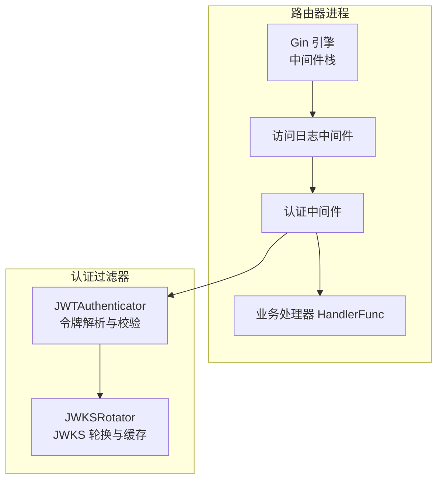
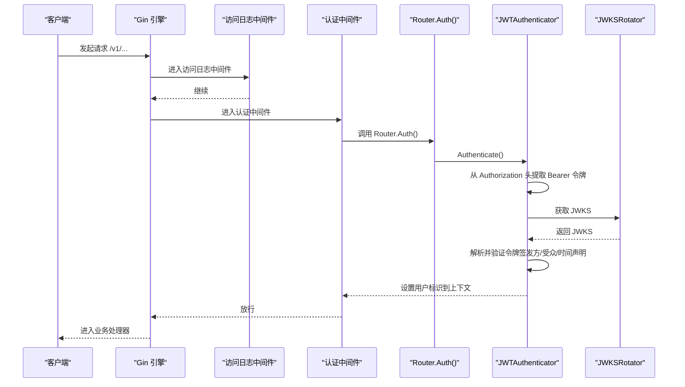
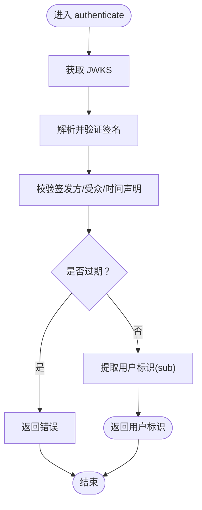
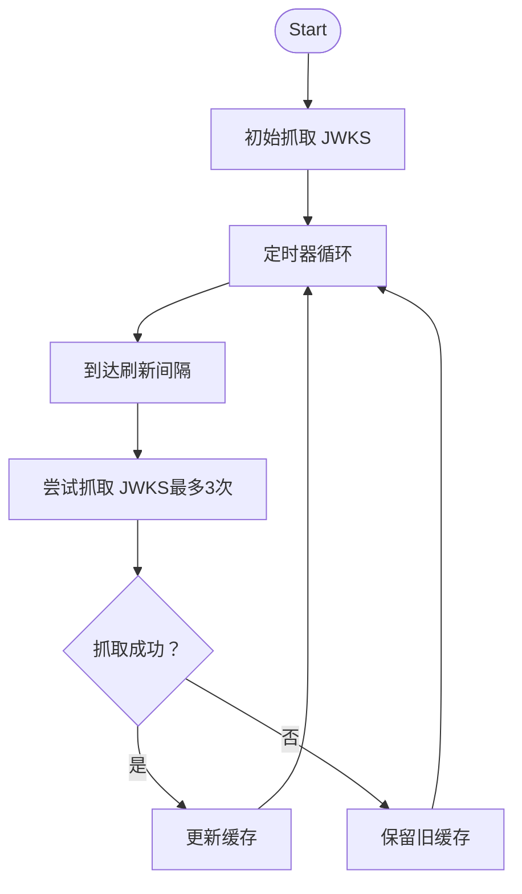
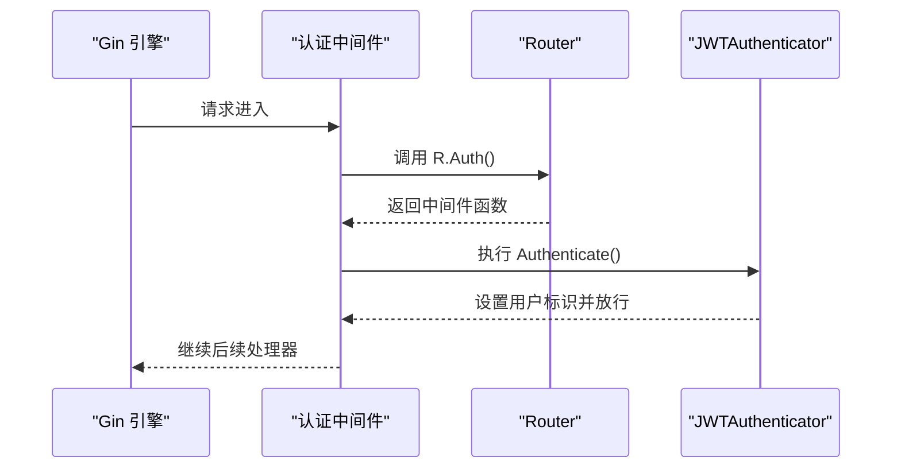
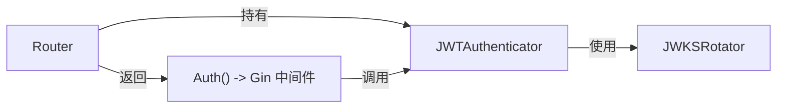

# 认证与授权

<cite>
**本文引用的文件**
- [authentication.go](file://pkg/kthena-router/filters/auth/authentication.go)
- [jwt.go](file://pkg/kthena-router/filters/auth/jwt.go)
- [authorization.go](file://pkg/kthena-router/filters/auth/authorization.go)
- [router.go](file://pkg/kthena-router/router/router.go)
- [router.go（监听器与中间件）](file://cmd/kthena-router/app/router.go)
- [types.go](file://pkg/kthena-router/common/types.go)
- [authentication_test.go](file://pkg/kthena-router/filters/auth/authentication_test.go)
- [jwt_test.go](file://pkg/kthena-router/filters/auth/jwt_test.go)
</cite>

## 目录
1. [简介](#简介)
2. [项目结构](#项目结构)
3. [核心组件](#核心组件)
4. [架构总览](#架构总览)
5. [组件详解](#组件详解)
6. [依赖关系分析](#依赖关系分析)
7. [性能考量](#性能考量)
8. [故障排查指南](#故障排查指南)
9. [结论](#结论)
10. [附录](#附录)

## 简介
本文件面向 Kthena 路由器的认证与授权实现，聚焦以下目标：
- 深入解析 JWT 认证机制：令牌解析、签名验证、过期与时间声明校验、受众与签发方校验。
- 详述权限验证流程：当前实现以用户身份提取为主，RBAC 与资源权限管理在本模块中尚未实现，后续可扩展。
- 阐明认证中间件设计：请求拦截、身份提取、会话上下文注入、错误处理与响应。
- 文档化授权策略现状：当前仅提供鉴权入口，授权逻辑为空实现，建议基于用户标识扩展 RBAC。
- 提供配置示例、安全最佳实践与故障排查指南，并覆盖令牌管理、密钥轮换与安全审计要点。

## 项目结构
与认证授权直接相关的关键目录与文件如下：
- 认证核心：pkg/kthena-router/filters/auth 下的 authentication.go、jwt.go、authorization.go
- 路由器集成：pkg/kthena-router/router/router.go 中初始化与挂载认证器
- 中间件接入：cmd/kthena-router/app/router.go 中对 Gin 引擎注册访问日志与认证中间件
- 上下文键常量：pkg/kthena-router/common/types.go 中定义用户 ID 键
- 单元测试：pkg/kthena-router/filters/auth/authentication_test.go、jwt_test.go

图表来源
- [router.go（监听器与中间件）:245-260](file://cmd/kthena-router/app/router.go#L245-L260)
- [router.go:798-800](file://pkg/kthena-router/router/router.go#L798-L800)
- [authentication.go:50-80](file://pkg/kthena-router/filters/auth/authentication.go#L50-L80)
- [jwt.go:45-85](file://pkg/kthena-router/filters/auth/jwt.go#L45-L85)

章节来源
- [router.go（监听器与中间件）:245-260](file://cmd/kthena-router/app/router.go#L245-L260)
- [router.go:798-800](file://pkg/kthena-router/router/router.go#L798-L800)

## 核心组件
- JWTAuthenticator：负责从请求头提取 Bearer 令牌，使用 JWKS 集合进行签名验证与声明校验（签发方、受众、过期、生效时间等），并将用户标识写入 Gin 上下文。
- JWKSRotator：周期性从 JWKS 地址拉取并缓存公钥集合，支持停止与并发安全读取。
- Router 集成：在路由器初始化时创建 JWTAuthenticator，并通过 Auth() 方法返回 Gin 中间件；在路由组上挂载该中间件。
- 中间件接入：在 /v1 前缀路径启用访问日志与认证中间件，未匹配路径跳过。

章节来源
- [authentication.go:50-80](file://pkg/kthena-router/filters/auth/authentication.go#L50-L80)
- [jwt.go:45-85](file://pkg/kthena-router/filters/auth/jwt.go#L45-L85)
- [router.go:156-168](file://pkg/kthena-router/router/router.go#L156-L168)
- [router.go（监听器与中间件）:245-260](file://cmd/kthena-router/app/router.go#L245-L260)

## 架构总览
下图展示认证在请求生命周期中的位置与调用链：

图表来源
- [router.go（监听器与中间件）:245-260](file://cmd/kthena-router/app/router.go#L245-L260)
- [router.go:798-800](file://pkg/kthena-router/router/router.go#L798-L800)
- [authentication.go:310-330](file://pkg/kthena-router/filters/auth/authentication.go#L310-L330)
- [jwt.go:80-120](file://pkg/kthena-router/filters/auth/jwt.go#L80-L120)

## 组件详解

### JWT 认证器（JWTAuthenticator）
- 功能职责
  - 从 Authorization 头提取 Bearer 令牌。
  - 使用 JWKS 集合与算法推断进行签名验证。
  - 校验关键声明：签发方（iss）、受众（aud，可多值）、过期（exp）、生效（nbf）、签发时间（iat）。
  - 将用户标识（sub）写入 Gin 上下文键，供后续处理器使用。
- 关键行为
  - 当未启用或未配置 JWKS URI 时，认证器标记为禁用，中间件直接放行。
  - 若缺少令牌或解析失败，返回 401 并终止后续处理。
  - 时间声明校验对 exp 必须存在，nbf/iat 允许缺失但有宽松约束（如 iat 不得在未来）。

图表来源
- [authentication.go:82-118](file://pkg/kthena-router/filters/auth/authentication.go#L82-L118)
- [authentication.go:172-284](file://pkg/kthena-router/filters/auth/authentication.go#L172-L284)

章节来源
- [authentication.go:44-48](file://pkg/kthena-router/filters/auth/authentication.go#L44-L48)
- [authentication.go:82-118](file://pkg/kthena-router/filters/auth/authentication.go#L82-L118)
- [authentication.go:172-284](file://pkg/kthena-router/filters/auth/authentication.go#L172-L284)
- [authentication.go:286-303](file://pkg/kthena-router/filters/auth/authentication.go#L286-L303)
- [authentication.go:310-330](file://pkg/kthena-router/filters/auth/authentication.go#L310-L330)

### JWKS 轮换器（JWKSRotator）
- 功能职责
  - 定期从配置的 JWKS 地址抓取并缓存公钥集合。
  - 支持启动/停止，内部使用互斥锁保证并发安全。
  - 默认刷新间隔为 7 天，最多重试 3 次。
- 关键行为
  - 初始启动即尝试一次抓取。
  - 周期性 ticker 触发轮换，失败不中断服务（保留上次成功缓存）。

图表来源
- [jwt.go:63-104](file://pkg/kthena-router/filters/auth/jwt.go#L63-L104)
- [jwt.go:106-143](file://pkg/kthena-router/filters/auth/jwt.go#L106-L143)

章节来源
- [jwt.go:45-85](file://pkg/kthena-router/filters/auth/jwt.go#L45-L85)
- [jwt.go:106-143](file://pkg/kthena-router/filters/auth/jwt.go#L106-L143)

### 认证中间件与路由器集成
- 中间件挂载
  - 在 /v1 前缀路径组启用访问日志与认证中间件。
  - 认证中间件委托给 Router.Auth()，后者返回 JWTAuthenticator.Authenticate()。
- 上下文注入
  - 成功认证后，将用户标识写入 Gin 上下文键，供后续处理器使用。

图表来源
- [router.go（监听器与中间件）:245-260](file://cmd/kthena-router/app/router.go#L245-L260)
- [router.go:798-800](file://pkg/kthena-router/router/router.go#L798-L800)
- [authentication.go:310-330](file://pkg/kthena-router/filters/auth/authentication.go#L310-L330)

章节来源
- [router.go（监听器与中间件）:245-260](file://cmd/kthena-router/app/router.go#L245-L260)
- [router.go:798-800](file://pkg/kthena-router/router/router.go#L798-L800)
- [types.go:19-22](file://pkg/kthena-router/common/types.go#L19-L22)

### 授权策略现状与扩展建议
- 现状
  - 授权入口函数已预留，但当前为空实现，未进行角色映射、权限检查或访问控制策略判定。
- 建议扩展方向（概念性）
  - 基于用户标识（sub）建立角色映射表，结合资源类型与操作进行权限矩阵校验。
  - 可引入策略引擎（如 ABAC/RBAC）或在中间件中增加授权决策点。
  - 对敏感接口设置细粒度授权规则，并记录审计日志。

章节来源
- [authorization.go:23-24](file://pkg/kthena-router/filters/auth/authorization.go#L23-L24)

## 依赖关系分析
- Router 依赖
  - 初始化时创建 JWTAuthenticator，并将其注入到中间件链。
  - HandlerFunc 内部可读取上下文中的用户标识用于后续调度或计费。
- 中间件链
  - 访问日志中间件先于认证中间件执行，确保所有 /v1 请求均被记录。
- 外部依赖
  - 使用 jwx/jwt 进行令牌解析与验证。
  - 使用 jwk.Fetch 抓取 JWKS。

图表来源
- [router.go:156-168](file://pkg/kthena-router/router/router.go#L156-L168)
- [router.go:798-800](file://pkg/kthena-router/router/router.go#L798-L800)
- [authentication.go:50-80](file://pkg/kthena-router/filters/auth/authentication.go#L50-L80)
- [jwt.go:45-85](file://pkg/kthena-router/filters/auth/jwt.go#L45-L85)

章节来源
- [router.go:156-168](file://pkg/kthena-router/router/router.go#L156-L168)
- [authentication.go:50-80](file://pkg/kthena-router/filters/auth/authentication.go#L50-L80)
- [jwt.go:45-85](file://pkg/kthena-router/filters/auth/jwt.go#L45-L85)

## 性能考量
- JWKS 轮换频率
  - 默认每 7 天刷新一次，适合生产环境稳定性；若需快速切换密钥，可缩短刷新间隔。
- 并发与锁
  - JWKSRotator 使用互斥锁保护读写，避免竞态；建议在高并发场景下评估锁开销。
- 令牌解析成本
  - 解析与验证签名涉及公钥查找与算法推断，建议在边缘前置缓存层减少重复计算。
- 中间件顺序
  - 访问日志在认证之前，确保异常路径也能被记录，有利于问题定位。

[本节为通用性能讨论，无需特定文件引用]

## 故障排查指南
- 常见错误与定位
  - 缺少 Authorization 头或空令牌：认证中间件直接返回 401。
  - JWKS 抓取失败：JWKS 轮换器最多重试 3 次，失败则保留旧缓存；检查 JWKS 地址可达性与网络策略。
  - 令牌过期/未生效/签发时间在未来：根据时间声明校验规则返回相应错误。
  - 受众不匹配：当配置了受众列表而令牌受众不在其中时返回错误。
- 单元测试参考
  - 测试覆盖了令牌提取、鉴权器启用状态、受众校验、时间声明校验等关键分支。
- 建议排查步骤
  - 确认 /v1 前缀路径已正确挂载中间件。
  - 检查 JWKS URI 是否有效且可达。
  - 核对令牌的 iss/aud/exp/nbf/iat 声明是否符合预期。
  - 查看访问日志中间件输出，确认请求是否进入认证链路。

章节来源
- [authentication_test.go:137-180](file://pkg/kthena-router/filters/auth/authentication_test.go#L137-L180)
- [authentication_test.go:182-272](file://pkg/kthena-router/filters/auth/authentication_test.go#L182-L272)
- [jwt_test.go:69-117](file://pkg/kthena-router/filters/auth/jwt_test.go#L69-L117)
- [router.go（监听器与中间件）:245-260](file://cmd/kthena-router/app/router.go#L245-L260)

## 结论
Kthena 的认证模块以 JWT 为核心，实现了从令牌提取、JWKS 轮换到声明校验的完整链路，并通过中间件无缝集成到路由器的 Gin 引擎中。当前授权策略处于预留阶段，建议在现有用户标识基础上扩展 RBAC/ABAC 策略与审计能力，以满足更复杂的访问控制需求。

[本节为总结性内容，无需特定文件引用]

## 附录

### 配置示例（概念性）
- 启用 JWT 认证
  - 设置 JWKS 地址与签发方信息，以便认证器启用并开始轮换。
- 访问日志配置
  - 通过环境变量控制访问日志开关、格式与输出目标。
- 公平调度与优先级权重
  - 通过环境变量启用公平调度并设置令牌与请求数权重。

章节来源
- [router.go:125-154](file://pkg/kthena-router/router/router.go#L125-L154)
- [router.go:171-191](file://pkg/kthena-router/router/router.go#L171-L191)

### 安全最佳实践
- 密钥轮换
  - 使用 JWKSet 并定期轮换，确保 JWKS 轮换器按计划刷新。
- 传输安全
  - 强制启用 TLS 并校验证书链，避免明文传输。
- 声明校验
  - 严格校验 iss/aud/exp/nbf/iat，避免宽松策略导致的安全风险。
- 审计与可观测性
  - 开启访问日志并记录关键字段（模型名、令牌用量、错误原因等）。
- 授权扩展
  - 在授权入口中实现基于角色/资源的访问控制，并记录审计事件。

[本节为通用安全建议，无需特定文件引用]