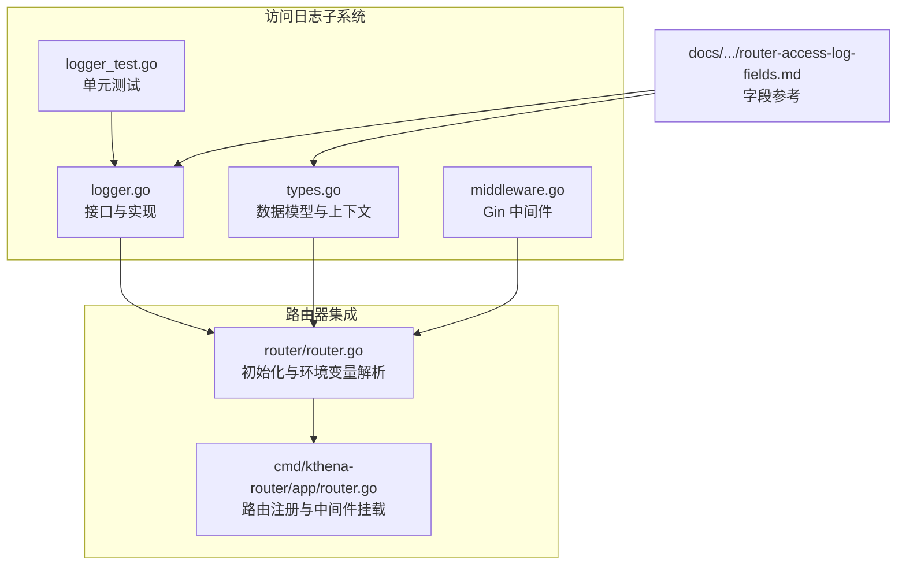
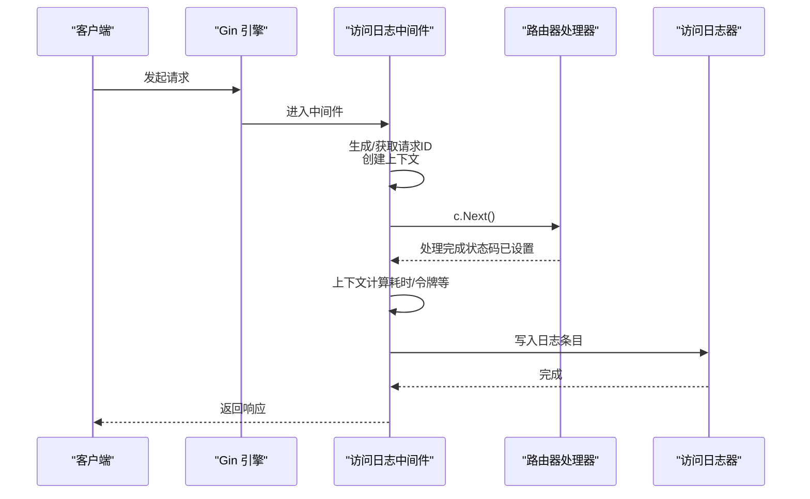
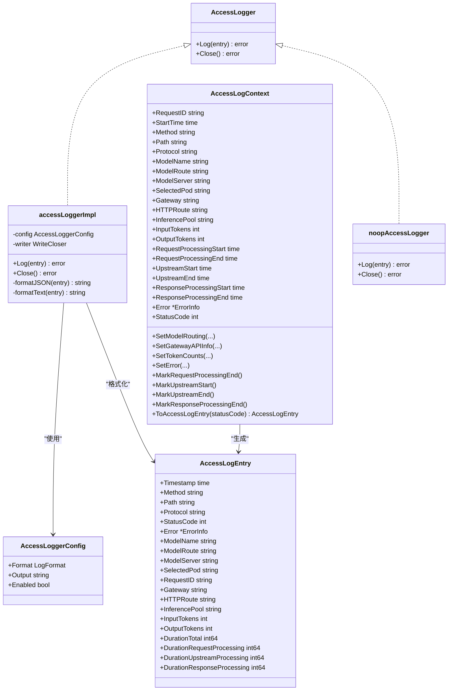

# 访问日志系统

<cite>
**本文引用的文件列表**
- [logger.go](file://pkg/kthena-router/accesslog/logger.go)
- [types.go](file://pkg/kthena-router/accesslog/types.go)
- [middleware.go](file://pkg/kthena-router/accesslog/middleware.go)
- [logger_test.go](file://pkg/kthena-router/accesslog/logger_test.go)
- [router.go](file://pkg/kthena-router/router/router.go)
- [router-access-log-fields.md](file://docs/kthena/docs/reference/router-access-log-fields.md)
- [router.go](file://cmd/kthena-router/app/router.go)
</cite>

## 目录
1. [简介](#简介)
2. [项目结构](#项目结构)
3. [核心组件](#核心组件)
4. [架构总览](#架构总览)
5. [详细组件分析](#详细组件分析)
6. [依赖关系分析](#依赖关系分析)
7. [性能考量](#性能考量)
8. [故障排查指南](#故障排查指南)
9. [结论](#结论)
10. [附录](#附录)

## 简介
本文件面向 Kthena 路由器的访问日志系统，提供从设计到实现的完整技术文档。内容涵盖：
- 日志格式与字段定义（JSON 与文本）
- 中间件拦截与上下文生命周期
- 日志类型（请求、响应、错误）与输出策略
- 性能优化（同步写入、缓冲与文件落盘）
- 配置项与环境变量
- 分析与合规建议（轮转、存储）

## 项目结构
访问日志系统位于 kthena-router 子模块中，核心代码集中在 accesslog 包，并在路由器初始化时加载，通过 Gin 中间件链路贯穿请求生命周期。

图表来源
- [logger.go:1-220](file://pkg/kthena-router/accesslog/logger.go#L1-L220)
- [types.go:1-224](file://pkg/kthena-router/accesslog/types.go#L1-L224)
- [middleware.go:1-138](file://pkg/kthena-router/accesslog/middleware.go#L1-L138)
- [router.go:125-168](file://pkg/kthena-router/router/router.go#L125-L168)
- [router.go:244-260](file://cmd/kthena-router/app/router.go#L244-L260)
- [router-access-log-fields.md:1-175](file://docs/kthena/docs/reference/router-access-log-fields.md#L1-L175)

章节来源
- [logger.go:1-220](file://pkg/kthena-router/accesslog/logger.go#L1-L220)
- [types.go:1-224](file://pkg/kthena-router/accesslog/types.go#L1-L224)
- [middleware.go:1-138](file://pkg/kthena-router/accesslog/middleware.go#L1-L138)
- [router.go:125-168](file://pkg/kthena-router/router/router.go#L125-L168)
- [router.go:244-260](file://cmd/kthena-router/app/router.go#L244-L260)
- [router-access-log-fields.md:1-175](file://docs/kthena/docs/reference/router-access-log-fields.md#L1-L175)

## 核心组件
- 接口与实现：定义统一的日志写入接口，支持 JSON 与文本两种格式；根据配置选择 stdout/stderr 或文件输出；禁用时返回空操作实现。
- 数据模型：标准化访问日志条目，包含标准 HTTP 字段、AI 路由信息、令牌统计、时间分解等；提供上下文对象用于在请求生命周期内累积指标。
- 中间件：Gin 中间件负责生成请求 ID、创建上下文、在请求完成后收集状态并写入日志。
- 集成点：路由器启动时读取环境变量构建日志器，并将中间件挂载到 Gin 引擎上。

章节来源
- [logger.go:28-136](file://pkg/kthena-router/accesslog/logger.go#L28-L136)
- [types.go:23-97](file://pkg/kthena-router/accesslog/types.go#L23-L97)
- [middleware.go:30-63](file://pkg/kthena-router/accesslog/middleware.go#L30-L63)
- [router.go:125-168](file://pkg/kthena-router/router/router.go#L125-L168)

## 架构总览
访问日志在请求生命周期中的关键节点：
- 请求进入：中间件生成请求 ID 并创建上下文
- 处理阶段：各处理器可更新令牌数、设置路由信息、标记阶段起止时间
- 响应阶段：中间件在 c.Next() 返回后，基于上下文生成日志条目并写入

图表来源
- [middleware.go:30-63](file://pkg/kthena-router/accesslog/middleware.go#L30-L63)
- [router.go:204-315](file://pkg/kthena-router/router/router.go#L204-L315)
- [logger.go:100-128](file://pkg/kthena-router/accesslog/logger.go#L100-L128)

## 详细组件分析

### 日志器与配置
- 接口与实现
  - 接口：提供 Log(entry) 和 Close() 方法
  - 实现：根据配置选择输出目标（stdout/stderr/文件），支持 JSON 与文本格式
  - 禁用模式：当 Enabled=false 时返回空操作实现，避免额外开销
- 配置项
  - Format：json 或 text
  - Output：stdout、stderr 或文件路径
  - Enabled：是否启用
- 默认行为：未传入配置时使用默认值（JSON、stdout、启用）

章节来源
- [logger.go:28-136](file://pkg/kthena-router/accesslog/logger.go#L28-L136)
- [logger.go:54-61](file://pkg/kthena-router/accesslog/logger.go#L54-L61)

### 数据模型与上下文
- 日志条目 AccessLogEntry
  - 标准 HTTP 字段：timestamp、method、path、protocol、status_code
  - 错误信息：error.type 与 error.message
  - AI 路由信息：model_name、model_route、model_server、selected_pod、request_id
  - Gateway API 扩展：gateway、http_route、inference_pool
  - 令牌统计：input_tokens、output_tokens
  - 时间分解：duration_total、duration_request_processing、duration_upstream_processing、duration_response_processing
- 上下文 AccessLogContext
  - 负责在请求生命周期内累积元数据与时间戳
  - 提供 SetModelRouting/SetGatewayAPIInfo/SetTokenCounts/SetError 等方法
  - 提供 MarkRequestProcessingEnd/MarkUpstreamStart/MarkUpstreamEnd/MarkResponseProcessingEnd 等阶段标记
  - ToAccessLogEntry 将上下文转换为最终条目并计算各阶段耗时

章节来源
- [types.go:23-97](file://pkg/kthena-router/accesslog/types.go#L23-L97)
- [types.go:99-224](file://pkg/kthena-router/accesslog/types.go#L99-L224)

### 中间件与生命周期
- 中间件职责
  - 生成或注入 x-request-id
  - 创建 AccessLogContext 并存入 gin.Context
  - 在 c.Next() 返回后，读取状态码并生成日志条目
  - 使用 AccessLogger.Log 写入
- 辅助函数
  - GetAccessLogContext 获取上下文
  - SetModelName/SetRequestRouting/SetGatewayAPIInfo/SetTokenCounts/SetError 更新上下文
  - 各阶段标记函数用于上游代理前后的时间统计

章节来源
- [middleware.go:30-138](file://pkg/kthena-router/accesslog/middleware.go#L30-L138)

### 路由器集成与环境变量
- 初始化流程
  - 读取 ACCESS_LOG_ENABLED、ACCESS_LOG_FORMAT、ACCESS_LOG_OUTPUT 环境变量
  - 构造 AccessLoggerConfig 并创建访问日志器
  - 将中间件挂载到路由器实例
- 路由器中间件桥接
  - 提供 AccessLogMiddleware(r.accessLogger) 作为 Gin 中间件
  - 在 cmd 层将该中间件挂载到引擎或 v1 组

章节来源
- [router.go:125-168](file://pkg/kthena-router/router/router.go#L125-L168)
- [router.go:802-802](file://pkg/kthena-router/router/router.go#L802-L802)
- [router.go:244-260](file://cmd/kthena-router/app/router.go#L244-L260)

### 日志格式与字段规范
- 文本格式结构
  - 时间戳 + "方法 路径 协议" + 状态码 + [错误信息] + AI 路由字段 + 令牌统计 + 总耗时与分解
- JSON 格式
  - 结构化字段与文本格式一致，便于日志聚合与分析
- 字段参考
  - 标准 HTTP 字段、错误信息、AI 路由信息、令牌统计、时间分解、常见错误类型与示例

章节来源
- [router-access-log-fields.md:15-175](file://docs/kthena/docs/reference/router-access-log-fields.md#L15-L175)

### 测试覆盖
- JSON/文本格式输出校验
- 错误信息字段存在性与内容
- 上下文生命周期与时间计算
- 禁用模式下的空操作行为
- 环境变量配置解析与文件输出

章节来源
- [logger_test.go:28-269](file://pkg/kthena-router/accesslog/logger_test.go#L28-L269)

## 依赖关系分析

图表来源
- [logger.go:28-136](file://pkg/kthena-router/accesslog/logger.go#L28-L136)
- [types.go:23-97](file://pkg/kthena-router/accesslog/types.go#L23-L97)
- [types.go:99-224](file://pkg/kthena-router/accesslog/types.go#L99-L224)

## 性能考量
- 当前实现为同步写入
  - Log(entry) 直接进行格式化与写入，不引入额外线程或队列
  - 优点：实现简单、顺序一致
  - 潜在风险：高并发场景下可能成为瓶颈
- 可选优化方向（建议）
  - 异步写入：引入通道与后台写入协程，前端仅投递日志条目
  - 批量写入：按固定间隔或大小合并写入，减少系统调用次数
  - 缓冲区：使用带缓冲的 writer（如 bufio）提升写入效率
  - 文件轮转：结合外部工具（如 logrotate）实现按大小/时间轮转
- 当前实现优势
  - 禁用模式下返回空操作实现，零开销
  - 文本格式紧凑，便于快速解析与传输

[本节为通用性能讨论，不直接分析具体文件，故无“章节来源”]

## 故障排查指南
- 日志未输出
  - 检查 ACCESS_LOG_ENABLED 是否为 true
  - 确认 Output 设置为 stdout/stderr 或有效文件路径
- 格式异常
  - 确认 ACCESS_LOG_FORMAT 为 json 或 text
  - 若为文件输出，检查权限与磁盘空间
- 字段缺失
  - 确保在处理器中正确调用 SetModelName/SetRequestRouting/SetTokenCounts/SetError 等函数
  - 确认在上游阶段调用 MarkUpstreamStart/MarkUpstreamEnd 等标记
- 错误信息未显示
  - 确认在出错时调用 SetError 并在后续 c.Next() 返回后中间件会写入

章节来源
- [logger.go:70-98](file://pkg/kthena-router/accesslog/logger.go#L70-L98)
- [middleware.go:30-63](file://pkg/kthena-router/accesslog/middleware.go#L30-L63)
- [types.go:113-167](file://pkg/kthena-router/accesslog/types.go#L113-L167)

## 结论
Kthena 访问日志系统以简洁的接口与清晰的数据模型为核心，通过 Gin 中间件在请求生命周期的关键节点采集并输出日志。当前实现强调易用与可观测性，适合生产环境的快速落地；若需进一步提升吞吐，可在保持兼容的前提下引入异步写入与批量策略。

[本节为总结性内容，不直接分析具体文件，故无“章节来源”]

## 附录

### 配置与环境变量
- ACCESS_LOG_ENABLED：启用/禁用访问日志（默认 true）
- ACCESS_LOG_FORMAT：输出格式（json 或 text，默认 text）
- ACCESS_LOG_OUTPUT：输出目标（stdout、stderr 或文件路径，默认 stdout）

章节来源
- [router.go:132-149](file://pkg/kthena-router/router/router.go#L132-L149)
- [router-access-log-fields.md:168-175](file://docs/kthena/docs/reference/router-access-log-fields.md#L168-L175)

### 字段说明与示例
- 标准 HTTP 字段：timestamp、method、path、protocol、status_code
- 错误信息：error.type、error.message
- AI 路由信息：model_name、model_route、model_server、selected_pod、request_id
- Gateway API：gateway、http_route、inference_pool
- 令牌统计：input_tokens、output_tokens
- 时间分解：duration_total、duration_request_processing、duration_upstream_processing、duration_response_processing

章节来源
- [router-access-log-fields.md:27-175](file://docs/kthena/docs/reference/router-access-log-fields.md#L27-L175)

### 分析与合规建议
- 分析维度
  - 时延分布：duration_total 与三段耗时拆解
  - 路由命中：model_route/model_server/selected_pod
  - 令牌消耗：input_tokens/output_tokens
  - 错误分类：按 error.type 统计失败原因
- 合规与安全
  - 避免在日志中泄露敏感信息（如用户凭据）
  - 对于 JSON 输出，建议配合日志采集端进行脱敏
- 存储与轮转
  - 建议将输出重定向至容器标准输出，交由日志平台统一采集
  - 如需文件输出，结合外部轮转工具按大小/时间切分并保留历史周期

[本节为通用实践建议，不直接分析具体文件，故无“章节来源”]