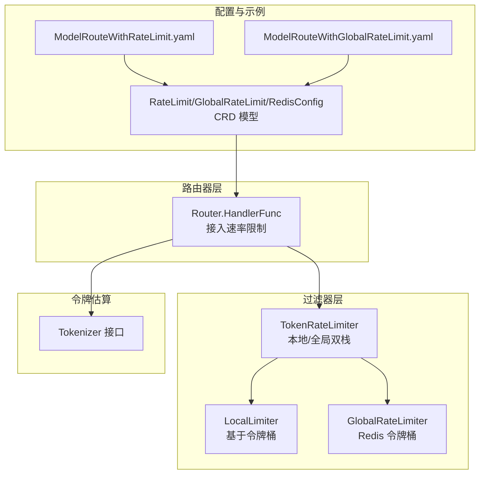
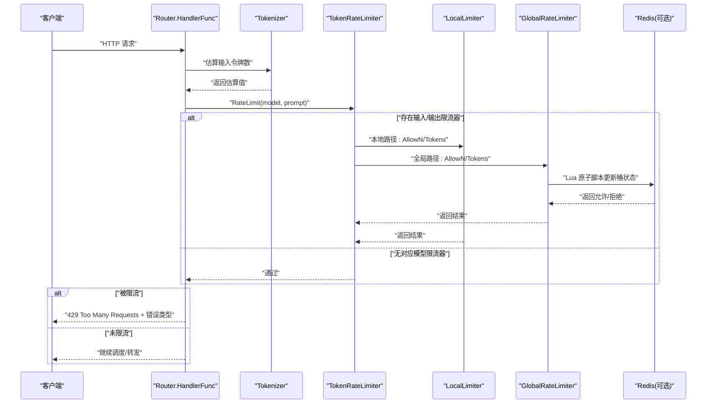
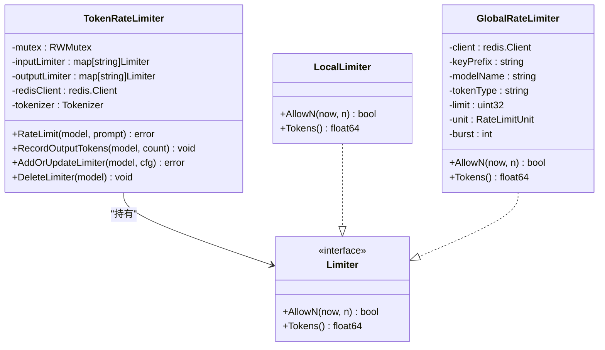
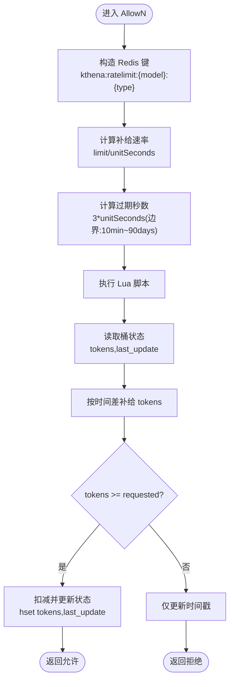
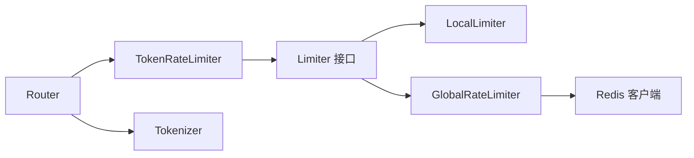

# 速率限制系统

<cite>
**本文引用的文件**
- [ratelimit.go](file://pkg/kthena-router/filters/ratelimit/ratelimit.go)
- [global.go](file://pkg/kthena-router/filters/ratelimit/global.go)
- [ratelimit_test.go](file://pkg/kthena-router/filters/ratelimit/ratelimit_test.go)
- [global_test.go](file://pkg/kthena-router/filters/ratelimit/global_test.go)
- [router.go](file://pkg/kthena-router/router/router.go)
- [modelroute_types.go](file://pkg/apis/networking/v1alpha1/modelroute_types.go)
- [ModelRouteWithRateLimit.yaml](file://examples/kthena-router/ModelRouteWithRateLimit.yaml)
- [ModelRouteWithGlobalRateLimit.yaml](file://examples/kthena-router/ModelRouteWithGlobalRateLimit.yaml)
- [tokenizer.go](file://pkg/kthena-router/filters/tokenizer/tokenizer.go)
</cite>

## 目录
1. [简介](#简介)
2. [项目结构](#项目结构)
3. [核心组件](#核心组件)
4. [架构总览](#架构总览)
5. [详细组件分析](#详细组件分析)
6. [依赖关系分析](#依赖关系分析)
7. [性能考量](#性能考量)
8. [故障排查指南](#故障排查指南)
9. [结论](#结论)
10. [附录](#附录)

## 简介
本文件面向 Kthena 速率限制系统，聚焦于 TokenRateLimiter 的设计与实现，覆盖本地速率限制与全局（分布式）速率限制两大模式，解释速率限制器接口的统一抽象、输入/输出令牌的双重限制机制、令牌估算与消耗策略、并发控制、Redis 分布式一致性与性能优化，并提供配置示例、错误处理与监控指标、性能调优建议、故障排查与最佳实践。

## 项目结构
与速率限制直接相关的代码主要位于以下模块：
- 过滤器层：TokenRateLimiter、LocalLimiter、GlobalRateLimiter 实现
- 路由器层：在请求处理流程中调用速率限制器并进行错误处理
- CRD 定义：RateLimit、GlobalRateLimit、RedisConfig 等模型
- 示例：ModelRoute 中的速率限制配置样例
- 令牌估算：Tokenizer 接口及简单估算实现

**图表来源**
- [ratelimit.go:60-98](file://pkg/kthena-router/filters/ratelimit/ratelimit.go#L60-L98)
- [global.go:74-96](file://pkg/kthena-router/filters/ratelimit/global.go#L74-L96)
- [router.go:204-314](file://pkg/kthena-router/router/router.go#L204-L314)
- [modelroute_types.go:122-155](file://pkg/apis/networking/v1alpha1/modelroute_types.go#L122-L155)
- [ModelRouteWithRateLimit.yaml:1-18](file://examples/kthena-router/ModelRouteWithRateLimit.yaml#L1-L18)
- [ModelRouteWithGlobalRateLimit.yaml:1-22](file://examples/kthena-router/ModelRouteWithGlobalRateLimit.yaml#L1-L22)

**章节来源**
- [ratelimit.go:60-98](file://pkg/kthena-router/filters/ratelimit/ratelimit.go#L60-L98)
- [router.go:204-314](file://pkg/kthena-router/router/router.go#L204-L314)
- [modelroute_types.go:122-155](file://pkg/apis/networking/v1alpha1/modelroute_types.go#L122-L155)

## 核心组件
- 统一速率限制器 TokenRateLimiter
  - 支持按模型维度维护独立的输入/输出限流器映射
  - 可选择本地或全局两种实现路径
  - 提供 RateLimit 与 RecordOutputTokens 两个关键方法
- 本地限流器 LocalLimiter
  - 基于 golang.org/x/time/rate.Limiter 的令牌桶实现
  - 实现 Limiter 接口，提供 AllowN 与 Tokens 查询能力
- 全局限流器 GlobalRateLimiter
  - 基于 Redis 的分布式令牌桶，Lua 原子脚本保障一致性
  - 使用哈希键存储桶状态，支持过期回收与时间同步
- 路由器集成
  - 在请求入口调用 TokenRateLimiter.RateLimit
  - 根据错误类型返回不同限流原因与状态码
- 配置模型
  - RateLimit 支持输入/输出令牌配额与单位
  - GlobalRateLimit 可选 Redis 配置，启用全局限流

**章节来源**
- [ratelimit.go:51-98](file://pkg/kthena-router/filters/ratelimit/ratelimit.go#L51-L98)
- [global.go:74-96](file://pkg/kthena-router/filters/ratelimit/global.go#L74-L96)
- [router.go:266-292](file://pkg/kthena-router/router/router.go#L266-L292)
- [modelroute_types.go:122-155](file://pkg/apis/networking/v1alpha1/modelroute_types.go#L122-L155)

## 架构总览
下图展示从请求进入路由器到执行速率限制的整体流程，以及本地与全局两种限流路径的差异。

**图表来源**
- [router.go:204-314](file://pkg/kthena-router/router/router.go#L204-L314)
- [ratelimit.go:100-126](file://pkg/kthena-router/filters/ratelimit/ratelimit.go#L100-L126)
- [global.go:98-177](file://pkg/kthena-router/filters/ratelimit/global.go#L98-L177)

## 详细组件分析

### TokenRateLimiter 设计与实现
- 结构与职责
  - 维护输入/输出两套 Limiter 映射，键为模型名
  - 内置互斥锁保护并发安全
  - 内嵌 Tokenizer 用于估算输入令牌
- 关键方法
  - RateLimit(model, prompt): 估算输入令牌，检查输入/输出限流，返回错误或通过
  - RecordOutputTokens(model, tokenCount): 异步记录输出令牌消耗
  - AddOrUpdateLimiter(model, rateLimit): 根据配置创建本地或全局限流器
  - DeleteLimiter(model): 删除指定模型的限流器
- 并发与一致性
  - 读写分离：查询阶段使用读锁；新增/删除时使用写锁
  - 输出令牌记录采用异步消费，避免阻塞请求路径

**图表来源**
- [ratelimit.go:51-98](file://pkg/kthena-router/filters/ratelimit/ratelimit.go#L51-L98)
- [global.go:74-96](file://pkg/kthena-router/filters/ratelimit/global.go#L74-L96)

**章节来源**
- [ratelimit.go:60-213](file://pkg/kthena-router/filters/ratelimit/ratelimit.go#L60-L213)

### 本地速率限制（LocalLimiter）
- 实现要点
  - 基于令牌桶算法，限制与突发容量一致
  - 单机内存态，无跨实例共享
  - Tokens() 返回当前可用令牌，用于保守性检查
- 适用场景
  - 单实例部署或对一致性要求不高的场景
  - 低延迟、高吞吐的本地限流

**章节来源**
- [ratelimit.go:74-89](file://pkg/kthena-router/filters/ratelimit/ratelimit.go#L74-L89)

### 全局速率限制（GlobalRateLimiter）
- 分布式一致性
  - 使用 Redis 哈希键存储桶状态（tokens、last_update）
  - Lua 原子脚本执行“计算补给 -> 判断 -> 扣减 -> 更新”的完整流程
  - 通过过期策略自动清理闲置键，平衡内存占用与正确性
- 算法细节
  - 补给速率：limit / 单位秒数
  - 过期时间：单位时间的 3 倍，最小 10 分钟、最大 90 天
  - Tokens 查询同样原子执行，确保读操作不影响状态一致性
- 并发与性能
  - 单键原子 Lua，避免竞争条件
  - 合理的过期时间减少热点键争用

**图表来源**
- [global.go:98-177](file://pkg/kthena-router/filters/ratelimit/global.go#L98-L177)

**章节来源**
- [global.go:74-291](file://pkg/kthena-router/filters/ratelimit/global.go#L74-L291)

### 令牌估算与消耗策略
- 令牌估算
  - 输入令牌：在路由层解析 prompt 后，使用 Tokenizer 计算估算值
  - 回退策略：估算失败时以字符长度粗略估算
- 消耗策略
  - RateLimit：先检查输入令牌，再保守检查输出可用令牌（至少 1）
  - RecordOutputTokens：在响应生成后异步记录实际输出令牌，避免阻塞请求路径
- 并发控制
  - 读多写少的场景下，读锁提升并发；写入限流器映射使用写锁

**章节来源**
- [router.go:241-265](file://pkg/kthena-router/router/router.go#L241-L265)
- [ratelimit.go:100-137](file://pkg/kthena-router/filters/ratelimit/ratelimit.go#L100-L137)
- [tokenizer.go:19-21](file://pkg/kthena-router/filters/tokenizer/tokenizer.go#L19-L21)

### 路由器中的集成与错误处理
- 集成点
  - 在请求处理早期调用 TokenRateLimiter.RateLimit
  - 根据错误类型设置访问日志与指标
- 错误分类
  - 输入令牌超限：返回输入限流错误
  - 输出令牌超限：返回输出限流错误
  - 其他：通用限流错误
- 响应
  - 统一返回 429 状态码与错误信息
  - 设置 finishReason 便于下游统计

**章节来源**
- [router.go:266-292](file://pkg/kthena-router/router/router.go#L266-L292)

### 配置模型与示例
- CRD 字段
  - RateLimit：输入/输出令牌配额、时间单位、是否启用全局
  - GlobalRateLimit：Redis 配置（地址）
- 示例
  - 本地速率限制：每分钟输入 30、输出 100
  - 全局速率限制：每分钟输入 10、输出 5000，使用 Redis 地址

**章节来源**
- [modelroute_types.go:122-155](file://pkg/apis/networking/v1alpha1/modelroute_types.go#L122-L155)
- [ModelRouteWithRateLimit.yaml:14-17](file://examples/kthena-router/ModelRouteWithRateLimit.yaml#L14-L17)
- [ModelRouteWithGlobalRateLimit.yaml:14-21](file://examples/kthena-router/ModelRouteWithGlobalRateLimit.yaml#L14-L21)

## 依赖关系分析
- 组件耦合
  - Router 依赖 TokenRateLimiter；TokenRateLimiter 依赖 Limiter 抽象
  - GlobalRateLimiter 依赖 Redis 客户端，具备外部依赖风险
- 外部依赖
  - Redis：全局限流的唯一外部状态存储
  - Tokenizer：输入令牌估算
- 循环依赖
  - 未发现循环依赖，模块边界清晰

**图表来源**
- [router.go:204-314](file://pkg/kthena-router/router/router.go#L204-L314)
- [ratelimit.go:51-98](file://pkg/kthena-router/filters/ratelimit/ratelimit.go#L51-L98)
- [global.go:74-96](file://pkg/kthena-router/filters/ratelimit/global.go#L74-L96)

**章节来源**
- [ratelimit.go:51-98](file://pkg/kthena-router/filters/ratelimit/ratelimit.go#L51-L98)
- [global.go:74-96](file://pkg/kthena-router/filters/ratelimit/global.go#L74-L96)
- [router.go:204-314](file://pkg/kthena-router/router/router.go#L204-L314)

## 性能考量
- 本地限流
  - 低延迟、高吞吐，适合单实例或对一致性要求不敏感场景
  - burst 与 limit 一致，瞬时突发能力强
- 全局限流
  - Redis 延迟与网络抖动为主要瓶颈
  - Lua 原子脚本减少往返次数，但每次请求仍需一次远程调用
- 估算与记录
  - 输入令牌估算失败时的回退策略影响准确性
  - 输出令牌记录为异步，避免阻塞主路径
- 过期策略
  - 3x 单位时间的过期策略在内存与正确性之间取得平衡
  - 对短周期单位（秒/分）设置最小过期时间，避免频繁重建

**章节来源**
- [global.go:185-221](file://pkg/kthena-router/filters/ratelimit/global.go#L185-L221)
- [ratelimit.go:100-137](file://pkg/kthena-router/filters/ratelimit/ratelimit.go#L100-L137)

## 故障排查指南
- 常见问题与定位
  - Redis 连接失败：AddOrUpdateLimiter 会校验连接；若失败返回错误
  - 限流误判：确认 RateLimit 配置单位与期望一致；检查输入令牌估算是否合理
  - 输出限流提前触发：保守性检查要求输出桶至少有 1 个可用令牌
- 测试覆盖
  - 本地/全局限流基本行为、删除限流器、Redis 连接失败、过期时间边界等均有单元测试覆盖
- 建议排查步骤
  - 确认 ModelRoute 中 RateLimit 配置是否生效
  - 观察 Router 日志中的限流错误类型
  - 若使用全局限流，验证 Redis 地址可达且键格式正确

**章节来源**
- [global_test.go:195-215](file://pkg/kthena-router/filters/ratelimit/global_test.go#L195-L215)
- [ratelimit_test.go:199-228](file://pkg/kthena-router/filters/ratelimit/ratelimit_test.go#L199-L228)

## 结论
Kthena 的速率限制系统通过统一的 Limiter 接口抽象，实现了本地与全局两种模式的灵活切换。TokenRateLimiter 将输入/输出令牌的估算与消耗策略解耦，配合路由器的早拦截与错误分类，提供了清晰、可控的限流体验。全局模式基于 Redis 的原子 Lua 脚本实现强一致的分布式令牌桶，结合合理的过期策略，在一致性与性能间取得平衡。建议在多实例部署场景优先考虑全局限流，并根据业务峰值合理设置单位与配额。

## 附录

### 配置示例
- 本地速率限制（每分钟）
  - 输入令牌：30
  - 输出令牌：100
  - 单位：minute
- 全局速率限制（每分钟）
  - 输入令牌：10
  - 输出令牌：5000
  - 单位：minute
  - Redis 地址：cluster.local svc

**章节来源**
- [ModelRouteWithRateLimit.yaml:14-17](file://examples/kthena-router/ModelRouteWithRateLimit.yaml#L14-L17)
- [ModelRouteWithGlobalRateLimit.yaml:14-21](file://examples/kthena-router/ModelRouteWithGlobalRateLimit.yaml#L14-L21)

### 错误处理与监控指标
- 错误类型
  - 输入令牌超限：返回输入限流错误
  - 输出令牌超限：返回输出限流错误
  - 其他：通用限流错误
- 监控
  - 访问日志：记录限流原因与状态码
  - 指标：区分输入/输出/请求级限流事件，便于告警与趋势分析

**章节来源**
- [router.go:266-292](file://pkg/kthena-router/router/router.go#L266-L292)

### 性能调优建议
- 本地限流
  - 将 burst 与 limit 设置为相同，最大化瞬时突发能力
  - 避免过小的单位导致频繁重置
- 全局限流
  - 评估 Redis 集群性能与网络延迟，必要时增加副本或就近部署
  - 合理设置单位与配额，避免过短单位造成频繁重建键
  - 使用异步输出令牌记录，降低对请求路径的影响

**章节来源**
- [global.go:185-221](file://pkg/kthena-router/filters/ratelimit/global.go#L185-L221)
- [ratelimit.go:128-137](file://pkg/kthena-router/filters/ratelimit/ratelimit.go#L128-L137)

### 最佳实践
- 模型隔离
  - 不同模型分别配置独立限流器，避免相互干扰
- 估算精度
  - 优先使用精确 Tokenizer；在估算失败时采用稳健回退策略
- 全局一致性
  - 多实例部署必须启用全局限流，确保跨实例一致
- 过期与资源管理
  - 关注 Redis 内存占用，利用过期策略自动回收
- 可观测性
  - 记录限流事件类型与原因，建立告警阈值与趋势分析

**章节来源**
- [global.go:185-221](file://pkg/kthena-router/filters/ratelimit/global.go#L185-L221)
- [router.go:266-292](file://pkg/kthena-router/router/router.go#L266-L292)