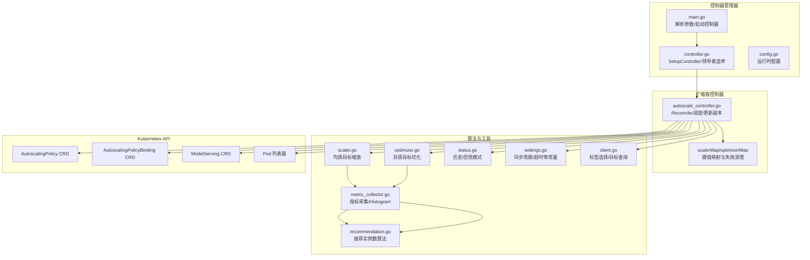
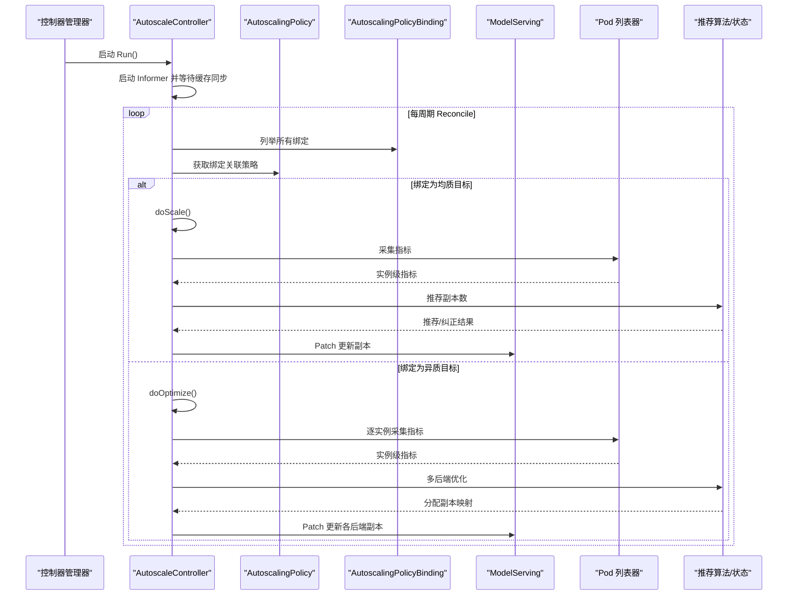
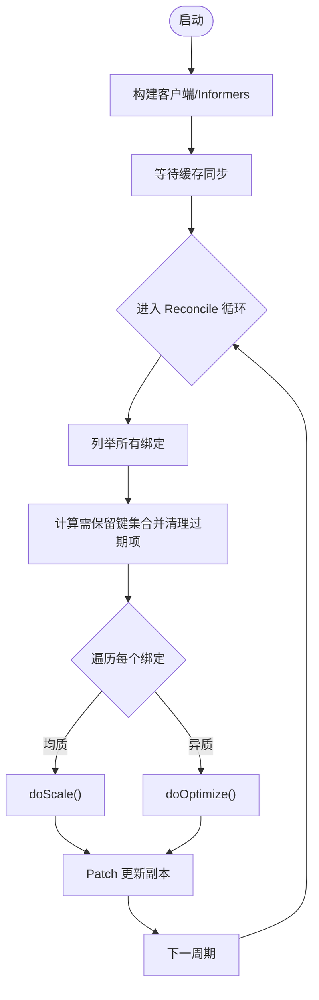
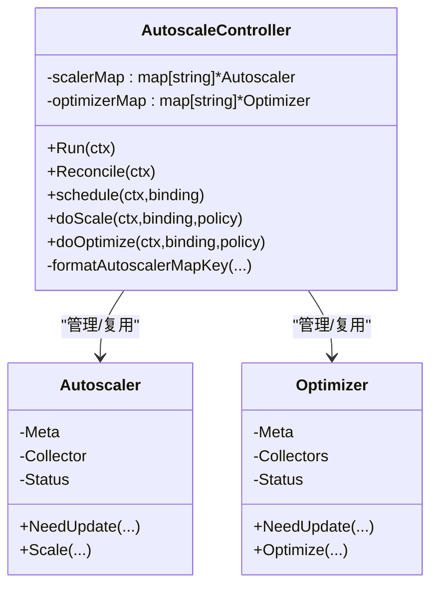
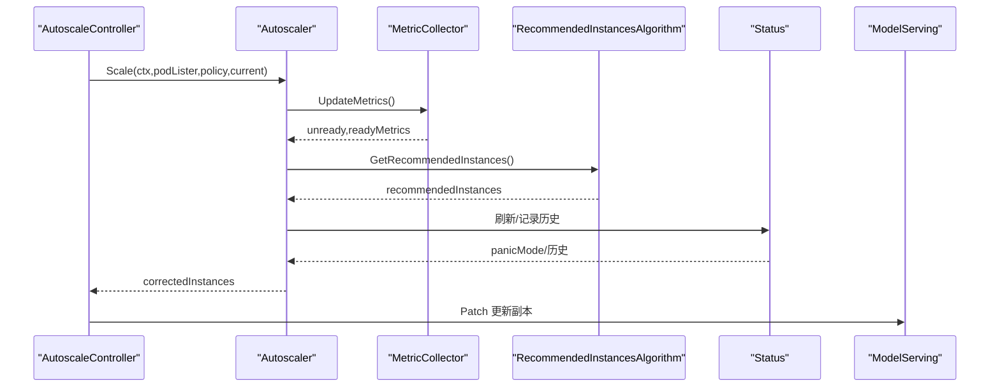
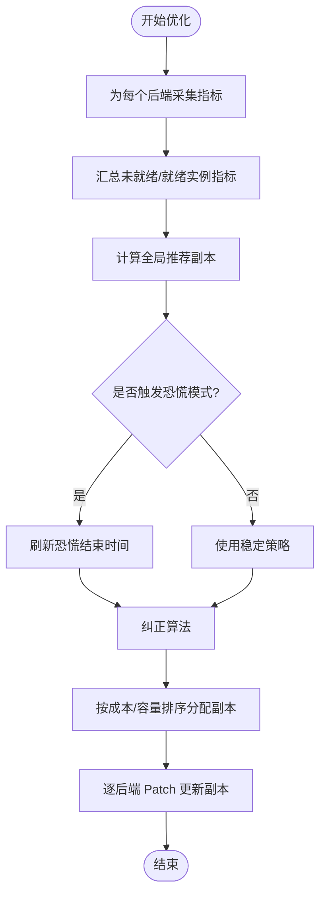
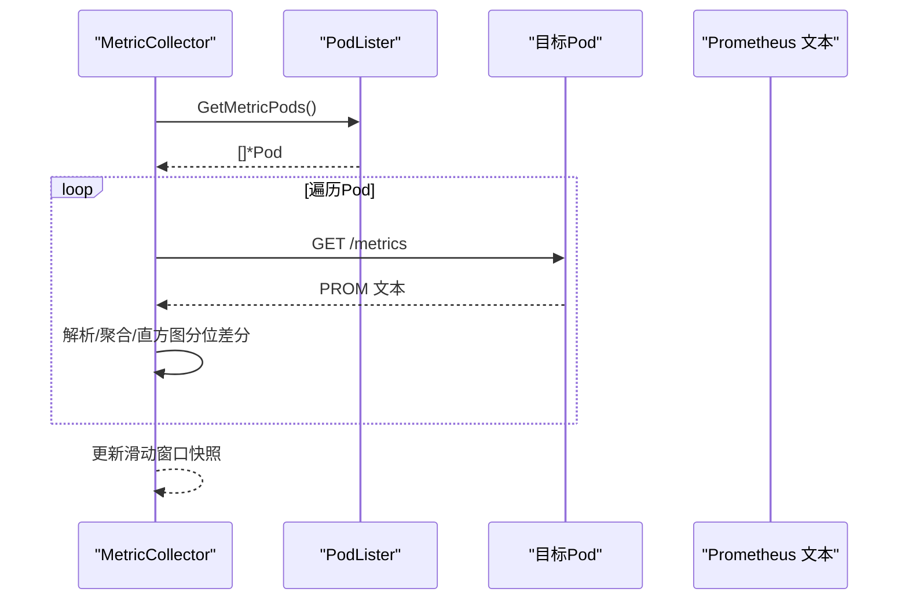
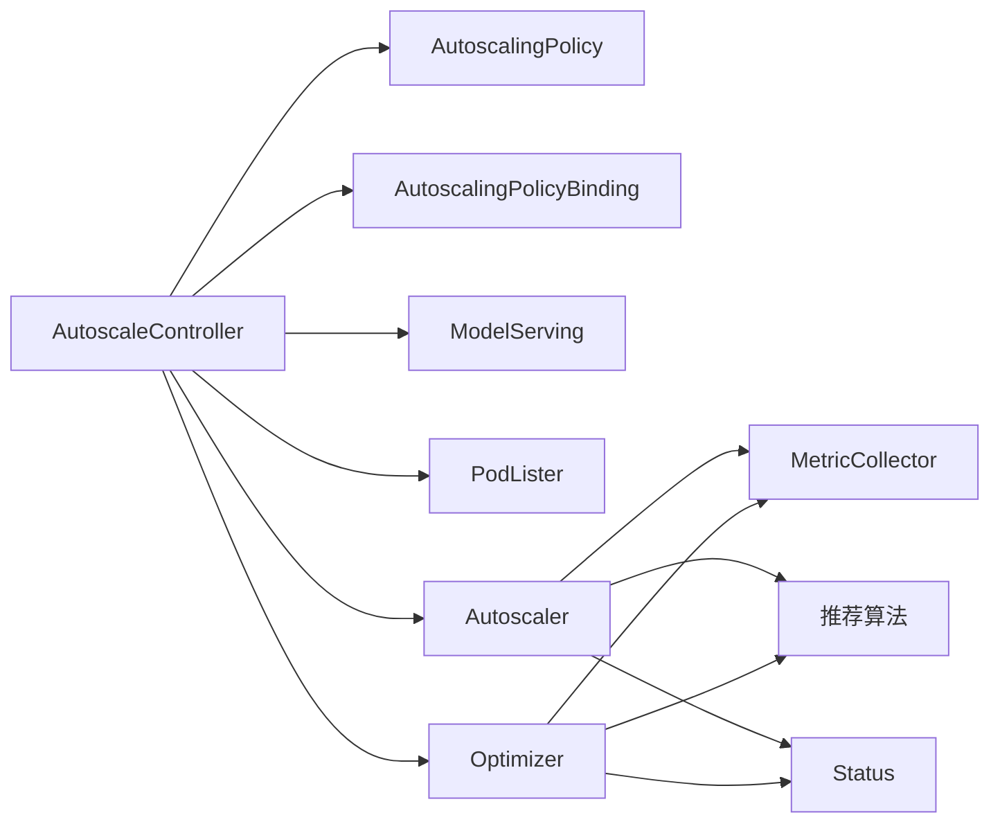

# 扩缩容控制器

<cite>
**本文引用的文件**   
- [cmd/kthena-controller-manager/main.go](file://cmd/kthena-controller-manager/main.go)
- [pkg/controller/controller.go](file://pkg/controller/controller.go)
- [pkg/controller/config.go](file://pkg/controller/config.go)
- [pkg/autoscaler/controller/autoscale_controller.go](file://pkg/autoscaler/controller/autoscale_controller.go)
- [pkg/autoscaler/autoscaler/scaler.go](file://pkg/autoscaler/autoscaler/scaler.go)
- [pkg/autoscaler/autoscaler/optimizer.go](file://pkg/autoscaler/autoscaler/optimizer.go)
- [pkg/autoscaler/autoscaler/metric_collector.go](file://pkg/autoscaler/autoscaler/metric_collector.go)
- [pkg/autoscaler/autoscaler/status.go](file://pkg/autoscaler/autoscaler/status.go)
- [pkg/autoscaler/algorithm/recommendation.go](file://pkg/autoscaler/algorithm/recommendation.go)
- [pkg/autoscaler/util/settings.go](file://pkg/autoscaler/util/settings.go)
- [pkg/autoscaler/util/client.go](file://pkg/autoscaler/util/client.go)
- [pkg/apis/workload/v1alpha1/autoscalingpolicy_types.go](file://pkg/apis/workload/v1alpha1/autoscalingpolicy_types.go)
- [pkg/apis/workload/v1alpha1/autoscalingpolicybinding_types.go](file://pkg/apis/workload/v1alpha1/autoscalingpolicybinding_types.go)
- [pkg/autoscaler/controller/autoscale_controller_test.go](file://pkg/autoscaler/controller/autoscale_controller_test.go)
</cite>

## 目录
1. [简介](#简介)
2. [项目结构](#项目结构)
3. [核心组件](#核心组件)
4. [架构总览](#架构总览)
5. [详细组件分析](#详细组件分析)
6. [依赖关系分析](#依赖关系分析)
7. [性能考量](#性能考量)
8. [故障排查指南](#故障排查指南)
9. [结论](#结论)
10. [附录](#附录)

## 简介
本文件面向 Kthena 扩缩容控制器（Autoscaler Controller），系统性阐述其整体架构、工作机制与实现细节。重点覆盖以下方面：
- Informer 注册、事件监听与 reconciler 循环
- scalerMap 与 optimizerMap 的生命周期管理与动态更新
- 与 Kubernetes API 的交互：CRD 对象监听、状态更新与 Patch 行为
- 启动流程、停止机制与错误处理策略
- 配置参数、性能调优与监控指标
- 与其他组件的集成方式与扩展点

## 项目结构
扩缩容控制器位于 Kthena 控制器管理器中，作为可选控制器之一运行。其核心入口与控制流如下：
- 控制器管理器入口负责解析命令行参数、构建客户端、初始化各控制器并按需启用领导者选举
- 扩缩容控制器通过 SharedInformerFactory 监听自定义资源与核心资源，周期性触发 reconciler
- 扩缩容算法由独立的 autoscaler 包提供，包含指标采集、推荐计算与状态维护

图表来源
- [cmd/kthena-controller-manager/main.go:54-111](file://cmd/kthena-controller-manager/main.go#L54-L111)
- [pkg/controller/controller.go:52-141](file://pkg/controller/controller.go#L52-L141)
- [pkg/autoscaler/controller/autoscale_controller.go:98-120](file://pkg/autoscaler/controller/autoscale_controller.go#L98-L120)
- [pkg/autoscaler/autoscaler/scaler.go:40-58](file://pkg/autoscaler/autoscaler/scaler.go#L40-L58)
- [pkg/autoscaler/autoscaler/optimizer.go:126-144](file://pkg/autoscaler/autoscaler/optimizer.go#L126-L144)
- [pkg/autoscaler/autoscaler/metric_collector.go:51-62](file://pkg/autoscaler/autoscaler/metric_collector.go#L51-L62)
- [pkg/autoscaler/algorithm/recommendation.go:38-75](file://pkg/autoscaler/algorithm/recommendation.go#L38-L75)
- [pkg/autoscaler/autoscaler/status.go:32-64](file://pkg/autoscaler/autoscaler/status.go#L32-L64)
- [pkg/autoscaler/util/settings.go:19-25](file://pkg/autoscaler/util/settings.go#L19-L25)
- [pkg/autoscaler/util/client.go:49-59](file://pkg/autoscaler/util/client.go#L49-L59)

章节来源
- [cmd/kthena-controller-manager/main.go:54-111](file://cmd/kthena-controller-manager/main.go#L54-L111)
- [pkg/controller/controller.go:52-141](file://pkg/controller/controller.go#L52-L141)

## 核心组件
- 扩缩容控制器（AutoscaleController）
  - 负责注册与启动 Informer，周期性执行 Reconcile
  - 维护 scalerMap 与 optimizerMap，并在绑定或策略变更时重建
  - 依据绑定类型分别调用 doScale 或 doOptimize
- 均质缩放器（Autoscaler）
  - 封装状态、度量采集器与元数据
  - 基于策略行为与容忍度计算推荐副本数
- 异质优化器（Optimizer）
  - 针对多后端场景，按成本与容量排序分配副本
  - 支持恐慌模式与稳定窗口的历史记录
- 指标采集器（MetricCollector）
  - 从 Pod 暴露的 /metrics 接口抓取 Prometheus 指标
  - 维护直方图快照以计算分位差分
- 状态管理（Status）
  - 记录推荐与纠正后的副本序列，支持稳定/恐慌窗口
- 算法（RecommendedInstancesAlgorithm）
  - 综合外部指标与实例级指标，结合容忍度与方向判断得出推荐副本
- 工具与常量
  - settings.go 提供同步周期、上下文超时等常量
  - client.go 提供标签选择与目标查询工具

章节来源
- [pkg/autoscaler/controller/autoscale_controller.go:47-96](file://pkg/autoscaler/controller/autoscale_controller.go#L47-L96)
- [pkg/autoscaler/autoscaler/scaler.go:28-58](file://pkg/autoscaler/autoscaler/scaler.go#L28-L58)
- [pkg/autoscaler/autoscaler/optimizer.go:29-144](file://pkg/autoscaler/autoscaler/optimizer.go#L29-L144)
- [pkg/autoscaler/autoscaler/metric_collector.go:43-129](file://pkg/autoscaler/autoscaler/metric_collector.go#L43-L129)
- [pkg/autoscaler/autoscaler/status.go:26-88](file://pkg/autoscaler/autoscaler/status.go#L26-L88)
- [pkg/autoscaler/algorithm/recommendation.go:25-171](file://pkg/autoscaler/algorithm/recommendation.go#L25-L171)
- [pkg/autoscaler/util/settings.go:19-25](file://pkg/autoscaler/util/settings.go#L19-L25)
- [pkg/autoscaler/util/client.go:35-121](file://pkg/autoscaler/util/client.go#L35-L121)

## 架构总览
扩缩容控制器采用“控制器 + 算法库”的分层设计：
- 控制器层：负责对象监听、缓存同步、Reconcile 循环与状态写回
- 算法层：封装推荐与纠正逻辑，屏蔽指标采集与历史窗口细节
- 工具层：提供标签选择、目标解析与常量配置

图表来源
- [pkg/autoscaler/controller/autoscale_controller.go:98-171](file://pkg/autoscaler/controller/autoscale_controller.go#L98-L171)
- [pkg/autoscaler/autoscaler/scaler.go:67-107](file://pkg/autoscaler/autoscaler/scaler.go#L67-L107)
- [pkg/autoscaler/autoscaler/optimizer.go:151-208](file://pkg/autoscaler/autoscaler/optimizer.go#L151-L208)
- [pkg/autoscaler/autoscaler/metric_collector.go:98-129](file://pkg/autoscaler/autoscaler/metric_collector.go#L98-L129)
- [pkg/autoscaler/algorithm/recommendation.go:38-75](file://pkg/autoscaler/algorithm/recommendation.go#L38-L75)

## 详细组件分析

### 控制器生命周期与 Informer 注册
- 启动阶段
  - 构建 kubeconfig 与客户端
  - 初始化 SharedInformerFactory，注册 Workload 与 Core V1 Pods Informer
  - 等待缓存同步后进入 Reconcile 循环
- 周期性 Reconcile
  - 每周期读取所有绑定，计算需要保留的 scaler/optimizer 键集合
  - 清理不再存在的键，确保内存不累积
  - 逐个绑定调度：均质目标走 doScale，异质目标走 doOptimize

图表来源
- [pkg/autoscaler/controller/autoscale_controller.go:98-171](file://pkg/autoscaler/controller/autoscale_controller.go#L98-L171)

章节来源
- [pkg/autoscaler/controller/autoscale_controller.go:98-120](file://pkg/autoscaler/controller/autoscale_controller.go#L98-L120)
- [pkg/autoscaler/util/settings.go:20](file://pkg/autoscaler/util/settings.go#L20)

### scalerMap 与 optimizerMap 的管理与失效
- 键生成规则
  - 均质目标：包含绑定命名空间/名称 + 目标命名空间/种类/名称
  - 异质目标：仅包含绑定命名空间/名称（无具体目标）
- 失效判定
  - 当策略 Generation 或绑定 Generation 发生变化时重建
- 生命周期
  - Reconcile 开始前先做差集清理，避免内存泄漏
  - 每次调度根据 NeedUpdate 决定是否复用或新建

图表来源
- [pkg/autoscaler/controller/autoscale_controller.go:47-96](file://pkg/autoscaler/controller/autoscale_controller.go#L47-L96)
- [pkg/autoscaler/autoscaler/scaler.go:55-58](file://pkg/autoscaler/autoscaler/scaler.go#L55-L58)
- [pkg/autoscaler/autoscaler/optimizer.go:146-149](file://pkg/autoscaler/autoscaler/optimizer.go#L146-L149)
- [pkg/autoscaler/controller/autoscale_controller.go:359-373](file://pkg/autoscaler/controller/autoscale_controller.go#L359-L373)

章节来源
- [pkg/autoscaler/controller/autoscale_controller.go:134-170](file://pkg/autoscaler/controller/autoscale_controller.go#L134-L170)
- [pkg/autoscaler/controller/autoscale_controller.go:359-373](file://pkg/autoscaler/controller/autoscale_controller.go#L359-L373)

### 均质目标缩放（doScale）流程
- 获取策略与当前副本
- 采集指标（含就绪/未就绪实例统计）
- 使用 RecommendedInstancesAlgorithm 计算推荐副本
- 结合策略行为（稳定/恐慌）与历史窗口进行纠正
- 若推荐副本有效则通过 Patch 更新副本

图表来源
- [pkg/autoscaler/autoscaler/scaler.go:67-107](file://pkg/autoscaler/autoscaler/scaler.go#L67-L107)
- [pkg/autoscaler/autoscaler/metric_collector.go:98-129](file://pkg/autoscaler/autoscaler/metric_collector.go#L98-L129)
- [pkg/autoscaler/algorithm/recommendation.go:38-75](file://pkg/autoscaler/algorithm/recommendation.go#L38-L75)
- [pkg/autoscaler/autoscaler/status.go:77-87](file://pkg/autoscaler/autoscaler/status.go#L77-L87)

章节来源
- [pkg/autoscaler/autoscaler/scaler.go:67-107](file://pkg/autoscaler/autoscaler/scaler.go#L67-L107)
- [pkg/autoscaler/controller/autoscale_controller.go:316-348](file://pkg/autoscaler/controller/autoscale_controller.go#L316-L348)

### 异质目标优化（doOptimize）流程
- 为每个后端创建 MetricCollector
- 采集各后端指标并汇总，计算全局推荐副本
- 根据成本与容量排序，将副本分配到各后端
- 逐个后端执行 Patch 更新

图表来源
- [pkg/autoscaler/autoscaler/optimizer.go:151-208](file://pkg/autoscaler/autoscaler/optimizer.go#L151-L208)
- [pkg/autoscaler/autoscaler/metric_collector.go:151-183](file://pkg/autoscaler/autoscaler/metric_collector.go#L151-L183)
- [pkg/autoscaler/algorithm/recommendation.go:38-75](file://pkg/autoscaler/algorithm/recommendation.go#L38-L75)

章节来源
- [pkg/autoscaler/autoscaler/optimizer.go:151-208](file://pkg/autoscaler/autoscaler/optimizer.go#L151-L208)
- [pkg/autoscaler/controller/autoscale_controller.go:275-314](file://pkg/autoscaler/controller/autoscale_controller.go#L275-L314)

### 指标采集与分位差分
- 通过目标标签选择器定位被监控的 Pod
- 从 Pod 的 /metrics 抓取 Prometheus 文本格式
- 解析计数器/仪表盘/直方图，计算直方图分位差分作为指标
- 维护滑动窗口快照，避免重启导致的瞬时偏差

图表来源
- [pkg/autoscaler/autoscaler/metric_collector.go:98-183](file://pkg/autoscaler/autoscaler/metric_collector.go#L98-L183)

章节来源
- [pkg/autoscaler/autoscaler/metric_collector.go:185-241](file://pkg/autoscaler/autoscaler/metric_collector.go#L185-L241)
- [pkg/autoscaler/util/client.go:89-120](file://pkg/autoscaler/util/client.go#L89-L120)

### 与 Kubernetes API 的交互
- 监听对象
  - AutoscalingPolicy（策略）
  - AutoscalingPolicyBinding（绑定）
  - ModelServing（目标工作负载）
  - Pods（用于标签选择与就绪状态判断）
- 写回操作
  - 通过 Patch 更新 ModelServing 的 spec.replicas 或角色级 replicas
  - 使用 MergePatch 或 JSONPatch，避免修改资源限制字段

章节来源
- [pkg/autoscaler/controller/autoscale_controller.go:173-222](file://pkg/autoscaler/controller/autoscale_controller.go#L173-L222)
- [pkg/autoscaler/util/client.go:49-59](file://pkg/autoscaler/util/client.go#L49-L59)

### 启动流程、停止机制与错误处理
- 启动
  - 解析参数（kubeconfig/master/QPS/Burst/控制器列表/领导者选举/workers）
  - 构建客户端与 Informer，启动控制器
  - 可选启动 Webhook 服务
- 停止
  - 通过 context cancellation 触发控制器退出
  - Webhook 服务器优雅关闭
- 错误处理
  - Informer 同步失败时记录错误
  - Reconcile 中单个绑定失败不影响整体循环
  - Patch 失败时记录并继续处理其他绑定

章节来源
- [cmd/kthena-controller-manager/main.go:54-111](file://cmd/kthena-controller-manager/main.go#L54-L111)
- [pkg/controller/controller.go:102-141](file://pkg/controller/controller.go#L102-L141)
- [pkg/autoscaler/controller/autoscale_controller.go:128-132](file://pkg/autoscaler/controller/autoscale_controller.go#L128-L132)

## 依赖关系分析
- 控制器依赖
  - client-go SharedInformerFactory：监听 CRD 与 Pods
  - 自定义 CRD Listers：访问策略与绑定
  - 算法包：推荐/纠正/历史/直方图
- 关键耦合点
  - 键生成规则决定 scalerMap/optimizerMap 的唯一性
  - Generation 字段用于快速判定是否需要重建
  - Patch 操作仅针对副本字段，避免副作用

图表来源
- [pkg/autoscaler/controller/autoscale_controller.go:64-96](file://pkg/autoscaler/controller/autoscale_controller.go#L64-L96)
- [pkg/autoscaler/autoscaler/scaler.go:40-58](file://pkg/autoscaler/autoscaler/scaler.go#L40-L58)
- [pkg/autoscaler/autoscaler/optimizer.go:126-144](file://pkg/autoscaler/autoscaler/optimizer.go#L126-L144)

章节来源
- [pkg/autoscaler/controller/autoscale_controller.go:64-96](file://pkg/autoscaler/controller/autoscale_controller.go#L64-L96)

## 性能考量
- 同步周期与上下文超时
  - Reconcile 周期默认 15 秒，避免频繁轮询
  - 单次 Reconcile 上下文超时默认 3 秒，防止阻塞
- 指标采集
  - 为每个 Pod 设置独立超时，避免慢指标拖累整体
  - 使用滑动窗口减少重启带来的瞬时偏差
- Patch 策略
  - 仅更新副本字段，避免不必要的资源变更引发滚动更新
- 并发与领导者选举
  - 支持多 workers 运行多个控制器实例
  - 可开启领导者选举，确保单一活跃控制器

章节来源
- [pkg/autoscaler/util/settings.go:20-25](file://pkg/autoscaler/util/settings.go#L20-L25)
- [pkg/autoscaler/autoscaler/metric_collector.go:153-155](file://pkg/autoscaler/autoscaler/metric_collector.go#L153-L155)
- [pkg/controller/config.go:19-27](file://pkg/controller/config.go#L19-L27)
- [pkg/controller/controller.go:126-139](file://pkg/controller/controller.go#L126-L139)

## 故障排查指南
- 常见问题与定位
  - 指标为空或解析失败：检查 Pod 就绪状态、标签选择器、/metrics 路径与端口
  - 不触发扩缩：确认容忍度设置、策略行为与历史窗口配置
  - Patch 未生效：确认目标副本与实际值一致，避免重复 Patch
- 单元测试覆盖点
  - 高容忍度不更新
  - 高负载应扩容至指定副本
  - 多后端优化应按成本分配
  - Patch 仅包含副本字段，不触及其他资源
  - 角色级副本 Patch 正确性与幂等性

章节来源
- [pkg/autoscaler/controller/autoscale_controller_test.go:93-151](file://pkg/autoscaler/controller/autoscale_controller_test.go#L93-L151)
- [pkg/autoscaler/controller/autoscale_controller_test.go:153-229](file://pkg/autoscaler/controller/autoscale_controller_test.go#L153-L229)
- [pkg/autoscaler/controller/autoscale_controller_test.go:306-469](file://pkg/autoscaler/controller/autoscale_controller_test.go#L306-L469)
- [pkg/autoscaler/controller/autoscale_controller_test.go:471-552](file://pkg/autoscaler/controller/autoscale_controller_test.go#L471-L552)
- [pkg/autoscaler/controller/autoscale_controller_test.go:554-625](file://pkg/autoscaler/controller/autoscale_controller_test.go#L554-L625)
- [pkg/autoscaler/controller/autoscale_controller_test.go:627-799](file://pkg/autoscaler/controller/autoscale_controller_test.go#L627-L799)

## 结论
扩缩容控制器通过清晰的分层设计与稳健的 Informer + Reconcile 模式，实现了对均质与异质目标的统一管理。其关键优势在于：
- 基于 Generation 的轻量失效检测，避免不必要的重建
- 严格的 Patch 策略与标签选择，降低副作用风险
- 完整的算法与历史窗口，提升决策稳定性
- 易于扩展的键空间与控制器管理，便于未来功能演进

## 附录

### 配置参数与运行时选项
- 控制器管理器参数
  - kubeconfig/master：K8s 集群连接
  - enable-webhook/port/webhook-timeout/cert-secret-name/service-name：Webhook 证书与端口
  - leader-elect：领导者选举开关
  - workers：控制器并发数
  - controllers：启用的控制器列表（支持模型推理、模型增强、扩缩容）
  - kube-api-qps/kube-api-burst：K8s API 速率限制
- 扩缩容控制器内部常量
  - 同步周期、上下文超时、SLO 分位窗口与百分位等

章节来源
- [cmd/kthena-controller-manager/main.go:78-85](file://cmd/kthena-controller-manager/main.go#L78-L85)
- [pkg/controller/config.go:19-27](file://pkg/controller/config.go#L19-L27)
- [pkg/autoscaler/util/settings.go:20-25](file://pkg/autoscaler/util/settings.go#L20-L25)

### CRD 与字段参考
- AutoscalingPolicy（策略）
  - tolerancePercent：容忍度
  - metrics：指标与目标值
  - behavior：缩放行为（稳定/恐慌）
- AutoscalingPolicyBinding（绑定）
  - policyRef：策略引用
  - homogeneousTarget：均质目标（单部署缩放）
  - heterogeneousTarget：异质目标（多部署优化）

章节来源
- [pkg/apis/workload/v1alpha1/autoscalingpolicy_types.go:24-40](file://pkg/apis/workload/v1alpha1/autoscalingpolicy_types.go#L24-L40)
- [pkg/apis/workload/v1alpha1/autoscalingpolicybinding_types.go:24-39](file://pkg/apis/workload/v1alpha1/autoscalingpolicybinding_types.go#L24-L39)