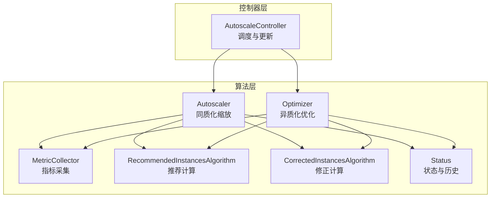
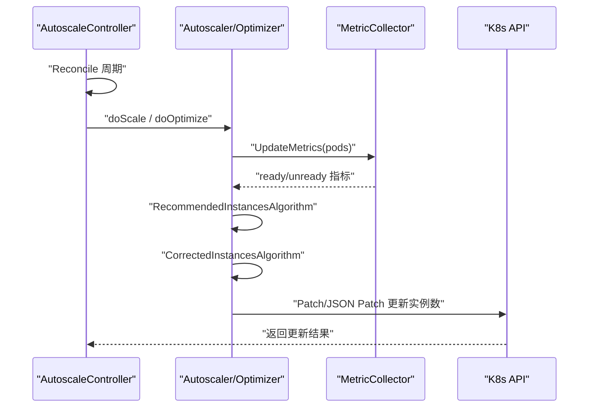
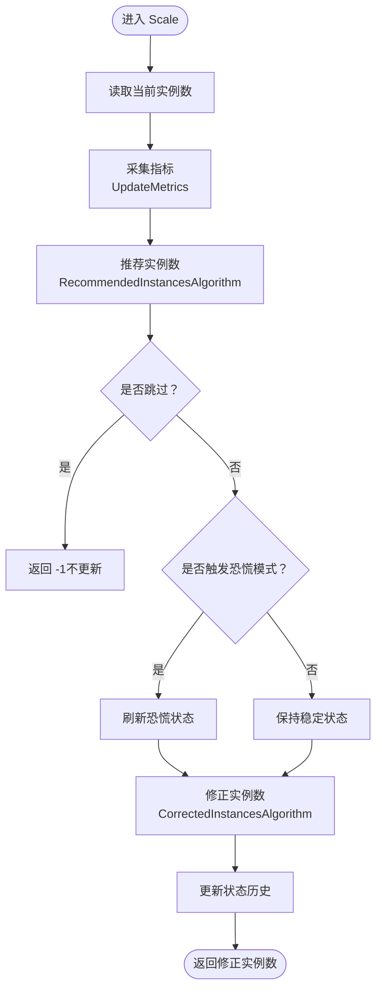
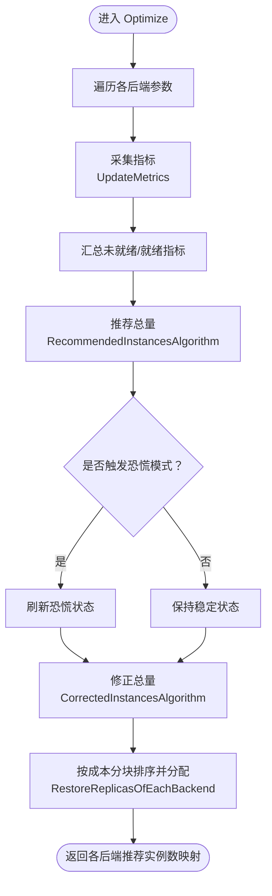
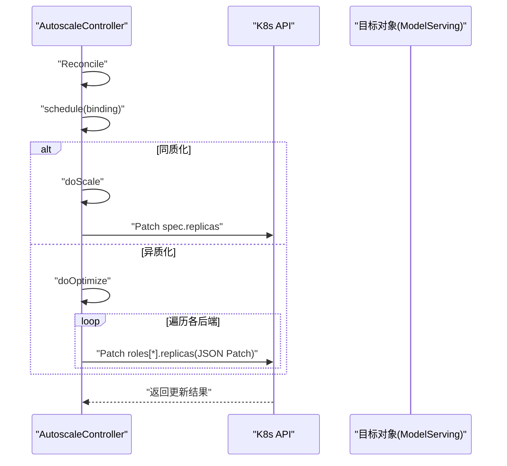
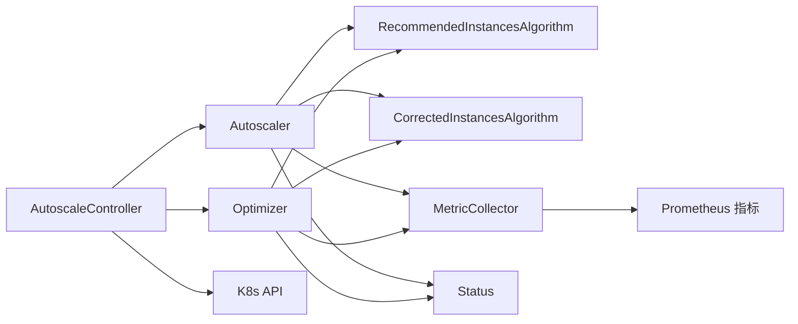

# 扩缩容算法

<cite>
**本文引用的文件**
- [pkg/autoscaler/autoscaler/scaler.go](file://pkg/autoscaler/autoscaler/scaler.go)
- [pkg/autoscaler/autoscaler/optimizer.go](file://pkg/autoscaler/autoscaler/optimizer.go)
- [pkg/autoscaler/autoscaler/metric_collector.go](file://pkg/autoscaler/autoscaler/metric_collector.go)
- [pkg/autoscaler/autoscaler/status.go](file://pkg/autoscaler/autoscaler/status.go)
- [pkg/autoscaler/algorithm/recommendation.go](file://pkg/autoscaler/algorithm/recommendation.go)
- [pkg/autoscaler/algorithm/revision.go](file://pkg/autoscaler/algorithm/revision.go)
- [pkg/autoscaler/controller/autoscale_controller.go](file://pkg/autoscaler/controller/autoscale_controller.go)
- [docs/kthena/docs/architecture/autoscaler.mdx](file://docs/kthena/docs/architecture/autoscaler.mdx)
- [pkg/autoscaler/controller/autoscale_controller_test.go](file://pkg/autoscaler/controller/autoscale_controller_test.go)
</cite>

## 目录
1. [引言](#引言)
2. [项目结构](#项目结构)
3. [核心组件](#核心组件)
4. [架构总览](#架构总览)
5. [详细组件分析](#详细组件分析)
6. [依赖分析](#依赖分析)
7. [性能考量](#性能考量)
8. [故障排查指南](#故障排查指南)
9. [结论](#结论)
10. [附录：算法数学模型与参数](#附录算法数学模型与参数)

## 引言
本文件系统性梳理 Kthena 的扩缩容算法实现，覆盖两类目标：
- 同质化目标（Homogeneous）：面向单一类型推理实例的扩缩容，支持稳定与恐慌两种模式，基于业务指标动态调整实例数。
- 异质化目标（Heterogeneous）：在同一模型下对多种硬件/引擎/运行参数的实例进行“总量预测 + 分配调度”，以成本最小化与资源利用率最大化为目标。

文档重点阐述 Scale 方法的实现逻辑（当前实例数获取、推荐实例数计算、状态更新），以及 Optimizer 的优化过程（多目标实例分配、成本最小化与负载平衡）。并给出算法的输入参数、计算公式、输出结果、收敛条件与稳定性分析，以及性能特征、适用场景与参数调优建议。

## 项目结构
扩缩容相关代码主要位于 autoscaler 子模块，并由控制器驱动执行。关键目录与文件如下：
- autoscaler 层：Autoscaler、Optimizer、MetricCollector、Status、算法层（recommendation、revision）
- controller 层：AutoscaleController 负责周期性调度、读取绑定配置、调用算法并更新目标实例数
- 文档：architecture/autoscaler.mdx 对异质化调度的贪心与倍增策略进行了说明

图表来源
- [pkg/autoscaler/controller/autoscale_controller.go:251-348](file://pkg/autoscaler/controller/autoscale_controller.go#L251-L348)
- [pkg/autoscaler/autoscaler/scaler.go:67-107](file://pkg/autoscaler/autoscaler/scaler.go#L67-L107)
- [pkg/autoscaler/autoscaler/optimizer.go:151-208](file://pkg/autoscaler/autoscaler/optimizer.go#L151-L208)
- [pkg/autoscaler/autoscaler/metric_collector.go:98-129](file://pkg/autoscaler/autoscaler/metric_collector.go#L98-L129)
- [pkg/autoscaler/algorithm/recommendation.go:38-75](file://pkg/autoscaler/algorithm/recommendation.go#L38-L75)
- [pkg/autoscaler/algorithm/revision.go:44-52](file://pkg/autoscaler/algorithm/revision.go#L44-L52)
- [pkg/autoscaler/autoscaler/status.go:32-87](file://pkg/autoscaler/autoscaler/status.go#L32-L87)

章节来源
- [pkg/autoscaler/controller/autoscale_controller.go:1-374](file://pkg/autoscaler/controller/autoscale_controller.go#L1-L374)
- [pkg/autoscaler/autoscaler/scaler.go:1-108](file://pkg/autoscaler/autoscaler/scaler.go#L1-L108)
- [pkg/autoscaler/autoscaler/optimizer.go:1-209](file://pkg/autoscaler/autoscaler/optimizer.go#L1-L209)
- [pkg/autoscaler/autoscaler/metric_collector.go:1-250](file://pkg/autoscaler/autoscaler/metric_collector.go#L1-L250)
- [pkg/autoscaler/autoscaler/status.go:1-88](file://pkg/autoscaler/autoscaler/status.go#L1-L88)
- [pkg/autoscaler/algorithm/recommendation.go:1-171](file://pkg/autoscaler/algorithm/recommendation.go#L1-L171)
- [pkg/autoscaler/algorithm/revision.go:1-122](file://pkg/autoscaler/algorithm/revision.go#L1-L122)
- [docs/kthena/docs/architecture/autoscaler.mdx:19-46](file://docs/kthena/docs/architecture/autoscaler.mdx#L19-L46)

## 核心组件
- Autoscaler（同质化缩放）
  - 输入：策略、绑定、当前实例数、Pod 列表
  - 处理：采集指标 → 计算推荐实例数 → 稳定/恐慌模式修正 → 更新状态
  - 输出：推荐/修正后的实例数
- Optimizer（异质化优化）
  - 输入：策略、绑定、当前各后端实例数映射
  - 处理：为每个后端采集指标 → 统一计算推荐总量 → 按成本分块排序 → 还原到各后端
  - 输出：各后端推荐实例数映射
- MetricCollector（指标采集）
  - 从 Pod 暴露的 Prometheus 接口拉取指标，支持直方图量化差分
- Status（状态与历史）
  - 记录推荐/修正的历史窗口，支撑稳定与恐慌模式的约束计算
- 算法层
  - RecommendedInstancesAlgorithm：基于单实例或外部指标的目标值比推导推荐实例数
  - CorrectedInstancesAlgorithm：根据行为策略与历史窗口进行上下限与相对/绝对约束修正

章节来源
- [pkg/autoscaler/autoscaler/scaler.go:28-107](file://pkg/autoscaler/autoscaler/scaler.go#L28-L107)
- [pkg/autoscaler/autoscaler/optimizer.go:29-208](file://pkg/autoscaler/autoscaler/optimizer.go#L29-L208)
- [pkg/autoscaler/autoscaler/metric_collector.go:43-249](file://pkg/autoscaler/autoscaler/metric_collector.go#L43-L249)
- [pkg/autoscaler/autoscaler/status.go:26-87](file://pkg/autoscaler/autoscaler/status.go#L26-L87)
- [pkg/autoscaler/algorithm/recommendation.go:27-171](file://pkg/autoscaler/algorithm/recommendation.go#L27-L171)
- [pkg/autoscaler/algorithm/revision.go:26-122](file://pkg/autoscaler/algorithm/revision.go#L26-L122)

## 架构总览
扩缩容控制器按周期扫描所有绑定，区分同质化与异质化路径：
- 同质化：直接对单一目标计算推荐并更新
- 异质化：先汇总各后端指标，统一计算总量，再按成本分块策略分配到各后端

图表来源
- [pkg/autoscaler/controller/autoscale_controller.go:124-171](file://pkg/autoscaler/controller/autoscale_controller.go#L124-L171)
- [pkg/autoscaler/controller/autoscale_controller.go:251-348](file://pkg/autoscaler/controller/autoscale_controller.go#L251-L348)
- [pkg/autoscaler/autoscaler/scaler.go:67-107](file://pkg/autoscaler/autoscaler/scaler.go#L67-L107)
- [pkg/autoscaler/autoscaler/optimizer.go:151-208](file://pkg/autoscaler/autoscaler/optimizer.go#L151-L208)
- [pkg/autoscaler/autoscaler/metric_collector.go:98-129](file://pkg/autoscaler/autoscaler/metric_collector.go#L98-L129)

## 详细组件分析

### 同质化目标：Autoscaler.Scale 方法
- 当前实例数获取
  - 通过控制器方法从目标对象读取当前副本数
- 推荐实例数计算
  - 采集指标（含直方图量化差分）→ RecommendedInstancesAlgorithm → CorrectedInstancesAlgorithm（稳定/恐慌模式）
- 状态更新
  - 将推荐与修正写入状态历史，用于后续约束

图表来源
- [pkg/autoscaler/autoscaler/scaler.go:67-107](file://pkg/autoscaler/autoscaler/scaler.go#L67-L107)
- [pkg/autoscaler/autoscaler/metric_collector.go:98-129](file://pkg/autoscaler/autoscaler/metric_collector.go#L98-L129)
- [pkg/autoscaler/autoscaler/status.go:32-87](file://pkg/autoscaler/autoscaler/status.go#L32-L87)
- [pkg/autoscaler/algorithm/recommendation.go:38-75](file://pkg/autoscaler/algorithm/recommendation.go#L38-L75)
- [pkg/autoscaler/algorithm/revision.go:44-52](file://pkg/autoscaler/algorithm/revision.go#L44-L52)

章节来源
- [pkg/autoscaler/autoscaler/scaler.go:67-107](file://pkg/autoscaler/autoscaler/scaler.go#L67-L107)
- [pkg/autoscaler/autoscaler/metric_collector.go:98-129](file://pkg/autoscaler/autoscaler/metric_collector.go#L98-L129)
- [pkg/autoscaler/autoscaler/status.go:32-87](file://pkg/autoscaler/autoscaler/status.go#L32-L87)
- [pkg/autoscaler/algorithm/recommendation.go:38-75](file://pkg/autoscaler/algorithm/recommendation.go#L38-L75)
- [pkg/autoscaler/algorithm/revision.go:44-52](file://pkg/autoscaler/algorithm/revision.go#L44-L52)

### 异质化目标：Optimizer 优化过程
- 多目标实例分配
  - 为每个后端独立采集指标，汇总后统一计算推荐总量
- 成本最小化与负载平衡
  - 通过成本扩展率将可用容量划分为不同幂次的批次，按成本升序混合排序，优先选择更低成本的组合
- 分配还原
  - 将总量分配回各后端，确保不低于最小值且不超过最大值

图表来源
- [pkg/autoscaler/autoscaler/optimizer.go:151-208](file://pkg/autoscaler/autoscaler/optimizer.go#L151-L208)
- [pkg/autoscaler/autoscaler/optimizer.go:52-68](file://pkg/autoscaler/autoscaler/optimizer.go#L52-L68)
- [pkg/autoscaler/autoscaler/metric_collector.go:98-129](file://pkg/autoscaler/autoscaler/metric_collector.go#L98-L129)
- [pkg/autoscaler/autoscaler/status.go:32-87](file://pkg/autoscaler/autoscaler/status.go#L32-L87)
- [pkg/autoscaler/algorithm/recommendation.go:38-75](file://pkg/autoscaler/algorithm/recommendation.go#L38-L75)
- [pkg/autoscaler/algorithm/revision.go:44-52](file://pkg/autoscaler/algorithm/revision.go#L44-L52)

章节来源
- [pkg/autoscaler/autoscaler/optimizer.go:151-208](file://pkg/autoscaler/autoscaler/optimizer.go#L151-L208)
- [pkg/autoscaler/autoscaler/optimizer.go:52-68](file://pkg/autoscaler/autoscaler/optimizer.go#L52-L68)
- [pkg/autoscaler/autoscaler/metric_collector.go:98-129](file://pkg/autoscaler/autoscaler/metric_collector.go#L98-L129)
- [pkg/autoscaler/autoscaler/status.go:32-87](file://pkg/autoscaler/autoscaler/status.go#L32-L87)
- [pkg/autoscaler/algorithm/recommendation.go:38-75](file://pkg/autoscaler/algorithm/recommendation.go#L38-L75)
- [pkg/autoscaler/algorithm/revision.go:44-52](file://pkg/autoscaler/algorithm/revision.go#L44-L52)
- [docs/kthena/docs/architecture/autoscaler.mdx:38-46](file://docs/kthena/docs/architecture/autoscaler.mdx#L38-L46)

### 控制器调度与更新
- Reconcile 周期扫描所有绑定，区分同质化/异质化路径
- doScale/doOptimize 分别调用 Autoscaler/Optimizer
- 通过 Patch/JSON Patch 更新目标副本数

图表来源
- [pkg/autoscaler/controller/autoscale_controller.go:124-171](file://pkg/autoscaler/controller/autoscale_controller.go#L124-L171)
- [pkg/autoscaler/controller/autoscale_controller.go:251-348](file://pkg/autoscaler/controller/autoscale_controller.go#L251-L348)
- [pkg/autoscaler/controller/autoscale_controller.go:173-222](file://pkg/autoscaler/controller/autoscale_controller.go#L173-L222)

章节来源
- [pkg/autoscaler/controller/autoscale_controller.go:124-171](file://pkg/autoscaler/controller/autoscale_controller.go#L124-L171)
- [pkg/autoscaler/controller/autoscale_controller.go:251-348](file://pkg/autoscaler/controller/autoscale_controller.go#L251-L348)
- [pkg/autoscaler/controller/autoscale_controller.go:173-222](file://pkg/autoscaler/controller/autoscale_controller.go#L173-L222)

## 依赖分析
- 组件耦合
  - AutoscaleController 依赖 Autoscaler/Optimizer 与 MetricCollector
  - Autoscaler/Optimizer 依赖算法层（推荐/修正）与状态管理
- 外部依赖
  - Prometheus 指标接口、K8s API（Patch/JSON Patch）、Pod 就绪态判断
- 关键依赖链
  - 控制器 → 算法层（推荐/修正）→ 指标采集 → K8s 更新

图表来源
- [pkg/autoscaler/controller/autoscale_controller.go:251-348](file://pkg/autoscaler/controller/autoscale_controller.go#L251-L348)
- [pkg/autoscaler/autoscaler/scaler.go:67-107](file://pkg/autoscaler/autoscaler/scaler.go#L67-L107)
- [pkg/autoscaler/autoscaler/optimizer.go:151-208](file://pkg/autoscaler/autoscaler/optimizer.go#L151-L208)
- [pkg/autoscaler/autoscaler/metric_collector.go:98-129](file://pkg/autoscaler/autoscaler/metric_collector.go#L98-L129)
- [pkg/autoscaler/autoscaler/status.go:32-87](file://pkg/autoscaler/autoscaler/status.go#L32-L87)
- [pkg/autoscaler/algorithm/recommendation.go:38-75](file://pkg/autoscaler/algorithm/recommendation.go#L38-L75)
- [pkg/autoscaler/algorithm/revision.go:44-52](file://pkg/autoscaler/algorithm/revision.go#L44-L52)

章节来源
- [pkg/autoscaler/controller/autoscale_controller.go:1-374](file://pkg/autoscaler/controller/autoscale_controller.go#L1-L374)
- [pkg/autoscaler/autoscaler/scaler.go:1-108](file://pkg/autoscaler/autoscaler/scaler.go#L1-L108)
- [pkg/autoscaler/autoscaler/optimizer.go:1-209](file://pkg/autoscaler/autoscaler/optimizer.go#L1-L209)
- [pkg/autoscaler/autoscaler/metric_collector.go:1-250](file://pkg/autoscaler/autoscaler/metric_collector.go#L1-L250)
- [pkg/autoscaler/autoscaler/status.go:1-88](file://pkg/autoscaler/autoscaler/status.go#L1-L88)
- [pkg/autoscaler/algorithm/recommendation.go:1-171](file://pkg/autoscaler/algorithm/recommendation.go#L1-L171)
- [pkg/autoscaler/algorithm/revision.go:1-122](file://pkg/autoscaler/algorithm/revision.go#L1-L122)

## 性能考量
- 指标采集开销
  - 每个周期对所有匹配 Pod 发起 HTTP 请求获取 Prometheus 指标；直方图量化差分引入额外计算
- 窗口与抖动控制
  - 稳定/恐慌模式下的滑动窗口记录推荐/修正，避免频繁变更
- 分配策略复杂度
  - 异质化成本分块排序与分配为 O(C log C)，其中 C 为可用容量；通常规模较小，可忽略
- 冷启动影响
  - 文档指出调度周期内存在显著冷启动状态变化，算法通过窗口与阈值缓解抖动

章节来源
- [pkg/autoscaler/autoscaler/metric_collector.go:131-183](file://pkg/autoscaler/autoscaler/metric_collector.go#L131-L183)
- [pkg/autoscaler/autoscaler/status.go:32-63](file://pkg/autoscaler/autoscaler/status.go#L32-L63)
- [docs/kthena/docs/architecture/autoscaler.mdx:38-46](file://docs/kthena/docs/architecture/autoscaler.mdx#L38-L46)

## 故障排查指南
- 指标为空或解析失败
  - 检查目标 Pod 是否就绪、Prometheus 接口是否可达、指标名称是否匹配
- 未发生扩缩
  - 查看是否处于容忍范围内导致跳过推荐；检查稳定/恐慌模式阈值与窗口设置
- 更新失败
  - 核对目标 Kind/命名空间/子目标角色是否存在；确认 JSON Patch 路径正确
- 测试验证
  - 单元测试覆盖了推荐/修正的多种边界情况，可参考断言与期望值定位问题

章节来源
- [pkg/autoscaler/autoscaler/metric_collector.go:98-129](file://pkg/autoscaler/autoscaler/metric_collector.go#L98-L129)
- [pkg/autoscaler/autoscaler/scaler.go:84-107](file://pkg/autoscaler/autoscaler/scaler.go#L84-L107)
- [pkg/autoscaler/autoscaler/optimizer.go:184-208](file://pkg/autoscaler/autoscaler/optimizer.go#L184-L208)
- [pkg/autoscaler/controller/autoscale_controller.go:173-222](file://pkg/autoscaler/controller/autoscale_controller.go#L173-L222)
- [pkg/autoscaler/controller/autoscale_controller_test.go:109-239](file://pkg/autoscaler/controller/autoscale_controller_test.go#L109-L239)

## 结论
Kthena 的扩缩容算法以“指标驱动 + 行为策略”为核心，既保证了同质化目标的快速响应，又通过异质化成本分块策略实现了多后端的成本最小化与资源利用平衡。通过状态与历史窗口，算法在稳定与恐慌模式间取得折中，降低抖动并提升鲁棒性。实际部署中应结合业务负载模式合理设置阈值与窗口，以获得更佳的吞吐与延迟表现。

## 附录：算法数学模型与参数

### 数学模型与公式
- 推荐实例数（单指标）
  - 外部指标：$ \text{desired} = \frac{\text{metric}}{\text{target}},\quad \text{recommended} = \text{roundUp}(\text{desired}) $
  - 实例指标：$ \text{ratio} = \frac{\text{avg(metric)}}{\text{target}} $，若方向改变或超出容忍范围则按比例调整
- 推荐实例数（多指标/多后端）
  - 取各指标推导的最大值作为最终推荐
- 修正实例数（稳定/恐慌）
  - 恐慌：上限受历史最小修正与相对百分比限制，至少不小于当前
  - 稳定上/下行：分别受历史最大推荐/最小推荐与绝对/相对约束，结合“或/与”策略选择最终约束

章节来源
- [pkg/autoscaler/algorithm/recommendation.go:38-150](file://pkg/autoscaler/algorithm/recommendation.go#L38-L150)
- [pkg/autoscaler/algorithm/revision.go:44-121](file://pkg/autoscaler/algorithm/revision.go#L44-L121)

### 输入参数与输出
- 同质化输入
  - 策略：容忍度、稳定/恐慌行为配置
  - 绑定：目标、指标端点
  - 当前实例数、Pod 列表
  - 输出：推荐/修正后的实例数
- 异质化输入
  - 策略、绑定（含各后端参数：最小/最大实例、成本、指标端点）
  - 当前各后端实例数映射
  - 输出：各后端推荐实例数映射
- 指标采集
  - 支持 Counter/Gauge/Histogram；直方图采用量化差分计算

章节来源
- [pkg/autoscaler/autoscaler/scaler.go:67-107](file://pkg/autoscaler/autoscaler/scaler.go#L67-L107)
- [pkg/autoscaler/autoscaler/optimizer.go:151-208](file://pkg/autoscaler/autoscaler/optimizer.go#L151-L208)
- [pkg/autoscaler/autoscaler/metric_collector.go:185-241](file://pkg/autoscaler/autoscaler/metric_collector.go#L185-L241)

### 收敛条件与稳定性
- 收敛条件
  - 指标比率在容忍范围内时返回当前实例数，避免不必要的变更
- 稳定性
  - 恐慌模式持续时间由策略配置决定；稳定模式通过历史窗口与相对/绝对约束抑制抖动

章节来源
- [pkg/autoscaler/autoscaler/status.go:32-87](file://pkg/autoscaler/autoscaler/status.go#L32-L87)
- [pkg/autoscaler/autoscaler/scaler.go:89-101](file://pkg/autoscaler/autoscaler/scaler.go#L89-L101)
- [pkg/autoscaler/autoscaler/optimizer.go:189-191](file://pkg/autoscaler/autoscaler/optimizer.go#L189-L191)

### 适用场景与参数调优建议
- 同质化
  - 场景：单一引擎/硬件配置的推理服务
  - 建议：根据 SLA 设置容忍度与稳定/恐慌周期；高波动场景提高容忍度
- 异质化
  - 场景：同一模型多后端（不同 GPU/NPU、引擎、运行参数）
  - 建议：合理设置成本扩展率与最小/最大实例；关注冷启动带来的抖动，适当延长稳定窗口

章节来源
- [docs/kthena/docs/architecture/autoscaler.mdx:19-46](file://docs/kthena/docs/architecture/autoscaler.mdx#L19-L46)
- [pkg/autoscaler/autoscaler/optimizer.go:75-124](file://pkg/autoscaler/autoscaler/optimizer.go#L75-L124)