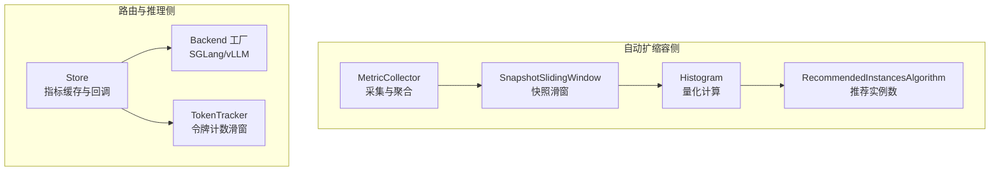
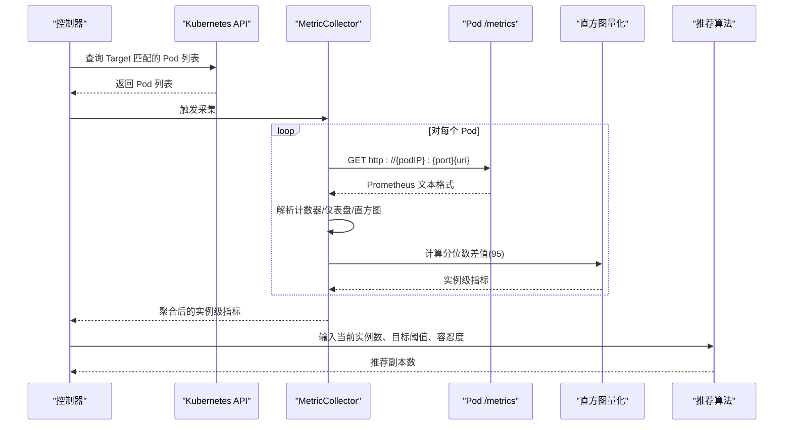
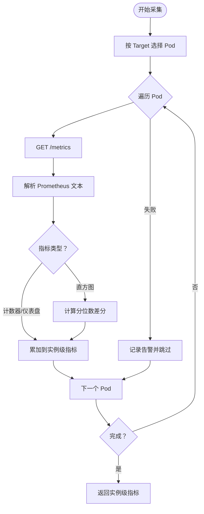
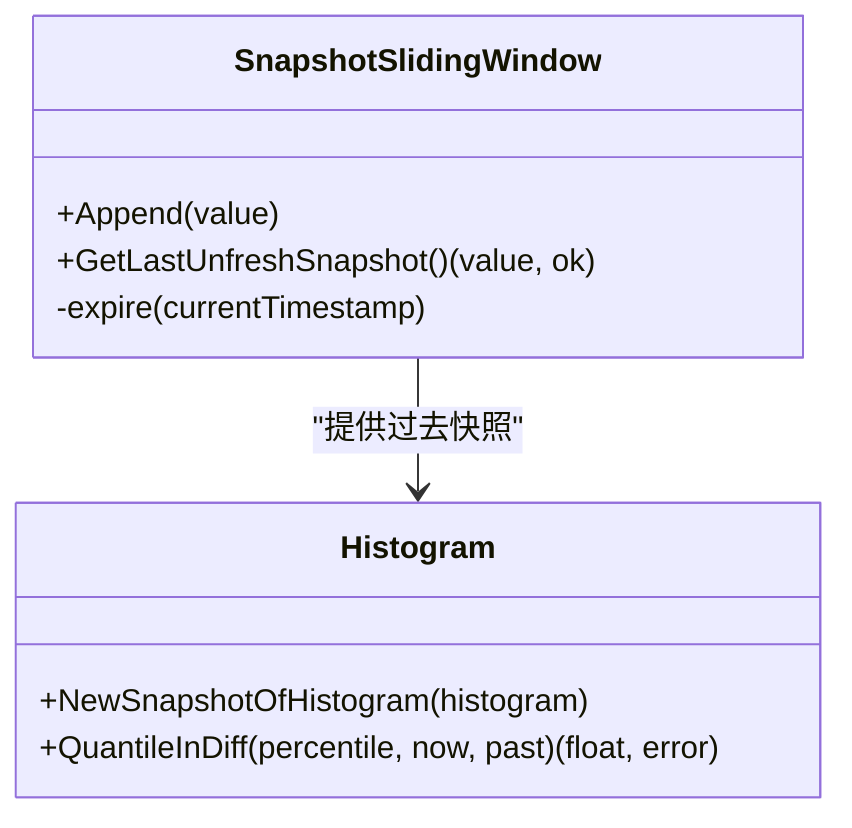
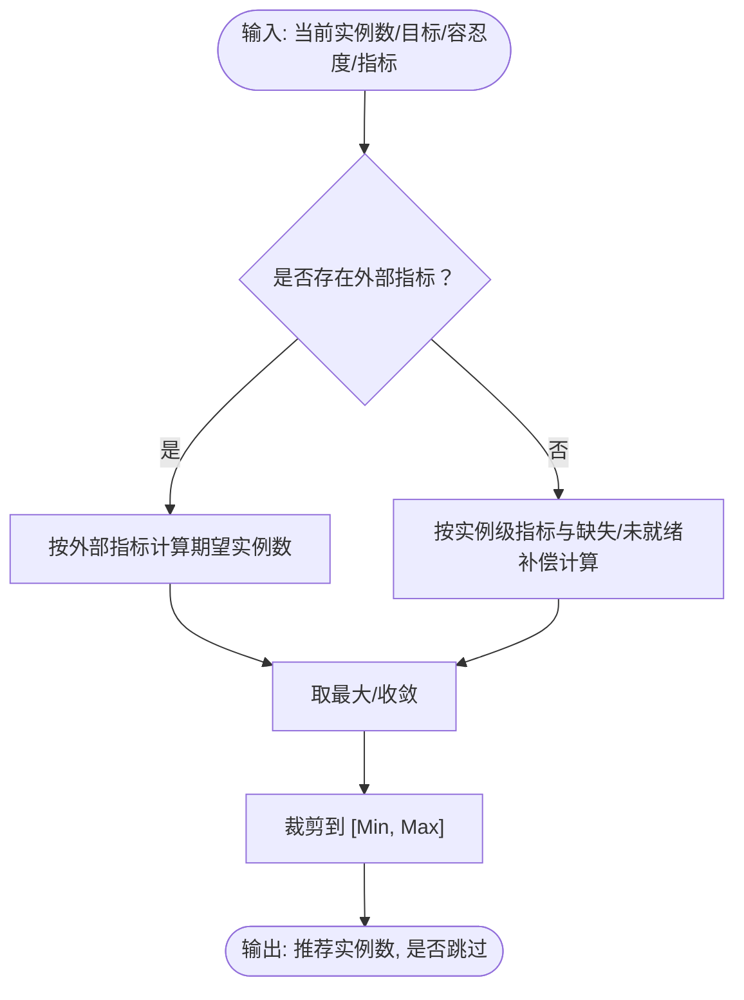
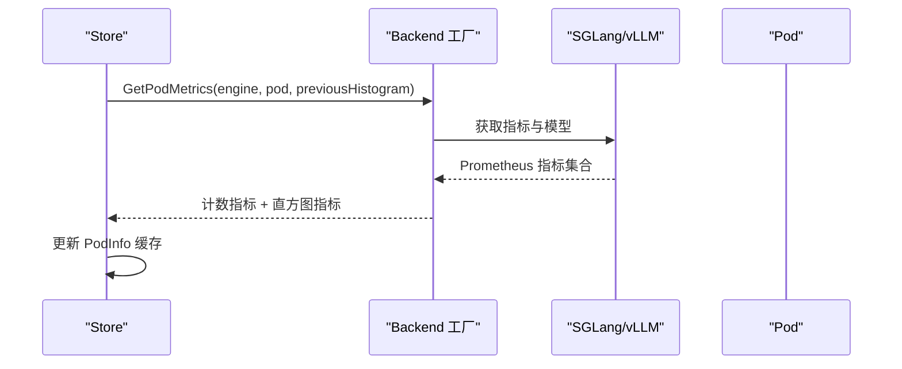
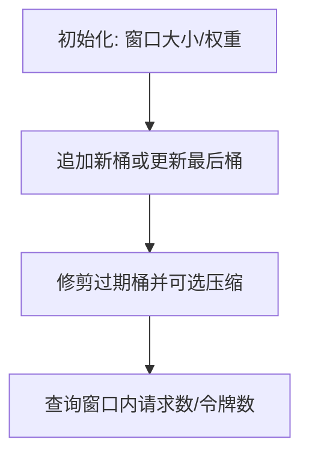
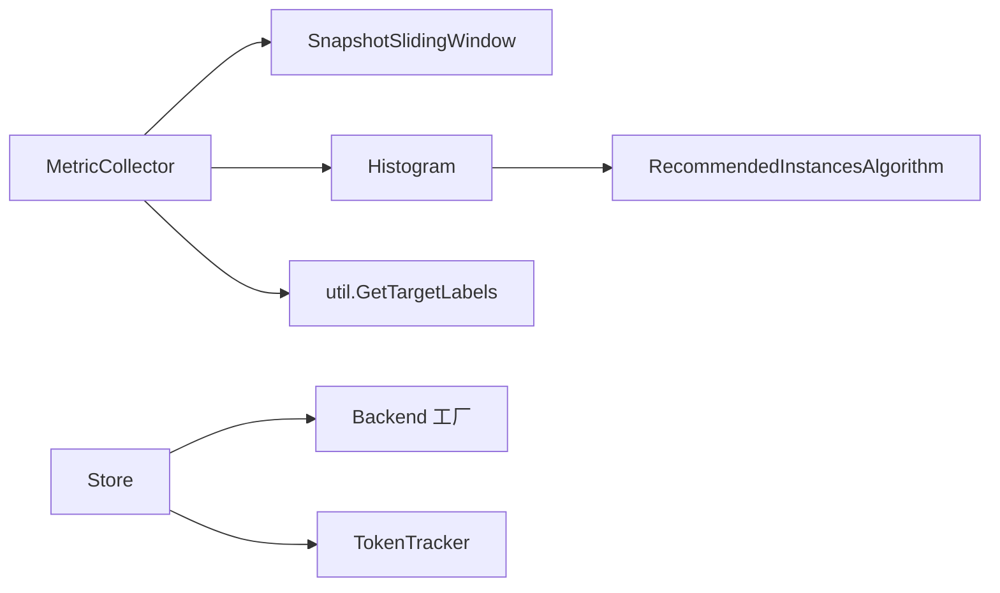

# 指标收集

<cite>
**本文引用的文件**
- [pkg/autoscaler/autoscaler/metric_collector.go](file://pkg/autoscaler/autoscaler/metric_collector.go)
- [pkg/autoscaler/datastructure/sliding_window.go](file://pkg/autoscaler/datastructure/sliding_window.go)
- [pkg/autoscaler/histogram/histogram.go](file://pkg/autoscaler/histogram/histogram.go)
- [pkg/autoscaler/algorithm/recommendation.go](file://pkg/autoscaler/algorithm/recommendation.go)
- [pkg/autoscaler/util/settings.go](file://pkg/autoscaler/util/settings.go)
- [pkg/autoscaler/util/client.go](file://pkg/autoscaler/util/client.go)
- [pkg/kthena-router/datastore/store.go](file://pkg/kthena-router/datastore/store.go)
- [pkg/kthena-router/datastore/token_tracker.go](file://pkg/kthena-router/datastore/token_tracker.go)
- [pkg/kthena-router/datastore/store_test.go](file://pkg/kthena-router/datastore/store_test.go)
- [pkg/kthena-router/backend/backend.go](file://pkg/kthena-router/backend/backend.go)
- [pkg/kthena-router/utils/utils.go](file://pkg/kthena-router/utils/utils.go)
- [docs/kthena/docs/general/prometheus.md](file://docs/kthena/docs/general/prometheus.md)
- [pkg/apis/workload/v1alpha1/autoscalingpolicy_types.go](file://pkg/apis/workload/v1alpha1/autoscalingpolicy_types.go)
- [client-go/applyconfiguration/workload/v1alpha1/metricendpoint.go](file://client-go/applyconfiguration/workload/v1alpha1/metricendpoint.go)
- [client-go/applyconfiguration/workload/v1alpha1/target.go](file://client-go/applyconfiguration/workload/v1alpha1/target.go)
</cite>

## 目录
1. [简介](#简介)
2. [项目结构](#项目结构)
3. [核心组件](#核心组件)
4. [架构总览](#架构总览)
5. [详细组件分析](#详细组件分析)
6. [依赖分析](#依赖分析)
7. [性能考虑](#性能考虑)
8. [故障排查指南](#故障排查指南)
9. [结论](#结论)
10. [附录](#附录)

## 简介
本文件面向 Kthena 指标收集系统，系统性梳理指标采集器的设计架构与数据采集机制，覆盖以下关键目标：
- 从 Kubernetes 集群采集 Pod 指标、节点指标与自定义指标（通过模型推理后端暴露的指标）。
- 解释指标客户端实现，包括 Prometheus 客户端集成与指标查询优化。
- 文档化指标类型定义、数据格式与采样频率。
- 提供指标收集的配置选项、过滤规则与聚合策略。
- 覆盖指标缓存机制、数据一致性保证与错误恢复。
- 展示在不同扩缩容场景下的应用与性能影响。

## 项目结构
Kthena 的指标收集涉及两类主要路径：
- 自动扩缩容侧：从 Pod 暴露的 /metrics 接口拉取 Prometheus 格式指标，进行滑动窗口统计与量化计算，驱动扩缩容决策。
- 路由与推理侧：从推理后端（如 SGLang、vLLM）采集运行时指标（如 GPU 使用率、请求等待/运行数、TPOT/TFT 等直方图），并维护 Pod 级别的指标缓存与模型列表。

图表来源
- [pkg/autoscaler/autoscaler/metric_collector.go:98-183](file://pkg/autoscaler/autoscaler/metric_collector.go#L98-L183)
- [pkg/autoscaler/datastructure/sliding_window.go:185-237](file://pkg/autoscaler/datastructure/sliding_window.go#L185-L237)
- [pkg/autoscaler/histogram/histogram.go:61-122](file://pkg/autoscaler/histogram/histogram.go#L61-L122)
- [pkg/autoscaler/algorithm/recommendation.go:38-75](file://pkg/autoscaler/algorithm/recommendation.go#L38-L75)
- [pkg/kthena-router/datastore/store.go:1168-1182](file://pkg/kthena-router/datastore/store.go#L1168-L1182)
- [pkg/kthena-router/datastore/token_tracker.go:84-328](file://pkg/kthena-router/datastore/token_tracker.go#L84-L328)
- [pkg/kthena-router/backend/backend.go:42-82](file://pkg/kthena-router/backend/backend.go#L42-L82)

章节来源
- [pkg/autoscaler/autoscaler/metric_collector.go:98-183](file://pkg/autoscaler/autoscaler/metric_collector.go#L98-L183)
- [pkg/kthena-router/datastore/store.go:1168-1182](file://pkg/kthena-router/datastore/store.go#L1168-L1182)

## 核心组件
- 指标采集器（MetricCollector）
  - 从 Kubernetes 中按 Target 选择的 Pod 列表，访问其 /metrics 接口，解析 Prometheus 文本格式，提取计数器/仪表盘/直方图，并计算指定分位数差值作为实例级指标。
- 滑动窗口与量化（SnapshotSlidingWindow、Histogram）
  - 维护最近新鲜快照与过期窗口，基于直方图样本差分计算指定分位数（默认 95 分位）用于稳定评估。
- 推荐算法（RecommendedInstancesAlgorithm）
  - 基于外部指标与实例级指标，结合容忍度与最小/最大实例数，输出推荐副本数。
- 路由侧指标存储（Store）
  - 从推理后端获取 Pod 运行时指标与模型列表，缓存到 PodInfo，支持直方图与计数指标更新。
- 公平调度令牌跟踪（TokenTracker）
  - 基于滑动窗口对用户/模型维度的输入/输出令牌加权计数，支持窗口大小与权重的环境变量配置。

章节来源
- [pkg/autoscaler/autoscaler/metric_collector.go:43-62](file://pkg/autoscaler/autoscaler/metric_collector.go#L43-L62)
- [pkg/autoscaler/datastructure/sliding_window.go:185-237](file://pkg/autoscaler/datastructure/sliding_window.go#L185-L237)
- [pkg/autoscaler/histogram/histogram.go:61-122](file://pkg/autoscaler/histogram/histogram.go#L61-L122)
- [pkg/autoscaler/algorithm/recommendation.go:27-36](file://pkg/autoscaler/algorithm/recommendation.go#L27-L36)
- [pkg/kthena-router/datastore/store.go:135-149](file://pkg/kthena-router/datastore/store.go#L135-L149)
- [pkg/kthena-router/datastore/token_tracker.go:96-110](file://pkg/kthena-router/datastore/token_tracker.go#L96-L110)

## 架构总览
下图展示了从 Kubernetes Pod 拉取指标、解析与聚合、再到扩缩容决策的整体流程，以及路由侧指标缓存与后端集成：

图表来源
- [pkg/autoscaler/autoscaler/metric_collector.go:98-183](file://pkg/autoscaler/autoscaler/metric_collector.go#L98-L183)
- [pkg/autoscaler/histogram/histogram.go:61-122](file://pkg/autoscaler/histogram/histogram.go#L61-L122)
- [pkg/autoscaler/algorithm/recommendation.go:38-75](file://pkg/autoscaler/algorithm/recommendation.go#L38-L75)

## 详细组件分析

### 自动扩缩容指标采集器（MetricCollector）
- 功能要点
  - 依据 Target 的 MetricEndpoint（URI、端口、标签选择器）筛选 Pod。
  - 并发访问各 Pod 的 /metrics，解析 Prometheus 文本格式。
  - 支持计数器、仪表盘、直方图；对直方图使用快照滑窗与分位数差分计算，避免重启抖动。
  - 将实例级指标汇总，供推荐算法使用。
- 关键参数
  - 采集周期：15 秒（同步周期常量）。
  - 滑动窗口：60 秒新鲜窗口、300 秒保留窗口；分位数：95。
  - 单次请求超时：3 秒。
- 错误处理
  - 请求失败、响应非成功或空体将记录告警并跳过该 Pod。
  - 若任一 Pod 失败或未就绪，整体返回失败状态，避免误判。

图表来源
- [pkg/autoscaler/autoscaler/metric_collector.go:98-183](file://pkg/autoscaler/autoscaler/metric_collector.go#L98-L183)
- [pkg/autoscaler/util/settings.go:19-25](file://pkg/autoscaler/util/settings.go#L19-L25)

章节来源
- [pkg/autoscaler/autoscaler/metric_collector.go:98-183](file://pkg/autoscaler/autoscaler/metric_collector.go#L98-L183)
- [pkg/autoscaler/util/settings.go:19-25](file://pkg/autoscaler/util/settings.go#L19-L25)

### 滑动窗口与直方图量化
- SnapshotSlidingWindow
  - 维护“新鲜”与“过期”两层约束，确保仅使用有效时间窗口内的快照。
- 直方图量化
  - 基于 Prometheus 直方图桶序列，计算指定分位数（95）的差分值，避免重启导致的计数回退。
- 性能与稳定性
  - 通过快照滑窗减少瞬时波动，提升扩缩容决策稳定性。

图表来源
- [pkg/autoscaler/datastructure/sliding_window.go:185-237](file://pkg/autoscaler/datastructure/sliding_window.go#L185-L237)
- [pkg/autoscaler/histogram/histogram.go:46-59](file://pkg/autoscaler/histogram/histogram.go#L46-L59)
- [pkg/autoscaler/histogram/histogram.go:61-122](file://pkg/autoscaler/histogram/histogram.go#L61-L122)

章节来源
- [pkg/autoscaler/datastructure/sliding_window.go:185-237](file://pkg/autoscaler/datastructure/sliding_window.go#L185-L237)
- [pkg/autoscaler/histogram/histogram.go:61-122](file://pkg/autoscaler/histogram/histogram.go#L61-L122)

### 推荐算法（RecommendedInstancesAlgorithm）
- 输入
  - 当前实例数、最小/最大实例数、容忍度、外部指标与实例级指标、未就绪实例数。
- 输出
  - 推荐实例数与是否跳过本次扩缩容。
- 策略
  - 外部指标：直接按比例计算期望实例数，结合容忍度决定是否调整。
  - 实例级指标：对缺失指标进行保守估计，避免误判；综合未就绪实例的影响。

图表来源
- [pkg/autoscaler/algorithm/recommendation.go:38-75](file://pkg/autoscaler/algorithm/recommendation.go#L38-L75)
- [pkg/autoscaler/algorithm/recommendation.go:100-150](file://pkg/autoscaler/algorithm/recommendation.go#L100-L150)

章节来源
- [pkg/autoscaler/algorithm/recommendation.go:38-75](file://pkg/autoscaler/algorithm/recommendation.go#L38-L75)

### 路由侧指标存储与后端集成（Store 与 Backend）
- Store
  - 从推理后端获取 Pod 指标与模型列表，缓存到 PodInfo，支持直方图与计数指标更新。
  - 提供回调注册与触发，便于路由与调度模块感知指标变化。
- Backend 工厂
  - 注册 SGLang 与 vLLM 后端，统一接口获取指标与模型列表。
- 指标类型
  - 计数类：GPU 缓存使用率、请求等待数、请求运行数。
  - 直方图类：TPOT（每输出 token 时间）、TTFT（首 token 时间）。

图表来源
- [pkg/kthena-router/datastore/store.go:1168-1182](file://pkg/kthena-router/datastore/store.go#L1168-L1182)
- [pkg/kthena-router/backend/backend.go:42-82](file://pkg/kthena-router/backend/backend.go#L42-L82)
- [pkg/kthena-router/utils/utils.go:30-36](file://pkg/kthena-router/utils/utils.go#L30-L36)

章节来源
- [pkg/kthena-router/datastore/store.go:1168-1182](file://pkg/kthena-router/datastore/store.go#L1168-L1182)
- [pkg/kthena-router/backend/backend.go:42-82](file://pkg/kthena-router/backend/backend.go#L42-L82)
- [pkg/kthena-router/utils/utils.go:30-36](file://pkg/kthena-router/utils/utils.go#L30-L36)

### 公平调度令牌跟踪（TokenTracker）
- 功能
  - 基于滑动窗口对用户/模型维度的输入/输出令牌加权计数，支持窗口大小与权重的环境变量配置。
- 优化
  - 内部采用紧凑数组与累积和，定期压缩过期桶，降低内存占用。
- 配置
  - 窗口大小：FAIRNESS_WINDOW_SIZE（如 5m）。
  - 权重：FAIRNESS_INPUT_TOKEN_WEIGHT、FAIRNESS_OUTPUT_TOKEN_WEIGHT。

图表来源
- [pkg/kthena-router/datastore/token_tracker.go:96-110](file://pkg/kthena-router/datastore/token_tracker.go#L96-L110)
- [pkg/kthena-router/datastore/token_tracker.go:118-155](file://pkg/kthena-router/datastore/token_tracker.go#L118-L155)
- [pkg/kthena-router/datastore/token_tracker.go:310-328](file://pkg/kthena-router/datastore/token_tracker.go#L310-L328)

章节来源
- [pkg/kthena-router/datastore/token_tracker.go:84-328](file://pkg/kthena-router/datastore/token_tracker.go#L84-L328)

## 依赖分析
- 自动扩缩容侧
  - MetricCollector 依赖 SnapshotSlidingWindow 与 Histogram，最终输出给 RecommendedInstancesAlgorithm。
  - 采集逻辑依赖 Kubernetes Pod 列表与 Target 配置，通过 util.GetTargetLabels 生成标签选择器。
- 路由侧
  - Store 依赖 Backend 工厂与 PodRuntimeInspector，负责缓存与回调。
  - TokenTracker 作为独立模块，被公平调度等模块复用。

图表来源
- [pkg/autoscaler/autoscaler/metric_collector.go:98-129](file://pkg/autoscaler/autoscaler/metric_collector.go#L98-L129)
- [pkg/autoscaler/util/client.go:89-120](file://pkg/autoscaler/util/client.go#L89-L120)
- [pkg/kthena-router/datastore/store.go:135-149](file://pkg/kthena-router/datastore/store.go#L135-L149)
- [pkg/kthena-router/backend/backend.go:37-40](file://pkg/kthena-router/backend/backend.go#L37-L40)

章节来源
- [pkg/autoscaler/util/client.go:89-120](file://pkg/autoscaler/util/client.go#L89-L120)
- [pkg/kthena-router/datastore/store.go:135-149](file://pkg/kthena-router/datastore/store.go#L135-L149)

## 性能考虑
- 采集频率与窗口
  - 同步周期 15 秒，新鲜窗口 60 秒，保留窗口 300 秒，适合中等规模集群的稳定观测。
- 请求超时与并发
  - 单次请求超时 3 秒，避免阻塞整体采集；并发访问多个 Pod，注意后端压力与网络带宽。
- 指标解析与计算
  - Prometheus 文本解码与直方图差分计算为 O(n) 桶扫描，建议控制直方图桶数量与分位数计算频率。
- 存储与缓存
  - Store 对直方图与计数指标分别缓存，避免重复解析；TokenTracker 采用紧凑数组与压缩策略，降低内存占用。
- 扩缩容抖动抑制
  - 快照滑窗与分位数差分有效抑制重启与短期波动带来的误判。

## 故障排查指南
- 采集失败
  - 检查 Pod 是否暴露 /metrics、端口与 URI 是否正确、标签选择器是否匹配。
  - 查看日志中的“GET /metrics 失败/响应无效”提示，确认网络连通性与后端健康。
- 指标为空或为零
  - 确认后端已产生指标（如 TTFT/TPOT 需要请求触发）；检查快照滑窗是否过早过期。
- 扩缩容不生效
  - 检查容忍度设置是否过大；核对外部指标与实例级指标是否缺失；确认未就绪实例数是否影响判断。
- 路由侧指标异常
  - 核对 Store 的回调注册与触发链路；验证直方图更新函数映射是否完整。

章节来源
- [pkg/autoscaler/autoscaler/metric_collector.go:158-175](file://pkg/autoscaler/autoscaler/metric_collector.go#L158-L175)
- [pkg/kthena-router/datastore/store.go:1246-1265](file://pkg/kthena-router/datastore/store.go#L1246-L1265)
- [pkg/kthena-router/datastore/store_test.go:70-118](file://pkg/kthena-router/datastore/store_test.go#L70-L118)

## 结论
Kthena 的指标收集体系通过“自动扩缩容侧”的 Prometheus 指标采集与“路由侧”的推理后端指标缓存，实现了对 Pod、节点与自定义指标的全面观测。借助滑动窗口与直方图量化，系统在保证稳定性的同时兼顾了实时性；通过推荐算法与配置化的容忍度、窗口与分位数，能够适配多种扩缩容场景。公平调度令牌跟踪进一步增强了资源分配的公平性与可预测性。

## 附录

### 指标类型定义与数据格式
- 计数类指标
  - GPU 缓存使用率、请求等待数、请求运行数。
- 直方图类指标
  - TPOT（每输出 token 时间）、TTFT（首 token 时间）。
- 数据格式
  - Prometheus 文本格式，MetricFamily -> Counter/Gauge/Histogram。

章节来源
- [pkg/kthena-router/utils/utils.go:30-36](file://pkg/kthena-router/utils/utils.go#L30-L36)
- [pkg/kthena-router/backend/backend.go:30-35](file://pkg/kthena-router/backend/backend.go#L30-L35)

### 采样频率与配置
- 采样频率
  - 自动扩缩容侧：同步周期 15 秒。
  - 窗口参数：新鲜窗口 60 秒，保留窗口 300 秒，分位数 95。
- 配置项
  - 自动扩缩容侧：AutoscalingSyncPeriodSeconds、SloQuantileSlidingWindowSeconds、SloQuantileDataKeepSeconds、SloQuantilePercentile、AutoscaleCtxTimeoutSeconds。
  - 公平调度侧：FAIRNESS_WINDOW_SIZE、FAIRNESS_INPUT_TOKEN_WEIGHT、FAIRNESS_OUTPUT_TOKEN_WEIGHT。

章节来源
- [pkg/autoscaler/util/settings.go:19-25](file://pkg/autoscaler/util/settings.go#L19-L25)
- [pkg/kthena-router/datastore/store.go:70-111](file://pkg/kthena-router/datastore/store.go#L70-L111)

### 配置选项与过滤规则
- Target 与 MetricEndpoint
  - 通过 TargetRef 与 MetricEndpoint 的标签选择器匹配 Pod；可指定子目标（Role）与入口标签。
- 过滤规则
  - 仅采集命中 MetricEndpoint 的 Pod；对失败或未就绪的 Pod 进行标记与跳过。
- 自定义指标
  - 可通过自定义后端实现 MetricsProvider，扩展新的指标来源。

章节来源
- [client-go/applyconfiguration/workload/v1alpha1/target.go:39-61](file://client-go/applyconfiguration/workload/v1alpha1/target.go#L39-L61)
- [client-go/applyconfiguration/workload/v1alpha1/metricendpoint.go:25-61](file://client-go/applyconfiguration/workload/v1alpha1/metricendpoint.go#L25-L61)
- [pkg/autoscaler/util/client.go:89-120](file://pkg/autoscaler/util/client.go#L89-L120)

### 聚合策略与缓存机制
- 聚合策略
  - 实例级指标按名称累加；缺失指标以 0 补齐；未就绪实例参与保守估计。
- 缓存机制
  - Store 缓存直方图与计数指标；TokenTracker 采用滑动窗口与压缩策略，定期修剪过期桶。
- 数据一致性
  - 通过 PodStartTime 与快照滑窗判断是否复用历史直方图，避免重启导致的负增长。

章节来源
- [pkg/autoscaler/autoscaler/metric_collector.go:243-250](file://pkg/autoscaler/autoscaler/metric_collector.go#L243-L250)
- [pkg/kthena-router/datastore/store.go:1168-1182](file://pkg/kthena-router/datastore/store.go#L1168-L1182)
- [pkg/kthena-router/datastore/token_tracker.go:118-155](file://pkg/kthena-router/datastore/token_tracker.go#L118-L155)

### 在不同扩缩容场景下的应用
- 正常流量
  - 95 分位延迟稳定，推荐实例数接近目标，容忍度内不触发。
- 突发流量
  - 瞬时延迟升高，快照滑窗仍提供稳定评估；必要时启用恐慌模式（若策略允许）。
- 低流量/空闲
  - 延迟下降，推荐实例数可能下调，受最小实例数与容忍度限制。
- 扩缩容后抖动
  - 新实例加入/退出时，快照滑窗会逐步收敛，避免频繁震荡。

章节来源
- [pkg/autoscaler/algorithm/recommendation.go:38-75](file://pkg/autoscaler/algorithm/recommendation.go#L38-L75)
- [pkg/autoscaler/autoscaler/metric_collector.go:131-183](file://pkg/autoscaler/autoscaler/metric_collector.go#L131-L183)

### Prometheus 集成与监控
- 安装与配置
  - 使用 kube-prometheus-stack 安装 Prometheus；通过 ServiceMonitor 或 PodScrape 采集 Kthena 与模型服务指标。
- 关键指标
  - 推理请求速率、时延、大小、错误率、模型加载时延/失败次数、内存/CPU/GPU 使用等。

章节来源
- [docs/kthena/docs/general/prometheus.md:34-163](file://docs/kthena/docs/general/prometheus.md#L34-L163)