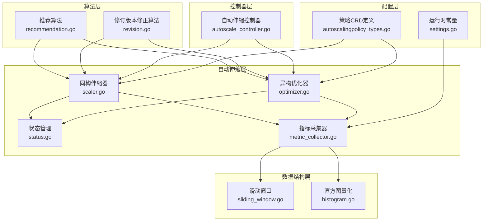
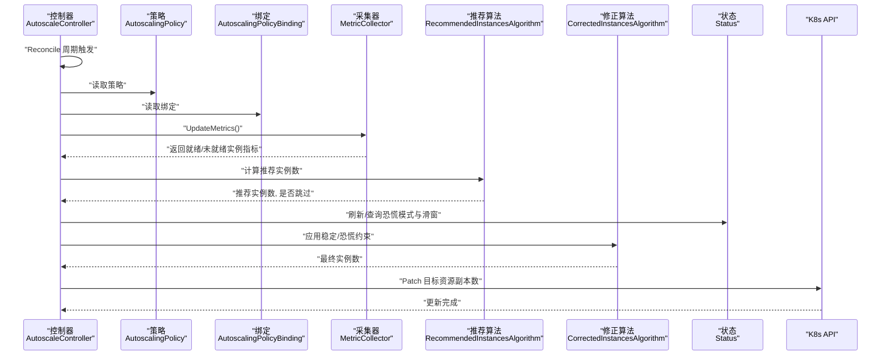
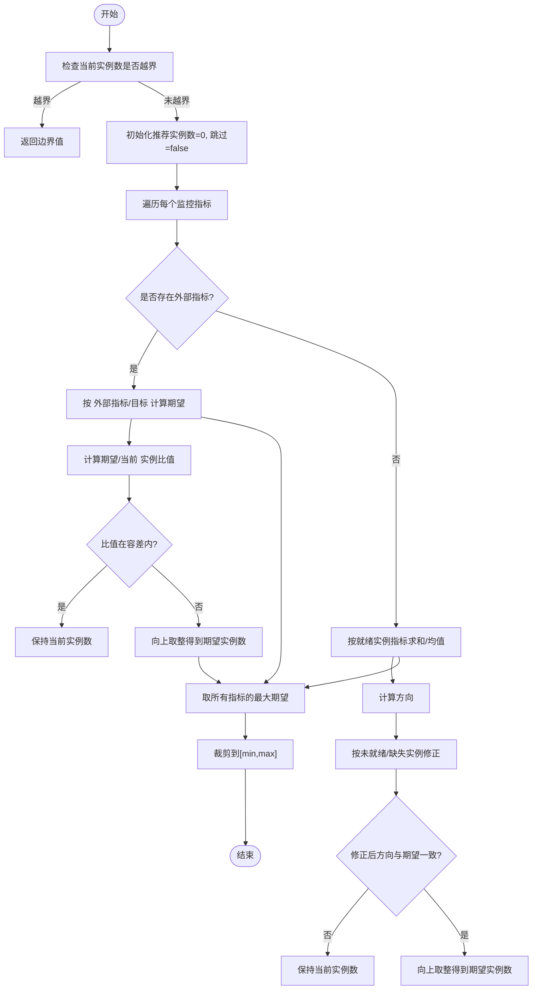
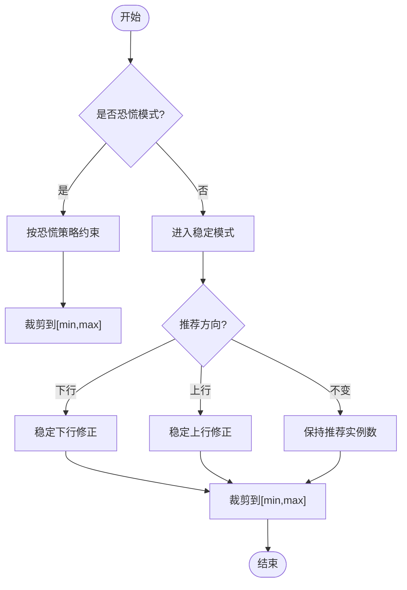
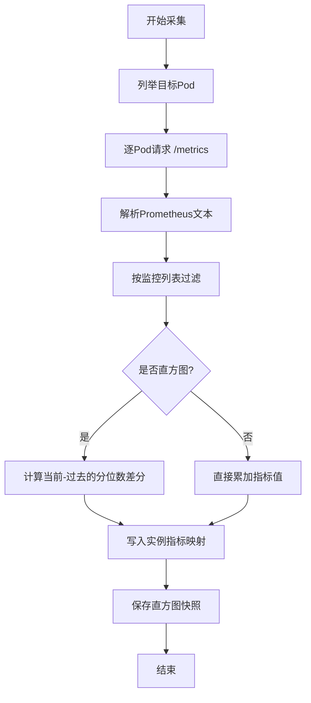
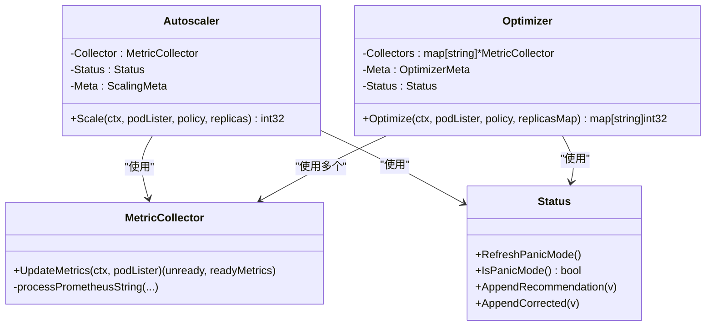
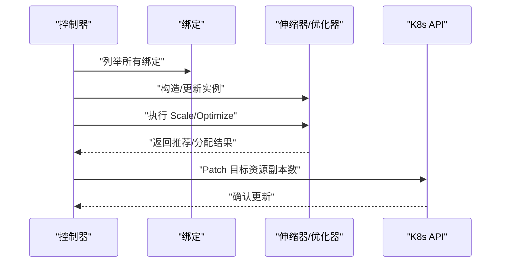
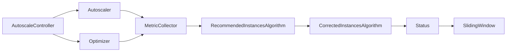

# 推荐引擎

<cite>
**本文引用的文件**
- [recommendation.go](file://pkg/autoscaler/algorithm/recommendation.go)
- [revision.go](file://pkg/autoscaler/algorithm/revision.go)
- [scaler.go](file://pkg/autoscaler/autoscaler/scaler.go)
- [optimizer.go](file://pkg/autoscaler/autoscaler/optimizer.go)
- [status.go](file://pkg/autoscaler/autoscaler/status.go)
- [metric_collector.go](file://pkg/autoscaler/autoscaler/metric_collector.go)
- [sliding_window.go](file://pkg/autoscaler/datastructure/sliding_window.go)
- [settings.go](file://pkg/autoscaler/util/settings.go)
- [autoscale_controller.go](file://pkg/autoscaler/controller/autoscale_controller.go)
- [autoscalingpolicy_types.go](file://pkg/apis/workload/v1alpha1/autoscalingpolicy_types.go)
- [histogram.go](file://pkg/autoscaler/histogram/histogram.go)
- [autoscaler.mdx](file://docs/kthena/docs/architecture/autoscaler.mdx)
- [autoscaler.md](file://docs/kthena/docs/user-guide/autoscaler.md)
- [recommendation_test.go](file://pkg/autoscaler/algorithm/recommendation_test.go)
- [sliding_window_test.go](file://pkg/autoscaler/datastructure/sliding_window_test.go)
</cite>

## 目录
1. [简介](#简介)
2. [项目结构](#项目结构)
3. [核心组件](#核心组件)
4. [架构总览](#架构总览)
5. [详细组件分析](#详细组件分析)
6. [依赖分析](#依赖分析)
7. [性能考虑](#性能考虑)
8. [故障排查指南](#故障排查指南)
9. [结论](#结论)
10. [附录](#附录)

## 简介
本文件面向 Kthena 推荐引擎（Autoscaler）的实现与使用，聚焦于推荐算法的核心逻辑与决策机制，阐述如何基于历史数据、实时负载与业务规则生成扩缩容建议；同时覆盖修订版本管理（滑动窗口状态机）、版本比较与冲突处理、回滚策略；并给出输入输出格式、权重与阈值配置、评估指标与可靠性分析，以及在多业务场景下的适应性与优化效果。

## 项目结构
Kthena 推荐引擎位于 pkg/autoscaler 子目录，采用分层设计：
- 算法层：推荐算法与修订版本修正算法
- 自动伸缩层：同构/异构实例的伸缩控制器与优化器
- 数据结构层：滑动窗口、直方图量化等基础设施
- 控制器层：Kubernetes 资源绑定与调度执行
- 配置层：CRD 定义与用户侧行为参数

图表来源
- [recommendation.go:27-171](file://pkg/autoscaler/algorithm/recommendation.go#L27-L171)
- [revision.go:26-122](file://pkg/autoscaler/algorithm/revision.go#L26-L122)
- [scaler.go:28-108](file://pkg/autoscaler/autoscaler/scaler.go#L28-L108)
- [optimizer.go:29-209](file://pkg/autoscaler/autoscaler/optimizer.go#L29-L209)
- [status.go:26-88](file://pkg/autoscaler/autoscaler/status.go#L26-L88)
- [metric_collector.go:43-250](file://pkg/autoscaler/autoscaler/metric_collector.go#L43-L250)
- [sliding_window.go:37-237](file://pkg/autoscaler/datastructure/sliding_window.go#L37-L237)
- [histogram.go:27-123](file://pkg/autoscaler/histogram/histogram.go#L27-L123)
- [autoscale_controller.go:47-374](file://pkg/autoscaler/controller/autoscale_controller.go#L47-L374)
- [autoscalingpolicy_types.go:24-153](file://pkg/apis/workload/v1alpha1/autoscalingpolicy_types.go#L24-L153)
- [settings.go:19-26](file://pkg/autoscaler/util/settings.go#L19-L26)

章节来源
- [autoscaler.mdx:1-66](file://docs/kthena/docs/architecture/autoscaler.mdx#L1-L66)
- [autoscaler.md:1-331](file://docs/kthena/docs/user-guide/autoscaler.md#L1-L331)

## 核心组件
- 推荐算法（RecommendedInstancesAlgorithm）
  - 输入：当前实例数、最小/最大实例数、容差、指标目标值、就绪/未就绪实例指标、外部指标
  - 输出：推荐实例数与是否跳过本次决策
  - 关键逻辑：按指标分别计算期望实例数，取最大值；对就绪/未就绪与缺失实例进行方向性修正；应用容差抑制抖动
- 修订版本修正算法（CorrectedInstancesAlgorithm）
  - 输入：是否恐慌模式、历史滑动窗口、策略行为（稳定/恐慌）
  - 输出：最终修正后的实例数
  - 关键逻辑：根据稳定/恐慌模式分别施加绝对/相对约束，结合历史最佳推荐与周期窗口限制，避免过度或反向调整
- 指标采集器（MetricCollector）
  - 功能：从目标 Pod 的 /metrics 拉取 Prometheus 指标，支持直方图分位数差分计算
  - 关键点：按策略监控列表过滤指标，缓存直方图快照，计算直方图分位数差分以降低抖动
- 状态管理（Status）
  - 维护恐慌模式持续时间、滑动窗口（记录/折线型）以约束稳定/恐慌期的缩放幅度
- 同构/异构伸缩器
  - 同构：针对单一实例类型，直接计算推荐实例数并应用修正
  - 异构：聚合多实例类型的指标，预测总需求后按成本扩展率策略分配到各实例类型
- 控制器（AutoscaleController）
  - 周期性拉取绑定资源，调度同构/异构流程，更新目标资源副本数

章节来源
- [recommendation.go:27-171](file://pkg/autoscaler/algorithm/recommendation.go#L27-L171)
- [revision.go:26-122](file://pkg/autoscaler/algorithm/revision.go#L26-L122)
- [metric_collector.go:43-250](file://pkg/autoscaler/autoscaler/metric_collector.go#L43-L250)
- [status.go:26-88](file://pkg/autoscaler/autoscaler/status.go#L26-L88)
- [scaler.go:28-108](file://pkg/autoscaler/autoscaler/scaler.go#L28-L108)
- [optimizer.go:29-209](file://pkg/autoscaler/autoscaler/optimizer.go#L29-L209)
- [autoscale_controller.go:47-374](file://pkg/autoscaler/controller/autoscale_controller.go#L47-L374)

## 架构总览
推荐引擎通过控制器驱动，周期性地对绑定的目标资源执行伸缩决策。其核心流程如下：

图表来源
- [autoscale_controller.go:124-374](file://pkg/autoscaler/controller/autoscale_controller.go#L124-L374)
- [scaler.go:67-108](file://pkg/autoscaler/autoscaler/scaler.go#L67-L108)
- [optimizer.go:151-209](file://pkg/autoscaler/autoscaler/optimizer.go#L151-L209)
- [metric_collector.go:98-129](file://pkg/autoscaler/autoscaler/metric_collector.go#L98-L129)
- [status.go:32-88](file://pkg/autoscaler/autoscaler/status.go#L32-L88)
- [recommendation.go:38-75](file://pkg/autoscaler/algorithm/recommendation.go#L38-L75)
- [revision.go:44-52](file://pkg/autoscaler/algorithm/revision.go#L44-L52)

## 详细组件分析

### 推荐算法（RecommendedInstancesAlgorithm）
- 多指标聚合
  - 若存在外部指标，则按“指标值/目标值”计算期望实例数，再按容差判断是否跳过
  - 若无外部指标，则对就绪实例的指标求和/均值，结合未就绪与缺失实例进行方向性修正
- 容差与边界
  - 当期望与当前实例数比值在容差范围内则保持不变
  - 最终结果裁剪至 [min, max] 区间
- 就绪/未就绪与缺失实例处理
  - 未就绪实例：上行时按 0 计入，下行时忽略
  - 缺失实例：上行时按目标值计入，下行时按目标值补齐
  - 若修正后方向与期望相反则回退到当前实例数

图表来源
- [recommendation.go:38-171](file://pkg/autoscaler/algorithm/recommendation.go#L38-L171)

章节来源
- [recommendation.go:27-171](file://pkg/autoscaler/algorithm/recommendation.go#L27-L171)
- [recommendation_test.go:26-462](file://pkg/autoscaler/algorithm/recommendation_test.go#L26-L462)

### 修订版本修正算法（CorrectedInstancesAlgorithm）
- 恐慌模式
  - 上行时仅受“相对百分比+绝对实例”的联合约束，且不得低于当前实例数
  - 恐慌模式持续时间由策略配置决定
- 稳定模式
  - 下行：取历史“最大推荐”与“过去修正”的最优上界，并结合绝对/相对约束与选择策略（Or/And）
  - 上行：取历史“最小推荐”与“过去修正”的最优下界，并结合绝对/相对约束与选择策略（Or/And）
- 滑动窗口约束
  - 使用记录型/折线型滑动窗口维护最近周期内的最佳推荐与修正，防止反向或过度波动

图表来源
- [revision.go:44-122](file://pkg/autoscaler/algorithm/revision.go#L44-L122)
- [status.go:32-88](file://pkg/autoscaler/autoscaler/status.go#L32-L88)
- [sliding_window.go:37-183](file://pkg/autoscaler/datastructure/sliding_window.go#L37-L183)

章节来源
- [revision.go:26-122](file://pkg/autoscaler/algorithm/revision.go#L26-L122)
- [status.go:26-88](file://pkg/autoscaler/autoscaler/status.go#L26-L88)
- [sliding_window.go:37-237](file://pkg/autoscaler/datastructure/sliding_window.go#L37-L237)

### 指标采集与直方图分位数
- 指标采集
  - 通过 HTTP GET /metrics 拉取 Prometheus 指标，按策略监控列表过滤
  - 对计数器/仪表盘直接累加，对直方图计算“当前-过去”的分位数差分，以消除累积偏差
- 直方图量化
  - 通过分位数插值计算指定百分位（默认 95），在桶数量不匹配或样本计数减少时进行错误处理

图表来源
- [metric_collector.go:98-250](file://pkg/autoscaler/autoscaler/metric_collector.go#L98-L250)
- [histogram.go:61-123](file://pkg/autoscaler/histogram/histogram.go#L61-L123)
- [settings.go:19-26](file://pkg/autoscaler/util/settings.go#L19-L26)

章节来源
- [metric_collector.go:43-250](file://pkg/autoscaler/autoscaler/metric_collector.go#L43-L250)
- [histogram.go:27-123](file://pkg/autoscaler/histogram/histogram.go#L27-L123)
- [settings.go:19-26](file://pkg/autoscaler/util/settings.go#L19-L26)

### 同构与异构伸缩器
- 同构伸缩器（Scalers）
  - 针对单一实例类型，直接调用推荐与修正算法，更新目标资源副本数
- 异构优化器（Optimizers）
  - 聚合多实例类型指标，预测总需求后按“成本扩展率”策略生成扩容序列，优先复用已启动实例，降低冷启动开销

图表来源
- [scaler.go:28-108](file://pkg/autoscaler/autoscaler/scaler.go#L28-L108)
- [optimizer.go:29-209](file://pkg/autoscaler/autoscaler/optimizer.go#L29-L209)
- [metric_collector.go:43-250](file://pkg/autoscaler/autoscaler/metric_collector.go#L43-L250)
- [status.go:26-88](file://pkg/autoscaler/autoscaler/status.go#L26-L88)

章节来源
- [scaler.go:28-108](file://pkg/autoscaler/autoscaler/scaler.go#L28-L108)
- [optimizer.go:70-209](file://pkg/autoscaler/autoscaler/optimizer.go#L70-L209)

### 控制器与资源绑定
- 控制器周期性拉取绑定资源，区分同构/异构两种模式，分别构建对应的伸缩器或优化器
- 执行伸缩后，通过 Patch 方式更新目标资源副本数（支持 Role 级别）

图表来源
- [autoscale_controller.go:124-374](file://pkg/autoscaler/controller/autoscale_controller.go#L124-L374)

章节来源
- [autoscale_controller.go:47-374](file://pkg/autoscaler/controller/autoscale_controller.go#L47-L374)

## 依赖分析
- 组件耦合
  - 推荐/修正算法与采集器解耦，通过接口参数传递指标
  - 状态模块集中管理滑动窗口与恐慌模式，被伸缩器/优化器共享
  - 控制器仅负责编排与资源更新，不直接参与算法细节
- 外部依赖
  - Prometheus 文本格式解析、Kubernetes 客户端、滑动窗口库
- 循环依赖
  - 未发现循环导入；算法与控制器通过接口参数交互

图表来源
- [metric_collector.go:43-250](file://pkg/autoscaler/autoscaler/metric_collector.go#L43-L250)
- [recommendation.go:27-171](file://pkg/autoscaler/algorithm/recommendation.go#L27-L171)
- [revision.go:26-122](file://pkg/autoscaler/algorithm/revision.go#L26-L122)
- [status.go:26-88](file://pkg/autoscaler/autoscaler/status.go#L26-L88)
- [sliding_window.go:37-237](file://pkg/autoscaler/datastructure/sliding_window.go#L37-L237)
- [autoscale_controller.go:47-374](file://pkg/autoscaler/controller/autoscale_controller.go#L47-L374)

章节来源
- [sliding_window.go:37-237](file://pkg/autoscaler/datastructure/sliding_window.go#L37-L237)
- [status.go:26-88](file://pkg/autoscaler/autoscaler/status.go#L26-L88)

## 性能考虑
- 指标采集
  - 采用超时控制与失败容忍，避免单个实例异常拖慢全局
  - 直方图分位数差分减少累积误差，提升稳定性
- 算法复杂度
  - 推荐算法对每个实例的指标进行一次遍历，整体 O(N*M)，N 为实例数，M 为指标数
  - 修正算法依赖滑动窗口，窗口长度通常较小，近似 O(1)
- 运行时常量
  - 同步周期、直方图窗口与分位数等参数可调，平衡响应速度与稳定性

章节来源
- [settings.go:19-26](file://pkg/autoscaler/util/settings.go#L19-L26)
- [metric_collector.go:153-175](file://pkg/autoscaler/autoscaler/metric_collector.go#L153-L175)
- [sliding_window.go:66-94](file://pkg/autoscaler/datastructure/sliding_window.go#L66-L94)

## 故障排查指南
- 指标不可用
  - 现象：采集失败或空指标映射
  - 排查：检查 Pod 就绪状态、容器重启、网络连通性、/metrics 端点与路径
- 未触发缩放
  - 现象：指标偏离目标但副本数不变
  - 排查：确认容差设置、监控列表是否匹配、是否存在外部指标覆盖
- 抖动或震荡
  - 现象：频繁上下浮动
  - 排查：增大稳定窗口、调整选择策略（Or/And）、检查直方图分位数差分是否生效
- 恐慌模式异常
  - 现象：持续恐慌或无法退出
  - 排查：核对恐慌阈值、持续时间配置与当前时间戳

章节来源
- [metric_collector.go:98-129](file://pkg/autoscaler/autoscaler/metric_collector.go#L98-L129)
- [status.go:77-87](file://pkg/autoscaler/autoscaler/status.go#L77-L87)
- [autoscaler.md:307-318](file://docs/kthena/docs/user-guide/autoscaler.md#L307-L318)

## 结论
Kthena 推荐引擎通过“推荐-修正-滑动窗口约束”的闭环设计，在保证业务 SLO 的前提下，兼顾资源利用率与稳定性。同构模式适用于单一实例类型，异构模式通过成本扩展率策略实现跨实例的智能分配，有效降低冷启动与资源浪费。配合完善的配置项与可观察能力，可在多种业务场景中实现高适应性与高可靠性。

## 附录

### 输入输出格式与配置要点
- 输入
  - 策略：tolerancePercent、metrics（metricName/targetValue）、behavior（scaleUp/scaleDown）
  - 绑定：homogeneousTarget 或 heterogeneousTarget（含 min/maxReplicas、cost 等）
  - 指标：Prometheus 文本格式，支持计数器/仪表盘/直方图
- 输出
  - 推荐实例数（同构）或各实例类型分配（异构）
  - 控制器更新目标资源副本数

章节来源
- [autoscalingpolicy_types.go:24-153](file://pkg/apis/workload/v1alpha1/autoscalingpolicy_types.go#L24-L153)
- [autoscaler.md:19-118](file://docs/kthena/docs/user-guide/autoscaler.md#L19-L118)

### 权重与阈值设置
- 容差（tolerancePercent）
  - 防抖阈值，避免轻微波动引发频繁缩放
- 恐慌阈值（panicThresholdPercent）
  - 突发流量触发快速上行的阈值
- 稳定窗口与周期
  - 稳定/恐慌模式下的评估窗口与周期，影响响应速度与稳定性

章节来源
- [autoscalingpolicy_types.go:25-124](file://pkg/apis/workload/v1alpha1/autoscalingpolicy_types.go#L25-L124)
- [autoscaler.md:28-46](file://docs/kthena/docs/user-guide/autoscaler.md#L28-L46)

### 评估指标与可靠性分析
- 关键指标
  - 指标与目标对比、副本趋势、缩放频率、恐慌模式使用率
- 可靠性
  - 失败容忍与超时控制、滑动窗口约束、直方图差分平滑

章节来源
- [autoscaler.md:298-318](file://docs/kthena/docs/user-guide/autoscaler.md#L298-L318)
- [sliding_window_test.go:30-335](file://pkg/autoscaler/datastructure/sliding_window_test.go#L30-L335)
- [recommendation_test.go:26-462](file://pkg/autoscaler/algorithm/recommendation_test.go#L26-L462)

### 在不同业务场景下的适应性
- 同构场景：单一 GPU/TP 配置，追求稳定与低延迟
- 异构场景：多 GPU/NPU、多引擎（vLLM/SGLang）、多运行参数组合，追求成本与性能平衡
- 角色级缩放：针对模型服务中的特定角色（如 prefill/decode）进行精细化控制

章节来源
- [autoscaler.mdx:17-66](file://docs/kthena/docs/architecture/autoscaler.mdx#L17-L66)
- [autoscaler.md:168-201](file://docs/kthena/docs/user-guide/autoscaler.md#L168-L201)