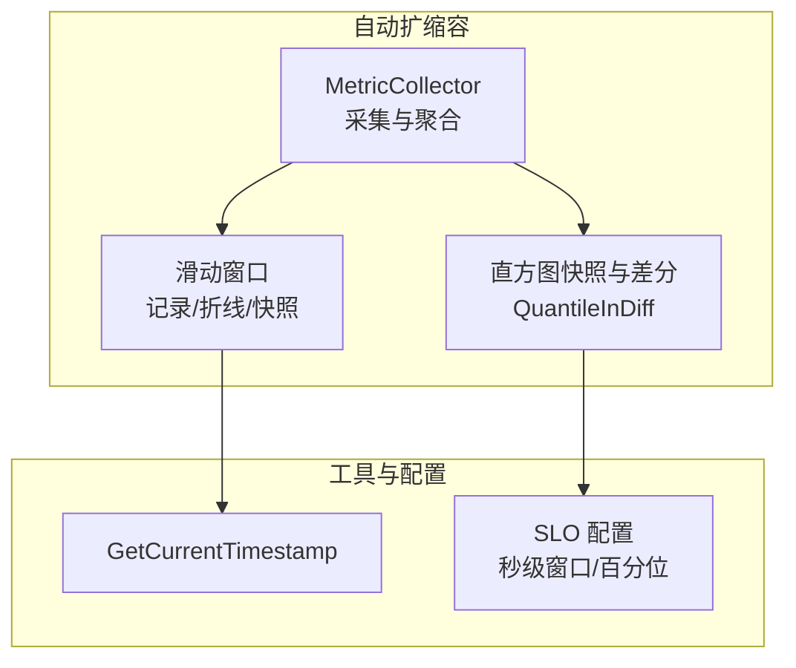
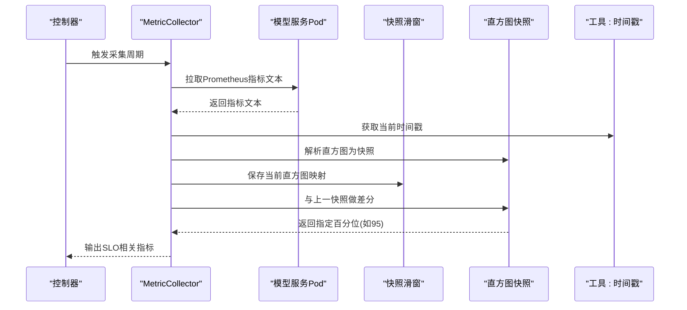
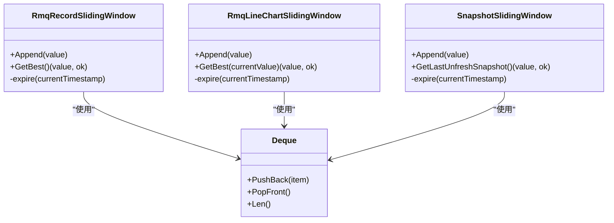
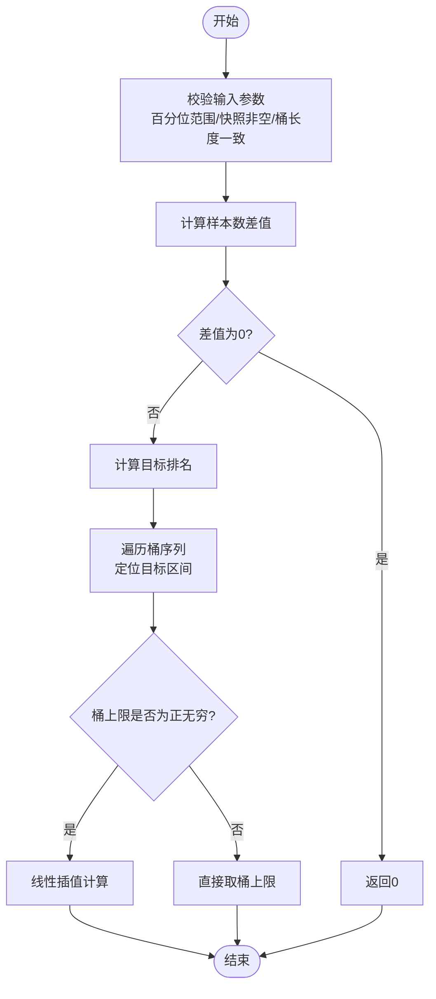
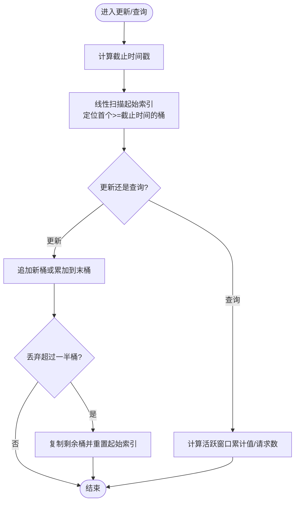
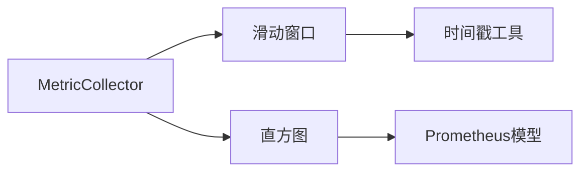

# 数据结构

<cite>
**本文引用的文件列表**
- [sliding_window.go](file://pkg/autoscaler/datastructure/sliding_window.go)
- [sliding_window_test.go](file://pkg/autoscaler/datastructure/sliding_window_test.go)
- [histogram.go](file://pkg/autoscaler/histogram/histogram.go)
- [histogram_test.go](file://pkg/autoscaler/histogram/histogram_test.go)
- [metric_collector.go](file://pkg/autoscaler/autoscaler/metric_collector.go)
- [common.go](file://pkg/autoscaler/util/common.go)
- [settings.go](file://pkg/autoscaler/util/settings.go)
- [token_tracker.go](file://pkg/kthena-router/datastore/token_tracker.go)
</cite>

## 目录
1. [简介](#简介)
2. [项目结构](#项目结构)
3. [核心组件](#核心组件)
4. [架构总览](#架构总览)
5. [详细组件分析](#详细组件分析)
6. [依赖关系分析](#依赖关系分析)
7. [性能与内存特性](#性能与内存特性)
8. [故障排查指南](#故障排查指南)
9. [结论](#结论)
10. [附录：使用示例与最佳实践](#附录使用示例与最佳实践)

## 简介
本文件面向 Kthena 自动扩缩容系统中的两类关键数据结构：滑动窗口（Sliding Window）与直方图（Histogram）。我们将从设计目标、实现细节、数据流、并发与内存管理、性能特征、配置参数、清理策略、典型应用场景与最佳实践等维度进行系统化阐述，并结合代码级图示帮助读者快速理解其在指标聚合、趋势分析与异常检测中的作用。

## 项目结构
本次文档聚焦于以下模块：
- 滑动窗口数据结构：位于 autoscaler/datastructure，支持记录型、折线型（带漂移）与快照型三种窗口，用于时间窗口内的数据更新与统计。
- 直方图数据结构：位于 autoscaler/histogram，负责从 Prometheus 直方图转换为内部快照，并基于“当前-过去”的差分计算百分位数。
- 使用场景：autoscaler/metric_collector 中通过滑动窗口保存历史直方图快照，并用直方图差分计算 SLO 百分位指标；同时 util/settings 提供默认时间窗口与百分位配置。
- 辅助实现：kthena-router 的 token_tracker 展示了另一种滑动窗口思路（按时间桶累积），可作为扩展参考。

**图表来源**
- [metric_collector.go:43-62](file://pkg/autoscaler/autoscaler/metric_collector.go#L43-L62)
- [sliding_window.go:37-237](file://pkg/autoscaler/datastructure/sliding_window.go#L37-L237)
- [histogram.go:27-123](file://pkg/autoscaler/histogram/histogram.go#L27-L123)
- [common.go:25-27](file://pkg/autoscaler/util/common.go#L25-L27)
- [settings.go:19-25](file://pkg/autoscaler/util/settings.go#L19-L25)

**章节来源**
- [metric_collector.go:43-62](file://pkg/autoscaler/autoscaler/metric_collector.go#L43-L62)
- [sliding_window.go:37-237](file://pkg/autoscaler/datastructure/sliding_window.go#L37-L237)
- [histogram.go:27-123](file://pkg/autoscaler/histogram/histogram.go#L27-L123)
- [common.go:25-27](file://pkg/autoscaler/util/common.go#L25-L27)
- [settings.go:19-25](file://pkg/autoscaler/util/settings.go#L19-L25)

## 核心组件
- 滑动窗口（Sliding Window）
  - 记录型最大/最小窗口：维护一个双端队列，按“更好值”规则弹出尾部，保证队首为窗口内最优值。
  - 折线型最大/最小窗口（带漂移）：在记录型基础上引入“漂移值”与“最大漂移时间”，允许在最近一次写入后的一段时间内，将漂移值参与比较，从而对突发变化更敏感。
  - 快照型窗口：保存历史直方图映射，支持获取“未过期”的上一快照，用于差分计算。
- 直方图（Histogram）
  - 将 Prometheus 直方图转换为内部快照（含累计计数与桶上限值），并提供“当前-过去”的差分百分位计算，用于 SLO 趋势分析与异常检测。

**章节来源**
- [sliding_window.go:37-237](file://pkg/autoscaler/datastructure/sliding_window.go#L37-L237)
- [histogram.go:27-123](file://pkg/autoscaler/histogram/histogram.go#L27-L123)

## 架构总览
下图展示了 MetricCollector 如何使用滑动窗口与直方图进行指标采集与 SLO 百分位计算的整体流程。

**图表来源**
- [metric_collector.go:98-129](file://pkg/autoscaler/autoscaler/metric_collector.go#L98-L129)
- [metric_collector.go:131-183](file://pkg/autoscaler/autoscaler/metric_collector.go#L131-L183)
- [metric_collector.go:185-241](file://pkg/autoscaler/autoscaler/metric_collector.go#L185-L241)
- [sliding_window.go:185-237](file://pkg/autoscaler/datastructure/sliding_window.go#L185-L237)
- [histogram.go:46-59](file://pkg/autoscaler/histogram/histogram.go#L46-L59)
- [common.go:25-27](file://pkg/autoscaler/util/common.go#L25-L27)

## 详细组件分析

### 滑动窗口数据结构
滑动窗口分为三类，分别服务于不同的统计需求与性能权衡。

- 记录型最大/最小窗口
  - 设计要点：使用双端队列维护“更好值”的单调栈式结构，确保队首为窗口内最优值；每次 Append 前先过期，再按比较器弹出尾部，最后入队。
  - 时间复杂度：Append 平摊 O(1)，GetBest O(1)。
  - 适用场景：需要在固定时间窗口内快速获取最大/最小值，如峰值响应时间、瞬时负载等。
  - 关键实现位置：[RmqRecordSlidingWindow:37-94](file://pkg/autoscaler/datastructure/sliding_window.go#L37-L94)

- 折线型最大/最小窗口（带漂移）
  - 设计要点：在记录型基础上增加“漂移值”与“最大漂移时间”，允许在最近一次写入后的窗口内，将漂移值参与比较，提升对突发变化的敏感度。
  - 时间复杂度：Append 平摊 O(1)，GetBest O(1)。
  - 适用场景：对突发流量或延迟尖峰更敏感的场景，如突发请求导致的延迟抖动。
  - 关键实现位置：[RmqLineChartSlidingWindow:96-183](file://pkg/autoscaler/datastructure/sliding_window.go#L96-L183)

- 快照型滑动窗口
  - 设计要点：保存历史直方图映射，支持“过期窗口”与“未过期窗口”的区分，用于差分计算。
  - 时间复杂度：Append O(1)，GetLastUnfreshSnapshot O(1)。
  - 适用场景：需要跨时间点对比直方图（如计算 SLO 百分位差分）。
  - 关键实现位置：[SnapshotSlidingWindow:185-237](file://pkg/autoscaler/datastructure/sliding_window.go#L185-L237)

**图表来源**
- [sliding_window.go:37-237](file://pkg/autoscaler/datastructure/sliding_window.go#L37-L237)

**章节来源**
- [sliding_window.go:37-237](file://pkg/autoscaler/datastructure/sliding_window.go#L37-L237)
- [sliding_window_test.go:30-129](file://pkg/autoscaler/datastructure/sliding_window_test.go#L30-L129)
- [sliding_window_test.go:131-249](file://pkg/autoscaler/datastructure/sliding_window_test.go#L131-L249)
- [sliding_window_test.go:264-335](file://pkg/autoscaler/datastructure/sliding_window_test.go#L264-L335)

### 直方图数据结构与百分位差分
- 快照构建
  - 将 Prometheus 直方图转换为内部快照，包含样本总数、样本总和以及按上界排序的桶序列。
  - 关键实现位置：[NewSnapshotOfHistogram:46-59](file://pkg/autoscaler/histogram/histogram.go#L46-L59)

- 差分百分位计算
  - 输入：当前直方图快照、过去直方图快照；输出：指定百分位（如 95）的差分结果。
  - 核心逻辑：计算当前与过去样本数差值，按桶累加计数，定位目标排名区间，必要时进行线性插值。
  - 错误处理：非法百分位、空快照、桶长度不一致、非递增累计计数等情况均会返回错误。
  - 关键实现位置：[QuantileInDiff:61-122](file://pkg/autoscaler/histogram/histogram.go#L61-L122)

**图表来源**
- [histogram.go:61-122](file://pkg/autoscaler/histogram/histogram.go#L61-L122)

**章节来源**
- [histogram.go:27-123](file://pkg/autoscaler/histogram/histogram.go#L27-L123)
- [histogram_test.go:79-145](file://pkg/autoscaler/histogram/histogram_test.go#L79-L145)
- [histogram_test.go:147-232](file://pkg/autoscaler/histogram/histogram_test.go#L147-L232)

### 在自动扩缩容中的应用
- 指标聚合与趋势分析
  - MetricCollector 通过快照滑窗保存历史直方图映射，结合直方图差分计算 SLO 百分位（如 95），用于评估服务 SLI 是否满足 SLO。
  - 参考实现位置：[MetricCollector.UpdateMetrics:98-129](file://pkg/autoscaler/autoscaler/metric_collector.go#L98-L129)、[processPrometheusString:185-241](file://pkg/autoscaler/autoscaler/metric_collector.go#L185-L241)
- 异常检测
  - 结合记录型/折线型滑窗对瞬时指标（如延迟峰值）进行阈值触发；结合直方图差分对长周期趋势进行异常识别。
- 配置参数
  - 默认时间窗口与百分位由 util/settings 提供，便于统一管理。
  - 参考实现位置：[settings.go:19-25](file://pkg/autoscaler/util/settings.go#L19-L25)

**章节来源**
- [metric_collector.go:98-129](file://pkg/autoscaler/autoscaler/metric_collector.go#L98-L129)
- [metric_collector.go:185-241](file://pkg/autoscaler/autoscaler/metric_collector.go#L185-L241)
- [settings.go:19-25](file://pkg/autoscaler/util/settings.go#L19-L25)

### 另一种滑动窗口实现：按时间桶的令牌追踪
- 设计思想
  - 以时间桶为单位维护累积值与请求数，通过“起始索引”与“截断”策略控制内存占用；当过半桶被丢弃时进行紧凑化复制，避免内存膨胀。
- 关键点
  - 过期清理：线性扫描起始索引，定位首个不早于截止时间的桶。
  - 紧凑化：当丢弃超过一半桶时，复制剩余桶并重置起始索引，同时调整累积值基线。
  - 并发访问：读写锁保护共享状态，读多写少场景下读锁开销低。
- 参考实现位置：[token_tracker.go:112-156](file://pkg/kthena-router/datastore/token_tracker.go#L112-L156)、[token_tracker.go:158-192](file://pkg/kthena-router/datastore/token_tracker.go#L158-L192)

**图表来源**
- [token_tracker.go:112-156](file://pkg/kthena-router/datastore/token_tracker.go#L112-L156)
- [token_tracker.go:158-192](file://pkg/kthena-router/datastore/token_tracker.go#L158-L192)

**章节来源**
- [token_tracker.go:112-156](file://pkg/kthena-router/datastore/token_tracker.go#L112-L156)
- [token_tracker.go:158-192](file://pkg/kthena-router/datastore/token_tracker.go#L158-L192)

## 依赖关系分析
- 组件耦合
  - MetricCollector 依赖滑动窗口与直方图模块，用于保存历史快照与计算差分百分位。
  - 滑动窗口依赖 util 时间戳工具，保证时间一致性。
- 外部依赖
  - 直方图解析依赖 Prometheus 客户端模型类型。
- 循环依赖
  - 未发现循环依赖，模块边界清晰。

**图表来源**
- [metric_collector.go:31-33](file://pkg/autoscaler/autoscaler/metric_collector.go#L31-L33)
- [sliding_window.go:19-22](file://pkg/autoscaler/datastructure/sliding_window.go#L19-L22)
- [histogram.go:19-25](file://pkg/autoscaler/histogram/histogram.go#L19-L25)

**章节来源**
- [metric_collector.go:31-33](file://pkg/autoscaler/autoscaler/metric_collector.go#L31-L33)
- [sliding_window.go:19-22](file://pkg/autoscaler/datastructure/sliding_window.go#L19-L22)
- [histogram.go:19-25](file://pkg/autoscaler/histogram/histogram.go#L19-L25)

## 性能与内存特性
- 时间复杂度
  - 滑动窗口：Append 平摊 O(1)，GetBest/快照查询 O(1)。
  - 直方图差分：遍历桶序列，整体 O(B)，B 为桶数量。
  - 令牌追踪：更新/查询平均 O(1)，紧凑化复制 O(B_u)。
- 内存管理
  - 滑动窗口：双端队列按需弹出过期元素，空间与有效元素数量线性相关。
  - 直方图：快照仅保存桶与累计计数，内存与桶数量线性相关。
  - 令牌追踪：紧凑化策略避免长期累积导致的内存膨胀。
- 并发安全
  - 滑动窗口：未见显式锁，适合单线程或外部同步；令牌追踪使用读写锁。
- 清理策略
  - 滑动窗口：按 TTL 过期队首元素；快照滑窗同时考虑“未过期”与“过期”窗口。
  - 令牌追踪：按截止时间线性扫描并修剪，必要时紧凑化。

**章节来源**
- [sliding_window.go:66-94](file://pkg/autoscaler/datastructure/sliding_window.go#L66-L94)
- [sliding_window.go:136-183](file://pkg/autoscaler/datastructure/sliding_window.go#L136-L183)
- [sliding_window.go:201-237](file://pkg/autoscaler/datastructure/sliding_window.go#L201-L237)
- [token_tracker.go:112-156](file://pkg/kthena-router/datastore/token_tracker.go#L112-L156)

## 故障排查指南
- 直方图差分报错
  - 常见原因：百分位不在 [1,100]、快照为空、桶长度不一致、累计计数非递增、样本数差值为负。
  - 排查步骤：确认输入快照是否来自同一直方图定义；检查采样周期与 TTL 设置；验证 Prometheus 指标稳定性。
  - 参考实现位置：[QuantileInDiff 错误分支:61-122](file://pkg/autoscaler/histogram/histogram.go#L61-L122)
- 滑动窗口无结果
  - 常见原因：TTL 为 0 或已过期；时间戳函数异常。
  - 排查步骤：检查 TTL 配置；确认时间源一致性；查看单元测试中对零 TTL 的行为。
  - 参考实现位置：[Record/LineChart/快照滑窗 GetBest:87-94](file://pkg/autoscaler/datastructure/sliding_window.go#L87-L94)、[快照滑窗 GetLastUnfreshSnapshot:222-236](file://pkg/autoscaler/datastructure/sliding_window.go#L222-L236)
- 令牌追踪内存增长
  - 常见原因：长时间无紧凑化触发；窗口过大。
  - 排查步骤：缩短窗口大小；观察紧凑化触发条件；监控内存使用曲线。
  - 参考实现位置：[pruneExpiredBuckets:118-155](file://pkg/kthena-router/datastore/token_tracker.go#L118-L155)

**章节来源**
- [histogram.go:61-122](file://pkg/autoscaler/histogram/histogram.go#L61-L122)
- [sliding_window.go:87-94](file://pkg/autoscaler/datastructure/sliding_window.go#L87-L94)
- [sliding_window.go:222-236](file://pkg/autoscaler/datastructure/sliding_window.go#L222-L236)
- [token_tracker.go:118-155](file://pkg/kthena-router/datastore/token_tracker.go#L118-L155)

## 结论
Kthena 的自动扩缩容数据结构围绕“时间窗口内的高效统计”与“直方图差分的稳健计算”展开。滑动窗口提供了多种模式以适配不同场景（瞬时峰值 vs. 趋势变化），而直方图快照与差分则为 SLO 百分位的稳定计算提供了基础。配合合理的配置参数与清理策略，可在高并发与长周期场景下保持良好的性能与资源占用。

## 附录：使用示例与最佳实践
- 使用示例
  - 快照滑窗用于保存直方图映射并进行差分百分位计算：参考 [MetricCollector.UpdateMetrics:98-129](file://pkg/autoscaler/autoscaler/metric_collector.go#L98-L129) 与 [processPrometheusString:185-241](file://pkg/autoscaler/autoscaler/metric_collector.go#L185-L241)。
  - 单元测试展示了记录型/折线型/快照型滑窗的行为与边界条件：参考 [sliding_window_test.go:30-129](file://pkg/autoscaler/datastructure/sliding_window_test.go#L30-L129)、[sliding_window_test.go:131-249](file://pkg/autoscaler/datastructure/sliding_window_test.go#L131-L249)、[sliding_window_test.go:264-335](file://pkg/autoscaler/datastructure/sliding_window_test.go#L264-L335)。
  - 直方图差分测试覆盖了多种边界与错误场景：参考 [histogram_test.go:79-145](file://pkg/autoscaler/histogram/histogram_test.go#L79-L145)、[histogram_test.go:147-232](file://pkg/autoscaler/histogram/histogram_test.go#L147-L232)。
- 最佳实践
  - 合理设置 TTL 与窗口大小：根据业务波动与评估周期选择合适的时间窗口，避免过短导致抖动，过长导致滞后。
  - 优先使用直方图差分：相比原始指标，差分能更好地反映相对变化，减少基准漂移影响。
  - 监控与告警：对直方图桶数量、滑窗长度、紧凑化频率进行观测，及时发现异常。
  - 并发与锁：在需要并发访问的场景（如令牌追踪）使用读写锁；在单线程上下文使用滑动窗口时注意外部同步。
- 性能优化建议
  - 控制桶数量：直方图桶过多会增加差分遍历成本，可通过 Prometheus 配置或后处理策略优化。
  - 避免频繁重算：利用快照滑窗缓存上一快照，减少重复解析与计算。
  - 紧凑化策略：令牌追踪的紧凑化可显著降低内存占用，建议在丢弃超过一半桶时触发。

**章节来源**
- [metric_collector.go:98-129](file://pkg/autoscaler/autoscaler/metric_collector.go#L98-L129)
- [metric_collector.go:185-241](file://pkg/autoscaler/autoscaler/metric_collector.go#L185-L241)
- [sliding_window_test.go:30-129](file://pkg/autoscaler/datastructure/sliding_window_test.go#L30-L129)
- [sliding_window_test.go:131-249](file://pkg/autoscaler/datastructure/sliding_window_test.go#L131-L249)
- [sliding_window_test.go:264-335](file://pkg/autoscaler/datastructure/sliding_window_test.go#L264-L335)
- [histogram_test.go:79-145](file://pkg/autoscaler/histogram/histogram_test.go#L79-L145)
- [histogram_test.go:147-232](file://pkg/autoscaler/histogram/histogram_test.go#L147-L232)
- [settings.go:19-25](file://pkg/autoscaler/util/settings.go#L19-L25)