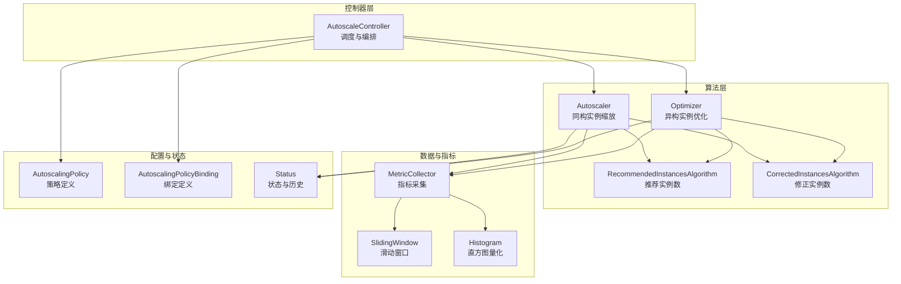
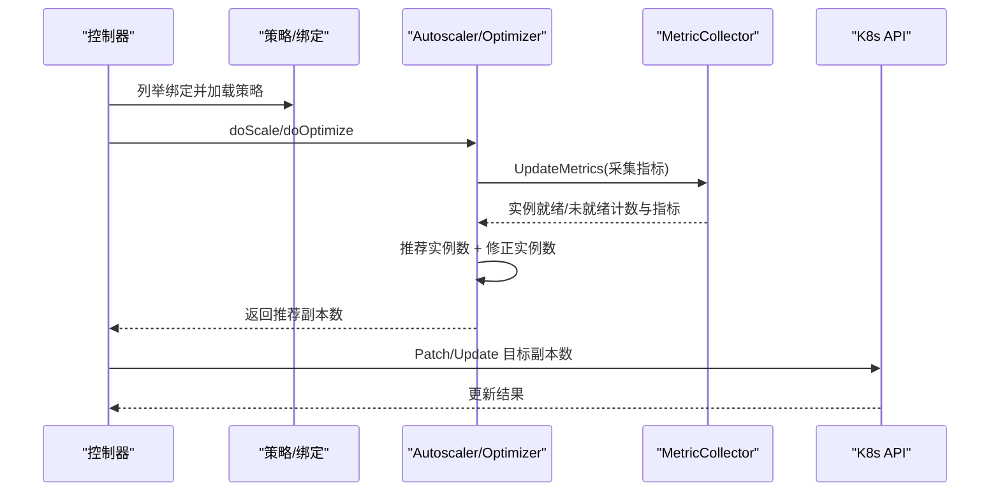
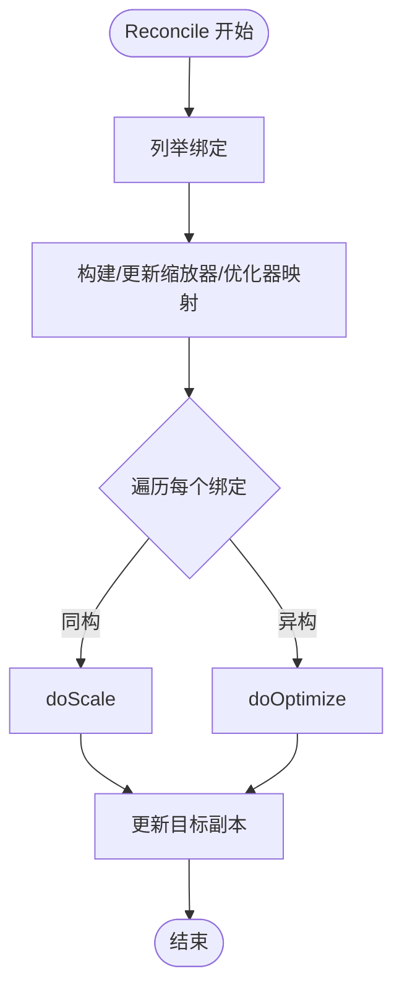
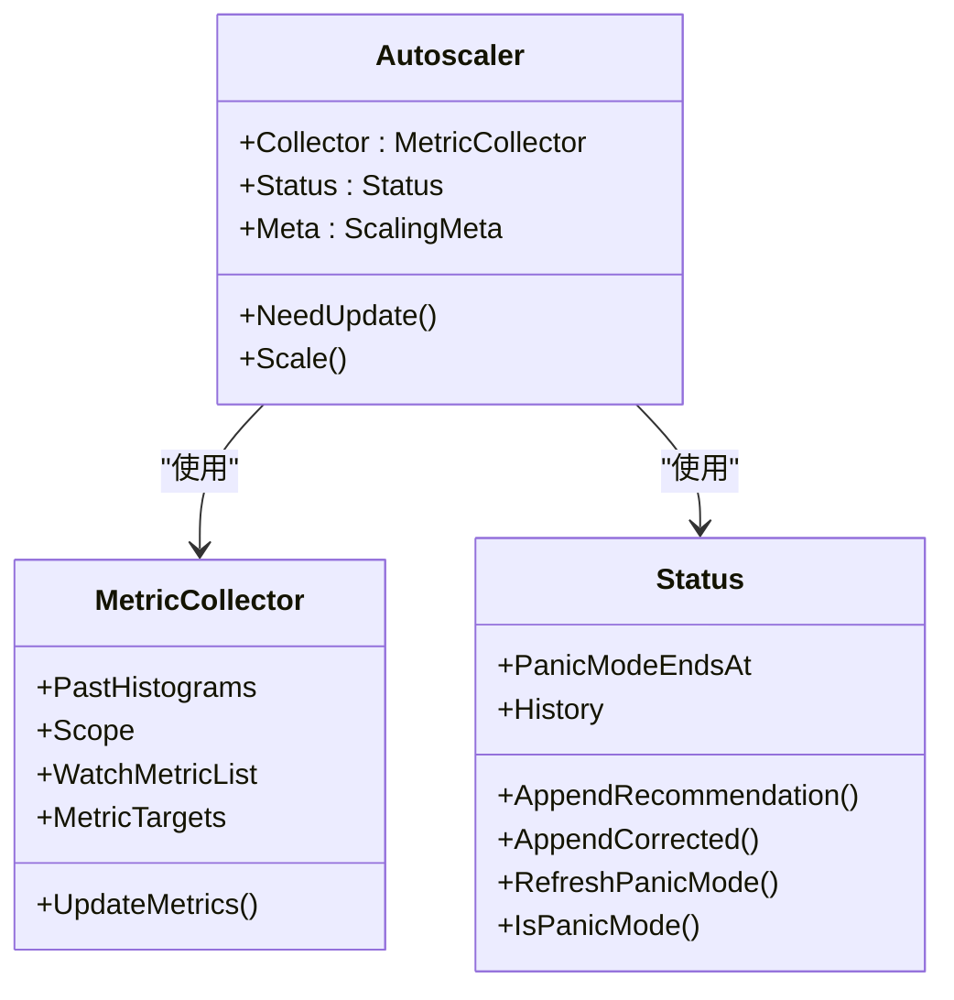
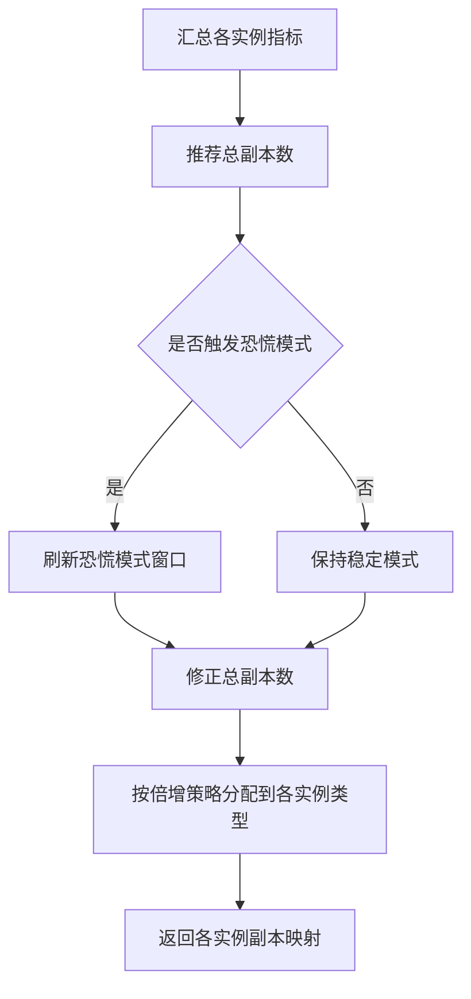
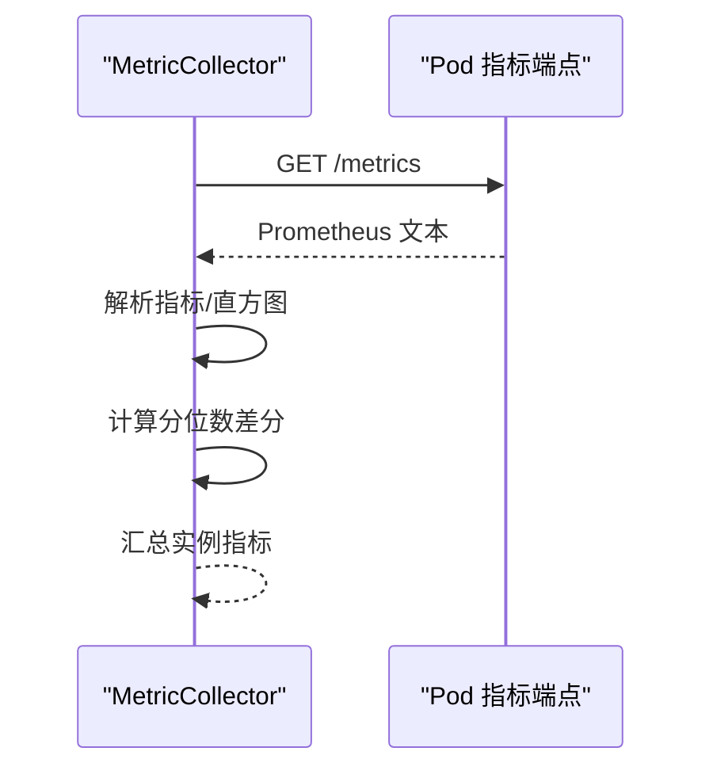
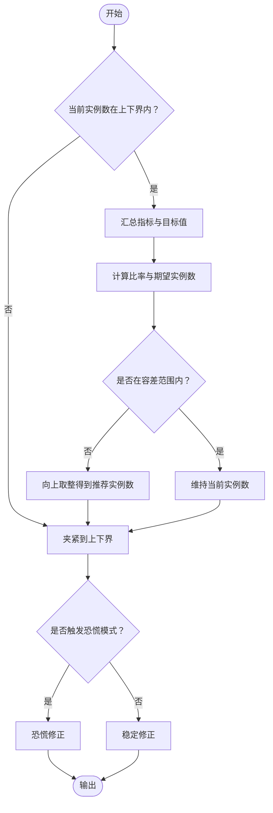
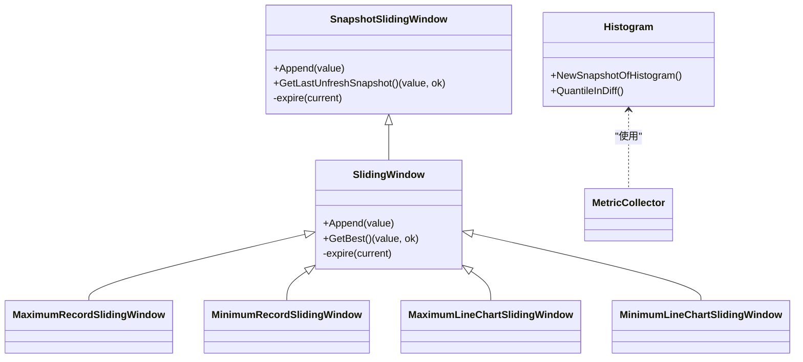
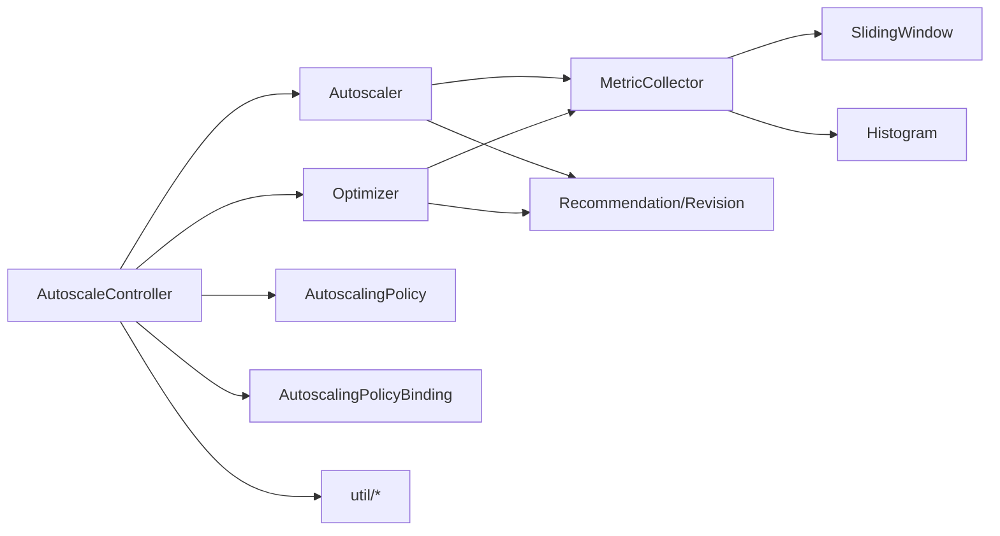

# 自动扩缩容算法

<cite>
**本文引用的文件**
- [autoscale_controller.go](file://pkg/autoscaler/controller/autoscale_controller.go)
- [scaler.go](file://pkg/autoscaler/autoscaler/scaler.go)
- [optimizer.go](file://pkg/autoscaler/autoscaler/optimizer.go)
- [metric_collector.go](file://pkg/autoscaler/autoscaler/metric_collector.go)
- [status.go](file://pkg/autoscaler/autoscaler/status.go)
- [recommendation.go](file://pkg/autoscaler/algorithm/recommendation.go)
- [revision.go](file://pkg/autoscaler/algorithm/revision.go)
- [sliding_window.go](file://pkg/autoscaler/datastructure/sliding_window.go)
- [histogram.go](file://pkg/autoscaler/histogram/histogram.go)
- [settings.go](file://pkg/autoscaler/util/settings.go)
- [client.go](file://pkg/autoscaler/util/client.go)
- [autoscalingpolicy_types.go](file://pkg/apis/workload/v1alpha1/autoscalingpolicy_types.go)
- [autoscaler.mdx](file://docs/kthena/docs/architecture/autoscaler.mdx)
- [autoscaler.md](file://docs/kthena/docs/user-guide/autoscaler.md)
- [recommendation_test.go](file://pkg/autoscaler/algorithm/recommendation_test.go)
- [sliding_window_test.go](file://pkg/autoscaler/datastructure/sliding_window_test.go)
</cite>

## 目录
1. [简介](#简介)
2. [项目结构](#项目结构)
3. [核心组件](#核心组件)
4. [架构总览](#架构总览)
5. [详细组件分析](#详细组件分析)
6. [依赖分析](#依赖分析)
7. [性能考量](#性能考量)
8. [故障排查指南](#故障排查指南)
9. [结论](#结论)
10. [附录](#附录)

## 简介
本文件系统性阐述 Kthena 自动扩缩容算法的实现与使用方法，覆盖指标采集、算法计算、扩缩容决策、策略配置、状态管理、错误处理与回滚、以及效果评估与优化建议。文档面向不同技术背景读者，既提供高层概览也给出代码级细节与可视化图示。

## 项目结构
Kthena 的扩缩容能力由控制器、算法模块、数据结构与工具集组成，核心位于 pkg/autoscaler 目录，并通过 CRD 定义策略与绑定关系。

图表来源
- [autoscale_controller.go:47-96](file://pkg/autoscaler/controller/autoscale_controller.go#L47-L96)
- [scaler.go:28-53](file://pkg/autoscaler/autoscaler/scaler.go#L28-L53)
- [optimizer.go:29-144](file://pkg/autoscaler/autoscaler/optimizer.go#L29-L144)
- [metric_collector.go:43-62](file://pkg/autoscaler/autoscaler/metric_collector.go#L43-L62)
- [sliding_window.go:37-183](file://pkg/autoscaler/datastructure/sliding_window.go#L37-L183)
- [histogram.go:27-59](file://pkg/autoscaler/histogram/histogram.go#L27-L59)
- [autoscalingpolicy_types.go:24-40](file://pkg/apis/workload/v1alpha1/autoscalingpolicy_types.go#L24-L40)

章节来源
- [autoscale_controller.go:47-120](file://pkg/autoscaler/controller/autoscale_controller.go#L47-L120)
- [autoscalingpolicy_types.go:24-124](file://pkg/apis/workload/v1alpha1/autoscalingpolicy_types.go#L24-L124)

## 核心组件
- 扩缩容控制器：负责周期性拉取策略与绑定，按目标类型（同构/异构）调度缩放或优化流程，更新目标副本数。
- 同构缩放器（Autoscaler）：针对单一实例类型的稳定与紧急模式缩放，结合容忍度与策略窗口进行决策。
- 异构优化器（Optimizer）：在多实例类型间做成本优化分配，采用倍增策略生成可扩展的扩容批次序列。
- 指标采集器（MetricCollector）：从 Pod 指标端点抓取 Prometheus 文本格式指标，对直方图做分位数差分，汇总实例指标。
- 历史与状态（Status）：维护恐慌模式、稳定/紧急修正窗口的历史记录，用于约束每周期缩放幅度。
- 算法模块：推荐实例数算法与修正实例数算法，分别负责“应有多少”和“能加多少/减多少”。

章节来源
- [scaler.go:28-107](file://pkg/autoscaler/autoscaler/scaler.go#L28-L107)
- [optimizer.go:29-208](file://pkg/autoscaler/autoscaler/optimizer.go#L29-L208)
- [metric_collector.go:43-250](file://pkg/autoscaler/autoscaler/metric_collector.go#L43-L250)
- [status.go:26-87](file://pkg/autoscaler/autoscaler/status.go#L26-L87)
- [recommendation.go:27-171](file://pkg/autoscaler/algorithm/recommendation.go#L27-L171)
- [revision.go:26-121](file://pkg/autoscaler/algorithm/revision.go#L26-L121)

## 架构总览
扩缩容控制器以固定周期运行，遍历所有绑定，区分同构与异构目标，分别调用 Autoscaler 或 Optimizer 计算推荐副本数，并根据策略进行修正后写回目标资源。

图表来源
- [autoscale_controller.go:124-171](file://pkg/autoscaler/controller/autoscale_controller.go#L124-L171)
- [scaler.go:67-107](file://pkg/autoscaler/autoscaler/scaler.go#L67-L107)
- [optimizer.go:151-208](file://pkg/autoscaler/autoscaler/optimizer.go#L151-L208)
- [metric_collector.go:98-129](file://pkg/autoscaler/autoscaler/metric_collector.go#L98-L129)

## 详细组件分析

### 控制器与调度
- 负责启动 Informer、等待缓存同步、周期性 Reconcile。
- Reconcile 遍历绑定，构建或更新 Autoscaler/Optimizer 实例映射，按目标类型调度缩放或优化。
- 对于同构目标，直接更新目标副本；对于异构目标，按优化结果分别更新各实例类型的副本。

图表来源
- [autoscale_controller.go:124-171](file://pkg/autoscaler/controller/autoscale_controller.go#L124-L171)
- [autoscale_controller.go:251-348](file://pkg/autoscaler/controller/autoscale_controller.go#L251-L348)

章节来源
- [autoscale_controller.go:98-171](file://pkg/autoscaler/controller/autoscale_controller.go#L98-L171)
- [autoscale_controller.go:173-374](file://pkg/autoscaler/controller/autoscale_controller.go#L173-L374)

### 同构实例缩放（Autoscaler）
- 组装 MetricCollector、Status 与元信息（含策略与绑定版本），周期性采集指标并计算推荐副本。
- 支持稳定模式与紧急模式（Panic），通过历史窗口限制每周期绝对/相对缩放幅度。

图表来源
- [scaler.go:28-53](file://pkg/autoscaler/autoscaler/scaler.go#L28-L53)
- [metric_collector.go:43-62](file://pkg/autoscaler/autoscaler/metric_collector.go#L43-L62)
- [status.go:26-64](file://pkg/autoscaler/autoscaler/status.go#L26-L64)

章节来源
- [scaler.go:40-107](file://pkg/autoscaler/autoscaler/scaler.go#L40-L107)

### 异构实例优化（Optimizer）
- 针对多实例类型的成本优化，先用推荐算法得到总推荐副本，再按倍增策略将总量分配到各实例类型。
- 成本扩展率控制“下一批次成本膨胀比例”，排序后形成可扩展的扩容序列，优先选择更低成本批次。

图表来源
- [optimizer.go:151-208](file://pkg/autoscaler/autoscaler/optimizer.go#L151-L208)
- [autoscaler.mdx:44-57](file://docs/kthena/docs/architecture/autoscaler.mdx#L44-L57)

章节来源
- [optimizer.go:70-144](file://pkg/autoscaler/autoscaler/optimizer.go#L70-L144)
- [optimizer.go:151-208](file://pkg/autoscaler/autoscaler/optimizer.go#L151-L208)

### 指标采集与聚合
- 通过标签选择目标 Pod，逐个访问指标端点，解析 Prometheus 文本格式。
- 对直方图指标计算分位数差分（默认 95 分位），并补齐缺失指标为 0，保证多实例平均值计算稳定。

图表来源
- [metric_collector.go:131-183](file://pkg/autoscaler/autoscaler/metric_collector.go#L131-L183)
- [metric_collector.go:185-241](file://pkg/autoscaler/autoscaler/metric_collector.go#L185-L241)

章节来源
- [metric_collector.go:98-129](file://pkg/autoscaler/autoscaler/metric_collector.go#L98-L129)
- [metric_collector.go:185-241](file://pkg/autoscaler/autoscaler/metric_collector.go#L185-L241)

### 推荐与修正算法
- 推荐实例数算法：支持外部指标与单实例指标，综合多个指标取最大推荐值；考虑未就绪实例与缺失指标的保守估计。
- 修正实例数算法：区分稳定与恐慌模式，基于历史窗口施加绝对/相对约束，避免过度震荡。

图表来源
- [recommendation.go:38-75](file://pkg/autoscaler/algorithm/recommendation.go#L38-L75)
- [recommendation.go:100-150](file://pkg/autoscaler/algorithm/recommendation.go#L100-L150)
- [revision.go:44-52](file://pkg/autoscaler/algorithm/revision.go#L44-L52)
- [revision.go:64-121](file://pkg/autoscaler/algorithm/revision.go#L64-L121)

章节来源
- [recommendation.go:27-171](file://pkg/autoscaler/algorithm/recommendation.go#L27-L171)
- [revision.go:26-121](file://pkg/autoscaler/algorithm/revision.go#L26-L121)

### 滑动窗口与直方图统计
- 滑动窗口：支持最大/最小记录型与折线图型（带漂移值），按 TTL 过期，保证时间窗口内的最优/最差值。
- 快照滑窗：保留过期阈值外的最近一次“不新鲜”快照，用于跨周期直方图差分。
- 直方图：对 Prometheus 直方图计算指定百分位差分，支持桶数量不一致时的插值与边界处理。

图表来源
- [sliding_window.go:37-183](file://pkg/autoscaler/datastructure/sliding_window.go#L37-L183)
- [sliding_window.go:185-237](file://pkg/autoscaler/datastructure/sliding_window.go#L185-L237)
- [histogram.go:46-122](file://pkg/autoscaler/histogram/histogram.go#L46-L122)

章节来源
- [sliding_window.go:37-237](file://pkg/autoscaler/datastructure/sliding_window.go#L37-L237)
- [histogram.go:27-122](file://pkg/autoscaler/histogram/histogram.go#L27-L122)

### 策略配置与触发条件
- 策略（AutoscalingPolicy）定义容忍度、监控指标与行为（稳定/恐慌策略、稳定窗口、周期、选择策略等）。
- 绑定（AutoscalingPolicyBinding）将策略连接到目标，支持同构与异构两种模式，分别设置最小/最大副本与角色级目标。

章节来源
- [autoscalingpolicy_types.go:24-124](file://pkg/apis/workload/v1alpha1/autoscalingpolicy_types.go#L24-L124)
- [autoscaler.md:19-118](file://docs/kthena/docs/user-guide/autoscaler.md#L19-L118)

## 依赖分析
- 控制器依赖策略与绑定列表器、K8s 与自定义资源客户端，以及 Pod 列表器。
- 缩放器/优化器依赖 MetricCollector、Status、算法模块与 util 工具。
- 数据结构与直方图为指标处理提供基础能力。

图表来源
- [autoscale_controller.go:47-96](file://pkg/autoscaler/controller/autoscale_controller.go#L47-L96)
- [scaler.go:28-53](file://pkg/autoscaler/autoscaler/scaler.go#L28-L53)
- [optimizer.go:29-144](file://pkg/autoscaler/autoscaler/optimizer.go#L29-L144)
- [metric_collector.go:43-62](file://pkg/autoscaler/autoscaler/metric_collector.go#L43-L62)

章节来源
- [autoscale_controller.go:19-45](file://pkg/autoscaler/controller/autoscale_controller.go#L19-L45)
- [client.go:19-33](file://pkg/autoscaler/util/client.go#L19-L33)

## 性能考量
- 采集超时与周期：默认采集超时与同步周期可调，避免长尾请求阻塞主循环。
- 指标解析与直方图差分：对直方图进行分位数差分，减少噪声影响，提高稳定性。
- 历史窗口与约束：通过稳定/恐慌窗口限制每周期缩放幅度，降低抖动。
- 测试验证：提供滑动窗口与推荐算法的单元测试，确保边界与正确性。

章节来源
- [settings.go:19-25](file://pkg/autoscaler/util/settings.go#L19-L25)
- [sliding_window_test.go:30-335](file://pkg/autoscaler/datastructure/sliding_window_test.go#L30-L335)
- [recommendation_test.go:26-461](file://pkg/autoscaler/algorithm/recommendation_test.go#L26-L461)

## 故障排查指南
- 指标不可达：检查 Pod 标签选择器、端口与路径、网络连通性；查看控制器日志中的错误提示。
- 未就绪/失败实例：控制器会跳过失败实例并警告，需检查 Pod 状态与容器重启情况。
- 无可用指标：当实例指标为空时，算法可能跳过本次缩放，需确认业务指标暴露与名称匹配。
- 恐慌模式误触发：调整恐慌阈值与保持时长，避免突发流量导致过度扩容。
- 回滚与重试：控制器按策略/绑定版本判断是否重建缩放器/优化器，若配置变更可自动更新。

章节来源
- [metric_collector.go:100-129](file://pkg/autoscaler/autoscaler/metric_collector.go#L100-L129)
- [metric_collector.go:131-183](file://pkg/autoscaler/autoscaler/metric_collector.go#L131-L183)
- [status.go:77-87](file://pkg/autoscaler/autoscaler/status.go#L77-L87)
- [autoscale_controller.go:275-314](file://pkg/autoscaler/controller/autoscale_controller.go#L275-L314)

## 结论
Kthena 自动扩缩容通过“推荐—修正—写回”的闭环，结合滑动窗口与直方图分位数差分，在保证业务 SLO 的前提下优化资源利用率。同构与异构两种模式满足不同部署形态的需求，配合完善的策略配置与状态管理，能够有效应对动态负载变化。

## 附录

### 数学模型与参数
- 推荐实例数：基于指标与目标值计算期望实例数，考虑容差与未就绪/缺失实例的保守估计。
- 修正实例数：稳定模式下依据历史窗口施加绝对/相对约束；恐慌模式下放宽上限并强制不低于当前实例数。
- 倍增策略：按成本扩展率生成扩容批次序列，优先选择低成本批次，兼顾冷启动复用。

章节来源
- [recommendation.go:38-150](file://pkg/autoscaler/algorithm/recommendation.go#L38-L150)
- [revision.go:44-121](file://pkg/autoscaler/algorithm/revision.go#L44-L121)
- [optimizer.go:70-114](file://pkg/autoscaler/autoscaler/optimizer.go#L70-L114)
- [autoscaler.mdx:44-57](file://docs/kthena/docs/architecture/autoscaler.mdx#L44-L57)

### 参数调优建议
- 容忍度：根据业务波动性设置，避免频繁缩放（thrashing）。
- 稳定窗口：上/下游差异较大时适当延长，减少误判。
- 恐慌阈值与保持时长：突发流量场景适度下调阈值、延长保持时长。
- 成本扩展率：在性能与成本之间权衡，较低值更保守，较高值更灵活。

章节来源
- [autoscalingpolicy_types.go:50-124](file://pkg/apis/workload/v1alpha1/autoscalingpolicy_types.go#L50-L124)
- [autoscaler.md:28-46](file://docs/kthena/docs/user-guide/autoscaler.md#L28-L46)