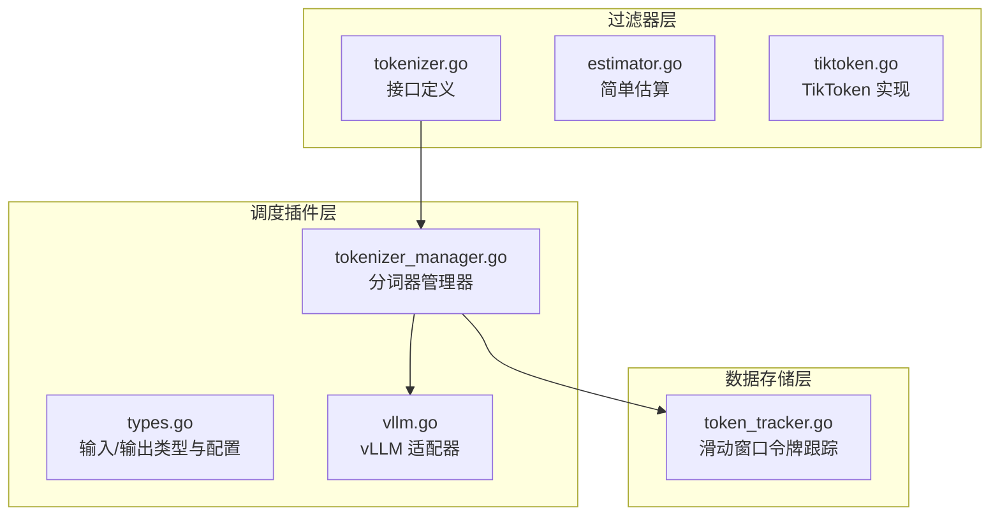
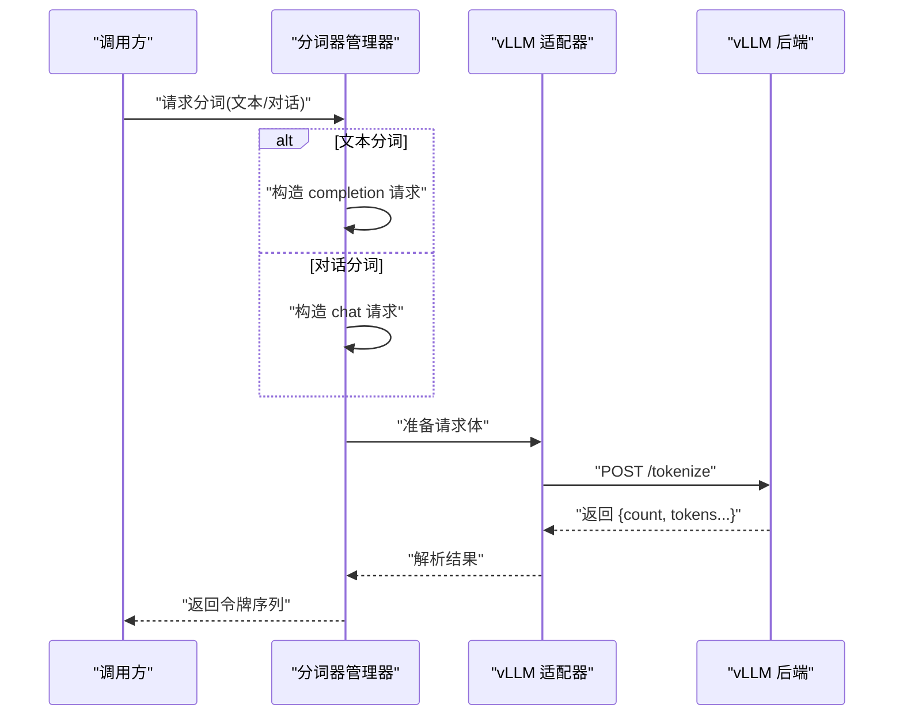
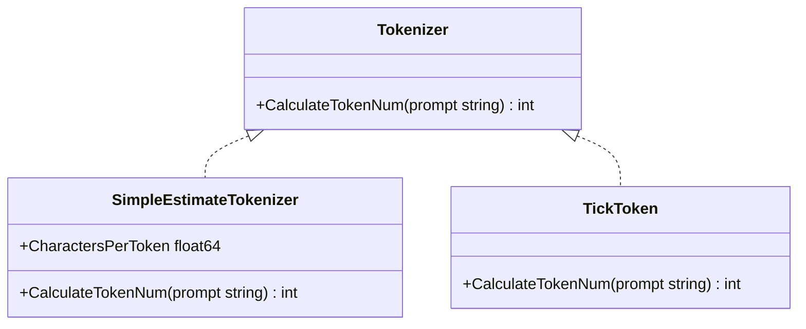
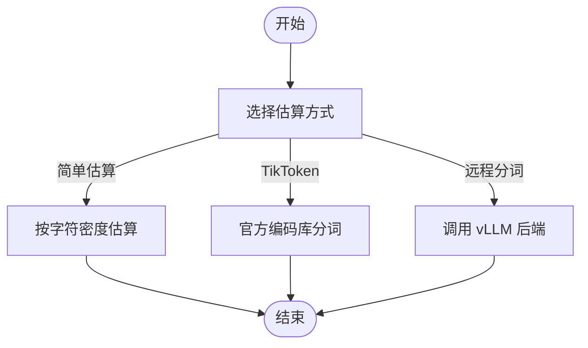
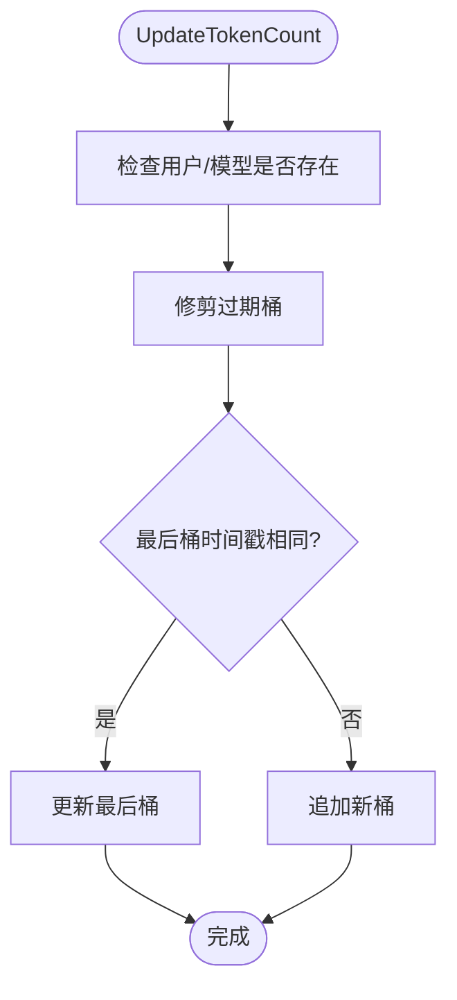
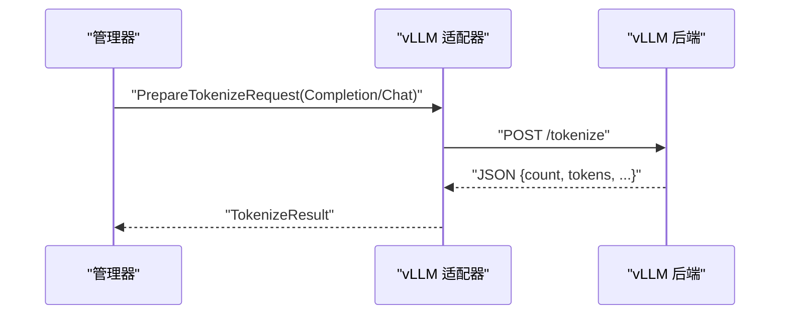
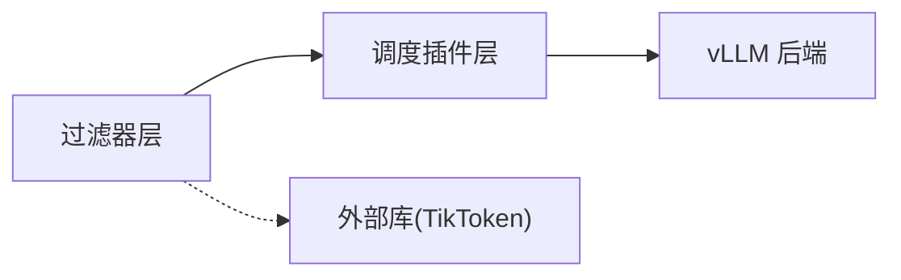

# 分词与令牌化系统

<cite>
**本文引用的文件**
- [tokenizer.go](file://pkg/kthena-router/filters/tokenizer/tokenizer.go)
- [estimator.go](file://pkg/kthena-router/filters/tokenizer/estimator.go)
- [tiktoken.go](file://pkg/kthena-router/filters/tokenizer/tiktoken.go)
- [tokenizer_manager.go](file://pkg/kthena-router/scheduler/plugins/tokenization/tokenizer_manager.go)
- [types.go](file://pkg/kthena-router/scheduler/plugins/tokenization/types.go)
- [vllm.go](file://pkg/kthena-router/scheduler/plugins/tokenization/vllm.go)
- [token_tracker.go](file://pkg/kthena-router/datastore/token_tracker.go)
</cite>

## 目录
1. [简介](#简介)
2. [项目结构](#项目结构)
3. [核心组件](#核心组件)
4. [架构总览](#架构总览)
5. [详细组件分析](#详细组件分析)
6. [依赖关系分析](#依赖关系分析)
7. [性能考虑](#性能考虑)
8. [故障排查指南](#故障排查指南)
9. [结论](#结论)
10. [附录](#附录)

## 简介
本文件面向 Kthena 的分词与令牌化系统，系统目标是为路由调度与资源分配提供准确的令牌估算与实时分词能力。系统支持两类分词路径：
- 本地估算：通过字符密度估算令牌数量，适用于快速预估与低开销场景。
- 远程分词：对接 vLLM 推理后端，进行真实分词与令牌序列生成，确保与模型一致的令牌计数。

系统还提供令牌使用跟踪（TokenTracker），用于按用户/模型维度在滑动窗口内统计输入输出令牌权重，支撑公平性与限流策略。

## 项目结构
围绕分词与令牌化的代码主要分布在以下模块：
- 过滤器层（估算与本地分词）：filters/tokenizer
- 调度插件层（远程分词与适配）：scheduler/plugins/tokenization
- 数据存储层（令牌使用跟踪）：datastore



**图表来源**
- [tokenizer.go:19-21](file://pkg/kthena-router/filters/tokenizer/tokenizer.go#L19-L21)
- [estimator.go:25-33](file://pkg/kthena-router/filters/tokenizer/estimator.go#L25-L33)
- [tiktoken.go:24-35](file://pkg/kthena-router/filters/tokenizer/tiktoken.go#L24-L35)
- [tokenizer_manager.go:31-44](file://pkg/kthena-router/scheduler/plugins/tokenization/tokenizer_manager.go#L31-L44)
- [types.go:21-50](file://pkg/kthena-router/scheduler/plugins/tokenization/types.go#L21-L50)
- [vllm.go:24-39](file://pkg/kthena-router/scheduler/plugins/tokenization/vllm.go#L24-L39)
- [token_tracker.go:34-64](file://pkg/kthena-router/datastore/token_tracker.go#L34-L64)

**章节来源**
- [tokenizer.go:19-21](file://pkg/kthena-router/filters/tokenizer/tokenizer.go#L19-L21)
- [estimator.go:25-33](file://pkg/kthena-router/filters/tokenizer/estimator.go#L25-L33)
- [tiktoken.go:24-35](file://pkg/kthena-router/filters/tokenizer/tiktoken.go#L24-L35)
- [tokenizer_manager.go:31-44](file://pkg/kthena-router/scheduler/plugins/tokenization/tokenizer_manager.go#L31-L44)
- [types.go:21-50](file://pkg/kthena-router/scheduler/plugins/tokenization/types.go#L21-L50)
- [vllm.go:24-39](file://pkg/kthena-router/scheduler/plugins/tokenization/vllm.go#L24-L39)
- [token_tracker.go:34-64](file://pkg/kthena-router/datastore/token_tracker.go#L34-L64)

## 核心组件
- 分词接口与实现
  - 接口定义：统一的分词能力抽象，便于扩展不同实现。
  - 简单估算：基于字符密度的快速估算，适合预估与快速路径。
  - TikToken：基于官方编码库的精确分词，适合高精度场景。
- 远程分词与适配
  - 分词器管理器：从可用 Pod 随机选择后端，构造远程分词器。
  - vLLM 适配器：封装请求体、响应解析与端点路径。
- 令牌使用跟踪
  - 滑动窗口令牌跟踪器：按用户/模型维度统计令牌与请求数量，支持权重与并发安全。

**章节来源**
- [tokenizer.go:19-21](file://pkg/kthena-router/filters/tokenizer/tokenizer.go#L19-L21)
- [estimator.go:25-44](file://pkg/kthena-router/filters/tokenizer/estimator.go#L25-L44)
- [tiktoken.go:24-35](file://pkg/kthena-router/filters/tokenizer/tiktoken.go#L24-L35)
- [tokenizer_manager.go:46-87](file://pkg/kthena-router/scheduler/plugins/tokenization/tokenizer_manager.go#L46-L87)
- [vllm.go:24-84](file://pkg/kthena-router/scheduler/plugins/tokenization/vllm.go#L24-L84)
- [token_tracker.go:56-110](file://pkg/kthena-router/datastore/token_tracker.go#L56-L110)

## 架构总览
整体流程分为两条主线：
- 估算路径：过滤器层直接估算令牌数量，零外部依赖，延迟低。
- 远程路径：调度插件层通过管理器选择后端，调用 vLLM 适配器完成真实分词，返回令牌序列。



**图表来源**
- [tokenizer_manager.go:89-147](file://pkg/kthena-router/scheduler/plugins/tokenization/tokenizer_manager.go#L89-L147)
- [vllm.go:42-84](file://pkg/kthena-router/scheduler/plugins/tokenization/vllm.go#L42-L84)

## 详细组件分析

### 分词接口与估算实现
- 接口设计
  - 统一的分词接口，便于替换与扩展。
- 简单估算
  - 基于字符密度的估算方法，适合快速预估与非严格场景。
- TikToken 实现
  - 使用官方编码库进行精确分词，适合需要与模型一致性的场景。



**图表来源**
- [tokenizer.go:19-21](file://pkg/kthena-router/filters/tokenizer/tokenizer.go#L19-L21)
- [estimator.go:25-44](file://pkg/kthena-router/filters/tokenizer/estimator.go#L25-L44)
- [tiktoken.go:24-35](file://pkg/kthena-router/filters/tokenizer/tiktoken.go#L24-L35)

**章节来源**
- [tokenizer.go:19-21](file://pkg/kthena-router/filters/tokenizer/tokenizer.go#L19-L21)
- [estimator.go:25-44](file://pkg/kthena-router/filters/tokenizer/estimator.go#L25-L44)
- [tiktoken.go:24-35](file://pkg/kthena-router/filters/tokenizer/tiktoken.go#L24-L35)

### 远程分词器与 vLLM 适配
- 分词器管理器
  - 从可用 Pod 列表中随机选择一个作为后端，构造远程分词器。
  - 支持文本与对话两种输入类型，对话模式要求 ExtendedTokenizer 扩展能力。
- vLLM 适配器
  - 定义 /tokenize 端点路径。
  - 根据输入类型构造 completion/chat 请求体，并解析响应。
- 错误处理
  - 请求准备失败、HTTP 请求失败、响应解析失败均包装为统一错误类型，便于上层处理。

```mermaid
classDiagram
class TokenizerManager {
-config TokenizerManagerConfig
+GetTokenizer(model, pods) Tokenizer
+TokenizePrompt(model, prompt, pods) []uint32
}
class RemoteTokenizerConfig {
+Engine string
+Endpoint string
+Model string
+AddSpecialTokens bool
+ReturnTokenStrings bool
}
class vllmAdapter {
-model string
+GetTokenizePath() string
+PrepareTokenizeRequest(input) interface{}
+ParseTokenizeResponse(data) TokenizeResult
}
class TokenizerManagerConfig {
+EnableVLLMRemote bool
+EndpointTemplate string
}
TokenizerManager --> RemoteTokenizerConfig : "构造"
TokenizerManager --> vllmAdapter : "使用"
```

**图表来源**
- [tokenizer_manager.go:31-44](file://pkg/kthena-router/scheduler/plugins/tokenization/tokenizer_manager.go#L31-L44)
- [tokenizer_manager.go:46-87](file://pkg/kthena-router/scheduler/plugins/tokenization/tokenizer_manager.go#L46-L87)
- [types.go:44-50](file://pkg/kthena-router/scheduler/plugins/tokenization/types.go#L44-L50)
- [vllm.go:24-39](file://pkg/kthena-router/scheduler/plugins/tokenization/vllm.go#L24-L39)

**章节来源**
- [tokenizer_manager.go:46-87](file://pkg/kthena-router/scheduler/plugins/tokenization/tokenizer_manager.go#L46-L87)
- [tokenizer_manager.go:89-147](file://pkg/kthena-router/scheduler/plugins/tokenization/tokenizer_manager.go#L89-L147)
- [types.go:21-78](file://pkg/kthena-router/scheduler/plugins/tokenization/types.go#L21-L78)
- [vllm.go:24-84](file://pkg/kthena-router/scheduler/plugins/tokenization/vllm.go#L24-L84)

### 令牌估算算法与精度
- 简单估算
  - 基于 UTF-8 字符数与字符密度常量计算令牌数量，复杂度低，适合预估。
- TikToken
  - 使用官方编码库对提示进行真实编码，保证与模型一致的令牌计数。
- vLLM 远程分词
  - 通过后端实际分词，返回精确令牌序列，适合严格一致性场景。



**图表来源**
- [estimator.go:35-44](file://pkg/kthena-router/filters/tokenizer/estimator.go#L35-L44)
- [tiktoken.go:28-35](file://pkg/kthena-router/filters/tokenizer/tiktoken.go#L28-L35)
- [tokenizer_manager.go:89-147](file://pkg/kthena-router/scheduler/plugins/tokenization/tokenizer_manager.go#L89-L147)

**章节来源**
- [estimator.go:35-44](file://pkg/kthena-router/filters/tokenizer/estimator.go#L35-L44)
- [tiktoken.go:28-35](file://pkg/kthena-router/filters/tokenizer/tiktoken.go#L28-L35)
- [tokenizer_manager.go:89-147](file://pkg/kthena-router/scheduler/plugins/tokenization/tokenizer_manager.go#L89-L147)

### 令牌使用跟踪与内存优化
- 滑动窗口设计
  - 按用户/模型维护时间桶，固定窗口大小，支持动态修剪过期桶。
- 权重与并发
  - 支持输入/输出令牌权重配置；读写锁保护，避免竞争。
- 内存优化
  - 当过半桶被修剪时进行数组压缩，减少内存占用。
- 性能特性
  - 获取与更新操作平均 O(1)，最坏情况下与当前用户桶数量线性相关。



**图表来源**
- [token_tracker.go:245-307](file://pkg/kthena-router/datastore/token_tracker.go#L245-L307)
- [token_tracker.go:118-156](file://pkg/kthena-router/datastore/token_tracker.go#L118-L156)

**章节来源**
- [token_tracker.go:56-110](file://pkg/kthena-router/datastore/token_tracker.go#L56-L110)
- [token_tracker.go:194-243](file://pkg/kthena-router/datastore/token_tracker.go#L194-L243)
- [token_tracker.go:245-307](file://pkg/kthena-router/datastore/token_tracker.go#L245-L307)
- [token_tracker.go:309-356](file://pkg/kthena-router/datastore/token_tracker.go#L309-L356)

### vLLM 引擎的特殊处理逻辑
- 输入类型区分
  - completion：仅文本提示。
  - chat：支持消息列表、是否添加特殊令牌、是否添加生成提示等。
- 请求体与响应映射
  - 将内部输入映射到 vLLM 请求结构，解析响应中的令牌与长度信息。
- 兼容性与可扩展性
  - 通过适配器模式隔离引擎差异，便于未来接入其他引擎。



**图表来源**
- [vllm.go:42-84](file://pkg/kthena-router/scheduler/plugins/tokenization/vllm.go#L42-L84)
- [types.go:28-70](file://pkg/kthena-router/scheduler/plugins/tokenization/types.go#L28-L70)

**章节来源**
- [vllm.go:42-84](file://pkg/kthena-router/scheduler/plugins/tokenization/vllm.go#L42-L84)
- [types.go:28-70](file://pkg/kthena-router/scheduler/plugins/tokenization/types.go#L28-L70)

### 分词器配置选项与自定义开发指南
- 配置项
  - EnableVLLMRemote：启用远程 vLLM 分词。
  - EndpointTemplate：后端地址模板，结合 Pod IP 动态拼接。
  - RemoteTokenizerConfig：引擎、端点、模型、特殊令牌开关、返回字符串开关。
- 自定义分词器
  - 实现统一接口，或扩展为支持 TokenizeWithOptions 的 ExtendedTokenizer。
  - 若需远程分词，参考 vLLM 适配器的请求/响应映射方式，实现对应适配器。
- 集成示例
  - 在调度插件中通过管理器获取分词器，按文本或对话输入类型调用相应方法。

**章节来源**
- [tokenizer_manager.go:31-44](file://pkg/kthena-router/scheduler/plugins/tokenization/tokenizer_manager.go#L31-L44)
- [tokenizer_manager.go:67-75](file://pkg/kthena-router/scheduler/plugins/tokenization/tokenizer_manager.go#L67-L75)
- [types.go:44-50](file://pkg/kthena-router/scheduler/plugins/tokenization/types.go#L44-L50)

## 依赖关系分析
- 组件耦合
  - 过滤器层与调度插件层解耦：估算与远程分词可独立演进。
  - vLLM 适配器与后端强耦合，但通过适配器隔离了上层调用。
- 外部依赖
  - TikToken 依赖官方编码库。
  - vLLM 远程分词依赖 HTTP 客户端与 JSON 解析。
- 循环依赖
  - 未发现循环导入；各层职责清晰。



**图表来源**
- [tiktoken.go:20-22](file://pkg/kthena-router/filters/tokenizer/tiktoken.go#L20-L22)
- [vllm.go:24-39](file://pkg/kthena-router/scheduler/plugins/tokenization/vllm.go#L24-L39)

**章节来源**
- [tiktoken.go:20-22](file://pkg/kthena-router/filters/tokenizer/tiktoken.go#L20-L22)
- [vllm.go:24-39](file://pkg/kthena-router/scheduler/plugins/tokenization/vllm.go#L24-L39)

## 性能考虑
- 估算路径
  - 时间复杂度低，适合高频预估与快速分流。
- 远程路径
  - 网络延迟为主要瓶颈；建议在管理器层做后端选择与重试策略（当前实现为随机选择首个可用后端）。
- 令牌跟踪
  - 滑动窗口与按需修剪降低内存占用；并发读写通过读写锁保障一致性。
- 缓存策略
  - 可在应用层对热点提示进行缓存（需注意提示变化与隐私），或在管理器层缓存最近使用的后端分词器实例。
- 并发优化
  - 令牌跟踪器已内置并发安全；建议在上层调用时避免阻塞式等待，必要时引入超时控制。

[本节为通用性能讨论，不直接分析具体文件]

## 故障排查指南
- 常见错误类型
  - 请求准备失败：检查输入类型与参数映射。
  - HTTP 请求失败：检查后端可达性与端点模板。
  - 响应解析失败：检查后端版本与返回格式。
- 日志与告警
  - 管理器在创建分词器失败时记录警告日志，便于定位问题。
- 诊断步骤
  - 确认模型名称与 Pod 列表有效。
  - 验证后端 /tokenize 端点可用性。
  - 检查输入类型与特殊令牌开关设置。

**章节来源**
- [tokenizer_manager.go:75-82](file://pkg/kthena-router/scheduler/plugins/tokenization/tokenizer_manager.go#L75-L82)
- [tokenizer.go:55-82](file://pkg/kthena-router/scheduler/plugins/tokenization/tokenizer.go#L55-L82)

## 结论
Kthena 的分词与令牌化系统通过“估算 + 远程”的双通道设计，在性能与精度之间取得平衡。过滤器层提供低开销估算，调度插件层通过 vLLM 适配器实现真实分词。令牌使用跟踪器以滑动窗口与权重机制支撑精细化治理。未来可在远程路径引入重试与缓存、在估算路径引入更精细的编码库支持，进一步提升稳定性与准确性。

[本节为总结性内容，不直接分析具体文件]

## 附录
- 术语
  - 令牌：模型的最小语义单元。
  - 估算：基于规则或近似算法的令牌数量预估。
  - 滑动窗口：固定时间范围内的令牌统计区间。
- 最佳实践
  - 对高频短提示使用估算路径，长文本或严格一致性需求使用远程路径。
  - 合理设置令牌权重，平衡输入与输出成本。
  - 在生产环境为远程分词配置超时与重试策略。

[本节为通用指导，不直接分析具体文件]