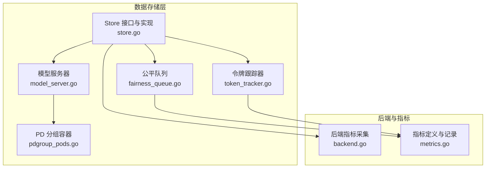
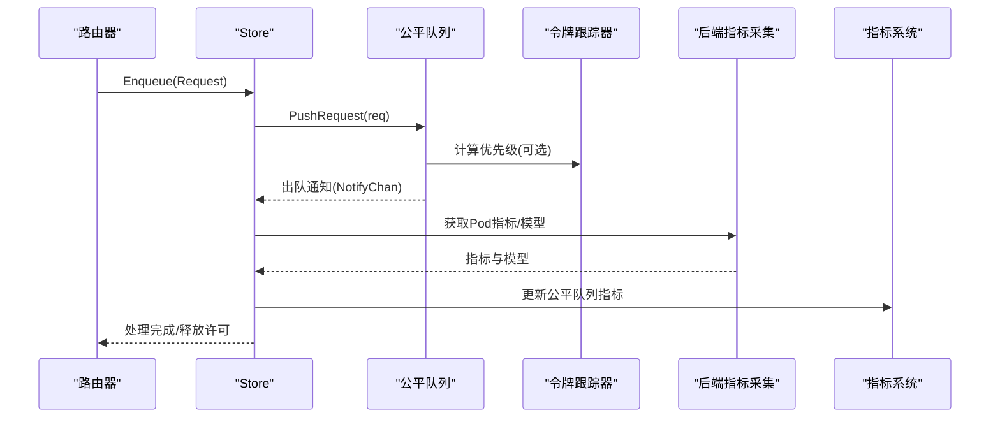
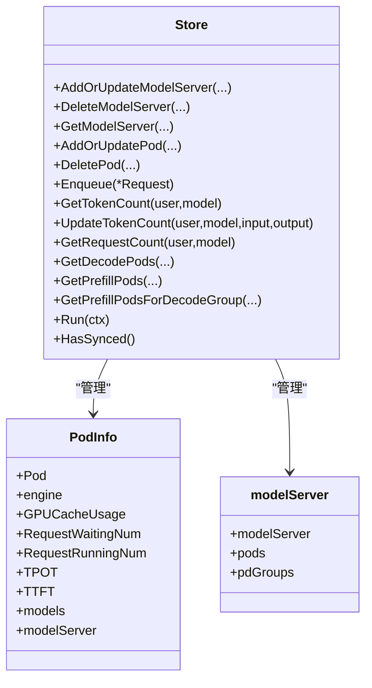
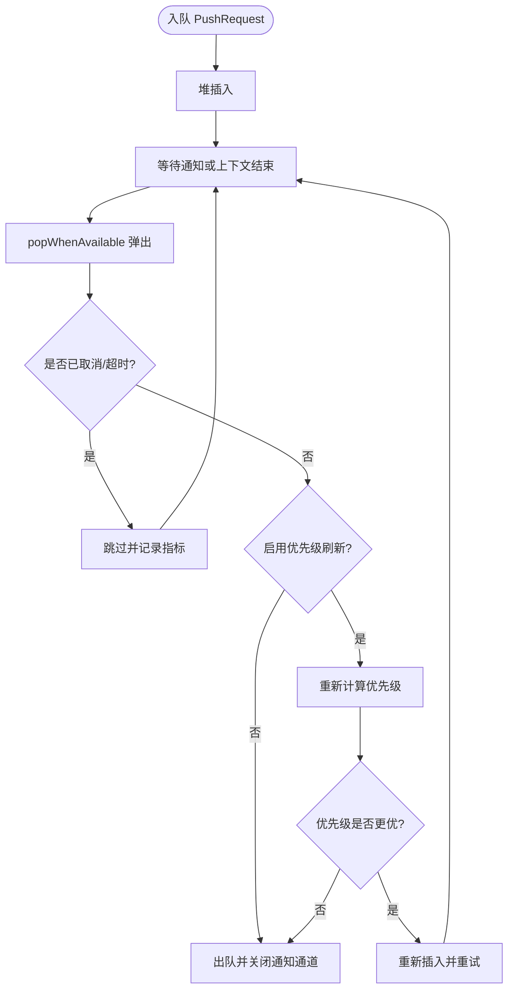
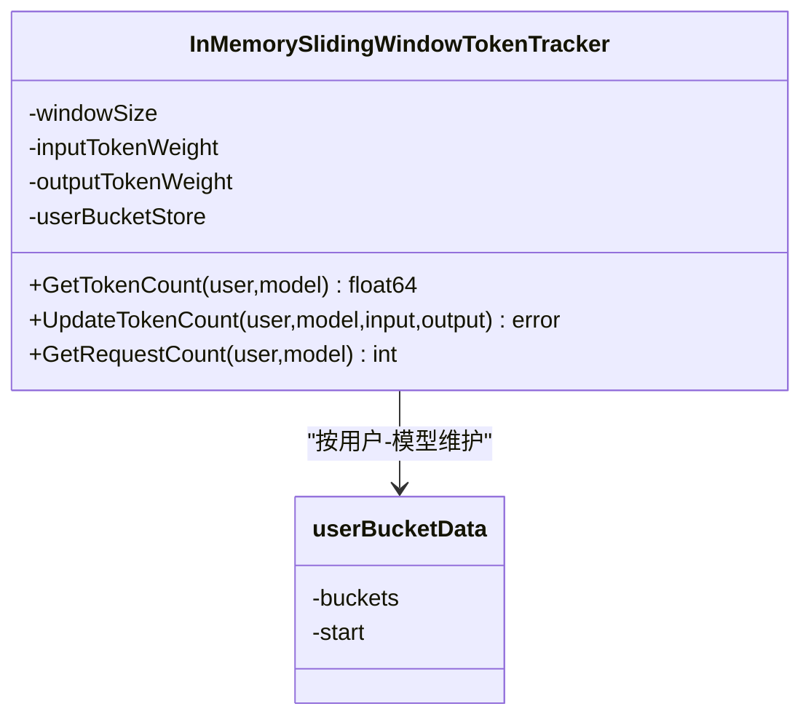
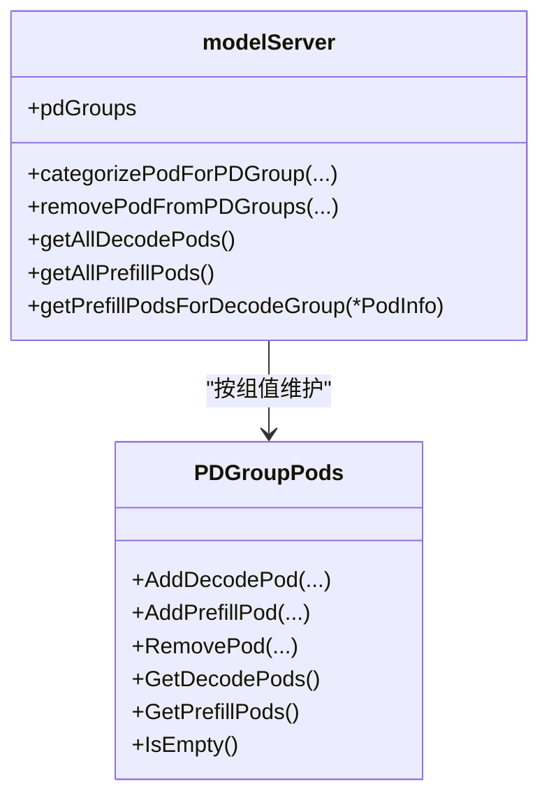
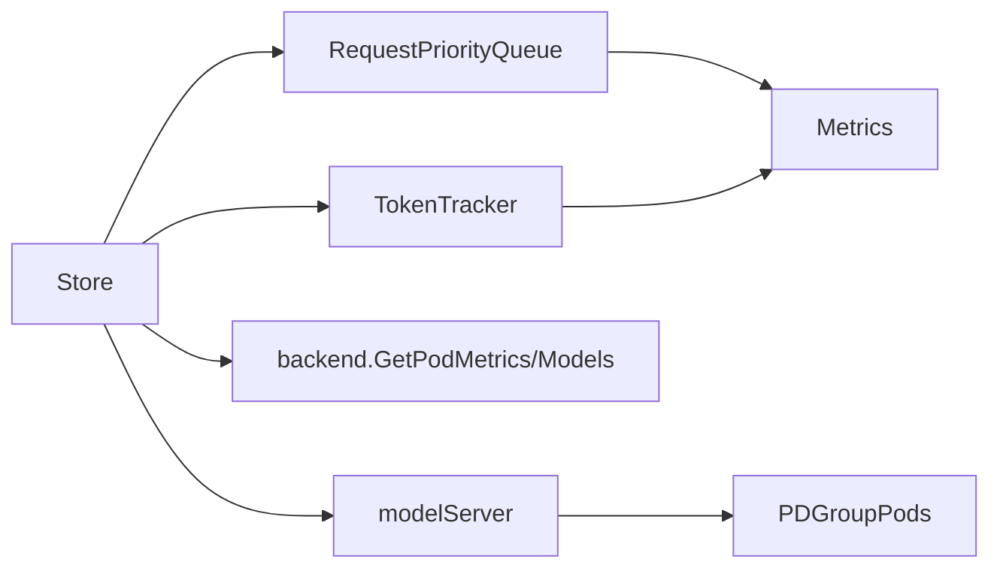

# 数据存储系统

<cite>
**本文引用的文件**
- [store.go](file://pkg/kthena-router/datastore/store.go)
- [fairness_queue.go](file://pkg/kthena-router/datastore/fairness_queue.go)
- [token_tracker.go](file://pkg/kthena-router/datastore/token_tracker.go)
- [model_server.go](file://pkg/kthena-router/datastore/model_server.go)
- [pdgroup_pods.go](file://pkg/kthena-router/datastore/pdgroup_pods.go)
- [metrics.go](file://pkg/kthena-router/metrics/metrics.go)
- [backend.go](file://pkg/kthena-router/backend/backend.go)
- [runtime.md](file://docs/kthena/docs/user-guide/runtime.md)
- [router-access-log-fields.md](file://docs/kthena/docs/reference/router-access-log-fields.md)
- [store_test.go](file://pkg/kthena-router/datastore/store_test.go)
- [fairness_queue_test.go](file://pkg/kthena-router/datastore/fairness_queue_test.go)
- [token_tracker_test.go](file://pkg/kthena-router/datastore/token_tracker_test.go)
</cite>

## 目录
1. [简介](#简介)
2. [项目结构](#项目结构)
3. [核心组件](#核心组件)
4. [架构总览](#架构总览)
5. [详细组件分析](#详细组件分析)
6. [依赖关系分析](#依赖关系分析)
7. [性能考量](#性能考量)
8. [故障排查指南](#故障排查指南)
9. [结论](#结论)
10. [附录](#附录)

## 简介
本文件面向 Kthena 数据存储系统，聚焦于数据存储层的架构与实现细节，涵盖以下主题：
- 模型服务器信息管理：如何在运行时维护 ModelServer 与 Pod 的映射，并支持 PD 分组（预取-解码）调度。
- 公平队列实现：基于优先级堆的排队机制，支持令牌权重与请求计数权重的组合优先级计算，以及可选的优先级刷新与堆重建。
- 令牌跟踪机制：基于滑动窗口的令牌计数器，用于用户-模型维度的资源分配与公平调度。
- 预取-解码组管理：按标签分组的 Decode/Prefill Pod 管理，支撑 PD-disaggregation 调度。
- 缓存策略与并发访问控制：读写锁、原子标志、sync.Map 等并发原语的使用。
- 配置项与性能调优：环境变量驱动的公平队列与令牌跟踪配置。
- 故障排查与可观测性：指标、访问日志字段与测试用例。

## 项目结构
数据存储系统位于 kthena-router 子模块中，核心文件如下：
- 数据存储入口与聚合：store.go
- 公平队列与优先级调度：fairness_queue.go
- 令牌跟踪与滑动窗口：token_tracker.go
- 模型服务器与 PD 分组：model_server.go、pdgroup_pods.go
- 后端指标采集：backend.go
- 指标定义与记录：metrics.go
- 运行时与指标标准化：runtime.md
- 访问日志字段参考：router-access-log-fields.md
- 单元测试：store_test.go、fairness_queue_test.go、token_tracker_test.go

图示来源
- [store.go:316-342](file://pkg/kthena-router/datastore/store.go#L316-L342)
- [fairness_queue.go:102-145](file://pkg/kthena-router/datastore/fairness_queue.go#L102-L145)
- [token_tracker.go:56-110](file://pkg/kthena-router/datastore/token_tracker.go#L56-L110)
- [model_server.go:27-45](file://pkg/kthena-router/datastore/model_server.go#L27-L45)
- [pdgroup_pods.go:26-39](file://pkg/kthena-router/datastore/pdgroup_pods.go#L26-L39)
- [backend.go:37-72](file://pkg/kthena-router/backend/backend.go#L37-L72)
- [metrics.go:54-85](file://pkg/kthena-router/metrics/metrics.go#L54-L85)

章节来源
- [store.go:161-240](file://pkg/kthena-router/datastore/store.go#L161-L240)
- [fairness_queue.go:31-64](file://pkg/kthena-router/datastore/fairness_queue.go#L31-L64)
- [token_tracker.go:34-64](file://pkg/kthena-router/datastore/token_tracker.go#L34-L64)
- [model_server.go:27-45](file://pkg/kthena-router/datastore/model_server.go#L27-L45)
- [pdgroup_pods.go:26-39](file://pkg/kthena-router/datastore/pdgroup_pods.go#L26-L39)
- [metrics.go:54-85](file://pkg/kthena-router/metrics/metrics.go#L54-L85)

## 核心组件
- Store 接口与实现：统一管理 ModelServer、Pod、ModelRoute、Gateway、InferencePool、HTTPRoute 等资源；提供公平队列入队、令牌统计查询、PD 分组查询等能力。
- 公平队列 RequestPriorityQueue：基于堆的优先队列，支持 FIFO 同用户策略、可选的令牌权重与请求计数权重组合优先级、优先级刷新与堆重建。
- 令牌跟踪器 InMemorySlidingWindowTokenTracker：按用户-模型维度维护滑动窗口内的累计令牌与请求数，支持权重配置与并发安全。
- 模型服务器 modelServer：维护 Pod 集合与 PD 分组映射，支持按标签分类 Decode/Prefill Pod。
- PDGroupPods：按 PD 组值维护 Decode/Prefill Pod 集合，支持增删与清空判断。
- 指标系统 Metrics：定义并记录公平队列大小、排队时延、取消次数、出队次数、在途请求数、令牌总量等关键指标。

章节来源
- [store.go:161-240](file://pkg/kthena-router/datastore/store.go#L161-L240)
- [fairness_queue.go:102-145](file://pkg/kthena-router/datastore/fairness_queue.go#L102-L145)
- [token_tracker.go:56-110](file://pkg/kthena-router/datastore/token_tracker.go#L56-L110)
- [model_server.go:27-45](file://pkg/kthena-router/datastore/model_server.go#L27-L45)
- [pdgroup_pods.go:26-39](file://pkg/kthena-router/datastore/pdgroup_pods.go#L26-L39)
- [metrics.go:54-85](file://pkg/kthena-router/metrics/metrics.go#L54-L85)

## 架构总览
数据存储系统围绕 Store 聚合点，通过后端指标采集与指标系统实现可观测性闭环。Store 在运行时周期性更新 Pod 指标与模型列表，同时维护路由与网关资源。公平队列与令牌跟踪器为调度与限流提供基础能力。

图示来源
- [store.go:443-468](file://pkg/kthena-router/datastore/store.go#L443-L468)
- [fairness_queue.go:183-283](file://pkg/kthena-router/datastore/fairness_queue.go#L183-L283)
- [token_tracker.go:70-94](file://pkg/kthena-router/datastore/token_tracker.go#L70-L94)
- [backend.go:42-65](file://pkg/kthena-router/backend/backend.go#L42-L65)
- [metrics.go:291-339](file://pkg/kthena-router/metrics/metrics.go#L291-L339)

## 详细组件分析

### Store：模型服务器与资源管理
- 资源管理
  - ModelServer 增删改查、Pod 关联与 PD 分组分类、路由与网关资源的增删改查。
  - 支持回调注册与触发，便于外部组件感知资源变化。
- 运行时更新
  - Run(ctx) 周期性拉取 Pod 指标与模型列表，更新 PodInfo 中的运行时指标与模型集合。
- 公平队列与令牌跟踪
  - Enqueue 将请求加入 per-model 的优先队列；GetTokenCount/UpdateTokenCount/GetRequestCount 提供令牌与请求计数查询。
  - HasSynced 用于指示初始同步状态。
- PD 分组查询
  - GetDecodePods、GetPrefillPods、GetPrefillPodsForDecodeGroup 支持 PD-disaggregation 的调度决策。

图示来源
- [store.go:280-314](file://pkg/kthena-router/datastore/store.go#L280-L314)
- [store.go:248-266](file://pkg/kthena-router/datastore/store.go#L248-L266)
- [model_server.go:27-45](file://pkg/kthena-router/datastore/model_server.go#L27-L45)

章节来源
- [store.go:410-489](file://pkg/kthena-router/datastore/store.go#L410-L489)
- [store.go:572-635](file://pkg/kthena-router/datastore/store.go#L572-L635)
- [store.go:637-752](file://pkg/kthena-router/datastore/store.go#L637-L752)
- [store.go:754-800](file://pkg/kthena-router/datastore/store.go#L754-L800)

### 公平队列：优先级与负载均衡
- 配置参数
  - MaxConcurrent：并发许可上限；0 表示退化为 QPS 模式。
  - MaxQPS：QPS 模式下的固定出队速率。
  - MaxPriorityRefreshRetries：允许的优先级刷新重入次数，超过则触发堆重建阈值。
  - RebuildThreshold：堆重建阈值，避免频繁重建。
  - TokenWeight、RequestNumWeight：组合优先级中的令牌与请求数权重。
- 优先级计算
  - 使用令牌跟踪器提供的用户-模型令牌计数与请求计数，计算优先级分数。
- 出队逻辑
  - 支持信号量模式（容量门控）与 QPS 模式（定时器）两种。
  - 可选的优先级刷新：当优先级发生漂移时，重新插入并最多重试指定次数；达到阈值后重建堆。
  - 取消/超时请求自动跳过，减少无效处理。

图示来源
- [fairness_queue.go:183-283](file://pkg/kthena-router/datastore/fairness_queue.go#L183-L283)
- [fairness_queue.go:301-319](file://pkg/kthena-router/datastore/fairness_queue.go#L301-L319)
- [fairness_queue.go:336-412](file://pkg/kthena-router/datastore/fairness_queue.go#L336-L412)

章节来源
- [fairness_queue.go:31-64](file://pkg/kthena-router/datastore/fairness_queue.go#L31-L64)
- [fairness_queue.go:71-88](file://pkg/kthena-router/datastore/fairness_queue.go#L71-L88)
- [fairness_queue.go:147-182](file://pkg/kthena-router/datastore/fairness_queue.go#L147-L182)
- [fairness_queue.go:336-412](file://pkg/kthena-router/datastore/fairness_queue.go#L336-L412)

### 令牌跟踪：滑动窗口与权重
- 滑动窗口
  - 固定窗口大小（默认 5 分钟），按秒粒度桶存储累计令牌与请求数。
  - 过期桶清理与紧凑化，避免无限增长。
- 权重配置
  - 支持输入令牌与输出令牌的权重配置，默认输入权重 1.0、输出权重 2.0。
  - 窗口大小限制在 1 分钟到 1 小时之间。
- 并发安全
  - 读写锁保护用户-模型-桶结构；读路径尽量只加读锁，必要时升级为写锁进行修剪与更新。

图示来源
- [token_tracker.go:56-110](file://pkg/kthena-router/datastore/token_tracker.go#L56-L110)
- [token_tracker.go:117-156](file://pkg/kthena-router/datastore/token_tracker.go#L117-L156)
- [token_tracker.go:194-243](file://pkg/kthena-router/datastore/token_tracker.go#L194-L243)
- [token_tracker.go:309-356](file://pkg/kthena-router/datastore/token_tracker.go#L309-L356)

章节来源
- [token_tracker.go:27-32](file://pkg/kthena-router/datastore/token_tracker.go#L27-L32)
- [token_tracker.go:69-94](file://pkg/kthena-router/datastore/token_tracker.go#L69-L94)
- [token_tracker.go:117-156](file://pkg/kthena-router/datastore/token_tracker.go#L117-L156)
- [token_tracker.go:194-243](file://pkg/kthena-router/datastore/token_tracker.go#L194-L243)
- [token_tracker.go:309-356](file://pkg/kthena-router/datastore/token_tracker.go#L309-L356)

### PD 分组：预取-解码调度
- 模型服务器维度的 PD 分组
  - 依据 PDGroup 标签键与 Decode/Prefill 标签集，将 Pod 归类到对应组值下。
- 查询接口
  - 获取所有 Decode/Prefill Pod 列表，或根据 Decode Pod 所属组值返回匹配的 Prefill Pod 列表。
- 清理与空值检测
  - 删除 Pod 或模型服务器时，清理对应的分组条目；空组自动移除。

图示来源
- [model_server.go:76-180](file://pkg/kthena-router/datastore/model_server.go#L76-L180)
- [pdgroup_pods.go:41-96](file://pkg/kthena-router/datastore/pdgroup_pods.go#L41-L96)

章节来源
- [model_server.go:76-180](file://pkg/kthena-router/datastore/model_server.go#L76-L180)
- [pdgroup_pods.go:41-96](file://pkg/kthena-router/datastore/pdgroup_pods.go#L41-L96)

### 指标与可观测性
- 指标类别
  - 请求总量、时延直方图、令牌总量、调度插件耗时、速率限制、活跃上游/下游请求数、公平队列大小与时延、取消/出队/在途、优先级刷新/堆重建次数。
- 记录方式
  - Store 在入队/出队/取消/释放许可时调用指标记录方法；后端指标通过 backend.go 采集并合并到 PodInfo。

章节来源
- [metrics.go:54-85](file://pkg/kthena-router/metrics/metrics.go#L54-L85)
- [metrics.go:291-339](file://pkg/kthena-router/metrics/metrics.go#L291-L339)
- [backend.go:42-65](file://pkg/kthena-router/backend/backend.go#L42-L65)

## 依赖关系分析
- Store 依赖
  - 公平队列：per-model 的 RequestPriorityQueue，使用 sync.Map 存储。
  - 令牌跟踪器：TokenTracker 接口实现，支持环境变量配置。
  - 后端指标：通过 backend.GetPodMetrics 与 GetPodModels 获取运行时指标与模型列表。
- 公平队列依赖
  - 指标系统：记录排队时延、取消、出队、在途、优先级刷新与堆重建。
- 令牌跟踪器依赖
  - 指标系统：记录令牌总量与请求计数。
- PD 分组依赖
  - 模型服务器：依据标签键与标签集进行分类。

图示来源
- [store.go:316-342](file://pkg/kthena-router/datastore/store.go#L316-L342)
- [fairness_queue.go:102-145](file://pkg/kthena-router/datastore/fairness_queue.go#L102-L145)
- [token_tracker.go:56-110](file://pkg/kthena-router/datastore/token_tracker.go#L56-L110)
- [backend.go:42-65](file://pkg/kthena-router/backend/backend.go#L42-L65)
- [model_server.go:27-45](file://pkg/kthena-router/datastore/model_server.go#L27-L45)
- [pdgroup_pods.go:26-39](file://pkg/kthena-router/datastore/pdgroup_pods.go#L26-L39)

章节来源
- [store.go:316-342](file://pkg/kthena-router/datastore/store.go#L316-L342)
- [fairness_queue.go:102-145](file://pkg/kthena-router/datastore/fairness_queue.go#L102-L145)
- [token_tracker.go:56-110](file://pkg/kthena-router/datastore/token_tracker.go#L56-L110)
- [model_server.go:27-45](file://pkg/kthena-router/datastore/model_server.go#L27-L45)
- [pdgroup_pods.go:26-39](file://pkg/kthena-router/datastore/pdgroup_pods.go#L26-L39)
- [backend.go:42-65](file://pkg/kthena-router/backend/backend.go#L42-L65)

## 性能考量
- 公平队列
  - 优先级刷新与堆重建会带来额外开销，应合理设置 MaxPriorityRefreshRetries 与 RebuildThreshold，避免频繁重建。
  - 当 MaxConcurrent > 0 时采用信号量模式，有利于与后端容量对齐；否则使用 QPS 模式，适合固定速率场景。
- 令牌跟踪
  - 滑动窗口按秒桶存储，时间复杂度均摊 O(1)，最坏 O(B_u)；窗口大小限制在 1~60 分钟，避免内存无限增长。
  - 负载高时，建议增大窗口以降低桶数量，或调整权重以平衡公平性与开销。
- 并发与锁
  - Store 使用 sync.Map 与读写锁，减少全局锁竞争；PodInfo 的指标与模型字段使用互斥保护，避免竞态。
- 指标开销
  - 公平队列指标在入队/出队/取消时更新，建议结合业务流量选择合适的指标粒度与采样策略。

## 故障排查指南
- 公平队列无法出队
  - 检查是否处于信号量模式且许可已满；确认 Release 是否被正确调用。
  - 查看优先级刷新与堆重建次数，评估 MaxPriorityRefreshRetries 与 RebuildThreshold 设置。
- 令牌统计异常
  - 确认环境变量 FAIRNESS_WINDOW_SIZE、FAIRNESS_INPUT_TOKEN_WEIGHT、FAIRNESS_OUTPUT_TOKEN_WEIGHT 是否符合预期。
  - 观察令牌跟踪器的窗口修剪行为，确保未出现极端过期导致的统计归零。
- PD 分组不生效
  - 检查模型服务器的 PDGroup 标签键与 Decode/Prefill 标签集配置是否一致。
  - 确认 Pod 标签与期望匹配，避免因标签缺失导致分组为空。
- 指标缺失或异常
  - 核对 Metrics 实例初始化与标签维度；检查后端指标采集是否成功。
  - 参考访问日志字段，定位错误类型与状态码，辅助定位问题根因。

章节来源
- [fairness_queue_test.go:140-240](file://pkg/kthena-router/datastore/fairness_queue_test.go#L140-L240)
- [fairness_queue_test.go:628-710](file://pkg/kthena-router/datastore/fairness_queue_test.go#L628-L710)
- [token_tracker_test.go:24-52](file://pkg/kthena-router/datastore/token_tracker_test.go#L24-L52)
- [token_tracker_test.go:353-391](file://pkg/kthena-router/datastore/token_tracker_test.go#L353-L391)
- [store_test.go:488-756](file://pkg/kthena-router/datastore/store_test.go#L488-L756)
- [router-access-log-fields.md:45-61](file://docs/kthena/docs/reference/router-access-log-fields.md#L45-L61)

## 结论
Kthena 数据存储系统通过 Store 聚合点，将模型服务器、Pod、路由与网关资源统一管理，并结合公平队列与令牌跟踪器实现细粒度的资源分配与调度。PD 分组机制为预取-解码分离提供了高效调度基础。配合完善的指标体系与可观测性配置，系统在高并发与多模型场景下具备良好的公平性与稳定性。

## 附录

### 配置选项与环境变量
- 公平队列配置（环境变量）
  - FAIRNESS_MAX_CONCURRENT：最大并发许可数（非负整数）
  - FAIRNESS_MAX_QPS：最大每秒出队数（正整数）
  - FAIRNESS_PRIORITY_REFRESH_RETRIES：优先级刷新重试次数（非负整数）
  - FAIRNESS_REBUILD_THRESHOLD：堆重建阈值（正整数）
  - FAIRNESS_PRIORITY_TOKEN_WEIGHT：令牌权重（非负数）
  - FAIRNESS_PRIORITY_REQUEST_NUM_WEIGHT：请求计数权重（非负数）
- 令牌跟踪配置（环境变量）
  - FAIRNESS_WINDOW_SIZE：滑动窗口大小（需在 1 分钟到 1 小时之间）
  - FAIRNESS_INPUT_TOKEN_WEIGHT：输入令牌权重（非负数）
  - FAIRNESS_OUTPUT_TOKEN_WEIGHT：输出令牌权重（非负数）

章节来源
- [store.go:70-111](file://pkg/kthena-router/datastore/store.go#L70-L111)
- [store.go:351-404](file://pkg/kthena-router/datastore/store.go#L351-L404)
- [token_tracker.go:69-94](file://pkg/kthena-router/datastore/token_tracker.go#L69-L94)

### 访问日志字段参考
- 标准 HTTP 字段：timestamp、method、path、protocol、status_code
- 错误信息：error.type、error.message
- AI 路由信息：model_name、model_route、model_server、selected_pod、request_id
- 令牌信息：input_tokens、output_tokens
- 时间分解：duration_total、duration_request_processing、duration_upstream_processing、duration_response_processing

章节来源
- [router-access-log-fields.md:29-100](file://docs/kthena/docs/reference/router-access-log-fields.md#L29-L100)
- [router-access-log-fields.md:164-175](file://docs/kthena/docs/reference/router-access-log-fields.md#L164-L175)