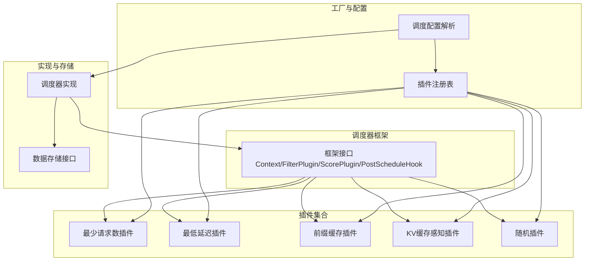
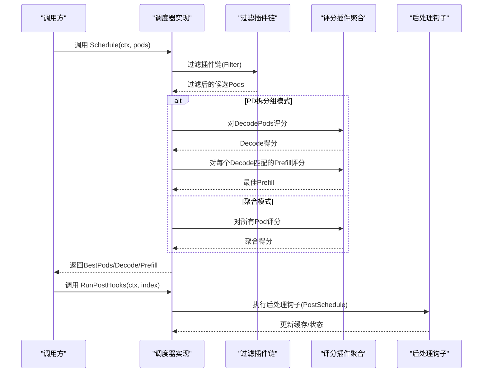
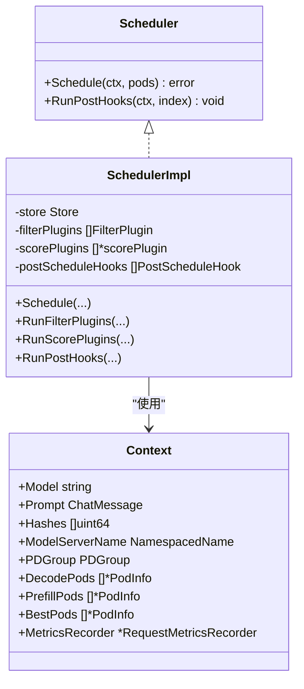
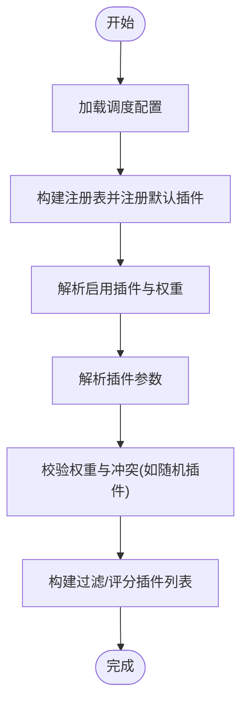
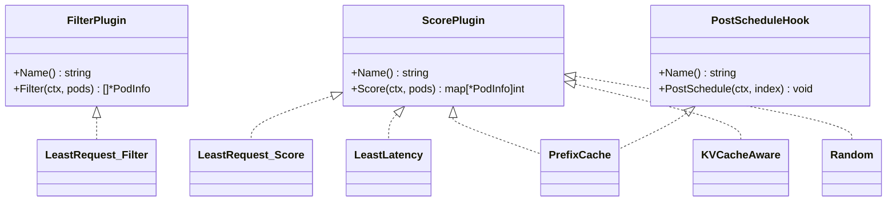
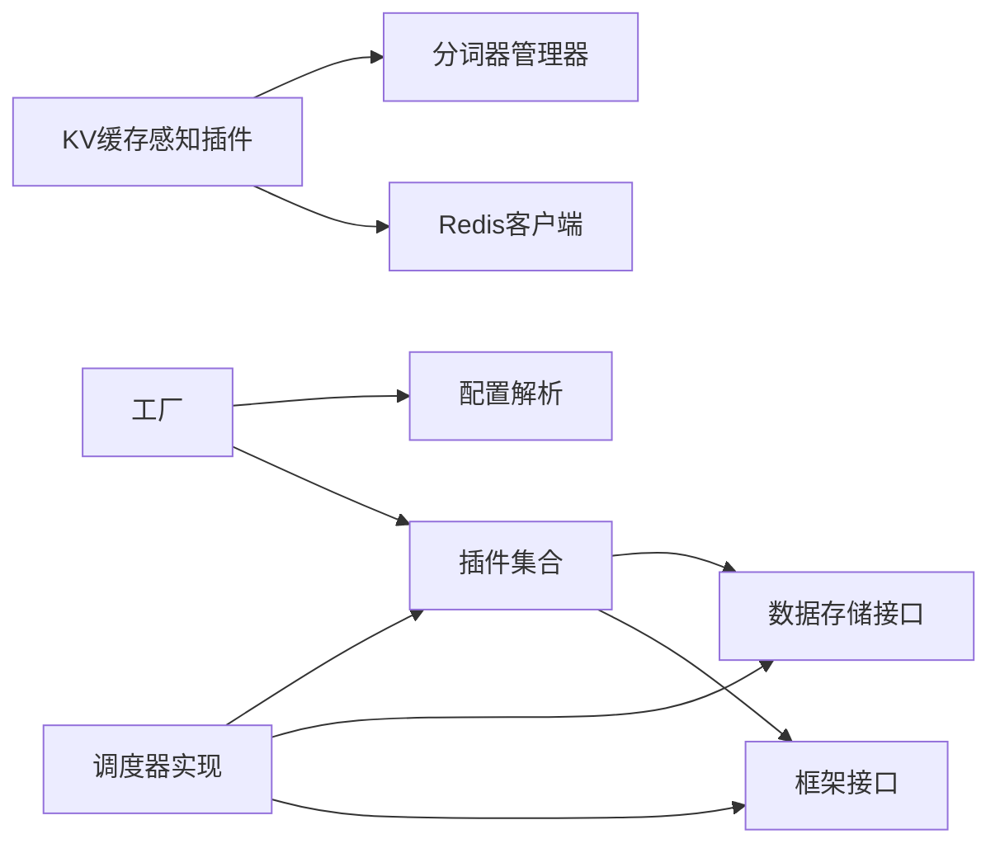
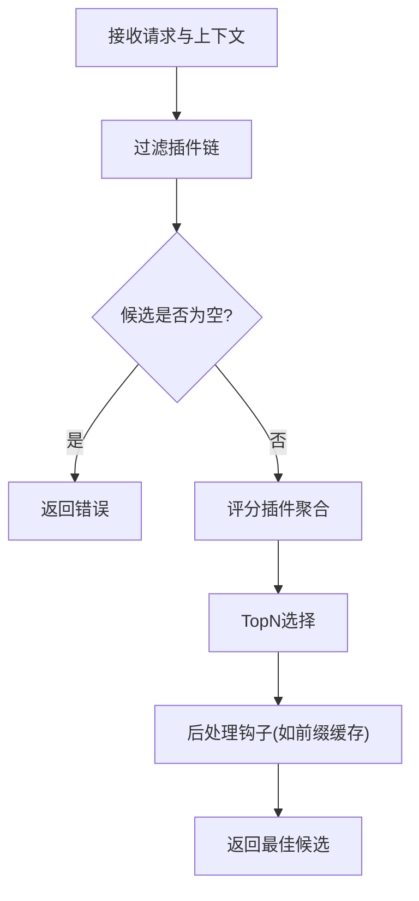

# 调度器核心架构

<cite>
**本文引用的文件**
- [pkg/kthena-router/scheduler/scheduler.go](file://pkg/kthena-router/scheduler/scheduler.go)
- [pkg/kthena-router/scheduler/scheduler_impl.go](file://pkg/kthena-router/scheduler/scheduler_impl.go)
- [pkg/kthena-router/scheduler/factory.go](file://pkg/kthena-router/scheduler/factory.go)
- [pkg/kthena-router/scheduler/framework/interface.go](file://pkg/kthena-router/scheduler/framework/interface.go)
- [pkg/kthena-router/scheduler/plugins/conf/conf.go](file://pkg/kthena-router/scheduler/plugins/conf/conf.go)
- [pkg/kthena-router/scheduler/plugins/prefix.go](file://pkg/kthena-router/scheduler/plugins/prefix.go)
- [pkg/kthena-router/scheduler/plugins/least_request.go](file://pkg/kthena-router/scheduler/plugins/least_request.go)
- [pkg/kthena-router/scheduler/plugins/least_latency.go](file://pkg/kthena-router/scheduler/plugins/least_latency.go)
- [pkg/kthena-router/scheduler/plugins/random.go](file://pkg/kthena-router/scheduler/plugins/random.go)
- [pkg/kthena-router/scheduler/plugins/kvcache_aware.go](file://pkg/kthena-router/scheduler/plugins/kvcache_aware.go)
- [pkg/kthena-router/datastore/store.go](file://pkg/kthena-router/datastore/store.go)
</cite>

## 目录
1. [简介](#简介)
2. [项目结构](#项目结构)
3. [核心组件](#核心组件)
4. [架构总览](#架构总览)
5. [详细组件分析](#详细组件分析)
6. [依赖分析](#依赖分析)
7. [性能考量](#性能考量)
8. [故障排查指南](#故障排查指南)
9. [结论](#结论)
10. [附录](#附录)

## 简介
本文件系统性阐述 Kthena 路由器调度器的核心架构与实现，覆盖调度器接口定义、工厂模式设计、调度实现逻辑、上下文管理、插件执行流程与钩子函数机制、初始化与配置加载、生命周期管理、错误处理策略、性能优化方案、并发安全与故障恢复等主题。文档同时提供配置示例、扩展接口说明与最佳实践建议，帮助读者快速理解并高效使用调度器。

## 项目结构
调度器位于 kthena 路由器模块中，采用“框架接口 + 插件集合 + 工厂 + 实现”的分层组织方式：
- 框架层：定义调度上下文、过滤/评分/后处理钩子接口
- 插件层：内置多种评分与过滤插件（如最少请求数、最低延迟、前缀缓存、KV 缓存感知等）
- 工厂层：注册与构建插件，解析调度配置
- 实现层：调度器具体实现，负责过滤、评分、TopN 选择与后处理钩子调用
- 数据存储层：提供模型服务器、Pod 分类、PD 拆分组等运行时信息查询

**图表来源**
- [pkg/kthena-router/scheduler/framework/interface.go:28-67](file://pkg/kthena-router/scheduler/framework/interface.go#L28-L67)
- [pkg/kthena-router/scheduler/plugins/least_request.go:29-97](file://pkg/kthena-router/scheduler/plugins/least_request.go#L29-L97)
- [pkg/kthena-router/scheduler/plugins/least_latency.go:30-131](file://pkg/kthena-router/scheduler/plugins/least_latency.go#L30-L131)
- [pkg/kthena-router/scheduler/plugins/prefix.go:88-249](file://pkg/kthena-router/scheduler/plugins/prefix.go#L88-L249)
- [pkg/kthena-router/scheduler/plugins/kvcache_aware.go:48-356](file://pkg/kthena-router/scheduler/plugins/kvcache_aware.go#L48-L356)
- [pkg/kthena-router/scheduler/plugins/random.go:29-74](file://pkg/kthena-router/scheduler/plugins/random.go#L29-L74)
- [pkg/kthena-router/scheduler/factory.go:29-144](file://pkg/kthena-router/scheduler/factory.go#L29-L144)
- [pkg/kthena-router/scheduler/plugins/conf/conf.go:28-153](file://pkg/kthena-router/scheduler/plugins/conf/conf.go#L28-L153)
- [pkg/kthena-router/scheduler/scheduler_impl.go:40-251](file://pkg/kthena-router/scheduler/scheduler_impl.go#L40-L251)
- [pkg/kthena-router/datastore/store.go:162-240](file://pkg/kthena-router/datastore/store.go#L162-L240)

**章节来源**
- [pkg/kthena-router/scheduler/framework/interface.go:28-67](file://pkg/kthena-router/scheduler/framework/interface.go#L28-L67)
- [pkg/kthena-router/scheduler/factory.go:29-144](file://pkg/kthena-router/scheduler/factory.go#L29-L144)
- [pkg/kthena-router/scheduler/plugins/conf/conf.go:28-153](file://pkg/kthena-router/scheduler/plugins/conf/conf.go#L28-L153)
- [pkg/kthena-router/scheduler/scheduler_impl.go:40-251](file://pkg/kthena-router/scheduler/scheduler_impl.go#L40-L251)
- [pkg/kthena-router/datastore/store.go:162-240](file://pkg/kthena-router/datastore/store.go#L162-L240)

## 核心组件
- 调度器接口与实现
  - 接口定义：提供 Schedule 与 RunPostHooks 两个核心方法，分别用于执行调度与后处理钩子
  - 实现：封装过滤插件链、评分插件聚合、TopN 选择与钩子执行
- 框架接口
  - Context：承载模型名、提示词、PD 组信息、候选 Pod 列表、指标记录器等
  - FilterPlugin/ScorePlugin/PostScheduleHook：标准化插件能力
- 工厂与注册表
  - 注册默认插件（最少请求数、最低延迟、前缀缓存、KV 缓存感知、最少请求数过滤、LoRA 亲和等）
  - 构建过滤与评分插件列表，并处理权重与参数
- 配置解析
  - 解析路由配置中的调度器部分，支持启用/禁用插件、设置权重、传入插件参数
- 存储接口
  - 提供模型服务器、Pod、PD 拆分组等查询能力，支撑调度决策

**章节来源**
- [pkg/kthena-router/scheduler/scheduler.go:25-29](file://pkg/kthena-router/scheduler/scheduler.go#L25-L29)
- [pkg/kthena-router/scheduler/scheduler_impl.go:40-99](file://pkg/kthena-router/scheduler/scheduler_impl.go#L40-L99)
- [pkg/kthena-router/scheduler/framework/interface.go:28-67](file://pkg/kthena-router/scheduler/framework/interface.go#L28-L67)
- [pkg/kthena-router/scheduler/factory.go:29-144](file://pkg/kthena-router/scheduler/factory.go#L29-L144)
- [pkg/kthena-router/scheduler/plugins/conf/conf.go:28-153](file://pkg/kthena-router/scheduler/plugins/conf/conf.go#L28-L153)
- [pkg/kthena-router/datastore/store.go:162-240](file://pkg/kthena-router/datastore/store.go#L162-L240)

## 架构总览
调度器采用“插件化 + 工厂 + 上下文驱动”的设计，通过统一的 Context 在过滤与评分阶段传递状态；评分阶段对各插件结果加权聚合，最终选出 TopN 候选；后处理钩子在调度完成后进行缓存更新等操作。

**图表来源**
- [pkg/kthena-router/scheduler/scheduler_impl.go:101-165](file://pkg/kthena-router/scheduler/scheduler_impl.go#L101-L165)
- [pkg/kthena-router/scheduler/scheduler_impl.go:167-223](file://pkg/kthena-router/scheduler/scheduler_impl.go#L167-L223)
- [pkg/kthena-router/scheduler/scheduler_impl.go:225-229](file://pkg/kthena-router/scheduler/scheduler_impl.go#L225-L229)
- [pkg/kthena-router/scheduler/framework/interface.go:49-66](file://pkg/kthena-router/scheduler/framework/interface.go#L49-L66)

## 详细组件分析

### 调度器接口与实现
- 接口职责
  - Schedule：根据上下文与候选 Pod 执行过滤与评分，输出最佳候选
  - RunPostHooks：在调度完成后执行后处理钩子
- 实现要点
  - 过滤阶段：依次调用过滤插件，记录耗时并统计日志
  - 评分阶段：对每个插件返回的映射按权重累加，支持 PD 拆分组优化路径
  - TopN 选择：按得分排序取前 N 个
  - 后处理钩子：将最终选择写回缓存或状态

**图表来源**
- [pkg/kthena-router/scheduler/scheduler.go:25-29](file://pkg/kthena-router/scheduler/scheduler.go#L25-L29)
- [pkg/kthena-router/scheduler/scheduler_impl.go:40-99](file://pkg/kthena-router/scheduler/scheduler_impl.go#L40-L99)
- [pkg/kthena-router/scheduler/framework/interface.go:28-47](file://pkg/kthena-router/scheduler/framework/interface.go#L28-L47)

**章节来源**
- [pkg/kthena-router/scheduler/scheduler.go:25-29](file://pkg/kthena-router/scheduler/scheduler.go#L25-L29)
- [pkg/kthena-router/scheduler/scheduler_impl.go:101-165](file://pkg/kthena-router/scheduler/scheduler_impl.go#L101-L165)
- [pkg/kthena-router/scheduler/scheduler_impl.go:167-223](file://pkg/kthena-router/scheduler/scheduler_impl.go#L167-L223)
- [pkg/kthena-router/scheduler/scheduler_impl.go:225-229](file://pkg/kthena-router/scheduler/scheduler_impl.go#L225-L229)
- [pkg/kthena-router/scheduler/framework/interface.go:28-47](file://pkg/kthena-router/scheduler/framework/interface.go#L28-L47)

### 工厂与插件注册
- 注册表
  - 维护评分与过滤插件的构造器映射
  - 提供注册、获取与默认插件注册能力
- 默认插件
  - 评分：最少请求数、最低延迟、随机、前缀缓存、KV 缓存感知
  - 过滤：最少请求数（过滤）、LoRA 亲和（过滤）
- 插件构建
  - 从配置中读取启用插件、权重与参数，构建插件实例
  - 处理权重异常与冲突（例如随机插件与其他插件混用时移除）

**图表来源**
- [pkg/kthena-router/scheduler/factory.go:66-95](file://pkg/kthena-router/scheduler/factory.go#L66-L95)
- [pkg/kthena-router/scheduler/factory.go:97-143](file://pkg/kthena-router/scheduler/factory.go#L97-L143)
- [pkg/kthena-router/scheduler/plugins/conf/conf.go:82-103](file://pkg/kthena-router/scheduler/plugins/conf/conf.go#L82-L103)

**章节来源**
- [pkg/kthena-router/scheduler/factory.go:29-144](file://pkg/kthena-router/scheduler/factory.go#L29-L144)
- [pkg/kthena-router/scheduler/plugins/conf/conf.go:82-103](file://pkg/kthena-router/scheduler/plugins/conf/conf.go#L82-L103)

### 调度配置与加载
- 配置结构
  - 路由配置包含调度器配置段，支持插件启用/禁用、权重、插件参数
- 加载流程
  - 解析 YAML 文件为结构体
  - 解析插件启用列表与权重映射
  - 解析插件参数映射
  - 冲突处理：当随机插件与其他插件同时配置时发出警告并移除随机插件

**章节来源**
- [pkg/kthena-router/scheduler/plugins/conf/conf.go:28-153](file://pkg/kthena-router/scheduler/plugins/conf/conf.go#L28-L153)

### 上下文管理与传递
- Context 字段
  - 模型名、提示词、滚动哈希、模型服务器名称、PD 组对象
  - PD 拆分组模式下的 Decode/Prefill 候选，聚合模式下的 BestPods
  - 指标记录器用于记录插件耗时
- 传递机制
  - 调度器实现将上下文贯穿过滤、评分与后处理阶段
  - 插件通过上下文读取模型与提示信息，写入哈希与候选列表

**章节来源**
- [pkg/kthena-router/scheduler/framework/interface.go:28-47](file://pkg/kthena-router/scheduler/framework/interface.go#L28-L47)
- [pkg/kthena-router/scheduler/scheduler_impl.go:101-165](file://pkg/kthena-router/scheduler/scheduler_impl.go#L101-L165)
- [pkg/kthena-router/scheduler/scheduler_impl.go:167-223](file://pkg/kthena-router/scheduler/scheduler_impl.go#L167-L223)

### 插件体系与钩子机制
- 过滤插件
  - 最少请求数：基于等待/运行请求数阈值过滤
- 评分插件
  - 最少请求数：以等待/运行请求数计算分数
  - 最低延迟：基于 TTFT/TPOT 的归一化打分
  - 前缀缓存：基于滚动哈希的前缀匹配，返回命中长度占比
  - KV 缓存感知：基于分块哈希与 Redis 的跨 Pod 缓存命中统计
  - 随机：仅用于测试，不应与其它评分插件混用
- 钩子函数
  - 后处理钩子：在调度完成后更新缓存（如前缀缓存写入最佳 Pod）

**图表来源**
- [pkg/kthena-router/scheduler/framework/interface.go:49-66](file://pkg/kthena-router/scheduler/framework/interface.go#L49-L66)
- [pkg/kthena-router/scheduler/plugins/least_request.go:29-97](file://pkg/kthena-router/scheduler/plugins/least_request.go#L29-L97)
- [pkg/kthena-router/scheduler/plugins/least_latency.go:30-131](file://pkg/kthena-router/scheduler/plugins/least_latency.go#L30-L131)
- [pkg/kthena-router/scheduler/plugins/prefix.go:88-249](file://pkg/kthena-router/scheduler/plugins/prefix.go#L88-L249)
- [pkg/kthena-router/scheduler/plugins/kvcache_aware.go:48-356](file://pkg/kthena-router/scheduler/plugins/kvcache_aware.go#L48-L356)
- [pkg/kthena-router/scheduler/plugins/random.go:29-74](file://pkg/kthena-router/scheduler/plugins/random.go#L29-L74)

**章节来源**
- [pkg/kthena-router/scheduler/framework/interface.go:49-66](file://pkg/kthena-router/scheduler/framework/interface.go#L49-L66)
- [pkg/kthena-router/scheduler/plugins/least_request.go:29-97](file://pkg/kthena-router/scheduler/plugins/least_request.go#L29-L97)
- [pkg/kthena-router/scheduler/plugins/least_latency.go:30-131](file://pkg/kthena-router/scheduler/plugins/least_latency.go#L30-L131)
- [pkg/kthena-router/scheduler/plugins/prefix.go:88-249](file://pkg/kthena-router/scheduler/plugins/prefix.go#L88-L249)
- [pkg/kthena-router/scheduler/plugins/kvcache_aware.go:48-356](file://pkg/kthena-router/scheduler/plugins/kvcache_aware.go#L48-L356)
- [pkg/kthena-router/scheduler/plugins/random.go:29-74](file://pkg/kthena-router/scheduler/plugins/random.go#L29-L74)

### 初始化与生命周期管理
- 初始化
  - 构造注册表并注册默认插件
  - 读取调度配置（默认或用户配置），解析插件启用列表、权重与参数
  - 构建过滤/评分插件与后处理钩子
- 生命周期
  - 运行期通过存储接口持续更新 Pod 指标与模型信息
  - 调度器在每次请求时基于最新上下文与候选集执行过滤/评分/选择

**章节来源**
- [pkg/kthena-router/scheduler/scheduler_impl.go:59-99](file://pkg/kthena-router/scheduler/scheduler_impl.go#L59-L99)
- [pkg/kthena-router/datastore/store.go:410-430](file://pkg/kthena-router/datastore/store.go#L410-L430)

### 错误处理策略
- 过滤阶段
  - 若某过滤插件将候选清空，立即返回错误，避免后续评分
- 评分阶段
  - 记录插件耗时到指标记录器，便于观测与定位瓶颈
- 配置阶段
  - 权重非法时降级为 0 并记录告警
  - 插件缺失时记录错误并跳过
- 随机插件冲突
  - 当与其它评分插件共存时发出警告并移除，确保调度的可解释性与稳定性

**章节来源**
- [pkg/kthena-router/scheduler/scheduler_impl.go:167-185](file://pkg/kthena-router/scheduler/scheduler_impl.go#L167-L185)
- [pkg/kthena-router/scheduler/factory.go:114-143](file://pkg/kthena-router/scheduler/factory.go#L114-L143)
- [pkg/kthena-router/scheduler/plugins/conf/conf.go:105-125](file://pkg/kthena-router/scheduler/plugins/conf/conf.go#L105-L125)

### 性能优化方案
- PD 拆分组优化
  - O(1) 查询 Decode/Prefill Pod 列表，减少遍历成本
  - 先对 Decode 评分再对每个 Decode 匹配的 Prefill 评分，降低无效组合数量
- 评分聚合
  - TopN 限制为固定数量，控制排序与内存开销
  - 插件评分独立计算并按权重累加，避免重复扫描
- 指标记录
  - 记录每插件耗时，便于识别慢插件与热点路径

**章节来源**
- [pkg/kthena-router/scheduler/scheduler_impl.go:108-165](file://pkg/kthena-router/scheduler/scheduler_impl.go#L108-L165)
- [pkg/kthena-router/scheduler/scheduler_impl.go:187-223](file://pkg/kthena-router/scheduler/scheduler_impl.go#L187-L223)

### 并发安全与故障恢复
- 并发安全
  - 存储层使用互斥保护共享状态，提供线程安全的读写访问
  - Pod 指标与模型集合在上下文中受读写锁保护
- 故障恢复
  - 插件缺失或参数解析失败时记录错误并跳过，不影响整体流程
  - 随机插件冲突自动降级，保证调度稳定

**章节来源**
- [pkg/kthena-router/datastore/store.go:262-266](file://pkg/kthena-router/datastore/store.go#L262-L266)
- [pkg/kthena-router/scheduler/factory.go:100-111](file://pkg/kthena-router/scheduler/factory.go#L100-L111)

## 依赖分析
调度器内部依赖清晰，耦合度低：
- 调度器实现依赖框架接口与存储接口
- 插件实现依赖框架接口与存储接口
- 工厂依赖插件实现与配置解析
- KV 缓存感知插件依赖 Redis 与分词器管理器

**图表来源**
- [pkg/kthena-router/scheduler/scheduler_impl.go:40-99](file://pkg/kthena-router/scheduler/scheduler_impl.go#L40-L99)
- [pkg/kthena-router/scheduler/factory.go:29-144](file://pkg/kthena-router/scheduler/factory.go#L29-L144)
- [pkg/kthena-router/scheduler/plugins/kvcache_aware.go:107-140](file://pkg/kthena-router/scheduler/plugins/kvcache_aware.go#L107-L140)

**章节来源**
- [pkg/kthena-router/scheduler/scheduler_impl.go:40-99](file://pkg/kthena-router/scheduler/scheduler_impl.go#L40-L99)
- [pkg/kthena-router/scheduler/factory.go:29-144](file://pkg/kthena-router/scheduler/factory.go#L29-L144)
- [pkg/kthena-router/scheduler/plugins/kvcache_aware.go:107-140](file://pkg/kthena-router/scheduler/plugins/kvcache_aware.go#L107-L140)

## 性能考量
- 插件维度
  - 将高开销插件（如 KV 缓存感知）限制在必要场景，避免对所有请求都执行
  - 使用 TopN 与权重聚合控制评分复杂度
- 存储维度
  - 利用存储接口提供的 O(1) 查询能力，减少遍历与扫描
- 观测维度
  - 通过指标记录器记录插件耗时，结合日志定位性能瓶颈

[本节为通用指导，无需特定文件引用]

## 故障排查指南
- 插件未找到
  - 现象：调度报错提示无法获取指定插件
  - 排查：确认插件名称拼写与已注册插件一致
- 权重异常
  - 现象：调度器警告权重非法并降级
  - 排查：检查配置文件中插件权重是否为负数或格式错误
- 随机插件冲突
  - 现象：启用随机插件且同时启用其他评分插件时被移除
  - 排查：仅在测试场景使用随机插件，生产环境应配置有意义的评分插件
- 过滤后候选为空
  - 现象：过滤阶段直接返回错误
  - 排查：调整过滤阈值或放宽过滤条件

**章节来源**
- [pkg/kthena-router/scheduler/factory.go:100-111](file://pkg/kthena-router/scheduler/factory.go#L100-L111)
- [pkg/kthena-router/scheduler/factory.go:117-120](file://pkg/kthena-router/scheduler/factory.go#L117-L120)
- [pkg/kthena-router/scheduler/scheduler_impl.go:179-182](file://pkg/kthena-router/scheduler/scheduler_impl.go#L179-L182)

## 结论
Kthena 调度器通过清晰的框架接口、灵活的插件体系与工厂模式，实现了可配置、可观测、可扩展的推理实例选择能力。其 PD 拆分组优化与 TopN 评分聚合有效平衡了准确性与性能。配合完善的错误处理与指标记录，调度器在生产环境中具备良好的稳定性与可维护性。

[本节为总结，无需特定文件引用]

## 附录

### 调度决策流程图

**图表来源**
- [pkg/kthena-router/scheduler/scheduler_impl.go:101-165](file://pkg/kthena-router/scheduler/scheduler_impl.go#L101-L165)
- [pkg/kthena-router/scheduler/scheduler_impl.go:167-223](file://pkg/kthena-router/scheduler/scheduler_impl.go#L167-L223)
- [pkg/kthena-router/scheduler/scheduler_impl.go:225-229](file://pkg/kthena-router/scheduler/scheduler_impl.go#L225-L229)

### 配置示例与最佳实践
- 配置示例
  - 启用最少请求数与最低延迟评分插件，权重均为正整数
  - 为前缀缓存插件提供块大小、最大匹配块数、缓存容量与 TopK 参数
  - 为最少请求数过滤插件提供等待请求数阈值
- 最佳实践
  - 生产环境不混用随机插件与其他评分插件
  - 根据业务特征调整权重，优先保障低延迟与公平性
  - 在高并发场景下启用 PD 拆分组以提升选择效率

**章节来源**
- [pkg/kthena-router/scheduler/plugins/conf/conf.go:28-153](file://pkg/kthena-router/scheduler/plugins/conf/conf.go#L28-L153)
- [pkg/kthena-router/scheduler/factory.go:66-95](file://pkg/kthena-router/scheduler/factory.go#L66-L95)