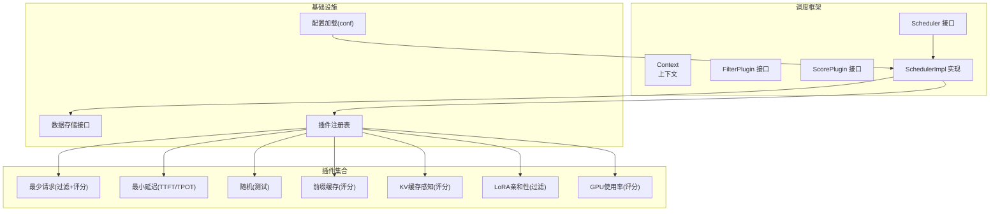
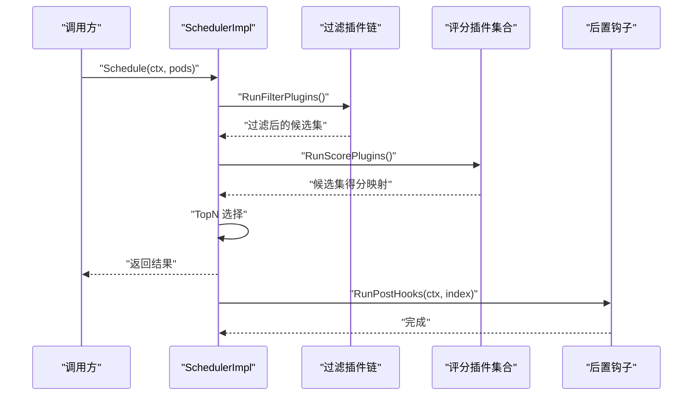
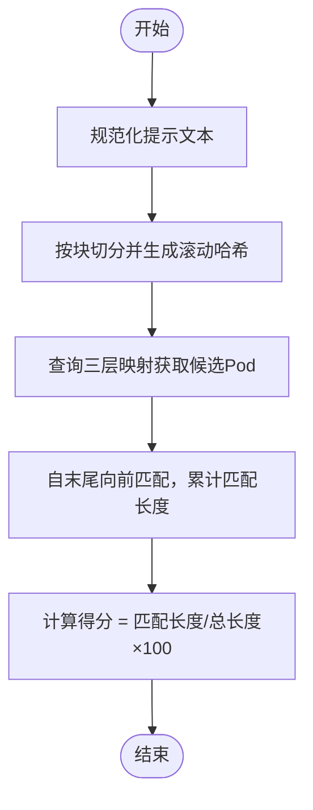
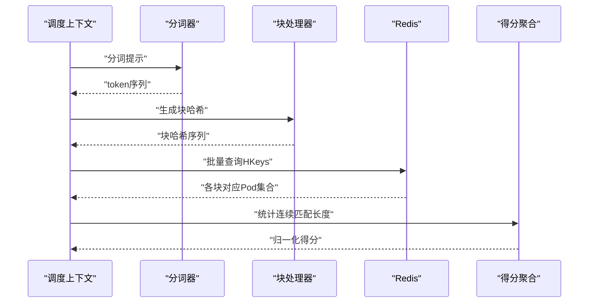
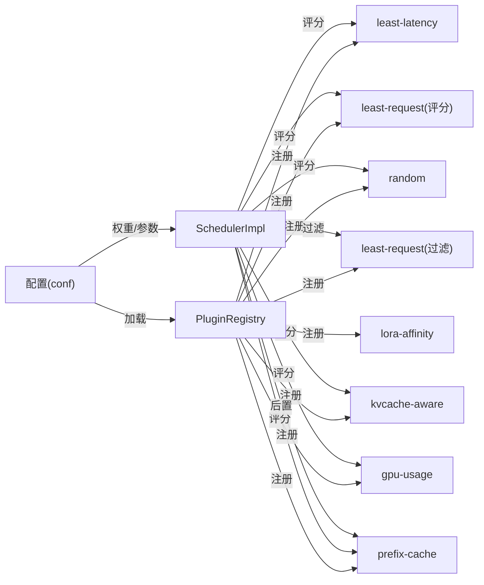

# 调度算法实现

<cite>
**本文引用的文件**
- [pkg/kthena-router/scheduler/scheduler.go](file://pkg/kthena-router/scheduler/scheduler.go)
- [pkg/kthena-router/scheduler/scheduler_impl.go](file://pkg/kthena-router/scheduler/scheduler_impl.go)
- [pkg/kthena-router/scheduler/factory.go](file://pkg/kthena-router/scheduler/factory.go)
- [pkg/kthena-router/scheduler/plugins/least_latency.go](file://pkg/kthena-router/scheduler/plugins/least_latency.go)
- [pkg/kthena-router/scheduler/plugins/least_request.go](file://pkg/kthena-router/scheduler/plugins/least_request.go)
- [pkg/kthena-router/scheduler/plugins/random.go](file://pkg/kthena-router/scheduler/plugins/random.go)
- [pkg/kthena-router/scheduler/plugins/kvcache_aware.go](file://pkg/kthena-router/scheduler/plugins/kvcache_aware.go)
- [pkg/kthena-router/scheduler/plugins/prefix.go](file://pkg/kthena-router/scheduler/plugins/prefix.go)
- [pkg/kthena-router/scheduler/plugins/lora_affinity.go](file://pkg/kthena-router/scheduler/plugins/lora_affinity.go)
- [pkg/kthena-router/scheduler/plugins/gpu.go](file://pkg/kthena-router/scheduler/plugins/gpu.go)
- [pkg/kthena-router/scheduler/plugins/cache/prefix_store.go](file://pkg/kthena-router/scheduler/plugins/cache/prefix_store.go)
- [pkg/kthena-router/scheduler/plugins/conf/conf.go](file://pkg/kthena-router/scheduler/plugins/conf/conf.go)
- [pkg/kthena-router/scheduler/testdata/configmap.yaml](file://pkg/kthena-router/scheduler/testdata/configmap.yaml)
- [docs/kthena/blog/2025-09-09-benchmark/index.md](file://docs/kthena/blog/2025-09-09-benchmark/index.md)
</cite>

## 目录
1. [简介](#简介)
2. [项目结构](#项目结构)
3. [核心组件](#核心组件)
4. [架构总览](#架构总览)
5. [详细组件分析](#详细组件分析)
6. [依赖分析](#依赖分析)
7. [性能考虑](#性能考虑)
8. [故障排查指南](#故障排查指南)
9. [结论](#结论)
10. [附录](#附录)

## 简介
本文件面向 Kthena 路由器调度子系统，系统性梳理并文档化各类调度算法的实现原理、计算逻辑、权重与优先级机制、插件注册流程、配置参数与性能特征，并提供算法选择指南、调优建议与实际应用案例。重点覆盖以下算法与能力：
- 最小延迟调度（TTFT/TPOT 加权）
- 最少请求调度（等待队列长度与运行中请求数）
- 随机调度（仅用于测试验证）
- KV 缓存感知调度（基于 Redis 的 token 块哈希匹配）
- 前缀匹配调度（基于滚动哈希的前缀缓存）
- LoRA 亲和性过滤
- GPU 资源调度（显存缓存使用率）

同时，文档给出调度器的插件注册与配置加载流程、复杂度分析、内存优化策略与并发处理要点。

## 项目结构
调度子系统位于 kthena-router 模块下，采用“框架 + 插件”的可扩展设计：
- 框架层：定义调度上下文、插件接口、调度器实现与工厂
- 插件层：按职责拆分，包含评分与过滤两类插件
- 配置层：支持从配置中心或默认值加载调度器与插件参数

图示来源
- [pkg/kthena-router/scheduler/scheduler.go:25-28](file://pkg/kthena-router/scheduler/scheduler.go#L25-L28)
- [pkg/kthena-router/scheduler/scheduler_impl.go:40-47](file://pkg/kthena-router/scheduler/scheduler_impl.go#L40-L47)
- [pkg/kthena-router/scheduler/factory.go:29-63](file://pkg/kthena-router/scheduler/factory.go#L29-L63)

章节来源
- [pkg/kthena-router/scheduler/scheduler.go:17-28](file://pkg/kthena-router/scheduler/scheduler.go#L17-L28)
- [pkg/kthena-router/scheduler/scheduler_impl.go:59-99](file://pkg/kthena-router/scheduler/scheduler_impl.go#L59-L99)
- [pkg/kthena-router/scheduler/factory.go:66-95](file://pkg/kthena-router/scheduler/factory.go#L66-L95)

## 核心组件
- 调度器接口与实现
  - 接口定义了 Schedule 与 RunPostHooks 两个关键方法，分别负责选择候选 Pod 与执行后置钩子（如前缀缓存写入）。
  - 实现类维护过滤插件列表、评分插件列表与后置钩子列表，并在调度过程中依次执行。
- 插件注册表
  - 统一管理评分与过滤插件的构建器，提供注册、检索与默认插件装配能力。
- 配置加载
  - 支持从外部配置加载调度器参数（启用/禁用插件、权重、插件参数），并对冲突进行处理（例如随机插件与其他评分插件混用时自动移除随机插件）。

章节来源
- [pkg/kthena-router/scheduler/scheduler.go:25-28](file://pkg/kthena-router/scheduler/scheduler.go#L25-L28)
- [pkg/kthena-router/scheduler/scheduler_impl.go:40-47](file://pkg/kthena-router/scheduler/scheduler_impl.go#L40-L47)
- [pkg/kthena-router/scheduler/factory.go:29-63](file://pkg/kthena-router/scheduler/factory.go#L29-L63)
- [pkg/kthena-router/scheduler/plugins/conf/conf.go:93-125](file://pkg/kthena-router/scheduler/plugins/conf/conf.go#L93-L125)

## 架构总览
调度器在一次调度周期内遵循如下流程：
1) 过滤阶段：按顺序执行过滤插件，剔除不满足条件的候选 Pod。
2) 评分阶段：对剩余候选 Pod 并行执行各评分插件，按权重累加得到最终得分。
3) 选择阶段：对候选集按得分排序，选取 TopN 作为最佳候选。
4) 后置阶段：执行后置钩子（如前缀缓存写入）。

图示来源
- [pkg/kthena-router/scheduler/scheduler_impl.go:101-165](file://pkg/kthena-router/scheduler/scheduler_impl.go#L101-L165)
- [pkg/kthena-router/scheduler/scheduler_impl.go:167-223](file://pkg/kthena-router/scheduler/scheduler_impl.go#L167-L223)

## 详细组件分析

### 最小延迟调度（TTFT/TPOT 加权）
- 计算逻辑
  - 首次遍历求得 TTFT 与 TPOT 的全局最值；若存在波动，则对每个指标做线性归一化到 [0,100] 区间；最终得分为两者的加权组合。
  - 权重因子可通过插件参数配置，默认值为 0.5。
- 适用场景
  - 对首 token 延迟（TTFT）与后续 token 延迟（TPOT）敏感的在线推理服务。
- 复杂度
  - 时间复杂度 O(N)，空间复杂度 O(1)。
- 配置参数
  - TTFTTPOTWeightFactor：TTFT 权重因子（0~1）。
- 性能特征
  - 低开销、实时性强；当所有 Pod 延迟一致时退化为相同分数。

章节来源
- [pkg/kthena-router/scheduler/plugins/least_latency.go:66-96](file://pkg/kthena-router/scheduler/plugins/least_latency.go#L66-L96)
- [pkg/kthena-router/scheduler/plugins/least_latency.go:98-130](file://pkg/kthena-router/scheduler/plugins/least_latency.go#L98-L130)

### 最少请求调度（等待队列 + 运行中请求数）
- 计算逻辑
  - 基础分 = 运行中请求数 + 100 × 等待请求数；随后以最大基础分做百分比归一，得到 [0,100] 分数。
  - 过滤阶段通过阈值剔除等待队列过长的 Pod。
- 适用场景
  - 需要避免将新请求投向已严重积压的 Pod。
- 复杂度
  - 时间复杂度 O(N)，空间复杂度 O(N)（基础分映射）。
- 配置参数
  - maxWaitingRequests：等待队列阈值（默认 10）。
- 性能特征
  - 通过放大等待队列权重抑制拥塞传播；对突发流量有平滑作用。

章节来源
- [pkg/kthena-router/scheduler/plugins/least_request.go:62-96](file://pkg/kthena-router/scheduler/plugins/least_request.go#L62-L96)

### 随机调度（测试用途）
- 计算逻辑
  - 为每个候选 Pod 生成独立的 [0,100] 随机分数。
- 适用场景
  - 测试调度器行为、对比基准。
- 复杂度
  - 时间复杂度 O(N)，空间复杂度 O(N)。
- 注意事项
  - 不应与其它评分插件混合使用，否则会破坏调度智能性。

章节来源
- [pkg/kthena-router/scheduler/plugins/random.go:58-73](file://pkg/kthena-router/scheduler/plugins/random.go#L58-L73)
- [docs/kthena/blog/2025-09-09-benchmark/index.md:188-201](file://docs/kthena/blog/2025-09-09-benchmark/index.md#L188-L201)

### 前缀匹配调度（Prefix Cache）
- 计算逻辑
  - 将提示文本按固定字节大小分块，结合模型名生成滚动哈希序列；评分等于“最长匹配前缀块数 / 总块数 × 100”。
  - 使用三层映射（模型 → 哈希 → Pod）与 LRU 缓存记录每 Pod 的哈希序列，支持 TopK 返回与异步淘汰。
- 适用场景
  - 类似提示高频复用的推理场景，提升缓存命中率。
- 复杂度
  - 分块与哈希 O(M)，查找匹配 O(M×TopK/Shards)；内存占用与哈希容量成正比。
- 配置参数
  - blockSizeToHash、maxBlocksToMatch、maxHashCacheSize、topKMatches。
- 性能特征
  - 通过哈希链性质，匹配只需从末尾向前推进；LRU 保证内存可控。

图示来源
- [pkg/kthena-router/scheduler/plugins/prefix.go:162-188](file://pkg/kthena-router/scheduler/plugins/prefix.go#L162-L188)
- [pkg/kthena-router/scheduler/plugins/cache/prefix_store.go:138-195](file://pkg/kthena-router/scheduler/plugins/cache/prefix_store.go#L138-L195)

章节来源
- [pkg/kthena-router/scheduler/plugins/prefix.go:107-156](file://pkg/kthena-router/scheduler/plugins/prefix.go#L107-L156)
- [pkg/kthena-router/scheduler/plugins/cache/prefix_store.go:67-94](file://pkg/kthena-router/scheduler/plugins/cache/prefix_store.go#L67-L94)

### KV 缓存感知调度（KV Cache Aware）
- 计算逻辑
  - 使用远程分词器将提示分词；按固定块大小切分 token 序列，计算标准化哈希；批量查询 Redis 中各块对应的已缓存 Pod 列表；统计各 Pod 的连续块匹配长度并归一化为得分。
- 适用场景
  - 多实例共享 KV 缓存的推理场景，最大化跨实例缓存命中。
- 复杂度
  - 分词与哈希 O(T)，Redis 批量查询 O(B)；得分聚合 O(P)（P 为候选 Pod 数）。
- 配置参数
  - blockSizeToHash、maxBlocksToMatch。
- 性能特征
  - 通过分布式 Redis 协同缓存信息；限制最大块数避免过度查询；哈希标准化确保兼容性。

图示来源
- [pkg/kthena-router/scheduler/plugins/kvcache_aware.go:153-192](file://pkg/kthena-router/scheduler/plugins/kvcache_aware.go#L153-L192)
- [pkg/kthena-router/scheduler/plugins/kvcache_aware.go:194-238](file://pkg/kthena-router/scheduler/plugins/kvcache_aware.go#L194-L238)
- [pkg/kthena-router/scheduler/plugins/kvcache_aware.go:247-299](file://pkg/kthena-router/scheduler/plugins/kvcache_aware.go#L247-L299)

章节来源
- [pkg/kthena-router/scheduler/plugins/kvcache_aware.go:107-140](file://pkg/kthena-router/scheduler/plugins/kvcache_aware.go#L107-L140)

### LoRA 亲和性调度（过滤）
- 计算逻辑
  - 仅保留包含当前请求模型（含 LoRA 变体）的 Pod。
- 适用场景
  - 部署多 LoRA 变体且需强亲和性的推理场景。
- 复杂度
  - 时间复杂度 O(N)。

章节来源
- [pkg/kthena-router/scheduler/plugins/lora_affinity.go:43-47](file://pkg/kthena-router/scheduler/plugins/lora_affinity.go#L43-L47)

### GPU 资源调度（显存缓存使用率）
- 计算逻辑
  - 得分 = (1 − 显存缓存使用率) × 100。
- 适用场景
  - 需要在多模型共享 GPU 的情况下，优先选择空闲显存较多的 Pod。
- 复杂度
  - 时间复杂度 O(N)。

章节来源
- [pkg/kthena-router/scheduler/plugins/gpu.go:41-49](file://pkg/kthena-router/scheduler/plugins/gpu.go#L41-L49)

## 依赖分析
- 插件注册与装配
  - 默认注册评分插件：GPU 使用率、最小延迟、最少请求、随机、前缀缓存、KV 缓存感知。
  - 默认注册过滤插件：最少请求、LoRA 亲和性。
  - 通过配置加载插件启用/禁用与权重设置；冲突检测自动移除随机插件。
- 调度器实现
  - 过滤插件链式执行，任一插件清空候选集即失败。
  - 评分插件得分按权重累加，最终 TopN 选择；后置钩子在选中 Pod 上执行。

图示来源
- [pkg/kthena-router/scheduler/factory.go:66-95](file://pkg/kthena-router/scheduler/factory.go#L66-L95)
- [pkg/kthena-router/scheduler/scheduler_impl.go:59-99](file://pkg/kthena-router/scheduler/scheduler_impl.go#L59-L99)
- [pkg/kthena-router/scheduler/plugins/conf/conf.go:93-125](file://pkg/kthena-router/scheduler/plugins/conf/conf.go#L93-L125)

章节来源
- [pkg/kthena-router/scheduler/factory.go:66-95](file://pkg/kthena-router/scheduler/factory.go#L66-L95)
- [pkg/kthena-router/scheduler/scheduler_impl.go:59-99](file://pkg/kthena-router/scheduler/scheduler_impl.go#L59-L99)

## 性能考虑
- 时间复杂度
  - 最少请求与 GPU 使用率：O(N)
  - 最小延迟：O(N)
  - 前缀缓存：O(M×TopK/Shards)，M 为块数
  - KV 缓存感知：O(T+B)，T 为分词与哈希，B 为 Redis 查询
- 内存优化
  - 前缀缓存使用三层映射与 LRU，按模型分片（Shards=32）降低锁竞争；哈希容量与 TopK 可控。
  - KV 缓存感知限制最大块数，避免过多 Redis 查询。
- 并发与可观测性
  - 插件执行时间记录到指标，便于定位瓶颈。
  - PD 拆分（Prefill/Decode）路径下，先对 Decode 评分再对同组 Prefill 评分，减少无效计算。

章节来源
- [pkg/kthena-router/scheduler/plugins/cache/prefix_store.go:34-65](file://pkg/kthena-router/scheduler/plugins/cache/prefix_store.go#L34-L65)
- [pkg/kthena-router/scheduler/scheduler_impl.go:187-223](file://pkg/kthena-router/scheduler/scheduler_impl.go#L187-L223)

## 故障排查指南
- 全部 Pod 被过滤
  - 检查过滤插件配置与阈值（如最少请求的等待队列阈值过高）。
  - 关注日志中“pods have all been filtered out by …”错误。
- 评分插件冲突
  - 若同时启用随机插件与其他评分插件，系统会自动移除随机插件并告警。
- KV 缓存感知异常
  - 检查 Redis 客户端初始化与网络连通性；确认块大小与最大块数配置合理。
- 前缀缓存未命中
  - 调整块大小、最大块数与缓存容量；确认提示规范化与分词器可用。

章节来源
- [pkg/kthena-router/scheduler/scheduler_impl.go:179-182](file://pkg/kthena-router/scheduler/scheduler_impl.go#L179-L182)
- [pkg/kthena-router/scheduler/plugins/conf/conf.go:107-125](file://pkg/kthena-router/scheduler/plugins/conf/conf.go#L107-L125)
- [pkg/kthena-router/scheduler/plugins/kvcache_aware.go:196-238](file://pkg/kthena-router/scheduler/plugins/kvcache_aware.go#L196-L238)
- [pkg/kthena-router/scheduler/plugins/prefix.go:116-156](file://pkg/kthena-router/scheduler/plugins/prefix.go#L116-L156)

## 结论
Kthena 调度子系统通过模块化的插件体系实现了对多种调度目标的统一建模。推荐在生产环境默认启用“最少请求 + 最小延迟 + 前缀缓存”，并在需要跨实例缓存协同时引入“KV 缓存感知”。针对不同工作负载与硬件约束，可灵活调整权重与参数，结合指标观测持续优化。

## 附录

### 算法选择与调优指南
- 在线低时延服务
  - 优先启用“最小延迟”；“最少请求”权重可略增以抑制拥塞。
- 高吞吐批处理
  - 优先启用“最少请求”；“前缀缓存”有助于重复提示场景。
- 多实例共享 KV
  - 引入“KV 缓存感知”，适当增大最大块数与分词块大小。
- 多 LoRA 场景
  - 启用“LoRA 亲和性”过滤，确保模型亲和性。

### 配置参数速览
- 最少请求（过滤+评分）
  - 参数：maxWaitingRequests（默认 10）
- 最小延迟
  - 参数：TTFTTPOTWeightFactor（默认 0.5）
- 前缀缓存
  - 参数：blockSizeToHash、maxBlocksToMatch、maxHashCacheSize、topKMatches
- KV 缓存感知
  - 参数：blockSizeToHash、maxBlocksToMatch
- GPU 使用率
  - 无额外参数

章节来源
- [pkg/kthena-router/scheduler/testdata/configmap.yaml:1-30](file://pkg/kthena-router/scheduler/testdata/configmap.yaml#L1-L30)
- [pkg/kthena-router/scheduler/plugins/least_request.go:39-50](file://pkg/kthena-router/scheduler/plugins/least_request.go#L39-L50)
- [pkg/kthena-router/scheduler/plugins/least_latency.go:42-53](file://pkg/kthena-router/scheduler/plugins/least_latency.go#L42-L53)
- [pkg/kthena-router/scheduler/plugins/prefix.go:107-112](file://pkg/kthena-router/scheduler/plugins/prefix.go#L107-L112)
- [pkg/kthena-router/scheduler/plugins/kvcache_aware.go:66-69](file://pkg/kthena-router/scheduler/plugins/kvcache_aware.go#L66-L69)