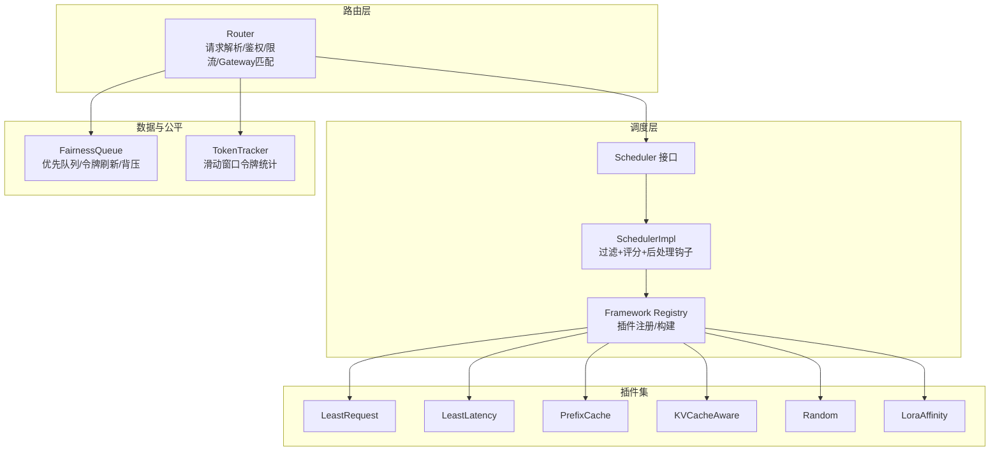
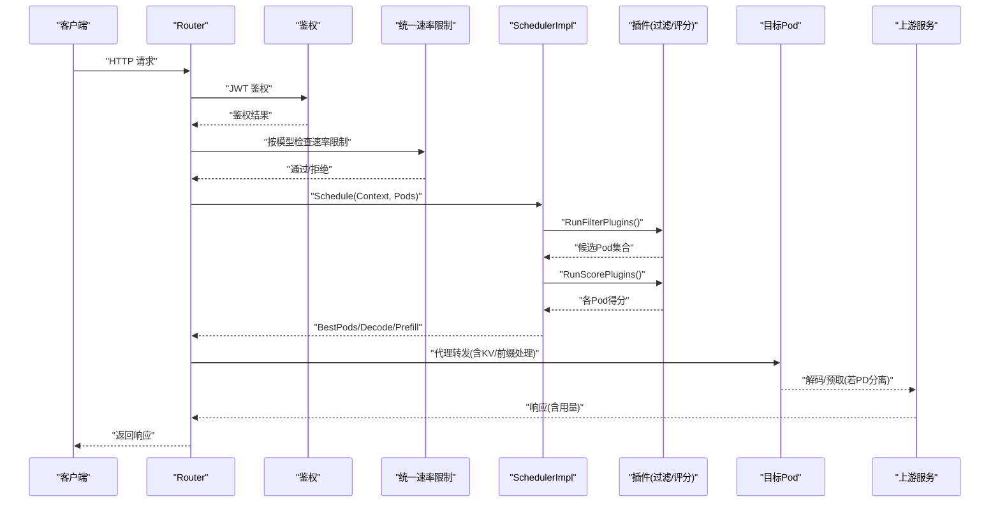
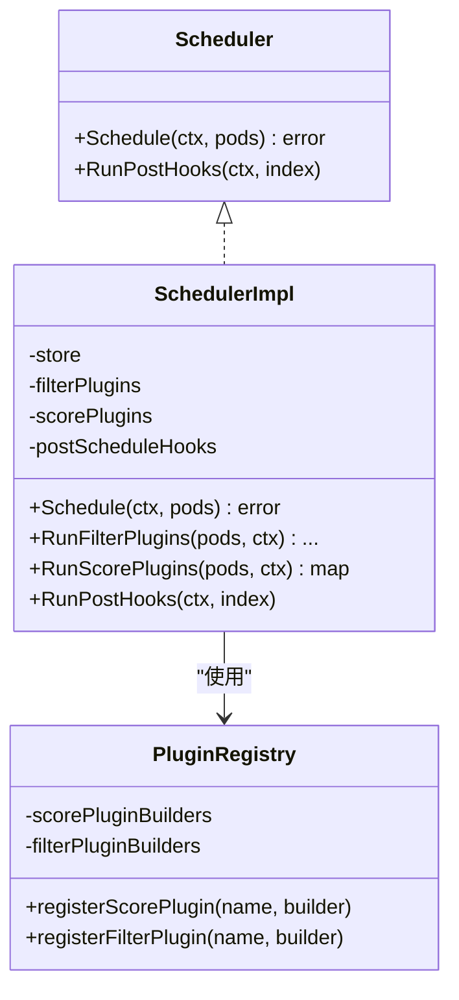
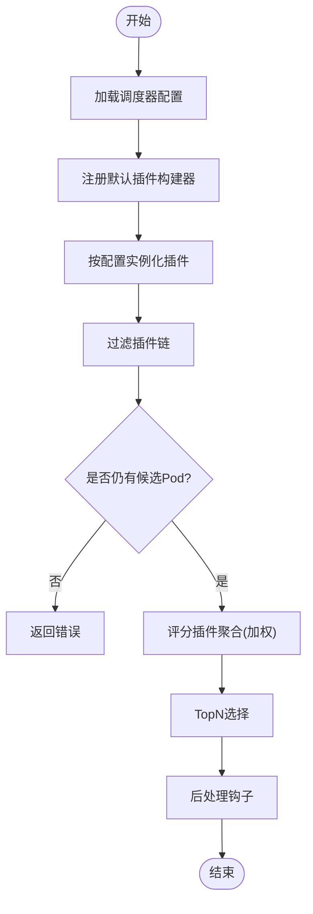
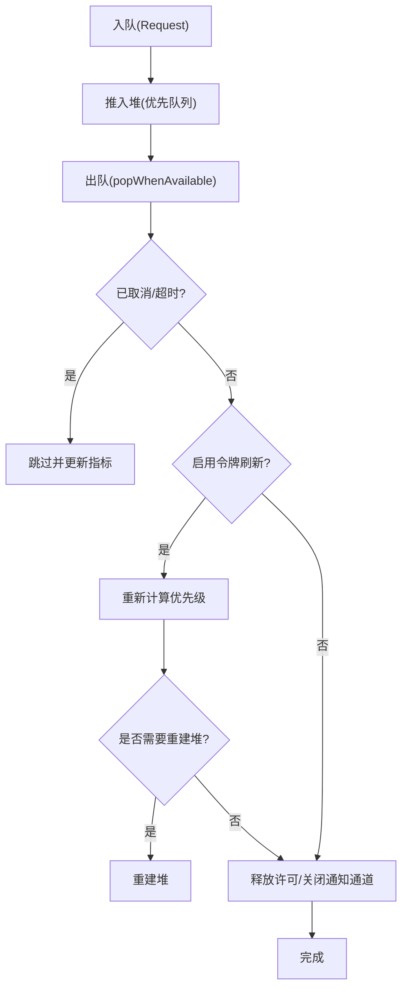
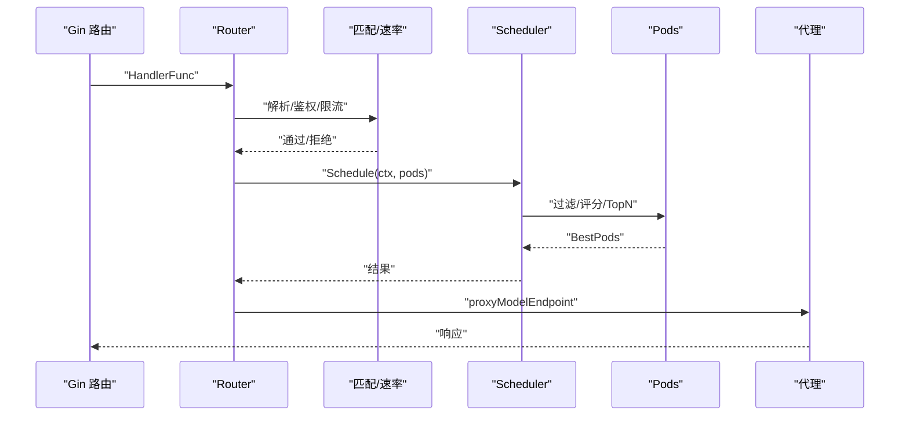
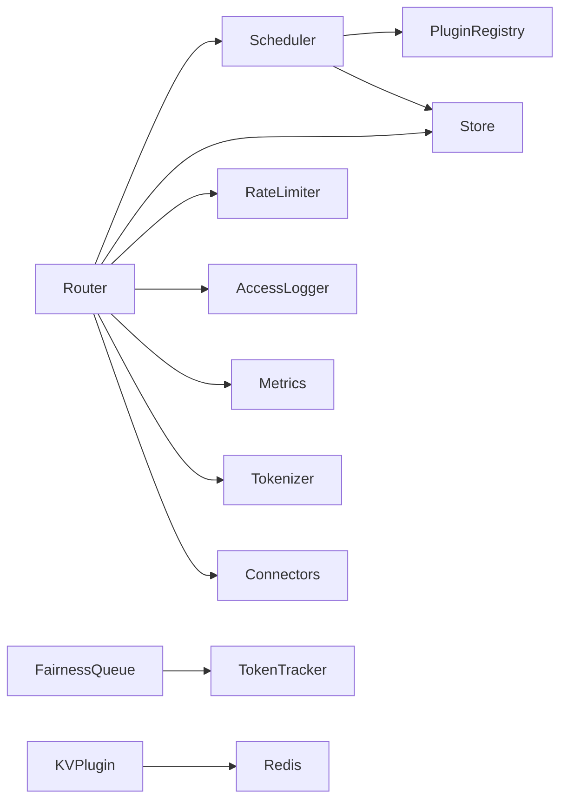

# 路由与调度系统

<cite>
**本文引用的文件**
- [cmd/kthena-router/main.go](file://cmd/kthena-router/main.go)
- [pkg/kthena-router/router/router.go](file://pkg/kthena-router/router/router.go)
- [pkg/kthena-router/scheduler/scheduler.go](file://pkg/kthena-router/scheduler/scheduler.go)
- [pkg/kthena-router/scheduler/scheduler_impl.go](file://pkg/kthena-router/scheduler/scheduler_impl.go)
- [pkg/kthena-router/scheduler/factory.go](file://pkg/kthena-router/scheduler/factory.go)
- [pkg/kthena-router/datastore/fairness_queue.go](file://pkg/kthena-router/datastore/fairness_queue.go)
- [pkg/kthena-router/datastore/token_tracker.go](file://pkg/kthena-router/datastore/token_tracker.go)
- [pkg/kthena-router/scheduler/plugins/least_request.go](file://pkg/kthena-router/scheduler/plugins/least_request.go)
- [pkg/kthena-router/scheduler/plugins/least_latency.go](file://pkg/kthena-router/scheduler/plugins/least_latency.go)
- [pkg/kthena-router/scheduler/plugins/prefix.go](file://pkg/kthena-router/scheduler/plugins/prefix.go)
- [pkg/kthena-router/scheduler/plugins/random.go](file://pkg/kthena-router/scheduler/plugins/random.go)
- [pkg/kthena-router/scheduler/plugins/kvcache_aware.go](file://pkg/kthena-router/scheduler/plugins/kvcache_aware.go)
- [pkg/kthena-router/scheduler/plugins/lora_affinity.go](file://pkg/kthena-router/scheduler/plugins/lora_affinity.go)
</cite>

## 目录
1. [简介](#简介)
2. [项目结构](#项目结构)
3. [核心组件](#核心组件)
4. [架构总览](#架构总览)
5. [详细组件分析](#详细组件分析)
6. [依赖分析](#依赖分析)
7. [性能考虑](#性能考虑)
8. [故障排查指南](#故障排查指南)
9. [结论](#结论)
10. [附录](#附录)

## 简介
本文件面向 Kthena 路由与调度系统，聚焦于“调度器”的核心架构与实现细节，涵盖调度接口定义、调度实现逻辑、插件系统设计、调度算法（最小延迟、最少请求、随机、KV 缓存感知、前缀匹配等）、公平队列与令牌跟踪机制、负载均衡算法、配置示例、插件开发指南以及性能调优建议。文档同时提供调度决策流程图、序列图与类图，帮助读者从高层到代码级全面理解系统。

## 项目结构
Kthena 的路由与调度系统主要位于 pkg/kthena-router 目录下，核心模块包括：
- 路由器：负责请求解析、鉴权、速率限制、网关 API 匹配、调度与代理转发
- 调度器：基于插件框架的可扩展调度器，支持过滤与评分阶段
- 数据存储与公平队列：提供模型/用户维度的令牌跟踪、公平队列与令牌刷新
- 插件：最少请求、最少延迟、随机、前缀匹配、KV 缓存感知、LoRA 亲和等

图表来源
- [pkg/kthena-router/router/router.go:73-169](file://pkg/kthena-router/router/router.go#L73-L169)
- [pkg/kthena-router/scheduler/scheduler.go:25-28](file://pkg/kthena-router/scheduler/scheduler.go#L25-L28)
- [pkg/kthena-router/scheduler/scheduler_impl.go:59-99](file://pkg/kthena-router/scheduler/scheduler_impl.go#L59-L99)
- [pkg/kthena-router/scheduler/factory.go:66-95](file://pkg/kthena-router/scheduler/factory.go#L66-L95)
- [pkg/kthena-router/datastore/fairness_queue.go:121-145](file://pkg/kthena-router/datastore/fairness_queue.go#L121-L145)
- [pkg/kthena-router/datastore/token_tracker.go:96-110](file://pkg/kthena-router/datastore/token_tracker.go#L96-L110)

章节来源
- [pkg/kthena-router/router/router.go:73-169](file://pkg/kthena-router/router/router.go#L73-L169)
- [pkg/kthena-router/scheduler/scheduler.go:25-28](file://pkg/kthena-router/scheduler/scheduler.go#L25-L28)
- [pkg/kthena-router/scheduler/scheduler_impl.go:59-99](file://pkg/kthena-router/scheduler/scheduler_impl.go#L59-L99)
- [pkg/kthena-router/scheduler/factory.go:66-95](file://pkg/kthena-router/scheduler/factory.go#L66-L95)
- [pkg/kthena-router/datastore/fairness_queue.go:121-145](file://pkg/kthena-router/datastore/fairness_queue.go#L121-L145)
- [pkg/kthena-router/datastore/token_tracker.go:96-110](file://pkg/kthena-router/datastore/token_tracker.go#L96-L110)

## 核心组件
- 路由器 Router
  - 负责请求解析、鉴权、统一速率限制、访问日志、网关 API 匹配、调度与代理转发
  - 支持公平调度开关与公平队列参数配置
- 调度器 Scheduler/SchedulerImpl
  - 定义调度接口；实现过滤插件链、评分插件聚合、TopN 选择与后处理钩子
  - 支持 PD 分离模式下的预取/解码配对调度
- 公平队列与令牌跟踪
  - 公平队列：基于优先队列的并发/速率控制、可选令牌刷新、堆重建阈值
  - 令牌跟踪：滑动窗口令牌计数器，支持输入/输出权重与请求计数
- 插件系统
  - 注册表管理插件构建器；默认注册最少请求、最少延迟、随机、前缀缓存、KV 缓存感知、LoRA 亲和等

章节来源
- [pkg/kthena-router/router/router.go:73-169](file://pkg/kthena-router/router/router.go#L73-L169)
- [pkg/kthena-router/scheduler/scheduler.go:25-28](file://pkg/kthena-router/scheduler/scheduler.go#L25-L28)
- [pkg/kthena-router/scheduler/scheduler_impl.go:101-165](file://pkg/kthena-router/scheduler/scheduler_impl.go#L101-L165)
- [pkg/kthena-router/datastore/fairness_queue.go:71-88](file://pkg/kthena-router/datastore/fairness_queue.go#L71-L88)
- [pkg/kthena-router/datastore/token_tracker.go:34-39](file://pkg/kthena-router/datastore/token_tracker.go#L34-L39)

## 架构总览
下图展示从请求进入路由器到调度与代理的关键交互：

图表来源
- [pkg/kthena-router/router/router.go:204-315](file://pkg/kthena-router/router/router.go#L204-L315)
- [pkg/kthena-router/scheduler/scheduler_impl.go:101-165](file://pkg/kthena-router/scheduler/scheduler_impl.go#L101-L165)
- [pkg/kthena-router/scheduler/scheduler_impl.go:167-229](file://pkg/kthena-router/scheduler/scheduler_impl.go#L167-L229)

章节来源
- [pkg/kthena-router/router/router.go:204-315](file://pkg/kthena-router/router/router.go#L204-L315)
- [pkg/kthena-router/scheduler/scheduler_impl.go:101-165](file://pkg/kthena-router/scheduler/scheduler_impl.go#L101-L165)

## 详细组件分析

### 调度器接口与实现
- 接口定义
  - 提供 Schedule(ctx, pods) 与 RunPostHooks(ctx, index) 两个核心方法
- 实现要点
  - 过滤阶段：依次应用过滤插件，任一插件剔除全部 Pod 将报错
  - 评分阶段：对每个插件计算得分并加权聚合，TopN 选择
  - PD 分离模式：先选出解码 Pod，再为每个解码 Pod 查找对应预取 Pod，形成配对
  - 后处理钩子：如前缀缓存插件在调度后写入命中哈希

图表来源
- [pkg/kthena-router/scheduler/scheduler.go:25-28](file://pkg/kthena-router/scheduler/scheduler.go#L25-L28)
- [pkg/kthena-router/scheduler/scheduler_impl.go:40-47](file://pkg/kthena-router/scheduler/scheduler_impl.go#L40-L47)
- [pkg/kthena-router/scheduler/factory.go:30-63](file://pkg/kthena-router/scheduler/factory.go#L30-L63)

章节来源
- [pkg/kthena-router/scheduler/scheduler.go:25-28](file://pkg/kthena-router/scheduler/scheduler.go#L25-L28)
- [pkg/kthena-router/scheduler/scheduler_impl.go:101-165](file://pkg/kthena-router/scheduler/scheduler_impl.go#L101-L165)
- [pkg/kthena-router/scheduler/factory.go:66-95](file://pkg/kthena-router/scheduler/factory.go#L66-L95)

### 插件系统设计与注册机制
- 注册表
  - 维护评分与过滤插件的构建器映射
  - 默认注册：最少请求、最少延迟、随机、前缀缓存、KV 缓存感知、LoRA 亲和
- 插件加载
  - 从调度器配置读取插件名、权重与参数，实例化并注入
  - 前缀缓存插件需在运行时根据参数构造
- 执行流程
  - 过滤插件链：短路式，任一为空则终止
  - 评分插件：线性叠加，带权重；记录插件耗时

图表来源
- [pkg/kthena-router/scheduler/scheduler_impl.go:59-99](file://pkg/kthena-router/scheduler/scheduler_impl.go#L59-L99)
- [pkg/kthena-router/scheduler/scheduler_impl.go:167-229](file://pkg/kthena-router/scheduler/scheduler_impl.go#L167-L229)
- [pkg/kthena-router/scheduler/factory.go:66-95](file://pkg/kthena-router/scheduler/factory.go#L66-L95)

章节来源
- [pkg/kthena-router/scheduler/factory.go:66-95](file://pkg/kthena-router/scheduler/factory.go#L66-L95)
- [pkg/kthena-router/scheduler/scheduler_impl.go:59-99](file://pkg/kthena-router/scheduler/scheduler_impl.go#L59-L99)

### 最少请求调度（LeastRequest）
- 过滤：保留等待请求数小于阈值的 Pod
- 评分：以“运行中 + 100×等待中”作为基分，反比归一到 0-100 分
- 参数：最大等待请求数（默认 10）

章节来源
- [pkg/kthena-router/scheduler/plugins/least_request.go:34-96](file://pkg/kthena-router/scheduler/plugins/least_request.go#L34-L96)

### 最少延迟调度（LeastLatency）
- 评分：分别计算 TTFT/TPOT 的 min-max 归一化分数，按权重组合
- 参数：TTFT/TPOT 权重因子（默认 0.5）

章节来源
- [pkg/kthena-router/scheduler/plugins/least_latency.go:37-130](file://pkg/kthena-router/scheduler/plugins/least_latency.go#L37-L130)

### 随机调度（Random）
- 评分：为每个 Pod 生成 0-100 的随机分，主要用于测试
- 注意：不建议与其他评分插件混用

章节来源
- [pkg/kthena-router/scheduler/plugins/random.go:37-73](file://pkg/kthena-router/scheduler/plugins/random.go#L37-L73)

### 前缀匹配调度（PrefixCache）
- 功能：基于滚动哈希的前缀匹配，提升 KV 缓存命中概率
- 流程：将提示切分为固定大小块，生成滚动哈希；查找命中最长前缀的 TopK Pod；得分=匹配块数/总块数×100
- 参数：块大小、最大匹配块数、哈希缓存容量、TopK 结果数（默认 64/128/50000/5）

章节来源
- [pkg/kthena-router/scheduler/plugins/prefix.go:99-206](file://pkg/kthena-router/scheduler/plugins/prefix.go#L99-L206)

### KV 缓存感知调度（KVCacheAware）
- 功能：基于 Redis 的分布式 KV 块哈希查询，统计各 Pod 的连续块命中长度
- 流程：分词 → 分块 → 计算标准化哈希 → Redis Pipeline 查询命中 Pod → 计算得分
- 参数：块大小、最大匹配块数（默认 128/128）

章节来源
- [pkg/kthena-router/scheduler/plugins/kvcache_aware.go:107-192](file://pkg/kthena-router/scheduler/plugins/kvcache_aware.go#L107-L192)
- [pkg/kthena-router/scheduler/plugins/kvcache_aware.go:194-238](file://pkg/kthena-router/scheduler/plugins/kvcache_aware.go#L194-L238)
- [pkg/kthena-router/scheduler/plugins/kvcache_aware.go:247-299](file://pkg/kthena-router/scheduler/plugins/kvcache_aware.go#L247-L299)

### LoRA 亲和过滤（LoraAffinity）
- 功能：仅保留包含当前模型（LoRA）的 Pod
- 用途：与 LoRA 模型部署场景配合

章节来源
- [pkg/kthena-router/scheduler/plugins/lora_affinity.go:43-47](file://pkg/kthena-router/scheduler/plugins/lora_affinity.go#L43-L47)

### 公平队列与令牌跟踪
- 公平队列
  - 优先队列：按用户优先级与到达时间排序；支持取消/超时跳过
  - 可选令牌刷新：在出队时重新计算优先级，支持有限次刷新与堆重建
  - 两种出队模式：信号量模式（按可用容量）与 QPS 模式（定时器）
- 令牌跟踪
  - 滑动窗口：固定窗口大小（默认 5 分钟），支持输入/输出权重
  - 用户-模型维度统计：令牌累计与请求计数累计，支持热区压缩与并发安全

图表来源
- [pkg/kthena-router/datastore/fairness_queue.go:203-282](file://pkg/kthena-router/datastore/fairness_queue.go#L203-L282)
- [pkg/kthena-router/datastore/fairness_queue.go:336-412](file://pkg/kthena-router/datastore/fairness_queue.go#L336-L412)

章节来源
- [pkg/kthena-router/datastore/fairness_queue.go:71-88](file://pkg/kthena-router/datastore/fairness_queue.go#L71-L88)
- [pkg/kthena-router/datastore/fairness_queue.go:121-145](file://pkg/kthena-router/datastore/fairness_queue.go#L121-L145)
- [pkg/kthena-router/datastore/token_tracker.go:194-243](file://pkg/kthena-router/datastore/token_tracker.go#L194-L243)
- [pkg/kthena-router/datastore/token_tracker.go:309-356](file://pkg/kthena-router/datastore/token_tracker.go#L309-L356)

### 路由器处理流程与调度决策
- 请求入口：HandlerFunc 解析 JSON、提取模型名、设置访问日志与指标上下文
- 速率限制：统一速率限制器按模型维度检查输入/输出速率
- 路由匹配：优先 ModelServer 匹配，否则匹配 Gateway API 的 HTTPRoute 与 InferencePool
- 调度：根据 PD 是否分离走不同路径（聚合/配对），最终选择最佳 Pod
- 代理：支持普通聚合与 PD 分离（预取/解码）两种模式，记录用量并更新令牌

图表来源
- [pkg/kthena-router/router/router.go:204-315](file://pkg/kthena-router/router/router.go#L204-L315)
- [pkg/kthena-router/router/router.go:317-464](file://pkg/kthena-router/router/router.go#L317-L464)
- [pkg/kthena-router/router/router.go:714-780](file://pkg/kthena-router/router/router.go#L714-L780)

章节来源
- [pkg/kthena-router/router/router.go:204-315](file://pkg/kthena-router/router/router.go#L204-L315)
- [pkg/kthena-router/router/router.go:317-464](file://pkg/kthena-router/router/router.go#L317-L464)
- [pkg/kthena-router/router/router.go:714-780](file://pkg/kthena-router/router/router.go#L714-L780)

## 依赖分析
- 组件耦合
  - Router 依赖 Store、Scheduler、RateLimiter、AccessLogger、Metrics、Tokenizer、Connectors
  - SchedulerImpl 依赖 Store、插件注册表、MetricsRecorder
  - 公平队列与令牌跟踪相互协作，前者消费后者提供的优先级
- 外部依赖
  - Redis（KV 缓存感知插件）
  - Prometheus 指标（调度插件耗时、队列状态等）
  - Gateway API（HTTPRoute 匹配）

图表来源
- [pkg/kthena-router/router/router.go:91-169](file://pkg/kthena-router/router/router.go#L91-L169)
- [pkg/kthena-router/scheduler/scheduler_impl.go:59-99](file://pkg/kthena-router/scheduler/scheduler_impl.go#L59-L99)
- [pkg/kthena-router/scheduler/plugins/kvcache_aware.go:130-139](file://pkg/kthena-router/scheduler/plugins/kvcache_aware.go#L130-L139)

章节来源
- [pkg/kthena-router/router/router.go:91-169](file://pkg/kthena-router/router/router.go#L91-L169)
- [pkg/kthena-router/scheduler/scheduler_impl.go:59-99](file://pkg/kthena-router/scheduler/scheduler_impl.go#L59-L99)
- [pkg/kthena-router/scheduler/plugins/kvcache_aware.go:130-139](file://pkg/kthena-router/scheduler/plugins/kvcache_aware.go#L130-L139)

## 性能考虑
- 插件性能
  - 评分与过滤均记录耗时，便于定位瓶颈；建议在高 QPS 下减少插件数量或降低参数规模
- 前缀缓存
  - 控制块大小与最大匹配块数，避免过长提示导致过多哈希与内存占用
- KV 缓存感知
  - 使用 Pipeline 批量查询 Redis，注意超时与失败回退；合理设置块大小与最大块数
- 公平队列
  - 令牌刷新与堆重建有成本，建议根据流量特征调整阈值与刷新次数
- 速率限制
  - 统一速率限制器按模型维度维护，注意输入/输出令牌权重与突发配置

[本节为通用指导，无需特定文件引用]

## 故障排查指南
- 调度失败
  - 过滤阶段可能将所有 Pod 过滤掉，检查过滤插件参数与 Pod 指标
  - PD 分离模式找不到配对，确认 Store 中是否存在对应解码/预取 Pod
- 代理失败
  - 目标 Pod 不可达或连接异常，查看代理错误日志与指标
- 公平队列卡顿
  - 检查队列大小、出队模式（信号量/QPS）、令牌刷新与堆重建频率
- KV 缓存感知异常
  - Redis 连接失败或查询超时，检查连接配置与网络策略

章节来源
- [pkg/kthena-router/scheduler/scheduler_impl.go:167-184](file://pkg/kthena-router/scheduler/scheduler_impl.go#L167-L184)
- [pkg/kthena-router/scheduler/scheduler_impl.go:108-158](file://pkg/kthena-router/scheduler/scheduler_impl.go#L108-L158)
- [pkg/kthena-router/datastore/fairness_queue.go:336-412](file://pkg/kthena-router/datastore/fairness_queue.go#L336-L412)
- [pkg/kthena-router/scheduler/plugins/kvcache_aware.go:194-238](file://pkg/kthena-router/scheduler/plugins/kvcache_aware.go#L194-L238)

## 结论
Kthena 的调度系统通过插件化框架实现了灵活、可扩展的负载均衡与调度能力。结合公平队列与令牌跟踪，系统在多用户、多模型场景下提供了更公平的资源分配与可观测性。推荐在生产环境中根据业务特征调整插件配置、队列参数与速率限制策略，并持续监控调度插件耗时与队列状态，以获得稳定与高性能的推理服务体验。

[本节为总结性内容，无需特定文件引用]

## 附录

### 调度器配置示例（调度器配置项）
- 插件列表与权重
  - 示例：最少请求（权重 1）、最少延迟（权重 1）、前缀缓存（权重 1）
- 插件参数
  - 最少请求：最大等待请求数
  - 最少延迟：TTFT/TPOT 权重因子
  - 前缀缓存：块大小、最大匹配块数、哈希缓存容量、TopK 结果数
  - KV 缓存感知：块大小、最大匹配块数
- 公平队列参数
  - 并发上限、QPS、优先级刷新重试次数、堆重建阈值、令牌权重、请求计数权重

章节来源
- [pkg/kthena-router/scheduler/scheduler_impl.go:64-88](file://pkg/kthena-router/scheduler/scheduler_impl.go#L64-L88)
- [pkg/kthena-router/scheduler/plugins/least_request.go:39-55](file://pkg/kthena-router/scheduler/plugins/least_request.go#L39-L55)
- [pkg/kthena-router/scheduler/plugins/least_latency.go:42-58](file://pkg/kthena-router/scheduler/plugins/least_latency.go#L42-L58)
- [pkg/kthena-router/scheduler/plugins/prefix.go:107-156](file://pkg/kthena-router/scheduler/plugins/prefix.go#L107-L156)
- [pkg/kthena-router/scheduler/plugins/kvcache_aware.go:107-122](file://pkg/kthena-router/scheduler/plugins/kvcache_aware.go#L107-L122)
- [pkg/kthena-router/datastore/fairness_queue.go:31-64](file://pkg/kthena-router/datastore/fairness_queue.go#L31-L64)

### 插件开发指南
- 新增评分插件
  - 实现 framework.ScorePlugin 接口，提供名称与评分函数
  - 在注册表中注册构建器，支持从配置参数构造
- 新增过滤插件
  - 实现 framework.FilterPlugin 接口，提供过滤函数
- 参数化
  - 使用 YAML 反序列化参数，提供默认值与校验
- 性能与可观测性
  - 记录插件执行耗时；避免在评分中进行昂贵操作；必要时使用缓存

章节来源
- [pkg/kthena-router/scheduler/factory.go:29-63](file://pkg/kthena-router/scheduler/factory.go#L29-L63)
- [pkg/kthena-router/scheduler/factory.go:114-143](file://pkg/kthena-router/scheduler/factory.go#L114-L143)

### 关键环境变量与参数
- ENABLE_FAIRNESS_SCHEDULING：启用公平调度
- FAIRNESS_QUEUE_TIMEOUT：公平队列超时
- FAIRNESS_PRIORITY_TOKEN_WEIGHT：令牌权重
- FAIRNESS_PRIORITY_REQUEST_NUM_WEIGHT：请求计数权重
- ACCESS_LOG_*：访问日志格式与输出

章节来源
- [pkg/kthena-router/router/router.go:71-168](file://pkg/kthena-router/router/router.go#L71-L168)
- [pkg/kthena-router/router/router.go:125-154](file://pkg/kthena-router/router/router.go#L125-L154)