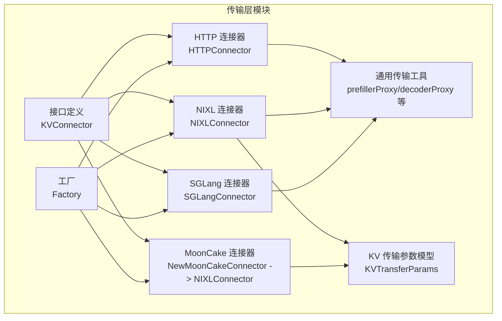
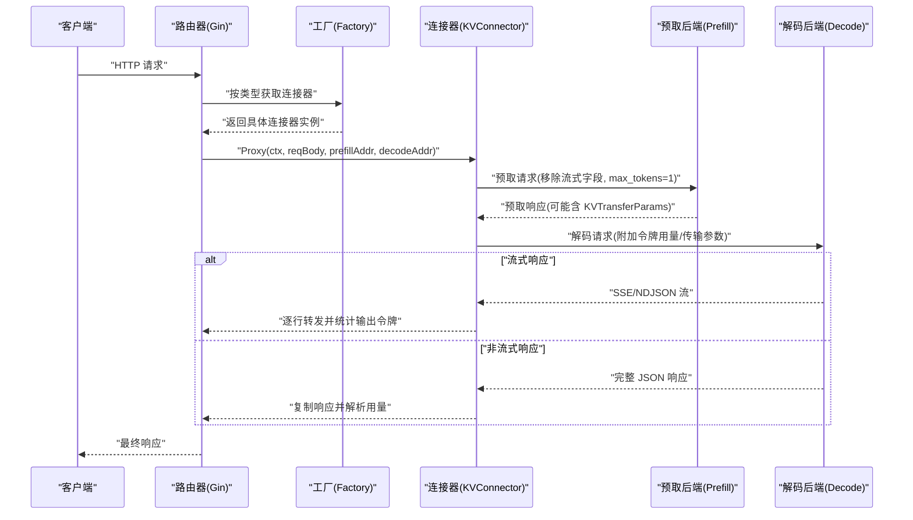
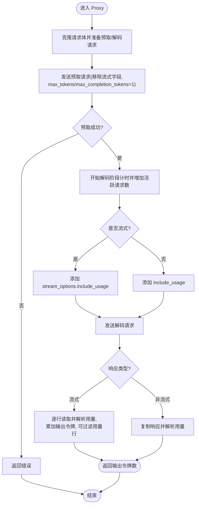
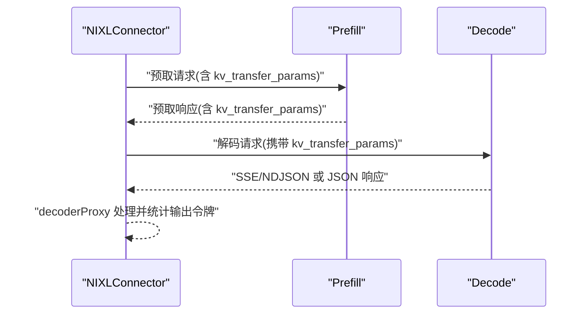
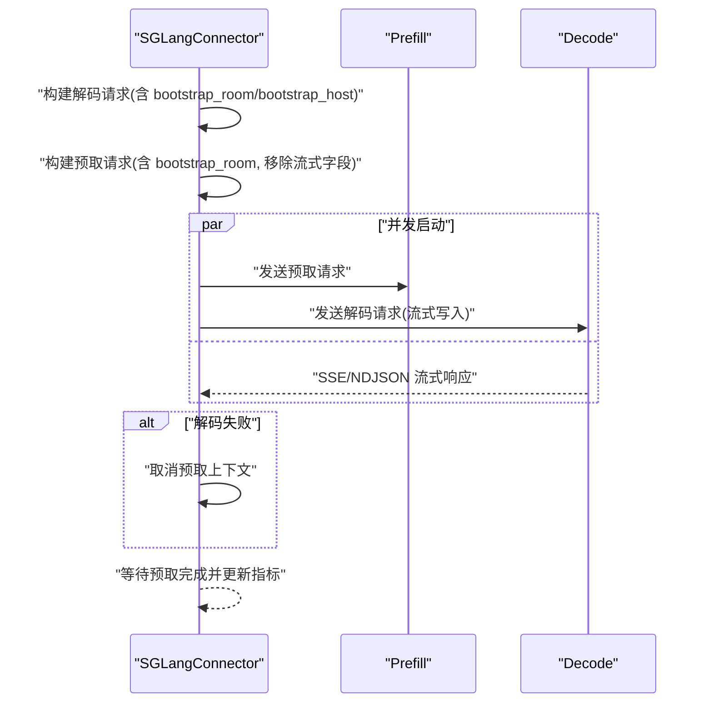
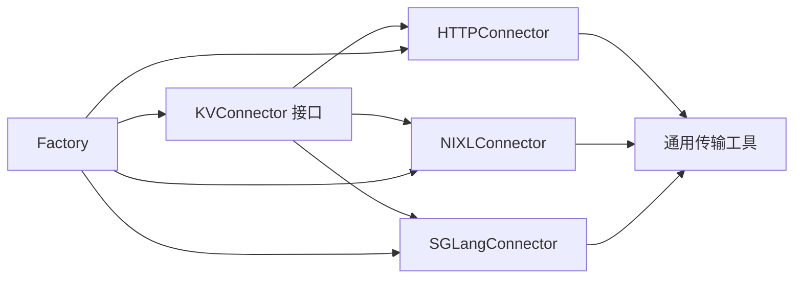

# 传输层实现

<cite>
**本文引用的文件**
- [transport.go](file://pkg/kthena-router/connectors/transport.go)
- [interface.go](file://pkg/kthena-router/connectors/interface.go)
- [types.go](file://pkg/kthena-router/connectors/types.go)
- [http.go](file://pkg/kthena-router/connectors/http.go)
- [factory.go](file://pkg/kthena-router/connectors/factory.go)
- [nixl.go](file://pkg/kthena-router/connectors/nixl.go)
- [sglang.go](file://pkg/kthena-router/connectors/sglang.go)
- [mooncake.go](file://pkg/kthena-router/connectors/mooncake.go)
- [transport_test.go](file://pkg/kthena-router/connectors/transport_test.go)
- [connectors_test.go](file://pkg/kthena-router/connectors/connectors_test.go)
- [test_helpers.go](file://pkg/kthena-router/connectors/test_helpers.go)
- [types.go](file://pkg/kthena-router/common/types.go)
</cite>

## 目录
1. [简介](#简介)
2. [项目结构](#项目结构)
3. [核心组件](#核心组件)
4. [架构总览](#架构总览)
5. [详细组件分析](#详细组件分析)
6. [依赖分析](#依赖分析)
7. [性能考虑](#性能考虑)
8. [故障排查指南](#故障排查指南)
9. [结论](#结论)
10. [附录](#附录)

## 简介
本文件系统性梳理 Kthena 路由器中的“传输层”实现，聚焦于预取-解码（prefill-decode）两阶段推理流程的连接建立、请求发送、响应接收与连接管理；同时覆盖抽象接口设计、协议适配与数据序列化/反序列化过程，以及连接池、超时与重试、错误传播等工程化细节。文档还给出配置项、性能调优建议与监控指标，并提供单元测试策略与模拟测试辅助工具的使用方法。

## 项目结构
传输层位于 pkg/kthena-router/connectors 目录，围绕 KV 缓存传输的抽象接口 KVConnector 展开，提供多种具体实现（HTTP/NIXL/SGLang/MoonCake），并通过工厂模式统一创建与选择。公共工具函数负责请求体改造、流式/非流式响应处理、内容类型判断与令牌用量解析等。



图表来源
- [interface.go:23-31](file://pkg/kthena-router/connectors/interface.go#L23-L31)
- [http.go:28-43](file://pkg/kthena-router/connectors/http.go#L28-L43)
- [nixl.go:34-51](file://pkg/kthena-router/connectors/nixl.go#L34-L51)
- [sglang.go:42-70](file://pkg/kthena-router/connectors/sglang.go#L42-L70)
- [mooncake.go:19-25](file://pkg/kthena-router/connectors/mooncake.go#L19-L25)
- [factory.go:21-60](file://pkg/kthena-router/connectors/factory.go#L21-L60)
- [transport.go:33-78](file://pkg/kthena-router/connectors/transport.go#L33-L78)
- [types.go:19-27](file://pkg/kthena-router/connectors/types.go#L19-L27)

章节来源
- [interface.go:17-31](file://pkg/kthena-router/connectors/interface.go#L17-L31)
- [factory.go:17-60](file://pkg/kthena-router/connectors/factory.go#L17-L60)

## 核心组件
- 抽象接口 KVConnector：定义名称与完整的预取-解码代理方法，屏蔽不同后端实现差异。
- 具体实现：
  - HTTPConnector：基于标准 HTTP 传输，支持流式/非流式响应转发与令牌用量统计。
  - NIXLConnector：面向高性能分布式内存 KV 的传输，通过预取阶段返回的 KVTransferParams 在解码阶段完成缓存传递。
  - SGLangConnector：针对 SGLang 拆分推理的专用实现，要求预取与解码并发启动并携带 bootstrap_room/主机信息以协调缓存交接。
  - MoonCakeConnector：与 NIXL 行为一致的桥接实现。
- 工厂 Factory：按类型注册并创建具体连接器，默认回退到 HTTP 实现。
- 通用传输工具：封装底层 RoundTrip、流式/非流式响应处理、请求体改造（移除流式字段、设置 max_tokens=1 等）与令牌用量解析。

章节来源
- [interface.go:23-31](file://pkg/kthena-router/connectors/interface.go#L23-L31)
- [http.go:28-119](file://pkg/kthena-router/connectors/http.go#L28-L119)
- [nixl.go:34-204](file://pkg/kthena-router/connectors/nixl.go#L34-L204)
- [sglang.go:42-221](file://pkg/kthena-router/connectors/sglang.go#L42-L221)
- [mooncake.go:19-25](file://pkg/kthena-router/connectors/mooncake.go#L19-L25)
- [factory.go:21-60](file://pkg/kthena-router/connectors/factory.go#L21-L60)
- [transport.go:33-226](file://pkg/kthena-router/connectors/transport.go#L33-L226)
- [types.go:19-27](file://pkg/kthena-router/connectors/types.go#L19-L27)

## 架构总览
传输层在路由层之上，负责将上游请求拆分为预取与解码两个阶段，并在解码阶段根据所选连接器进行 KV 缓存传输或直接转发。整体流程如下：



图表来源
- [http.go:63-119](file://pkg/kthena-router/connectors/http.go#L63-L119)
- [nixl.go:53-112](file://pkg/kthena-router/connectors/nixl.go#L53-L112)
- [sglang.go:72-195](file://pkg/kthena-router/connectors/sglang.go#L72-L195)
- [transport.go:33-78](file://pkg/kthena-router/connectors/transport.go#L33-L78)

## 详细组件分析

### 抽象接口与工厂
- 接口 KVConnector 定义名称与代理方法，确保不同实现对上层透明。
- 工厂支持注册多种连接器类型，默认回退到 HTTPConnector，便于扩展与兼容。

```mermaid
classDiagram
class KVConnector {
+Name() string
+Proxy(c, reqBody, prefillAddr, decodeAddr) (int, error)
}
class HTTPConnector {
-prefillRequest *http.Request
-decodeRequest *http.Request
+Name() string
+Proxy(...) (int, error)
}
class NIXLConnector {
-name string
-prefillRequest *http.Request
-decodeRequestBody map[string]interface{}
+Name() string
+Proxy(...) (int, error)
}
class SGLangConnector {
-prefillRequest *http.Request
-decodeRequest *http.Request
-bootstrapRoom int64
-lastPrefillAddr string
-lastDecodeAddr string
+Name() string
+Proxy(...) (int, error)
}
class Factory {
-connectors map[KVConnectorType]func() KVConnector
+RegisterConnectorBuilder(...)
+GetConnector(type) KVConnector
}
KVConnector <|.. HTTPConnector
KVConnector <|.. NIXLConnector
KVConnector <|.. SGLangConnector
Factory --> KVConnector : "创建/选择"
```

图表来源
- [interface.go:23-31](file://pkg/kthena-router/connectors/interface.go#L23-L31)
- [http.go:28-43](file://pkg/kthena-router/connectors/http.go#L28-L43)
- [nixl.go:34-51](file://pkg/kthena-router/connectors/nixl.go#L34-L51)
- [sglang.go:42-70](file://pkg/kthena-router/connectors/sglang.go#L42-L70)
- [factory.go:21-60](file://pkg/kthena-router/connectors/factory.go#L21-L60)

章节来源
- [interface.go:17-31](file://pkg/kthena-router/connectors/interface.go#L17-L31)
- [factory.go:17-60](file://pkg/kthena-router/connectors/factory.go#L17-L60)

### HTTP 连接器
- 预取阶段：克隆原始请求，移除流式字段并将 max_tokens/max_completion_tokens 设为 1，发送至 prefill 地址。
- 解码阶段：根据是否流式决定是否添加 stream_options.include_usage 或 include_usage；发送至 decode 地址。
- 响应处理：非流式使用 TeeReader 复制响应并解析用量；流式逐行解析并累加输出令牌，支持过滤令牌用量行。
- 指标记录：在预取/解码阶段分别开始/结束阶段计时并维护活跃上游请求数。



图表来源
- [http.go:63-119](file://pkg/kthena-router/connectors/http.go#L63-L119)
- [transport.go:82-123](file://pkg/kthena-router/connectors/transport.go#L82-L123)
- [transport.go:175-226](file://pkg/kthena-router/connectors/transport.go#L175-L226)

章节来源
- [http.go:28-119](file://pkg/kthena-router/connectors/http.go#L28-L119)
- [transport.go:33-226](file://pkg/kthena-router/connectors/transport.go#L33-L226)

### NIXL 连接器
- 预取阶段：构建带 kv_transfer_params 的预取请求，发送至 prefill 地址；从响应中提取 kv_transfer_params。
- 解码阶段：将 kv_transfer_params 注入解码请求体，发送至 decode 地址；复用通用 decoderProxy 处理流式/非流式响应。
- 特点：面向高性能分布式内存 KV 缓存，通过预取阶段的参数交换在解码阶段完成缓存传输。



图表来源
- [nixl.go:53-112](file://pkg/kthena-router/connectors/nixl.go#L53-L112)
- [nixl.go:114-173](file://pkg/kthena-router/connectors/nixl.go#L114-L173)
- [types.go:19-27](file://pkg/kthena-router/connectors/types.go#L19-L27)

章节来源
- [nixl.go:34-204](file://pkg/kthena-router/connectors/nixl.go#L34-L204)
- [types.go:19-27](file://pkg/kthena-router/connectors/types.go#L19-L27)

### SGLang 连接器
- 关键约束：预取与解码必须“同时在途”，否则预取会因无法连接到解码侧引导服务器而超时中止。
- 实现要点：
  - 解码请求先构建，携带 bootstrap_room 与 prefill 主机地址，使解码端可定位预取端的引导 HTTP 服务。
  - 预取请求同样携带 bootstrap_room，并在预取阶段移除流式字段、限制 max_tokens。
  - 使用 goroutine 并发执行预取，解码在当前 goroutine 内执行，以便将流式写入 gin 上下文。
  - 若解码失败，立即取消预取上下文，避免悬挂等待。
  - 记录阶段指标并维护活跃请求数。



图表来源
- [sglang.go:72-195](file://pkg/kthena-router/connectors/sglang.go#L72-L195)

章节来源
- [sglang.go:42-221](file://pkg/kthena-router/connectors/sglang.go#L42-L221)

### MoonCake 连接器
- 与 NIXL 行为一致，通过 NewMoonCakeConnector 返回 NIXLConnector 实例，复用其 KV 传输逻辑。

章节来源
- [mooncake.go:19-25](file://pkg/kthena-router/connectors/mooncake.go#L19-L25)

### 数据序列化与反序列化
- 请求体序列化：在构建预取/解码请求前，将 map[string]interface{} 序列化为 JSON。
- 预取请求体改造：移除流式相关字段，设置 max_tokens/max_completion_tokens=1。
- 解码请求体改造：根据是否流式决定添加 stream_options.include_usage 或 include_usage。
- 响应解析：
  - 非流式：解析 JSON 响应体中的 usage 字段，统计 completion_tokens。
  - 流式：逐行解析 SSE/NDJSON，提取 usage 并累加输出令牌，支持过滤令牌用量行。

章节来源
- [transport.go:82-123](file://pkg/kthena-router/connectors/transport.go#L82-L123)
- [transport.go:175-226](file://pkg/kthena-router/connectors/transport.go#L175-L226)

### 协议适配与内容类型识别
- Content-Type 判断：text/event-stream 与 application/x-ndjson 视为流式响应。
- 非流式响应：使用 TeeReader 将响应复制到下游 writer 同时缓冲以供用量解析。
- 流式响应：逐行读取并解析，支持在上下文中开启/关闭令牌用量透传。

章节来源
- [transport.go:169-205](file://pkg/kthena-router/connectors/transport.go#L169-L205)

### 连接管理与并发控制
- HTTPConnector：使用标准库 RoundTripper，未显式实现连接池；通过并发 goroutine 执行预取与解码（SGLangConnector）。
- NIXLConnector：复用标准库 RoundTripper，未显式实现连接池。
- SGLangConnector：并发启动预取与解码，使用 context.WithCancel 控制预取生命周期，避免解码失败导致的资源悬挂。
- MoonCakeConnector：复用 NIXL 实现，行为一致。

章节来源
- [http.go:46-61](file://pkg/kthena-router/connectors/http.go#L46-L61)
- [nixl.go:114-144](file://pkg/kthena-router/connectors/nixl.go#L114-L144)
- [sglang.go:134-195](file://pkg/kthena-router/connectors/sglang.go#L134-L195)

## 依赖分析
- 组件耦合：
  - HTTPConnector/NIXLConnector/SGLangConnector 均依赖通用传输工具函数（请求体改造、响应处理、令牌用量解析）。
  - Factory 对 KVConnector 类型与构造函数映射进行集中管理，降低上层耦合。
- 外部依赖：
  - Gin 用于上下文与流式写入。
  - 标准库 http.Transport 用于实际网络请求。
  - 日志库 klog 用于关键路径日志。



图表来源
- [interface.go:23-31](file://pkg/kthena-router/connectors/interface.go#L23-L31)
- [factory.go:21-60](file://pkg/kthena-router/connectors/factory.go#L21-L60)
- [http.go:28-43](file://pkg/kthena-router/connectors/http.go#L28-L43)
- [nixl.go:34-51](file://pkg/kthena-router/connectors/nixl.go#L34-L51)
- [sglang.go:42-70](file://pkg/kthena-router/connectors/sglang.go#L42-L70)
- [transport.go:33-78](file://pkg/kthena-router/connectors/transport.go#L33-L78)

章节来源
- [factory.go:17-60](file://pkg/kthena-router/connectors/factory.go#L17-L60)
- [transport.go:19-31](file://pkg/kthena-router/connectors/transport.go#L19-L31)

## 性能考虑
- 预取阶段优化：
  - 将 max_tokens/max_completion_tokens 设为 1，显著减少预取阶段计算与 KV 写入开销。
  - 移除流式字段，避免预取端不必要的流式处理。
- 流式传输：
  - 使用逐行读取与 TeeReader 复制，平衡延迟与吞吐；在高并发场景下注意下游写入阻塞。
- 并发策略：
  - SGLangConnector 采用并发预取+解码，需确保后端具备相应并发能力，避免资源争用。
- 指标与可观测性：
  - 阶段计时与活跃请求数统计有助于定位瓶颈与异常。

章节来源
- [transport.go:82-90](file://pkg/kthena-router/connectors/transport.go#L82-L90)
- [transport.go:175-205](file://pkg/kthena-router/connectors/transport.go#L175-L205)
- [sglang.go:134-195](file://pkg/kthena-router/connectors/sglang.go#L134-L195)

## 故障排查指南
- 常见错误来源：
  - 预取/解码 HTTP 状态码不在 2xx：检查后端可达性与地址配置。
  - 预取超时（尤其 SGLang）：确认预取与解码同时在途，检查 bootstrap_room 与 bootstrap_host 设置。
  - 流式解析失败：检查 Content-Type 是否正确，确认 SSE/NDJSON 格式。
- 定位手段：
  - 查看 klog 输出的关键路径日志。
  - 使用单元测试中的断言与模拟服务器验证请求体改造与响应处理逻辑。
- 相关测试用例：
  - 请求体改造与令牌用量开关。
  - 流式/非流式响应处理。
  - 预取/解码错误状态码处理。
  - SGLang 并发与取消逻辑。

章节来源
- [transport_test.go:33-116](file://pkg/kthena-router/connectors/transport_test.go#L33-L116)
- [transport_test.go:171-216](file://pkg/kthena-router/connectors/transport_test.go#L171-L216)
- [transport_test.go:218-293](file://pkg/kthena-router/connectors/transport_test.go#L218-L293)
- [transport_test.go:295-374](file://pkg/kthena-router/connectors/transport_test.go#L295-L374)
- [transport_test.go:376-443](file://pkg/kthena-router/connectors/transport_test.go#L376-L443)
- [transport_test.go:445-496](file://pkg/kthena-router/connectors/transport_test.go#L445-L496)
- [transport_test.go:498-562](file://pkg/kthena-router/connectors/transport_test.go#L498-L562)
- [transport_test.go:564-648](file://pkg/kthena-router/connectors/transport_test.go#L564-L648)
- [connectors_test.go:107-532](file://pkg/kthena-router/connectors/connectors_test.go#L107-L532)

## 结论
Kthena 传输层通过 KVConnector 抽象与多实现（HTTP/NIXL/SGLang/MoonCake）实现了对不同 KV 缓存与推理架构的适配。其核心流程为“预取-解码”，在预取阶段最小化计算与 KV 写入，在解码阶段根据协议选择流式或非流式响应处理，并通过上下文与指标记录实现可观测性。工厂模式保证了扩展性与默认兼容性。建议在生产环境中结合后端并发能力与网络状况进行并发与超时参数调优，并利用现有测试用例与模拟工具保障变更质量。

## 附录

### 配置选项与参数
- 连接器类型选择：通过工厂按类型创建连接器，默认回退到 HTTP。
- 请求体参数：
  - 预取阶段：移除流式字段，设置 max_tokens/max_completion_tokens=1。
  - 解码阶段：流式请求添加 stream_options.include_usage；非流式请求添加 include_usage。
- SGLang 专属参数：
  - bootstrap_room：唯一整数，预取与解码共享。
  - bootstrap_host：解码端用于定位预取端引导服务器的主机地址。
- NIXL/MoonCake 专属参数：
  - kv_transfer_params：预取响应返回的 KV 传输参数，解码请求携带该参数。

章节来源
- [factory.go:47-60](file://pkg/kthena-router/connectors/factory.go#L47-L60)
- [transport.go:82-90](file://pkg/kthena-router/connectors/transport.go#L82-L90)
- [transport.go:125-144](file://pkg/kthena-router/connectors/transport.go#L125-L144)
- [sglang.go:105-132](file://pkg/kthena-router/connectors/sglang.go#L105-L132)
- [nixl.go:182-204](file://pkg/kthena-router/connectors/nixl.go#L182-L204)
- [types.go:19-27](file://pkg/kthena-router/connectors/types.go#L19-L27)

### 监控指标与可观测性
- 阶段计时：预取/解码阶段开始与结束时间。
- 活跃上游请求数：在预取/解码阶段递增/递减。
- 输出令牌统计：流式逐行累加 completion_tokens，非流式解析响应体用量。

章节来源
- [http.go:79-116](file://pkg/kthena-router/connectors/http.go#L79-L116)
- [nixl.go:69-109](file://pkg/kthena-router/connectors/nixl.go#L69-L109)
- [transport.go:175-226](file://pkg/kthena-router/connectors/transport.go#L175-L226)

### 单元测试策略与模拟工具
- 断言范围：
  - 请求体改造：预取/解码请求体字段变更与保留。
  - 流式/非流式响应：内容类型识别与处理分支。
  - 错误状态码：预取/解码失败路径。
  - SGLang 并发与取消：预取 goroutine 与解码协程协作。
- 模拟工具：
  - 自定义 ResponseRecorder 实现 CloseNotify 接口，满足流式场景测试需求。
  - 使用 httptest.NewServer 构造后端服务，验证端到端行为。

章节来源
- [transport_test.go:1-649](file://pkg/kthena-router/connectors/transport_test.go#L1-L649)
- [connectors_test.go:1-532](file://pkg/kthena-router/connectors/connectors_test.go#L1-L532)
- [test_helpers.go:21-37](file://pkg/kthena-router/connectors/test_helpers.go#L21-L37)