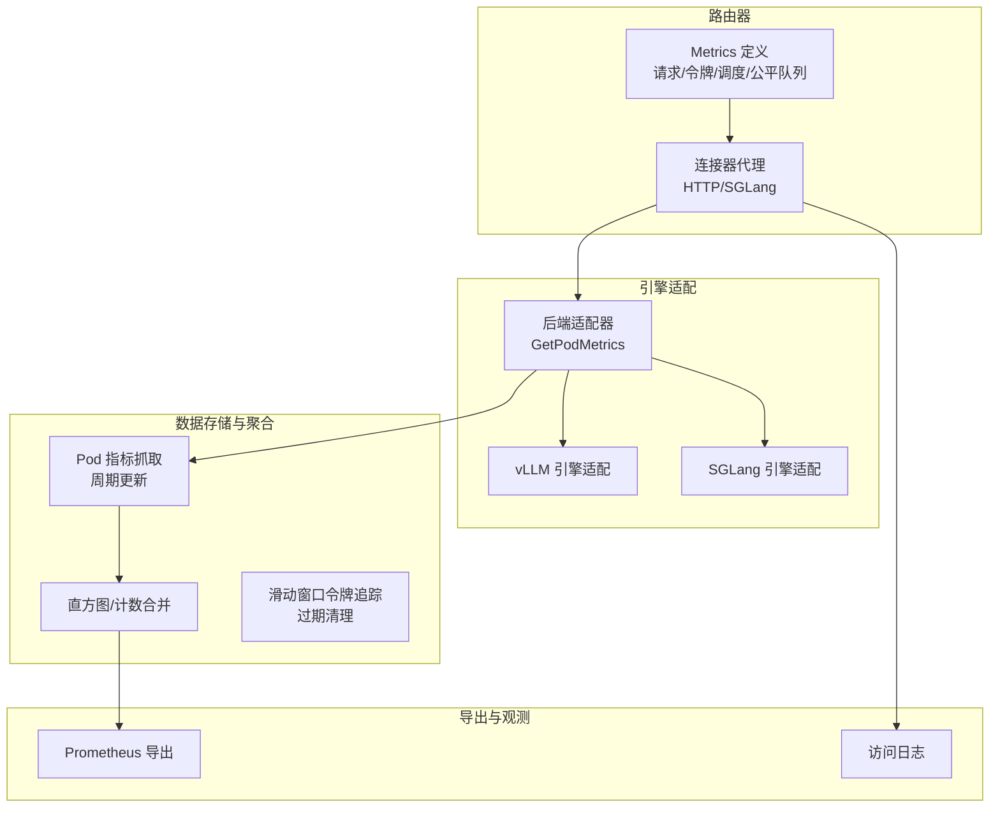
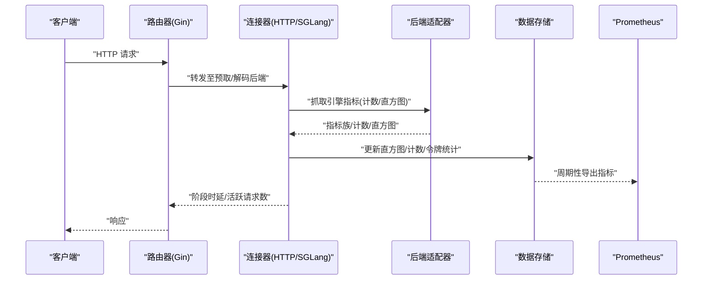
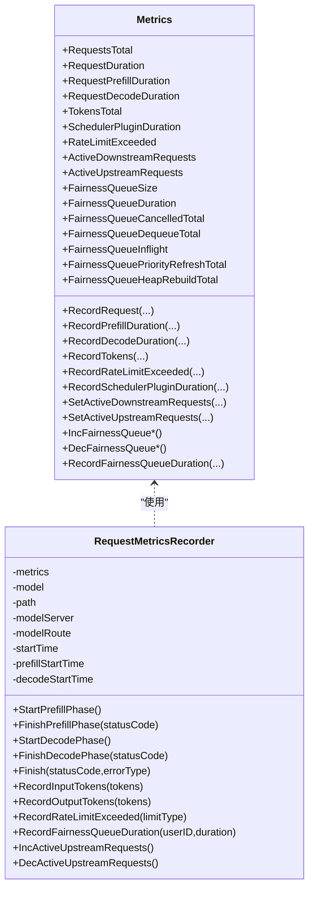
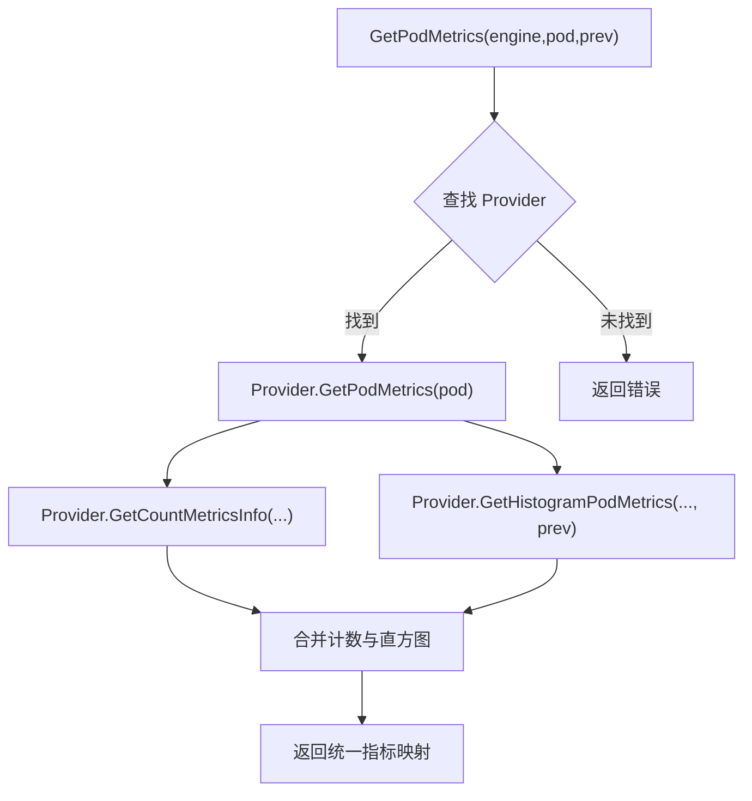
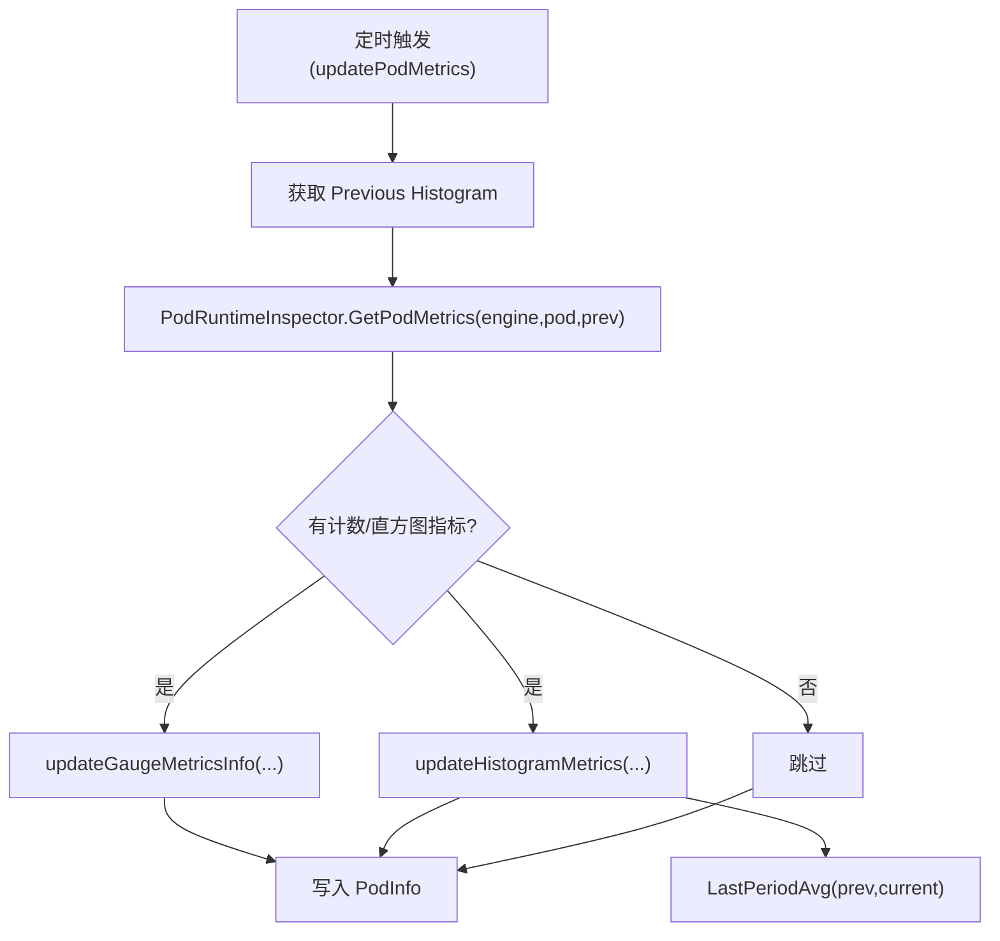
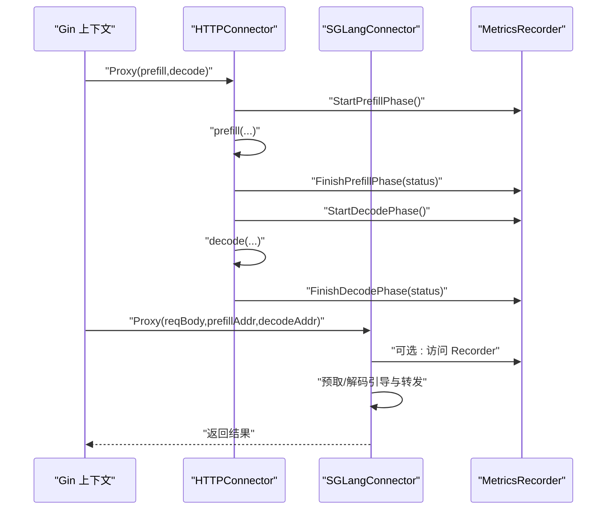
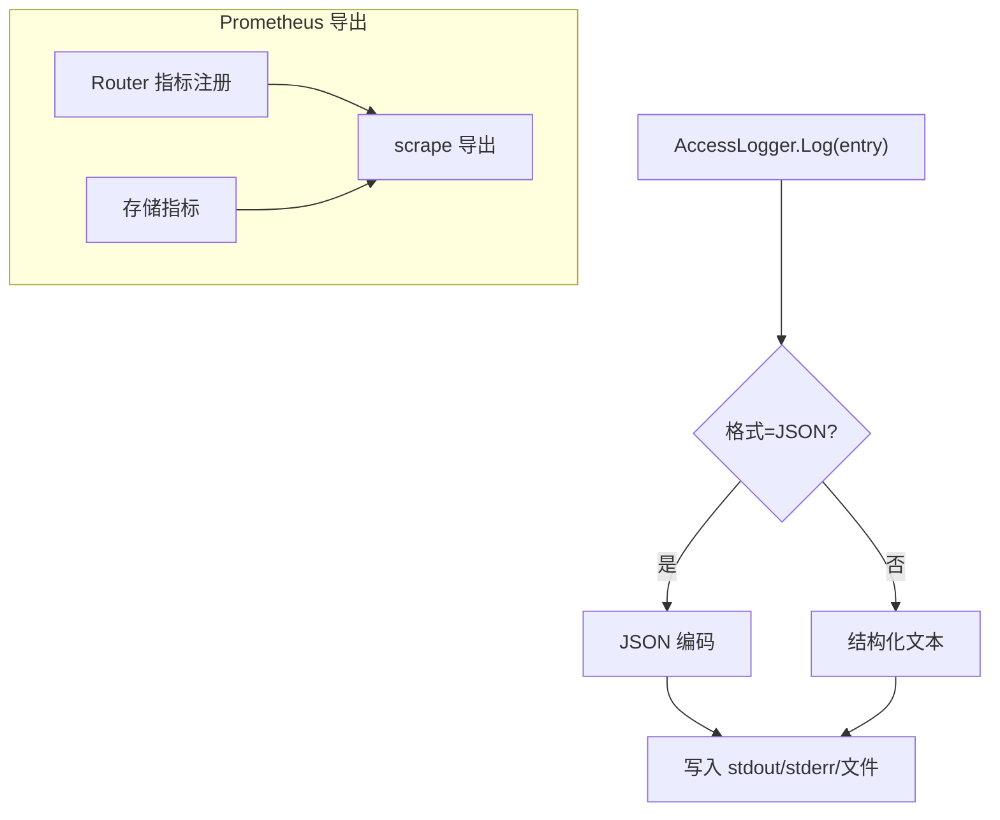
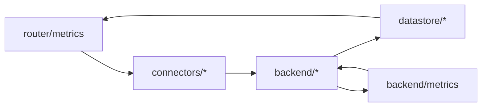

# 后端指标监控

<cite>
**本文引用的文件**
- [pkg/kthena-router/metrics/metrics.go](file://pkg/kthena-router/metrics/metrics.go)
- [pkg/kthena-router/backend/backend.go](file://pkg/kthena-router/backend/backend.go)
- [pkg/kthena-router/backend/metrics/metrics.go](file://pkg/kthena-router/backend/metrics/metrics.go)
- [pkg/kthena-router/datastore/store.go](file://pkg/kthena-router/datastore/store.go)
- [pkg/kthena-router/datastore/token_tracker.go](file://pkg/kthena-router/datastore/token_tracker.go)
- [pkg/kthena-router/connectors/http.go](file://pkg/kthena-router/connectors/http.go)
- [pkg/kthena-router/connectors/sglang.go](file://pkg/kthena-router/connectors/sglang.go)
- [pkg/kthena-router/accesslog/types.go](file://pkg/kthena-router/accesslog/types.go)
- [pkg/kthena-router/accesslog/logger.go](file://pkg/kthena-router/accesslog/logger.go)
- [docs/kthena/docs/user-guide/runtime.md](file://docs/kthena/docs/user-guide/runtime.md)
</cite>

## 目录
1. [简介](#简介)
2. [项目结构](#项目结构)
3. [核心组件](#核心组件)
4. [架构总览](#架构总览)
5. [详细组件分析](#详细组件分析)
6. [依赖分析](#依赖分析)
7. [性能考虑](#性能考虑)
8. [故障排查指南](#故障排查指南)
9. [结论](#结论)
10. [附录](#附录)

## 简介
本文件面向 Kthena 后端指标监控系统，系统性阐述指标定义、采集、聚合与暴露机制，覆盖 vLLM、SGLang 等推理引擎的特定指标实现，以及通用 HTTP 连接器的健康检查与访问日志。文档还说明指标数据的存储结构、更新频率与清理策略，Prometheus 指标导出格式、标签管理与查询优化建议，并提供配置示例、监控告警设置与性能基准测试方法，最后给出扩展接口与自定义指标添加指南。

## 项目结构
Kthena 的指标监控体系由以下模块协同构成：
- 路由器指标：统一定义并记录请求级、令牌级、调度插件时延、公平队列等指标，供 Prometheus 导出。
- 引擎指标适配层：按引擎类型（vLLM、SGLang）解析后端 Pod 暴露的原始指标，标准化为统一命名空间。
- 数据存储与聚合：周期性抓取 Pod 指标，合并计数型与直方图型指标，维护滑动窗口令牌统计与过期清理。
- 连接器代理：在预取-解码（PD）链路中埋点，记录阶段时延与上游请求数量。
- 访问日志：输出结构化访问日志，包含完整耗时与令牌统计，便于离线分析与二次消费。

**图表来源**
- [pkg/kthena-router/metrics/metrics.go:54-85](file://pkg/kthena-router/metrics/metrics.go#L54-L85)
- [pkg/kthena-router/backend/backend.go:30-40](file://pkg/kthena-router/backend/backend.go#L30-L40)
- [pkg/kthena-router/datastore/store.go:135-149](file://pkg/kthena-router/datastore/store.go#L135-L149)
- [pkg/kthena-router/connectors/http.go:63-119](file://pkg/kthena-router/connectors/http.go#L63-L119)
- [pkg/kthena-router/accesslog/logger.go:63-98](file://pkg/kthena-router/accesslog/logger.go#L63-L98)

**章节来源**
- [pkg/kthena-router/metrics/metrics.go:54-85](file://pkg/kthena-router/metrics/metrics.go#L54-L85)
- [pkg/kthena-router/backend/backend.go:30-40](file://pkg/kthena-router/backend/backend.go#L30-L40)
- [pkg/kthena-router/datastore/store.go:135-149](file://pkg/kthena-router/datastore/store.go#L135-L149)
- [pkg/kthena-router/connectors/http.go:63-119](file://pkg/kthena-router/connectors/http.go#L63-L119)
- [pkg/kthena-router/accesslog/logger.go:63-98](file://pkg/kthena-router/accesslog/logger.go#L63-L98)

## 核心组件
- 路由器指标定义与记录
  - 统一的指标命名与标签体系，涵盖模型名、路径、状态码、错误类型、令牌类型、插件名与类型、限流类型、模型服务/路由、用户 ID 等。
  - 提供请求总量、端到端时延、预取/解码阶段时延、令牌总量、活跃上下游请求数、调度插件时延、公平队列大小与时延、取消/出队/飞行中/优先级刷新/堆重建等指标。
  - 支持请求级 Recorder，自动记录阶段开始/结束与完成事件，确保时序与一致性。
- 引擎指标适配
  - 通过后端适配器统一拉取不同引擎的指标族，解析计数型与直方图型指标，合并为统一键值集合。
  - 提供 HTTP 客户端与文本解析工具，支持从引擎 Pod 抓取并解析 Prometheus 文本格式指标。
- 数据存储与聚合
  - 周期性抓取 Pod 指标，合并上一周期直方图增量，计算每周期平均时延等派生指标。
  - 维护滑动窗口令牌追踪，按窗口大小定期清理过期桶，避免内存无限增长。
- 连接器代理
  - 在 HTTP 与 SGLang 连接器中埋点，记录预取/解码阶段时延、活跃上游请求数变化、速率限制触发次数等。
- 访问日志
  - 输出结构化 JSON 或文本，包含请求方法、路径、协议、状态码、错误、模型/路由/服务、选中 Pod、请求 ID、令牌输入/输出、完整耗时分解等字段。

**章节来源**
- [pkg/kthena-router/metrics/metrics.go:26-52](file://pkg/kthena-router/metrics/metrics.go#L26-L52)
- [pkg/kthena-router/metrics/metrics.go:87-223](file://pkg/kthena-router/metrics/metrics.go#L87-L223)
- [pkg/kthena-router/backend/backend.go:30-40](file://pkg/kthena-router/backend/backend.go#L30-L40)
- [pkg/kthena-router/backend/metrics/metrics.go:37-55](file://pkg/kthena-router/backend/metrics/metrics.go#L37-L55)
- [pkg/kthena-router/datastore/store.go:1168-1182](file://pkg/kthena-router/datastore/store.go#L1168-L1182)
- [pkg/kthena-router/datastore/token_tracker.go:112-156](file://pkg/kthena-router/datastore/token_tracker.go#L112-L156)
- [pkg/kthena-router/connectors/http.go:63-119](file://pkg/kthena-router/connectors/http.go#L63-L119)
- [pkg/kthena-router/accesslog/logger.go:100-128](file://pkg/kthena-router/accesslog/logger.go#L100-L128)

## 架构总览
下图展示从请求进入路由器，经连接器代理、引擎指标抓取、数据聚合，到 Prometheus 导出的整体流程。

**图表来源**
- [pkg/kthena-router/connectors/http.go:63-119](file://pkg/kthena-router/connectors/http.go#L63-L119)
- [pkg/kthena-router/backend/backend.go:42-65](file://pkg/kthena-router/backend/backend.go#L42-L65)
- [pkg/kthena-router/datastore/store.go:1168-1182](file://pkg/kthena-router/datastore/store.go#L1168-L1182)

## 详细组件分析

### 路由器指标定义与记录
- 指标类别
  - 请求级：总量、端到端时延直方图、预取/解码阶段时延直方图。
  - 令牌级：输入/输出令牌总量。
  - 调度与公平队列：活跃上游/下游请求数、排队大小、排队时延、取消/出队/飞行中/优先级刷新/堆重建计数。
  - 速率限制：因输入令牌、输出令牌、请求数触发的拒绝计数。
- 标签管理
  - 统一使用模型名、路径、状态码、错误类型、令牌类型、插件名与类型、限流类型、模型服务/路由、用户 ID 等标签，便于多维聚合与过滤。
- 请求级 Recorder
  - 自动记录阶段开始/结束与完成事件，保证时序一致；支持在连接器中注入上下文以共享 Recorder。

**图表来源**
- [pkg/kthena-router/metrics/metrics.go:54-85](file://pkg/kthena-router/metrics/metrics.go#L54-L85)
- [pkg/kthena-router/metrics/metrics.go:341-351](file://pkg/kthena-router/metrics/metrics.go#L341-L351)
- [pkg/kthena-router/metrics/metrics.go:225-290](file://pkg/kthena-router/metrics/metrics.go#L225-L290)
- [pkg/kthena-router/metrics/metrics.go:416-444](file://pkg/kthena-router/metrics/metrics.go#L416-L444)

**章节来源**
- [pkg/kthena-router/metrics/metrics.go:26-52](file://pkg/kthena-router/metrics/metrics.go#L26-L52)
- [pkg/kthena-router/metrics/metrics.go:87-223](file://pkg/kthena-router/metrics/metrics.go#L87-L223)
- [pkg/kthena-router/metrics/metrics.go:341-351](file://pkg/kthena-router/metrics/metrics.go#L341-L351)
- [pkg/kthena-router/metrics/metrics.go:416-444](file://pkg/kthena-router/metrics/metrics.go#L416-L444)

### vLLM 与 SGLang 引擎指标适配
- 适配器职责
  - 从引擎 Pod 拉取指标族，解析计数型与直方图型指标，合并为统一键值集合，供数据存储使用。
  - 提供 HTTP 客户端与文本解析工具，支持抓取 Prometheus 文本格式指标。
- vLLM 与 SGLang 注册
  - 通过后端适配器注册表统一管理，按引擎类型选择对应 Provider。
- 指标标准化
  - 运行时将不同引擎的关键指标重命名为统一前缀，便于在 Prometheus/Grafana 中统一观测。

**图表来源**
- [pkg/kthena-router/backend/backend.go:42-65](file://pkg/kthena-router/backend/backend.go#L42-L65)
- [pkg/kthena-router/backend/metrics/metrics.go:37-55](file://pkg/kthena-router/backend/metrics/metrics.go#L37-L55)

**章节来源**
- [pkg/kthena-router/backend/backend.go:30-40](file://pkg/kthena-router/backend/backend.go#L30-L40)
- [pkg/kthena-router/backend/backend.go:42-65](file://pkg/kthena-router/backend/backend.go#L42-L65)
- [pkg/kthena-router/backend/metrics/metrics.go:37-55](file://pkg/kthena-router/backend/metrics/metrics.go#L37-L55)
- [docs/kthena/docs/user-guide/runtime.md:121-134](file://docs/kthena/docs/user-guide/runtime.md#L121-L134)

### 数据存储与聚合
- 指标抓取与合并
  - 周期性调用 PodRuntimeInspector 获取计数型与直方图型指标，合并到 PodInfo。
  - 对直方图采用“上一周期增量”方式计算每周期平均时延等派生指标。
- 滑动窗口令牌追踪
  - 维护每个用户-模型的令牌桶，按窗口大小清理过期桶，支持紧凑化以降低内存占用。
- 更新频率与清理策略
  - 更新间隔固定为秒级；过期清理基于时间戳线性扫描与条件紧凑化，避免内存膨胀。

**图表来源**
- [pkg/kthena-router/datastore/store.go:1168-1182](file://pkg/kthena-router/datastore/store.go#L1168-L1182)
- [pkg/kthena-router/backend/metrics/metrics.go:57-72](file://pkg/kthena-router/backend/metrics/metrics.go#L57-L72)

**章节来源**
- [pkg/kthena-router/datastore/store.go:1168-1182](file://pkg/kthena-router/datastore/store.go#L1168-L1182)
- [pkg/kthena-router/backend/metrics/metrics.go:57-72](file://pkg/kthena-router/backend/metrics/metrics.go#L57-L72)
- [pkg/kthena-router/datastore/token_tracker.go:112-156](file://pkg/kthena-router/datastore/token_tracker.go#L112-L156)

### 连接器代理与健康检查
- HTTP 连接器
  - 在预取/解码阶段分别记录时延，维护活跃上游请求数，处理错误状态码并回填。
- SGLang 连接器
  - 遵循预取-解码引导协议，确保两阶段同时在途，避免 KV 传输超时；同样记录阶段时延与活跃请求数。
- 健康检查
  - 通过连接器代理对后端进行连通性与可用性探测，结合速率限制与公平队列指标辅助健康判断。

**图表来源**
- [pkg/kthena-router/connectors/http.go:63-119](file://pkg/kthena-router/connectors/http.go#L63-L119)
- [pkg/kthena-router/connectors/sglang.go:86-93](file://pkg/kthena-router/connectors/sglang.go#L86-L93)

**章节来源**
- [pkg/kthena-router/connectors/http.go:63-119](file://pkg/kthena-router/connectors/http.go#L63-L119)
- [pkg/kthena-router/connectors/sglang.go:72-93](file://pkg/kthena-router/connectors/sglang.go#L72-L93)

### 访问日志与导出
- 访问日志
  - 支持 JSON 与文本两种格式，输出包含基础请求信息、错误、模型/路由/服务、选中 Pod、请求 ID、令牌统计与完整耗时分解。
- Prometheus 导出
  - 路由器指标直接注册到 Prometheus 客户端，按默认 scrape 间隔导出；引擎指标通过后端适配器抓取并合并后写入存储，再由 Prometheus 抓取统一指标。

**图表来源**
- [pkg/kthena-router/accesslog/logger.go:100-128](file://pkg/kthena-router/accesslog/logger.go#L100-L128)
- [pkg/kthena-router/metrics/metrics.go:87-223](file://pkg/kthena-router/metrics/metrics.go#L87-L223)

**章节来源**
- [pkg/kthena-router/accesslog/logger.go:100-128](file://pkg/kthena-router/accesslog/logger.go#L100-L128)
- [pkg/kthena-router/accesslog/types.go:173-197](file://pkg/kthena-router/accesslog/types.go#L173-L197)
- [pkg/kthena-router/metrics/metrics.go:87-223](file://pkg/kthena-router/metrics/metrics.go#L87-L223)

## 依赖分析
- 组件耦合
  - 路由器指标与连接器代理强耦合，通过上下文注入 Recorder 实现埋点。
  - 后端适配器与数据存储弱耦合，通过接口抽象隔离引擎差异。
- 外部依赖
  - Prometheus 客户端库用于指标注册与导出。
  - Prometheus 文本解析库用于解析引擎指标。
- 潜在循环依赖
  - 当前模块间无循环导入，适配器通过接口回调避免紧耦合。

**图表来源**
- [pkg/kthena-router/metrics/metrics.go:22-26](file://pkg/kthena-router/metrics/metrics.go#L22-L26)
- [pkg/kthena-router/backend/backend.go:19-28](file://pkg/kthena-router/backend/backend.go#L19-L28)
- [pkg/kthena-router/backend/metrics/metrics.go:19-27](file://pkg/kthena-router/backend/metrics/metrics.go#L19-L27)

**章节来源**
- [pkg/kthena-router/metrics/metrics.go:22-26](file://pkg/kthena-router/metrics/metrics.go#L22-L26)
- [pkg/kthena-router/backend/backend.go:19-28](file://pkg/kthena-router/backend/backend.go#L19-L28)
- [pkg/kthena-router/backend/metrics/metrics.go:19-27](file://pkg/kthena-router/backend/metrics/metrics.go#L19-L27)

## 性能考虑
- 指标注册与导出
  - 使用直方图分箱合理设置，兼顾精度与内存；避免过多标签组合导致指标面爆炸。
- 引擎指标抓取
  - 控制并发与超时，避免阻塞主请求路径；对解析失败进行降级处理。
- 存储与聚合
  - 直方图增量计算减少重复聚合开销；滑动窗口紧凑化降低内存占用。
- 连接器代理
  - 将阶段时延与活跃请求数变更控制在最小必要范围，避免额外锁竞争。

## 故障排查指南
- 引擎指标为空或解析失败
  - 检查后端 Pod 指标端点可达性与格式；确认抓取超时与解析错误日志。
- 指标不更新或延迟高
  - 检查数据存储定时任务是否运行；核对直方图合并逻辑与上一周期快照。
- 公平队列异常
  - 关注排队大小、取消/出队/堆重建计数；检查令牌权重与窗口配置。
- 访问日志缺失
  - 确认日志开关、输出目标与格式配置；检查写入权限与文件句柄关闭。

**章节来源**
- [pkg/kthena-router/backend/metrics/metrics.go:37-55](file://pkg/kthena-router/backend/metrics/metrics.go#L37-L55)
- [pkg/kthena-router/datastore/store.go:1168-1182](file://pkg/kthena-router/datastore/store.go#L1168-L1182)
- [pkg/kthena-router/datastore/token_tracker.go:112-156](file://pkg/kthena-router/datastore/token_tracker.go#L112-L156)
- [pkg/kthena-router/accesslog/logger.go:69-98](file://pkg/kthena-router/accesslog/logger.go#L69-L98)

## 结论
Kthena 的指标监控体系通过统一的路由器指标、引擎指标适配与数据存储聚合，实现了跨引擎的一致可观测性。连接器代理在 PD 链路中精确埋点，访问日志提供离线分析能力。配合 Prometheus 导出与标准指标命名，可满足生产环境的监控与告警需求。后续可通过扩展适配器与 Recorder 接口进一步增强观测维度。

## 附录

### Prometheus 指标导出格式与标签管理
- 导出格式
  - 路由器指标：Counter/Histogram/Gauge 三类，按默认 scrape 间隔导出。
  - 引擎指标：通过后端适配器抓取并合并，统一键值集合写入存储，再由 Prometheus 抓取。
- 标签管理
  - 统一使用模型名、路径、状态码、错误类型、令牌类型、插件名与类型、限流类型、模型服务/路由、用户 ID 等标签，便于多维聚合与过滤。

**章节来源**
- [pkg/kthena-router/metrics/metrics.go:87-223](file://pkg/kthena-router/metrics/metrics.go#L87-L223)
- [pkg/kthena-router/backend/backend.go:42-65](file://pkg/kthena-router/backend/backend.go#L42-L65)

### 查询优化建议
- 减少标签基数：对高基数标签（如用户 ID）进行采样或聚合。
- 合理分箱：根据业务分布调整直方图分箱，提升可视化与查询效率。
- 使用记录规则：对高频聚合表达式预计算，降低查询压力。

### 指标配置示例
- 公平队列窗口与权重
  - 通过环境变量配置窗口大小与输入/输出令牌权重，影响令牌统计与排队行为。
- 访问日志
  - 开启/关闭、输出目标（stdout/stderr/文件）、格式（json/text）。

**章节来源**
- [pkg/kthena-router/datastore/store.go:70-111](file://pkg/kthena-router/datastore/store.go#L70-L111)
- [pkg/kthena-router/accesslog/logger.go:44-61](file://pkg/kthena-router/accesslog/logger.go#L44-L61)

### 监控告警设置
- 建议阈值
  - 请求端到端时延分位数、预取/解码阶段时延、活跃上游请求数、公平队列长度与排队时延、速率限制触发次数。
- 告警表达式思路
  - 基于直方图分位数与计数差分计算异常；结合公平队列计数与排队时延进行容量预警。

### 性能基准测试方法
- 基准场景
  - 不同模型规模、并发等级、PD 比例、限流策略下的端到端时延、吞吐与资源占用。
- 指标采集
  - 使用 Prometheus 抓取路由器与引擎指标，结合访问日志进行离线分析。

### 扩展接口与自定义指标添加指南
- 扩展步骤
  - 新增引擎适配器：实现 MetricsProvider 接口，注册到适配器注册表。
  - 新增路由器指标：在 Metrics 结构体中新增 Counter/Histogram/Gauge，并补充 Recorder 方法。
  - 新增连接器埋点：在连接器 Proxy 流程中注入 Recorder 并记录阶段时延与活跃请求数。
- 注意事项
  - 保持标签一致性与命名规范；对解析失败与网络异常进行降级处理；避免在热路径引入阻塞操作。

**章节来源**
- [pkg/kthena-router/backend/backend.go:30-40](file://pkg/kthena-router/backend/backend.go#L30-L40)
- [pkg/kthena-router/metrics/metrics.go:54-85](file://pkg/kthena-router/metrics/metrics.go#L54-L85)
- [pkg/kthena-router/connectors/http.go:63-119](file://pkg/kthena-router/connectors/http.go#L63-L119)