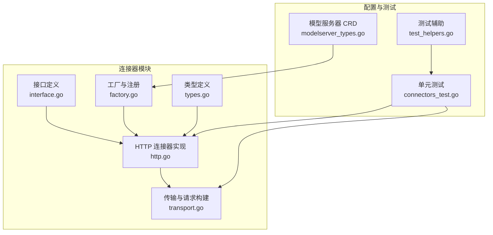
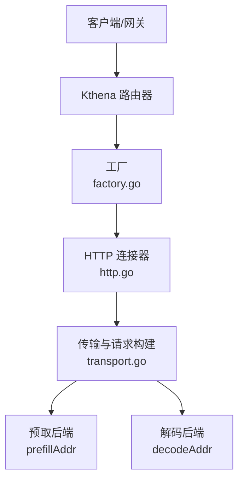
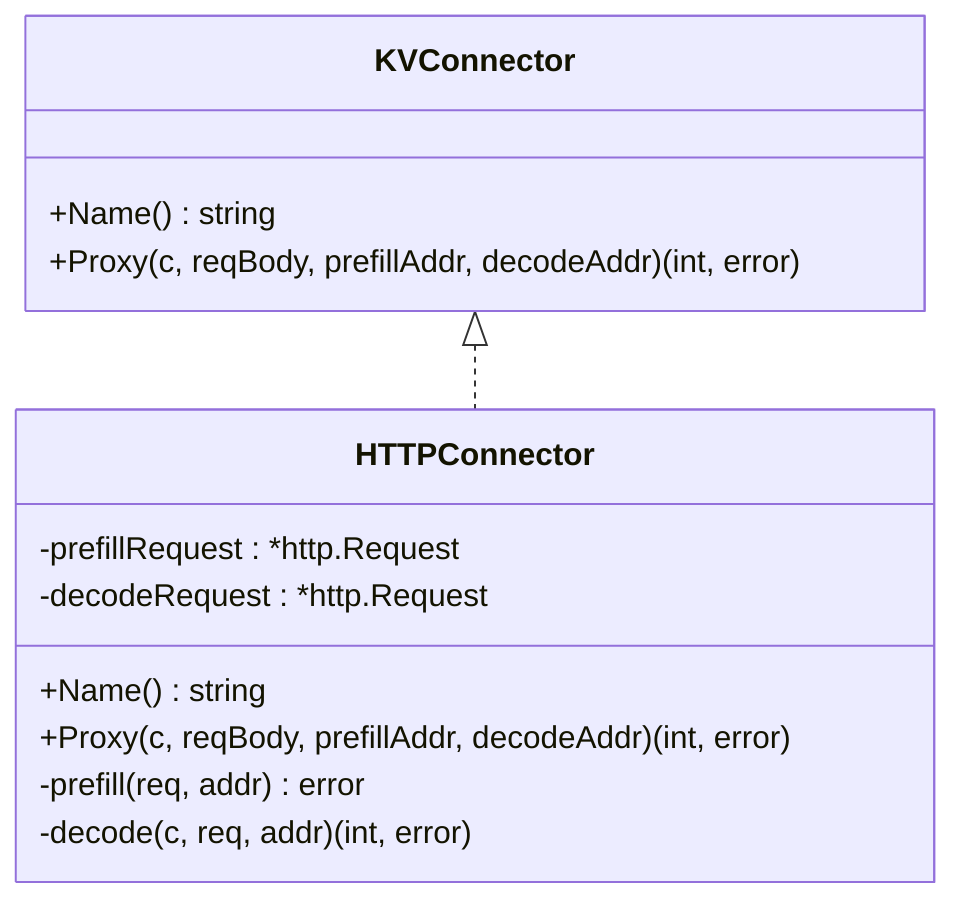
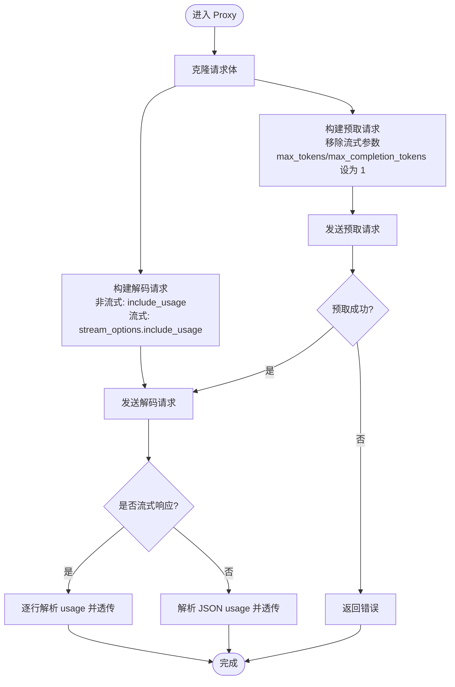
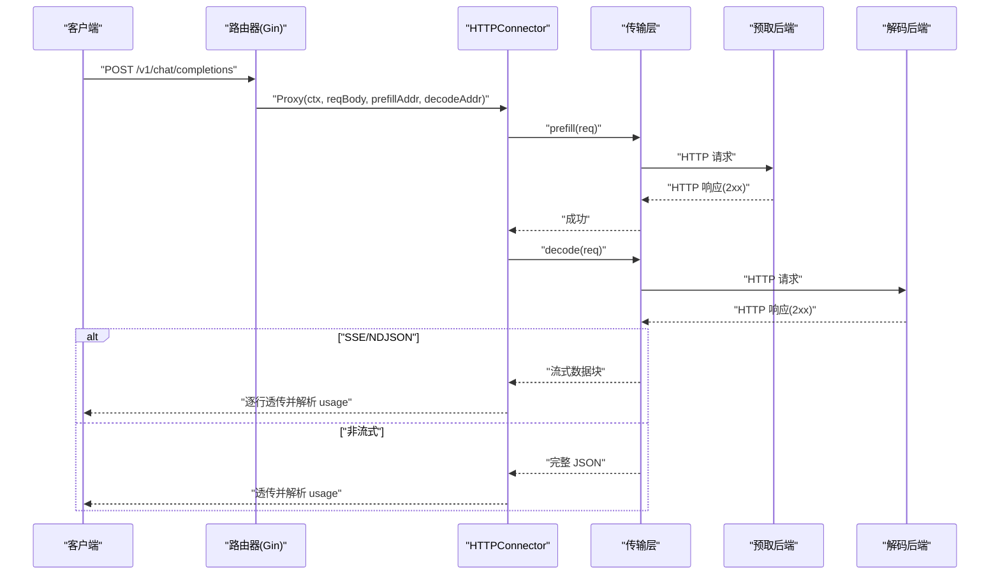
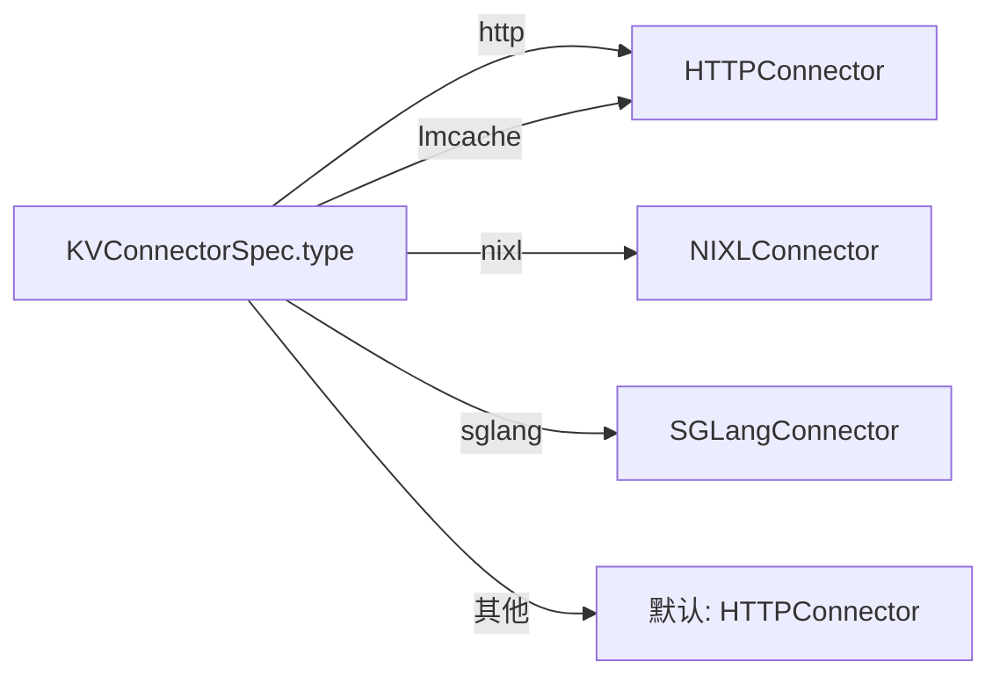
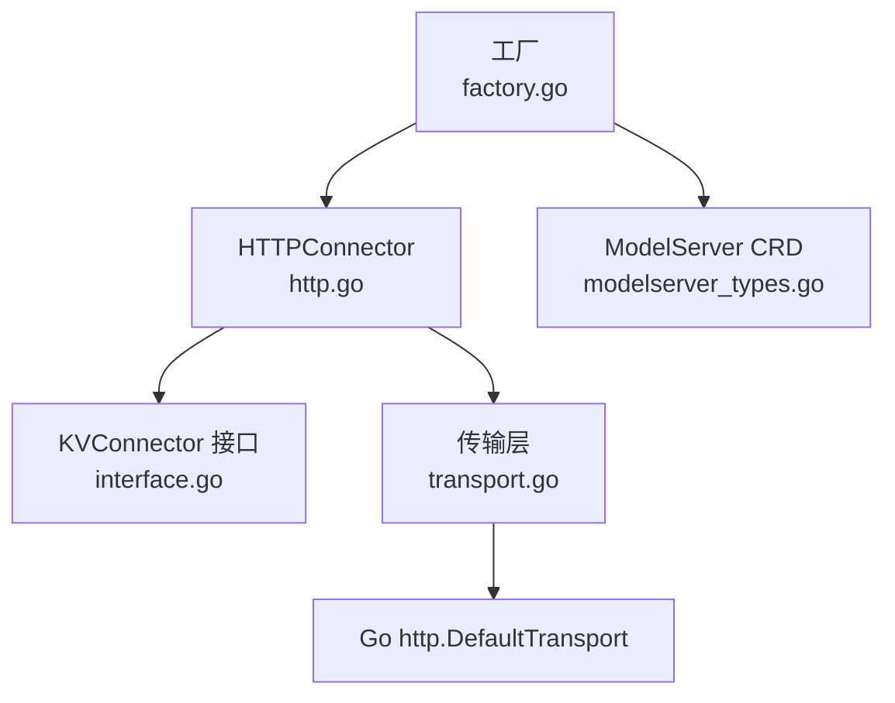

# HTTP 连接器

<cite>
**本文引用的文件**
- [http.go](file://pkg/kthena-router/connectors/http.go)
- [transport.go](file://pkg/kthena-router/connectors/transport.go)
- [interface.go](file://pkg/kthena-router/connectors/interface.go)
- [factory.go](file://pkg/kthena-router/connectors/factory.go)
- [types.go](file://pkg/kthena-router/connectors/types.go)
- [modelserver_types.go](file://pkg/apis/networking/v1alpha1/modelserver_types.go)
- [connectors_test.go](file://pkg/kthena-router/connectors/connectors_test.go)
- [test_helpers.go](file://pkg/kthena-router/connectors/test_helpers.go)
</cite>

## 目录
1. [简介](#简介)
2. [项目结构](#项目结构)
3. [核心组件](#核心组件)
4. [架构总览](#架构总览)
5. [详细组件分析](#详细组件分析)
6. [依赖分析](#依赖分析)
7. [性能考虑](#性能考虑)
8. [故障排查指南](#故障排查指南)
9. [结论](#结论)
10. [附录](#附录)

## 简介
本文件面向 Kthena 的 HTTP 连接器（HTTPConnector），系统性阐述其作为“基础 KV 传输连接器”的设计理念与实现机制。HTTP 连接器用于在预取（prefill）与解码（decode）阶段之间进行 KV 缓存的传输协调，通过将上游请求拆分为两个阶段并分别转发到不同的后端地址，实现预取-解码的解耦与可扩展。本文重点覆盖以下方面：
- 预取-解码分离流程的 HTTP 协议适配、请求构建与响应处理
- HTTPConnector 结构体字段、方法实现与使用场景
- prefill 与 decode 阶段的请求转发机制、连接池管理与错误处理策略
- HTTP 协议版本兼容性、超时与重试配置选项
- 实际使用示例与故障排查建议

## 项目结构
与 HTTP 连接器直接相关的模块位于 pkg/kthena-router/connectors 下，主要文件包括：
- 接口与实现：interface.go、http.go、transport.go
- 工厂与注册：factory.go
- 类型定义：types.go
- 配置 CRD：modelserver_types.go
- 测试与辅助：connectors_test.go、test_helpers.go

**图表来源**
- [http.go:1-120](file://pkg/kthena-router/connectors/http.go#L1-L120)
- [transport.go:1-227](file://pkg/kthena-router/connectors/transport.go#L1-L227)
- [interface.go:1-32](file://pkg/kthena-router/connectors/interface.go#L1-L32)
- [factory.go:1-60](file://pkg/kthena-router/connectors/factory.go#L1-L60)
- [types.go:1-28](file://pkg/kthena-router/connectors/types.go#L1-L28)
- [modelserver_types.go:1-172](file://pkg/apis/networking/v1alpha1/modelserver_types.go#L1-L172)
- [connectors_test.go:1-532](file://pkg/kthena-router/connectors/connectors_test.go#L1-L532)
- [test_helpers.go:1-37](file://pkg/kthena-router/connectors/test_helpers.go#L1-L37)

**章节来源**
- [http.go:1-120](file://pkg/kthena-router/connectors/http.go#L1-L120)
- [transport.go:1-227](file://pkg/kthena-router/connectors/transport.go#L1-L227)
- [interface.go:1-32](file://pkg/kthena-router/connectors/interface.go#L1-L32)
- [factory.go:1-60](file://pkg/kthena-router/connectors/factory.go#L1-L60)
- [types.go:1-28](file://pkg/kthena-router/connectors/types.go#L1-L28)
- [modelserver_types.go:1-172](file://pkg/apis/networking/v1alpha1/modelserver_types.go#L1-L172)
- [connectors_test.go:1-532](file://pkg/kthena-router/connectors/connectors_test.go#L1-L532)
- [test_helpers.go:1-37](file://pkg/kthena-router/connectors/test_helpers.go#L1-L37)

## 核心组件
- KVConnector 接口：定义连接器的统一能力，包括名称标识与完整的预取-解码代理流程。
- HTTPConnector：HTTP 基础实现，负责将请求拆分为 prefill 与 decode 两步，并通过内置传输层转发。
- 传输与请求构建工具：封装预取/解码请求的构建、流式与非流式响应处理、内容类型判断等。
- 工厂与注册：根据配置选择具体连接器类型，默认回退至 HTTP 连接器。

关键点：
- HTTPConnector 仅负责“协议适配”和“请求转发”，不内建连接池或重试逻辑；这些由 Go 默认传输层与上层路由控制。
- 预取阶段会移除流式参数并限制生成长度，确保仅产出一次 KV 缓存；解码阶段按需注入 token 使用统计。

**章节来源**
- [interface.go:23-31](file://pkg/kthena-router/connectors/interface.go#L23-L31)
- [http.go:28-43](file://pkg/kthena-router/connectors/http.go#L28-L43)
- [transport.go:33-78](file://pkg/kthena-router/connectors/transport.go#L33-L78)
- [factory.go:38-59](file://pkg/kthena-router/connectors/factory.go#L38-L59)

## 架构总览
HTTP 连接器在 Kthena 路由中的位置如下：

说明：
- 工厂根据 ModelServer 配置选择连接器类型，默认为 HTTP。
- HTTPConnector 在 Proxy 中先构建 prefill 请求，再构建 decode 请求，分别转发到不同地址。
- 传输层负责实际的 HTTP 转发、状态码校验、响应头复制与流式处理。

**图表来源**
- [factory.go:38-59](file://pkg/kthena-router/connectors/factory.go#L38-L59)
- [http.go:63-119](file://pkg/kthena-router/connectors/http.go#L63-L119)
- [transport.go:33-78](file://pkg/kthena-router/connectors/transport.go#L33-L78)

## 详细组件分析

### HTTPConnector 结构与方法
- 字段
  - prefillRequest：预取阶段的 HTTP 请求对象
  - decodeRequest：解码阶段的 HTTP 请求对象
- 方法
  - Name：返回连接器类型标识
  - Proxy：执行完整预取-解码流程，包含请求构建、转发、指标记录与错误处理
  - prefill/decode：内部方法，分别对预取与解码请求进行地址改写并调用传输层

**图表来源**
- [interface.go:23-31](file://pkg/kthena-router/connectors/interface.go#L23-L31)
- [http.go:28-43](file://pkg/kthena-router/connectors/http.go#L28-L43)
- [http.go:45-61](file://pkg/kthena-router/connectors/http.go#L45-L61)
- [http.go:63-119](file://pkg/kthena-router/connectors/http.go#L63-L119)

**章节来源**
- [http.go:28-43](file://pkg/kthena-router/connectors/http.go#L28-L43)
- [http.go:45-61](file://pkg/kthena-router/connectors/http.go#L45-L61)
- [http.go:63-119](file://pkg/kthena-router/connectors/http.go#L63-L119)

### 预取-解码分离流程与请求构建
- 预取阶段（buildPrefillRequest）
  - 移除流式参数（如 stream、stream_options）
  - 将 max_tokens 与 max_completion_tokens 统一设为 1，确保仅生成一次 KV
  - 克隆原始请求上下文，设置 Scheme 为 http，替换 Body 与 ContentLength
- 解码阶段（BuildDecodeRequest）
  - 对于非流式请求：显式添加 include_usage
  - 对于流式请求：若未开启 usage，则注入 stream_options.include_usage，并在上下文中标记 token usage
  - 克隆原始请求上下文，设置 Scheme 为 http，替换 Body 与 ContentLength

**图表来源**
- [http.go:63-119](file://pkg/kthena-router/connectors/http.go#L63-L119)
- [transport.go:92-123](file://pkg/kthena-router/connectors/transport.go#L92-L123)
- [transport.go:110-145](file://pkg/kthena-router/connectors/transport.go#L110-L145)
- [transport.go:82-90](file://pkg/kthena-router/connectors/transport.go#L82-L90)

**章节来源**
- [http.go:63-119](file://pkg/kthena-router/connectors/http.go#L63-L119)
- [transport.go:82-90](file://pkg/kthena-router/connectors/transport.go#L82-L90)
- [transport.go:92-123](file://pkg/kthena-router/connectors/transport.go#L92-L123)
- [transport.go:110-145](file://pkg/kthena-router/connectors/transport.go#L110-L145)

### 响应处理与流式支持
- 内容类型识别：基于响应头 Content-Type 判断是否为 SSE 或 NDJSON
- 流式响应：逐行读取，解析 usage 并累加输出 token 数，按需过滤 usage 行
- 非流式响应：复制响应体到下游，解析 JSON 中的 usage 获取输出 token 数

**图表来源**
- [http.go:63-119](file://pkg/kthena-router/connectors/http.go#L63-L119)
- [transport.go:48-78](file://pkg/kthena-router/connectors/transport.go#L48-L78)
- [transport.go:169-205](file://pkg/kthena-router/connectors/transport.go#L169-L205)
- [transport.go:207-226](file://pkg/kthena-router/connectors/transport.go#L207-L226)

**章节来源**
- [transport.go:48-78](file://pkg/kthena-router/connectors/transport.go#L48-L78)
- [transport.go:169-205](file://pkg/kthena-router/connectors/transport.go#L169-L205)
- [transport.go:207-226](file://pkg/kthena-router/connectors/transport.go#L207-L226)

### 工厂与默认注册
- 工厂根据 KVConnectorSpec.type 选择连接器
- 默认注册：HTTP、LMCache（复用 HTTP）、NIXL、SGLang（内部）
- 未知类型回退到 HTTPConnector

**图表来源**
- [factory.go:38-59](file://pkg/kthena-router/connectors/factory.go#L38-L59)
- [modelserver_types.go:113-120](file://pkg/apis/networking/v1alpha1/modelserver_types.go#L113-L120)

**章节来源**
- [factory.go:38-59](file://pkg/kthena-router/connectors/factory.go#L38-L59)
- [modelserver_types.go:113-120](file://pkg/apis/networking/v1alpha1/modelserver_types.go#L113-L120)

### KVTransferParams 与类型定义
- KVTransferParams：用于 KV 缓存传输的参数集合，包含是否远程预取/解码、目标主机与端口等
- 该类型在 NIXL 等连接器中使用，HTTP 连接器当前不直接消费该结构

**章节来源**
- [types.go:19-27](file://pkg/kthena-router/connectors/types.go#L19-L27)

## 依赖分析
- HTTPConnector 依赖 Gin 上下文与日志库，但不直接依赖连接池或重试
- 传输层使用 Go http.DefaultTransport.RoundTrip，遵循 Go 默认行为
- 工厂依赖 CRD 中的 KVConnectorSpec 类型枚举

**图表来源**
- [http.go:19-26](file://pkg/kthena-router/connectors/http.go#L19-L26)
- [transport.go:19-31](file://pkg/kthena-router/connectors/transport.go#L19-L31)
- [factory.go:19-24](file://pkg/kthena-router/connectors/factory.go#L19-L24)
- [modelserver_types.go:104-120](file://pkg/apis/networking/v1alpha1/modelserver_types.go#L104-L120)

**章节来源**
- [http.go:19-26](file://pkg/kthena-router/connectors/http.go#L19-L26)
- [transport.go:19-31](file://pkg/kthena-router/connectors/transport.go#L19-L31)
- [factory.go:19-24](file://pkg/kthena-router/connectors/factory.go#L19-L24)
- [modelserver_types.go:104-120](file://pkg/apis/networking/v1alpha1/modelserver_types.go#L104-L120)

## 性能考虑
- 连接池与并发
  - HTTPConnector 不内建连接池；默认使用 Go http.DefaultTransport，其内部维护连接池与复用策略
  - 若需自定义连接池或并发上限，应在上层路由或传输层进行配置
- 超时与重试
  - HTTPConnector 本身不设置超时与重试；可通过上层路由的 TrafficPolicy.Timeout 与 Retry 控制整体请求生命周期
- 流式处理
  - 流式响应采用逐行读取与增量解析，避免一次性缓冲大响应体，降低内存峰值
- 指标与可观测性
  - Proxy 中对预取/解码阶段分别记录开始/结束与活跃上游请求数，便于定位瓶颈

**章节来源**
- [http.go:63-119](file://pkg/kthena-router/connectors/http.go#L63-L119)
- [modelserver_types.go:122-142](file://pkg/apis/networking/v1alpha1/modelserver_types.go#L122-L142)

## 故障排查指南
- 常见问题与定位
  - 预取/解码地址不可达：检查 prefillAddr/decodeAddr 是否正确，网络连通性与服务暴露
  - 预取请求未携带 usage：确认请求体中未显式关闭 include_usage；HTTP 连接器会在非流式请求中自动添加
  - 流式 usage 未透传：确认上游已启用 stream_options.include_usage；HTTP 连接器会根据上下文决定是否过滤 usage 行
  - 预取阶段仍保留流式参数：HTTP 连接器会移除 stream/stream_options，请确认请求体已被正确修改
- 单元测试参考
  - 可参考 connectors_test.go 中对 Proxy、请求体修改、流式/非流式处理的断言，验证预期行为
  - 使用 test_helpers.go 提供的测试响应记录器进行端到端验证

**章节来源**
- [connectors_test.go:107-532](file://pkg/kthena-router/connectors/connectors_test.go#L107-L532)
- [test_helpers.go:21-37](file://pkg/kthena-router/connectors/test_helpers.go#L21-L37)

## 结论
HTTP 连接器以最小职责实现了“预取-解码分离”的 KV 传输适配：通过严谨的请求体改造与响应处理，确保预取阶段仅产生一次 KV，解码阶段按需获取 token 使用统计。其设计将连接池与重试等复杂性交由上层路由与默认传输层处理，保持了清晰的边界与良好的可扩展性。结合 CRD 的配置与工厂注册机制，用户可在不改动业务代码的情况下灵活切换连接器类型。

## 附录

### 使用示例（步骤说明）
- 在 ModelServer 中配置 KVConnectorSpec.type 为 http
- 调用 HTTPConnector.Proxy，传入 Gin 上下文、请求体与 prefillAddr/decodeAddr
- 观察响应是否包含 usage（非流式自动包含，流式需开启 include_usage）

**章节来源**
- [modelserver_types.go:113-120](file://pkg/apis/networking/v1alpha1/modelserver_types.go#L113-L120)
- [http.go:63-119](file://pkg/kthena-router/connectors/http.go#L63-L119)