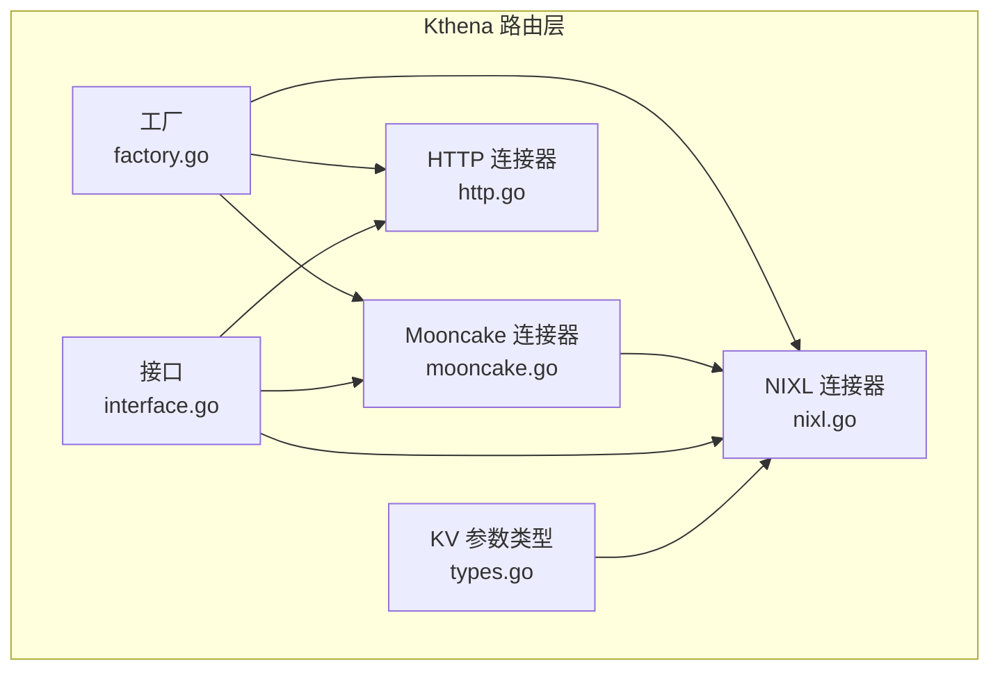
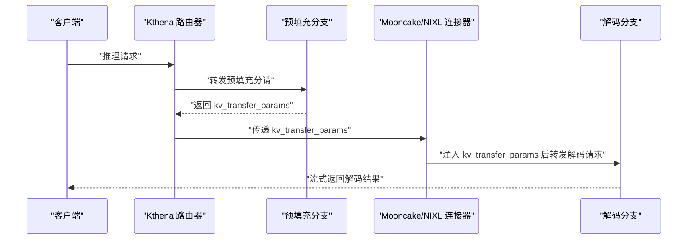
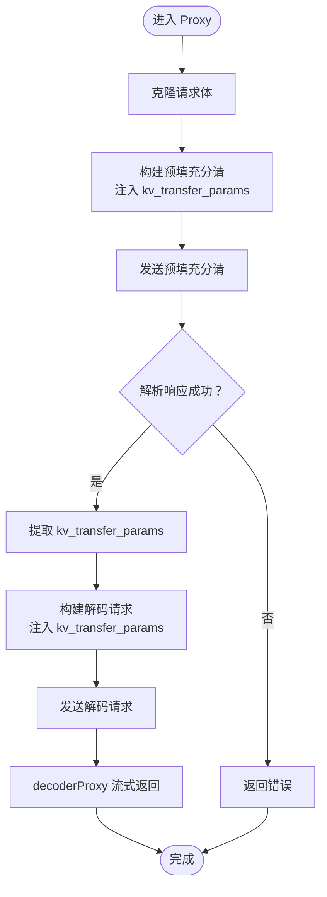
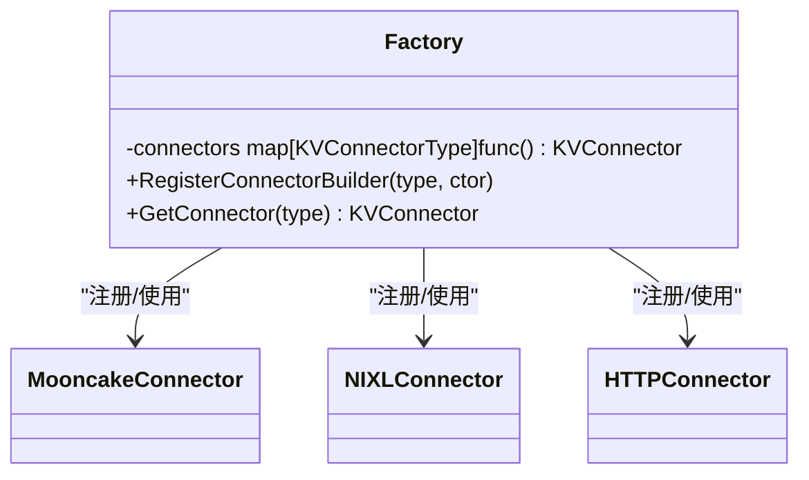
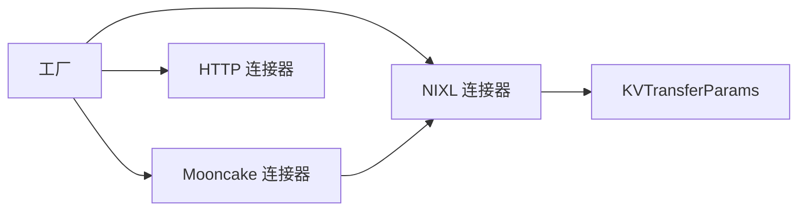

# Mooncake 连接器

<cite>
**本文引用的文件**
- [pkg/kthena-router/connectors/mooncake.go](file://pkg/kthena-router/connectors/mooncake.go)
- [pkg/kthena-router/connectors/nixl.go](file://pkg/kthena-router/connectors/nixl.go)
- [pkg/kthena-router/connectors/interface.go](file://pkg/kthena-router/connectors/interface.go)
- [pkg/kthena-router/connectors/types.go](file://pkg/kthena-router/connectors/types.go)
- [pkg/kthena-router/connectors/factory.go](file://pkg/kthena-router/connectors/factory.go)
- [pkg/kthena-router/connectors/http.go](file://pkg/kthena-router/connectors/http.go)
- [docs/kthena/docs/user-guide/prefill-decode-disaggregation/vllm-ascend-mooncake.md](file://docs/kthena/docs/user-guide/prefill-decode-disaggregation/vllm-ascend-mooncake.md)
- [docs/kthena/docs/user-guide/model-deployment.md](file://docs/kthena/docs/user-guide/model-deployment.md)
- [examples/model-booster/prefill-decode-disaggregation.yaml](file://examples/model-booster/prefill-decode-disaggregation.yaml)
- [docker/Dockerfile.mooncake-npu-a3](file://docker/Dockerfile.mooncake-npu-a3)
- [cli/kthena/helm/templates/Qwen/Qwen3-32B-NPU.yaml](file://cli/kthena/helm/templates/Qwen/Qwen3-32B-NPU.yaml)
</cite>

## 目录
1. [简介](#简介)
2. [项目结构](#项目结构)
3. [核心组件](#核心组件)
4. [架构总览](#架构总览)
5. [详细组件分析](#详细组件分析)
6. [依赖分析](#依赖分析)
7. [性能考虑](#性能考虑)
8. [故障排查指南](#故障排查指南)
9. [结论](#结论)
10. [附录](#附录)

## 简介
本技术文档聚焦于 Kthena Mooncake 连接器对 Ascend NPU 硬件的适配与支持机制，系统阐述 Mooncake 连接器在预填充分解（prefill-decode disaggregation）推理流水线中的作用、与 Mooncake 服务的通信方式、NPU 特有的内存管理与并行计算优化、以及模型格式转换与协议适配。文档同时覆盖 Mooncake 推理引擎的 KV 缓存传输协议、端口与角色配置、设备状态监控与资源分配策略，并给出 Ascend NPU 环境配置、驱动要求与性能调优参数建议，以及 Mooncake 集群部署与硬件资源管理的实践指南。

## 项目结构
Mooncake 连接器位于 Kthena 的路由层（kthena-router），通过统一的 KVConnector 接口抽象不同后端的 KV 缓存传输能力；Mooncake 在 vLLM Ascend 场景下行为与 NIXL 类似，因此 Mooncake 连接器复用 NIXL 实现，仅在名称上标识为“mooncake”。



**图表来源**
- [pkg/kthena-router/connectors/factory.go:47-59](file://pkg/kthena-router/connectors/factory.go#L47-L59)
- [pkg/kthena-router/connectors/mooncake.go:21-25](file://pkg/kthena-router/connectors/mooncake.go#L21-L25)
- [pkg/kthena-router/connectors/nixl.go:34-46](file://pkg/kthena-router/connectors/nixl.go#L34-L46)
- [pkg/kthena-router/connectors/http.go:28-38](file://pkg/kthena-router/connectors/http.go#L28-L38)
- [pkg/kthena-router/connectors/types.go:19-27](file://pkg/kthena-router/connectors/types.go#L19-L27)

**章节来源**
- [pkg/kthena-router/connectors/mooncake.go:19-25](file://pkg/kthena-router/connectors/mooncake.go#L19-L25)
- [pkg/kthena-router/connectors/factory.go:47-59](file://pkg/kthena-router/connectors/factory.go#L47-L59)

## 核心组件
- KVConnector 接口：定义连接器的统一能力，包括名称与完整的预填充分解流程代理（Proxy）。
- NIXLConnector：实现基于 HTTP 的 KV 缓存传输，负责构建预填充分请、解析返回的 kv_transfer_params，并将该参数注入到解码阶段请求中，以完成跨服务的 KV 缓存传递。
- MooncakeConnector：在 vLLM Ascend 中复用 NIXLConnector 的实现，仅将名称标识为“mooncake”，从而沿用成熟的 KV 传输协议与流程。
- 工厂模式：根据配置类型动态选择连接器实现，默认回退到 HTTP 连接器。
- KVTransferParams：承载 KV 缓存传输所需的参数，如是否启用远端预填充分解、远端主机与端口、并行度等。

**章节来源**
- [pkg/kthena-router/connectors/interface.go:23-31](file://pkg/kthena-router/connectors/interface.go#L23-L31)
- [pkg/kthena-router/connectors/nixl.go:34-112](file://pkg/kthena-router/connectors/nixl.go#L34-L112)
- [pkg/kthena-router/connectors/mooncake.go:21-25](file://pkg/kthena-router/connectors/mooncake.go#L21-L25)
- [pkg/kthena-router/connectors/factory.go:38-45](file://pkg/kthena-router/connectors/factory.go#L38-L45)
- [pkg/kthena-router/connectors/types.go:19-27](file://pkg/kthena-router/connectors/types.go#L19-L27)

## 架构总览
Mooncake 连接器在 Kthena 的预填充分解推理链路中承担“KV 缓存传输协调者”的角色。客户端请求首先进入预填充分支，生成 KV 缓存；随后通过 Mooncake/NIXL 连接器将 kv_transfer_params 注入到解码分支请求中，实现跨服务的 KV 缓存传递与解码生成。



**图表来源**
- [pkg/kthena-router/connectors/nixl.go:53-112](file://pkg/kthena-router/connectors/nixl.go#L53-L112)
- [pkg/kthena-router/connectors/mooncake.go:21-25](file://pkg/kthena-router/connectors/mooncake.go#L21-L25)

## 详细组件分析

### 组件：Mooncake 连接器（复用 NIXL）
- 设计要点
  - 复用 NIXLConnector 的实现，仅在名称上标记为“mooncake”，以适配 vLLM Ascend 的 Mooncake 协议。
  - 保持与 NIXL 相同的预填充分解流程：先发送预填充分请，解析返回的 kv_transfer_params，再将该参数注入解码请求。
- 关键行为
  - Name 返回“mooncake”。
  - Proxy 完整执行预填充分解流程，包含指标采集与上游请求数量控制。
  - 预填充分请携带 kv_transfer_params（DoRemoteDecode=true, DoRemotePrefill=false）。
  - 解码请求携带从预填充分请返回的 kv_transfer_params。

```mermaid
classDiagram
class KVConnector {
+Name() string
+Proxy(c, reqBody, prefillAddr, decodeAddr) (int, error)
}
class NIXLConnector {
-name string
-prefillRequest *http.Request
-decodeRequestBody map[string]interface{}
+Name() string
+Proxy(c, reqBody, prefillAddr, decodeAddr) (int, error)
-prefill(req, addr) (interface{}, error)
-buildDecodeRequest(c, reqBody, params) *http.Request
-decode(c, req, addr) (int, error)
}
class MooncakeConnector {
-name string
+Name() string
+Proxy(c, reqBody, prefillAddr, decodeAddr) (int, error)
}
KVConnector <|.. NIXLConnector
NIXLConnector <|-- MooncakeConnector
```

**图表来源**
- [pkg/kthena-router/connectors/interface.go:23-31](file://pkg/kthena-router/connectors/interface.go#L23-L31)
- [pkg/kthena-router/connectors/nixl.go:34-204](file://pkg/kthena-router/connectors/nixl.go#L34-L204)
- [pkg/kthena-router/connectors/mooncake.go:21-25](file://pkg/kthena-router/connectors/mooncake.go#L21-L25)

**章节来源**
- [pkg/kthena-router/connectors/mooncake.go:21-25](file://pkg/kthena-router/connectors/mooncake.go#L21-L25)
- [pkg/kthena-router/connectors/nixl.go:53-112](file://pkg/kthena-router/connectors/nixl.go#L53-L112)

### 组件：NIXL 连接器（KV 缓存传输）
- 预填充分请构建
  - 克隆请求体，准备预填充分请参数。
  - 注入 kv_transfer_params（DoRemoteDecode=true, DoRemotePrefill=false）。
- 预填充分请发送与响应解析
  - 通过 HTTP 传输发送至预填充分支。
  - 解析响应体，提取 kv_transfer_params。
- 解码请求构建与转发
  - 将 kv_transfer_params 注入解码请求体。
  - 使用 decoderProxy 处理解码阶段的流式响应。
- 指标与并发控制
  - 在预填充分请开始/结束时记录指标，维护活跃上游请求数量。
  - 在解码阶段同样记录指标并更新活跃请求数量。



**图表来源**
- [pkg/kthena-router/connectors/nixl.go:53-173](file://pkg/kthena-router/connectors/nixl.go#L53-L173)

**章节来源**
- [pkg/kthena-router/connectors/nixl.go:114-173](file://pkg/kthena-router/connectors/nixl.go#L114-L173)

### 组件：工厂与默认注册
- 工厂模式
  - 支持按类型注册多种连接器构造器。
  - 未找到指定类型时，默认返回 HTTP 连接器。
- 默认注册
  - 注册 Mooncake、NIXL、HTTP、SGLang 等连接器。
  - Mooncake 类型映射到 MooncakeConnector 构造函数。



**图表来源**
- [pkg/kthena-router/connectors/factory.go:21-45](file://pkg/kthena-router/connectors/factory.go#L21-L45)

**章节来源**
- [pkg/kthena-router/connectors/factory.go:38-59](file://pkg/kthena-router/connectors/factory.go#L38-L59)

### 组件：KV 参数类型
- KVTransferParams 字段
  - 是否启用远端解码与预填充分请。
  - 远端主机与端口。
  - 远端引擎 ID 与块 ID 列表。
- 用途
  - 作为 kv_transfer_params 的载体，贯穿预填充分解流程。

**章节来源**
- [pkg/kthena-router/connectors/types.go:19-27](file://pkg/kthena-router/connectors/types.go#L19-L27)

### 组件：HTTP 连接器（通用基底）
- 适用场景
  - 许多 KV 连接器（如 LMCache、MoonCakeStore）可复用此实现。
- 能力
  - 提供简单的 HTTP 基础能力，便于扩展其他连接器。

**章节来源**
- [pkg/kthena-router/connectors/http.go:28-52](file://pkg/kthena-router/connectors/http.go#L28-L52)

## 依赖分析
- Mooncake 连接器依赖 NIXLConnector 的实现，仅在名称上区分。
- 工厂模式提供统一入口，按类型选择具体连接器。
- KVTransferParams 作为跨服务 KV 缓存传输的关键数据结构，被 NIXL/Mooncake 连接器广泛使用。



**图表来源**
- [pkg/kthena-router/connectors/factory.go:38-59](file://pkg/kthena-router/connectors/factory.go#L38-L59)
- [pkg/kthena-router/connectors/mooncake.go:21-25](file://pkg/kthena-router/connectors/mooncake.go#L21-L25)
- [pkg/kthena-router/connectors/nixl.go:34-46](file://pkg/kthena-router/connectors/nixl.go#L34-L46)
- [pkg/kthena-router/connectors/types.go:19-27](file://pkg/kthena-router/connectors/types.go#L19-L27)

**章节来源**
- [pkg/kthena-router/connectors/factory.go:38-59](file://pkg/kthena-router/connectors/factory.go#L38-L59)
- [pkg/kthena-router/connectors/mooncake.go:21-25](file://pkg/kthena-router/connectors/mooncake.go#L21-L25)
- [pkg/kthena-router/connectors/nixl.go:34-46](file://pkg/kthena-router/connectors/nixl.go#L34-L46)

## 性能考虑
- 预填充分解架构
  - 预填充分支侧重并行批处理与 NPU 并行计算，解码分支侧重低延迟与 KV 缓存访问效率。
- 通信层优化
  - 利用 NPU 专用网络与 HCCL（华为聚合通信库）实现节点间高效通信，降低 KV 缓存传输延迟。
- 资源分配
  - 通过 Kubernetes 节点亲和性与设备插件（huawei.com/ascend-1980）确保 NPU 资源隔离与调度。
- 指标与并发
  - 连接器在预填充分解各阶段记录指标并维护活跃上游请求数，有助于观测与容量规划。

**章节来源**
- [docs/kthena/docs/user-guide/prefill-decode-disaggregation/vllm-ascend-mooncake.md:28-34](file://docs/kthena/docs/user-guide/prefill-decode-disaggregation/vllm-ascend-mooncake.md#L28-L34)
- [docs/kthena/docs/user-guide/prefill-decode-disaggregation/vllm-ascend-mooncake.md:46-53](file://docs/kthena/docs/user-guide/prefill-decode-disaggregation/vllm-ascend-mooncake.md#L46-L53)
- [pkg/kthena-router/connectors/nixl.go:70-109](file://pkg/kthena-router/connectors/nixl.go#L70-L109)

## 故障排查指南
- 端口与角色配置
  - 预填充分支与解码分支需配置不同的 kv_port 与 kv_rank，确保连接器正确识别远端角色。
  - kv_connector_module_path 指向 vllm_ascend.distributed.mooncake_connector，确保引擎侧加载正确的 Mooncake 模块。
- 环境变量与设备可见性
  - 容器启动前需设置 AscendRealDevices，容器入口脚本会据此导出物理设备列表，确保引擎可发现可用 NPU。
- 驱动与运行时
  - 确保集群节点已安装 Ascend NPU 驱动与运行时，并配置了 Kubernetes 设备插件（huawei.com/ascend-1980）。
- 资源限制与亲和性
  - 为预填充分支与解码分支分别设置 huawei.com/ascend-1980 资源配额，避免资源争用。
- 日志与指标
  - 通过连接器在预填充分解阶段记录的指标，定位延迟峰值与失败原因；检查预填充分请返回状态与 kv_transfer_params 是否缺失。

**章节来源**
- [examples/model-booster/prefill-decode-disaggregation.yaml:38-57](file://examples/model-booster/prefill-decode-disaggregation.yaml#L38-L57)
- [examples/model-booster/prefill-decode-disaggregation.yaml:79-98](file://examples/model-booster/prefill-decode-disaggregation.yaml#L79-L98)
- [docker/Dockerfile.mooncake-npu-a3:20-24](file://docker/Dockerfile.mooncake-npu-a3#L20-L24)
- [docs/kthena/docs/user-guide/prefill-decode-disaggregation/vllm-ascend-mooncake.md:46-53](file://docs/kthena/docs/user-guide/prefill-decode-disaggregation/vllm-ascend-mooncake.md#L46-L53)

## 结论
Mooncake 连接器通过复用成熟的 NIXL 实现，在 Kthena 的预填充分解推理链路中提供了稳定高效的 KV 缓存传输能力。结合 Ascend NPU 的并行计算与 HCCL 通信优化，Mooncake 连接器能够有效提升大模型推理的吞吐与延迟表现。配合完善的资源分配与环境配置，用户可在 Kubernetes 上实现可靠的 Mooncake 集群部署与运维。

## 附录
- 示例配置参考
  - ModelBooster 预填充分解部署示例，包含 Mooncake 连接器与引擎侧模块路径配置。
- Helm 模板参考
  - NPU 资源限制模板片段，展示 huawei.com/ascend-1980 的使用方式。
- 文档索引
  - vLLM Ascend（Mooncake）预填充分解与部署指南。

**章节来源**
- [examples/model-booster/prefill-decode-disaggregation.yaml:38-57](file://examples/model-booster/prefill-decode-disaggregation.yaml#L38-L57)
- [examples/model-booster/prefill-decode-disaggregation.yaml:79-98](file://examples/model-booster/prefill-decode-disaggregation.yaml#L79-L98)
- [cli/kthena/helm/templates/Qwen/Qwen3-32B-NPU.yaml:32-34](file://cli/kthena/helm/templates/Qwen/Qwen3-32B-NPU.yaml#L32-L34)
- [docs/kthena/docs/user-guide/prefill-decode-disaggregation/vllm-ascend-mooncake.md:1-292](file://docs/kthena/docs/user-guide/prefill-decode-disaggregation/vllm-ascend-mooncake.md#L1-L292)
- [docs/kthena/docs/user-guide/model-deployment.md:133-232](file://docs/kthena/docs/user-guide/model-deployment.md#L133-L232)