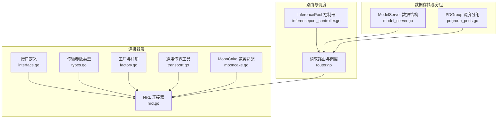
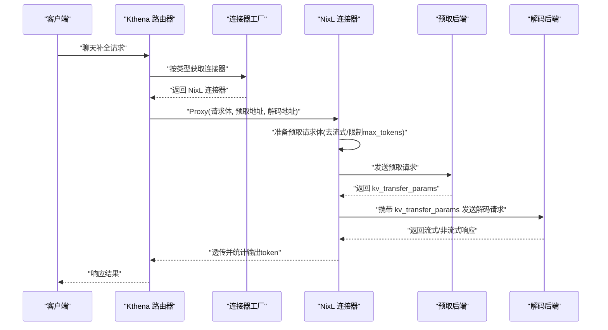
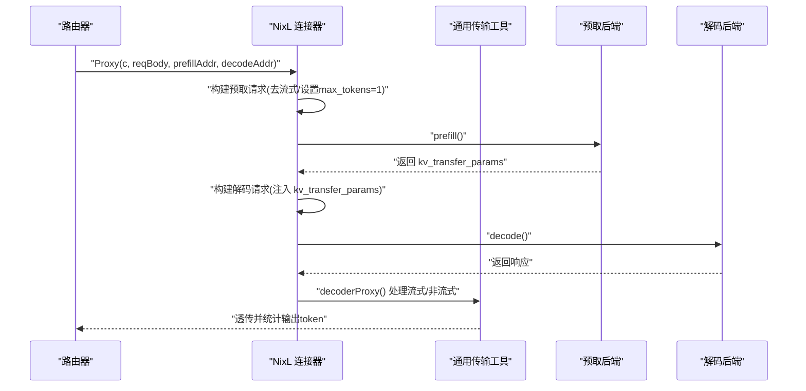
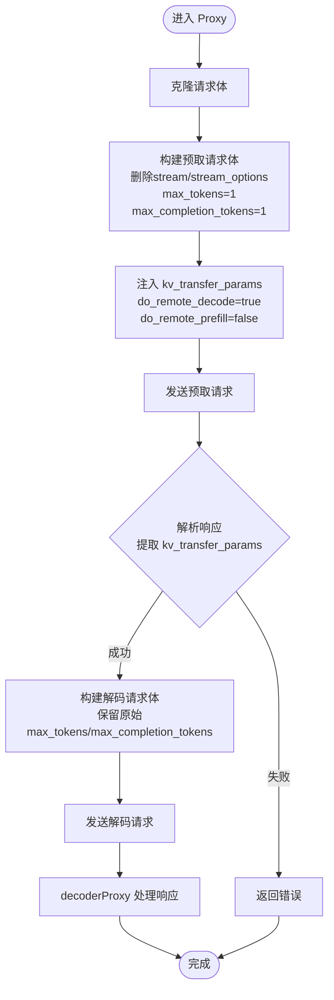
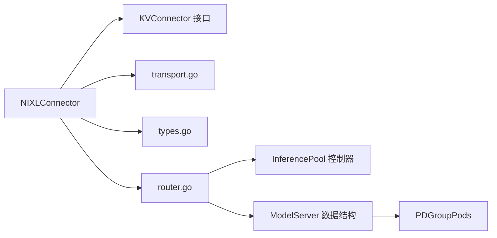

# NixL 连接器

<cite>
**本文引用的文件**   
- [nixl.go](file://pkg/kthena-router/connectors/nixl.go)
- [nixl_test.go](file://pkg/kthena-router/connectors/nixl_test.go)
- [factory.go](file://pkg/kthena-router/connectors/factory.go)
- [interface.go](file://pkg/kthena-router/connectors/interface.go)
- [types.go](file://pkg/kthena-router/connectors/types.go)
- [transport.go](file://pkg/kthena-router/connectors/transport.go)
- [router.go](file://pkg/kthena-router/router/router.go)
- [inferencepool_controller.go](file://pkg/kthena-router/controller/inferencepool_controller.go)
- [pdgroup_pods.go](file://pkg/kthena-router/datastore/pdgroup_pods.go)
- [model_server.go](file://pkg/kthena-router/datastore/model_server.go)
- [ModelServer-ds1.5b-pd-disaggregation.yaml](file://examples/kthena-router/ModelServer-ds1.5b-pd-disaggregation.yaml)
- [ModelServer-sglang.yaml](file://examples/kthena-router/ModelServer-sglang.yaml)
- [mooncake.go](file://pkg/kthena-router/connectors/mooncake.go)
</cite>

## 目录
1. [简介](#简介)
2. [项目结构](#项目结构)
3. [核心组件](#核心组件)
4. [架构总览](#架构总览)
5. [详细组件分析](#详细组件分析)
6. [依赖分析](#依赖分析)
7. [性能考虑](#性能考虑)
8. [故障排查指南](#故障排查指南)
9. [结论](#结论)
10. [附录](#附录)

## 简介
本文件面向 Kthena 的 NixL 分布式推理连接器，系统性阐述其架构设计与实现机制，重点说明以下方面：
- 如何通过 NixL 实现高性能的 KV 缓存跨阶段传输，支撑大规模分布式推理
- 节点间通信、负载均衡与故障转移策略
- 分布式协议、节点发现与集群管理、任务调度与资源协调
- 集群配置、网络拓扑要求与性能监控指标
- 部署、维护与性能优化实践
- 与其他连接器（如 MoonCake、SGLang）的差异与适用场景

## 项目结构
围绕 NixL 连接器的关键代码位于 kthena-router 的 connectors 子模块，并与路由层、调度层、存储层协同工作；示例中提供了基于 ModelServer 的预取-解码（Prefill-Decode）拆分部署样例。



**图表来源**
- [interface.go:23-31](file://pkg/kthena-router/connectors/interface.go#L23-L31)
- [nixl.go:34-51](file://pkg/kthena-router/connectors/nixl.go#L34-L51)
- [types.go:19-27](file://pkg/kthena-router/connectors/types.go#L19-L27)
- [factory.go:21-59](file://pkg/kthena-router/connectors/factory.go#L21-L59)
- [transport.go:33-78](file://pkg/kthena-router/connectors/transport.go#L33-L78)
- [mooncake.go:19-25](file://pkg/kthena-router/connectors/mooncake.go#L19-L25)
- [router.go:404-439](file://pkg/kthena-router/router/router.go#L404-L439)
- [inferencepool_controller.go:36-68](file://pkg/kthena-router/controller/inferencepool_controller.go#L36-L68)
- [model_server.go:27-51](file://pkg/kthena-router/datastore/model_server.go#L27-L51)
- [pdgroup_pods.go:26-39](file://pkg/kthena-router/datastore/pdgroup_pods.go#L26-L39)

**章节来源**
- [nixl.go:1-205](file://pkg/kthena-router/connectors/nixl.go#L1-L205)
- [factory.go:1-60](file://pkg/kthena-router/connectors/factory.go#L1-L60)
- [router.go:404-439](file://pkg/kthena-router/router/router.go#L404-L439)

## 核心组件
- KVConnector 接口：统一抽象不同后端的 KV 缓存传输能力，定义名称与代理方法
- NIXLConnector：实现基于 NixL 的预取-解码两阶段推理流程，负责构建请求体、发送预取请求获取 KV 传输参数、再向解码阶段转发并处理流式响应
- KVTransferParams：描述远程 KV 传输所需的参数（是否远程预取/解码、目标主机与端口等）
- 工厂模式：按类型动态选择连接器实现（默认 HTTP、NixL、MoonCake、SGLang）
- 通用传输工具：封装预取/解码阶段的 HTTP 代理、流式响应处理、请求体准备与令牌用量统计
- 路由与调度：根据 ModelServer/PDGroup 信息进行节点选择与负载均衡
- 存储与分组：InferencePool、ModelServer、PDGroupPods 协同维护节点集合与分组信息

**章节来源**
- [interface.go:23-31](file://pkg/kthena-router/connectors/interface.go#L23-L31)
- [nixl.go:34-51](file://pkg/kthena-router/connectors/nixl.go#L34-L51)
- [types.go:19-27](file://pkg/kthena-router/connectors/types.go#L19-L27)
- [factory.go:21-59](file://pkg/kthena-router/connectors/factory.go#L21-L59)
- [transport.go:33-78](file://pkg/kthena-router/connectors/transport.go#L33-L78)
- [router.go:404-439](file://pkg/kthena-router/router/router.go#L404-L439)
- [inferencepool_controller.go:36-68](file://pkg/kthena-router/controller/inferencepool_controller.go#L36-L68)
- [pdgroup_pods.go:26-39](file://pkg/kthena-router/datastore/pdgroup_pods.go#L26-L39)

## 架构总览
下图展示 NixL 连接器在整体推理链路中的位置与交互：



**图表来源**
- [router.go:404-439](file://pkg/kthena-router/router/router.go#L404-L439)
- [factory.go:38-59](file://pkg/kthena-router/connectors/factory.go#L38-L59)
- [nixl.go:53-112](file://pkg/kthena-router/connectors/nixl.go#L53-L112)
- [transport.go:48-78](file://pkg/kthena-router/connectors/transport.go#L48-L78)

## 详细组件分析

### NixL 连接器类图
```mermaid
classDiagram
class KVConnector {
+Name() string
+Proxy(c, reqBody, prefillAddr, decodeAddr) (int, error)
}
class NIXLConnector {
-name string
-prefillRequest *http.Request
-decodeRequestBody map[string]interface{}
+Name() string
+Proxy(c, reqBody, prefillAddr, decodeAddr) (int, error)
-prefill(req, addr) (interface{}, error)
-buildDecodeRequest(c, reqBody, kvTransferParams) *http.Request
-decode(c, req, addr) (int, error)
}
class KVTransferParams {
+DoRemoteDecode bool
+DoRemotePrefill bool
+RemoteEngineID *string
+RemoteBlockIDs []string
+RemoteHost *string
+RemotePort *int
}
KVConnector <|.. NIXLConnector
NIXLConnector --> KVTransferParams : "使用"
```

**图表来源**
- [interface.go:23-31](file://pkg/kthena-router/connectors/interface.go#L23-L31)
- [nixl.go:34-51](file://pkg/kthena-router/connectors/nixl.go#L34-L51)
- [types.go:19-27](file://pkg/kthena-router/connectors/types.go#L19-L27)

**章节来源**
- [nixl.go:34-205](file://pkg/kthena-router/connectors/nixl.go#L34-L205)
- [types.go:19-27](file://pkg/kthena-router/connectors/types.go#L19-L27)

### 预取-解码两阶段流程（序列图）


**图表来源**
- [nixl.go:53-112](file://pkg/kthena-router/connectors/nixl.go#L53-L112)
- [transport.go:48-78](file://pkg/kthena-router/connectors/transport.go#L48-L78)

**章节来源**
- [nixl.go:53-173](file://pkg/kthena-router/connectors/nixl.go#L53-L173)
- [transport.go:80-227](file://pkg/kthena-router/connectors/transport.go#L80-L227)

### 请求体准备与 KV 参数注入（流程图）


**图表来源**
- [nixl.go:182-204](file://pkg/kthena-router/connectors/nixl.go#L182-L204)
- [transport.go:80-90](file://pkg/kthena-router/connectors/transport.go#L80-L90)

**章节来源**
- [nixl.go:182-204](file://pkg/kthena-router/connectors/nixl.go#L182-L204)
- [transport.go:80-90](file://pkg/kthena-router/connectors/transport.go#L80-L90)

### 连接器工厂与类型注册
- 工厂支持多种连接器类型，默认注册包括 HTTP、NIXL、MoonCake、SGLang
- 未找到指定类型时回退到 HTTP 连接器

**章节来源**
- [factory.go:21-59](file://pkg/kthena-router/connectors/factory.go#L21-L59)

### MoonCake 兼容适配
- MoonCake 在某些场景下的行为与 NixL 类似，因此复用 NixL 的实现以减少重复逻辑

**章节来源**
- [mooncake.go:19-25](file://pkg/kthena-router/connectors/mooncake.go#L19-L25)

### 路由与调度（集群管理与负载均衡）
- 路由器根据模型名、提示词、ModelServer/PDGroup 信息进行调度
- InferencePool 控制器监听 InferencePool 变更，更新本地存储
- PDGroupPods 提供按预取/解码角色分类的 Pod 集合，便于高效调度

**章节来源**
- [router.go:404-439](file://pkg/kthena-router/router/router.go#L404-L439)
- [inferencepool_controller.go:36-68](file://pkg/kthena-router/controller/inferencepool_controller.go#L36-L68)
- [pdgroup_pods.go:26-39](file://pkg/kthena-router/datastore/pdgroup_pods.go#L26-L39)

## 依赖分析
- 组件内聚高：NixL 连接器聚焦于 KV 传输参数的获取与两阶段请求编排
- 松耦合：通过 KVConnector 接口与工厂解耦具体实现；通过通用传输工具处理 HTTP 与流式细节
- 外部依赖：Gin 上下文、HTTP 默认传输、日志库；调度与存储依赖 K8s Informer 与内部数据结构



**图表来源**
- [nixl.go:34-51](file://pkg/kthena-router/connectors/nixl.go#L34-L51)
- [transport.go:33-78](file://pkg/kthena-router/connectors/transport.go#L33-L78)
- [types.go:19-27](file://pkg/kthena-router/connectors/types.go#L19-L27)
- [router.go:404-439](file://pkg/kthena-router/router/router.go#L404-L439)
- [inferencepool_controller.go:36-68](file://pkg/kthena-router/controller/inferencepool_controller.go#L36-L68)
- [model_server.go:27-51](file://pkg/kthena-router/datastore/model_server.go#L27-L51)
- [pdgroup_pods.go:26-39](file://pkg/kthena-router/datastore/pdgroup_pods.go#L26-L39)

**章节来源**
- [nixl.go:34-205](file://pkg/kthena-router/connectors/nixl.go#L34-L205)
- [transport.go:33-227](file://pkg/kthena-router/connectors/transport.go#L33-L227)

## 性能考虑
- 两阶段推理优化
  - 预取阶段仅生成一个 token 并关闭流式，降低 KV 内存占用与网络开销
  - 解码阶段携带 KV 传输参数，避免重复计算 KV，提升吞吐
- 流式响应处理
  - decoderProxy 对 SSE/NDJSON 做逐行读取与令牌用量解析，减少内存峰值
- 请求体与上下文
  - 使用深拷贝避免并发重试导致的请求体被消费问题
  - 保持原始请求字段（如 max_tokens、max_completion_tokens），确保语义一致

**章节来源**
- [nixl.go:53-112](file://pkg/kthena-router/connectors/nixl.go#L53-L112)
- [transport.go:175-227](file://pkg/kthena-router/connectors/transport.go#L175-L227)
- [nixl_test.go:381-431](file://pkg/kthena-router/connectors/nixl_test.go#L381-L431)

## 故障排查指南
- 预取失败
  - 现象：预取阶段返回非 2xx 或缺少 kv_transfer_params
  - 排查：检查预取后端可达性、日志、超时设置；确认请求体已去除流式字段并正确设置 max_tokens
- 解码失败
  - 现象：解码阶段返回非 2xx 或流式解析异常
  - 排查：检查解码后端状态、decoderProxy 的响应头与内容类型判断
- 重试与请求体耗尽
  - 现象：多次重试导致请求体为空
  - 排查：确保每次调用 Proxy 前不复用已消费的请求体；测试用例验证了请求体不会被重复消耗
- 上下文与令牌用量
  - 现象：流式请求未包含令牌用量或非流式请求未显式 include_usage
  - 排查：addTokenUsage 会自动为流式请求添加 stream_options.include_usage，为非流式请求添加 include_usage

**章节来源**
- [nixl.go:114-173](file://pkg/kthena-router/connectors/nixl.go#L114-L173)
- [transport.go:125-145](file://pkg/kthena-router/connectors/transport.go#L125-L145)
- [nixl_test.go:381-465](file://pkg/kthena-router/connectors/nixl_test.go#L381-L465)

## 结论
NixL 连接器通过“预取-解码”两阶段与 KV 传输参数的标准化，实现了高效的分布式推理与 KV 缓存复用。结合工厂模式与通用传输工具，它在保证可扩展性的同时，提供了稳健的流式处理与错误处理能力。配合路由层的调度与存储层的分组管理，可在大规模集群中实现高可用与高性能的推理服务。

## 附录

### 集群配置与网络拓扑
- 示例资源
  - 预取-解码拆分的 ModelServer：通过 PDGroup 将预取与解码角色分离，分别匹配不同标签的 Pod
  - SGLang 模式下的 ModelServer：作为对比参考，展示不同推理引擎的接入方式
- 部署建议
  - 预取与解码后端应具备稳定的网络连通性与低延迟
  - 合理设置超时与重试策略，避免长尾请求影响整体吞吐
  - 使用 InferencePool 与 PDGroupPods 精准定位节点，提升调度效率

**章节来源**
- [ModelServer-ds1.5b-pd-disaggregation.yaml:1-22](file://examples/kthena-router/ModelServer-ds1.5b-pd-disaggregation.yaml#L1-L22)
- [ModelServer-sglang.yaml:1-16](file://examples/kthena-router/ModelServer-sglang.yaml#L1-L16)
- [router.go:404-439](file://pkg/kthena-router/router/router.go#L404-L439)
- [pdgroup_pods.go:26-39](file://pkg/kthena-router/datastore/pdgroup_pods.go#L26-L39)

### 与其他连接器的区别与适用场景
- NixL vs MoonCake
  - 行为相似：两者均采用两阶段推理与 KV 传输参数；MoonCake 通过适配复用 NixL 实现
- NixL vs SGLang
  - SGLang 更多用于 GPU 场景下的预取-解码拆分部署；NixL 则强调 KV 传输参数的标准化与跨引擎兼容
- 适用场景
  - NixL：需要统一 KV 传输协议、跨引擎兼容与高吞吐的分布式推理
  - MoonCake：与 NixL 类似的场景，但实现上共享同一套逻辑
  - SGLang：对 GPU 预取-解码拆分有特定需求的场景

**章节来源**
- [mooncake.go:19-25](file://pkg/kthena-router/connectors/mooncake.go#L19-L25)
- [factory.go:52-56](file://pkg/kthena-router/connectors/factory.go#L52-L56)