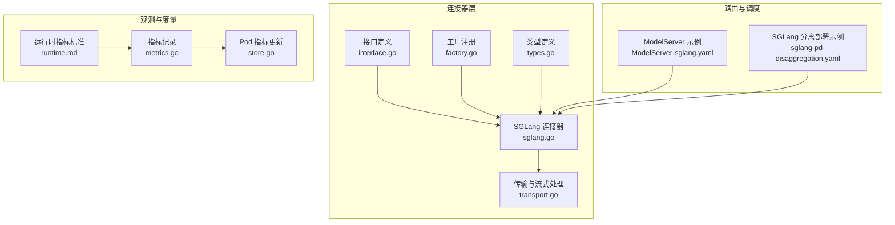
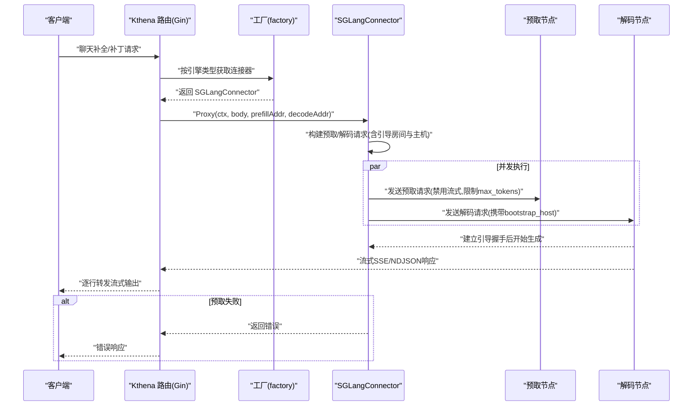
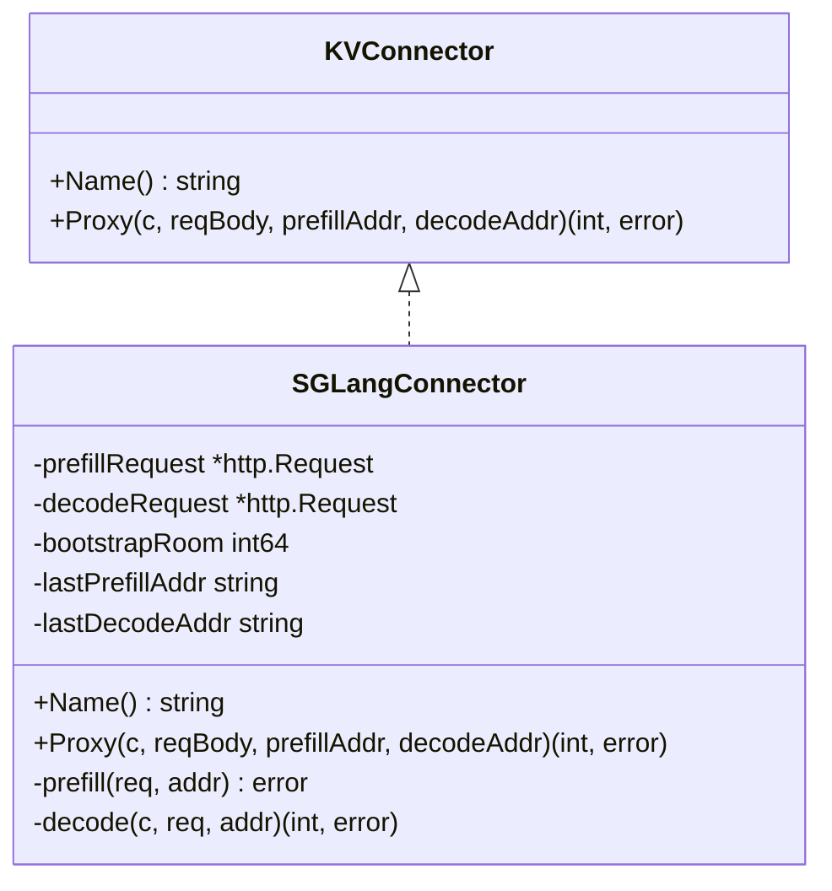
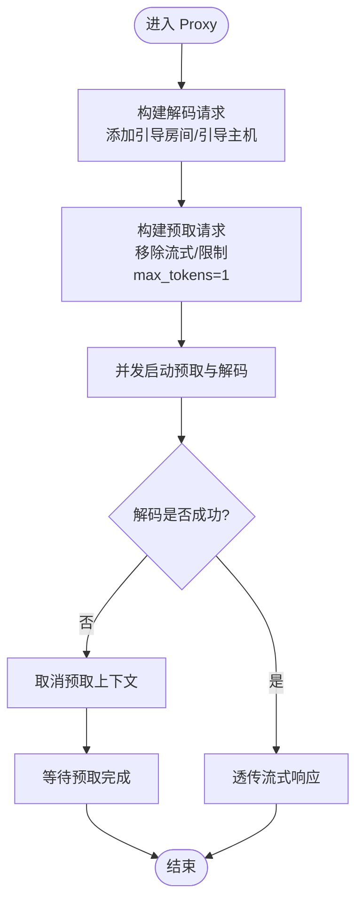
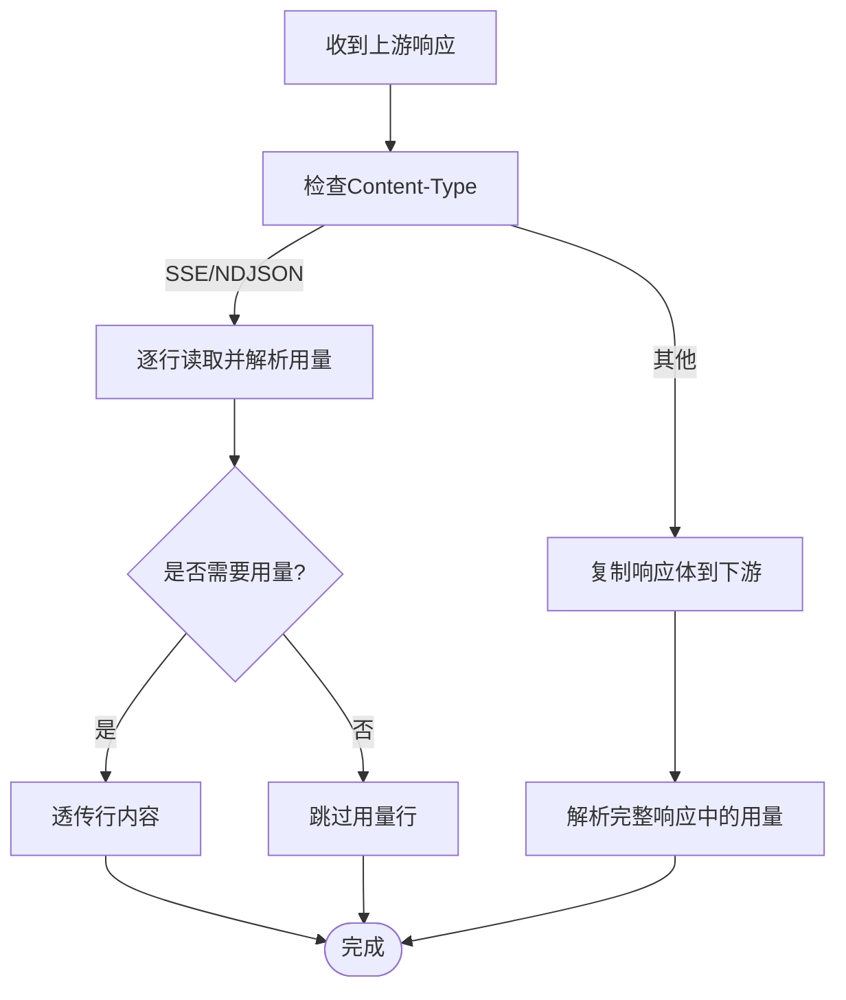
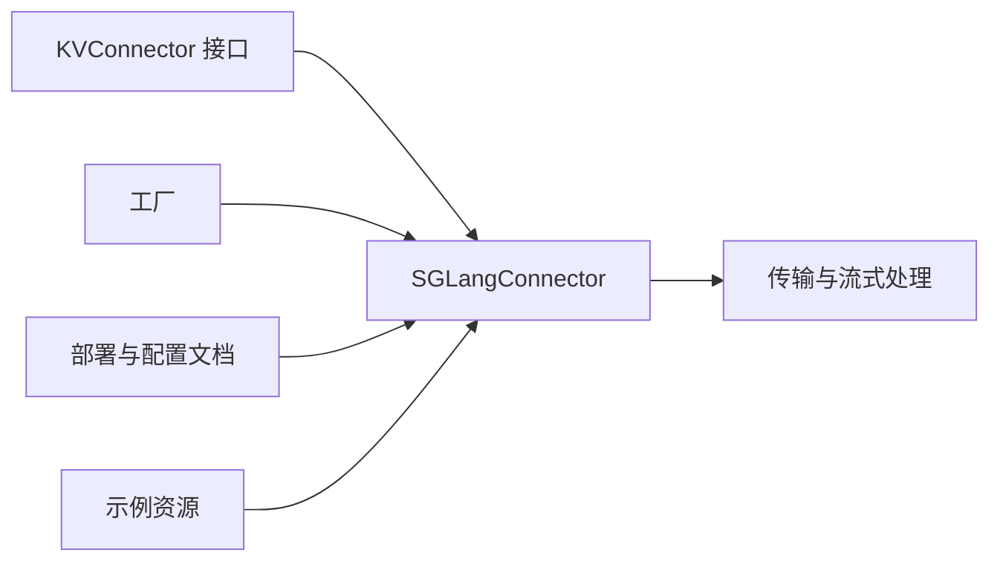

# SGLang 连接器

<cite>
**本文引用的文件**
- [sglang.go](file://pkg/kthena-router/connectors/sglang.go)
- [transport.go](file://pkg/kthena-router/connectors/transport.go)
- [factory.go](file://pkg/kthena-router/connectors/factory.go)
- [interface.go](file://pkg/kthena-router/connectors/interface.go)
- [types.go](file://pkg/kthena-router/connectors/types.go)
- [sglang-pd-disaggregation.md](file://docs/kthena/docs/user-guide/prefill-decode-disaggregation/sglang-pd-disaggregation.md)
- [sglang-pd-disaggregation.yaml](file://examples/model-serving/sglang-pd-disaggregation.yaml)
- [ModelServer-sglang.yaml](file://examples/kthena-router/ModelServer-sglang.yaml)
- [runtime.md](file://docs/kthena/docs/user-guide/runtime.md)
- [metrics.go](file://pkg/kthena-router/metrics/metrics.go)
- [store.go](file://pkg/kthena-router/datastore/store.go)
</cite>

## 目录
1. [简介](#简介)
2. [项目结构](#项目结构)
3. [核心组件](#核心组件)
4. [架构总览](#架构总览)
5. [详细组件分析](#详细组件分析)
6. [依赖关系分析](#依赖关系分析)
7. [性能考量](#性能考量)
8. [故障排查指南](#故障排查指南)
9. [结论](#结论)
10. [附录](#附录)

## 简介
本文件面向 Kthena 的 SGLang 连接器，系统性阐述其在预取-解码（Prefill-Decode）分离推理中的适配与优化机制。重点覆盖以下方面：
- SGLang 特有的“引导房间”协议与并发执行模型
- 异步推理请求、批量处理与流式响应的处理方式
- SGLang 相关配置参数、内存与 GPU 资源调度要点
- 连接器与 SGLang 服务的通信协议、心跳与状态同步
- 性能监控指标、资源利用率统计与故障恢复策略
- SGLang 集群部署配置与连接器调优最佳实践

## 项目结构
围绕 SGLang 连接器的关键代码位于 pkg/kthena-router/connectors，并配套文档与示例位于 docs 与 examples。

**图表来源**
- [interface.go:23-31](file://pkg/kthena-router/connectors/interface.go#L23-L31)
- [factory.go:38-59](file://pkg/kthena-router/connectors/factory.go#L38-L59)
- [sglang.go:42-70](file://pkg/kthena-router/connectors/sglang.go#L42-L70)
- [transport.go:48-78](file://pkg/kthena-router/connectors/transport.go#L48-L78)
- [types.go:19-27](file://pkg/kthena-router/connectors/types.go#L19-L27)
- [ModelServer-sglang.yaml:1-16](file://examples/kthena-router/ModelServer-sglang.yaml#L1-L16)
- [sglang-pd-disaggregation.yaml:1-140](file://examples/model-serving/sglang-pd-disaggregation.yaml#L1-L140)
- [runtime.md:121-134](file://docs/kthena/docs/user-guide/runtime.md#L121-L134)
- [metrics.go:236-264](file://pkg/kthena-router/metrics/metrics.go#L236-L264)
- [store.go:1168-1188](file://pkg/kthena-router/datastore/store.go#L1168-L1188)

**章节来源**
- [sglang.go:42-70](file://pkg/kthena-router/connectors/sglang.go#L42-L70)
- [transport.go:48-78](file://pkg/kthena-router/connectors/transport.go#L48-L78)
- [factory.go:38-59](file://pkg/kthena-router/connectors/factory.go#L38-L59)
- [interface.go:23-31](file://pkg/kthena-router/connectors/interface.go#L23-L31)
- [types.go:19-27](file://pkg/kthena-router/connectors/types.go#L19-L27)
- [sglang-pd-disaggregation.md:1-245](file://docs/kthena/docs/user-guide/prefill-decode-disaggregation/sglang-pd-disaggregation.md#L1-L245)
- [sglang-pd-disaggregation.yaml:1-140](file://examples/model-serving/sglang-pd-disaggregation.yaml#L1-L140)
- [ModelServer-sglang.yaml:1-16](file://examples/kthena-router/ModelServer-sglang.yaml#L1-L16)
- [runtime.md:121-134](file://docs/kthena/docs/user-guide/runtime.md#L121-L134)
- [metrics.go:236-264](file://pkg/kthena-router/metrics/metrics.go#L236-L264)
- [store.go:1168-1188](file://pkg/kthena-router/datastore/store.go#L1168-L1188)

## 核心组件
- KVConnector 接口：统一抽象不同后端的 KV 缓存操作与请求代理能力。
- SGLangConnector：实现 SGLang 预取-解码分离协议，负责构建与并发执行预取与解码请求，并进行流式响应透传与令牌用量统计。
- 传输与流式处理：封装预取/解码阶段的 HTTP 传输、流式 SSE/NDJSON 解析与非流式响应处理。
- 工厂模式：按引擎类型选择合适的连接器，默认注册 SGLang 内部连接器。

**章节来源**
- [interface.go:23-31](file://pkg/kthena-router/connectors/interface.go#L23-L31)
- [sglang.go:42-70](file://pkg/kthena-router/connectors/sglang.go#L42-L70)
- [transport.go:48-78](file://pkg/kthena-router/connectors/transport.go#L48-L78)
- [factory.go:38-59](file://pkg/kthena-router/connectors/factory.go#L38-L59)

## 架构总览
SGLang 连接器在 Kthena 路由层中扮演“协议适配器”，将上层请求转换为符合 SGLang 协议的预取与解码两阶段请求，并通过并发执行确保“引导房间”握手成功，随后将解码阶段的流式响应透明回传给客户端。

**图表来源**
- [sglang.go:86-195](file://pkg/kthena-router/connectors/sglang.go#L86-L195)
- [transport.go:48-78](file://pkg/kthena-router/connectors/transport.go#L48-L78)
- [factory.go:38-59](file://pkg/kthena-router/connectors/factory.go#L38-L59)

## 详细组件分析

### SGLangConnector 类与协议适配
- 结构体字段
  - 预取/解码请求缓存与地址变更检测，避免重复构造
  - 唯一引导房间 ID，用于 KV 缓存转移协调
- 关键方法
  - Name：返回连接器类型名
  - Proxy：构建并并发执行预取与解码；若解码失败则取消预取上下文以避免悬挂等待
  - prefill/decode：分别设置目标地址并调用传输层代理

**图表来源**
- [interface.go:23-31](file://pkg/kthena-router/connectors/interface.go#L23-L31)
- [sglang.go:42-70](file://pkg/kthena-router/connectors/sglang.go#L42-L70)

**章节来源**
- [sglang.go:42-70](file://pkg/kthena-router/connectors/sglang.go#L42-L70)
- [sglang.go:86-195](file://pkg/kthena-router/connectors/sglang.go#L86-L195)
- [sglang.go:197-209](file://pkg/kthena-router/connectors/sglang.go#L197-L209)

### 预取-解码分离协议与并发执行
- 引导握手
  - 解码请求携带预取节点 IP 与唯一引导房间 ID，使解码节点在接收请求时主动连接预取节点的引导 HTTP 服务器交换 ZMQ 元数据
  - 必须保证预取与解码请求同时在途，否则预取会因无法建立握手而超时并中止
- 请求改造
  - 预取请求禁用流式、限制最大生成 token 数为 1，仅用于 KV 缓存预热
  - 解码请求保留流式选项或开启流式用量统计，以便下游聚合输出令牌数
- 并发执行
  - 预取与解码在两个 goroutine 中并发发起
  - 若解码失败，立即取消预取上下文，避免长时间等待

**图表来源**
- [sglang.go:86-195](file://pkg/kthena-router/connectors/sglang.go#L86-L195)
- [transport.go:80-90](file://pkg/kthena-router/connectors/transport.go#L80-L90)

**章节来源**
- [sglang.go:72-86](file://pkg/kthena-router/connectors/sglang.go#L72-L86)
- [sglang.go:105-132](file://pkg/kthena-router/connectors/sglang.go#L105-L132)
- [sglang.go:134-171](file://pkg/kthena-router/connectors/sglang.go#L134-L171)

### 流式响应与令牌用量统计
- 流式判断：依据响应头 Content-Type 判断是否为 SSE 或 NDJSON
- 流式处理：逐行读取并解析流中用量信息，支持过滤或透传
- 非流式处理：复制响应体到下游，并解析用量信息

**图表来源**
- [transport.go:169-173](file://pkg/kthena-router/connectors/transport.go#L169-L173)
- [transport.go:175-205](file://pkg/kthena-router/connectors/transport.go#L175-L205)
- [transport.go:207-226](file://pkg/kthena-router/connectors/transport.go#L207-L226)

**章节来源**
- [transport.go:169-226](file://pkg/kthena-router/connectors/transport.go#L169-L226)

### 工厂与默认注册
- 工厂根据引擎类型返回对应连接器
- 默认工厂注册 SGLang 内部连接器，供 PD 分离场景自动选择

**章节来源**
- [factory.go:38-59](file://pkg/kthena-router/connectors/factory.go#L38-L59)

### KV 传输参数类型
- 定义跨阶段 KV 缓存传输所需的参数结构，便于扩展不同后端（如 Mooncake）

**章节来源**
- [types.go:19-27](file://pkg/kthena-router/connectors/types.go#L19-L27)

## 依赖关系分析
- SGLangConnector 依赖传输层完成 HTTP 请求往返与流式处理
- 工厂负责连接器实例化与选择
- 文档与示例提供部署与配置参考

**图表来源**
- [interface.go:23-31](file://pkg/kthena-router/connectors/interface.go#L23-L31)
- [factory.go:38-59](file://pkg/kthena-router/connectors/factory.go#L38-L59)
- [sglang.go:42-70](file://pkg/kthena-router/connectors/sglang.go#L42-L70)
- [transport.go:48-78](file://pkg/kthena-router/connectors/transport.go#L48-L78)
- [sglang-pd-disaggregation.md:1-245](file://docs/kthena/docs/user-guide/prefill-decode-disaggregation/sglang-pd-disaggregation.md#L1-L245)
- [sglang-pd-disaggregation.yaml:1-140](file://examples/model-serving/sglang-pd-disaggregation.yaml#L1-L140)

**章节来源**
- [interface.go:23-31](file://pkg/kthena-router/connectors/interface.go#L23-L31)
- [factory.go:38-59](file://pkg/kthena-router/connectors/factory.go#L38-L59)
- [sglang.go:42-70](file://pkg/kthena-router/connectors/sglang.go#L42-L70)
- [transport.go:48-78](file://pkg/kthena-router/connectors/transport.go#L48-L78)
- [sglang-pd-disaggregation.md:1-245](file://docs/kthena/docs/user-guide/prefill-decode-disaggregation/sglang-pd-disaggregation.md#L1-L245)
- [sglang-pd-disaggregation.yaml:1-140](file://examples/model-serving/sglang-pd-disaggregation.yaml#L1-L140)

## 性能考量
- 并发执行降低端到端延迟：预取与解码同时在途，缩短握手等待时间
- 流式透传减少缓冲与拷贝：逐行转发，降低首 token 时间
- 用量统计与指标标准化：统一 token 统计口径，便于跨引擎对比
- Pod 指标采集：按引擎类型拉取指标并更新直方图与计量器

建议
- 将预取阶段 max_tokens 设为 1，避免不必要的生成开销
- 在解码阶段启用流式用量统计，提升可观测性
- 使用统一指标命名空间，结合 Prometheus/Grafana 进行可视化

**章节来源**
- [sglang.go:120-132](file://pkg/kthena-router/connectors/sglang.go#L120-L132)
- [transport.go:125-145](file://pkg/kthena-router/connectors/transport.go#L125-L145)
- [runtime.md:121-134](file://docs/kthena/docs/user-guide/runtime.md#L121-L134)
- [metrics.go:236-264](file://pkg/kthena-router/metrics/metrics.go#L236-L264)
- [store.go:1168-1188](file://pkg/kthena-router/datastore/store.go#L1168-L1188)

## 故障排查指南
常见问题与定位思路
- 预取超时或中止
  - 现象：预取阶段报错，提示 KV 传输中止
  - 原因：解码请求未及时到达，导致预取节点无法建立引导握手
  - 处理：确认并发执行已生效，检查解码节点可达性与引导主机字段
- 解码失败
  - 现象：解码阶段返回错误
  - 处理：查看解码节点日志；若发生错误，立即取消预取上下文，避免资源浪费
- 流式输出异常
  - 现象：客户端未收到持续输出
  - 处理：检查上游响应头 Content-Type；验证流式解析逻辑与用量过滤开关

**章节来源**
- [sglang.go:80-86](file://pkg/kthena-router/connectors/sglang.go#L80-L86)
- [sglang.go:164-168](file://pkg/kthena-router/connectors/sglang.go#L164-L168)
- [transport.go:169-173](file://pkg/kthena-router/connectors/transport.go#L169-L173)

## 结论
SGLang 连接器通过严格的预取-解码分离协议与并发执行模型，实现了高效的 KV 缓存转移与低延迟流式推理。配合统一的指标标准与部署示例，可快速在 GPU 集群上落地 SGLang 分离推理方案，并具备良好的可观测性与可维护性。

## 附录

### SGLang 部署与配置要点
- ModelServing：定义 prefill 与 decode 两个角色，分别以不同模式启动 SGLang 服务，并使用 Mooncake 作为 KV 传输后端
- ModelServer：声明推理引擎为 SGLang，配置工作负载端口与超时策略
- 示例命令：提供完整的 apply 步骤与健康检查端点

**章节来源**
- [sglang-pd-disaggregation.md:1-245](file://docs/kthena/docs/user-guide/prefill-decode-disaggregation/sglang-pd-disaggregation.md#L1-L245)
- [sglang-pd-disaggregation.yaml:1-140](file://examples/model-serving/sglang-pd-disaggregation.yaml#L1-L140)
- [ModelServer-sglang.yaml:1-16](file://examples/kthena-router/ModelServer-sglang.yaml#L1-L16)

### SGLang 特有配置参数与资源调度
- 引擎参数
  - 模型路径、主机与端口、分离模式（prefill/decode）、传输后端（mooncake）、指标开关等
- 资源与探针
  - GPU/内存/CPU 资源限制与请求、共享内存卷、Hugging Face 缓存挂载、就绪探针
- 路由与超时
  - ModelServer 指定推理引擎与超时时间，保障请求稳定性

**章节来源**
- [sglang-pd-disaggregation.yaml:21-129](file://examples/model-serving/sglang-pd-disaggregation.yaml#L21-L129)
- [ModelServer-sglang.yaml:6-16](file://examples/kthena-router/ModelServer-sglang.yaml#L6-L16)