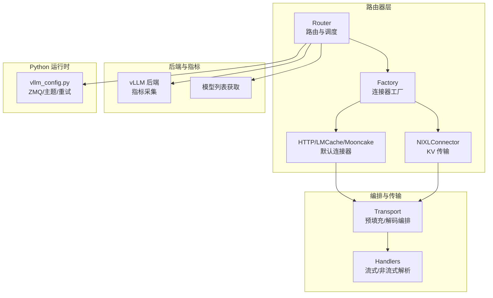
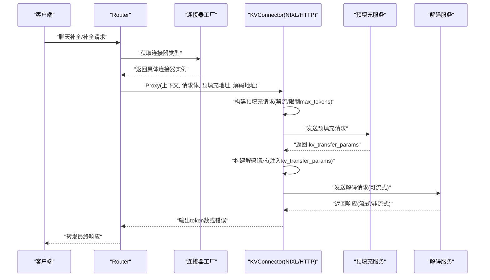
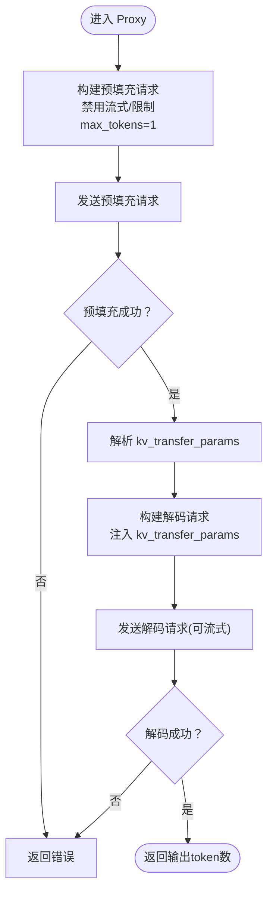
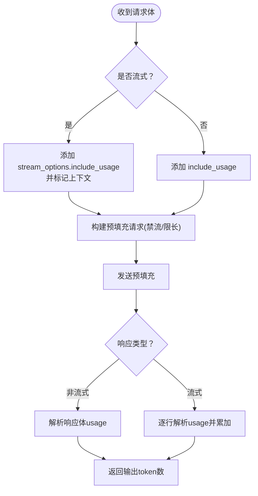
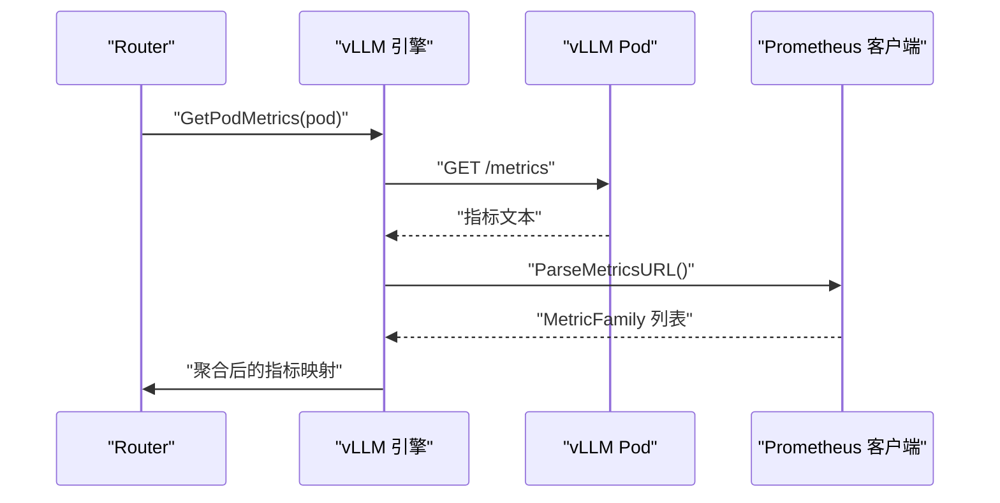
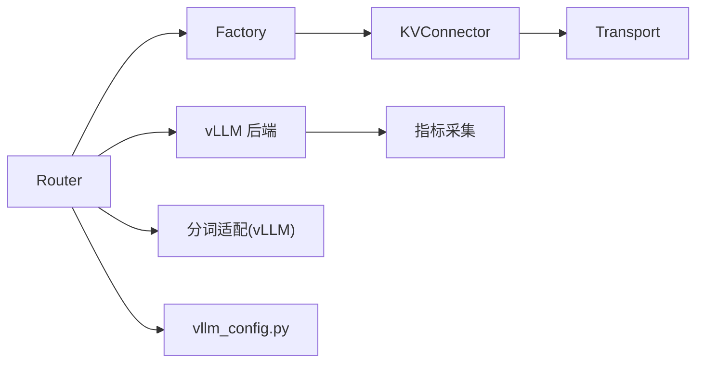

# vLLM 连接器

<cite>
**本文引用的文件**
- [pkg/kthena-router/connectors/interface.go](file://pkg/kthena-router/connectors/interface.go)
- [pkg/kthena-router/connectors/factory.go](file://pkg/kthena-router/connectors/factory.go)
- [pkg/kthena-router/connectors/nixl.go](file://pkg/kthena-router/connectors/nixl.go)
- [pkg/kthena-router/connectors/transport.go](file://pkg/kthena-router/connectors/transport.go)
- [pkg/kthena-router/connectors/types.go](file://pkg/kthena-router/connectors/types.go)
- [pkg/kthena-router/backend/vllm/metrics.go](file://pkg/kthena-router/backend/vllm/metrics.go)
- [pkg/kthena-router/backend/vllm/models.go](file://pkg/kthena-router/backend/vllm/models.go)
- [pkg/kthena-router/scheduler/plugins/tokenization/vllm.go](file://pkg/kthena-router/scheduler/plugins/tokenization/vllm.go)
- [python/kthena/runtime/vllm_config.py](file://python/kthena/runtime/vllm_config.py)
- [docs/proposal/vllm-kv-connector-architecture.md](file://docs/proposal/vllm-kv-connector-architecture.md)
- [docs/kthena/docs/user-guide/prefill-decode-disaggregation/vllm-pd-disaggregation.md](file://docs/kthena/docs/user-guide/prefill-decode-disaggregation/vllm-pd-disaggregation.md)
- [examples/kthena-router/ModelServer-ds1.5b.yaml](file://examples/kthena-router/ModelServer-ds1.5b.yaml)
- [pkg/model-booster-controller/convert/templates/vllm.yaml](file://pkg/model-booster-controller/convert/templates/vllm.yaml)
</cite>

## 目录
1. [简介](#简介)
2. [项目结构](#项目结构)
3. [核心组件](#核心组件)
4. [架构总览](#架构总览)
5. [详细组件分析](#详细组件分析)
6. [依赖关系分析](#依赖关系分析)
7. [性能考量](#性能考量)
8. [故障排查指南](#故障排查指南)
9. [结论](#结论)
10. [附录](#附录)

## 简介
本技术文档聚焦于 Kthena vLLM 连接器，系统性阐述其在 vLLM 推理引擎上的连接与编排能力，包括高性能预填充-解码（Prefill-Decode，简称 PD）拆分、KV 缓存传输、请求格式转换、响应解析与错误处理、性能指标采集与 GPU 利用统计、以及 vLLM 配置参数与动态批处理相关实践。文档同时给出集群部署、连接器配置与性能调优的实用指南。

## 项目结构
围绕 vLLM 连接器的关键代码与文档分布如下：
- 连接器接口与工厂：定义统一 KVConnector 接口、默认工厂注册与扩展点
- 具体连接器实现：NIXLConnector（高并发内存 KV 传输）、HTTP/LMCache/Mooncake 适配（复用 HTTP）
- 请求/响应编排：预填充请求构建、解码请求构建、流式/非流式响应处理
- 后端指标与模型列表：从 vLLM 指标端点采集 GPU 缓存使用、等待/运行中的请求数、首 token 时间与输出 token 时间等
- 分词适配：对 vLLM 的 /tokenize 接口进行输入准备与结果解析
- Python 运行时配置：vLLM 相关运行时参数（如 ZMQ 端点、主题过滤等）
- 文档与示例：vLLM KV 连接器架构提案、GPU 场景 PD 拆分部署指南、示例 CRD 与模板



图表来源
- [pkg/kthena-router/connectors/factory.go:47-59](file://pkg/kthena-router/connectors/factory.go#L47-L59)
- [pkg/kthena-router/connectors/nixl.go:34-51](file://pkg/kthena-router/connectors/nixl.go#L34-L51)
- [pkg/kthena-router/connectors/transport.go:33-78](file://pkg/kthena-router/connectors/transport.go#L33-L78)
- [pkg/kthena-router/backend/vllm/metrics.go:71-79](file://pkg/kthena-router/backend/vllm/metrics.go#L71-L79)
- [python/kthena/runtime/vllm_config.py:18-31](file://python/kthena/runtime/vllm_config.py#L18-L31)

章节来源
- [pkg/kthena-router/connectors/factory.go:47-59](file://pkg/kthena-router/connectors/factory.go#L47-L59)
- [docs/proposal/vllm-kv-connector-architecture.md:58-162](file://docs/proposal/vllm-kv-connector-architecture.md#L58-L162)

## 核心组件
- KVConnector 接口：抽象 KV 缓存传输的统一入口，定义 Proxy 方法以执行完整的预填充-解码流程，并返回输出 token 数或错误
- 工厂模式：注册默认连接器（HTTP/LMCache/Mooncake/NIXL/SGLang），按需选择具体实现
- NIXLConnector：面向高性能内存 KV 传输，显式构建预填充请求、解析 kv_transfer_params 并注入到解码请求
- 传输编排：预填充阶段移除流式选项并限制 max_tokens=1；解码阶段根据是否流式分别处理
- 指标采集：从 vLLM 指标端点拉取 GPU 缓存使用率、等待/运行中请求数、首 token 时间与输出 token 时间等
- 分词适配：针对 vLLM 的 /tokenize 接口准备补全/对话两类请求并解析计数、最大长度、tokens 等

章节来源
- [pkg/kthena-router/connectors/interface.go:23-31](file://pkg/kthena-router/connectors/interface.go#L23-L31)
- [pkg/kthena-router/connectors/factory.go:47-59](file://pkg/kthena-router/connectors/factory.go#L47-L59)
- [pkg/kthena-router/connectors/nixl.go:53-112](file://pkg/kthena-router/connectors/nixl.go#L53-L112)
- [pkg/kthena-router/connectors/transport.go:80-145](file://pkg/kthena-router/connectors/transport.go#L80-L145)
- [pkg/kthena-router/backend/vllm/metrics.go:29-56](file://pkg/kthena-router/backend/vllm/metrics.go#L29-L56)
- [pkg/kthena-router/scheduler/plugins/tokenization/vllm.go:24-84](file://pkg/kthena-router/scheduler/plugins/tokenization/vllm.go#L24-L84)

## 架构总览
Kthena 路由器在 PD 拆分场景下，通过工厂选择合适的 KVConnector 实现，对预填充与解码阶段进行编排与传输协调。NIXLConnector 显式管理 KV 传输参数，确保解码阶段能正确访问预填充阶段生成的 KV 缓存；HTTP/LMCache/Mooncake 则采用“隐式”传输（通常依赖共享存储或网络缓存）。编排层负责请求体转换、流式/非流式响应解析与 token 使用统计，后端层从 vLLM 指标端点采集关键性能指标。



图表来源
- [pkg/kthena-router/connectors/nixl.go:53-112](file://pkg/kthena-router/connectors/nixl.go#L53-L112)
- [pkg/kthena-router/connectors/transport.go:80-145](file://pkg/kthena-router/connectors/transport.go#L80-L145)
- [docs/proposal/vllm-kv-connector-architecture.md:114-162](file://docs/proposal/vllm-kv-connector-architecture.md#L114-L162)

## 详细组件分析

### KVConnector 接口与工厂
- 接口职责：统一抽象 KV 缓存传输，屏蔽不同实现细节
- 工厂注册：默认注册 HTTP/LMCache/Mooncake/NIXL/SGLang，便于按模型/集群需求切换
- 扩展点：新增连接器仅需实现 KVConnector 并在工厂注册

```mermaid
classDiagram
class KVConnector {
+Name() string
+Proxy(c, reqBody, prefillAddr, decodeAddr) (int, error)
}
class Factory {
+RegisterConnectorBuilder(type, builder)
+GetConnector(type) KVConnector
}
class NIXLConnector {
-name string
-prefillRequest *http.Request
-decodeRequestBody map[string]interface{}
+Name() string
+Proxy(c, reqBody, prefillAddr, decodeAddr) (int, error)
}
class HTTPConnector {
+Name() string
+Proxy(c, reqBody, prefillAddr, decodeAddr) (int, error)
}
Factory --> KVConnector : "创建"
NIXLConnector ..|> KVConnector
HTTPConnector ..|> KVConnector
```

图表来源
- [pkg/kthena-router/connectors/interface.go:23-31](file://pkg/kthena-router/connectors/interface.go#L23-L31)
- [pkg/kthena-router/connectors/factory.go:47-59](file://pkg/kthena-router/connectors/factory.go#L47-L59)
- [pkg/kthena-router/connectors/nixl.go:34-51](file://pkg/kthena-router/connectors/nixl.go#L34-L51)

章节来源
- [pkg/kthena-router/connectors/interface.go:23-31](file://pkg/kthena-router/connectors/interface.go#L23-L31)
- [pkg/kthena-router/connectors/factory.go:47-59](file://pkg/kthena-router/connectors/factory.go#L47-L59)

### NIXLConnector：显式 KV 传输
- 预填充阶段：构建带 kv_transfer_params 的请求，发送至预填充服务，解析返回的 kv_transfer_params
- 解码阶段：将 kv_transfer_params 注入解码请求，发送至解码服务，完成 KV 缓存的显式传递
- 流程度量：在预填充/解码阶段分别记录开始/结束状态码与上游请求数变化，便于可观测性



图表来源
- [pkg/kthena-router/connectors/nixl.go:53-112](file://pkg/kthena-router/connectors/nixl.go#L53-L112)
- [pkg/kthena-router/connectors/transport.go:80-90](file://pkg/kthena-router/connectors/transport.go#L80-L90)

章节来源
- [pkg/kthena-router/connectors/nixl.go:53-112](file://pkg/kthena-router/connectors/nixl.go#L53-L112)
- [pkg/kthena-router/connectors/transport.go:80-145](file://pkg/kthena-router/connectors/transport.go#L80-L145)

### 请求格式转换与响应解析
- 预填充请求：移除流式字段，设置 max_tokens/max_completion_tokens=1，避免实际生成 token
- 解码请求：根据是否流式决定是否开启 include_usage 或 stream_options.include_usage
- 响应解析：
  - 非流式：解析 OpenAI 风格响应体，提取 usage.completion_tokens
  - 流式：逐行解析 SSE/NDJSON，提取 usage 并累加输出 token 数，支持过滤 usage 行



图表来源
- [pkg/kthena-router/connectors/transport.go:80-145](file://pkg/kthena-router/connectors/transport.go#L80-L145)
- [pkg/kthena-router/connectors/transport.go:175-226](file://pkg/kthena-router/connectors/transport.go#L175-L226)

章节来源
- [pkg/kthena-router/connectors/transport.go:80-145](file://pkg/kthena-router/connectors/transport.go#L80-L145)
- [pkg/kthena-router/connectors/transport.go:175-226](file://pkg/kthena-router/connectors/transport.go#L175-L226)

### vLLM 指标采集与性能监控
- 指标端点：http://{podIP}:{MetricPort}/metrics
- 关键指标：
  - GPU 缓存使用率（vllm:gpu_cache_usage_perc）
  - 等待中的请求数（vllm:num_requests_waiting）
  - 正在运行的请求数（vllm:num_requests_running）
  - 首 token 时间（TTFT）直方图
  - 输出 token 时间（TPOT）直方图
- 统计方式：计数器/ Gauge 直接取值；直方图通过前后周期差值计算平均



图表来源
- [pkg/kthena-router/backend/vllm/metrics.go:71-79](file://pkg/kthena-router/backend/vllm/metrics.go#L71-L79)
- [pkg/kthena-router/backend/vllm/metrics.go:81-119](file://pkg/kthena-router/backend/vllm/metrics.go#L81-L119)

章节来源
- [pkg/kthena-router/backend/vllm/metrics.go:29-56](file://pkg/kthena-router/backend/vllm/metrics.go#L29-L56)
- [pkg/kthena-router/backend/vllm/metrics.go:71-119](file://pkg/kthena-router/backend/vllm/metrics.go#L71-L119)

### vLLM 分词适配
- 适配器：针对 vLLM 的 /tokenize 接口，支持补全与对话两种输入类型
- 请求准备：根据输入类型构造补全/对话请求体，可选指定 model 字段
- 响应解析：解析返回的 token 数、最大模型长度、tokens 与 token 字符串

章节来源
- [pkg/kthena-router/scheduler/plugins/tokenization/vllm.go:24-84](file://pkg/kthena-router/scheduler/plugins/tokenization/vllm.go#L24-L84)

### Python 运行时配置（vLLM）
- 配置项：包含 pod 标识、模型名、ZMQ 端点、主题过滤、轮询超时与重试次数等
- 用途：供运行时订阅 KV 事件、驱动 KV 缓存管理与传输

章节来源
- [python/kthena/runtime/vllm_config.py:18-31](file://python/kthena/runtime/vllm_config.py#L18-L31)

## 依赖关系分析
- 路由器依赖工厂创建连接器实例，连接器内部依赖传输编排模块完成请求构建与响应解析
- 后端指标模块依赖 Prometheus 客户端解析 vLLM 指标端点
- 分词插件依赖 vLLM 的 /tokenize 接口
- Python 运行时配置为 KV 事件订阅提供参数



图表来源
- [pkg/kthena-router/connectors/factory.go:47-59](file://pkg/kthena-router/connectors/factory.go#L47-L59)
- [pkg/kthena-router/connectors/nixl.go:53-112](file://pkg/kthena-router/connectors/nixl.go#L53-L112)
- [pkg/kthena-router/connectors/transport.go:33-78](file://pkg/kthena-router/connectors/transport.go#L33-L78)
- [pkg/kthena-router/backend/vllm/metrics.go:71-79](file://pkg/kthena-router/backend/vllm/metrics.go#L71-L79)
- [pkg/kthena-router/scheduler/plugins/tokenization/vllm.go:24-84](file://pkg/kthena-router/scheduler/plugins/tokenization/vllm.go#L24-L84)
- [python/kthena/runtime/vllm_config.py:18-31](file://python/kthena/runtime/vllm_config.py#L18-L31)

章节来源
- [pkg/kthena-router/connectors/factory.go:47-59](file://pkg/kthena-router/connectors/factory.go#L47-L59)
- [pkg/kthena-router/backend/vllm/metrics.go:71-79](file://pkg/kthena-router/backend/vllm/metrics.go#L71-L79)

## 性能考量
- 预填充-解码拆分：通过将 KV 缓存从预填充阶段迁移到解码阶段，减少解码阶段的 KV 计算开销，提升吞吐
- NIXL 内存传输：利用高速互联（如 NVLink/RDMA）在节点内进行 KV 缓存传输，降低跨节点延迟
- 流式输出：在解码阶段启用流式，降低首 token 延迟，改善用户体验
- 指标观测：通过 GPU 缓存使用率、等待/运行中请求数、TTFT/TPOT 等指标评估性能瓶颈
- 动态批处理：结合 vLLM 的批处理策略与 Kthena 的调度策略，合理分配预填充/解码资源，避免拥塞

## 故障排查指南
- 预填充失败：检查预填充服务健康状态、网络连通性与 KV 传输参数是否正确
- 解码失败：确认 kv_transfer_params 是否正确注入，解码服务是否能访问 KV 缓存
- 流式解析异常：核对 Content-Type 是否为 SSE/NDJSON，逐行解析逻辑是否正确处理 usage 行
- 指标缺失：确认 vLLM 指标端口与路径配置，Prometheus 客户端能否正常解析指标文本
- 分词接口异常：核对 /tokenize 请求体字段与 model 参数，确保响应解析字段完整

章节来源
- [pkg/kthena-router/connectors/nixl.go:114-145](file://pkg/kthena-router/connectors/nixl.go#L114-L145)
- [pkg/kthena-router/connectors/transport.go:175-226](file://pkg/kthena-router/connectors/transport.go#L175-L226)
- [pkg/kthena-router/backend/vllm/metrics.go:71-79](file://pkg/kthena-router/backend/vllm/metrics.go#L71-L79)
- [pkg/kthena-router/scheduler/plugins/tokenization/vllm.go:72-84](file://pkg/kthena-router/scheduler/plugins/tokenization/vllm.go#L72-L84)

## 结论
Kthena 的 vLLM 连接器通过统一的 KVConnector 接口与工厂模式，实现了对 vLLM 多种 KV 缓存传输机制的支持。NIXLConnector 在高性能场景下提供显式的 KV 传输编排，HTTP/LMCache/Mooncake 则满足更广泛的兼容性需求。配合请求格式转换、响应解析与指标采集，连接器在 PD 拆分推理中显著提升了性能与可观测性。结合部署指南与调优建议，可在生产环境中稳定高效地运行 vLLM 推理服务。

## 附录

### vLLM 集群部署与连接器配置
- GPU 场景 PD 拆分部署：预填充与解码角色分别运行 vLLM 服务，使用 NIXLConnector 作为 KV 传输后端
- ModelServer 配置：声明 inferenceEngine 为 vLLM，设置工作端口与 PD 组标签
- 示例 CRD：参考示例 ModelServer YAML 与用户指南中的部署步骤

章节来源
- [docs/kthena/docs/user-guide/prefill-decode-disaggregation/vllm-pd-disaggregation.md:12-209](file://docs/kthena/docs/user-guide/prefill-decode-disaggregation/vllm-pd-disaggregation.md#L12-L209)
- [examples/kthena-router/ModelServer-ds1.5b.yaml:1-16](file://examples/kthena-router/ModelServer-ds1.5b.yaml#L1-L16)

### vLLM 配置参数与动态批处理
- 运行时配置：通过 vllm_config.py 提供 ZMQ 端点、主题过滤、轮询超时与重试策略
- 模板化部署：使用模型增强控制器模板，设置引擎镜像、环境变量与探针，保障平滑终止与扩缩容

章节来源
- [python/kthena/runtime/vllm_config.py:18-31](file://python/kthena/runtime/vllm_config.py#L18-L31)
- [pkg/model-booster-controller/convert/templates/vllm.yaml:54-104](file://pkg/model-booster-controller/convert/templates/vllm.yaml#L54-L104)