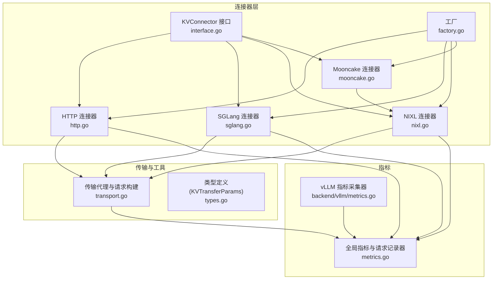
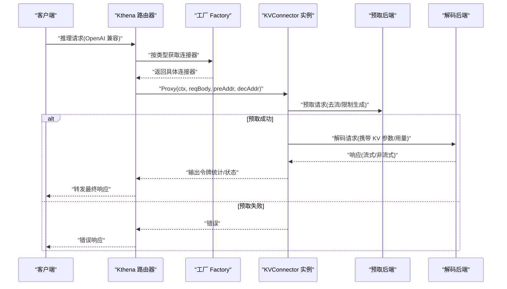
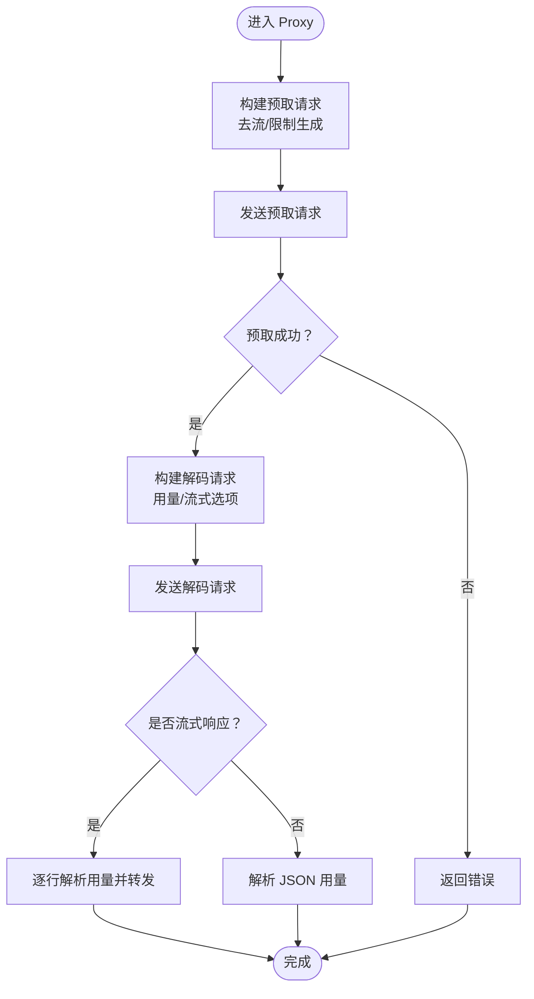
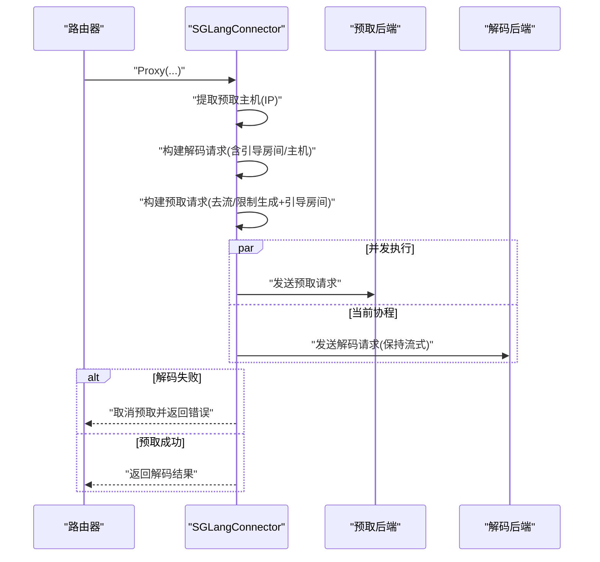
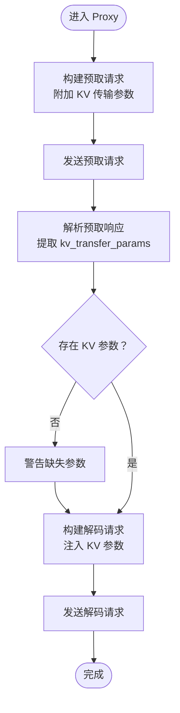
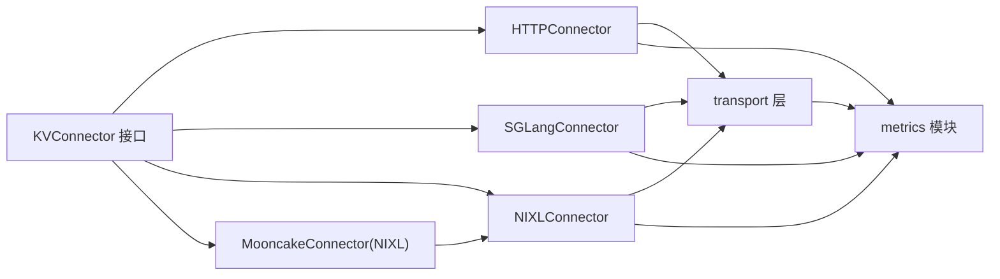

# 推理引擎连接器

<cite>
**本文引用的文件**
- [pkg/kthena-router/connectors/interface.go](file://pkg/kthena-router/connectors/interface.go)
- [pkg/kthena-router/connectors/types.go](file://pkg/kthena-router/connectors/types.go)
- [pkg/kthena-router/connectors/factory.go](file://pkg/kthena-router/connectors/factory.go)
- [pkg/kthena-router/connectors/http.go](file://pkg/kthena-router/connectors/http.go)
- [pkg/kthena-router/connectors/sglang.go](file://pkg/kthena-router/connectors/sglang.go)
- [pkg/kthena-router/connectors/mooncake.go](file://pkg/kthena-router/connectors/mooncake.go)
- [pkg/kthena-router/connectors/nixl.go](file://pkg/kthena-router/connectors/nixl.go)
- [pkg/kthena-router/connectors/transport.go](file://pkg/kthena-router/connectors/transport.go)
- [pkg/kthena-router/connectors/connectors_test.go](file://pkg/kthena-router/connectors/connectors_test.go)
- [pkg/kthena-router/metrics/metrics.go](file://pkg/kthena-router/metrics/metrics.go)
- [pkg/kthena-router/backend/vllm/metrics.go](file://pkg/kthena-router/backend/vllm/metrics.go)
- [pkg/kthena-router/scheduler/plugins/tokenization/vllm.go](file://pkg/kthena-router/scheduler/plugins/tokenization/vllm.go)
</cite>

## 目录
1. [简介](#简介)
2. [项目结构](#项目结构)
3. [核心组件](#核心组件)
4. [架构总览](#架构总览)
5. [详细组件分析](#详细组件分析)
6. [依赖分析](#依赖分析)
7. [性能考量](#性能考量)
8. [故障排查指南](#故障排查指南)
9. [结论](#结论)
10. [附录](#附录)

## 简介
本文件面向 Kthena 推理路由层的“推理引擎连接器”子系统，系统性梳理并文档化以下连接器的实现与使用方式：
- HTTP 连接器：通用的基于 HTTP 的 KV 缓存传输，适配多种后端（如 LMCache、通用后端）。
- SGLang 连接器：针对 SGLang 预取-解码分离的专用适配，强调“同时在途”的请求协调与引导参数。
- NIXL 连接器：高性能分布式内存 KV 缓存传输，通过预取阶段返回的参数驱动后续解码阶段。
- Mooncake 连接器：面向 Ascend NPU 的 vLLM 后端，当前复用 NIXL 实现以获得一致行为。

文档还覆盖协议适配、请求格式转换、响应处理、错误恢复、指标采集、配置参数、适用场景、连接池与超时重试策略等主题，并提供连接器选择指南与排障建议。

## 项目结构
连接器位于路由模块的 connectors 子目录，围绕统一接口 KVConnector 提供多实现，工厂模式按类型创建实例；传输层封装了预取/解码代理与流式响应处理；指标模块提供端到端与分阶段的可观测性。

图表来源
- [pkg/kthena-router/connectors/interface.go:23-31](file://pkg/kthena-router/connectors/interface.go#L23-L31)
- [pkg/kthena-router/connectors/http.go:28-120](file://pkg/kthena-router/connectors/http.go#L28-L120)
- [pkg/kthena-router/connectors/sglang.go:42-222](file://pkg/kthena-router/connectors/sglang.go#L42-L222)
- [pkg/kthena-router/connectors/nixl.go:34-205](file://pkg/kthena-router/connectors/nixl.go#L34-L205)
- [pkg/kthena-router/connectors/mooncake.go:19-26](file://pkg/kthena-router/connectors/mooncake.go#L19-L26)
- [pkg/kthena-router/connectors/factory.go:21-60](file://pkg/kthena-router/connectors/factory.go#L21-L60)
- [pkg/kthena-router/connectors/transport.go:33-227](file://pkg/kthena-router/connectors/transport.go#L33-L227)
- [pkg/kthena-router/connectors/types.go:19-28](file://pkg/kthena-router/connectors/types.go#L19-L28)
- [pkg/kthena-router/metrics/metrics.go:54-448](file://pkg/kthena-router/metrics/metrics.go#L54-L448)
- [pkg/kthena-router/backend/vllm/metrics.go:29-120](file://pkg/kthena-router/backend/vllm/metrics.go#L29-L120)

章节来源
- [pkg/kthena-router/connectors/factory.go:21-60](file://pkg/kthena-router/connectors/factory.go#L21-L60)
- [pkg/kthena-router/connectors/interface.go:23-31](file://pkg/kthena-router/connectors/interface.go#L23-L31)
- [pkg/kthena-router/connectors/transport.go:33-227](file://pkg/kthena-router/connectors/transport.go#L33-L227)

## 核心组件
- KVConnector 接口：定义连接器名称与完整预取-解码流程代理方法。
- 工厂 Factory：按类型注册并创建连接器实例，默认回退至 HTTP 连接器。
- 传输层 transport：封装预取/解码代理、请求体准备、流式/非流式响应处理、内容类型判定。
- 类型定义 KVTransferParams：描述跨阶段 KV 缓存传输所需的参数集合。
- 指标模块：提供端到端、分阶段耗时、令牌计数、活跃上游请求数等指标。

章节来源
- [pkg/kthena-router/connectors/interface.go:23-31](file://pkg/kthena-router/connectors/interface.go#L23-L31)
- [pkg/kthena-router/connectors/factory.go:21-60](file://pkg/kthena-router/connectors/factory.go#L21-L60)
- [pkg/kthena-router/connectors/transport.go:33-227](file://pkg/kthena-router/connectors/transport.go#L33-L227)
- [pkg/kthena-router/connectors/types.go:19-28](file://pkg/kthena-router/connectors/types.go#L19-L28)
- [pkg/kthena-router/metrics/metrics.go:54-448](file://pkg/kthena-router/metrics/metrics.go#L54-L448)

## 架构总览
连接器体系采用“接口 + 多实现 + 工厂”的设计，路由根据模型服务器配置选择合适的连接器类型，统一执行预取-解码两阶段流程。传输层负责请求构建、代理转发、响应解析与流式输出，指标模块贯穿全链路记录关键观测值。

图表来源
- [pkg/kthena-router/connectors/factory.go:38-60](file://pkg/kthena-router/connectors/factory.go#L38-L60)
- [pkg/kthena-router/connectors/http.go:63-120](file://pkg/kthena-router/connectors/http.go#L63-L120)
- [pkg/kthena-router/connectors/sglang.go:72-195](file://pkg/kthena-router/connectors/sglang.go#L72-L195)
- [pkg/kthena-router/connectors/nixl.go:53-112](file://pkg/kthena-router/connectors/nixl.go#L53-L112)
- [pkg/kthena-router/connectors/transport.go:33-78](file://pkg/kthena-router/connectors/transport.go#L33-L78)

## 详细组件分析

### HTTP 连接器
- 协议与适配：基于 HTTP 的通用 KV 传输，适用于 LMCache 或通用后端。
- 请求格式转换：
  - 预取阶段：移除流式字段，将最大生成令牌限制为 1，确保仅做 KV 预热。
  - 解码阶段：对非流式请求显式添加用量字段；对流式请求注入流式用量选项。
- 响应处理：识别 SSE/NDJSON 流式响应，逐行解析用量并累加输出令牌；非流式响应解析 JSON 中的用量信息。
- 错误恢复：预取失败直接返回错误；解码阶段错误不影响预取结果的记录。
- 指标采集：记录预取/解码阶段耗时、活跃上游请求数、令牌总量等。

图表来源
- [pkg/kthena-router/connectors/http.go:63-120](file://pkg/kthena-router/connectors/http.go#L63-L120)
- [pkg/kthena-router/connectors/transport.go:80-227](file://pkg/kthena-router/connectors/transport.go#L80-L227)

章节来源
- [pkg/kthena-router/connectors/http.go:28-120](file://pkg/kthena-router/connectors/http.go#L28-L120)
- [pkg/kthena-router/connectors/transport.go:80-227](file://pkg/kthena-router/connectors/transport.go#L80-L227)
- [pkg/kthena-router/metrics/metrics.go:341-448](file://pkg/kthena-router/metrics/metrics.go#L341-L448)

### SGLang 连接器（预取-解码分离）
- 协议适配：SGLang 需要“引导房间”标识与“引导主机”地址，用于在预取阶段启动引导服务并在解码阶段建立元数据交换。
- 关键约束：预取与解码必须“同时在途”，否则预取会因无法连接到引导服务而超时中止。
- 请求转换：
  - 预取：剥离流式、限制生成、附加引导房间号。
  - 解码：附加引导房间号与引导主机（预取 Pod IP），以便解码端连接预取引导服务。
- 并发与取消：预取在独立 goroutine 发送，若解码失败则取消预取上下文，避免悬挂等待。
- 响应处理：沿用通用传输层逻辑，支持流式/非流式。
- 指标采集：分别记录预取/解码阶段耗时与活跃上游请求数。

图表来源
- [pkg/kthena-router/connectors/sglang.go:72-195](file://pkg/kthena-router/connectors/sglang.go#L72-L195)
- [pkg/kthena-router/connectors/transport.go:33-78](file://pkg/kthena-router/connectors/transport.go#L33-L78)

章节来源
- [pkg/kthena-router/connectors/sglang.go:42-222](file://pkg/kthena-router/connectors/sglang.go#L42-L222)
- [pkg/kthena-router/connectors/transport.go:33-78](file://pkg/kthena-router/connectors/transport.go#L33-L78)
- [pkg/kthena-router/metrics/metrics.go:341-448](file://pkg/kthena-router/metrics/metrics.go#L341-L448)

### NIXL 连接器（分布式 KV 缓存）
- 协议适配：NIXL 在预取阶段返回 KV 传输参数，解码阶段需携带这些参数以启用远程解码。
- 请求转换：
  - 预取：准备请求体并附加 KV 传输参数（仅远程预取，不远程解码）。
  - 解码：从预取响应读取 KV 传输参数并注入到解码请求体。
- 响应处理：使用解码代理处理流式/非流式响应。
- 指标采集：记录预取/解码阶段耗时与活跃上游请求数。

图表来源
- [pkg/kthena-router/connectors/nixl.go:53-173](file://pkg/kthena-router/connectors/nixl.go#L53-L173)
- [pkg/kthena-router/connectors/transport.go:48-78](file://pkg/kthena-router/connectors/transport.go#L48-L78)

章节来源
- [pkg/kthena-router/connectors/nixl.go:34-205](file://pkg/kthena-router/connectors/nixl.go#L34-L205)
- [pkg/kthena-router/connectors/transport.go:48-78](file://pkg/kthena-router/connectors/transport.go#L48-L78)
- [pkg/kthena-router/metrics/metrics.go:341-448](file://pkg/kthena-router/metrics/metrics.go#L341-L448)

### Mooncake 连接器（Ascend NPU + vLLM）
- 实现策略：当前 Mooncake 连接器复用 NIXL 连接器实现，以获得一致的 KV 传输与指标行为。
- 适用场景：当后端为 Ascend NPU 的 vLLM 且采用 NIXL 风格的分布式 KV 传输时，可直接使用该连接器。

章节来源
- [pkg/kthena-router/connectors/mooncake.go:19-26](file://pkg/kthena-router/connectors/mooncake.go#L19-L26)
- [pkg/kthena-router/connectors/nixl.go:34-205](file://pkg/kthena-router/connectors/nixl.go#L34-L205)

### 工厂与类型注册
- 工厂注册：默认工厂注册 HTTP、LMCache、MoonCake、NIXL、SGLang（内部类型）等连接器。
- 获取策略：未知类型时回退到 HTTP 连接器，保证兼容性。

章节来源
- [pkg/kthena-router/connectors/factory.go:21-60](file://pkg/kthena-router/connectors/factory.go#L21-L60)

## 依赖分析
- 组件耦合：
  - 连接器实现均依赖统一接口与传输层，降低与具体后端协议的耦合。
  - 指标模块被各连接器共享，形成统一观测面。
- 外部依赖：
  - HTTP 客户端与 Gin 上下文用于请求转发与响应写入。
  - Prometheus 客户端用于指标暴露与聚合。

图表来源
- [pkg/kthena-router/connectors/interface.go:23-31](file://pkg/kthena-router/connectors/interface.go#L23-L31)
- [pkg/kthena-router/connectors/http.go:28-120](file://pkg/kthena-router/connectors/http.go#L28-L120)
- [pkg/kthena-router/connectors/sglang.go:42-222](file://pkg/kthena-router/connectors/sglang.go#L42-L222)
- [pkg/kthena-router/connectors/nixl.go:34-205](file://pkg/kthena-router/connectors/nixl.go#L34-L205)
- [pkg/kthena-router/connectors/mooncake.go:19-26](file://pkg/kthena-router/connectors/mooncake.go#L19-L26)
- [pkg/kthena-router/connectors/transport.go:33-227](file://pkg/kthena-router/connectors/transport.go#L33-L227)
- [pkg/kthena-router/metrics/metrics.go:54-448](file://pkg/kthena-router/metrics/metrics.go#L54-L448)

## 性能考量
- 分阶段指标：
  - 预取/解码阶段耗时直连 Prometheus 指标，便于定位瓶颈。
  - 令牌总量与活跃上游请求数可用于评估吞吐与并发度。
- vLLM 后端指标：
  - GPU 缓存占用、等待/运行中的请求数量、首 token 时间、输出 token 时间等直连后端指标端点。
- 连接与超时：
  - 传输层使用标准 HTTP 传输，未自定义连接池或超时参数；如需定制可在部署侧或网关层统一控制。
- 流式处理：
  - 流式响应按行解析用量，避免一次性缓冲大响应体，提升实时性与内存效率。

章节来源
- [pkg/kthena-router/metrics/metrics.go:54-223](file://pkg/kthena-router/metrics/metrics.go#L54-L223)
- [pkg/kthena-router/backend/vllm/metrics.go:29-120](file://pkg/kthena-router/backend/vllm/metrics.go#L29-L120)
- [pkg/kthena-router/connectors/transport.go:175-227](file://pkg/kthena-router/connectors/transport.go#L175-L227)

## 故障排查指南
- 预取失败：
  - 检查预取地址可达性与协议一致性（HTTP）。
  - 对 SGLang：确认预取与解码请求“同时在途”，避免预取因缺少引导连接而超时。
- 解码失败：
  - 检查解码地址与网络连通性；关注流式/非流式响应的用量解析是否正确。
  - 对 NIXL：确认预取响应包含 KV 传输参数，否则解码阶段可能无法启用远程解码。
- 指标异常：
  - 查看活跃上游请求数是否持续升高，可能存在后端阻塞或路由未正确释放。
  - 关注分阶段耗时指标，快速定位是预取还是解码阶段成为瓶颈。
- 单元测试参考：
  - 可参考连接器测试用例验证请求体转换、流式用量注入、令牌统计等行为。

章节来源
- [pkg/kthena-router/connectors/sglang.go:72-195](file://pkg/kthena-router/connectors/sglang.go#L72-L195)
- [pkg/kthena-router/connectors/nixl.go:114-173](file://pkg/kthena-router/connectors/nixl.go#L114-L173)
- [pkg/kthena-router/connectors/transport.go:175-227](file://pkg/kthena-router/connectors/transport.go#L175-L227)
- [pkg/kthena-router/connectors/connectors_test.go:107-532](file://pkg/kthena-router/connectors/connectors_test.go#L107-L532)

## 结论
Kthena 的连接器体系通过统一接口与工厂模式实现了对不同推理引擎的灵活适配。HTTP 连接器提供通用路径，SGLang/NIXL/Mooncake 连接器分别满足特定协议与硬件后端需求。传输层与指标模块共同保障了可观测性与稳定性。在实际部署中，建议结合后端特性与性能指标选择合适连接器，并通过指标与日志进行持续优化。

## 附录

### 连接器选择指南
- 通用后端（LMCache/HTTP 后端）：优先选择 HTTP 连接器，简单稳定。
- SGLang 预取-解码分离：必须使用 SGLang 连接器，确保“同时在途”与引导参数正确传递。
- NIXL 分布式 KV：需要预取阶段返回 KV 参数以驱动解码，使用 NIXL 连接器。
- Ascend NPU + vLLM：当前复用 NIXL 连接器以获得一致行为。

章节来源
- [pkg/kthena-router/connectors/factory.go:47-60](file://pkg/kthena-router/connectors/factory.go#L47-L60)
- [pkg/kthena-router/connectors/sglang.go:42-86](file://pkg/kthena-router/connectors/sglang.go#L42-L86)
- [pkg/kthena-router/connectors/nixl.go:34-60](file://pkg/kthena-router/connectors/nixl.go#L34-L60)
- [pkg/kthena-router/connectors/mooncake.go:19-26](file://pkg/kthena-router/connectors/mooncake.go#L19-L26)

### 配置参数与适用场景
- HTTP 连接器
  - 适用：通用 HTTP 推理后端、LMCache。
  - 关键行为：预取去流/限生成；解码注入用量。
- SGLang 连接器
  - 适用：SGLang 预取-解码分离。
  - 关键行为：引导房间、引导主机；并发预取/解码；解码失败时取消预取。
- NIXL 连接器
  - 适用：NIXL 分布式内存 KV 缓存。
  - 关键行为：预取返回 KV 参数；解码注入 KV 参数。
- Mooncake 连接器
  - 适用：Ascend NPU + vLLM（复用 NIXL 行为）。

章节来源
- [pkg/kthena-router/connectors/http.go:63-120](file://pkg/kthena-router/connectors/http.go#L63-L120)
- [pkg/kthena-router/connectors/sglang.go:72-195](file://pkg/kthena-router/connectors/sglang.go#L72-L195)
- [pkg/kthena-router/connectors/nixl.go:53-173](file://pkg/kthena-router/connectors/nixl.go#L53-L173)
- [pkg/kthena-router/connectors/mooncake.go:19-26](file://pkg/kthena-router/connectors/mooncake.go#L19-L26)

### 请求格式转换与响应处理要点
- 预取阶段统一去除流式字段并将最大生成令牌限制为 1。
- 解码阶段：
  - 非流式：显式添加用量字段。
  - 流式：注入流式用量选项；按行解析用量并累加输出令牌。
- 响应类型识别：SSE/NDJSON 视为流式，其余视为非流式。

章节来源
- [pkg/kthena-router/connectors/transport.go:80-227](file://pkg/kthena-router/connectors/transport.go#L80-L227)

### 指标采集与可观测性
- 全局指标：请求总数、端到端耗时、分阶段耗时、令牌总量、活跃上下游请求数、公平队列指标等。
- vLLM 指标：GPU 缓存占用、等待/运行中的请求数量、首 token 时间、输出 token 时间等。

章节来源
- [pkg/kthena-router/metrics/metrics.go:54-223](file://pkg/kthena-router/metrics/metrics.go#L54-L223)
- [pkg/kthena-router/backend/vllm/metrics.go:29-120](file://pkg/kthena-router/backend/vllm/metrics.go#L29-L120)

### vLLM 分词适配（扩展能力）
- 提供 vLLM 分词接口适配器，支持补全与聊天两种输入类型，便于路由层进行令牌化与长度校验。

章节来源
- [pkg/kthena-router/scheduler/plugins/tokenization/vllm.go:24-85](file://pkg/kthena-router/scheduler/plugins/tokenization/vllm.go#L24-L85)