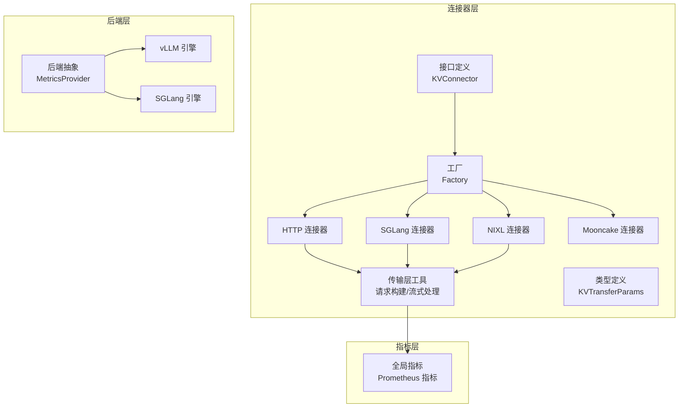
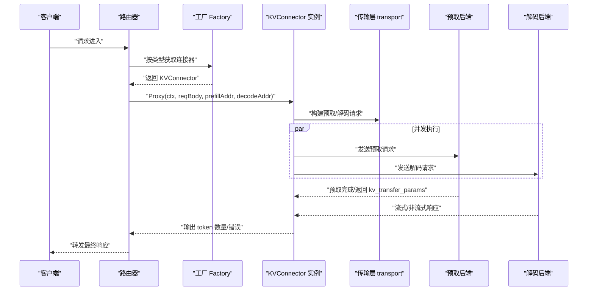
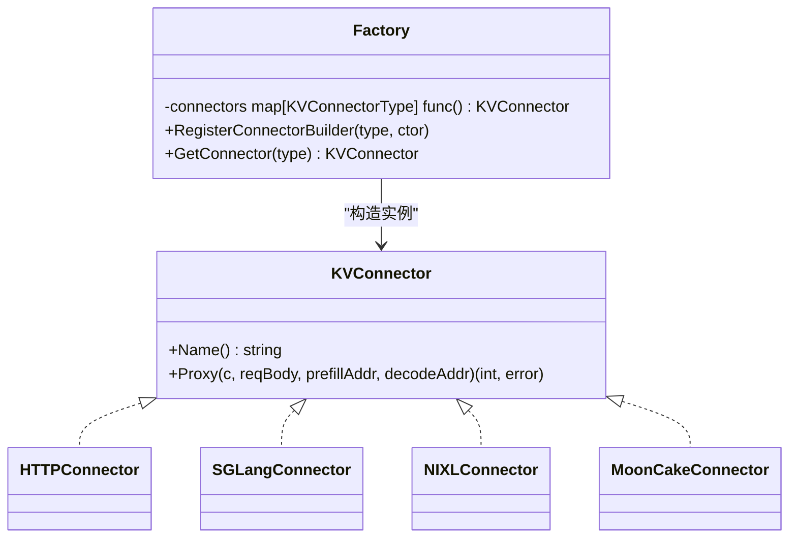
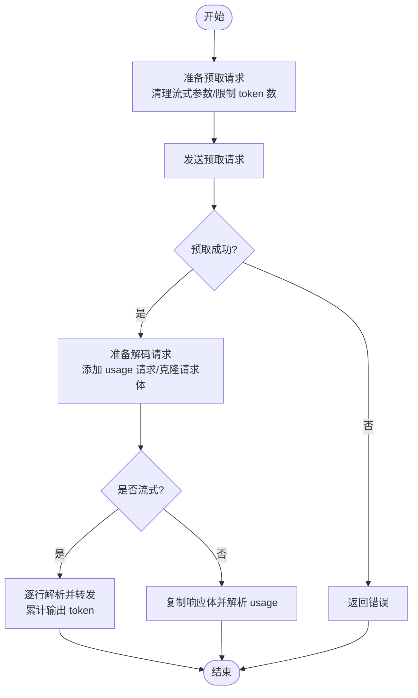
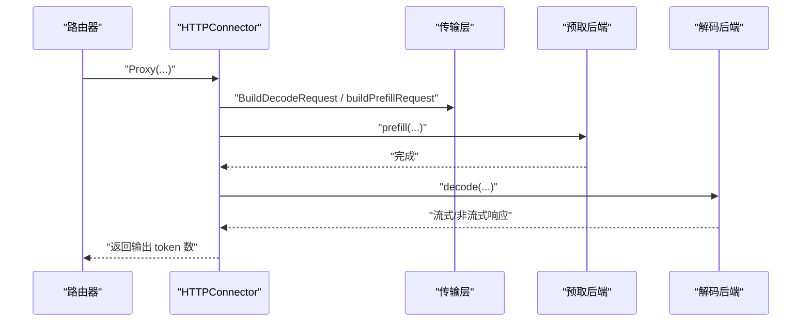
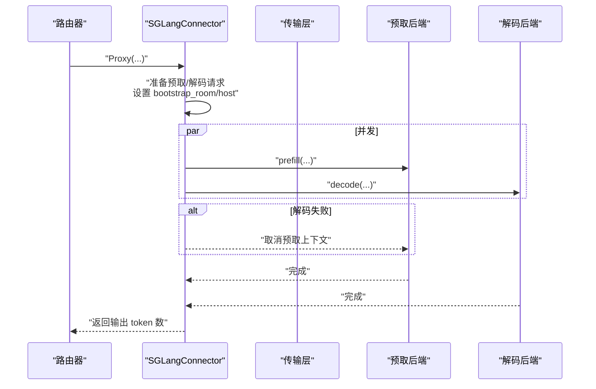
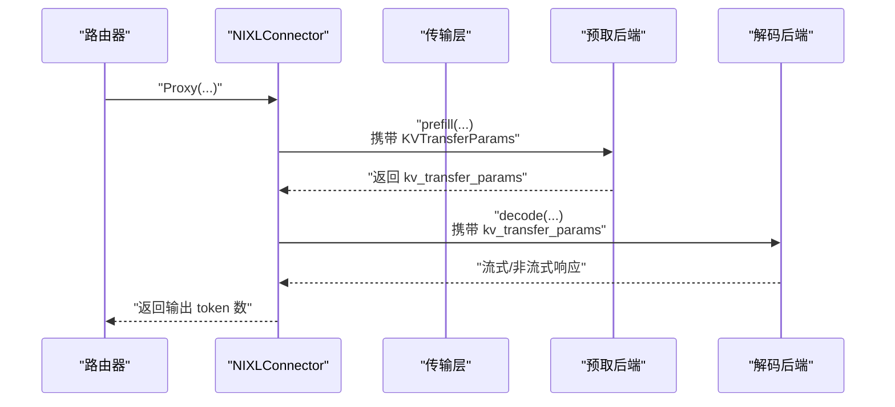
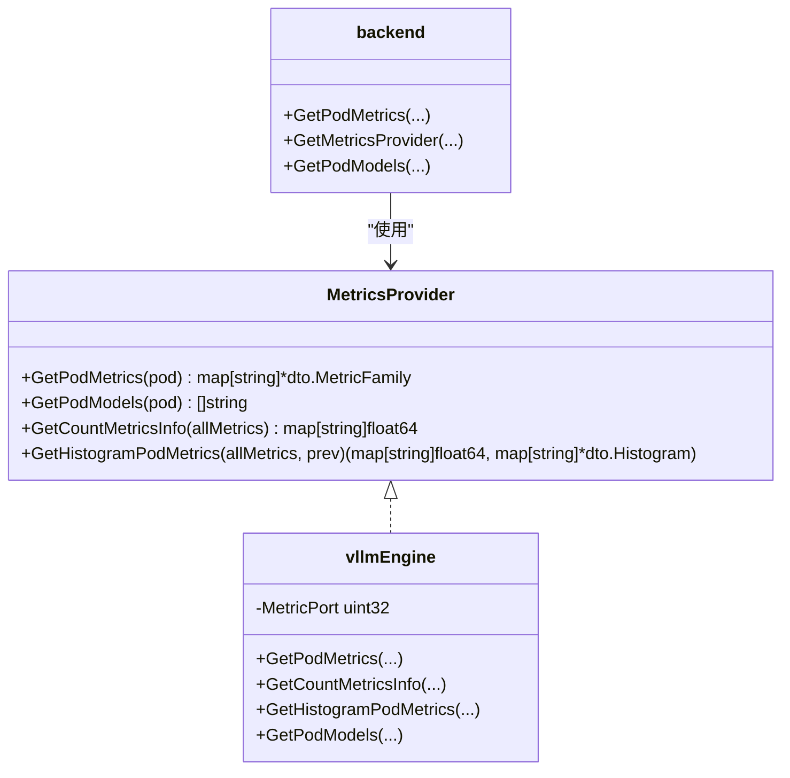
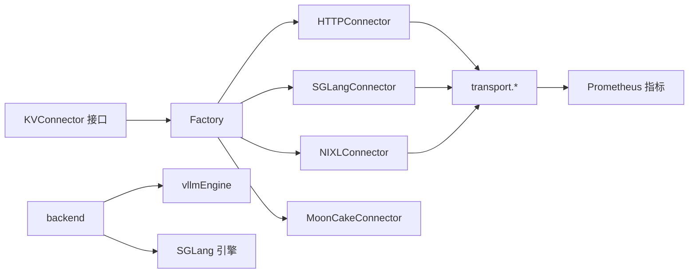

# 连接器与后端支持

<cite>
**本文引用的文件**
- [factory.go](file://pkg/kthena-router/connectors/factory.go)
- [interface.go](file://pkg/kthena-router/connectors/interface.go)
- [types.go](file://pkg/kthena-router/connectors/types.go)
- [transport.go](file://pkg/kthena-router/connectors/transport.go)
- [http.go](file://pkg/kthena-router/connectors/http.go)
- [sglang.go](file://pkg/kthena-router/connectors/sglang.go)
- [nixl.go](file://pkg/kthena-router/connectors/nixl.go)
- [mooncake.go](file://pkg/kthena-router/connectors/mooncake.go)
- [backend.go](file://pkg/kthena-router/backend/backend.go)
- [metrics.go（后端 vLLM）](file://pkg/kthena-router/backend/vllm/metrics.go)
- [models.go（后端 vLLM）](file://pkg/kthena-router/backend/vllm/models.go)
- [metrics.go（全局指标）](file://pkg/kthena-router/metrics/metrics.go)
</cite>

## 目录
1. [简介](#简介)
2. [项目结构](#项目结构)
3. [核心组件](#核心组件)
4. [架构总览](#架构总览)
5. [详细组件分析](#详细组件分析)
6. [依赖分析](#依赖分析)
7. [性能考量](#性能考量)
8. [故障排查指南](#故障排查指南)
9. [结论](#结论)
10. [附录](#附录)

## 简介
本文件面向 Kthena 的“连接器与后端支持”子系统，系统性梳理连接器工厂模式设计、连接器接口与实现、传输层协议适配、错误处理机制，以及后端指标采集、性能监控与健康检查能力。重点覆盖以下连接器：HTTP 连接器、SGLang 连接器、vLLM 连接器、Mooncake 连接器、NIXL 连接器；并给出配置示例、新后端集成指南与性能优化建议。

## 项目结构
Kthena 路由器中的连接器与后端支持主要位于 pkg/kthena-router 下，按职责划分为：
- connectors：连接器接口、工厂、具体连接器实现与通用传输层工具
- backend：后端抽象层与各引擎（vLLM、SGLang）指标采集
- metrics：全局指标定义与记录器

图示来源
- [factory.go:21-59](file://pkg/kthena-router/connectors/factory.go#L21-L59)
- [interface.go:23-31](file://pkg/kthena-router/connectors/interface.go#L23-L31)
- [transport.go:33-226](file://pkg/kthena-router/connectors/transport.go#L33-L226)
- [http.go:28-119](file://pkg/kthena-router/connectors/http.go#L28-L119)
- [sglang.go:42-195](file://pkg/kthena-router/connectors/sglang.go#L42-L195)
- [nixl.go:34-204](file://pkg/kthena-router/connectors/nixl.go#L34-L204)
- [mooncake.go:19-25](file://pkg/kthena-router/connectors/mooncake.go#L19-L25)
- [backend.go:30-82](file://pkg/kthena-router/backend/backend.go#L30-L82)
- [metrics.go（全局指标）:54-223](file://pkg/kthena-router/metrics/metrics.go#L54-L223)

章节来源
- [factory.go:21-59](file://pkg/kthena-router/connectors/factory.go#L21-L59)
- [interface.go:23-31](file://pkg/kthena-router/connectors/interface.go#L23-L31)
- [transport.go:33-226](file://pkg/kthena-router/connectors/transport.go#L33-L226)
- [http.go:28-119](file://pkg/kthena-router/connectors/http.go#L28-L119)
- [sglang.go:42-195](file://pkg/kthena-router/connectors/sglang.go#L42-L195)
- [nixl.go:34-204](file://pkg/kthena-router/connectors/nixl.go#L34-L204)
- [mooncake.go:19-25](file://pkg/kthena-router/connectors/mooncake.go#L19-L25)
- [backend.go:30-82](file://pkg/kthena-router/backend/backend.go#L30-L82)
- [metrics.go（全局指标）:54-223](file://pkg/kthena-router/metrics/metrics.go#L54-L223)

## 核心组件
- 连接器接口 KVConnector：统一定义名称与预取-解码全流程代理方法。
- 工厂 Factory：以键值注册不同连接器构造器，默认注册 HTTP、LMCache、MoonCake、NIXL、SGLang。
- 传输层 transport：封装预取/解码请求构建、状态码校验、流式/非流式响应处理、令牌用量解析。
- 具体连接器：
  - HTTP：通用 HTTP 协议 KV 传输，适合 LMCache、MoonCakeStore 等。
  - SGLang：并发启动预取/解码，使用 bootstrap_room 与 bootstrap_host 协作交换 KV 缓存元数据。
  - NIXL：预取阶段返回 kv_transfer_params，解码阶段携带该参数进行高效分布式 KV 传输。
  - Mooncake：复用 NIXL 实现，作为 vLLM Ascend 的桥接。
- 后端抽象 backend：通过 MetricsProvider 抽象不同推理引擎指标采集，当前注册 vLLM 与 SGLang。

章节来源
- [interface.go:23-31](file://pkg/kthena-router/connectors/interface.go#L23-L31)
- [factory.go:21-59](file://pkg/kthena-router/connectors/factory.go#L21-L59)
- [transport.go:33-226](file://pkg/kthena-router/connectors/transport.go#L33-L226)
- [http.go:28-119](file://pkg/kthena-router/connectors/http.go#L28-L119)
- [sglang.go:42-195](file://pkg/kthena-router/connectors/sglang.go#L42-L195)
- [nixl.go:34-204](file://pkg/kthena-router/connectors/nixl.go#L34-L204)
- [mooncake.go:19-25](file://pkg/kthena-router/connectors/mooncake.go#L19-L25)
- [backend.go:30-82](file://pkg/kthena-router/backend/backend.go#L30-L82)

## 架构总览
下图展示从路由到后端的调用链路，以及连接器在其中的角色与交互。

图示来源
- [factory.go:38-59](file://pkg/kthena-router/connectors/factory.go#L38-L59)
- [transport.go:92-123](file://pkg/kthena-router/connectors/transport.go#L92-L123)
- [http.go:64-119](file://pkg/kthena-router/connectors/http.go#L64-L119)
- [sglang.go:86-195](file://pkg/kthena-router/connectors/sglang.go#L86-L195)
- [nixl.go:54-112](file://pkg/kthena-router/connectors/nixl.go#L54-L112)

## 详细组件分析

### 工厂模式与连接器接口
- 接口 KVConnector 定义名称与代理方法，确保所有连接器具备一致行为契约。
- 工厂通过映射注册不同连接器构造器，并提供默认工厂注册常用连接器类型。
- 若未找到指定类型，则回退到 HTTP 连接器，保证兼容性。

图示来源
- [interface.go:23-31](file://pkg/kthena-router/connectors/interface.go#L23-L31)
- [factory.go:21-59](file://pkg/kthena-router/connectors/factory.go#L21-L59)
- [http.go:28-43](file://pkg/kthena-router/connectors/http.go#L28-L43)
- [sglang.go:42-70](file://pkg/kthena-router/connectors/sglang.go#L42-L70)
- [nixl.go:34-51](file://pkg/kthena-router/connectors/nixl.go#L34-L51)
- [mooncake.go:19-25](file://pkg/kthena-router/connectors/mooncake.go#L19-L25)

章节来源
- [interface.go:23-31](file://pkg/kthena-router/connectors/interface.go#L23-L31)
- [factory.go:21-59](file://pkg/kthena-router/connectors/factory.go#L21-L59)

### 传输层实现与协议适配
- 预取阶段：移除流式参数，限制 max_tokens/max_completion_tokens 为 1，确保仅生成首 token 用于 KV 预热。
- 解码阶段：根据是否流式决定是否注入 usage 信息；流式场景解析 SSE/NDJSON 行级 usage，非流式解析完整 JSON usage。
- 流式处理：逐行读取并转发，同时累计输出 token 数；非流式复制响应体并解析 usage。
- 错误处理：对非 2xx 响应返回明确错误；对网络错误包装上下文；日志记录关键步骤。

图示来源
- [transport.go:80-145](file://pkg/kthena-router/connectors/transport.go#L80-L145)
- [transport.go:169-226](file://pkg/kthena-router/connectors/transport.go#L169-L226)

章节来源
- [transport.go:33-226](file://pkg/kthena-router/connectors/transport.go#L33-L226)

### HTTP 连接器
- 特点：通用 HTTP 传输，适合 LMCache、MoonCakeStore 等。
- 关键流程：构建预取/解码请求；分别调用预取/解码；记录阶段耗时与活跃上游请求数；返回解码阶段输出 token 数。

图示来源
- [http.go:64-119](file://pkg/kthena-router/connectors/http.go#L64-L119)
- [transport.go:92-123](file://pkg/kthena-router/connectors/transport.go#L92-L123)

章节来源
- [http.go:28-119](file://pkg/kthena-router/connectors/http.go#L28-L119)

### SGLang 连接器（预取-解码分离）
- 协议要点：预取/解码需并发启动，解码请求携带 bootstrap_host（预取 Pod IP）与 bootstrap_room（唯一整数），预取请求携带相同 bootstrap_room。
- 并发控制：预取在独立 goroutine 中运行，若解码失败则取消预取上下文，避免悬挂等待。
- 指标记录：分别记录预取/解码阶段耗时与活跃上游请求数。

图示来源
- [sglang.go:86-195](file://pkg/kthena-router/connectors/sglang.go#L86-L195)
- [transport.go:197-209](file://pkg/kthena-router/connectors/transport.go#L197-L209)

章节来源
- [sglang.go:42-195](file://pkg/kthena-router/connectors/sglang.go#L42-L195)

### NIXL 连接器（分布式内存 KV）
- 协议要点：预取阶段返回 kv_transfer_params，解码阶段携带该参数进行 KV 缓存转移。
- 请求构建：预取请求中注入 KVTransferParams；解码请求中合并 kv_transfer_params。
- 流式处理：沿用传输层的流式/非流式处理逻辑。

图示来源
- [nixl.go:54-112](file://pkg/kthena-router/connectors/nixl.go#L54-L112)
- [nixl.go:114-173](file://pkg/kthena-router/connectors/nixl.go#L114-L173)
- [types.go:19-27](file://pkg/kthena-router/connectors/types.go#L19-L27)

章节来源
- [nixl.go:34-204](file://pkg/kthena-router/connectors/nixl.go#L34-L204)
- [types.go:19-27](file://pkg/kthena-router/connectors/types.go#L19-L27)

### Mooncake 连接器
- 实现：复用 NIXLConnector，名称标识为 mooncake。
- 适用：vLLM Ascend 场景下的桥接实现。

章节来源
- [mooncake.go:19-25](file://pkg/kthena-router/connectors/mooncake.go#L19-L25)

### 后端抽象与指标采集
- 抽象层：通过 MetricsProvider 接口统一不同引擎的指标采集与模型查询。
- 注册表：当前注册 vLLM 与 SGLang 引擎。
- vLLM 指标：
  - 计数/ Gauge 指标：GPU 缓存占用、等待/运行中的请求数
  - 直方图指标：首次 token 时间、每输出 token 时间
  - 模型列表：通过 /v1/models 获取
- 指标聚合：将直方图差分转换为周期平均，结合历史直方图平滑初始波动。

图示来源
- [backend.go:30-82](file://pkg/kthena-router/backend/backend.go#L30-L82)
- [metrics.go（后端 vLLM）:58-119](file://pkg/kthena-router/backend/vllm/metrics.go#L58-L119)
- [models.go（后端 vLLM）:30-70](file://pkg/kthena-router/backend/vllm/models.go#L30-L70)

章节来源
- [backend.go:30-82](file://pkg/kthena-router/backend/backend.go#L30-L82)
- [metrics.go（后端 vLLM）:29-119](file://pkg/kthena-router/backend/vllm/metrics.go#L29-L119)
- [models.go（后端 vLLM）:30-70](file://pkg/kthena-router/backend/vllm/models.go#L30-L70)

## 依赖分析
- 组件内聚与耦合
  - 连接器与传输层：高内聚，通过统一的请求构建与响应处理函数解耦具体协议细节。
  - 工厂与连接器：低耦合，通过接口隔离具体实现，便于扩展新连接器。
  - 后端抽象与引擎：通过接口与注册表解耦，新增引擎只需实现 MetricsProvider 并注册。
- 外部依赖
  - Prometheus 客户端：用于全局与后端指标暴露与采集。
  - Gin：用于 HTTP 上下文与流式写入。
  - Kubernetes 日志：用于关键路径日志记录。

图示来源
- [factory.go:21-59](file://pkg/kthena-router/connectors/factory.go#L21-L59)
- [interface.go:23-31](file://pkg/kthena-router/connectors/interface.go#L23-L31)
- [transport.go:33-226](file://pkg/kthena-router/connectors/transport.go#L33-L226)
- [backend.go:30-82](file://pkg/kthena-router/backend/backend.go#L30-L82)
- [metrics.go（全局指标）:54-223](file://pkg/kthena-router/metrics/metrics.go#L54-L223)

章节来源
- [factory.go:21-59](file://pkg/kthena-router/connectors/factory.go#L21-L59)
- [interface.go:23-31](file://pkg/kthena-router/connectors/interface.go#L23-L31)
- [transport.go:33-226](file://pkg/kthena-router/connectors/transport.go#L33-L226)
- [backend.go:30-82](file://pkg/kthena-router/backend/backend.go#L30-L82)
- [metrics.go（全局指标）:54-223](file://pkg/kthena-router/metrics/metrics.go#L54-L223)

## 性能考量
- 并发与超时
  - SGLang：预取/解码并发启动，解码失败时取消预取上下文，避免资源浪费。
  - 建议：为后端请求设置合理超时与重试策略，防止级联阻塞。
- 流式处理
  - 流式场景逐行解析并转发，降低端到端延迟；非流式场景需完整缓冲后再解析 usage。
- 指标观测
  - 使用 RequestMetricsRecorder 分段记录预取/解码阶段耗时，结合全局指标评估吞吐与延迟分布。
- 连接池与重试
  - 建议：在传输层或上层网关引入连接池与指数退避重试，提升稳定性与可用性。

## 故障排查指南
- 常见问题定位
  - 非 2xx 响应：检查后端服务状态与路由地址；查看传输层状态码判断来源。
  - 流式解析异常：确认 Content-Type 是否为 SSE/NDJSON；核对行级 usage 字段是否存在。
  - SGLang 协议错误：确认预取/解码均携带相同 bootstrap_room，且解码携带正确的 bootstrap_host。
  - NIXL 参数缺失：确认预取响应包含 kv_transfer_params，解码请求已正确注入。
- 日志与指标
  - 查看 klog 输出的关键步骤日志；结合 Prometheus 指标定位瓶颈（如活跃上游请求数、队列时延、阶段耗时）。

章节来源
- [transport.go:33-226](file://pkg/kthena-router/connectors/transport.go#L33-L226)
- [sglang.go:86-195](file://pkg/kthena-router/connectors/sglang.go#L86-L195)
- [nixl.go:114-144](file://pkg/kthena-router/connectors/nixl.go#L114-L144)
- [metrics.go（全局指标）:225-448](file://pkg/kthena-router/metrics/metrics.go#L225-L448)

## 结论
Kthena 的连接器与后端支持体系通过工厂模式与接口抽象实现了高度可扩展的 KV 缓存传输能力，针对不同推理引擎提供了差异化但统一的接入方式。传输层对流式/非流式响应与 usage 解析进行了完备处理，配合全局与后端指标体系，能够有效支撑性能监控与健康检查。后续可在连接池、超时与重试策略方面进一步增强鲁棒性，并持续扩展更多推理引擎的指标与协议适配。

## 附录

### 连接器配置示例（概念性）
- 选择连接器类型：在路由规则中指定 KVConnectorType，工厂将自动构造对应连接器实例。
- SGLang：确保预取/解码地址正确，解码请求携带 bootstrap_host 与 bootstrap_room。
- NIXL：确认预取响应包含 kv_transfer_params，解码请求携带该参数。
- HTTP/MoonCake/LMCache：直接透传 HTTP 请求，注意流式与 usage 设置。

### 新后端集成指南
- 步骤
  - 实现 MetricsProvider 接口：GetPodMetrics、GetCountMetricsInfo、GetHistogramPodMetrics、GetPodModels。
  - 在后端注册表中注册新引擎。
  - 在工厂中注册新连接器类型与构造函数。
  - 如需特殊协议适配，在传输层补充相应请求构建与响应解析逻辑。
- 参考
  - vLLM 引擎实现与指标映射。
  - SGLang/NIXL 连接器的并发与参数注入范式。

章节来源
- [backend.go:30-82](file://pkg/kthena-router/backend/backend.go#L30-L82)
- [factory.go:33-59](file://pkg/kthena-router/connectors/factory.go#L33-L59)
- [metrics.go（后端 vLLM）:58-119](file://pkg/kthena-router/backend/vllm/metrics.go#L58-L119)
- [models.go（后端 vLLM）:30-70](file://pkg/kthena-router/backend/vllm/models.go#L30-L70)