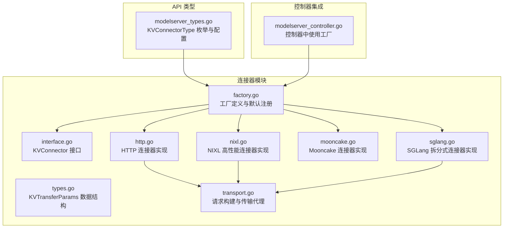
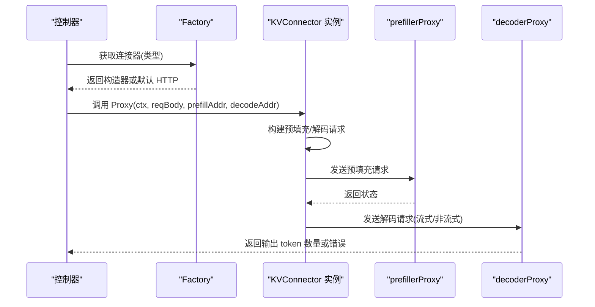
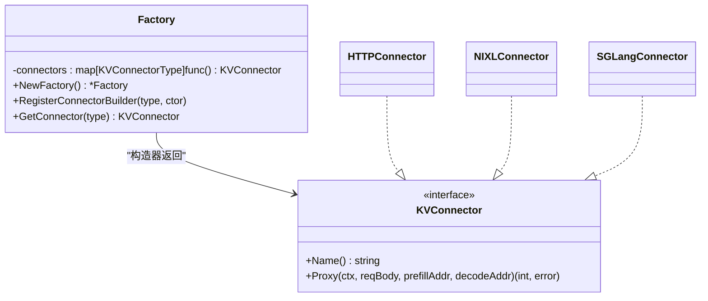
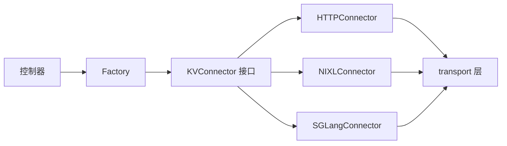
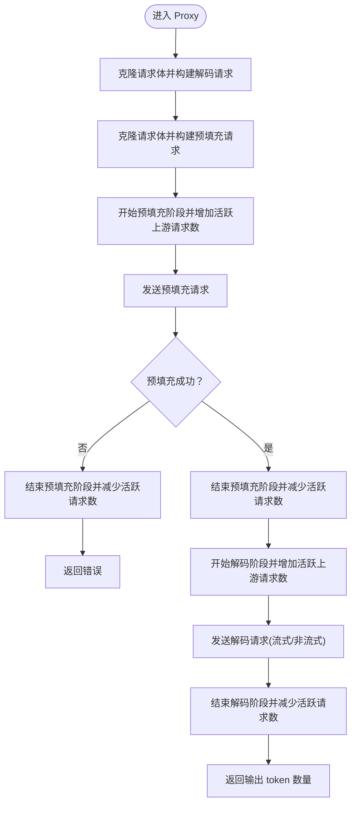

# 连接器工厂架构

<cite>
**本文引用的文件**
- [factory.go](file://pkg/kthena-router/connectors/factory.go)
- [interface.go](file://pkg/kthena-router/connectors/interface.go)
- [types.go](file://pkg/kthena-router/connectors/types.go)
- [http.go](file://pkg/kthena-router/connectors/http.go)
- [nixl.go](file://pkg/kthena-router/connectors/nixl.go)
- [mooncake.go](file://pkg/kthena-router/connectors/mooncake.go)
- [sglang.go](file://pkg/kthena-router/connectors/sglang.go)
- [transport.go](file://pkg/kthena-router/connectors/transport.go)
- [modelserver_types.go](file://pkg/apis/networking/v1alpha1/modelserver_types.go)
- [connectors_test.go](file://pkg/kthena-router/connectors/connectors_test.go)
- [modelserver_controller.go](file://pkg/kthena-router/controller/modelserver_controller.go)
</cite>

## 目录
1. [简介](#简介)
2. [项目结构](#项目结构)
3. [核心组件](#核心组件)
4. [架构总览](#架构总览)
5. [详细组件分析](#详细组件分析)
6. [依赖分析](#依赖分析)
7. [性能考量](#性能考量)
8. [故障排查指南](#故障排查指南)
9. [结论](#结论)
10. [附录](#附录)

## 简介
本文件系统性阐述 Kthena 路由器中的“连接器工厂”架构，聚焦于工厂模式的设计与实现、KVConnector 接口规范、默认工厂的注册与映射、连接器类型枚举、线程安全注意事项、使用示例、扩展步骤与最佳实践，以及错误处理与生命周期管理策略。该架构通过工厂统一创建不同类型的 KV 缓存连接器，并在预填充（prefill）与解码（decode）阶段协调上游推理引擎之间的 KV 缓存传递。

## 项目结构
围绕连接器工厂的关键代码位于 pkg/kthena-router/connectors 目录，配合 API 类型定义与控制器集成点：

图表来源
- [factory.go:21-60](file://pkg/kthena-router/connectors/factory.go#L21-L60)
- [interface.go:23-31](file://pkg/kthena-router/connectors/interface.go#L23-L31)
- [types.go:19-27](file://pkg/kthena-router/connectors/types.go#L19-L27)
- [http.go:28-120](file://pkg/kthena-router/connectors/http.go#L28-L120)
- [nixl.go:34-205](file://pkg/kthena-router/connectors/nixl.go#L34-L205)
- [mooncake.go:19-26](file://pkg/kthena-router/connectors/mooncake.go#L19-L26)
- [sglang.go:42-222](file://pkg/kthena-router/connectors/sglang.go#L42-L222)
- [transport.go:33-227](file://pkg/kthena-router/connectors/transport.go#L33-L227)
- [modelserver_types.go:104-120](file://pkg/apis/networking/v1alpha1/modelserver_types.go#L104-L120)
- [modelserver_controller.go:1-200](file://pkg/kthena-router/controller/modelserver_controller.go#L1-L200)

章节来源
- [factory.go:21-60](file://pkg/kthena-router/connectors/factory.go#L21-L60)
- [modelserver_types.go:104-120](file://pkg/apis/networking/v1alpha1/modelserver_types.go#L104-L120)

## 核心组件
- 工厂（Factory）
  - 维护 KVConnectorType 到构造器的映射，支持动态注册与按类型获取连接器实例。
  - 提供 NewFactory、RegisterConnectorBuilder、GetConnector 与 NewDefaultFactory。
- KVConnector 接口
  - 规范 Name() 与 Proxy() 方法，统一不同连接器的行为契约。
- 连接器实现
  - HTTPConnector：通用 HTTP 传输，适配 LMCache/MoonCake 等。
  - NIXLConnector：高性能内存 KV 缓存，支持 kv_transfer_params 协商。
  - SGLangConnector：拆分式预填充/解码，需要并发启动并协调 bootstrap_room/bootstrap_host。
  - MoonCakeConnector：复用 NIXL 实现，命名差异。
- 传输与请求构建
  - prefillerProxy/decoderProxy：封装上游调用与响应处理。
  - preparePrefillBody/buildPrefillRequest/BuildDecodeRequest/addTokenUsage：请求体规范化与流式处理。
- 类型与配置
  - KVConnectorType 枚举与 KVConnectorSpec 类型，用于 CRD 配置。

章节来源
- [factory.go:21-60](file://pkg/kthena-router/connectors/factory.go#L21-L60)
- [interface.go:23-31](file://pkg/kthena-router/connectors/interface.go#L23-L31)
- [http.go:28-120](file://pkg/kthena-router/connectors/http.go#L28-L120)
- [nixl.go:34-205](file://pkg/kthena-router/connectors/nixl.go#L34-L205)
- [sglang.go:42-222](file://pkg/kthena-router/connectors/sglang.go#L42-L222)
- [mooncake.go:19-26](file://pkg/kthena-router/connectors/mooncake.go#L19-L26)
- [transport.go:33-227](file://pkg/kthena-router/connectors/transport.go#L33-L227)
- [modelserver_types.go:104-120](file://pkg/apis/networking/v1alpha1/modelserver_types.go#L104-L120)

## 架构总览
工厂模式将“连接器选择”与“连接器创建”解耦，路由控制器根据配置选择连接器类型，工厂负责实例化具体实现。默认工厂注册了多种连接器，未知类型回退到 HTTP 连接器，确保兼容性。

图表来源
- [factory.go:38-45](file://pkg/kthena-router/connectors/factory.go#L38-L45)
- [http.go:64-119](file://pkg/kthena-router/connectors/http.go#L64-L119)
- [transport.go:33-78](file://pkg/kthena-router/connectors/transport.go#L33-L78)

## 详细组件分析

### 工厂结构与注册机制
- Factory 结构体
  - 字段：connectors 映射表，键为 KVConnectorType，值为构造器函数。
- 构造与注册
  - NewFactory 创建空映射。
  - RegisterConnectorBuilder 将类型与构造器绑定。
  - NewDefaultFactory 注册默认连接器集合，包括 HTTP、LMCache、MoonCake、NIXL、SGLang。
- 获取逻辑
  - GetConnector 若未找到对应类型则返回 HTTP 连接器，保证健壮性。

图表来源
- [factory.go:21-60](file://pkg/kthena-router/connectors/factory.go#L21-L60)
- [interface.go:23-31](file://pkg/kthena-router/connectors/interface.go#L23-L31)
- [http.go:30-38](file://pkg/kthena-router/connectors/http.go#L30-L38)
- [nixl.go:34-46](file://pkg/kthena-router/connectors/nixl.go#L34-L46)
- [sglang.go:50-65](file://pkg/kthena-router/connectors/sglang.go#L50-L65)

章节来源
- [factory.go:21-60](file://pkg/kthena-router/connectors/factory.go#L21-L60)

### KVConnector 接口与方法规范
- Name()
  - 返回连接器名称字符串，便于日志与监控识别。
- Proxy(c, reqBody, prefillAddr, decodeAddr)
  - 执行完整预填充-解码流程，返回解码阶段输出 token 数量与错误。
  - 具体实现需：
    - 构建预填充请求（去除流式字段、限制 token 数）。
    - 构建解码请求（根据是否流式决定 include_usage 或 stream_options.include_usage）。
    - 调用 prefillerProxy/decoderProxy 完成上游转发与响应处理。
    - 记录指标（如阶段开始/结束、活跃上游请求数等）。

章节来源
- [interface.go:23-31](file://pkg/kthena-router/connectors/interface.go#L23-L31)
- [transport.go:80-145](file://pkg/kthena-router/connectors/transport.go#L80-L145)

### 默认工厂与映射关系
- 默认注册项
  - http -> HTTPConnector
  - lmcache -> HTTPConnector（复用 HTTP 实现）
  - mooncake -> MoonCakeConnector（内部复用 NIXL 实现）
  - nixl -> NIXLConnector
  - sglang -> SGLangConnector（内部常量，不暴露给用户配置）
- 回退策略
  - 未知类型 -> HTTPConnector，避免运行时崩溃。

章节来源
- [factory.go:47-59](file://pkg/kthena-router/connectors/factory.go#L47-L59)
- [mooncake.go:19-26](file://pkg/kthena-router/connectors/mooncake.go#L19-L26)
- [sglang.go:36-40](file://pkg/kthena-router/connectors/sglang.go#L36-L40)

### HTTP 连接器（通用实现）
- 特点
  - 适用于 LMCache、MoonCake 等场景。
  - 在 Proxy 中分别构建预填充与解码请求，调用 prefillerProxy/decoderProxy。
- 请求体处理
  - 预填充：移除 stream/stream_options，max_tokens/max_completion_tokens 设为 1。
  - 解码：非流式设置 include_usage；流式设置 stream_options.include_usage 并在上下文标记 token usage。
- 指标记录
  - 开始/结束预填充与解码阶段，维护活跃上游请求数。

章节来源
- [http.go:28-120](file://pkg/kthena-router/connectors/http.go#L28-L120)
- [transport.go:80-145](file://pkg/kthena-router/connectors/transport.go#L80-L145)

### NIXL 连接器（高性能 KV 缓存）
- 特点
  - 支持 kv_transfer_params 参数在预填充与解码之间传递。
  - 预填充阶段解析响应中的 kv_transfer_params，再将其注入解码请求。
- 流程
  - 预填充：构建请求体并发送，解析响应得到 kv_transfer_params。
  - 解码：将 kv_transfer_params 注入请求体后转发，保持流式特性。

章节来源
- [nixl.go:34-173](file://pkg/kthena-router/connectors/nixl.go#L34-L173)
- [types.go:19-27](file://pkg/kthena-router/connectors/types.go#L19-L27)

### SGLang 连接器（拆分式预填充/解码）
- 特点
  - 使用 bootstrap_room 与 bootstrap_host 协调 KV 缓存传递。
  - 预填充与解码必须同时在途，否则会因无法建立 ZMQ 元数据交换而超时。
- 流程
  - 构建解码请求（携带 bootstrap_room 与 bootstrap_host）。
  - 构建预填充请求（携带 bootstrap_room，去除流式）。
  - 并发启动预填充与解码，若解码失败则取消预填充，避免悬挂等待。
- 错误处理
  - 预填充失败时返回 500 状态并记录错误。

章节来源
- [sglang.go:42-195](file://pkg/kthena-router/connectors/sglang.go#L42-L195)

### MoonCake 连接器（复用 NIXL）
- 特点
  - 内部复用 NIXLConnector，仅名称不同，行为一致。
- 适用场景
  - vllm-ascend 的 MoonCakeStore 场景。

章节来源
- [mooncake.go:19-26](file://pkg/kthena-router/connectors/mooncake.go#L19-L26)
- [nixl.go:34-46](file://pkg/kthena-router/connectors/nixl.go#L34-L46)

### 连接器类型枚举与配置
- KVConnectorType
  - http、nixl、lmcache、mooncake。
- KVConnectorSpec
  - type 字段用于 CRD 配置，默认 http。
- SGLang 类型（"sglang"）为内部常量，不在用户配置枚举中暴露。

章节来源
- [modelserver_types.go:104-120](file://pkg/apis/networking/v1alpha1/modelserver_types.go#L104-L120)
- [sglang.go:36-40](file://pkg/kthena-router/connectors/sglang.go#L36-L40)

### 控制器中的工厂使用
- 控制器从 Informer 获取 ModelServer 资源，结合 KVConnectorSpec.type 选择连接器类型。
- 通过工厂创建连接器实例，执行 Proxy 完成预填充与解码阶段的协调。

章节来源
- [modelserver_controller.go:1-200](file://pkg/kthena-router/controller/modelserver_controller.go#L1-L200)

### 线程安全性考虑
- 工厂映射（connectors）为并发 map，存在竞态风险。
- 建议：
  - 在初始化阶段完成所有 RegisterConnectorBuilder 调用，避免运行时并发写入。
  - 若必须运行时扩展，应引入互斥锁保护映射访问。
  - GetConnector 读取操作本身是只读，但需确保映射在并发写入期间保持一致性。

章节来源
- [factory.go:22-36](file://pkg/kthena-router/connectors/factory.go#L22-L36)

### 使用示例与扩展步骤
- 使用示例（概念性流程）
  - 创建默认工厂：NewDefaultFactory。
  - 获取连接器：GetConnector(类型)。
  - 执行代理：Proxy(ctx, reqBody, prefillAddr, decodeAddr)。
- 扩展新连接器步骤
  - 定义新连接器类型常量（若为内部使用）。
  - 实现 KVConnector 接口（Name/Proxy）。
  - 在工厂中注册 RegisterConnectorBuilder(类型, 构造函数)。
  - 在控制器或上层逻辑中根据配置选择新类型。
- 最佳实践
  - 保持 Proxy 内部幂等与可重试策略。
  - 正确处理流式与非流式响应，确保 token usage 准确统计。
  - 记录阶段指标，便于观测与排障。

章节来源
- [factory.go:26-36](file://pkg/kthena-router/connectors/factory.go#L26-L36)
- [interface.go:23-31](file://pkg/kthena-router/connectors/interface.go#L23-L31)
- [connectors_test.go:48-86](file://pkg/kthena-router/connectors/connectors_test.go#L48-L86)

### 错误处理策略与生命周期管理
- 错误处理
  - 上游请求失败时返回明确错误信息（含状态码）。
  - SGLang：解码失败时取消预填充请求，避免资源浪费。
  - HTTP/NIXL：对非 2xx 状态进行错误包装。
- 生命周期管理
  - 预填充/解码阶段指标：StartPrefillPhase/FinishPrefillPhase、StartDecodePhase/FinishDecodePhase。
  - 活跃上游请求数：IncActiveUpstreamRequests/DecActiveUpstreamRequests。
  - 流式响应：逐行解析 usage 并累加输出 token 数。

章节来源
- [transport.go:33-78](file://pkg/kthena-router/connectors/transport.go#L33-L78)
- [http.go:64-119](file://pkg/kthena-router/connectors/http.go#L64-L119)
- [nixl.go:54-112](file://pkg/kthena-router/connectors/nixl.go#L54-L112)
- [sglang.go:86-195](file://pkg/kthena-router/connectors/sglang.go#L86-L195)

## 依赖分析
- 组件耦合
  - Factory 依赖 KVConnector 接口与 KVConnectorType。
  - 各连接器实现依赖 transport 层的请求构建与代理函数。
  - 控制器通过 CRD 配置选择连接器类型，间接依赖工厂。
- 外部依赖
  - gin.Context 用于流式响应与上下文传递。
  - klog 用于日志记录。
  - metrics.RequestMetricsRecorder 用于阶段指标采集。

图表来源
- [factory.go:21-60](file://pkg/kthena-router/connectors/factory.go#L21-L60)
- [interface.go:23-31](file://pkg/kthena-router/connectors/interface.go#L23-L31)
- [http.go:28-120](file://pkg/kthena-router/connectors/http.go#L28-L120)
- [nixl.go:34-205](file://pkg/kthena-router/connectors/nixl.go#L34-L205)
- [sglang.go:42-222](file://pkg/kthena-router/connectors/sglang.go#L42-L222)
- [transport.go:33-227](file://pkg/kthena-router/connectors/transport.go#L33-L227)
- [modelserver_controller.go:1-200](file://pkg/kthena-router/controller/modelserver_controller.go#L1-L200)

## 性能考量
- 并发与资源控制
  - SGLang 并发启动预填充与解码，降低端到端延迟，但需注意资源竞争与取消策略。
- 指标可观测性
  - 阶段指标与活跃请求数有助于定位瓶颈与异常。
- 请求体最小化
  - 预填充阶段移除流式字段与多余参数，减少网络开销。

## 故障排查指南
- 常见问题
  - 未知连接器类型：自动回退到 HTTP，检查配置是否正确。
  - SGLang 超时：确认预填充与解码同时在途，检查 bootstrap_room/bootstrap_host 设置。
  - 流式响应 usage 不显示：检查是否设置了 stream_options.include_usage 或 include_usage。
- 排查步骤
  - 查看日志中 prefill/decode 阶段状态码与耗时。
  - 对比请求体变化（max_tokens/max_completion_tokens、stream/stream_options）。
  - 使用测试用例思路验证请求构建与响应解析。

章节来源
- [connectors_test.go:107-532](file://pkg/kthena-router/connectors/connectors_test.go#L107-L532)
- [transport.go:175-227](file://pkg/kthena-router/connectors/transport.go#L175-L227)

## 结论
Kthena 的连接器工厂通过清晰的接口与工厂模式，实现了对多种 KV 缓存传输方案的统一抽象与灵活扩展。默认工厂覆盖主流场景，未知类型回退保障稳定性。在高并发与流式场景下，各连接器实现遵循统一的请求构建与响应处理规范，辅以阶段指标与错误传播，形成完整的可观测与可维护体系。建议在运行时避免并发修改工厂映射，并在新增连接器时严格遵循接口契约与测试覆盖。

## 附录
- 关键流程图（HTTP 连接器）

图表来源
- [http.go:64-119](file://pkg/kthena-router/connectors/http.go#L64-L119)
- [transport.go:48-78](file://pkg/kthena-router/connectors/transport.go#L48-L78)