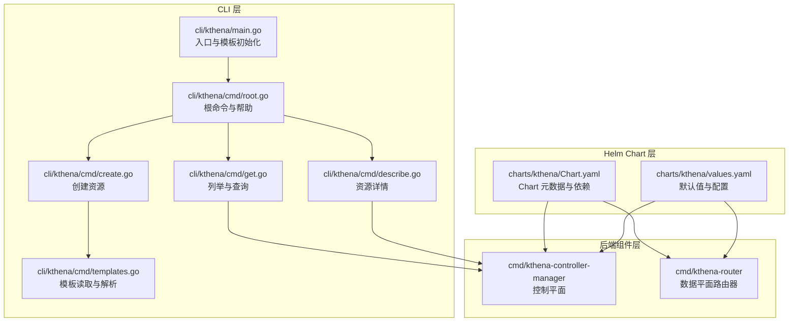
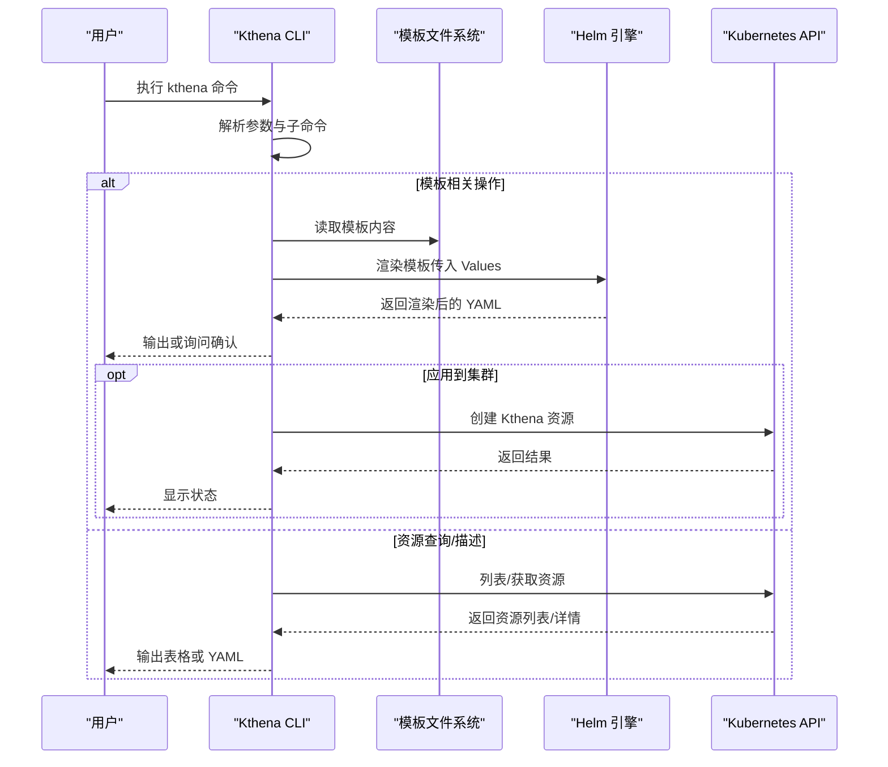
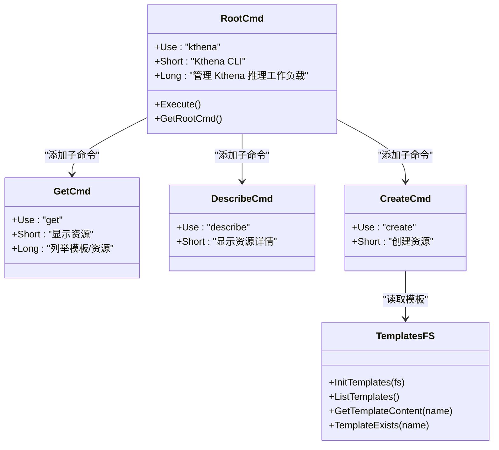
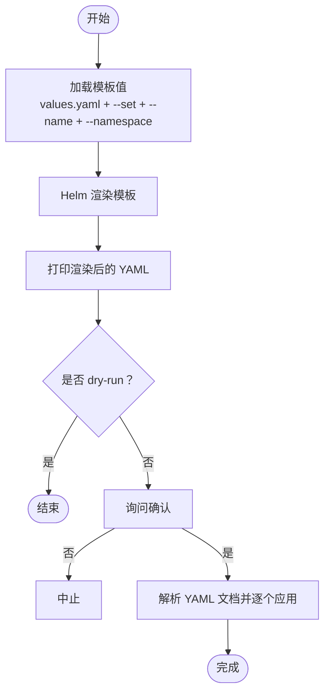
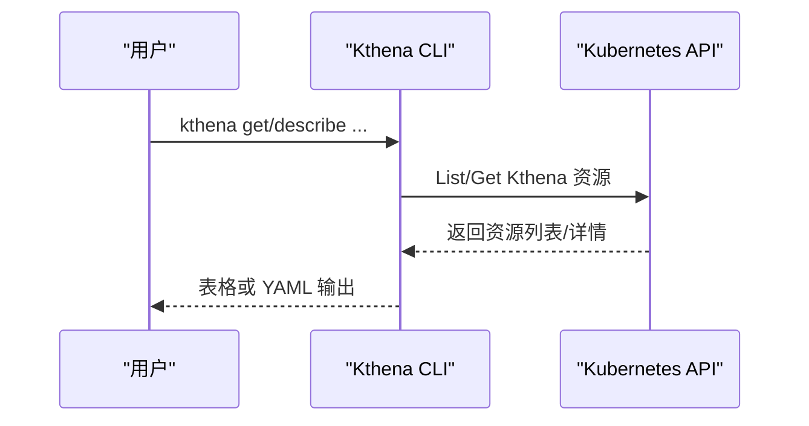
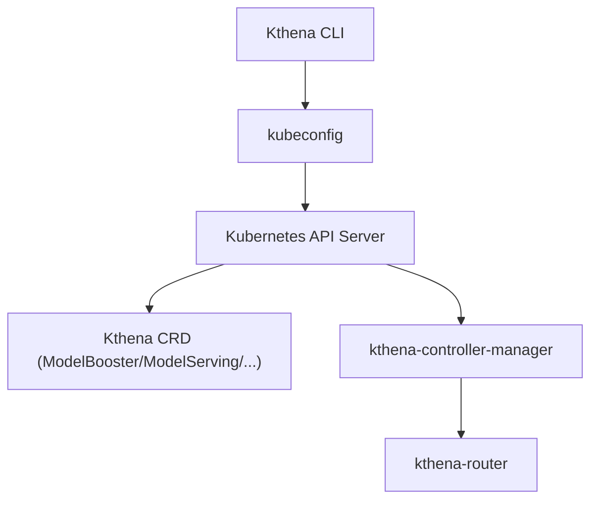
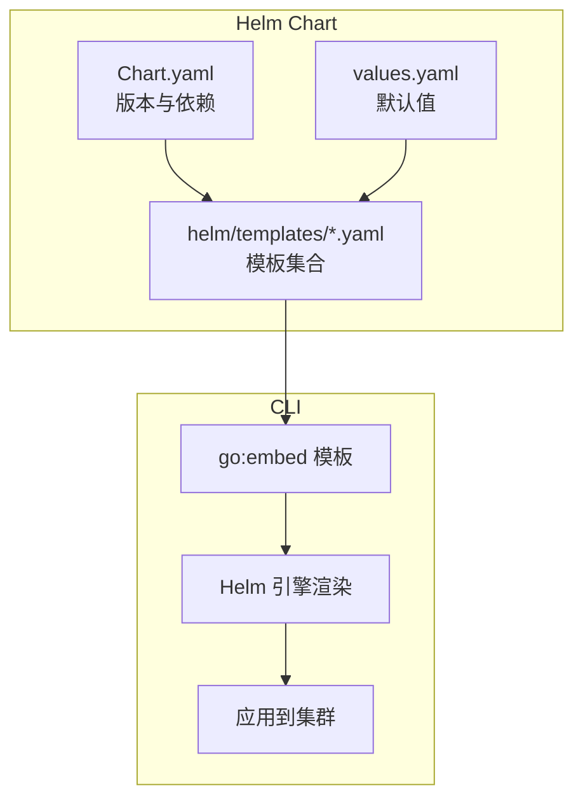
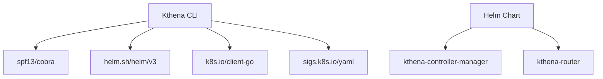

# Kthena CLI 概述

<cite>
**本文档引用的文件**
- [README.md](file://README.md)
- [cli/kthena/main.go](file://cli/kthena/main.go)
- [cli/kthena/cmd/root.go](file://cli/kthena/cmd/root.go)
- [cli/kthena/cmd/create.go](file://cli/kthena/cmd/create.go)
- [cli/kthena/cmd/get.go](file://cli/kthena/cmd/get.go)
- [cli/kthena/cmd/describe.go](file://cli/kthena/cmd/describe.go)
- [cli/kthena/cmd/templates.go](file://cli/kthena/cmd/templates.go)
- [cli/kthena/README.md](file://cli/kthena/README.md)
- [charts/kthena/Chart.yaml](file://charts/kthena/Chart.yaml)
- [charts/kthena/values.yaml](file://charts/kthena/values.yaml)
- [docs/kthena/docs/getting-started/installation.md](file://docs/kthena/docs/getting-started/installation.md)
- [docs/kthena/docs/getting-started/quick-start.md](file://docs/kthena/docs/getting-started/quick-start.md)
- [go.mod](file://go.mod)
</cite>

## 目录
1. [简介](#简介)
2. [项目结构](#项目结构)
3. [核心组件](#核心组件)
4. [架构总览](#架构总览)
5. [详细组件分析](#详细组件分析)
6. [依赖关系分析](#依赖关系分析)
7. [性能考虑](#性能考虑)
8. [故障排除指南](#故障排除指南)
9. [结论](#结论)
10. [附录](#附录)

## 简介
Kthena 是一个面向 Kubernetes 的 LLM 推理平台，提供声明式模型生命周期管理与智能请求路由能力，支持多推理引擎（vLLM、SGLang、Triton）与前缀-解码（prefill-decode）拆分部署等高级模式。Kthena 将控制面（模型生命周期、弹性伸缩策略）与数据面（流量路由）分离，通过专用路由器实现高吞吐低延迟的推理服务。

Kthena CLI 是一款遵循 kubectl 风格语法的命令行工具，用于在 Kubernetes 集群中管理 Kthena AI 推理工作负载。它提供从预定义模板生成清单、查看集群资源、描述模板与资源详情、以及基于模板创建资源的能力，并可直接应用到集群中。

本概述将介绍 Kthena CLI 的整体架构与设计理念、与 Kubernetes 集群及 Helm Charts 的交互方式、主要用途与适用场景、安装与基础配置、版本与兼容性说明，以及面向初学者的快速上手指南。

**章节来源**
- [README.md:24-66](file://README.md#L24-L66)
- [cli/kthena/README.md:71-78](file://cli/kthena/README.md#L71-L78)

## 项目结构
Kthena 仓库采用模块化组织方式，CLI 位于 cli/kthena 目录，包含命令实现、模板嵌入与客户端调用；Helm Chart 位于 charts/kthena，提供完整的平台部署方案；控制器与路由器等后端组件位于 cmd、pkg 等目录；文档位于 docs/kthena。

**图表来源**
- [cli/kthena/main.go:31-34](file://cli/kthena/main.go#L31-L34)
- [cli/kthena/cmd/root.go:25-45](file://cli/kthena/cmd/root.go#L25-L45)
- [cli/kthena/cmd/create.go:48-73](file://cli/kthena/cmd/create.go#L48-L73)
- [cli/kthena/cmd/get.go:40-55](file://cli/kthena/cmd/get.go#L40-L55)
- [cli/kthena/cmd/describe.go:29-42](file://cli/kthena/cmd/describe.go#L29-L42)
- [cli/kthena/cmd/templates.go:34-37](file://cli/kthena/cmd/templates.go#L34-L37)
- [charts/kthena/Chart.yaml:1-22](file://charts/kthena/Chart.yaml#L1-L22)
- [charts/kthena/values.yaml:1-97](file://charts/kthena/values.yaml#L1-L97)

**章节来源**
- [cli/kthena/main.go:31-34](file://cli/kthena/main.go#L31-L34)
- [cli/kthena/cmd/root.go:25-45](file://cli/kthena/cmd/root.go#L25-L45)
- [charts/kthena/Chart.yaml:1-22](file://charts/kthena/Chart.yaml#L1-L22)
- [charts/kthena/values.yaml:1-97](file://charts/kthena/values.yaml#L1-L97)

## 核心组件
- CLI 根命令与帮助：提供 kthena 命令的统一入口与全局帮助信息，支持 kubectl 风格的动词-名词语法。
- 资源操作命令：
  - get：列出模板、查询模型 Booster、ModelServing、弹性伸缩策略等资源。
  - describe：显示模板与资源的详细信息（含完整 YAML）。
  - create：从模板渲染并创建资源，支持 dry-run 与确认提示。
- 模板系统：内置 Helm 引擎，嵌入模板文件，支持变量注入与渲染输出。
- 客户端集成：通过 client-go 访问 Kthena CRD，实现资源的列举与创建。

**章节来源**
- [cli/kthena/cmd/root.go:25-45](file://cli/kthena/cmd/root.go#L25-L45)
- [cli/kthena/cmd/get.go:40-55](file://cli/kthena/cmd/get.go#L40-L55)
- [cli/kthena/cmd/describe.go:29-42](file://cli/kthena/cmd/describe.go#L29-L42)
- [cli/kthena/cmd/create.go:48-73](file://cli/kthena/cmd/create.go#L48-L73)
- [cli/kthena/cmd/templates.go:34-37](file://cli/kthena/cmd/templates.go#L34-L37)

## 架构总览
Kthena CLI 的运行时交互路径如下：用户通过 kthena 命令发起请求，根命令解析参数与子命令，调用相应处理函数；对于资源操作，CLI 使用 kubeconfig 连接集群，通过 client-go 访问 Kthena CRD；对于模板操作，CLI 从嵌入的模板文件系统读取模板，借助 Helm 引擎进行渲染，最终输出或应用到集群。

**图表来源**
- [cli/kthena/cmd/create.go:95-127](file://cli/kthena/cmd/create.go#L95-L127)
- [cli/kthena/cmd/get.go:135-190](file://cli/kthena/cmd/get.go#L135-L190)
- [cli/kthena/cmd/describe.go:102-121](file://cli/kthena/cmd/describe.go#L102-L121)
- [cli/kthena/cmd/templates.go:69-82](file://cli/kthena/cmd/templates.go#L69-L82)

## 详细组件分析

### CLI 命令体系与设计
- 动词-名词语法：遵循 kubectl 风格，便于用户迁移与学习。
- 子命令分层：根命令聚合 get/describe/create 等子命令，每个子命令负责特定功能域。
- 可扩展性：通过 Cobra 提供自动帮助、Shell 补全与错误处理机制。

**图表来源**
- [cli/kthena/cmd/root.go:25-59](file://cli/kthena/cmd/root.go#L25-L59)
- [cli/kthena/cmd/get.go:40-55](file://cli/kthena/cmd/get.go#L40-L55)
- [cli/kthena/cmd/describe.go:29-42](file://cli/kthena/cmd/describe.go#L29-L42)
- [cli/kthena/cmd/create.go:48-73](file://cli/kthena/cmd/create.go#L48-L73)
- [cli/kthena/cmd/templates.go:34-37](file://cli/kthena/cmd/templates.go#L34-L37)

**章节来源**
- [cli/kthena/cmd/root.go:25-59](file://cli/kthena/cmd/root.go#L25-L59)
- [cli/kthena/README.md:189-299](file://cli/kthena/README.md#L189-L299)

### 模板系统与渲染流程
- 模板嵌入：通过 go:embed 将 Helm 模板打包进二进制，无需外部文件。
- 渲染引擎：使用 Helm v3 引擎对模板进行渲染，支持 Values 注入与变量替换。
- 输出控制：支持输出 YAML 或以 dry-run 模式仅展示不应用。

**图表来源**
- [cli/kthena/cmd/create.go:95-127](file://cli/kthena/cmd/create.go#L95-L127)
- [cli/kthena/cmd/create.go:129-160](file://cli/kthena/cmd/create.go#L129-L160)
- [cli/kthena/cmd/create.go:162-212](file://cli/kthena/cmd/create.go#L162-L212)
- [cli/kthena/cmd/create.go:226-280](file://cli/kthena/cmd/create.go#L226-L280)

**章节来源**
- [cli/kthena/cmd/create.go:95-127](file://cli/kthena/cmd/create.go#L95-L127)
- [cli/kthena/cmd/templates.go:69-82](file://cli/kthena/cmd/templates.go#L69-L82)

### 资源查询与描述
- get 命令：支持列举模板、模型 Booster、ModelServing、弹性伸缩策略等资源，支持命名空间过滤与多种输出格式。
- describe 命令：显示模板内容与资源完整 YAML，便于理解与调试。

**图表来源**
- [cli/kthena/cmd/get.go:135-190](file://cli/kthena/cmd/get.go#L135-L190)
- [cli/kthena/cmd/get.go:244-306](file://cli/kthena/cmd/get.go#L244-L306)
- [cli/kthena/cmd/get.go:308-350](file://cli/kthena/cmd/get.go#L308-L350)
- [cli/kthena/cmd/get.go:352-394](file://cli/kthena/cmd/get.go#L352-L394)
- [cli/kthena/cmd/get.go:396-438](file://cli/kthena/cmd/get.go#L396-L438)
- [cli/kthena/cmd/describe.go:102-121](file://cli/kthena/cmd/describe.go#L102-L121)
- [cli/kthena/cmd/describe.go:123-159](file://cli/kthena/cmd/describe.go#L123-L159)
- [cli/kthena/cmd/describe.go:161-197](file://cli/kthena/cmd/describe.go#L161-L197)
- [cli/kthena/cmd/describe.go:199-235](file://cli/kthena/cmd/describe.go#L199-L235)

**章节来源**
- [cli/kthena/cmd/get.go:135-190](file://cli/kthena/cmd/get.go#L135-L190)
- [cli/kthena/cmd/describe.go:102-121](file://cli/kthena/cmd/describe.go#L102-L121)

### 与 Kubernetes 集群的交互
- 配置来源：使用本地 kubeconfig（默认 ~/.kube/config），确保具备访问 Kthena CRD 与目标命名空间的权限。
- 客户端库：通过 client-go 访问 Kthena CRD，实现资源的列举与创建。
- 控制器集成：CLI 与后端控制器（如 kthena-controller-manager）协同工作，后者负责实际的资源协调与调度。

**图表来源**
- [cli/kthena/cmd/create.go:226-280](file://cli/kthena/cmd/create.go#L226-L280)
- [cli/kthena/cmd/get.go:220-232](file://cli/kthena/cmd/get.go#L220-L232)
- [README.md:57-62](file://README.md#L57-L62)

**章节来源**
- [cli/kthena/cmd/create.go:226-280](file://cli/kthena/cmd/create.go#L226-L280)
- [cli/kthena/cmd/get.go:220-232](file://cli/kthena/cmd/get.go#L220-L232)
- [README.md:57-62](file://README.md#L57-L62)

### 与 Helm Charts 的关系
- CLI 与 Helm 的结合：CLI 内置模板来源于 charts/kthena/helm/templates，通过 Helm 引擎渲染后输出或应用。
- Chart 结构：charts/kthena/Chart.yaml 定义了应用版本与依赖（workload、networking 子 Chart），values.yaml 提供默认配置。
- 部署方式：Helm Chart 用于一次性部署整个平台（控制器与路由器），CLI 用于在已部署环境中管理资源与模板。

**图表来源**
- [charts/kthena/Chart.yaml:1-22](file://charts/kthena/Chart.yaml#L1-L22)
- [charts/kthena/values.yaml:1-97](file://charts/kthena/values.yaml#L1-L97)
- [cli/kthena/main.go:28-29](file://cli/kthena/main.go#L28-L29)
- [cli/kthena/cmd/create.go:162-212](file://cli/kthena/cmd/create.go#L162-L212)

**章节来源**
- [charts/kthena/Chart.yaml:1-22](file://charts/kthena/Chart.yaml#L1-L22)
- [charts/kthena/values.yaml:1-97](file://charts/kthena/values.yaml#L1-L97)
- [cli/kthena/main.go:28-29](file://cli/kthena/main.go#L28-L29)

## 依赖关系分析
- CLI 依赖：
  - Cobra：命令行框架，提供命令树、标志、钩子与生命周期管理。
  - Helm v3：模板渲染引擎，用于将模板与 Values 组合生成 YAML。
  - client-go：Kubernetes 客户端库，用于访问 CRD 与标准资源。
- 后端组件：
  - 控制器管理器与路由器：由 Helm Chart 部署，CLI 通过 CRD 与其交互。

**图表来源**
- [go.mod:22-42](file://go.mod#L22-L42)
- [cli/kthena/cmd/create.go:29-36](file://cli/kthena/cmd/create.go#L29-L36)
- [cli/kthena/cmd/get.go:28-31](file://cli/kthena/cmd/get.go#L28-L31)

**章节来源**
- [go.mod:22-42](file://go.mod#L22-L42)
- [cli/kthena/cmd/create.go:29-36](file://cli/kthena/cmd/create.go#L29-L36)
- [cli/kthena/cmd/get.go:28-31](file://cli/kthena/cmd/get.go#L28-L31)

## 性能考虑
- 模板渲染：Helm 渲染在本地执行，建议使用较小的 Values 文件与精简模板以减少渲染时间。
- 资源批量应用：CLI 会逐个解析 YAML 文档并应用，大规模资源建议使用 kubectl 或 Helm 进行批量部署。
- 网络与并发：CLI 与 API Server 的交互受集群网络与 API 延迟影响，建议在稳定网络环境下使用。

## 故障排除指南
- kubeconfig 权限问题：确保当前上下文具有访问 Kthena CRD 与目标命名空间的权限。
- 模板不存在：使用 kthena get templates 查看可用模板名称，或检查模板路径格式（vendor/model）。
- 渲染失败：检查 Values 文件格式与变量名是否匹配模板中的占位符。
- 资源创建失败：查看具体错误信息，确认资源类型与命名空间正确。

**章节来源**
- [cli/kthena/cmd/get.go:135-190](file://cli/kthena/cmd/get.go#L135-L190)
- [cli/kthena/cmd/create.go:95-127](file://cli/kthena/cmd/create.go#L95-L127)
- [cli/kthena/cmd/describe.go:102-121](file://cli/kthena/cmd/describe.go#L102-L121)

## 结论
Kthena CLI 以简洁一致的 kubectl 风格语法，为 Kubernetes 上的 LLM 推理工作负载提供了高效的管理手段。通过内置模板与 Helm 渲染，用户可以快速生成并应用资源；通过与 Helm Chart 的配合，平台实现了控制面与数据面的解耦部署。对于初学者而言，建议先完成 Helm 部署与基本配置，再使用 CLI 进行日常运维与资源管理。

## 附录

### 主要用途与适用场景
- 快速生成与应用 Kthena 资源清单（模型 Booster、ModelServing、弹性伸缩策略等）。
- 在集群中列举与查询资源状态，辅助排障与审计。
- 通过模板系统标准化部署流程，降低重复劳动与出错率。

**章节来源**
- [cli/kthena/README.md:71-78](file://cli/kthena/README.md#L71-L78)

### 安装与基础配置
- 安装 CLI：
  - 从发布页下载二进制或通过 go install 安装。
  - 将二进制加入 PATH，确保可在任意位置执行 kthena 命令。
- 基础配置：
  - 准备有效的 kubeconfig（通常位于 ~/.kube/config）。
  - 确保集群已安装 Kthena CRD 并具备相应 RBAC 权限。
  - 如需使用 Helm Chart 部署平台，请参考官方安装指南。

**章节来源**
- [docs/kthena/docs/getting-started/installation.md:124-136](file://docs/kthena/docs/getting-started/installation.md#L124-L136)
- [cli/kthena/README.md:79-98](file://cli/kthena/README.md#L79-L98)

### 版本信息与兼容性
- CLI 与 Helm Chart 版本：Chart.yaml 中定义了 chart version 与 appVersion，用于区分 Chart 更新与应用版本。
- Helm 与 Kubernetes：Helm v3 与 Kubernetes v1.20+ 以上版本兼容。
- Go 版本：项目使用 Go 1.24.0。

**章节来源**
- [charts/kthena/Chart.yaml:5-15](file://charts/kthena/Chart.yaml#L5-L15)
- [docs/kthena/docs/getting-started/installation.md:15-18](file://docs/kthena/docs/getting-started/installation.md#L15-L18)
- [go.mod:3](file://go.mod#L3)

### 快速上手指南
- 安装 Kthena（Helm 方式）并在集群中验证组件状态。
- 使用 kthena get templates 查看可用模板。
- 使用 kthena describe template <模板名> 查看模板详情。
- 使用 kthena create manifest --template <模板名> --name <资源名> --namespace <命名空间> 生成并应用资源。
- 使用 kthena get model-boosters / model-servings / autoscaling-policies 查看资源状态。

**章节来源**
- [docs/kthena/docs/getting-started/installation.md:24-114](file://docs/kthena/docs/getting-started/installation.md#L24-L114)
- [docs/kthena/docs/getting-started/quick-start.md:17-161](file://docs/kthena/docs/getting-started/quick-start.md#L17-L161)
- [cli/kthena/README.md:103-157](file://cli/kthena/README.md#L103-L157)