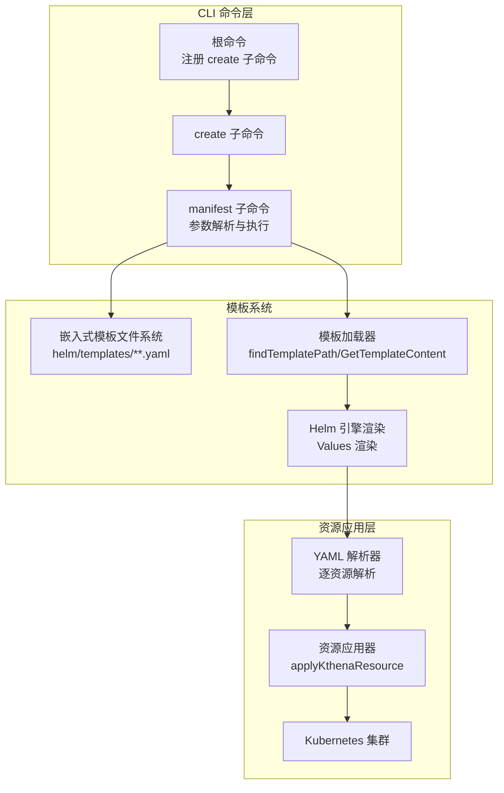
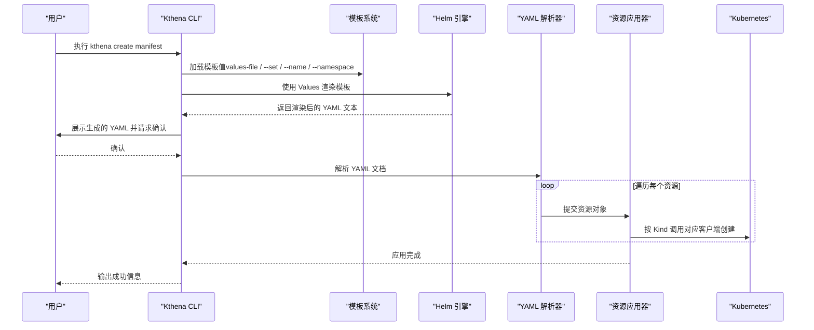
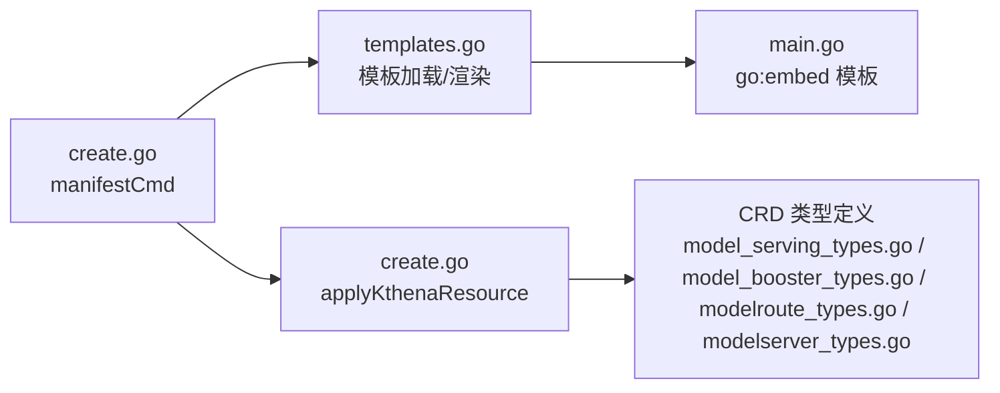

# 创建命令

<cite>
**本文引用的文件**
- [create.go](file://cli/kthena/cmd/create.go)
- [templates.go](file://cli/kthena/cmd/templates.go)
- [main.go](file://cli/kthena/main.go)
- [Qwen3-32B.yaml](file://cli/kthena/helm/templates/Qwen/Qwen3-32B.yaml)
- [DeepSeek-R1-Distill-Qwen-32B.yaml](file://cli/kthena/helm/templates/deepseek-ai/DeepSeek-R1-Distill-Qwen-32B.yaml)
- [README.md（模板库）](file://cli/kthena/helm/templates/README.md)
- [model_serving_types.go](file://pkg/apis/workload/v1alpha1/model_serving_types.go)
- [model_booster_types.go](file://pkg/apis/workload/v1alpha1/model_booster_types.go)
- [modelroute_types.go](file://pkg/apis/networking/v1alpha1/modelroute_types.go)
- [modelserver_types.go](file://pkg/apis/networking/v1alpha1/modelserver_types.go)
- [ModelRouteSimple.yaml](file://examples/kthena-router/ModelRouteSimple.yaml)
- [ModelServer-ds1.5b.yaml](file://examples/kthena-router/ModelServer-ds1.5b.yaml)
- [ModelServing-ds1.5b-pd-disaggregation.yaml](file://examples/kthena-router/ModelServing-ds1.5b-pd-disaggregation.yaml)
</cite>

## 目录
1. [简介](#简介)
2. [项目结构](#项目结构)
3. [核心组件](#核心组件)
4. [架构总览](#架构总览)
5. [详细组件分析](#详细组件分析)
6. [依赖分析](#依赖分析)
7. [性能考虑](#性能考虑)
8. [故障排查指南](#故障排查指南)
9. [结论](#结论)
10. [附录](#附录)

## 简介
本章节面向 Kthena CLI 的“创建”子命令，系统性说明如何通过内置模板快速生成并部署 Kthena 资源对象。重点覆盖以下内容：
- create 子命令与 manifest 子命令的功能与用法
- 支持的资源类型：ModelServing、ModelRoute、ModelServer、ModelBooster（以及相关工作负载与网络 CRD）
- 模板系统工作机制与可用模板清单
- 常用模板（Qwen 与 DeepSeek 系列）的使用方式与关键参数
- 命令示例与配置生成流程
- 自定义模板与参数覆盖策略

## 项目结构
Kthena CLI 的“创建”能力由三部分组成：
- 命令入口与子命令注册：在根命令下注册 create 子命令，并在其下添加 manifest 子命令
- 模板系统：通过 Go 的 embed 将模板目录打包进二进制，运行时按名称查找与渲染
- 资源应用：解析渲染后的 YAML，按资源类型调用对应客户端进行创建

图表来源
- [create.go:49-93](file://cli/kthena/cmd/create.go#L49-L93)
- [templates.go:34-118](file://cli/kthena/cmd/templates.go#L34-L118)
- [main.go:28-34](file://cli/kthena/main.go#L28-L34)

章节来源
- [create.go:49-93](file://cli/kthena/cmd/create.go#L49-L93)
- [templates.go:34-118](file://cli/kthena/cmd/templates.go#L34-L118)
- [main.go:28-34](file://cli/kthena/main.go#L28-L34)

## 核心组件
- create 子命令：作为入口，注册 manifest 子命令
- manifest 子命令：负责模板加载、值合并、Helm 渲染、确认提示、资源应用
- 模板系统：提供模板发现、读取、描述提取与列表功能
- 资源应用器：根据 GVK 类型将 YAML 转换为具体 CRD 并创建

章节来源
- [create.go:49-127](file://cli/kthena/cmd/create.go#L49-L127)
- [templates.go:34-133](file://cli/kthena/cmd/templates.go#L34-L133)

## 架构总览
下面以“创建 ModelBooster（模型增强器）”为例，展示从命令到集群的完整流程。

图表来源
- [create.go:95-127](file://cli/kthena/cmd/create.go#L95-L127)
- [create.go:226-280](file://cli/kthena/cmd/create.go#L226-L280)
- [create.go:282-346](file://cli/kthena/cmd/create.go#L282-L346)

## 详细组件分析

### 命令与参数
- 子命令：create manifest
- 关键参数
  - --template/-t：模板名称（必填），格式为 vendor/model
  - --values-file/-f：模板值文件路径（可选）
  - --dry-run：仅渲染不应用
  - --namespace/-n：目标命名空间，默认 default
  - --name：工作负载名称（可选）
  - --set：以 key=value 形式传入模板值（可多次）

章节来源
- [create.go:75-93](file://cli/kthena/cmd/create.go#L75-L93)

### 模板系统
- 模板存储：通过 go:embed 将 helm/templates/**.yaml 嵌入二进制
- 模板发现：优先按 vendor/model.yaml 查找；若失败则遍历所有 vendor 目录回退匹配
- 模板读取：按路径读取模板内容
- 列表与描述：列出所有 vendor/model 名称；从模板顶部注释提取描述

章节来源
- [main.go:28-34](file://cli/kthena/main.go#L28-L34)
- [templates.go:34-118](file://cli/kthena/cmd/templates.go#L34-L118)
- [templates.go:120-154](file://cli/kthena/cmd/templates.go#L120-L154)

### 模板值加载与合并
- 顺序：先读取 values-file，再用 --set 覆盖，最后用 --name 与 --namespace 设置默认值
- 渲染：将值包装在 Values 下，交由 Helm 引擎渲染

章节来源
- [create.go:129-160](file://cli/kthena/cmd/create.go#L129-L160)
- [create.go:162-212](file://cli/kthena/cmd/create.go#L162-L212)

### 资源应用与类型支持
当前实现支持以下 Kthena 资源类型：
- ModelServing
- ModelBooster
- AutoscalingPolicy
- AutoscalingPolicyBinding

应用流程：解析 YAML -> 获取 GVK -> switch 分派 -> 转换为具体类型 -> 调用相应客户端创建

章节来源
- [create.go:282-346](file://cli/kthena/cmd/create.go#L282-L346)

### 支持的资源类型与关键字段
- ModelServing（工作负载）
  - 关键字段：replicas、schedulerName、template.roles、rolloutStrategy、recoveryPolicy
  - 参考：[model_serving_types.go:35-66](file://pkg/apis/workload/v1alpha1/model_serving_types.go#L35-L66)
- ModelBooster（模型增强器）
  - 关键字段：spec.name、spec.owner、spec.backend（含 type、modelURI、cacheURI、minReplicas/maxReplicas、workers）
  - 参考：[model_booster_types.go:26-48](file://pkg/apis/workload/v1alpha1/model_booster_types.go#L26-L48)
- ModelRoute（网络路由）
  - 关键字段：modelName、loraAdapters、rules、rateLimit
  - 参考：[modelroute_types.go:24-56](file://pkg/apis/networking/v1alpha1/modelroute_types.go#L24-L56)
- ModelServer（网络服务端）
  - 关键字段：inferenceEngine、workloadSelector、workloadPort、trafficPolicy、kvConnector
  - 参考：[modelserver_types.go:23-50](file://pkg/apis/networking/v1alpha1/modelserver_types.go#L23-L50)

章节来源
- [model_serving_types.go:35-66](file://pkg/apis/workload/v1alpha1/model_serving_types.go#L35-L66)
- [model_booster_types.go:26-48](file://pkg/apis/workload/v1alpha1/model_booster_types.go#L26-L48)
- [modelroute_types.go:24-56](file://pkg/apis/networking/v1alpha1/modelroute_types.go#L24-L56)
- [modelserver_types.go:23-50](file://pkg/apis/networking/v1alpha1/modelserver_types.go#L23-L50)

### 内置模板与使用示例
- 模板库设计原则与限制：见模板库 README
- Qwen 系列模板
  - 示例：Qwen3-32B、Qwen3-Coder-30B-A3B-Instruct 等
  - 典型字段：backend.type、modelURI、workers.config（如 tensor-parallel-size、gpu-memory-utilization）、resources.limits.nvidia.com/gpu
  - 参考：[Qwen3-32B.yaml:1-35](file://cli/kthena/helm/templates/Qwen/Qwen3-32B.yaml#L1-L35)
  - 参考：[Qwen3-Coder-30B-A3B-Instruct.yaml:1-35](file://cli/kthena/helm/templates/Qwen/Qwen3-Coder-30B-A3B-Instruct.yaml#L1-L35)
- DeepSeek 系列模板
  - 示例：DeepSeek-R1-Distill-Qwen-32B、DeepSeek-R1-Distill-Qwen-7B 等
  - 典型字段：同上
  - 参考：[DeepSeek-R1-Distill-Qwen-32B.yaml:1-35](file://cli/kthena/helm/templates/deepseek-ai/DeepSeek-R1-Distill-Qwen-32B.yaml#L1-L35)

章节来源
- [README.md（模板库）:1-40](file://cli/kthena/helm/templates/README.md#L1-L40)
- [Qwen3-32B.yaml:1-35](file://cli/kthena/helm/templates/Qwen/Qwen3-32B.yaml#L1-L35)
- [Qwen3-Coder-30B-A3B-Instruct.yaml:1-35](file://cli/kthena/helm/templates/Qwen/Qwen3-Coder-30B-A3B-Instruct.yaml#L1-L35)
- [DeepSeek-R1-Distill-Qwen-32B.yaml:1-35](file://cli/kthena/helm/templates/deepseek-ai/DeepSeek-R1-Distill-Qwen-32B.yaml#L1-L35)

### 命令示例与配置生成流程
- 列出可用模板
  - kthena get templates
- 获取指定模板
  - kthena get template vendor/model
- 生成并应用模板
  - kthena create manifest --template vendor/model --name my-model --image my-registry/model:v1.0
  - kthena create manifest --template vendor/model --values-file values.yaml
  - kthena create manifest --template vendor/model --set key1=val1,key2=val2 --dry-run

章节来源
- [create.go:75-93](file://cli/kthena/cmd/create.go#L75-L93)
- [templates.go:84-112](file://cli/kthena/cmd/templates.go#L84-L112)

### 模板系统工作原理与自定义选项
- 工作原理
  - 模板以 Go 模板语法（{{ .Values.xxx }}）编写
  - CLI 将用户提供的值统一放入 Values，交由 Helm 渲染
  - 渲染后按 YAML 文档流逐一解析并应用
- 自定义选项
  - 通过 --set 传入任意键值对覆盖模板默认值
  - 通过 --values-file 指定复杂配置文件
  - 通过 --name 与 --namespace 设置通用上下文
  - 通过 --dry-run 预览渲染结果，避免误操作

章节来源
- [create.go:129-160](file://cli/kthena/cmd/create.go#L129-L160)
- [create.go:162-212](file://cli/kthena/cmd/create.go#L162-L212)
- [templates.go:120-154](file://cli/kthena/cmd/templates.go#L120-L154)

## 依赖分析
- 命令层依赖模板系统与资源应用层
- 模板系统依赖嵌入式文件系统
- 资源应用层依赖 Kubernetes 客户端与 CRD 类型

图表来源
- [create.go:49-127](file://cli/kthena/cmd/create.go#L49-L127)
- [templates.go:34-118](file://cli/kthena/cmd/templates.go#L34-L118)
- [main.go:28-34](file://cli/kthena/main.go#L28-L34)
- [model_serving_types.go:246-252](file://pkg/apis/workload/v1alpha1/model_serving_types.go#L246-L252)
- [model_booster_types.go:191-198](file://pkg/apis/workload/v1alpha1/model_booster_types.go#L191-L198)
- [modelroute_types.go:177-184](file://pkg/apis/networking/v1alpha1/modelroute_types.go#L177-L184)
- [modelserver_types.go:154-162](file://pkg/apis/networking/v1alpha1/modelserver_types.go#L154-L162)

章节来源
- [create.go:49-127](file://cli/kthena/cmd/create.go#L49-L127)
- [templates.go:34-118](file://cli/kthena/cmd/templates.go#L34-L118)
- [main.go:28-34](file://cli/kthena/main.go#L28-L34)

## 性能考虑
- 模板渲染：Helm 渲染在本地完成，复杂模板可能增加 CPU 与内存消耗
- YAML 解析：逐文档解析，建议控制单次渲染输出的资源数量
- 应用阶段：按资源逐一创建，适用于小规模批量；大规模场景建议分批或结合其他工具

## 故障排查指南
- 模板不存在
  - 现象：提示 template 'xxx' not found
  - 排查：确认 --template 参数格式为 vendor/model；使用 kthena get templates 查看可用模板
- 值文件解析失败
  - 现象：failed to parse values file
  - 排查：检查 YAML 语法与缩进；确保键名与模板中使用的 .Values 键一致
- 渲染失败
  - 现象：failed to render template
  - 排查：核对模板语法；减少复杂逻辑；必要时使用 --dry-run 预览
- 应用失败
  - 现象：failed to apply X: 指定资源创建失败
  - 排查：检查 CRD 是否安装；确认命名空间权限；查看资源字段是否符合 CRD 规范
- 不支持的资源类型
  - 现象：unsupported resource type: Kind
  - 排查：当前仅支持 ModelServing、ModelBooster、AutoscalingPolicy、AutoscalingPolicyBinding

章节来源
- [templates.go:114-118](file://cli/kthena/cmd/templates.go#L114-L118)
- [create.go:162-212](file://cli/kthena/cmd/create.go#L162-L212)
- [create.go:226-280](file://cli/kthena/cmd/create.go#L226-L280)
- [create.go:341-343](file://cli/kthena/cmd/create.go#L341-L343)

## 结论
Kthena CLI 的 create manifest 子命令通过内置模板与 Helm 渲染，实现了“所见即所得”的资源生成与应用体验。配合丰富的模板库（尤其是 Qwen 与 DeepSeek 系列），用户可以快速完成常见推理场景的部署。建议在生产环境中结合 --dry-run 进行预审，并通过 CRD 规范与示例文件校验关键字段。

## 附录

### 常用模板与关键参数速查
- Qwen3-32B
  - 关键参数：backend.type、modelURI、workers.config.tensor-parallel-size、gpu-limit
  - 参考：[Qwen3-32B.yaml:1-35](file://cli/kthena/helm/templates/Qwen/Qwen3-32B.yaml#L1-L35)
- Qwen3-Coder-30B-A3B-Instruct
  - 关键参数：同上
  - 参考：[Qwen3-Coder-30B-A3B-Instruct.yaml:1-35](file://cli/kthena/helm/templates/Qwen/Qwen3-Coder-30B-A3B-Instruct.yaml#L1-L35)
- DeepSeek-R1-Distill-Qwen-32B
  - 关键参数：同上
  - 参考：[DeepSeek-R1-Distill-Qwen-32B.yaml:1-35](file://cli/kthena/helm/templates/deepseek-ai/DeepSeek-R1-Distill-Qwen-32B.yaml#L1-L35)

### 示例资源参考
- ModelRoute 简单示例
  - 参考：[ModelRouteSimple.yaml:1-12](file://examples/kthena-router/ModelRouteSimple.yaml#L1-L12)
- ModelServer 示例
  - 参考：[ModelServer-ds1.5b.yaml:1-16](file://examples/kthena-router/ModelServer-ds1.5b.yaml#L1-L16)
- ModelServing（预取-解码拆分）示例
  - 参考：[ModelServing-ds1.5b-pd-disaggregation.yaml:1-51](file://examples/kthena-router/ModelServing-ds1.5b-pd-disaggregation.yaml#L1-L51)