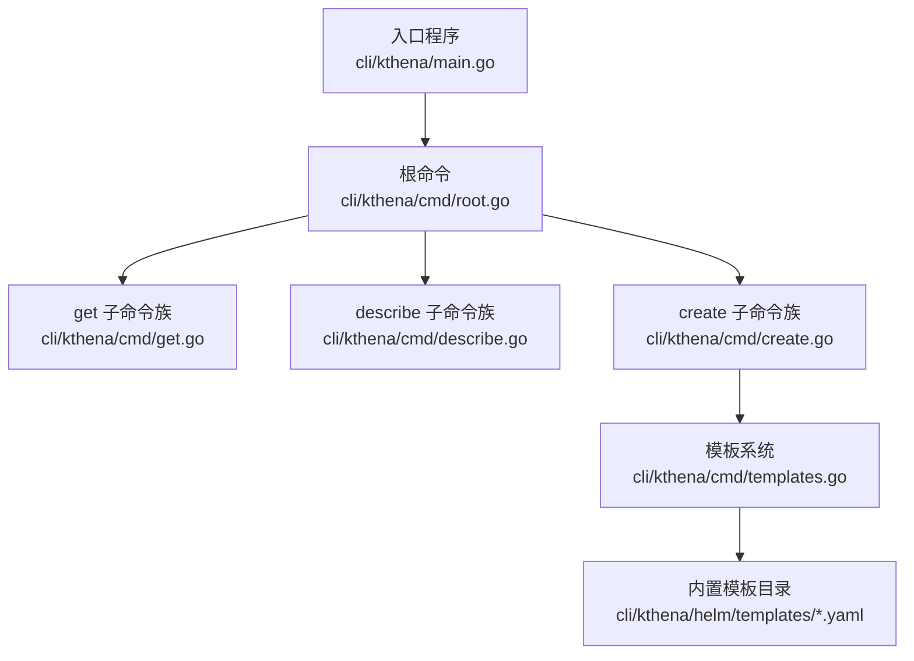
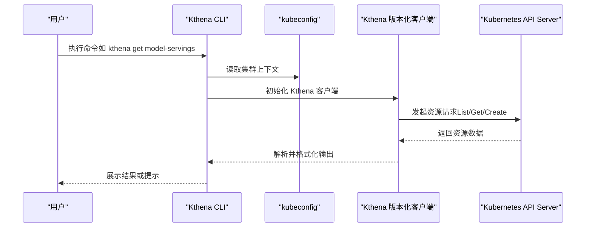
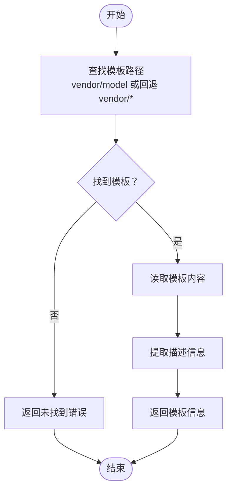
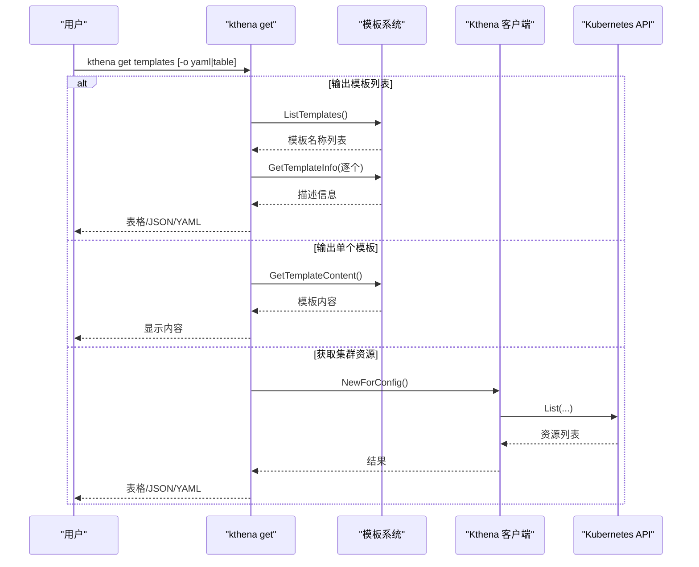
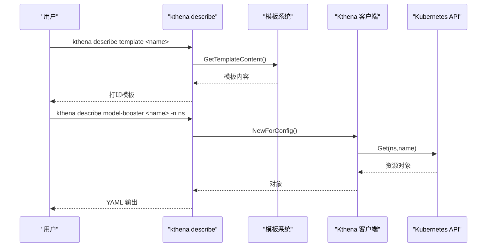
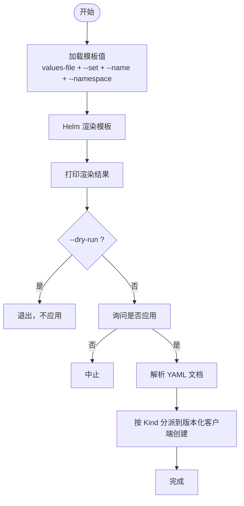
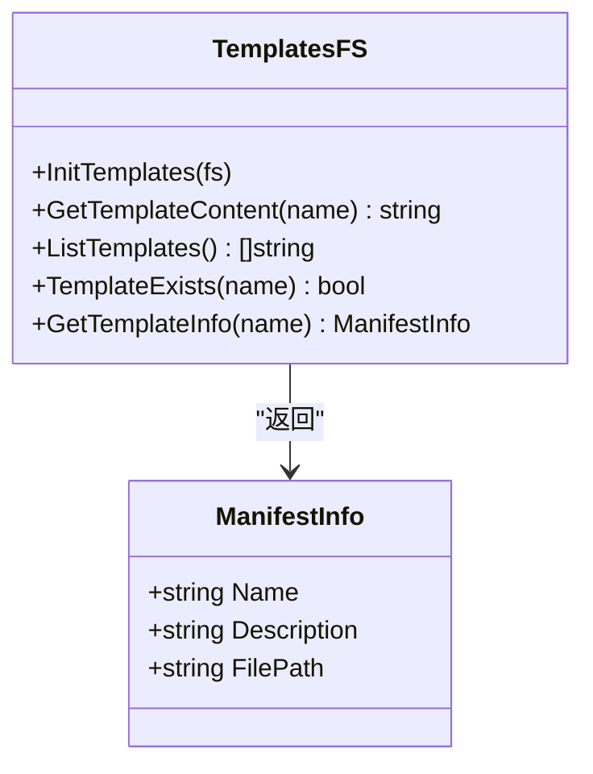
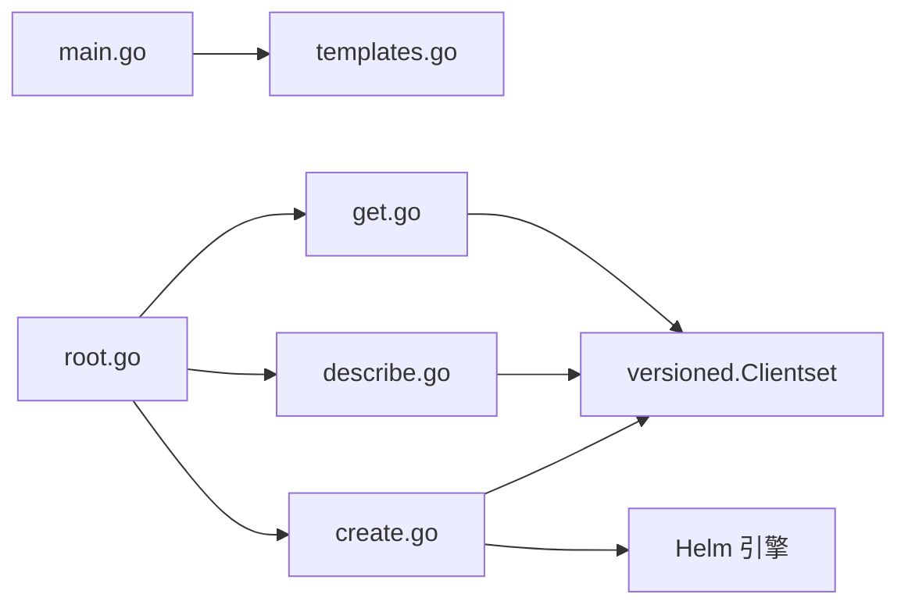

# 命令行工具

<cite>
**本文引用的文件**   
- [cli/kthena/main.go](file://cli/kthena/main.go)
- [cli/kthena/cmd/root.go](file://cli/kthena/cmd/root.go)
- [cli/kthena/cmd/create.go](file://cli/kthena/cmd/create.go)
- [cli/kthena/cmd/get.go](file://cli/kthena/cmd/get.go)
- [cli/kthena/cmd/describe.go](file://cli/kthena/cmd/describe.go)
- [cli/kthena/cmd/templates.go](file://cli/kthena/cmd/templates.go)
- [cli/kthena/README.md](file://cli/kthena/README.md)
- [cli/kthena/helm/templates/README.md](file://cli/kthena/helm/templates/README.md)
- [cli/kthena/helm/templates/Qwen/Qwen3-32B.yaml](file://cli/kthena/helm/templates/Qwen/Qwen3-32B.yaml)
- [cli/kthena/helm/templates/deepseek-ai/DeepSeek-R1-Distill-Qwen-32B.yaml](file://cli/kthena/helm/templates/deepseek-ai/DeepSeek-R1-Distill-Qwen-32B.yaml)
- [docs/kthena/docs/reference/kthena-cli.md](file://docs/kthena/docs/reference/kthena-cli.md)
- [docs/kthena/docs/getting-started/installation.md](file://docs/kthena/docs/getting-started/installation.md)
</cite>

## 目录
1. [简介](#简介)
2. [项目结构](#项目结构)
3. [核心组件](#核心组件)
4. [架构总览](#架构总览)
5. [详细组件分析](#详细组件分析)
6. [依赖关系分析](#依赖关系分析)
7. [性能考虑](#性能考虑)
8. [故障排查指南](#故障排查指南)
9. [结论](#结论)
10. [附录](#附录)

## 简介
本文件为 Kthena CLI 工具的全面使用文档，覆盖命令行工具的功能与子命令，包括创建、获取、描述与模板管理等能力；解释 CLI 与 Kubernetes API 的交互方式；提供常用工作流示例；介绍模板系统用法与自定义方法；并给出面向自动化脚本的接口参考与常见问题排查建议。

## 项目结构
Kthena CLI 采用 Cobra 命令框架组织，入口程序负责加载内置模板并启动命令树。核心命令分为三类：get（查询）、describe（详情）、create（创建）。模板以嵌入式资源形式随二进制分发，便于离线使用。

图示来源
- [cli/kthena/main.go:31-35](file://cli/kthena/main.go#L31-L35)
- [cli/kthena/cmd/root.go:26-59](file://cli/kthena/cmd/root.go#L26-L59)
- [cli/kthena/cmd/get.go:41-133](file://cli/kthena/cmd/get.go#L41-L133)
- [cli/kthena/cmd/describe.go:29-100](file://cli/kthena/cmd/describe.go#L29-L100)
- [cli/kthena/cmd/create.go:49-93](file://cli/kthena/cmd/create.go#L49-L93)
- [cli/kthena/cmd/templates.go:35-118](file://cli/kthena/cmd/templates.go#L35-L118)

章节来源
- [cli/kthena/main.go:31-35](file://cli/kthena/main.go#L31-L35)
- [cli/kthena/cmd/root.go:26-59](file://cli/kthena/cmd/root.go#L26-L59)

## 核心组件
- 根命令与帮助：提供全局概览与示例，定义通用标志位（如 toggle）。
- 模板系统：内置模板通过嵌入式文件系统提供，支持按供应商/模型命名空间查找与读取，并可提取模板描述信息。
- 资源操作命令：get/describe/create 三大类，分别用于列举/查看模板与集群资源、展示资源详情、以及从模板渲染并应用到集群。
- Kubernetes 客户端：通过 client-go 与版本化客户端访问 Kthena CRD 资源。

章节来源
- [cli/kthena/cmd/root.go:26-59](file://cli/kthena/cmd/root.go#L26-L59)
- [cli/kthena/cmd/templates.go:35-118](file://cli/kthena/cmd/templates.go#L35-L118)
- [cli/kthena/cmd/get.go:41-133](file://cli/kthena/cmd/get.go#L41-L133)
- [cli/kthena/cmd/describe.go:29-100](file://cli/kthena/cmd/describe.go#L29-L100)
- [cli/kthena/cmd/create.go:49-93](file://cli/kthena/cmd/create.go#L49-L93)

## 架构总览
下图展示了 CLI 与 Kubernetes API 的交互路径：CLI 通过 kubeconfig 获取集群上下文，构建版本化客户端，随后对 Kthena CRD 资源进行列表、获取或创建操作。

图示来源
- [cli/kthena/cmd/get.go:220-232](file://cli/kthena/cmd/get.go#L220-L232)
- [cli/kthena/cmd/describe.go:126-135](file://cli/kthena/cmd/describe.go#L126-L135)
- [cli/kthena/cmd/create.go:227-237](file://cli/kthena/cmd/create.go#L227-L237)

## 详细组件分析

### 根命令与全局行为
- 根命令提供简短与长描述、示例用法，作为所有子命令的父节点。
- 支持持久标志位与本地标志位，便于在不同层级复用或限定范围。
- 提供导出根命令的函数，便于外部工具（如文档生成器）复用。

章节来源
- [cli/kthena/cmd/root.go:26-59](file://cli/kthena/cmd/root.go#L26-L59)

### 模板系统
- 模板嵌入：入口程序在启动时初始化嵌入式模板文件系统。
- 查找策略：优先按 vendor/model 形式直接定位；若失败则遍历 vendor 目录回退匹配。
- 列表与描述：支持列出可用模板、获取指定模板内容或描述信息。
- 内容解析：从模板顶部注释中提取描述，便于表格化展示。

图示来源
- [cli/kthena/cmd/templates.go:35-118](file://cli/kthena/cmd/templates.go#L35-L118)
- [cli/kthena/cmd/templates.go:121-133](file://cli/kthena/cmd/templates.go#L121-L133)

章节来源
- [cli/kthena/main.go:31-35](file://cli/kthena/main.go#L31-L35)
- [cli/kthena/cmd/templates.go:35-118](file://cli/kthena/cmd/templates.go#L35-L118)
- [cli/kthena/helm/templates/README.md:1-40](file://cli/kthena/helm/templates/README.md#L1-L40)

### 获取命令（kthena get）
- 子命令族：templates、template、model-boosters、model-servings、autoscaling-policies、autoscaling-policy-bindings。
- 输出格式：支持 yaml、json、table，默认表格输出。
- 命名空间控制：支持当前上下文命名空间、指定命名空间或全命名空间模式。
- 行为要点：
  - 列表模板：读取嵌入式模板并解析描述，表格化输出。
  - 获取模板：支持输出原始模板内容或模板元信息。
  - 获取集群资源：通过版本化客户端调用对应资源的 List 接口，按过滤条件输出。

图示来源
- [cli/kthena/cmd/get.go:135-190](file://cli/kthena/cmd/get.go#L135-L190)
- [cli/kthena/cmd/get.go:192-218](file://cli/kthena/cmd/get.go#L192-L218)
- [cli/kthena/cmd/get.go:244-306](file://cli/kthena/cmd/get.go#L244-L306)
- [cli/kthena/cmd/get.go:308-350](file://cli/kthena/cmd/get.go#L308-L350)
- [cli/kthena/cmd/get.go:352-394](file://cli/kthena/cmd/get.go#L352-L394)
- [cli/kthena/cmd/get.go:396-438](file://cli/kthena/cmd/get.go#L396-L438)

章节来源
- [cli/kthena/cmd/get.go:41-133](file://cli/kthena/cmd/get.go#L41-L133)

### 描述命令（kthena describe）
- 子命令族：template、model-booster、model-serving、autoscaling-policy。
- 行为要点：
  - 模板描述：读取模板内容并在终端打印。
  - 集群资源描述：通过版本化客户端调用 Get 接口，输出资源完整 YAML。

图示来源
- [cli/kthena/cmd/describe.go:102-121](file://cli/kthena/cmd/describe.go#L102-L121)
- [cli/kthena/cmd/describe.go:123-159](file://cli/kthena/cmd/describe.go#L123-L159)
- [cli/kthena/cmd/describe.go:161-197](file://cli/kthena/cmd/describe.go#L161-L197)
- [cli/kthena/cmd/describe.go:199-235](file://cli/kthena/cmd/describe.go#L199-L235)

章节来源
- [cli/kthena/cmd/describe.go:29-100](file://cli/kthena/cmd/describe.go#L29-L100)

### 创建命令（kthena create）
- 子命令：manifest。
- 流程：
  1) 合成模板值：支持从 values 文件与 --set 参数合并，--name 与 --namespace 可覆盖默认值。
  2) 渲染模板：通过 Helm 引擎渲染，输出 YAML。
  3) 预览与确认：非 dry-run 模式下打印渲染结果并询问是否应用。
  4) 应用资源：解析 YAML 文档，按资源类型调用版本化客户端创建对应 CRD。
- 支持的资源类型：ModelServing、ModelBooster、AutoscalingPolicy、AutoscalingPolicyBinding。

图示来源
- [cli/kthena/cmd/create.go:95-127](file://cli/kthena/cmd/create.go#L95-L127)
- [cli/kthena/cmd/create.go:129-160](file://cli/kthena/cmd/create.go#L129-L160)
- [cli/kthena/cmd/create.go:162-212](file://cli/kthena/cmd/create.go#L162-L212)
- [cli/kthena/cmd/create.go:226-280](file://cli/kthena/cmd/create.go#L226-L280)
- [cli/kthena/cmd/create.go:282-346](file://cli/kthena/cmd/create.go#L282-L346)

章节来源
- [cli/kthena/cmd/create.go:49-93](file://cli/kthena/cmd/create.go#L49-L93)

### 模板系统类图

图示来源
- [cli/kthena/cmd/templates.go:35-118](file://cli/kthena/cmd/templates.go#L35-L118)
- [cli/kthena/cmd/templates.go:121-133](file://cli/kthena/cmd/templates.go#L121-L133)

## 依赖关系分析
- 入口程序依赖模板系统初始化，确保命令执行前模板可用。
- get/describe/create 均依赖 kubeconfig 与版本化客户端访问集群。
- create 依赖 Helm 引擎进行模板渲染，并依赖 client-go 进行资源应用。

图示来源
- [cli/kthena/main.go:31-35](file://cli/kthena/main.go#L31-L35)
- [cli/kthena/cmd/get.go:220-232](file://cli/kthena/cmd/get.go#L220-L232)
- [cli/kthena/cmd/describe.go:126-135](file://cli/kthena/cmd/describe.go#L126-L135)
- [cli/kthena/cmd/create.go:227-237](file://cli/kthena/cmd/create.go#L227-L237)

章节来源
- [cli/kthena/main.go:31-35](file://cli/kthena/main.go#L31-L35)
- [cli/kthena/cmd/get.go:220-232](file://cli/kthena/cmd/get.go#L220-L232)
- [cli/kthena/cmd/describe.go:126-135](file://cli/kthena/cmd/describe.go#L126-L135)
- [cli/kthena/cmd/create.go:227-237](file://cli/kthena/cmd/create.go#L227-L237)

## 性能考虑
- 模板读取：模板嵌入于二进制，避免磁盘 IO；列表模板时仅扫描嵌入目录，复杂度与模板数量线性相关。
- 渲染阶段：Helm 渲染在内存中完成，模板规模与变量数量影响渲染时间。
- 集群交互：批量 YAML 文档逐条解析并逐一创建，网络往返次数与资源数量线性相关；建议在高并发场景下减少一次性资源数量或使用批量工具。

## 故障排查指南
- 无法连接集群
  - 检查 kubeconfig 是否存在且可读，确认当前上下文指向目标集群。
  - 确认已安装 Kthena CRD 并具备相应 RBAC 权限。
- 模板不存在
  - 使用 kthena get templates 确认模板名称；模板命名采用 vendor/model 格式。
  - 若使用旧版命名，可回退至 vendor 目录内查找。
- 渲染失败
  - 检查 --set 参数键值对格式；确认 values-file 为合法 YAML。
  - 使用 --dry-run 预览渲染结果，定位变量缺失或语法错误。
- 应用失败
  - 查看具体资源创建错误信息，核对 CRD 字段与版本兼容性。
  - 分批应用或检查命名空间权限。

章节来源
- [cli/kthena/cmd/create.go:95-127](file://cli/kthena/cmd/create.go#L95-L127)
- [cli/kthena/cmd/get.go:135-190](file://cli/kthena/cmd/get.go#L135-L190)
- [docs/kthena/docs/getting-started/installation.md:101-114](file://docs/kthena/docs/getting-started/installation.md#L101-L114)

## 结论
Kthena CLI 提供了与 kubectl 类似的命令风格，围绕模板与 Kthena CRD 资源展开，覆盖模板浏览、详情查看、资源查询与创建等关键场景。通过嵌入式模板与 Helm 渲染，用户可在终端快速生成并部署推理工作负载；结合 kubeconfig 与版本化客户端，实现对集群资源的高效管理。建议在生产环境中配合 dry-run 与分步应用，确保变更可控。

## 附录

### 常用命令与示例
- 列出模板
  - kthena get templates
  - kthena get templates -o yaml
- 获取模板
  - kthena get template deepseek-ai/DeepSeek-R1-Distill-Qwen-32B
  - kthena get template Qwen/Qwen3-32B -o yaml
- 描述模板
  - kthena describe template deepseek-ai/DeepSeek-R1-Distill-Qwen-32B
- 列出资源
  - kthena get model-boosters --all-namespaces
  - kthena get model-servings -n production
  - kthena get autoscaling-policies -n production
- 描述资源
  - kthena describe model-booster <name> -n production
  - kthena describe model-serving <name> -n production
  - kthena describe autoscaling-policy <name> -n production
- 创建资源（预览）
  - kthena create manifest --template deepseek-ai/DeepSeek-R1-Distill-Qwen-32B --name my-deepseek --dry-run
- 创建资源（应用）
  - kthena create manifest --template Qwen/Qwen3-32B --name my-qwen --namespace default

章节来源
- [docs/kthena/docs/reference/kthena-cli.md:31-47](file://docs/kthena/docs/reference/kthena-cli.md#L31-L47)
- [cli/kthena/README.md:105-157](file://cli/kthena/README.md#L105-L157)

### 模板系统使用指南
- 模板位置与命名
  - 模板位于 cli/kthena/helm/templates 下，采用 vendor/model.yaml 的命名。
  - 模板顶部注释包含描述，用于表格化展示。
- 自定义模板
  - 在模板顶部添加描述注释，使用 Go 模板语法 {{.variable}} 注入变量。
  - 使用 kthena describe template <vendor/model> 验证模板内容与变量。
- 示例模板
  - Qwen/Qwen3-32B.yaml
  - deepseek-ai/DeepSeek-R1-Distill-Qwen-32B.yaml

章节来源
- [cli/kthena/helm/templates/README.md:1-40](file://cli/kthena/helm/templates/README.md#L1-L40)
- [cli/kthena/helm/templates/Qwen/Qwen3-32B.yaml:1-35](file://cli/kthena/helm/templates/Qwen/Qwen3-32B.yaml#L1-L35)
- [cli/kthena/helm/templates/deepseek-ai/DeepSeek-R1-Distill-Qwen-32B.yaml:1-35](file://cli/kthena/helm/templates/deepseek-ai/DeepSeek-R1-Distill-Qwen-32B.yaml#L1-L35)

### 与 Kubernetes API 的交互
- 认证与配置
  - CLI 通过 kubeconfig 获取集群认证信息与上下文。
- 客户端初始化
  - 使用版本化客户端访问 Kthena CRD 资源。
- 资源操作
  - get/describe：调用 List/Get 接口获取资源集合或单个资源。
  - create：解析渲染后的 YAML，按 Kind 分派到对应资源的 Create 接口。

章节来源
- [cli/kthena/cmd/get.go:220-232](file://cli/kthena/cmd/get.go#L220-L232)
- [cli/kthena/cmd/describe.go:126-135](file://cli/kthena/cmd/describe.go#L126-L135)
- [cli/kthena/cmd/create.go:227-237](file://cli/kthena/cmd/create.go#L227-L237)