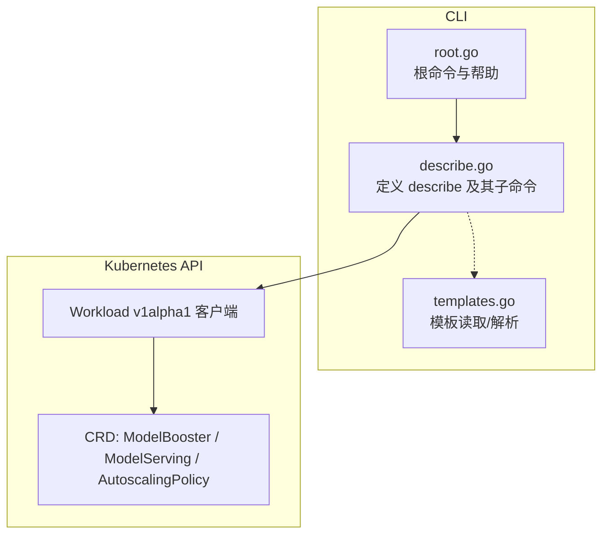
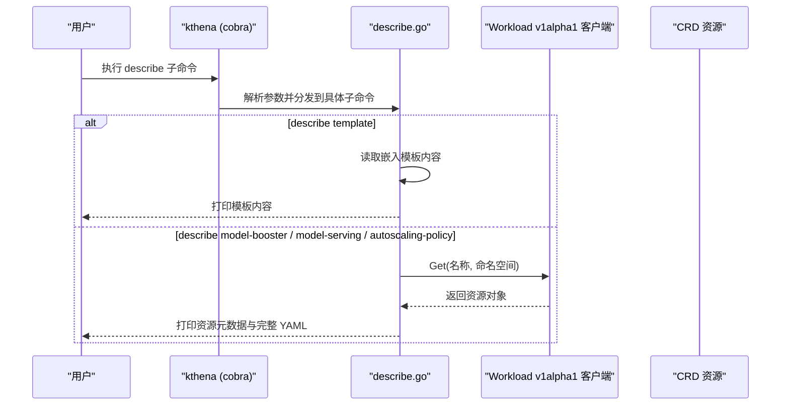
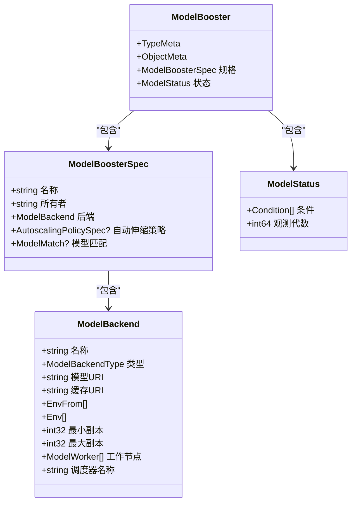
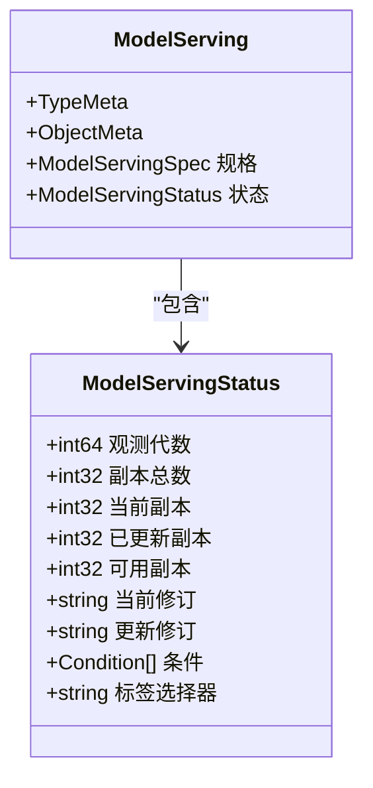
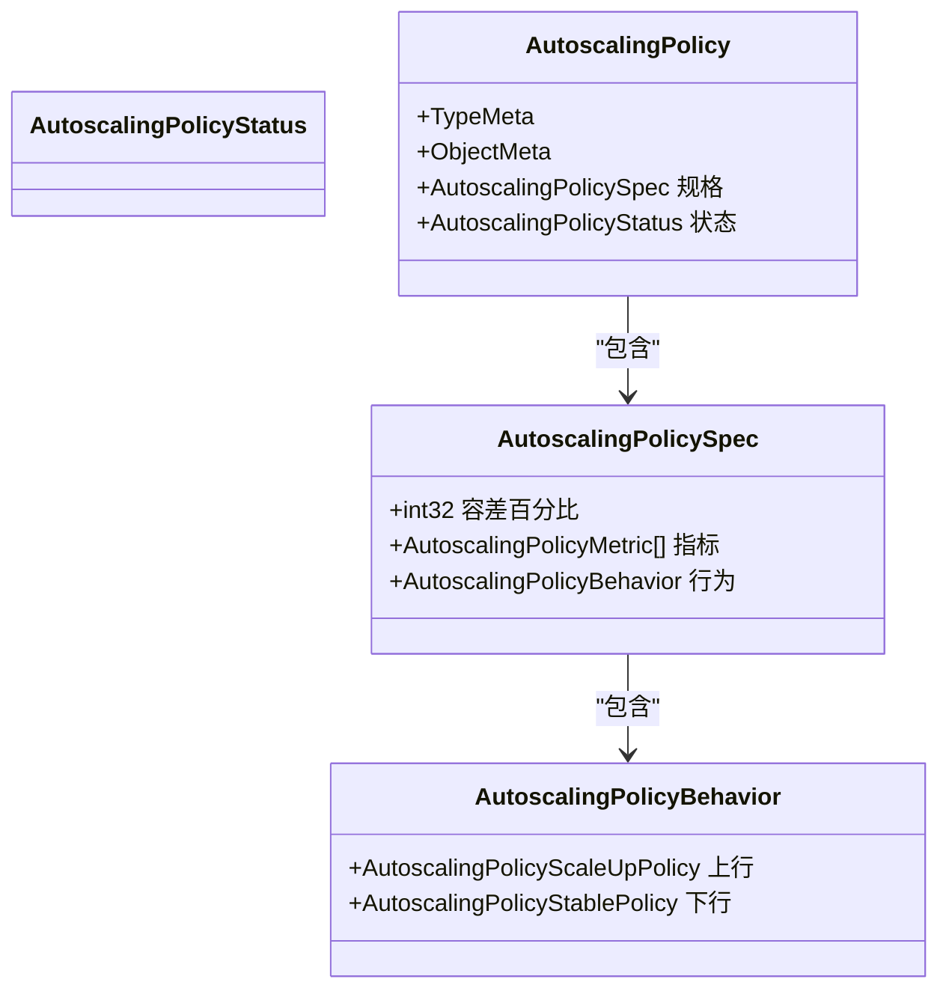
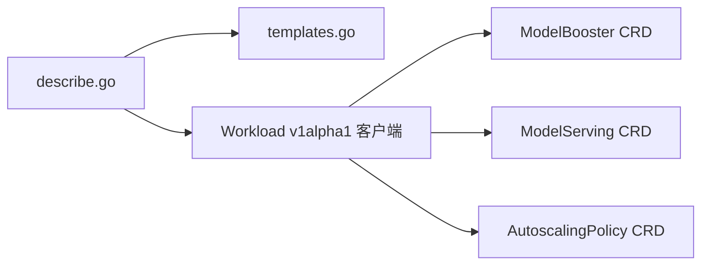

# 描述命令

<cite>
**本文引用的文件**
- [cli/kthena/cmd/describe.go](file://cli/kthena/cmd/describe.go)
- [cli/kthena/cmd/root.go](file://cli/kthena/cmd/root.go)
- [cli/kthena/cmd/templates.go](file://cli/kthena/cmd/templates.go)
- [pkg/apis/workload/v1alpha1/model_booster_types.go](file://pkg/apis/workload/v1alpha1/model_booster_types.go)
- [pkg/apis/workload/v1alpha1/model_serving_types.go](file://pkg/apis/workload/v1alpha1/model_serving_types.go)
- [pkg/apis/workload/v1alpha1/autoscalingpolicy_types.go](file://pkg/apis/workload/v1alpha1/autoscalingpolicy_types.go)
- [examples/kthena-router/ModelRouteSimple.yaml](file://examples/kthena-router/ModelRouteSimple.yaml)
- [examples/kthena-router/ModelServer-ds1.5b.yaml](file://examples/kthena-router/ModelServer-ds1.5b.yaml)
</cite>

## 目录
1. [简介](#简介)
2. [项目结构](#项目结构)
3. [核心组件](#核心组件)
4. [架构总览](#架构总览)
5. [详细组件分析](#详细组件分析)
6. [依赖关系分析](#依赖关系分析)
7. [性能考量](#性能考量)
8. [故障排查指南](#故障排查指南)
9. [结论](#结论)
10. [附录](#附录)

## 简介
本文件面向 Kthena CLI 的 describe 子命令，提供从入门到进阶的完整使用与理解指南。describe 命令用于获取指定资源的详细信息与状态摘要，覆盖模板、模型增强器（ModelBooster）、模型推理编排（ModelServing）以及自动伸缩策略（AutoscalingPolicy）。本文将解释各子命令的行为、输出字段含义、健康状态与错误信息的解读方式、事件与状态变更历史的关联方法，并给出与其他命令的协同使用建议。

## 项目结构
describe 子命令位于 CLI 层，通过 Kubernetes 客户端访问集群中的 Kthena CRD 资源；同时提供对内置模板的“描述”能力。关键位置如下：
- describe 主命令与子命令定义：cli/kthena/cmd/describe.go
- 根命令与帮助信息：cli/kthena/cmd/root.go
- 内置模板读取与解析：cli/kthena/cmd/templates.go
- 资源 CRD 类型定义（供理解输出字段来源）：pkg/apis/workload/v1alpha1/*.go
- 示例资源清单：examples/kthena-router/*.yaml

图表来源
- [cli/kthena/cmd/describe.go:30-100](file://cli/kthena/cmd/describe.go#L30-L100)
- [cli/kthena/cmd/root.go:26-45](file://cli/kthena/cmd/root.go#L26-L45)
- [cli/kthena/cmd/templates.go:34-82](file://cli/kthena/cmd/templates.go#L34-L82)

章节来源
- [cli/kthena/cmd/describe.go:30-100](file://cli/kthena/cmd/describe.go#L30-L100)
- [cli/kthena/cmd/root.go:26-45](file://cli/kthena/cmd/root.go#L26-L45)
- [cli/kthena/cmd/templates.go:34-82](file://cli/kthena/cmd/templates.go#L34-L82)

## 核心组件
describe 子命令由以下核心部分组成：
- describe 主命令：统一入口，支持命名空间参数
- 子命令
  - describe template：显示内置模板的完整内容
  - describe model-booster：显示 ModelBooster 资源的元数据与完整 YAML
  - describe model-serving（别名 ms）：显示 ModelServing 资源的元数据与完整 YAML
  - describe autoscaling-policy（别名 asp）：显示 AutoscalingPolicy 资源的元数据与完整 YAML

运行流程要点：
- template：从嵌入式文件系统读取模板内容并直接打印
- 其他资源：通过 Workload v1alpha1 客户端按命名空间拉取资源，再以 YAML 输出

章节来源
- [cli/kthena/cmd/describe.go:30-100](file://cli/kthena/cmd/describe.go#L30-L100)
- [cli/kthena/cmd/describe.go:102-235](file://cli/kthena/cmd/describe.go#L102-L235)

## 架构总览
describe 命令在 CLI 侧的调用链路如下：

图表来源
- [cli/kthena/cmd/describe.go:91-100](file://cli/kthena/cmd/describe.go#L91-L100)
- [cli/kthena/cmd/describe.go:102-235](file://cli/kthena/cmd/describe.go#L102-L235)

## 详细组件分析

### describe template 子命令
- 功能：显示指定内置模板的完整内容
- 行为：
  - 校验模板是否存在
  - 从嵌入式文件系统读取模板内容
  - 直接打印模板文本
- 使用场景：预览模板内容、确认变量与描述信息

章节来源
- [cli/kthena/cmd/describe.go:102-121](file://cli/kthena/cmd/describe.go#L102-L121)
- [cli/kthena/cmd/templates.go:69-82](file://cli/kthena/cmd/templates.go#L69-L82)

### describe model-booster 子命令
- 功能：显示 ModelBooster 资源的元数据与完整 YAML
- 输出字段（基于资源结构）：
  - 元数据：名称、命名空间、创建时间、年龄
  - 规格（Spec）：名称、所有者、后端配置、自动伸缩策略引用、模型匹配条件
  - 状态（Status）：条件列表、观测代数
- 关键点：
  - 默认命名空间为空时使用 default
  - 通过客户端按名称与命名空间获取资源
  - 使用 YAML 序列化输出完整资源

图表来源
- [pkg/apis/workload/v1alpha1/model_booster_types.go:26-198](file://pkg/apis/workload/v1alpha1/model_booster_types.go#L26-L198)

章节来源
- [cli/kthena/cmd/describe.go:123-159](file://cli/kthena/cmd/describe.go#L123-L159)
- [pkg/apis/workload/v1alpha1/model_booster_types.go:26-198](file://pkg/apis/workload/v1alpha1/model_booster_types.go#L26-L198)

### describe model-serving 子命令
- 功能：显示 ModelServing 资源的元数据与完整 YAML
- 输出字段（基于资源结构）：
  - 元数据：名称、命名空间、创建时间、年龄
  - 规格（Spec）：副本数、滚动更新分区、工作负载模板等
  - 状态（Status）：总副本、当前副本、已更新副本、可用副本、当前修订、更新修订、条件、标签选择器
- 关键点：
  - 默认命名空间为空时使用 default
  - 通过客户端按名称与命名空间获取资源
  - 使用 YAML 序列化输出完整资源

图表来源
- [pkg/apis/workload/v1alpha1/model_serving_types.go:204-238](file://pkg/apis/workload/v1alpha1/model_serving_types.go#L204-L238)

章节来源
- [cli/kthena/cmd/describe.go:161-197](file://cli/kthena/cmd/describe.go#L161-L197)
- [pkg/apis/workload/v1alpha1/model_serving_types.go:204-238](file://pkg/apis/workload/v1alpha1/model_serving_types.go#L204-L238)

### describe autoscaling-policy 子命令
- 功能：显示 AutoscalingPolicy 资源的元数据与完整 YAML
- 输出字段（基于资源结构）：
  - 元数据：名称、命名空间、创建时间、年龄
  - 规格（Spec）：容差百分比、指标列表、行为配置（上下行）
  - 行为配置（Behavior）：稳定/紧急策略、周期、阈值、稳定窗口
- 关键点：
  - 默认命名空间为空时使用 default
  - 通过客户端按名称与命名空间获取资源
  - 使用 YAML 序列化输出完整资源

图表来源
- [pkg/apis/workload/v1alpha1/autoscalingpolicy_types.go:24-143](file://pkg/apis/workload/v1alpha1/autoscalingpolicy_types.go#L24-L143)

章节来源
- [cli/kthena/cmd/describe.go:199-235](file://cli/kthena/cmd/describe.go#L199-L235)
- [pkg/apis/workload/v1alpha1/autoscalingpolicy_types.go:24-143](file://pkg/apis/workload/v1alpha1/autoscalingpolicy_types.go#L24-L143)

### describe 与 get 命令的协同
- describe 适合查看单个资源的完整 YAML 与元数据摘要
- get 适合批量列出资源、快速概览资源数量与年龄
- 建议流程：先用 get 快速定位资源，再用 describe 获取详细信息

章节来源
- [cli/kthena/cmd/root.go:39-44](file://cli/kthena/cmd/root.go#L39-L44)

## 依赖关系分析
- describe 与模板系统的关系
  - describe template 依赖嵌入式文件系统中的模板内容
  - 模板描述信息来源于模板文件顶部注释
- describe 与 Kubernetes API 的关系
  - 通过 Workload v1alpha1 客户端访问 CRD 资源
  - 输出 YAML 与资源类型定义保持一致

图表来源
- [cli/kthena/cmd/describe.go:91-100](file://cli/kthena/cmd/describe.go#L91-L100)
- [cli/kthena/cmd/templates.go:34-82](file://cli/kthena/cmd/templates.go#L34-L82)

章节来源
- [cli/kthena/cmd/describe.go:91-100](file://cli/kthena/cmd/describe.go#L91-L100)
- [cli/kthena/cmd/templates.go:34-82](file://cli/kthena/cmd/templates.go#L34-L82)

## 性能考量
- describe 对单个资源执行一次 API 调用，开销较小
- 输出为完整 YAML，资源较大时会增加输出体积与渲染时间
- 建议仅在需要查看完整配置时使用 describe；批量信息可优先使用 get

## 故障排查指南
- 资源不存在或命名空间不正确
  - 症状：报错提示资源未找到
  - 处理：确认资源名称与命名空间；如未指定命名空间，默认使用 default
- 模板不存在
  - 症状：报错提示模板未找到
  - 处理：使用 get templates 查看可用模板列表，确认模板名称格式（vendor/model）
- YAML 序列化失败
  - 症状：报错提示无法序列化为 YAML
  - 处理：检查本地环境与依赖；必要时重试或导出到文件后查看
- 与 get 命令结合定位问题
  - 使用 get model-servings 或 get autoscaling-policies 列表核对资源是否存在与命名空间是否正确

章节来源
- [cli/kthena/cmd/describe.go:105-108](file://cli/kthena/cmd/describe.go#L105-L108)
- [cli/kthena/cmd/describe.go:137-140](file://cli/kthena/cmd/describe.go#L137-L140)
- [cli/kthena/cmd/describe.go:175-178](file://cli/kthena/cmd/describe.go#L175-L178)
- [cli/kthena/cmd/describe.go:213-216](file://cli/kthena/cmd/describe.go#L213-L216)

## 结论
describe 命令为 Kthena 资源提供了“所见即所得”的完整 YAML 输出与基础元数据摘要，是定位配置问题、核对资源状态的重要工具。结合 get 命令进行批量概览与筛选，可形成高效的资源管理闭环。对于模板，describe template 提供了快速预览与校验的能力。

## 附录

### 支持的资源类型与输出字段说明
- ModelBooster
  - 元数据：名称、命名空间、创建时间、年龄
  - 规格：名称、所有者、后端（类型、模型/缓存 URI、环境变量、最小/最大副本、工作节点、调度器名称）、自动伸缩策略引用、模型匹配条件
  - 状态：条件列表、观测代数
- ModelServing
  - 元数据：名称、命名空间、创建时间、年龄
  - 状态：总副本、当前副本、已更新副本、可用副本、当前修订、更新修订、条件、标签选择器
- AutoscalingPolicy
  - 元数据：名称、命名空间、创建时间、年龄
  - 规格：容差百分比、指标列表（指标名、目标值）、行为（上/下行策略）
  - 行为：稳定策略（实例数、百分比、周期、选择策略、稳定窗口）、紧急策略（百分比、周期、阈值、持续时间）

章节来源
- [pkg/apis/workload/v1alpha1/model_booster_types.go:26-198](file://pkg/apis/workload/v1alpha1/model_booster_types.go#L26-L198)
- [pkg/apis/workload/v1alpha1/model_serving_types.go:204-238](file://pkg/apis/workload/v1alpha1/model_serving_types.go#L204-L238)
- [pkg/apis/workload/v1alpha1/autoscalingpolicy_types.go:24-143](file://pkg/apis/workload/v1alpha1/autoscalingpolicy_types.go#L24-L143)

### 健康状态与错误信息解读
- ModelBooster 状态条件
  - Initialized：初始化完成
  - Active：处于活跃状态
  - Failed：出现错误
- ModelServing 状态条件
  - Available：至少满足最小可用组就绪
  - Progressing：存在正在进行的变更（创建新组或扩缩容）
  - UpdateInProgress：正在执行滚动更新
- 建议：当状态为 Failed 或 Progressing 长时间未结束时，结合控制器日志与事件进一步排查

章节来源
- [pkg/apis/workload/v1alpha1/model_booster_types.go:167-184](file://pkg/apis/workload/v1alpha1/model_booster_types.go#L167-L184)
- [pkg/apis/workload/v1alpha1/model_serving_types.go:184-202](file://pkg/apis/workload/v1alpha1/model_serving_types.go#L184-L202)

### 事件日志与状态变更历史
- describe 输出包含资源完整 YAML，其中包含状态字段与条件列表，可用于追踪状态变化
- 若需查看更细粒度的事件历史，建议结合 kubectl describe 命令或控制器日志进行交叉验证

章节来源
- [cli/kthena/cmd/describe.go:149-156](file://cli/kthena/cmd/describe.go#L149-L156)
- [cli/kthena/cmd/describe.go:187-194](file://cli/kthena/cmd/describe.go#L187-L194)
- [cli/kthena/cmd/describe.go:225-232](file://cli/kthena/cmd/describe.go#L225-L232)

### 与其他命令的配合使用
- 先用 get 列表核对资源与命名空间
- 再用 describe 获取完整 YAML 与状态摘要
- 如需查看模板内容，使用 describe template

章节来源
- [cli/kthena/cmd/root.go:39-44](file://cli/kthena/cmd/root.go#L39-L44)

### 示例资源参考
- ModelRoute 示例：用于理解路由与模型服务器的绑定关系
- ModelServer 示例：用于理解推理引擎、工作负载选择器与端口配置

章节来源
- [examples/kthena-router/ModelRouteSimple.yaml:1-12](file://examples/kthena-router/ModelRouteSimple.yaml#L1-L12)
- [examples/kthena-router/ModelServer-ds1.5b.yaml:1-16](file://examples/kthena-router/ModelServer-ds1.5b.yaml#L1-L16)