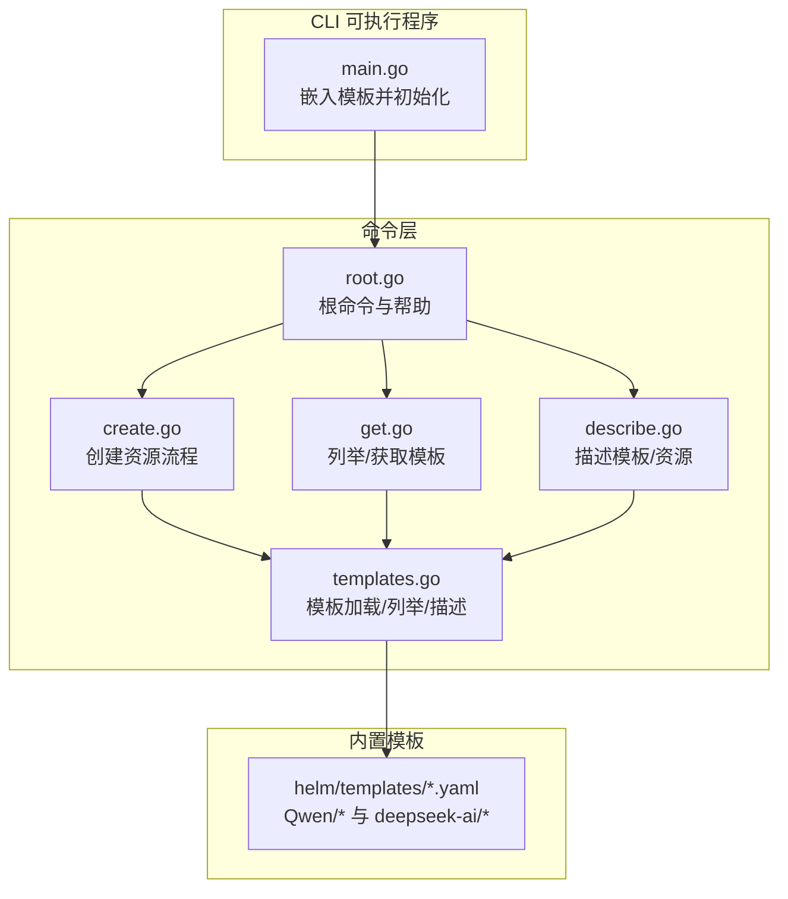
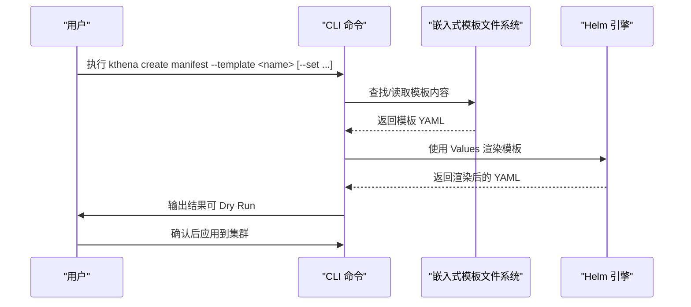
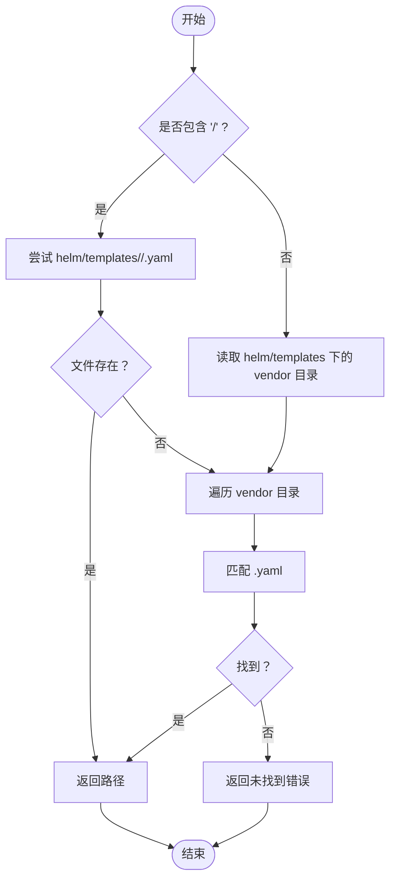
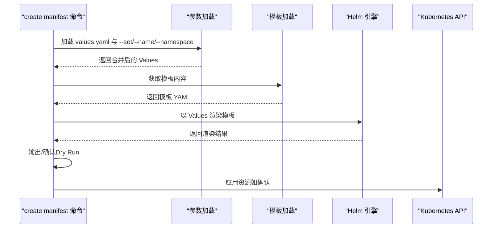
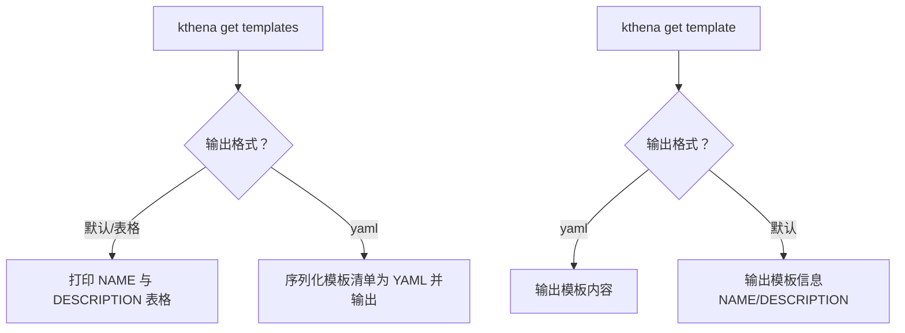
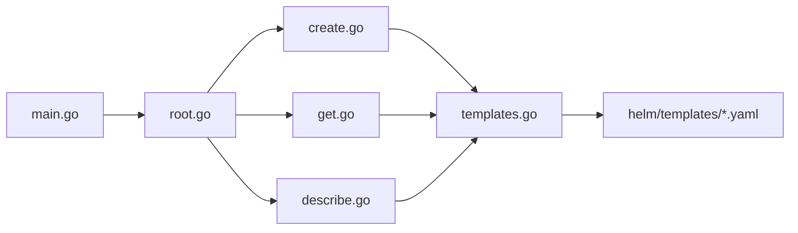

# 模板系统

<cite>
**本文引用的文件**
- [cli/kthena/cmd/templates.go](file://cli/kthena/cmd/templates.go)
- [cli/kthena/cmd/create.go](file://cli/kthena/cmd/create.go)
- [cli/kthena/cmd/get.go](file://cli/kthena/cmd/get.go)
- [cli/kthena/cmd/describe.go](file://cli/kthena/cmd/describe.go)
- [cli/kthena/cmd/root.go](file://cli/kthena/cmd/root.go)
- [cli/kthena/main.go](file://cli/kthena/main.go)
- [cli/kthena/helm/templates/README.md](file://cli/kthena/helm/templates/README.md)
- [cli/kthena/helm/templates/Qwen/Qwen3-32B.yaml](file://cli/kthena/helm/templates/Qwen/Qwen3-32B.yaml)
- [cli/kthena/helm/templates/Qwen/Qwen3-Coder-30B-A3B-Instruct.yaml](file://cli/kthena/helm/templates/Qwen/Qwen3-Coder-30B-A3B-Instruct.yaml)
- [cli/kthena/helm/templates/deepseek-ai/DeepSeek-R1-Distill-Qwen-32B.yaml](file://cli/kthena/helm/templates/deepseek-ai/DeepSeek-R1-Distill-Qwen-32B.yaml)
- [pkg/model-booster-controller/utils/template.go](file://pkg/model-booster-controller/utils/template.go)
- [examples/models/deepseek-v4-flash/modelserving.yaml](file://examples/models/deepseek-v4-flash/modelserving.yaml)
</cite>

## 目录
1. [简介](#简介)
2. [项目结构](#项目结构)
3. [核心组件](#核心组件)
4. [架构总览](#架构总览)
5. [详细组件分析](#详细组件分析)
6. [依赖分析](#依赖分析)
7. [性能考虑](#性能考虑)
8. [故障排查指南](#故障排查指南)
9. [结论](#结论)
10. [附录](#附录)

## 简介
本文件系统性阐述 Kthena CLI 的模板系统：设计理念、工作机制、内置模板分类与用途、嵌入式存储与动态加载、模板参数与变量替换、模板验证与错误处理、最佳实践与常见陷阱，以及与 Helm Charts 的集成关系。模板系统通过 Go 的 embed 文件系统将 Helm 模板内嵌到二进制中，使用 Helm 引擎渲染，最终在终端输出或直接应用到集群。

## 项目结构
模板系统主要位于 Kthena CLI 的 helm/templates 目录，并由 CLI 命令模块负责加载、列举、描述与渲染模板。关键目录与文件如下：
- 内置模板：cli/kthena/helm/templates/Qwen/ 与 cli/kthena/helm/templates/deepseek-ai/
- 模板元数据与加载：cli/kthena/cmd/templates.go
- CLI 命令入口与子命令：cli/kthena/cmd/root.go、cli/kthena/cmd/create.go、cli/kthena/cmd/get.go、cli/kthena/cmd/describe.go
- 可执行程序入口与模板嵌入：cli/kthena/main.go
- 模板设计原则与贡献指南：cli/kthena/helm/templates/README.md
- 示例模板文件：Qwen3-32B.yaml、Qwen3-Coder-30B-A3B-Instruct.yaml、DeepSeek-R1-Distill-Qwen-32B.yaml
- 额外占位符替换工具（非 CLI 模板引擎）：pkg/model-booster-controller/utils/template.go
- 示例工作负载清单（用于对比理解）：examples/models/deepseek-v4-flash/modelserving.yaml

图表来源
- [cli/kthena/main.go:28-34](file://cli/kthena/main.go#L28-L34)
- [cli/kthena/cmd/root.go:26-59](file://cli/kthena/cmd/root.go#L26-L59)
- [cli/kthena/cmd/create.go:49-93](file://cli/kthena/cmd/create.go#L49-L93)
- [cli/kthena/cmd/get.go:57-133](file://cli/kthena/cmd/get.go#L57-L133)
- [cli/kthena/cmd/describe.go:29-100](file://cli/kthena/cmd/describe.go#L29-L100)
- [cli/kthena/cmd/templates.go:34-118](file://cli/kthena/cmd/templates.go#L34-L118)

章节来源
- [cli/kthena/main.go:28-34](file://cli/kthena/main.go#L28-L34)
- [cli/kthena/cmd/root.go:26-59](file://cli/kthena/cmd/root.go#L26-L59)
- [cli/kthena/cmd/create.go:49-93](file://cli/kthena/cmd/create.go#L49-L93)
- [cli/kthena/cmd/get.go:57-133](file://cli/kthena/cmd/get.go#L57-L133)
- [cli/kthena/cmd/describe.go:29-100](file://cli/kthena/cmd/describe.go#L29-L100)
- [cli/kthena/cmd/templates.go:34-118](file://cli/kthena/cmd/templates.go#L34-L118)

## 核心组件
- 模板嵌入与加载
  - 使用 Go embed 将 helm/templates/**/*.yaml 内嵌至二进制，启动时初始化模板文件系统。
  - 提供查找、读取、列举、存在性检查与信息提取能力。
- 模板渲染
  - 通过 Helm 引擎对模板进行渲染，值通过 Values 键传递，支持命令行 --set、--values-file 与 --name 覆盖。
- 模板管理命令
  - 列举模板、获取模板内容、描述模板、创建资源（渲染后可 Dry Run 或直接应用）。
- 模板描述解析
  - 从模板顶部注释提取描述信息，便于列表展示与用户理解。

章节来源
- [cli/kthena/main.go:28-34](file://cli/kthena/main.go#L28-L34)
- [cli/kthena/cmd/templates.go:34-154](file://cli/kthena/cmd/templates.go#L34-L154)
- [cli/kthena/cmd/create.go:95-212](file://cli/kthena/cmd/create.go#L95-L212)
- [cli/kthena/cmd/get.go:135-218](file://cli/kthena/cmd/get.go#L135-L218)
- [cli/kthena/cmd/describe.go:102-121](file://cli/kthena/cmd/describe.go#L102-L121)

## 架构总览
模板系统采用“嵌入式模板 + Helm 渲染 + CLI 命令”的分层架构。CLI 启动时将模板内嵌，运行时通过命令调用模板加载与渲染逻辑，最终输出 YAML 或直接应用到集群。

图表来源
- [cli/kthena/cmd/create.go:95-212](file://cli/kthena/cmd/create.go#L95-L212)
- [cli/kthena/cmd/templates.go:70-82](file://cli/kthena/cmd/templates.go#L70-L82)

## 详细组件分析

### 组件一：模板嵌入与动态加载
- 设计要点
  - 使用 embed.FS 将所有 *.yaml 模板打包进二进制，避免外部文件依赖。
  - 提供 findTemplatePath 支持 vendor/model 与回退扫描两种路径解析策略。
  - 提供 ListTemplates、TemplateExists、GetTemplateContent、GetTemplateInfo 等统一接口。
- 关键行为
  - 按 vendor/model 格式返回模板全名；自动从模板头部注释提取描述。
- 复杂度与性能
  - 列举模板时遍历嵌入目录树，时间复杂度与模板数量线性相关；空间开销为已嵌入的模板大小。

图表来源
- [cli/kthena/cmd/templates.go:39-67](file://cli/kthena/cmd/templates.go#L39-L67)

章节来源
- [cli/kthena/cmd/templates.go:26-154](file://cli/kthena/cmd/templates.go#L26-L154)

### 组件二：模板渲染与参数注入
- 参数来源与优先级
  - values.yaml 文件（--values-file）
  - 命令行 --set key=value（可多次指定或逗号分隔）
  - --name 覆盖 name 字段
  - 默认命名空间（--namespace）
- 渲染过程
  - 使用 Helm 引擎，将用户值包装在 Values 下，渲染单个模板文件。
  - 输出渲染后的 YAML，支持 Dry Run 不提交。
- 错误处理
  - 模板不存在、读取失败、渲染失败、YAML 解析失败等均返回明确错误。

图表来源
- [cli/kthena/cmd/create.go:95-212](file://cli/kthena/cmd/create.go#L95-L212)

章节来源
- [cli/kthena/cmd/create.go:95-212](file://cli/kthena/cmd/create.go#L95-L212)

### 组件三：模板管理命令
- 列举模板
  - 支持 -o yaml 输出模板清单，包含名称与描述。
- 获取模板
  - 支持 -o yaml 输出模板内容，或表格形式输出简要信息。
- 描述模板
  - 展示模板内容与描述，便于快速理解模板用途与变量。
- 资源查询
  - 提供对集群中 ModelBooster、ModelServing、AutoscalingPolicy 等资源的查询与展示。

图表来源
- [cli/kthena/cmd/get.go:135-218](file://cli/kthena/cmd/get.go#L135-L218)

章节来源
- [cli/kthena/cmd/get.go:57-133](file://cli/kthena/cmd/get.go#L57-L133)
- [cli/kthena/cmd/get.go:135-218](file://cli/kthena/cmd/get.go#L135-L218)
- [cli/kthena/cmd/describe.go:102-121](file://cli/kthena/cmd/describe.go#L102-L121)

### 组件四：内置模板分类与用途
- 分类
  - Qwen 系列：覆盖多型号（如 Qwen3-32B、Qwen3-8B、Qwen3-Coder-30B-A3B-Instruct 等），适配 vLLM 后端。
  - DeepSeek 系列：覆盖 DeepSeek-R1-Distill-Qwen-32B、DeepSeek-R1-Distill-Qwen-7B 等，适配 vLLM 后端。
- 用途
  - 快速生成 ModelBooster 等 Kthena 工作负载资源，降低入门门槛。
  - 通过 Values 变量实现最小定制，满足不同 GPU 数量、副本数、模型 URI 等需求。
- 设计原则
  - 遵循“常用、快速启动、简单、经过验证、业界领先”的原则，模板保持简洁与可维护。

章节来源
- [cli/kthena/helm/templates/README.md:1-40](file://cli/kthena/helm/templates/README.md#L1-L40)
- [cli/kthena/helm/templates/Qwen/Qwen3-32B.yaml:1-35](file://cli/kthena/helm/templates/Qwen/Qwen3-32B.yaml#L1-L35)
- [cli/kthena/helm/templates/Qwen/Qwen3-Coder-30B-A3B-Instruct.yaml:1-35](file://cli/kthena/helm/templates/Qwen/Qwen3-Coder-30B-A3B-Instruct.yaml#L1-L35)
- [cli/kthena/helm/templates/deepseek-ai/DeepSeek-R1-Distill-Qwen-32B.yaml:1-35](file://cli/kthena/helm/templates/deepseek-ai/DeepSeek-R1-Distill-Qwen-32B.yaml#L1-L35)

### 组件五：模板参数与变量替换机制
- Helm 变量语法
  - 模板中使用 Go 模板语法（如 {{.Values.xxx}}）进行变量替换。
  - 支持默认值与字符串引号包裹，确保渲染结果符合 YAML 语义。
- 参数注入方式
  - --values-file 指定 YAML 文件
  - --set key=value 支持多次传入或逗号分隔
  - --name 覆盖 name 字段
  - --namespace 设置默认命名空间
- 占位符替换（控制器侧工具）
  - 控制器内部还提供 ${key} 与嵌套占位符替换工具，用于非 Helm 场景的字符串替换（与 CLI 模板系统互补）。

章节来源
- [cli/kthena/cmd/create.go:129-160](file://cli/kthena/cmd/create.go#L129-L160)
- [cli/kthena/helm/templates/Qwen/Qwen3-32B.yaml:6-35](file://cli/kthena/helm/templates/Qwen/Qwen3-32B.yaml#L6-L35)
- [pkg/model-booster-controller/utils/template.go:38-83](file://pkg/model-booster-controller/utils/template.go#L38-L83)

### 组件六：模板验证与错误处理
- 模板存在性校验
  - TemplateExists 在渲染前检查模板是否存在，避免无效模板名。
- 渲染错误处理
  - 模板读取失败、Helm 渲染失败、YAML 解析失败均返回明确错误信息。
- 应用阶段错误
  - 对象转换失败、资源创建失败会给出具体错误与资源定位信息。

章节来源
- [cli/kthena/cmd/templates.go:114-118](file://cli/kthena/cmd/templates.go#L114-L118)
- [cli/kthena/cmd/create.go:162-212](file://cli/kthena/cmd/create.go#L162-L212)
- [cli/kthena/cmd/create.go:226-346](file://cli/kthena/cmd/create.go#L226-L346)

### 组件七：模板定制与扩展方法
- 新增模板类型
  - 在 helm/templates/<vendor>/ 下新增 <ModelName>.yaml，遵循 Go 模板语法与 Values 访问约定。
  - 在文件顶部添加清晰描述注释，便于列表展示。
- 贡献规范
  - 参考 README 中的设计原则与贡献要求，确保最小化、可测试与 SOTA 最佳实践。
- 与 Helm Charts 的关系
  - CLI 模板即 Helm 模板，渲染时将模板包装为一个临时 Chart 并交由 Helm 引擎渲染，最终得到标准 YAML。

章节来源
- [cli/kthena/helm/templates/README.md:31-40](file://cli/kthena/helm/templates/README.md#L31-L40)
- [cli/kthena/cmd/create.go:174-212](file://cli/kthena/cmd/create.go#L174-L212)

## 依赖分析
- 模块耦合
  - main.go 仅负责初始化模板文件系统并启动 CLI。
  - 命令层（create/get/describe）依赖 templates.go 提供的模板加载与渲染接口。
  - 模板本身为纯 YAML + Helm 语法，不依赖业务代码。
- 外部依赖
  - Helm 引擎用于渲染模板。
  - Kubernetes 客户端库用于将渲染结果应用到集群。
- 循环依赖
  - 未发现循环依赖；模板系统为单向数据流：命令 -> 模板 -> 渲染 -> 输出/应用。

图表来源
- [cli/kthena/main.go:28-34](file://cli/kthena/main.go#L28-L34)
- [cli/kthena/cmd/root.go:26-59](file://cli/kthena/cmd/root.go#L26-L59)
- [cli/kthena/cmd/create.go:49-93](file://cli/kthena/cmd/create.go#L49-L93)
- [cli/kthena/cmd/get.go:57-133](file://cli/kthena/cmd/get.go#L57-L133)
- [cli/kthena/cmd/describe.go:29-100](file://cli/kthena/cmd/describe.go#L29-L100)
- [cli/kthena/cmd/templates.go:34-118](file://cli/kthena/cmd/templates.go#L34-L118)

章节来源
- [cli/kthena/main.go:28-34](file://cli/kthena/main.go#L28-L34)
- [cli/kthena/cmd/root.go:26-59](file://cli/kthena/cmd/root.go#L26-L59)
- [cli/kthena/cmd/create.go:49-93](file://cli/kthena/cmd/create.go#L49-L93)
- [cli/kthena/cmd/get.go:57-133](file://cli/kthena/cmd/get.go#L57-L133)
- [cli/kthena/cmd/describe.go:29-100](file://cli/kthena/cmd/describe.go#L29-L100)
- [cli/kthena/cmd/templates.go:34-118](file://cli/kthena/cmd/templates.go#L34-L118)

## 性能考虑
- 模板内嵌减少 IO 与外部依赖，启动即可用。
- 列举模板时对嵌入目录树进行一次遍历，模板数量增长时注意渲染与输出开销。
- 建议在 CI/CD 中预热模板渲染，避免首次渲染延迟。
- 大型模板建议拆分为更小的组合资源，降低单次渲染复杂度。

## 故障排查指南
- 模板未找到
  - 确认模板名称格式为 vendor/model，且文件存在于 helm/templates/<vendor>/<model>.yaml。
  - 使用 kthena get templates 检查模板清单。
- 渲染失败
  - 检查 values.yaml 语法与字段类型；确认 --set 的 key 与模板中的 .Values.key 匹配。
  - 使用 --dry-run 先查看渲染结果，定位问题后再应用。
- 应用失败
  - 查看资源对象转换与创建错误，确认 CRD 版本与集群兼容。
  - 检查命名空间与 RBAC 权限。
- 描述信息缺失
  - 模板顶部需包含清晰的描述注释，否则将显示“无描述”。

章节来源
- [cli/kthena/cmd/templates.go:114-154](file://cli/kthena/cmd/templates.go#L114-L154)
- [cli/kthena/cmd/create.go:162-212](file://cli/kthena/cmd/create.go#L162-L212)
- [cli/kthena/cmd/get.go:135-218](file://cli/kthena/cmd/get.go#L135-L218)

## 结论
Kthena CLI 的模板系统以“嵌入式 + Helm 渲染 + 命令行工具”为核心，提供了简洁、可维护、可扩展的模板化部署方案。通过标准化的模板目录结构、清晰的变量注入与错误处理机制，用户可以快速生成并应用 Kthena 工作负载资源。建议在团队内遵循贡献规范与最佳实践，持续完善模板库并结合 Helm Charts 的理念进行演进。

## 附录
- 模板设计原则与贡献指南参见：[cli/kthena/helm/templates/README.md:1-40](file://cli/kthena/helm/templates/README.md#L1-L40)
- 示例模板文件：
  - [Qwen3-32B.yaml:1-35](file://cli/kthena/helm/templates/Qwen/Qwen3-32B.yaml#L1-L35)
  - [Qwen3-Coder-30B-A3B-Instruct.yaml:1-35](file://cli/kthena/helm/templates/Qwen/Qwen3-Coder-30B-A3B-Instruct.yaml#L1-L35)
  - [DeepSeek-R1-Distill-Qwen-32B.yaml:1-35](file://cli/kthena/helm/templates/deepseek-ai/DeepSeek-R1-Distill-Qwen-32B.yaml#L1-L35)
- 控制器侧占位符替换工具（非 CLI 模板引擎）：
  - [pkg/model-booster-controller/utils/template.go:38-83](file://pkg/model-booster-controller/utils/template.go#L38-L83)
- 示例工作负载清单（用于对比理解）：
  - [examples/models/deepseek-v4-flash/modelserving.yaml:1-352](file://examples/models/deepseek-v4-flash/modelserving.yaml#L1-L352)