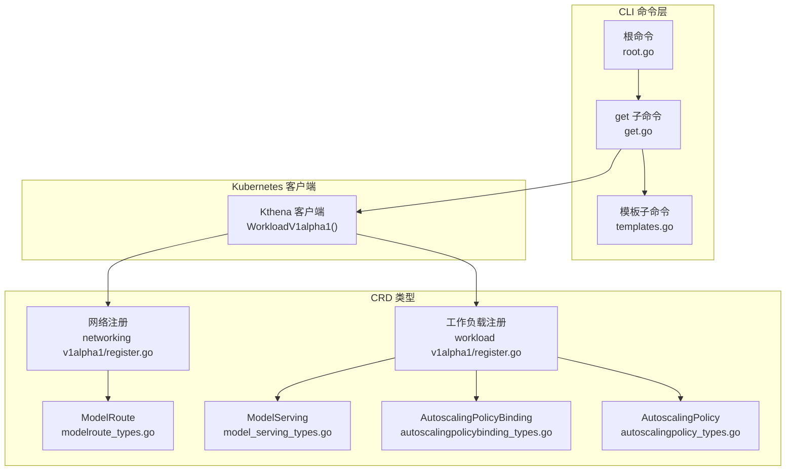
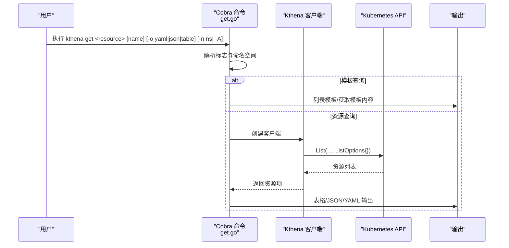
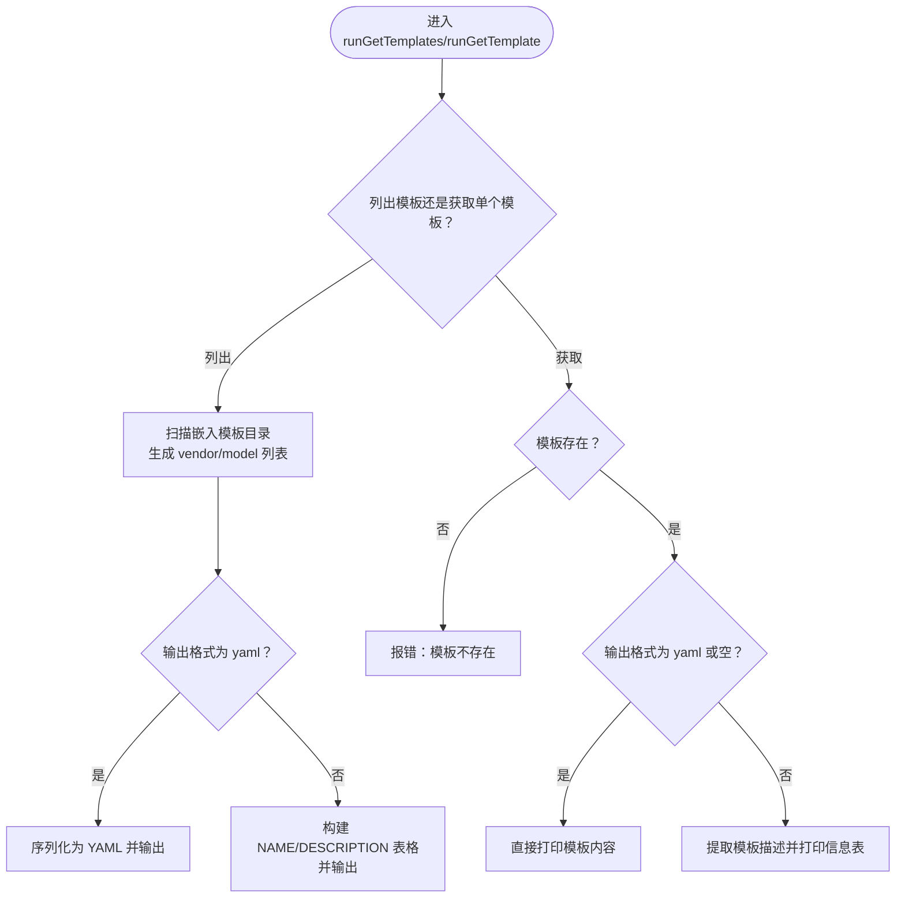
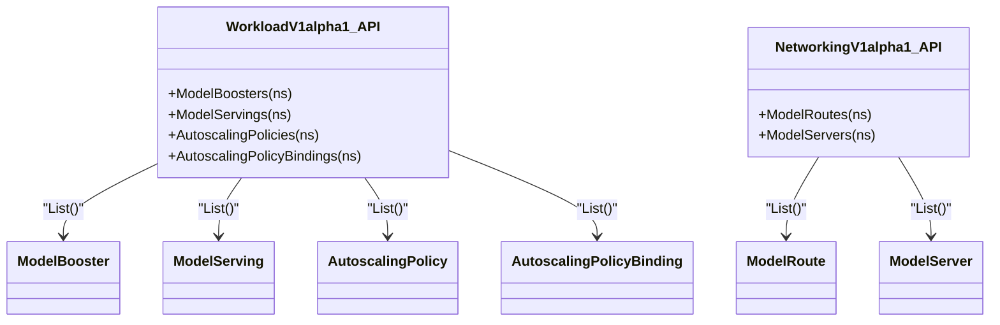
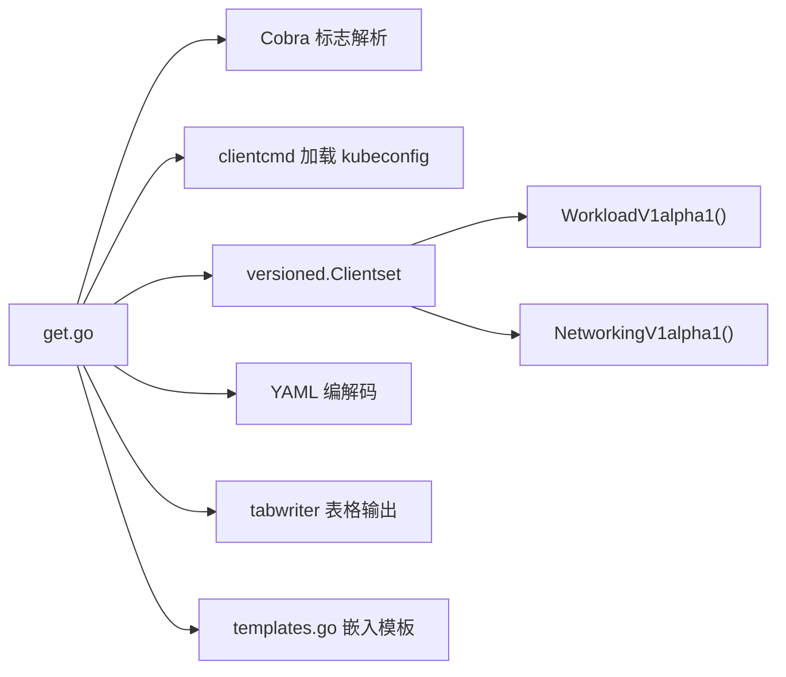

# 获取命令

<cite>
**本文引用的文件**
- [cli/kthena/cmd/get.go](file://cli/kthena/cmd/get.go)
- [cli/kthena/cmd/root.go](file://cli/kthena/cmd/root.go)
- [cli/kthena/cmd/templates.go](file://cli/kthena/cmd/templates.go)
- [pkg/apis/workload/v1alpha1/register.go](file://pkg/apis/workload/v1alpha1/register.go)
- [pkg/apis/networking/v1alpha1/register.go](file://pkg/apis/networking/v1alpha1/register.go)
- [pkg/apis/workload/v1alpha1/autoscalingpolicy_types.go](file://pkg/apis/workload/v1alpha1/autoscalingpolicy_types.go)
- [pkg/apis/workload/v1alpha1/autoscalingpolicybinding_types.go](file://pkg/apis/workload/v1alpha1/autoscalingpolicybinding_types.go)
- [pkg/apis/networking/v1alpha1/modelroute_types.go](file://pkg/apis/networking/v1alpha1/modelroute_types.go)
- [pkg/apis/workload/v1alpha1/model_serving_types.go](file://pkg/apis/workload/v1alpha1/model_serving_types.go)
- [examples/kthena-router/ModelRouteSimple.yaml](file://examples/kthena-router/ModelRouteSimple.yaml)
- [examples/kthena-router/ModelServer-ds1.5b.yaml](file://examples/kthena-router/ModelServer-ds1.5b.yaml)
</cite>

## 目录
1. [简介](#简介)
2. [项目结构](#项目结构)
3. [核心组件](#核心组件)
4. [架构总览](#架构总览)
5. [详细组件分析](#详细组件分析)
6. [依赖关系分析](#依赖关系分析)
7. [性能考虑](#性能考虑)
8. [故障排查指南](#故障排查指南)
9. [结论](#结论)
10. [附录](#附录)

## 简介
本章节面向 Kthena CLI 的 get 子命令，系统性地说明其功能与使用方式，涵盖以下主题：
- 支持的资源类型查询：模板、模型（ModelBooster）、模型服务（ModelServing）、自动伸缩策略（AutoscalingPolicy）及其绑定（AutoscalingPolicyBinding）等。
- 查询语法、过滤条件与输出格式选项（YAML、JSON、表格）。
- 如何按命名空间或跨命名空间查询，以及如何通过名称过滤。
- 批量查询与导出数据的实践方法。
- 查询性能优化建议与大数据集处理技巧。

## 项目结构
get 子命令位于 CLI 模块中，围绕 Kubernetes 客户端与 CRD 资源进行交互，并通过 Cobra 命令框架组织子命令与参数。关键文件如下：
- get 子命令与各资源查询逻辑：cli/kthena/cmd/get.go
- 根命令与帮助信息：cli/kthena/cmd/root.go
- 模板清单与内容读取：cli/kthena/cmd/templates.go
- CRD 类型注册与资源种类：pkg/apis/workload/v1alpha1/register.go、pkg/apis/networking/v1alpha1/register.go
- 典型 CRD 结构参考：autoscalingpolicy_types.go、autoscalingpolicybinding_types.go、modelroute_types.go、model_serving_types.go
- 示例资源：examples/kthena-router 下的 ModelRoute 与 ModelServer 示例

**图表来源**
- [cli/kthena/cmd/get.go:118-133](file://cli/kthena/cmd/get.go#L118-L133)
- [cli/kthena/cmd/root.go:26-45](file://cli/kthena/cmd/root.go#L26-L45)
- [cli/kthena/cmd/templates.go:35-37](file://cli/kthena/cmd/templates.go#L35-L37)
- [pkg/apis/workload/v1alpha1/register.go:67-81](file://pkg/apis/workload/v1alpha1/register.go#L67-L81)
- [pkg/apis/networking/v1alpha1/register.go:62-71](file://pkg/apis/networking/v1alpha1/register.go#L62-L71)

**章节来源**
- [cli/kthena/cmd/get.go:41-55](file://cli/kthena/cmd/get.go#L41-L55)
- [cli/kthena/cmd/root.go:26-45](file://cli/kthena/cmd/root.go#L26-L45)

## 核心组件
- get 主命令与子命令注册：在 init 中向 rootCmd 注册 get 及其子命令（templates、template、model-boosters、model-servings、autoscaling-policies、autoscaling-policy-bindings），并设置通用标志（输出格式、命名空间、是否全命名空间）。
- 输出格式控制：支持 yaml、json、table 三种输出；默认表格输出。
- 命名空间解析：优先级为“全命名空间”>“显式命名空间”>“默认命名空间”。
- 资源查询函数：分别针对 ModelBooster、ModelServing、AutoscalingPolicy、AutoscalingPolicyBinding 进行列表查询与结果打印。
- 模板查询：列出可用模板、按名称获取模板内容或信息。

**章节来源**
- [cli/kthena/cmd/get.go:118-133](file://cli/kthena/cmd/get.go#L118-L133)
- [cli/kthena/cmd/get.go:234-242](file://cli/kthena/cmd/get.go#L234-L242)
- [cli/kthena/cmd/get.go:244-306](file://cli/kthena/cmd/get.go#L244-L306)
- [cli/kthena/cmd/get.go:308-350](file://cli/kthena/cmd/get.go#L308-L350)
- [cli/kthena/cmd/get.go:352-394](file://cli/kthena/cmd/get.go#L352-L394)
- [cli/kthena/cmd/get.go:396-438](file://cli/kthena/cmd/get.go#L396-L438)
- [cli/kthena/cmd/templates.go:84-112](file://cli/kthena/cmd/templates.go#L84-L112)

## 架构总览
get 子命令的执行流程如下：
- 解析全局标志（输出格式、命名空间、全命名空间）。
- 根据子命令选择对应资源查询函数。
- 通过 Kthena 客户端访问 Workload 或 Networking API 组，拉取资源列表。
- 对于表格输出，使用 tabwriter 格式化列头与行数据；对于 YAML/JSON 输出，使用 YAML 序列或 JSON 结构化输出。
- 对模板子命令，从嵌入的模板文件系统读取模板内容或元信息。

**图表来源**
- [cli/kthena/cmd/get.go:118-133](file://cli/kthena/cmd/get.go#L118-L133)
- [cli/kthena/cmd/get.go:220-232](file://cli/kthena/cmd/get.go#L220-L232)
- [cli/kthena/cmd/get.go:308-350](file://cli/kthena/cmd/get.go#L308-L350)

## 详细组件分析

### get 主命令与标志
- 子命令注册：templates、template、model-boosters、model-servings、autoscaling-policies、autoscaling-policy-bindings。
- 通用标志：
  - -o/--output：输出格式（yaml|json|table）
  - -n/--namespace：指定命名空间（默认当前上下文命名空间）
  - -A/--all-namespaces：跨所有命名空间查询
- 默认行为：未指定命名空间时，默认使用“default”。

**章节来源**
- [cli/kthena/cmd/get.go:118-133](file://cli/kthena/cmd/get.go#L118-L133)
- [cli/kthena/cmd/get.go:234-242](file://cli/kthena/cmd/get.go#L234-L242)

### 模板查询（templates/template）
- 列出模板：扫描嵌入的模板目录，返回 vendor/model 格式的模板名称列表；可选 -o yaml 输出为 YAML 序列。
- 获取模板：按名称读取模板内容；若 -o yaml 或未指定输出，则直接打印模板内容；否则打印模板信息（名称、描述）。
- 模板描述提取：从模板内容顶部注释中提取描述信息。

**图表来源**
- [cli/kthena/cmd/get.go:135-190](file://cli/kthena/cmd/get.go#L135-L190)
- [cli/kthena/cmd/get.go:192-218](file://cli/kthena/cmd/get.go#L192-L218)
- [cli/kthena/cmd/templates.go:84-112](file://cli/kthena/cmd/templates.go#L84-L112)
- [cli/kthena/cmd/templates.go:120-133](file://cli/kthena/cmd/templates.go#L120-L133)

**章节来源**
- [cli/kthena/cmd/get.go:135-190](file://cli/kthena/cmd/get.go#L135-L190)
- [cli/kthena/cmd/get.go:192-218](file://cli/kthena/cmd/get.go#L192-L218)
- [cli/kthena/cmd/templates.go:84-112](file://cli/kthena/cmd/templates.go#L84-L112)
- [cli/kthena/cmd/templates.go:120-133](file://cli/kthena/cmd/templates.go#L120-L133)

### 模型（ModelBooster）查询
- 查询范围：根据命名空间解析结果决定作用域（单命名空间或全命名空间）。
- 过滤条件：支持按名称关键字过滤（不区分大小写）。
- 输出字段：名称、年龄；若跨命名空间则额外显示命名空间列。
- 计算年龄：基于 CreationTimestamp 截断到秒级。

**章节来源**
- [cli/kthena/cmd/get.go:244-306](file://cli/kthena/cmd/get.go#L244-L306)

### 模型服务（ModelServing）查询
- 查询范围：同上。
- 输出字段：名称、年龄；跨命名空间时包含命名空间列。
- 计算年龄：同上。

**章节来源**
- [cli/kthena/cmd/get.go:308-350](file://cli/kthena/cmd/get.go#L308-L350)

### 自动伸缩策略（AutoscalingPolicy）查询
- 查询范围：同上。
- 输出字段：名称、年龄；跨命名空间时包含命名空间列。
- 计算年龄：同上。

**章节来源**
- [cli/kthena/cmd/get.go:352-394](file://cli/kthena/cmd/get.go#L352-L394)

### 自动伸缩策略绑定（AutoscalingPolicyBinding）查询
- 查询范围：同上。
- 输出字段：名称、年龄；跨命名空间时包含命名空间列。
- 计算年龄：同上。

**章节来源**
- [cli/kthena/cmd/get.go:396-438](file://cli/kthena/cmd/get.go#L396-L438)

### CRD 类型与资源种类
- 工作负载组（WorkloadV1alpha1）：ModelBooster、ModelServing、AutoscalingPolicy、AutoscalingPolicyBinding。
- 网络组（NetworkingV1alpha1）：ModelRoute、ModelServer。
- 以上类型在注册文件中声明，get 子命令通过 WorkloadV1alpha1() 接口访问相应资源。

**图表来源**
- [pkg/apis/workload/v1alpha1/register.go:67-81](file://pkg/apis/workload/v1alpha1/register.go#L67-L81)
- [pkg/apis/networking/v1alpha1/register.go:62-71](file://pkg/apis/networking/v1alpha1/register.go#L62-L71)

**章节来源**
- [pkg/apis/workload/v1alpha1/register.go:67-81](file://pkg/apis/workload/v1alpha1/register.go#L67-L81)
- [pkg/apis/networking/v1alpha1/register.go:62-71](file://pkg/apis/networking/v1alpha1/register.go#L62-L71)

## 依赖关系分析
- get 子命令依赖：
  - Cobra 命令框架（flags、子命令注册）
  - Kthena 客户端（versioned.Clientset）用于访问 WorkloadV1alpha1 与 NetworkingV1alpha1 API
  - YAML 编解码库（sigs.k8s.io/yaml）用于 YAML 输出
  - Kubernetes 客户端配置（clientcmd）加载 kubeconfig
  - tabwriter 用于表格输出
- 模板子命令依赖：
  - 嵌入式文件系统（embed.FS）存放模板
  - 模板描述提取逻辑（从注释中解析）

**图表来源**
- [cli/kthena/cmd/get.go:19-32](file://cli/kthena/cmd/get.go#L19-L32)
- [cli/kthena/cmd/get.go:220-232](file://cli/kthena/cmd/get.go#L220-L232)
- [cli/kthena/cmd/templates.go:26-37](file://cli/kthena/cmd/templates.go#L26-L37)

**章节来源**
- [cli/kthena/cmd/get.go:19-32](file://cli/kthena/cmd/get.go#L19-L32)
- [cli/kthena/cmd/get.go:220-232](file://cli/kthena/cmd/get.go#L220-L232)
- [cli/kthena/cmd/templates.go:26-37](file://cli/kthena/cmd/templates.go#L26-L37)

## 性能考虑
- 列表查询与过滤：
  - 当前实现对资源列表进行内存过滤（名称关键字包含匹配），适合中小规模集群。
  - 大数据集场景建议结合命名空间限制与名称过滤以减少传输与渲染开销。
- 年龄计算：
  - 使用 CreationTimestamp 计算年龄并在本地截断到秒级，避免频繁格式化开销。
- 输出格式：
  - YAML/JSON 输出会进行序列化，建议仅在需要结构化数据时使用 -o yaml/json。
  - 表格输出（默认）更利于快速浏览与终端交互。
- 命名空间策略：
  - 优先使用 -n 指定命名空间，避免 -A 导致的全集群扫描。
- 模板读取：
  - 模板内容直接从嵌入文件系统读取，无需磁盘 IO；建议缓存已读取的模板内容以减少重复解析。

[本节为通用性能建议，不直接分析具体文件，故无“章节来源”]

## 故障排查指南
- 无法加载 kubeconfig：
  - 现象：提示“failed to load kubeconfig”
  - 排查：确认 ~/.kube/config 文件存在且可读；检查当前上下文是否正确。
- 无法创建 Kthena 客户端：
  - 现象：提示“failed to create kthena client”
  - 排查：确认集群可达、RBAC 权限正常；检查 API 组与版本是否正确。
- 资源为空：
  - 现象：输出“未找到资源”
  - 排查：确认命名空间是否正确；尝试 -A 查看全命名空间；检查资源是否存在。
- 模板不存在：
  - 现象：提示“template 'xxx' not found”
  - 排查：确认模板名称为 vendor/model 格式；检查嵌入模板目录结构。
- 输出格式异常：
  - 现象：YAML/JSON 输出失败
  - 排查：确认 -o 参数值为 yaml|json|table；检查 YAML 内容是否合法。

**章节来源**
- [cli/kthena/cmd/get.go:220-232](file://cli/kthena/cmd/get.go#L220-L232)
- [cli/kthena/cmd/get.go:253-256](file://cli/kthena/cmd/get.go#L253-L256)
- [cli/kthena/cmd/get.go:195-197](file://cli/kthena/cmd/get.go#L195-L197)

## 结论
get 子命令提供了对 Kthena 关键资源的统一查询入口，支持模板与多种 CRD 资源的列表与过滤展示，并提供多种输出格式。通过合理使用命名空间与名称过滤，可在保证可读性的前提下高效完成资源状态巡检与批量导出任务。对于大规模集群，建议优先限定命名空间与使用表格输出以提升性能。

[本节为总结性内容，不直接分析具体文件，故无“章节来源”]

## 附录

### 查询语法与示例
- 列出模板
  - kthena get templates
  - kthena get templates -o yaml
- 获取模板
  - kthena get template vendor/model
  - kthena get template vendor/model -o yaml
- 列出模型（ModelBooster）
  - kthena get model-boosters
  - kthena get model-boosters -n production
  - kthena get model-boosters --all-namespaces
  - kthena get model-boosters qwen
- 列出模型服务（ModelServing）
  - kthena get model-servings
  - kthena get model-servings -n production
  - kthena get model-servings --all-namespaces
- 列出自动伸缩策略（AutoscalingPolicy）
  - kthena get autoscaling-policies
  - kthena get autoscaling-policies -n production
  - kthena get autoscaling-policies --all-namespaces
- 列出自动伸缩策略绑定（AutoscalingPolicyBinding）
  - kthena get autoscaling-policy-bindings
  - kthena get autoscaling-policy-bindings -n production
  - kthena get autoscaling-policy-bindings --all-namespaces

**章节来源**
- [cli/kthena/cmd/get.go:48-54](file://cli/kthena/cmd/get.go#L48-L54)

### 输出格式选项
- yaml：输出结构化的 YAML 文本，便于进一步处理或保存。
- json：输出结构化的 JSON 文本。
- table（默认）：输出表格形式，包含 NAME、AGE（以及跨命名空间时的 NAMESPACE）。

**章节来源**
- [cli/kthena/cmd/get.go:127-128](file://cli/kthena/cmd/get.go#L127-L128)
- [cli/kthena/cmd/get.go:146-166](file://cli/kthena/cmd/get.go#L146-L166)
- [cli/kthena/cmd/get.go:182-189](file://cli/kthena/cmd/get.go#L182-L189)

### 过滤条件
- 命名空间过滤：-n 指定命名空间；-A 跨所有命名空间。
- 名称过滤：model-boosters 支持传入名称关键字进行包含匹配；其他资源当前未实现名称过滤逻辑。

**章节来源**
- [cli/kthena/cmd/get.go:234-242](file://cli/kthena/cmd/get.go#L234-L242)
- [cli/kthena/cmd/get.go:258-270](file://cli/kthena/cmd/get.go#L258-L270)

### 批量查询与导出
- 使用 -A 跨命名空间查询后，结合 -o yaml/json 将结果重定向至文件，实现批量导出。
- 模板导出：kthena get templates -o yaml > templates.yaml；kthena get template vendor/model -o yaml > model.yaml。

**章节来源**
- [cli/kthena/cmd/get.go:146-166](file://cli/kthena/cmd/get.go#L146-L166)
- [cli/kthena/cmd/get.go:199-206](file://cli/kthena/cmd/get.go#L199-L206)

### 示例资源参考
- ModelRoute 示例：examples/kthena-router/ModelRouteSimple.yaml
- ModelServer 示例：examples/kthena-router/ModelServer-ds1.5b.yaml

**章节来源**
- [examples/kthena-router/ModelRouteSimple.yaml:1-12](file://examples/kthena-router/ModelRouteSimple.yaml#L1-L12)
- [examples/kthena-router/ModelServer-ds1.5b.yaml:1-16](file://examples/kthena-router/ModelServer-ds1.5b.yaml#L1-L16)