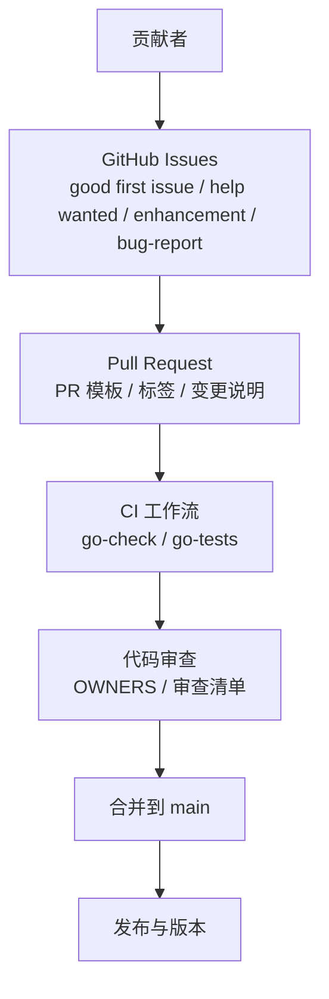
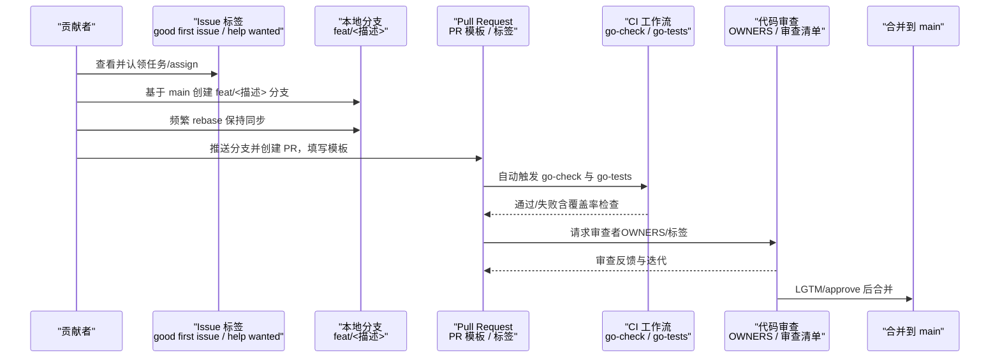
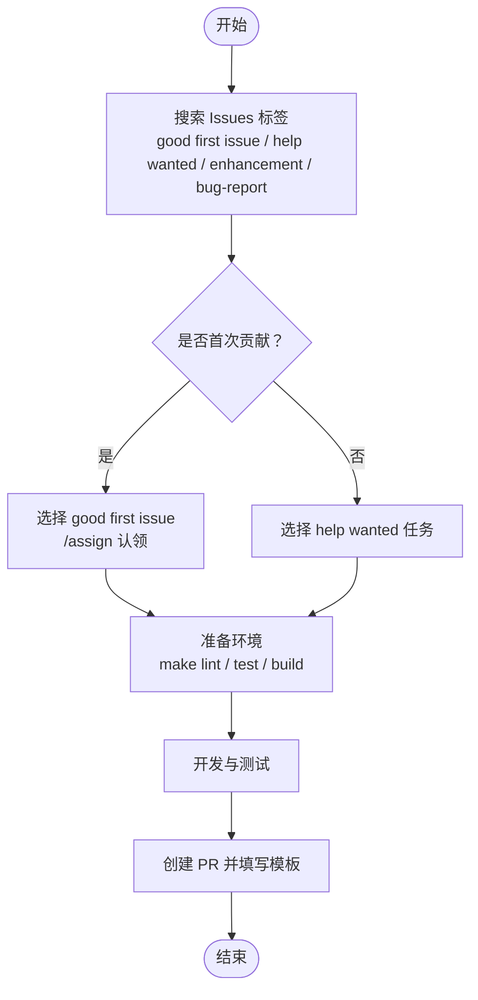
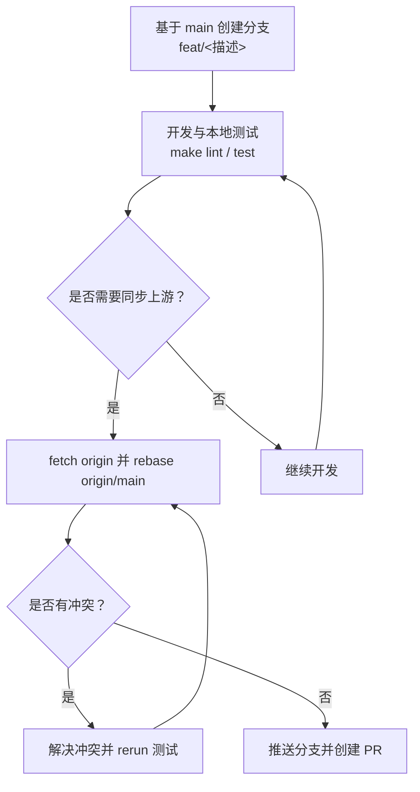
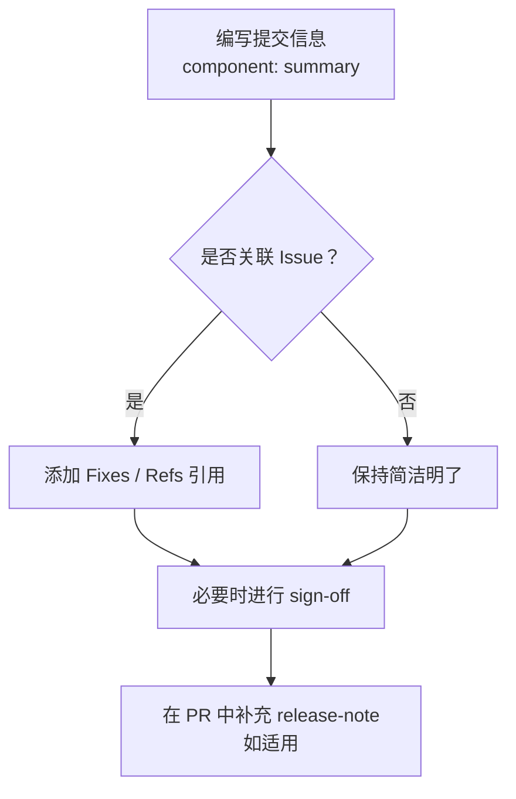
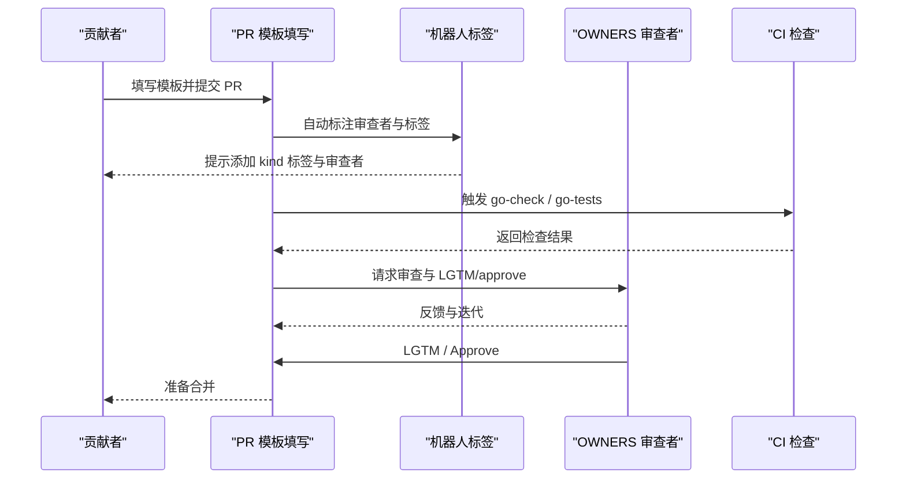
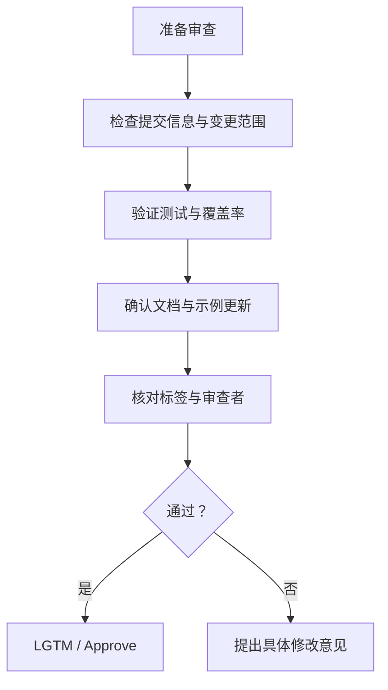
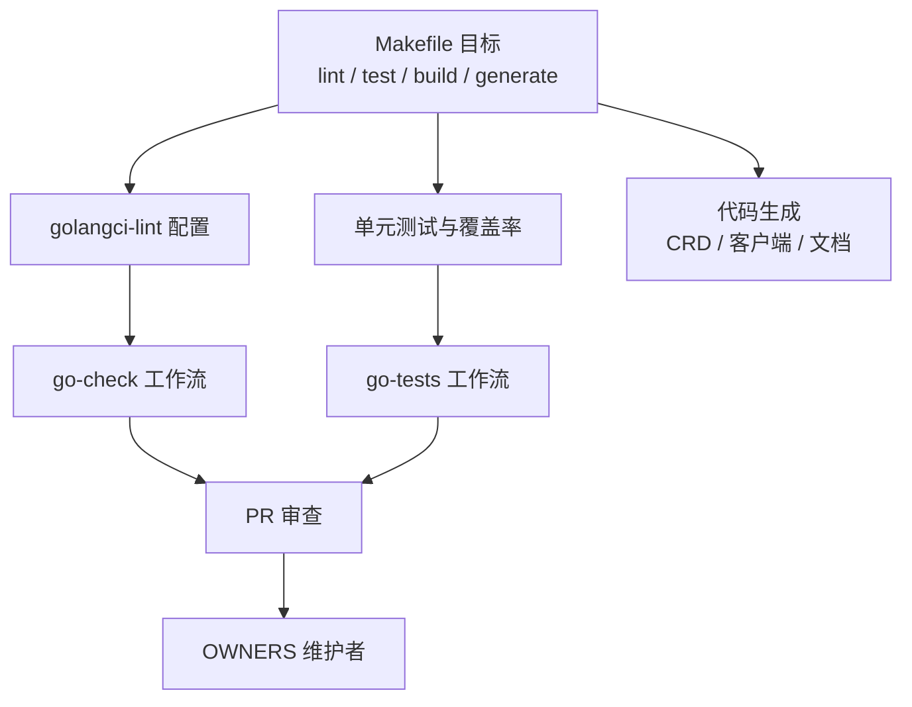

# 代码贡献流程

<cite>
**本文引用的文件**
- [CONTRIBUTING.md](file://CONTRIBUTING.md)
- [CODE_OF_CONDUCT.md](file://CODE_OF_CONDUCT.md)
- [.github/PULL_REQUEST_TEMPLATE.md](file://.github/PULL_REQUEST_TEMPLATE.md)
- [.github/ISSUE_TEMPLATE/good-first.md](file://.github/ISSUE_TEMPLATE/good-first.md)
- [.github/ISSUE_TEMPLATE/bug-report.md](file://.github/ISSUE_TEMPLATE/bug-report.md)
- [.github/ISSUE_TEMPLATE/enhancement.md](file://.github/ISSUE_TEMPLATE/enhancement.md)
- [Makefile](file://Makefile)
- [.golangci.yaml](file://.golangci.yaml)
- [OWNERS](file://OWNERS)
- [.github/workflows/go-check.yml](file://.github/workflows/go-check.yml)
- [.github/workflows/go-tests.yml](file://.github/workflows/go-tests.yml)
- [README.md](file://README.md)
</cite>

## 目录
1. [简介](#简介)
2. [项目结构](#项目结构)
3. [核心组件](#核心组件)
4. [架构总览](#架构总览)
5. [详细组件分析](#详细组件分析)
6. [依赖分析](#依赖分析)
7. [性能考虑](#性能考虑)
8. [故障排查指南](#故障排查指南)
9. [结论](#结论)
10. [附录](#附录)

## 简介
本文件面向所有希望参与 Kthena 项目的贡献者，系统化阐述从任务认领到合并的完整贡献流程。内容覆盖任务选择与认领（含 good first issue 与 help wanted）、分支管理策略（创建、命名与 rebase）、提交规范（消息格式、签名与变更说明）、Pull Request 创建与审查流程（模板、标签与反馈处理）、代码审查最佳实践（清单、常见问题与解决方法），以及社区行为准则与沟通渠道。

## 项目结构
Kthena 是一个以 Kubernetes 为中心的大模型推理平台，采用分层模块化组织：控制面（控制器管理器）与数据面（路由器）分离；同时提供 CLI、Python 运行时、CRD 与 Helm Charts 支持。贡献流程围绕以下关键要素展开：
- 任务来源：Issues（含 good first issue、help wanted、enhancement、bug-report）
- 开发工具链：Makefile 提供 lint、test、build、generate 等目标
- 质量保障：golangci-lint 配置、单元测试覆盖率阈值、CI 工作流
- 审查与治理：OWNERS 维护者列表、PR 模板、行为准则

图表来源
- [CONTRIBUTING.md:13-91](file://CONTRIBUTING.md#L13-L91)
- [.github/workflows/go-check.yml:1-46](file://.github/workflows/go-check.yml#L1-L46)
- [.github/workflows/go-tests.yml:1-50](file://.github/workflows/go-tests.yml#L1-L50)

章节来源
- [CONTRIBUTING.md:13-91](file://CONTRIBUTING.md#L13-L91)
- [README.md:82-102](file://README.md#L82-L102)

## 核心组件
- 任务认领与沟通
  - 使用 Issues 中的标签筛选任务：good first issue、help wanted、kind/enhancement、kind/bug
  - good first issue 用于首次贡献者入门，help wanted 适合有经验的贡献者
  - 认领方式：在 issue 下回复 /assign 即可自动分配
- 分支管理
  - 基于 main 创建功能分支，命名建议以 feat/<简短描述> 开头
  - 频繁 rebase 保持与上游同步，减少冲突
- 提交规范
  - 使用清晰的提交信息格式：component: summary
  - 引用问题：Fixes #<issue-number> 或 Refs #<issue-number>
  - 如需，按公司政策进行 sign-off
- PR 流程
  - 填写 PR 模板，包含问题背景、变更摘要、测试情况、截图/日志等
  - 添加合适的 kind 标签与审查者
  - 关联相关 issue 或 discussion
- 代码审查
  - 遵循 Go 代码评审建议与良好提交消息
  - 将大改动拆分为逻辑连贯的小 patch
  - 按机器人提示标注审查者
- 文档与示例
  - 更新 docs/kthena/docs 下的相关文档
  - 对新增 CRD 或 CLI 命令提供入门示例
  - 刷新 examples 下的部署示例
- 治理与所有权
  - 维护者在根目录 OWNERS 与子目录 OWNERS 中列出
  - 重大设计决策通过 docs/proposal 中的设计文档推进

章节来源
- [CONTRIBUTING.md:15-91](file://CONTRIBUTING.md#L15-L91)
- [CONTRIBUTING.md:117-122](file://CONTRIBUTING.md#L117-L122)
- [.github/ISSUE_TEMPLATE/good-first.md:17-31](file://.github/ISSUE_TEMPLATE/good-first.md#L17-L31)
- [.github/PULL_REQUEST_TEMPLATE.md:1-30](file://.github/PULL_REQUEST_TEMPLATE.md#L1-L30)
- [OWNERS:1-8](file://OWNERS#L1-L8)

## 架构总览
下图展示了从任务认领到 PR 合并的关键路径，以及 CI 在其中的作用。

图表来源
- [CONTRIBUTING.md:15-91](file://CONTRIBUTING.md#L15-L91)
- [.github/workflows/go-check.yml:1-46](file://.github/workflows/go-check.yml#L1-L46)
- [.github/workflows/go-tests.yml:1-50](file://.github/workflows/go-tests.yml#L1-L50)
- [OWNERS:1-8](file://OWNERS#L1-L8)

## 详细组件分析

### 任务选择与认领（good first issue 与 help wanted）
- good first issue
  - 面向首次贡献者，提供入门任务
  - 完成 1-2 个后应转向 help wanted
  - 认领方式：在 issue 下回复 /assign
- help wanted
  - 适合有经验的贡献者，难度适中
  - 优先级高于 good first issue，鼓励资深贡献者参与
- 其他标签
  - enhancement：功能增强建议
  - bug-report：缺陷报告
  - discussion：设计讨论与想法

图表来源
- [.github/ISSUE_TEMPLATE/good-first.md:17-31](file://.github/ISSUE_TEMPLATE/good-first.md#L17-L31)
- [.github/ISSUE_TEMPLATE/enhancement.md:1-13](file://.github/ISSUE_TEMPLATE/enhancement.md#L1-L13)
- [.github/ISSUE_TEMPLATE/bug-report.md:1-26](file://.github/ISSUE_TEMPLATE/bug-report.md#L1-L26)

章节来源
- [.github/ISSUE_TEMPLATE/good-first.md:17-31](file://.github/ISSUE_TEMPLATE/good-first.md#L17-L31)
- [.github/ISSUE_TEMPLATE/enhancement.md:1-13](file://.github/ISSUE_TEMPLATE/enhancement.md#L1-L13)
- [.github/ISSUE_TEMPLATE/bug-report.md:1-26](file://.github/ISSUE_TEMPLATE/bug-report.md#L1-L26)

### 分支管理策略（创建、命名与 rebase）
- 创建与命名
  - 基于 main 分支创建功能分支，命名规范：feat/<简短描述>
  - 示例：feat/add-new-feature、feat/fix-bug-in-router
- 同步与 rebase
  - 频繁从 origin/main 拉取并 rebase，降低合并冲突概率
  - 冲突解决后重新运行测试，确保本地状态稳定
- 与 CI 的配合
  - 本地通过 make lint 与 make test 后再推送
  - CI 将执行 golangci-lint 与单元测试，必要时调整变更

图表来源
- [CONTRIBUTING.md:29-61](file://CONTRIBUTING.md#L29-L61)
- [Makefile:132-152](file://Makefile#L132-L152)

章节来源
- [CONTRIBUTING.md:29-61](file://CONTRIBUTING.md#L29-L61)
- [Makefile:132-152](file://Makefile#L132-L152)

### 提交规范（commit message、签名与变更说明）
- 提交信息格式
  - 建议采用 component: summary 的形式，明确变更范围
- 引用问题
  - 在提交信息或 PR 描述中使用 Fixes #<issue-number> 或 Refs #<issue-number>
- 签名要求
  - 如属公司/组织政策要求，需进行 sign-off
- 变更说明
  - 在 PR 中添加 release-note（如适用），便于发布说明生成

图表来源
- [CONTRIBUTING.md:45-50](file://CONTRIBUTING.md#L45-L50)
- [.github/PULL_REQUEST_TEMPLATE.md:17-29](file://.github/PULL_REQUEST_TEMPLATE.md#L17-L29)

章节来源
- [CONTRIBUTING.md:45-50](file://CONTRIBUTING.md#L45-L50)
- [.github/PULL_REQUEST_TEMPLATE.md:17-29](file://.github/PULL_REQUEST_TEMPLATE.md#L17-L29)

### Pull Request 创建与审查流程
- 创建 PR
  - 面向 main 分支提交
  - 填写 PR 模板：问题背景、变更摘要、测试情况、截图/日志
  - 添加 kind 标签（bug、cleanup、enhancement、security、documentation、feature）
- 审查流程
  - 按机器人提示标注审查者
  - 维护者在 OWNERS 中列出，负责领域内审查与批准
- 反馈处理
  - 及时响应评论，逐条回复已解决问题
  - 如审查者要求，进行交互式变基与压缩提交

图表来源
- [.github/PULL_REQUEST_TEMPLATE.md:1-30](file://.github/PULL_REQUEST_TEMPLATE.md#L1-L30)
- [OWNERS:1-8](file://OWNERS#L1-L8)
- [.github/workflows/go-check.yml:1-46](file://.github/workflows/go-check.yml#L1-L46)
- [.github/workflows/go-tests.yml:1-50](file://.github/workflows/go-tests.yml#L1-L50)

章节来源
- [.github/PULL_REQUEST_TEMPLATE.md:1-30](file://.github/PULL_REQUEST_TEMPLATE.md#L1-L30)
- [CONTRIBUTING.md:73-87](file://CONTRIBUTING.md#L73-L87)
- [OWNERS:1-8](file://OWNERS#L1-L8)

### 代码审查最佳实践
- 审查清单
  - 遵循 Go 代码评审建议与良好提交消息
  - 将大改动拆分为一系列逻辑清晰的小 patch
  - 明确变更动机与影响范围，避免“仅修复”类无意义描述
- 常见问题与解决方法
  - 未满足覆盖率阈值：补齐单元测试，确保关键路径覆盖
  - 代码风格不一致：统一 gofmt、goimports，遵循 golangci-lint 规则
  - 缺少文档更新：更新 docs 与 examples，保持一致性
  - 未正确标注审查者：根据机器人提示补充 reviewers/approvers
- AI 辅助与责任
  - 使用 AI 工具辅助编写可接受，但作者需理解每处变更
  - 首次审查不应留给审查者，作者需先行自审与测试
  - 大规模 AI 生成 PR 与提交信息不被鼓励

图表来源
- [CONTRIBUTING.md:73-101](file://CONTRIBUTING.md#L73-L101)
- [.golangci.yaml:23-42](file://.golangci.yaml#L23-L42)
- [.github/workflows/go-tests.yml:42-50](file://.github/workflows/go-tests.yml#L42-L50)

章节来源
- [CONTRIBUTING.md:73-101](file://CONTRIBUTING.md#L73-L101)
- [.golangci.yaml:23-42](file://.golangci.yaml#L23-L42)
- [.github/workflows/go-tests.yml:42-50](file://.github/workflows/go-tests.yml#L42-L50)

### 社区行为准则与沟通渠道
- 行为准则
  - 遵守 Volcano 社区行为准则
- 沟通渠道
  - Issues：缺陷报告与功能请求
  - Discussions：设计问题与想法交流
  - Slack：与维护者私下沟通（详见 README）

章节来源
- [CODE_OF_CONDUCT.md:1-4](file://CODE_OF_CONDUCT.md#L1-L4)
- [README.md:82-102](file://README.md#L82-L102)

## 依赖分析
- 质量工具链
  - golangci-lint：静态检查与风格约束
  - 单元测试：覆盖率阈值检查
  - 代码生成：CRD、DeepCopy、客户端与文档生成
- CI 工作流
  - go-check：生成校验、Helm lint、构建与 lint
  - go-tests：单元测试与覆盖率阈值检查
- 维护者治理
  - OWNERS：列出具有 /lgtm 与 /approve 权限的维护者

图表来源
- [Makefile:132-152](file://Makefile#L132-L152)
- [.golangci.yaml:23-42](file://.golangci.yaml#L23-L42)
- [.github/workflows/go-check.yml:20-46](file://.github/workflows/go-check.yml#L20-L46)
- [.github/workflows/go-tests.yml:23-50](file://.github/workflows/go-tests.yml#L23-L50)
- [OWNERS:1-8](file://OWNERS#L1-L8)

章节来源
- [Makefile:132-152](file://Makefile#L132-L152)
- [.golangci.yaml:23-42](file://.golangci.yaml#L23-L42)
- [.github/workflows/go-check.yml:20-46](file://.github/workflows/go-check.yml#L20-L46)
- [.github/workflows/go-tests.yml:23-50](file://.github/workflows/go-tests.yml#L23-L50)
- [OWNERS:1-8](file://OWNERS#L1-L8)

## 性能考虑
- 本地开发阶段尽量减少不必要的构建与测试，聚焦关键模块
- 频繁 rebase 有助于保持提交历史整洁，降低 CI 时间成本
- 合理拆分 PR，避免单次提交过大导致审查与 CI 周期过长

## 故障排查指南
- CI 失败
  - go-check：检查生成产物、Helm lint 与构建步骤
  - go-tests：确认覆盖率阈值达标，补充缺失测试
- 代码风格问题
  - 使用 gofmt、goimports 统一格式
  - 遵循 golangci-lint 规则，关注本地与 CI 的差异
- 审查反馈
  - 逐条回复审查意见，必要时进行交互式变基与压缩提交
  - 若涉及 AI 生成内容，需在 PR 中披露并在审查中解释

章节来源
- [.github/workflows/go-check.yml:20-46](file://.github/workflows/go-check.yml#L20-L46)
- [.github/workflows/go-tests.yml:42-50](file://.github/workflows/go-tests.yml#L42-L50)
- [.golangci.yaml:23-42](file://.golangci.yaml#L23-L42)
- [CONTRIBUTING.md:82-87](file://CONTRIBUTING.md#L82-L87)

## 结论
Kthena 的贡献流程强调“从任务认领到合并”的闭环：以 Issues 标签引导贡献方向，以分支与 rebase 保证代码质量，以 PR 模板与审查清单提升可审查性，辅以 CI 与 OWNERS 治理机制确保发布质量。遵循本文档可显著提升贡献效率与代码可维护性。

## 附录
- 快速参考
  - 任务认领：good first issue（/assign）、help wanted
  - 分支命名：feat/<简短描述>
  - 提交信息：component: summary，必要时引用 Issue
  - PR 模板：问题背景、变更摘要、测试情况、kind 标签、release-note
  - 审查：遵循 Go 评审建议，拆分大改动，及时响应反馈
  - 行为准则：遵守 Volcano 社区行为准则
  - 沟通渠道：Issues、Discussions、Slack