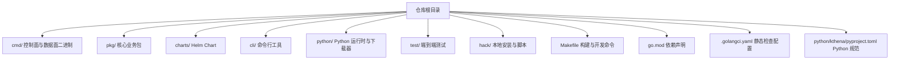
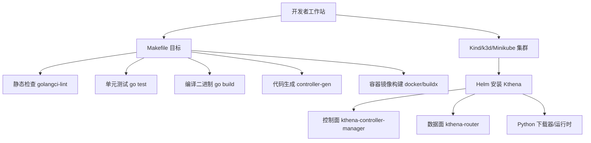
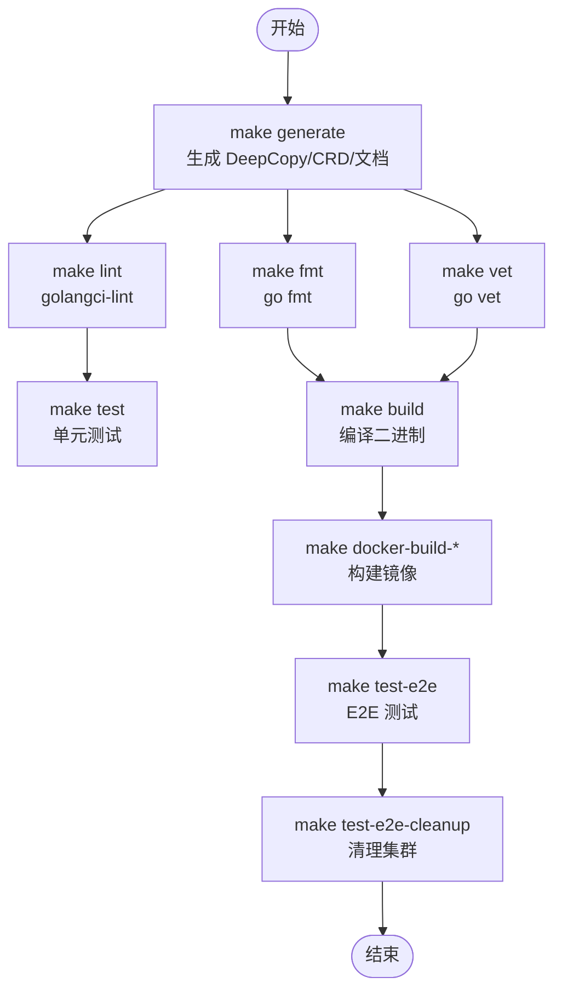

# 开发环境搭建

<cite>
**本文引用的文件**
- [Makefile](file://Makefile)
- [go.mod](file://go.mod)
- [.golangci.yaml](file://.golangci.yaml)
- [python/kthena/pyproject.toml](file://python/kthena/pyproject.toml)
- [README.md](file://README.md)
- [CONTRIBUTING.md](file://CONTRIBUTING.md)
- [hack/local-up-kthena.sh](file://hack/local-up-kthena.sh)
- [hack/lib/install.sh](file://hack/lib/install.sh)
- [test/e2e/setup.sh](file://test/e2e/setup.sh)
- [test/e2e/cleanup.sh](file://test/e2e/cleanup.sh)
- [config/licenses-lint.yaml](file://config/licenses-lint.yaml)
- [config/python-licenses-lint.ini](file://config/python-licenses-lint.ini)
- [.gitignore](file://.gitignore)
</cite>

## 目录
1. [简介](#简介)
2. [项目结构](#项目结构)
3. [核心组件](#核心组件)
4. [架构总览](#架构总览)
5. [详细组件分析](#详细组件分析)
6. [依赖关系分析](#依赖关系分析)
7. [性能注意事项](#性能注意事项)
8. [故障排查指南](#故障排查指南)
9. [结论](#结论)
10. [附录](#附录)

## 简介
本指南面向 Kthena 项目的开发者，帮助你在本地快速搭建可复现的开发与测试环境。内容覆盖：
- Go 版本与环境变量（GOPATH、GOROOT）要求与建议
- 依赖管理（Go Modules）与许可证合规检查
- Makefile 常用开发命令（lint、test、build、generate 等）
- 本地 Kubernetes 集群搭建（Kind、k3d、Minikube 任选其一）
- IDE/编辑器（VS Code、GoLand）开发环境配置建议
- 代码格式化、静态检查、测试运行与端到端测试流程

## 项目结构
Kthena 是一个基于 Kubernetes 的 LLM 推理平台，采用多模块 Go 项目组织方式，包含控制面与数据面两个主要二进制，以及 Helm Chart、CRD、CLI、Python 运行时等配套组件。

图示来源
- [Makefile:1-295](file://Makefile#L1-L295)
- [go.mod:1-144](file://go.mod#L1-L144)

章节来源
- [Makefile:1-295](file://Makefile#L1-L295)
- [go.mod:1-144](file://go.mod#L1-L144)

## 核心组件
- 控制面：kthena-controller-manager（模型生命周期、自动伸缩、Webhook 等）
- 数据面：kthena-router（请求路由、负载均衡、可观测性中间件等）
- CLI：kthena（用于资源操作与模板生成）
- Python 运行时与下载器：支持模型下载、KV 缓存、指标采集等
- Helm Chart：一键部署 CRD、控制器、路由器与相关依赖

章节来源
- [README.md:57-62](file://README.md#L57-L62)
- [go.mod:29-42](file://go.mod#L29-L42)

## 架构总览
下图展示本地开发与测试的整体流程：通过 Makefile 调度工具链，构建镜像与二进制；借助 hack 脚本或 E2E 脚本在 Kind 上安装 Kthena 并进行验证。

图示来源
- [Makefile:132-211](file://Makefile#L132-L211)
- [hack/local-up-kthena.sh:28-54](file://hack/local-up-kthena.sh#L28-L54)
- [test/e2e/setup.sh:24-82](file://test/e2e/setup.sh#L24-L82)

## 详细组件分析

### Go 版本与环境变量
- Go 版本：项目使用 Go 1.24.0，请确保本地安装对应版本以避免依赖解析差异。
- GOPATH/GOBIN/GOFLAGS：Makefile 会自动读取 GOBIN（若未设置则回退到 GOPATH/bin），并使用 GOFLAGS 控制只读模式下载依赖。
- GOROOT：通常无需手动设置，使用系统默认即可；如需自定义，请保持与 Go 1.24.0 对应的安装路径一致。

章节来源
- [go.mod:3](file://go.mod#L3)
- [Makefile:7-12](file://Makefile#L7-L12)
- [Makefile:259-264](file://Makefile#L259-L264)

### 依赖管理与许可证检查
- Go Modules：使用 go.mod 声明依赖，go.sum 记录精确版本。Makefile 提供只读模式下载与 go mod tidy 的组合，确保一致性。
- 许可证镜像与校验：提供镜像化第三方许可证清单与许可证规则校验任务，便于合规审计。

章节来源
- [go.mod:1-144](file://go.mod#L1-L144)
- [Makefile:259-278](file://Makefile#L259-L278)
- [config/licenses-lint.yaml:1-73](file://config/licenses-lint.yaml#L1-L73)
- [config/python-licenses-lint.ini:1-42](file://config/python-licenses-lint.ini#L1-L42)

### Makefile 开发命令详解
以下命令是本地开发的核心工具，建议在提交前逐项执行以保证质量门禁：

- 代码生成
  - make generate：生成 DeepCopy/DeepCopyInto/对象方法、更新代码生成产物、生成文档与版权头。
  - make gen-crd：生成 CRD 清单至 Helm Chart。
  - make gen-docs：生成 CRD 文档、CLI 文档与 Helm Values 文档。
  - make gen-check：在 generate 后对比工作区变更，确保生成物纳入版本控制。

- 质量门禁
  - make lint：运行 golangci-lint，默认启用 gofmt、goimports、govet、errcheck、staticcheck 等。
  - make lint-fix：自动修复可修复问题。
  - make lint-python：使用 Ruff 检查 Python 代码风格与规范。
  - make fmt/vet：分别执行 go fmt 与 go vet。

- 测试
  - make test：排除 e2e 与 client-go 包，运行单元测试并输出覆盖率。
  - make test-e2e：创建 Kind 集群，加载镜像，安装 cert-manager、Volcano、Gateway API 及相关 CRD，运行所有 E2E 测试。
  - make test-e2e-controller-manager / router / gateway-api / gateway-inference-extension：按类别运行特定 E2E 子集。
  - make test-e2e-cleanup：清理 E2E 集群与临时 kubeconfig。

- 构建与镜像
  - make build：编译 kthena-router、kthena-controller-manager、CLI 二进制至 bin/。
  - make docker-build-*：构建各镜像（router/controller/downloader/runtime）。
  - make docker-buildx：跨平台构建并推送（需要已配置 buildx）。

- 依赖工具安装
  - make golangci-lint/controller-gen/crd-ref-docs/helm-docs：自动下载并缓存工具至 bin/，版本由 Makefile 维护。

章节来源
- [Makefile:47-294](file://Makefile#L47-L294)
- [.golangci.yaml:23-42](file://.golangci.yaml#L23-L42)
- [python/kthena/pyproject.toml:1-30](file://python/kthena/pyproject.toml#L1-L30)

### 本地 Kubernetes 集群搭建
Kthena 支持多种本地集群方案，推荐使用 Kind（默认），也可选择 k3d 或 Minikube。

- 使用 hack/local-up-kthena.sh（推荐）
  - 功能：一键准备镜像、创建/接入集群、Helm 安装 Kthena，并打印状态与卸载指引。
  - 关键行为：调用 hack/lib/install.sh 执行预检（kubectl、helm、容器运行时、Kind/k3d/Minikube），必要时自动安装 Kind 与 Helm。
  - 支持参数：可通过环境变量定制集群名、镜像前缀、标签、命名空间、Release 名称等。

- 使用 test/e2e/setup.sh（仅 E2E）
  - 功能：创建独立 Kind 集群、等待节点就绪、构建并加载镜像、安装 cert-manager、Volcano、Gateway API 与相关 CRD。
  - 适用场景：需要最小化 E2E 环境时使用。

- 清理
  - test/e2e/cleanup.sh：删除指定名称的 Kind 集群并清理临时 kubeconfig。

章节来源
- [hack/local-up-kthena.sh:17-151](file://hack/local-up-kthena.sh#L17-L151)
- [hack/lib/install.sh:184-252](file://hack/lib/install.sh#L184-L252)
- [test/e2e/setup.sh:24-82](file://test/e2e/setup.sh#L24-L82)
- [test/e2e/cleanup.sh:19-40](file://test/e2e/cleanup.sh#L19-L40)

### IDE 与编辑器配置建议
- VS Code
  - 插件建议：Go、Docker、Helm（或官方插件）、YAML、EditorConfig、Prettier（文档站点）。
  - 工作区设置：可参考 .gitignore 中对 bin、.vscode、.DS_Store 的忽略策略，避免将二进制与 IDE 临时文件提交。
  - Go 工具链：确保 VS Code 使用与 Makefile 相同的 Go 版本与 GOPATH/GOBIN 环境。
- GoLand
  - Go 版本：选择与 go.mod 一致的版本（1.24.0）。
  - 代码风格：启用 gofmt/goimports，结合 golangci-lint 规则统一风格。
  - 运行配置：为 kthena-controller-manager、kthena-router、CLI 分别创建 Run/Debug 配置，指向对应 main.go。

章节来源
- [.gitignore:23-36](file://.gitignore#L23-L36)
- [go.mod:3](file://go.mod#L3)

### 代码格式化、静态检查与测试运行
- 格式化与 Vet
  - make fmt：对全部包执行 go fmt。
  - make vet：对全部包执行 go vet。
- 静态检查
  - make lint：运行 golangci-lint，启用 gofmt、goimports、govet、errcheck、staticcheck、unused 等。
  - make lint-fix：自动修复可修复问题。
  - make lint-python：使用 Ruff 检查 Python 代码风格与规范。
- 单元测试
  - make test：排除 e2e 与 client-go 包，运行单元测试并生成覆盖率文件。
- 端到端测试
  - make test-e2e：创建 Kind 集群，安装依赖，运行所有 E2E 测试。
  - make test-e2e-controller-manager / router / gateway-api / gateway-inference-extension：按类别运行子集。
  - make test-e2e-cleanup：清理 E2E 集群。

章节来源
- [Makefile:132-151](file://Makefile#L132-L151)
- [Makefile:83-131](file://Makefile#L83-L131)
- [Makefile:92-131](file://Makefile#L92-L131)
- [test/e2e/setup.sh:24-82](file://test/e2e/setup.sh#L24-L82)

## 依赖关系分析
下图展示开发命令之间的依赖关系与典型流水线。

图示来源
- [Makefile:71-159](file://Makefile#L71-L159)
- [Makefile:92-131](file://Makefile#L92-L131)

章节来源
- [Makefile:71-159](file://Makefile#L71-L159)
- [Makefile:92-131](file://Makefile#L92-L131)

## 性能注意事项
- 仅读模式依赖下载：使用只读模式下载依赖，避免意外修改 go.mod/go.sum，提升 CI 复现性。
- 生成物一致性：generate 后执行 go mod tidy，确保依赖锁定与生成代码同步。
- 镜像构建：优先使用 docker-buildx 进行多平台构建与缓存，减少重复构建时间。
- E2E 集群隔离：E2E 使用独立集群与 kubeconfig，避免与本地开发冲突。

章节来源
- [Makefile:259-264](file://Makefile#L259-L264)
- [Makefile:199-211](file://Makefile#L199-L211)
- [test/e2e/setup.sh:24-44](file://test/e2e/setup.sh#L24-L44)

## 故障排查指南
- 预检失败（二进制缺失）
  - 症状：提示 kubectl、helm、kind/k3d/minikube、Docker/Podman 未安装。
  - 处理：根据提示安装对应工具；若使用现有集群，确认 KUBECONFIG 正确。
- 集群不可达
  - 症状：kubectl cluster-info 失败。
  - 处理：检查当前上下文与凭据，确保集群处于 Ready 状态。
- Kind 集群无法创建/加载镜像
  - 症状：kind create cluster 或 kind load 失败。
  - 处理：确认 Docker/Podman 正常运行；检查镜像是否存在；必要时重新构建镜像并重试。
- E2E 测试超时或失败
  - 症状：cmctl 检查或 CRD 安装等待超时。
  - 处理：增加等待时间或重试；确认网络可达；清理旧集群后重试。
- 许可证校验失败
  - 症状：许可证规则检查失败。
  - 处理：核对 config/licenses-lint.yaml 与 config/python-licenses-lint.ini，调整依赖或豁免列表。

章节来源
- [hack/lib/install.sh:46-137](file://hack/lib/install.sh#L46-L137)
- [hack/lib/install.sh:184-252](file://hack/lib/install.sh#L184-L252)
- [test/e2e/setup.sh:45-82](file://test/e2e/setup.sh#L45-L82)
- [config/licenses-lint.yaml:1-73](file://config/licenses-lint.yaml#L1-L73)
- [config/python-licenses-lint.ini:1-42](file://config/python-licenses-lint.ini#L1-L42)

## 结论
通过上述步骤，你可以在本地完成从 Go 环境、依赖管理、代码质量到本地集群与端到端测试的完整开发闭环。建议在每次迭代中遵循“generate → fmt/vet → lint → test → build → docker-buildx → test-e2e”的流水线，确保变更稳定且可复现。

## 附录

### 常用命令速查
- 生成与文档：make generate、make gen-docs、make gen-crd、make gen-check
- 质量门禁：make lint、make lint-fix、make lint-python、make fmt、make vet
- 测试：make test、make test-e2e、make test-e2e-controller-manager、make test-e2e-router、make test-e2e-gateway-api、make test-e2e-gateway-inference-extension、make test-e2e-cleanup
- 构建与镜像：make build、make docker-build-router、make docker-build-controller、make docker-build-downloader、make docker-build-runtime、make docker-build-all、make docker-push、make docker-buildx
- 本地集群：hack/local-up-kthena.sh（支持 --help、-q、--check-only）

章节来源
- [Makefile:47-294](file://Makefile#L47-L294)
- [hack/local-up-kthena.sh:71-151](file://hack/local-up-kthena.sh#L71-L151)