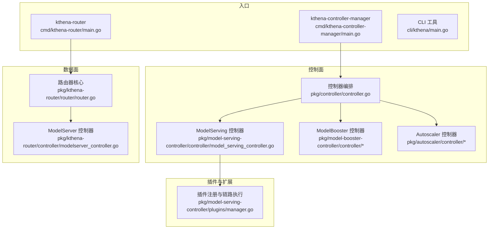
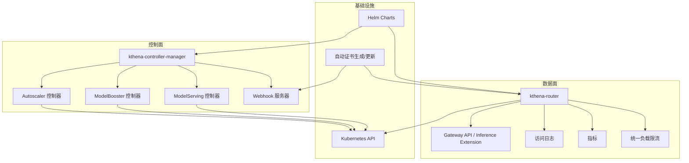
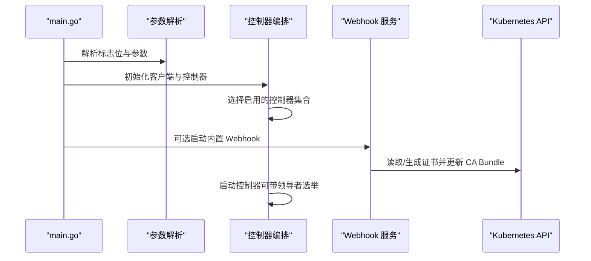
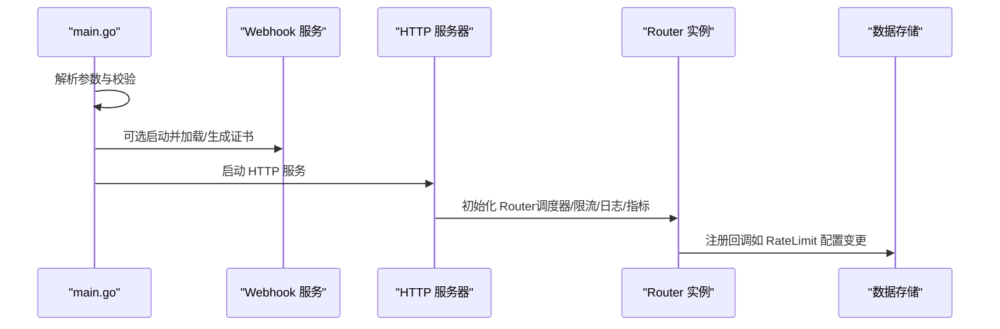
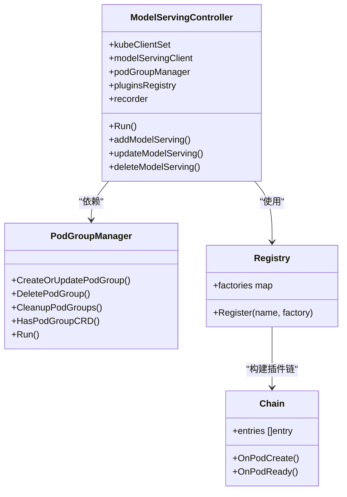
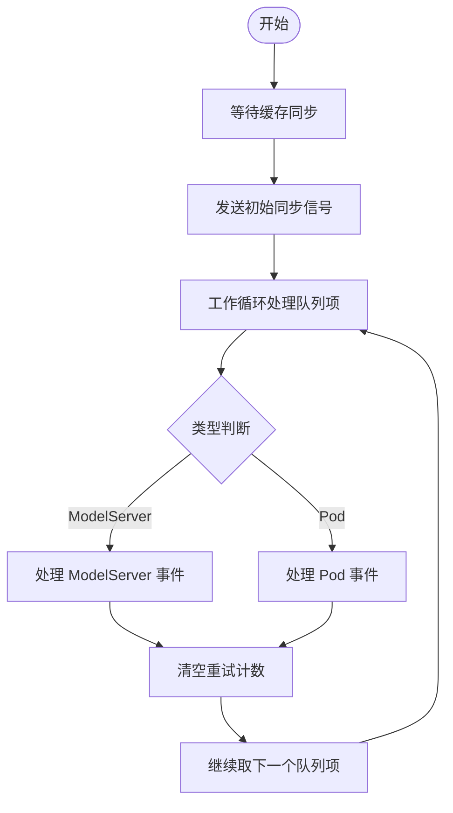
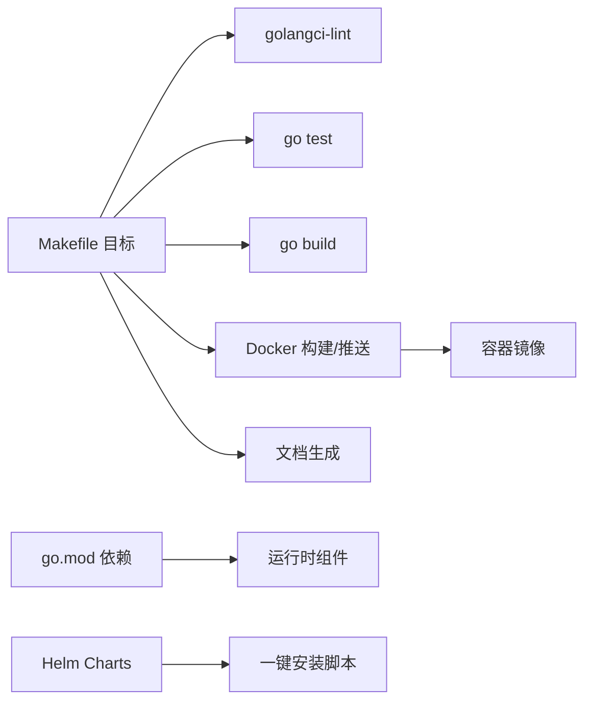

# 开发者指南

<cite>
**本文引用的文件**
- [README.md](file://README.md)
- [CONTRIBUTING.md](file://CONTRIBUTING.md)
- [Makefile](file://Makefile)
- [go.mod](file://go.mod)
- [.golangci.yaml](file://.golangci.yaml)
- [cmd/kthena-controller-manager/main.go](file://cmd/kthena-controller-manager/main.go)
- [cmd/kthena-router/main.go](file://cmd/kthena-router/main.go)
- [pkg/controller/controller.go](file://pkg/controller/controller.go)
- [pkg/kthena-router/controller/modelserver_controller.go](file://pkg/kthena-router/controller/modelserver_controller.go)
- [pkg/kthena-router/router/router.go](file://pkg/kthena-router/router/router.go)
- [pkg/model-serving-controller/controller/model_serving_controller.go](file://pkg/model-serving-controller/controller/model_serving_controller.go)
- [pkg/model-serving-controller/plugins/manager.go](file://pkg/model-serving-controller/plugins/manager.go)
- [cli/kthena/main.go](file://cli/kthena/main.go)
- [hack/local-up-kthena.sh](file://hack/local-up-kthena.sh)
- [docs/kthena/docs/developer-guide/development-setup.md](file://docs/kthena/docs/developer-guide/development-setup.md)
- [test/e2e/framework/framework.go](file://test/e2e/framework/framework.go)
</cite>

## 目录
1. [简介](#简介)
2. [项目结构](#项目结构)
3. [核心组件](#核心组件)
4. [架构总览](#架构总览)
5. [详细组件分析](#详细组件分析)
6. [依赖分析](#依赖分析)
7. [性能考虑](#性能考虑)
8. [故障排查指南](#故障排查指南)
9. [结论](#结论)
10. [附录](#附录)

## 简介
本指南面向 Kthena 项目贡献者与维护者，提供从开发环境搭建、构建与测试到代码贡献流程、插件扩展与调试技巧的完整说明。Kthena 是一个 Kubernetes 原生的大模型推理平台，通过控制面（控制器）与数据面（路由器）分离的设计，提供声明式模型生命周期管理、智能路由与调度、多后端推理引擎支持以及成本驱动的弹性伸缩能力。

- 快速入口：安装与一键部署可参考 [README.md](file://README.md) 与 [开发设置文档](file://docs/kthena/docs/developer-guide/development-setup.md)。
- 贡献流程与规范：请参阅 [贡献指南](file://CONTRIBUTING.md)。

章节来源
- [README.md:1-107](file://README.md#L1-L107)
- [CONTRIBUTING.md:1-139](file://CONTRIBUTING.md#L1-L139)

## 项目结构
仓库采用“模块化分层 + 功能域划分”的组织方式：
- cmd：二进制入口（控制器与路由器）
- pkg：核心业务逻辑（控制器、路由器、插件框架、数据存储等）
- client-go：基于代码生成的客户端与列表器
- charts：Helm 发行包
- cli：命令行工具
- test/e2e：端到端测试框架与用例
- docs：用户与开发者文档
- hack：本地开发与脚手架工具
- python：运行时与下载器（Python 组件）

下面以“组件-模块”视角给出概览图，展示主要入口与核心子系统的关系。

图表来源
- [cmd/kthena-controller-manager/main.go:54-111](file://cmd/kthena-controller-manager/main.go#L54-L111)
- [cmd/kthena-router/main.go:40-122](file://cmd/kthena-router/main.go#L40-L122)
- [pkg/controller/controller.go:52-141](file://pkg/controller/controller.go#L52-L141)
- [pkg/kthena-router/router/router.go:91-169](file://pkg/kthena-router/router/router.go#L91-L169)
- [pkg/model-serving-controller/controller/model_serving_controller.go:104-171](file://pkg/model-serving-controller/controller/model_serving_controller.go#L104-L171)
- [pkg/model-serving-controller/plugins/manager.go:40-80](file://pkg/model-serving-controller/plugins/manager.go#L40-L80)

章节来源
- [Makefile:155-160](file://Makefile#L155-L160)
- [go.mod:1-144](file://go.mod#L1-L144)

## 核心组件
- 控制器管理器（kthena-controller-manager）
  - 支持启用/禁用多个控制器（ModelServing、ModelBooster、Autoscaler），并可选开启领导者选举与 Webhook。
  - 入口与参数解析见 [main.go:54-111](file://cmd/kthena-controller-manager/main.go#L54-L111)，控制器编排见 [controller.go:52-141](file://pkg/controller/controller.go#L52-L141)。
- 路由器（kthena-router）
  - 提供 HTTP 接入、可选内置 Webhook、Gateway API/Gateway API Inference Extension 支持、访问日志、指标、限流与公平调度等能力。
  - 入口与参数解析见 [main.go:40-122](file://cmd/kthena-router/main.go#L40-L122)，核心路由逻辑见 [router.go:91-169](file://pkg/kthena-router/router/router.go#L91-L169)。
- CLI 工具
  - 基于 Cobra 的命令行工具，嵌入 Helm 模板资源，提供便捷的部署与示例生成能力。
  - 入口见 [main.go:31-34](file://cli/kthena/main.go#L31-L34)。
- 插件框架（ModelServing 控制器）
  - 通过注册表与链式调用机制，按作用域（角色/目标）在 Pod 创建/就绪阶段执行插件，支持内置插件扩展。
  - 见 [manager.go:40-80](file://pkg/model-serving-controller/plugins/manager.go#L40-L80)。

章节来源
- [cmd/kthena-controller-manager/main.go:54-111](file://cmd/kthena-controller-manager/main.go#L54-L111)
- [pkg/controller/controller.go:52-141](file://pkg/controller/controller.go#L52-L141)
- [cmd/kthena-router/main.go:40-122](file://cmd/kthena-router/main.go#L40-L122)
- [pkg/kthena-router/router/router.go:91-169](file://pkg/kthena-router/router/router.go#L91-L169)
- [cli/kthena/main.go:31-34](file://cli/kthena/main.go#L31-L34)
- [pkg/model-serving-controller/plugins/manager.go:40-80](file://pkg/model-serving-controller/plugins/manager.go#L40-L80)

## 架构总览
下图展示了控制面与数据面的职责分工与交互关系，以及 Webhook、证书与 Helm 部署等基础设施。

图表来源
- [cmd/kthena-controller-manager/main.go:103-236](file://cmd/kthena-controller-manager/main.go#L103-L236)
- [cmd/kthena-router/main.go:115-195](file://cmd/kthena-router/main.go#L115-L195)
- [pkg/kthena-router/router/router.go:156-169](file://pkg/kthena-router/router/router.go#L156-L169)

章节来源
- [README.md:53-66](file://README.md#L53-L66)

## 详细组件分析

### 控制器管理器（kthena-controller-manager）
- 启动流程
  - 解析命令行参数（kubeconfig、leader-elect、workers、控制器开关、Webhook 参数等）。
  - 初始化客户端与控制器实例，按需启动领导者选举或直接运行。
- 关键点
  - 控制器启用策略：支持“全部启用”、“显式包含/排除”组合，详见 [parseControllers:268-300](file://cmd/kthena-controller-manager/main.go#L268-L300) 与 [isControllerEnabled:302-331](file://cmd/kthena-controller-manager/main.go#L302-L331)。
  - Webhook 证书管理：优先从 Secret 加载，其次尝试文件，最后自动生成并更新 ValidatingWebhookConfiguration 的 CA Bundle，详见 [setupWebhook:127-236](file://cmd/kthena-controller-manager/main.go#L127-L236)。
  - 控制器编排：根据启用列表创建控制器实例并并发运行，详见 [SetupController:52-141](file://pkg/controller/controller.go#L52-L141)。

图表来源
- [cmd/kthena-controller-manager/main.go:54-111](file://cmd/kthena-controller-manager/main.go#L54-L111)
- [pkg/controller/controller.go:52-141](file://pkg/controller/controller.go#L52-L141)

章节来源
- [cmd/kthena-controller-manager/main.go:54-111](file://cmd/kthena-controller-manager/main.go#L54-L111)
- [pkg/controller/controller.go:52-141](file://pkg/controller/controller.go#L52-L141)

### 路由器（kthena-router）
- 启动流程
  - 解析监听端口、TLS、Webhook、Gateway API 与调试端口等参数。
  - 可选启动内置 Webhook（证书加载/生成与 ValidatingWebhookConfiguration 更新）。
  - 启动 HTTP 服务器与路由处理链。
- 路由核心
  - 调度器、认证器、统一限流、访问日志、指标与 Token 化器初始化，详见 [NewRouter:91-169](file://pkg/kthena-router/router/router.go#L91-L169)。
  - 公平调度权重与超时可通过环境变量配置，详见 [parseEnvFloat:183-191](file://pkg/kthena-router/router/router.go#L183-L191) 与 [parseFairnessTimeout:173-181](file://pkg/kthena-router/router/router.go#L173-L181)。

图表来源
- [cmd/kthena-router/main.go:40-122](file://cmd/kthena-router/main.go#L40-L122)
- [pkg/kthena-router/router/router.go:91-169](file://pkg/kthena-router/router/router.go#L91-L169)

章节来源
- [cmd/kthena-router/main.go:40-122](file://cmd/kthena-router/main.go#L40-L122)
- [pkg/kthena-router/router/router.go:91-169](file://pkg/kthena-router/router/router.go#L91-L169)

### ModelServing 控制器
- 职责
  - 监听 ModelServing 资源变更，协调 PodGroup（含 LWS 支持）、服务、事件记录与插件链执行。
  - 通过 Informer 索引（groupName、roleID）加速查询与事件处理。
- 关键点
  - 插件注册表与链式执行，按 Scope（角色/目标）决定是否执行，详见 [manager.go:40-80](file://pkg/model-serving-controller/plugins/manager.go#L40-L80) 与 [shouldRun:122-139](file://pkg/model-serving-controller/plugins/manager.go#L122-L139)。
  - PodGroup 管理器负责创建/删除/清理 PodGroup，并与 Volcano 调度器协作，详见 [model_serving_controller.go:104-171](file://pkg/model-serving-controller/controller/model_serving_controller.go#L104-L171)。

图表来源
- [pkg/model-serving-controller/controller/model_serving_controller.go:104-171](file://pkg/model-serving-controller/controller/model_serving_controller.go#L104-L171)
- [pkg/model-serving-controller/plugins/manager.go:40-80](file://pkg/model-serving-controller/plugins/manager.go#L40-L80)

章节来源
- [pkg/model-serving-controller/controller/model_serving_controller.go:104-171](file://pkg/model-serving-controller/controller/model_serving_controller.go#L104-L171)
- [pkg/model-serving-controller/plugins/manager.go:40-80](file://pkg/model-serving-controller/plugins/manager.go#L40-L80)

### ModelServer 控制器（数据面）
- 职责
  - 监听 ModelServer 与 Pod 事件，同步到内部 Store，维护模型服务器状态与拓扑信息。
- 关键点
  - 使用工作队列与速率限制器处理事件，支持重试与初始同步信号，详见 [modelserver_controller.go:114-176](file://pkg/kthena-router/controller/modelserver_controller.go#L114-L176)。

图表来源
- [pkg/kthena-router/controller/modelserver_controller.go:114-176](file://pkg/kthena-router/controller/modelserver_controller.go#L114-L176)

章节来源
- [pkg/kthena-router/controller/modelserver_controller.go:114-176](file://pkg/kthena-router/controller/modelserver_controller.go#L114-L176)

### CLI 工具
- 职责
  - 基于 Cobra 提供命令树；嵌入 Helm 模板资源，便于生成与部署。
- 关键点
  - 入口函数初始化模板并执行命令树，详见 [main.go:31-34](file://cli/kthena/main.go#L31-L34)。

章节来源
- [cli/kthena/main.go:31-34](file://cli/kthena/main.go#L31-L34)

## 依赖分析
- 构建与工具链
  - Makefile 定义了构建、测试、打包、镜像构建与推送、许可证检查、文档生成等目标，详见 [Makefile:155-294](file://Makefile#L155-L294)。
  - 代码风格与静态检查由 golangci-lint 驱动，详见 [.golangci.yaml:23-42](file://.golangci.yaml#L23-L42)。
- 运行时依赖
  - Go 版本与第三方库在 [go.mod:3-43](file://go.mod#L3-L43) 中声明，涵盖 Kubernetes 客户端、控制器运行时、网关 API、Prometheus、Redis、Gin 等。
- 本地一键安装
  - 通过 [hack/local-up-kthena.sh:29-54](file://hack/local-up-kthena.sh#L29-L54) 构建镜像并使用 Helm 安装至集群，默认命名空间为 kthena-system。

图表来源
- [Makefile:155-294](file://Makefile#L155-L294)
- [.golangci.yaml:23-42](file://.golangci.yaml#L23-L42)
- [go.mod:3-43](file://go.mod#L3-L43)
- [hack/local-up-kthena.sh:29-54](file://hack/local-up-kthena.sh#L29-L54)

章节来源
- [Makefile:155-294](file://Makefile#L155-L294)
- [.golangci.yaml:23-42](file://.golangci.yaml#L23-L42)
- [go.mod:3-43](file://go.mod#L3-L43)
- [hack/local-up-kthena.sh:29-54](file://hack/local-up-kthena.sh#L29-L54)

## 性能考虑
- 控制器与路由器
  - 控制器支持并发 workers 与领导者选举，避免单点瓶颈；建议在高负载场景下适当提高 workers 数量并启用领导者选举。
  - 路由器支持统一负载限流与访问日志输出格式选择，建议在生产中启用 JSON 访问日志以便集中采集。
- 调度与公平性
  - 公平调度权重与队列超时可通过环境变量动态调整，建议结合业务 SLA 进行压测与调优。
- 测试与基准
  - 项目提供基准目录与 Dockerfile，可用于评估不同配置下的吞吐与延迟表现。

章节来源
- [pkg/kthena-router/router/router.go:165-191](file://pkg/kthena-router/router/router.go#L165-L191)

## 故障排查指南
- 本地一键安装失败
  - 使用 [hack/local-up-kthena.sh:126-130](file://hack/local-up-kthena.sh#L126-L130) 执行前置检查，确认 Docker、Helm、Kubernetes 版本满足要求。
  - 若需要仅检查前置条件，可传入 --check-only。
- E2E 测试
  - 使用 [test/e2e/framework/framework.go:67-136](file://test/e2e/framework/framework.go#L67-L136) 提供的安装/卸载封装，支持 Gateway API 与 Inference Extension 的启用与等待。
  - 可通过指定 TEST_CATEGORY 运行特定类别（如 controller-manager、router、gateway-api、gateway-inference-extension）的测试。
- 日志与健康检查
  - 控制器与路由器均使用 klog 输出日志，可通过 Kubernetes 日志查看器定位问题。
  - 路由器内置 /healthz 健康检查端点，可在调试端口查看状态。

章节来源
- [hack/local-up-kthena.sh:126-130](file://hack/local-up-kthena.sh#L126-L130)
- [test/e2e/framework/framework.go:67-136](file://test/e2e/framework/framework.go#L67-L136)
- [cmd/kthena-router/main.go:202-207](file://cmd/kthena-router/main.go#L202-L207)

## 结论
本指南从环境搭建、构建测试、贡献流程、架构与组件、依赖与性能、故障排查到插件扩展给出了系统性的开发指引。建议贡献者在提交前先运行本地测试与静态检查，并在 PR 中清晰描述变更动机、测试覆盖与影响范围。

## 附录

### 开发环境搭建步骤
- Go 环境
  - 使用 Go 1.24.0，参考 [开发设置文档:7-11](file://docs/kthena/docs/developer-guide/development-setup.md#L7-L11)。
- Docker 与容器镜像
  - 使用 Makefile 的 docker-* 目标构建镜像，或通过 [hack/local-up-kthena.sh:33-34](file://hack/local-up-kthena.sh#L33-L34) 一键构建并安装。
- Kubernetes
  - 参考 [开发设置文档:20-28](file://docs/kthena/docs/developer-guide/development-setup.md#L20-L28) 选择合适的本地集群方案。
- Helm
  - 使用 Helm 升级安装，Chart 路径位于 charts/kthena。

章节来源
- [docs/kthena/docs/developer-guide/development-setup.md:7-28](file://docs/kthena/docs/developer-guide/development-setup.md#L7-L28)
- [hack/local-up-kthena.sh:33-34](file://hack/local-up-kthena.sh#L33-L34)

### 代码贡献流程
- 分支与提交
  - 基于 main 分支创建特性分支，遵循清晰的提交信息格式，必要时引用 Issue。
- 测试与质量
  - 运行 make lint 与 make test，确保通过 golangci-lint 与单元测试。
  - 新增/修改功能需配套单元测试与必要的集成测试。
- 文档与发布
  - 更新相关文档与示例，必要时生成 CRD/CLI/Helm 文档（make gen-docs）。
- 安全与合规
  - 使用个人访问令牌或 SSH 密钥进行推送，遵守安全策略。

章节来源
- [CONTRIBUTING.md:13-91](file://CONTRIBUTING.md#L13-L91)
- [Makefile:71-77](file://Makefile#L71-L77)

### 单元测试与集成测试编写指南
- 单元测试
  - 在对应 *_test.go 文件中编写，使用 testify 等断言库；并发敏感代码建议添加 -race 检查。
- 集成测试
  - 使用 test/e2e 下的框架进行端到端验证，支持 Gateway API 与 Inference Extension 场景。
- 覆盖率
  - make test 会生成覆盖率报告，建议在 PR 中附带覆盖率变化说明。

章节来源
- [CONTRIBUTING.md:103-109](file://CONTRIBUTING.md#L103-L109)
- [Makefile:83-85](file://Makefile#L83-L85)
- [test/e2e/framework/framework.go:67-136](file://test/e2e/framework/framework.go#L67-L136)

### 插件开发与功能扩展
- 插件注册
  - 在插件注册表中注册工厂函数，构建插件链时按名称查找并实例化。
- 作用域控制
  - 通过 Scope（Roles、Target）控制插件在 Pod 创建/就绪阶段的执行范围。
- 示例
  - 参考内置插件实现，遵循 HookRequest 接口约定。

章节来源
- [pkg/model-serving-controller/plugins/manager.go:40-80](file://pkg/model-serving-controller/plugins/manager.go#L40-L80)
- [pkg/model-serving-controller/plugins/manager.go:122-139](file://pkg/model-serving-controller/plugins/manager.go#L122-L139)

### 调试技巧与开发工具
- 日志
  - 使用 klog，合理设置 stderrthreshold 与日志级别。
- Webhook 证书
  - 控制器与路由器均支持从 Secret 加载或自动生成证书，注意等待证书文件就绪后再启动服务。
- 端口转发
  - E2E 框架提供端口转发工具，便于本地联调。

章节来源
- [cmd/kthena-controller-manager/main.go:60-67](file://cmd/kthena-controller-manager/main.go#L60-L67)
- [cmd/kthena-router/main.go:137-195](file://cmd/kthena-router/main.go#L137-L195)
- [test/e2e/framework/framework.go:123-133](file://test/e2e/framework/framework.go#L123-L133)