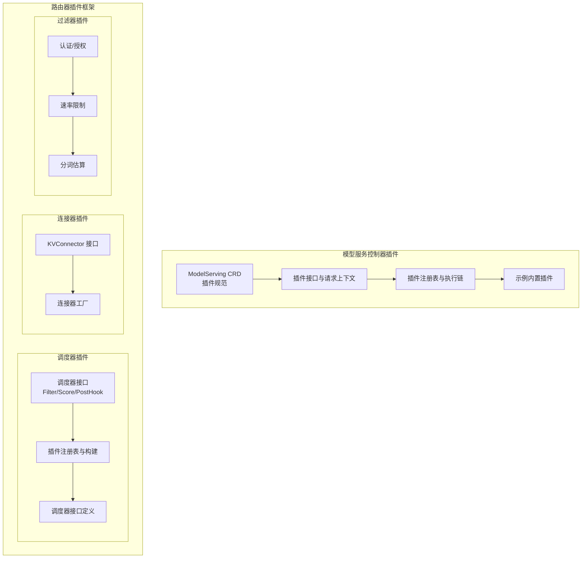
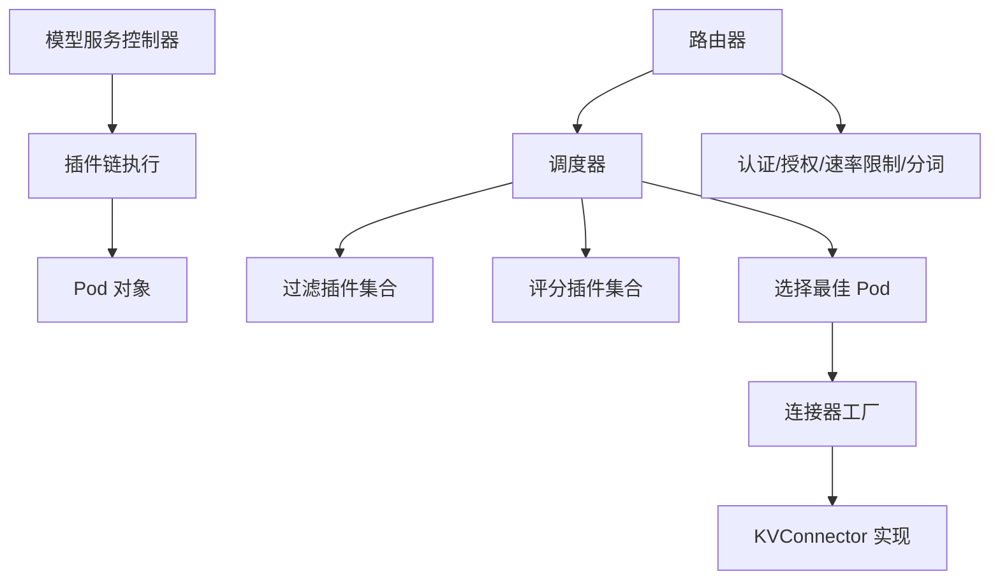
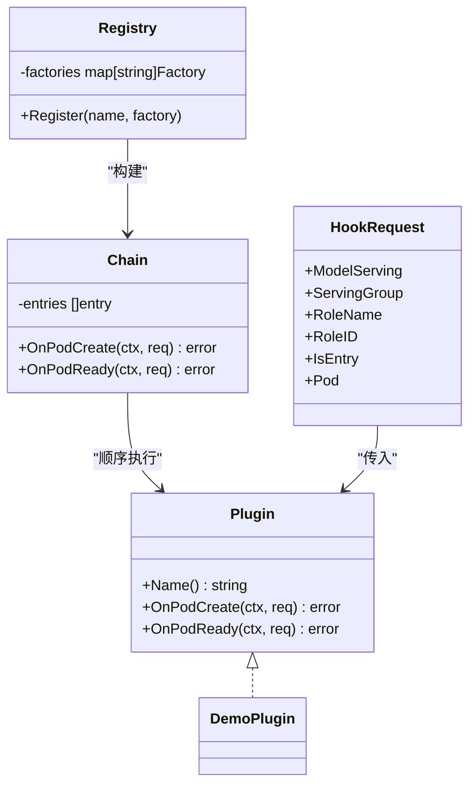
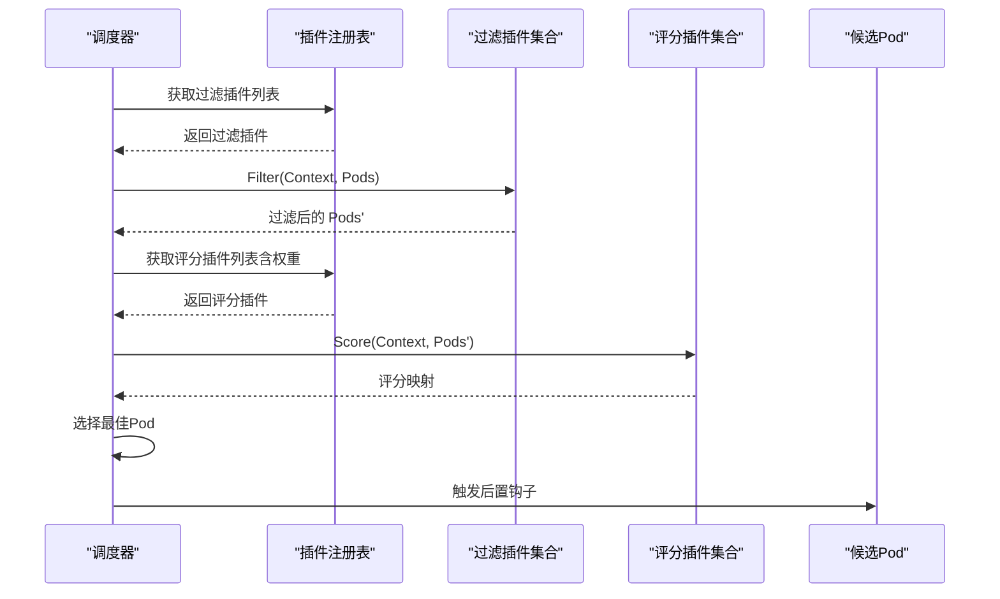
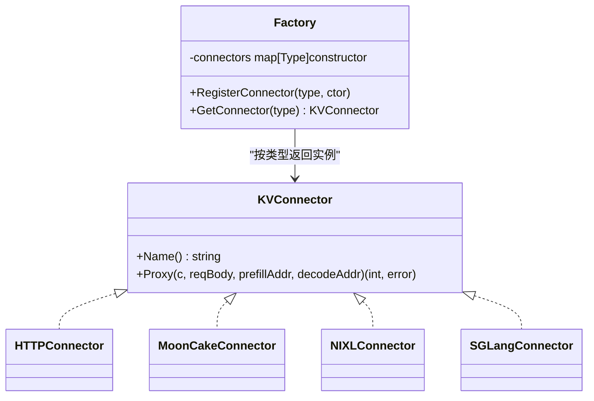
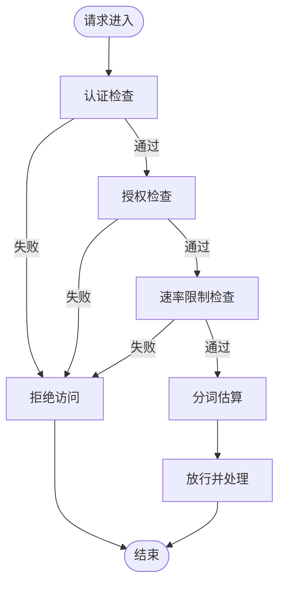
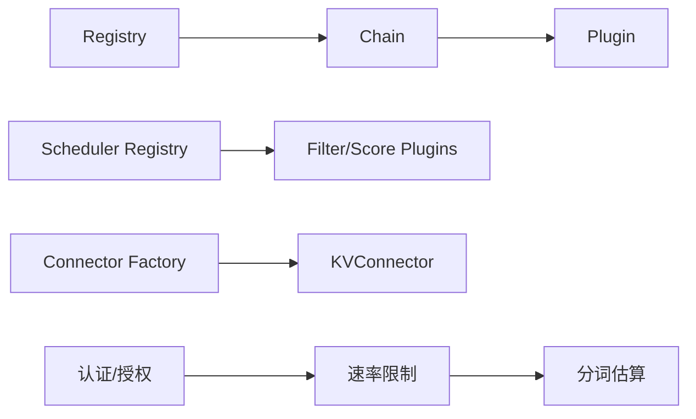

# 插件开发指南

<cite>
**本文引用的文件**
- [pkg/model-serving-controller/plugins/types.go](file://pkg/model-serving-controller/plugins/types.go)
- [pkg/model-serving-controller/plugins/manager.go](file://pkg/model-serving-controller/plugins/manager.go)
- [pkg/model-serving-controller/plugins/demo_plugin.go](file://pkg/model-serving-controller/plugins/demo_plugin.go)
- [pkg/kthena-router/scheduler/framework/interface.go](file://pkg/kthena-router/scheduler/framework/interface.go)
- [pkg/kthena-router/scheduler/factory.go](file://pkg/kthena-router/scheduler/factory.go)
- [pkg/kthena-router/scheduler/scheduler.go](file://pkg/kthena-router/scheduler/scheduler.go)
- [pkg/kthena-router/connectors/interface.go](file://pkg/kthena-router/connectors/interface.go)
- [pkg/kthena-router/connectors/factory.go](file://pkg/kthena-router/connectors/factory.go)
- [pkg/kthena-router/filters/auth/authentication.go](file://pkg/kthena-router/filters/auth/authentication.go)
- [pkg/kthena-router/filters/auth/authorization.go](file://pkg/kthena-router/filters/auth/authorization.go)
- [pkg/kthena-router/filters/ratelimit/ratelimit.go](file://pkg/kthena-router/filters/ratelimit/ratelimit.go)
- [pkg/kthena-router/filters/ratelimit/global.go](file://pkg/kthena-router/filters/ratelimit/global.go)
- [pkg/kthena-router/filters/tokenizer/estimator.go](file://pkg/kthena-router/filters/tokenizer/estimator.go)
- [client-go/applyconfiguration/workload/v1alpha1/pluginspec.go](file://client-go/applyconfiguration/workload/v1alpha1/pluginspec.go)
- [client-go/applyconfiguration/networking/v1alpha1/kvconnectorspec.go](file://client-go/applyconfiguration/networking/v1alpha1/kvconnectorspec.go)
</cite>

## 目录
1. [简介](#简介)
2. [项目结构](#项目结构)
3. [核心组件](#核心组件)
4. [架构总览](#架构总览)
5. [详细组件分析](#详细组件分析)
6. [依赖分析](#依赖分析)
7. [性能考虑](#性能考虑)
8. [故障排查指南](#故障排查指南)
9. [结论](#结论)
10. [附录](#附录)

## 简介
本指南面向希望在 Kthena 项目中开发与扩展插件能力的开发者，覆盖以下主题：
- 插件架构设计原理与扩展点识别
- 调度器插件（过滤/评分）开发：接口定义、注册机制、生命周期管理
- 连接器插件（KV 缓存/推理后端）开发：新推理引擎支持与适配器模式
- 过滤器插件（认证、授权、速率限制）开发流程
- 插件测试与验证策略（单元测试与集成测试）
- 插件配置与参数传递机制
- 最佳实践与常见陷阱

## 项目结构
Kthena 的插件体系主要分布在两个子系统：
- 模型服务控制器插件框架：用于在 Pod 创建与就绪阶段注入或调整 Pod 属性
- Kthena 路由器插件框架：包含调度器插件（过滤/评分）、连接器插件（KV 缓存/推理后端）、过滤器插件（认证/授权/速率限制/分词）

**图表来源**
- [pkg/model-serving-controller/plugins/types.go:1-45](file://pkg/model-serving-controller/plugins/types.go#L1-L45)
- [pkg/model-serving-controller/plugins/manager.go:1-148](file://pkg/model-serving-controller/plugins/manager.go#L1-L148)
- [pkg/model-serving-controller/plugins/demo_plugin.go:1-89](file://pkg/model-serving-controller/plugins/demo_plugin.go#L1-L89)
- [pkg/kthena-router/scheduler/framework/interface.go:1-67](file://pkg/kthena-router/scheduler/framework/interface.go#L1-L67)
- [pkg/kthena-router/scheduler/factory.go:1-144](file://pkg/kthena-router/scheduler/factory.go#L1-L144)
- [pkg/kthena-router/scheduler/scheduler.go:1-29](file://pkg/kthena-router/scheduler/scheduler.go#L1-L29)
- [pkg/kthena-router/connectors/interface.go:1-32](file://pkg/kthena-router/connectors/interface.go#L1-L32)
- [pkg/kthena-router/connectors/factory.go:1-60](file://pkg/kthena-router/connectors/factory.go#L1-L60)
- [pkg/kthena-router/filters/auth/authentication.go](file://pkg/kthena-router/filters/auth/authentication.go)
- [pkg/kthena-router/filters/auth/authorization.go](file://pkg/kthena-router/filters/auth/authorization.go)
- [pkg/kthena-router/filters/ratelimit/ratelimit.go](file://pkg/kthena-router/filters/ratelimit/ratelimit.go)
- [pkg/kthena-router/filters/ratelimit/global.go](file://pkg/kthena-router/filters/ratelimit/global.go)
- [pkg/kthena-router/filters/tokenizer/estimator.go](file://pkg/kthena-router/filters/tokenizer/estimator.go)

**章节来源**
- [pkg/model-serving-controller/plugins/types.go:1-45](file://pkg/model-serving-controller/plugins/types.go#L1-L45)
- [pkg/model-serving-controller/plugins/manager.go:1-148](file://pkg/model-serving-controller/plugins/manager.go#L1-L148)
- [pkg/kthena-router/scheduler/framework/interface.go:1-67](file://pkg/kthena-router/scheduler/framework/interface.go#L1-L67)
- [pkg/kthena-router/scheduler/factory.go:1-144](file://pkg/kthena-router/scheduler/factory.go#L1-L144)
- [pkg/kthena-router/connectors/interface.go:1-32](file://pkg/kthena-router/connectors/interface.go#L1-L32)
- [pkg/kthena-router/connectors/factory.go:1-60](file://pkg/kthena-router/connectors/factory.go#L1-L60)

## 核心组件
- 模型服务控制器插件框架
  - 插件接口与生命周期钩子：名称、Pod 创建前、Pod 就绪后
  - 注册表与执行链：按顺序执行，支持作用域匹配（角色、入口/工作节点）
  - 配置解码：从 JSON 解析到具体插件配置结构体
- 路由器调度器插件框架
  - 插件接口：FilterPlugin、ScorePlugin、PostScheduleHook
  - 注册表：按名称注册构建器，支持默认插件集合
  - 调度器接口：接收上下文与 Pod 列表，返回调度结果与后置钩子
- 连接器插件框架
  - KVConnector 接口：统一的 KV 缓存代理调用
  - 工厂：按类型选择具体连接器，默认回退到 HTTP 连接器
- 过滤器插件框架
  - 认证/授权：基于 JWT 或其他机制
  - 速率限制：单路与全局
  - 分词估算：基于分词器的令牌估算

**章节来源**
- [pkg/model-serving-controller/plugins/types.go:27-44](file://pkg/model-serving-controller/plugins/types.go#L27-L44)
- [pkg/model-serving-controller/plugins/manager.go:30-147](file://pkg/model-serving-controller/plugins/manager.go#L30-L147)
- [pkg/kthena-router/scheduler/framework/interface.go:28-66](file://pkg/kthena-router/scheduler/framework/interface.go#L28-L66)
- [pkg/kthena-router/scheduler/factory.go:29-95](file://pkg/kthena-router/scheduler/factory.go#L29-L95)
- [pkg/kthena-router/connectors/interface.go:23-31](file://pkg/kthena-router/connectors/interface.go#L23-L31)
- [pkg/kthena-router/connectors/factory.go:21-59](file://pkg/kthena-router/connectors/factory.go#L21-L59)
- [pkg/kthena-router/filters/auth/authentication.go](file://pkg/kthena-router/filters/auth/authentication.go)
- [pkg/kthena-router/filters/auth/authorization.go](file://pkg/kthena-router/filters/auth/authorization.go)
- [pkg/kthena-router/filters/ratelimit/ratelimit.go](file://pkg/kthena-router/filters/ratelimit/ratelimit.go)
- [pkg/kthena-router/filters/ratelimit/global.go](file://pkg/kthena-router/filters/ratelimit/global.go)
- [pkg/kthena-router/filters/tokenizer/estimator.go](file://pkg/kthena-router/filters/tokenizer/estimator.go)

## 架构总览
下图展示了插件体系的整体交互：控制器侧通过插件链对 Pod 生命周期进行增强；路由器侧通过调度器插件对候选 Pod 进行过滤与打分，并通过连接器插件完成 KV 缓存协调与推理后端交互；过滤器插件在路由层提供认证、授权与速率限制等横切能力。

**图表来源**
- [pkg/model-serving-controller/plugins/manager.go:59-112](file://pkg/model-serving-controller/plugins/manager.go#L59-L112)
- [pkg/kthena-router/scheduler/factory.go:66-143](file://pkg/kthena-router/scheduler/factory.go#L66-L143)
- [pkg/kthena-router/connectors/factory.go:38-59](file://pkg/kthena-router/connectors/factory.go#L38-L59)
- [pkg/kthena-router/scheduler/scheduler.go:25-28](file://pkg/kthena-router/scheduler/scheduler.go#L25-L28)

## 详细组件分析

### 模型服务控制器插件：接口、注册与生命周期
- 接口与生命周期
  - 插件需实现名称与两个钩子：OnPodCreate（创建前）、OnPodReady（就绪后）
  - HookRequest 提供 ModelServing、ServingGroup、RoleName、RoleID、是否入口 Pod、以及待修改的 Pod
- 注册与执行链
  - Registry 维护名称到工厂函数的映射
  - Chain 从插件规范列表构建有序执行链，按作用域判断是否运行
  - shouldRun 支持按角色与目标（入口/工作节点）筛选
- 配置与参数传递
  - 使用 DecodeJSON 将 PluginSpec.Config 解析为插件内部配置结构体
- 开发示例
  - DemoPlugin 演示了如何修改 RuntimeClassName、注解与容器环境变量

**图表来源**
- [pkg/model-serving-controller/plugins/types.go:27-44](file://pkg/model-serving-controller/plugins/types.go#L27-L44)
- [pkg/model-serving-controller/plugins/manager.go:30-147](file://pkg/model-serving-controller/plugins/manager.go#L30-L147)
- [pkg/model-serving-controller/plugins/demo_plugin.go:28-88](file://pkg/model-serving-controller/plugins/demo_plugin.go#L28-L88)

**章节来源**
- [pkg/model-serving-controller/plugins/types.go:27-44](file://pkg/model-serving-controller/plugins/types.go#L27-L44)
- [pkg/model-serving-controller/plugins/manager.go:59-147](file://pkg/model-serving-controller/plugins/manager.go#L59-L147)
- [pkg/model-serving-controller/plugins/demo_plugin.go:43-88](file://pkg/model-serving-controller/plugins/demo_plugin.go#L43-L88)

### 调度器插件：接口、注册与调度流程
- 插件接口
  - FilterPlugin：根据上下文过滤候选 Pod
  - ScorePlugin：对通过过滤的 Pod 打分（0-100）
  - PostScheduleHook：调度完成后执行的后置钩子
- 注册与构建
  - PluginRegistry 维护两类构建器：评分与过滤
  - registerDefaultPlugins 注册默认插件集合（如 GPU 缓存使用、延迟、请求数、随机、前缀缓存、KV感知、LoRA 亲和等）
  - getFilterPlugins/getScorePlugins 依据配置名称与权重构建插件实例
- 调度器接口
  - Scheduler 接口定义 Schedule 与 RunPostHooks，接收 Context 与 Pod 列表

**图表来源**
- [pkg/kthena-router/scheduler/factory.go:66-143](file://pkg/kthena-router/scheduler/factory.go#L66-L143)
- [pkg/kthena-router/scheduler/framework/interface.go:49-66](file://pkg/kthena-router/scheduler/framework/interface.go#L49-L66)
- [pkg/kthena-router/scheduler/scheduler.go:25-28](file://pkg/kthena-router/scheduler/scheduler.go#L25-L28)

**章节来源**
- [pkg/kthena-router/scheduler/framework/interface.go:28-66](file://pkg/kthena-router/scheduler/framework/interface.go#L28-L66)
- [pkg/kthena-router/scheduler/factory.go:29-143](file://pkg/kthena-router/scheduler/factory.go#L29-L143)
- [pkg/kthena-router/scheduler/scheduler.go:25-28](file://pkg/kthena-router/scheduler/scheduler.go#L25-L28)

### 连接器插件：KV 缓存代理与适配器模式
- 接口定义
  - KVConnector 定义 Name 与 Proxy 方法，Proxy 负责完整的 prefill-decode 流程协调与输出 token 数统计
- 工厂与默认实现
  - Factory 维护类型到构造器的映射
  - NewDefaultFactory 注册 HTTP、LMCache（HTTP）、MoonCake、NIXL、SGLang 等连接器
  - GetConnector 未命中时默认返回 HTTP 连接器
- 新推理引擎接入步骤
  - 实现 KVConnector 接口
  - 在工厂中注册类型到构造器
  - 在路由层通过配置选择该连接器类型

**图表来源**
- [pkg/kthena-router/connectors/interface.go:23-31](file://pkg/kthena-router/connectors/interface.go#L23-L31)
- [pkg/kthena-router/connectors/factory.go:21-59](file://pkg/kthena-router/connectors/factory.go#L21-L59)

**章节来源**
- [pkg/kthena-router/connectors/interface.go:23-31](file://pkg/kthena-router/connectors/interface.go#L23-L31)
- [pkg/kthena-router/connectors/factory.go:21-59](file://pkg/kthena-router/connectors/factory.go#L21-L59)

### 过滤器插件：认证、授权与速率限制
- 认证与授权
  - authentication.go 提供认证逻辑入口
  - authorization.go 提供授权逻辑入口
- 速率限制
  - ratelimit.go 提供单路速率限制
  - global.go 提供全局速率限制
- 分词估算
  - estimator.go 提供分词估算工具
  - tiktoken.go/tensorizer 等可作为分词实现

**图表来源**
- [pkg/kthena-router/filters/auth/authentication.go](file://pkg/kthena-router/filters/auth/authentication.go)
- [pkg/kthena-router/filters/auth/authorization.go](file://pkg/kthena-router/filters/auth/authorization.go)
- [pkg/kthena-router/filters/ratelimit/ratelimit.go](file://pkg/kthena-router/filters/ratelimit/ratelimit.go)
- [pkg/kthena-router/filters/ratelimit/global.go](file://pkg/kthena-router/filters/ratelimit/global.go)
- [pkg/kthena-router/filters/tokenizer/estimator.go](file://pkg/kthena-router/filters/tokenizer/estimator.go)

**章节来源**
- [pkg/kthena-router/filters/auth/authentication.go](file://pkg/kthena-router/filters/auth/authentication.go)
- [pkg/kthena-router/filters/auth/authorization.go](file://pkg/kthena-router/filters/auth/authorization.go)
- [pkg/kthena-router/filters/ratelimit/ratelimit.go](file://pkg/kthena-router/filters/ratelimit/ratelimit.go)
- [pkg/kthena-router/filters/ratelimit/global.go](file://pkg/kthena-router/filters/ratelimit/global.go)
- [pkg/kthena-router/filters/tokenizer/estimator.go](file://pkg/kthena-router/filters/tokenizer/estimator.go)

## 依赖分析
- 控制器插件链依赖 Registry 与 PluginSpec，执行链按作用域过滤
- 调度器插件依赖注册表与权重配置，过滤与评分插件独立存在
- 连接器插件依赖工厂按类型选择实现，HTTP 为默认回退
- 过滤器插件彼此独立，按顺序执行

**图表来源**
- [pkg/model-serving-controller/plugins/manager.go:59-112](file://pkg/model-serving-controller/plugins/manager.go#L59-L112)
- [pkg/kthena-router/scheduler/factory.go:66-143](file://pkg/kthena-router/scheduler/factory.go#L66-L143)
- [pkg/kthena-router/connectors/factory.go:38-59](file://pkg/kthena-router/connectors/factory.go#L38-L59)

**章节来源**
- [pkg/model-serving-controller/plugins/manager.go:59-112](file://pkg/model-serving-controller/plugins/manager.go#L59-L112)
- [pkg/kthena-router/scheduler/factory.go:66-143](file://pkg/kthena-router/scheduler/factory.go#L66-L143)
- [pkg/kthena-router/connectors/factory.go:38-59](file://pkg/kthena-router/connectors/factory.go#L38-L59)

## 性能考虑
- 插件链顺序与作用域：尽量将快速短路的过滤插件前置，减少后续插件负担
- 评分插件权重：合理设置权重，避免负权重导致无效计算
- 连接器选择：优先选择与后端一致的连接器类型，减少协议转换开销
- 速率限制粒度：在单路与全局之间平衡，避免过度限制吞吐
- 分词估算：使用高效分词器，避免在高频路径重复计算

## 故障排查指南
- 插件未生效
  - 检查插件名称是否正确注册，作用域是否匹配当前角色与目标
  - 确认插件工厂是否成功构建实例
- 调度异常
  - 查看日志中插件获取失败与权重非法提示
  - 核对插件名称与权重配置
- 连接器错误
  - 确认连接器类型是否在工厂注册
  - 默认回退到 HTTP 连接器时，检查后端地址与协议
- 过滤器失败
  - 认证/授权失败通常最先触发，检查凭据与权限
  - 速率限制失败检查配额与窗口

**章节来源**
- [pkg/model-serving-controller/plugins/manager.go:66-78](file://pkg/model-serving-controller/plugins/manager.go#L66-L78)
- [pkg/kthena-router/scheduler/factory.go:100-104](file://pkg/kthena-router/scheduler/factory.go#L100-L104)
- [pkg/kthena-router/scheduler/factory.go:117-120](file://pkg/kthena-router/scheduler/factory.go#L117-L120)
- [pkg/kthena-router/connectors/factory.go:38-44](file://pkg/kthena-router/connectors/factory.go#L38-L44)

## 结论
Kthena 的插件体系以清晰的接口与注册机制为核心，分别覆盖模型服务控制器、路由器调度器、连接器与过滤器四大领域。通过标准化的生命周期钩子、作用域控制与配置解码，开发者可以快速扩展新的插件能力。建议在开发过程中遵循“小步快跑、单元测试先行、集成测试覆盖”的原则，确保插件的稳定性与可维护性。

## 附录

### 插件开发最佳实践
- 明确职责边界：每个插件专注单一功能，避免“上帝对象”
- 参数化配置：通过 PluginSpec.Config 传递参数，使用 DecodeJSON 解析
- 作用域控制：合理使用 Scope.Roles 与 Scope.Target，避免对无关角色生效
- 日志与可观测性：记录关键事件与错误，便于定位问题
- 兼容性与回退：连接器默认回退到 HTTP，调度器插件权重非法自动修正

### 常见陷阱与规避
- 插件名称冲突：确保注册名称唯一
- 权重非法：避免负权重，必要时进行校验与修正
- 作用域误配：确认角色与目标匹配，避免插件不生效
- 配置解析失败：对 DecodeJSON 的错误进行处理与告警
- 并发安全：插件内部状态应避免共享可变状态，必要时加锁

### 插件配置与参数传递机制
- 控制器插件
  - 通过 PluginSpec.Config 传递 JSON 配置，使用 DecodeJSON 解析为结构体
  - 作用域通过 Scope.Roles 与 Scope.Target 控制
- 路由器插件
  - 调度器插件通过注册表按名称构建，权重在配置中指定
  - 连接器通过类型选择，工厂默认回退到 HTTP
- 过滤器插件
  - 认证/授权/速率限制/分词估算均以独立模块存在，按顺序执行

**章节来源**
- [pkg/model-serving-controller/plugins/manager.go:141-147](file://pkg/model-serving-controller/plugins/manager.go#L141-L147)
- [pkg/model-serving-controller/plugins/manager.go:122-139](file://pkg/model-serving-controller/plugins/manager.go#L122-L139)
- [pkg/kthena-router/scheduler/factory.go:114-143](file://pkg/kthena-router/scheduler/factory.go#L114-L143)
- [pkg/kthena-router/connectors/factory.go:38-59](file://pkg/kthena-router/connectors/factory.go#L38-L59)