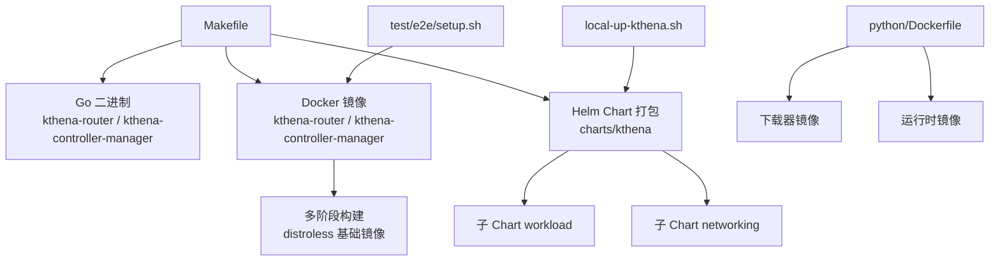
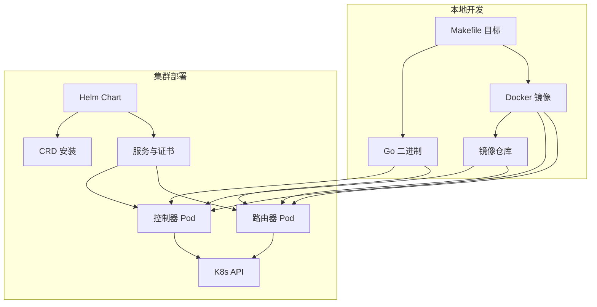
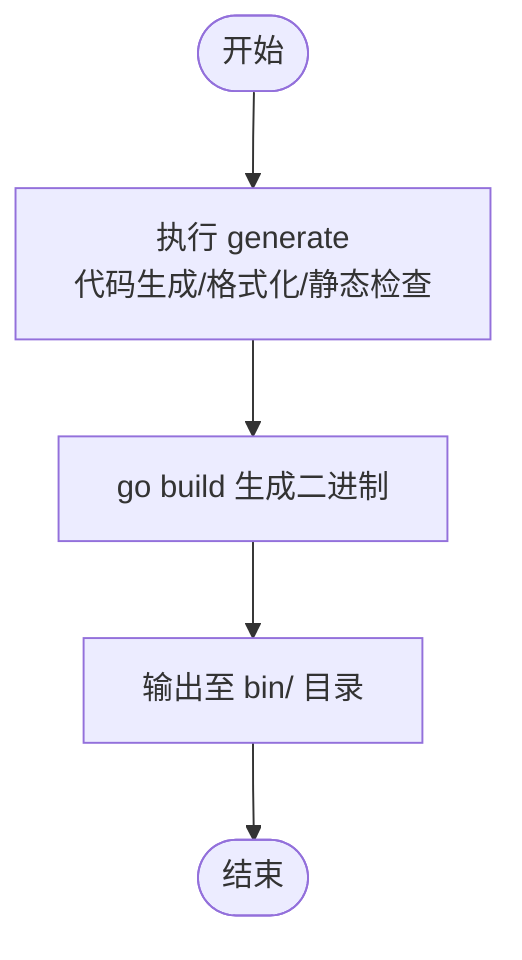
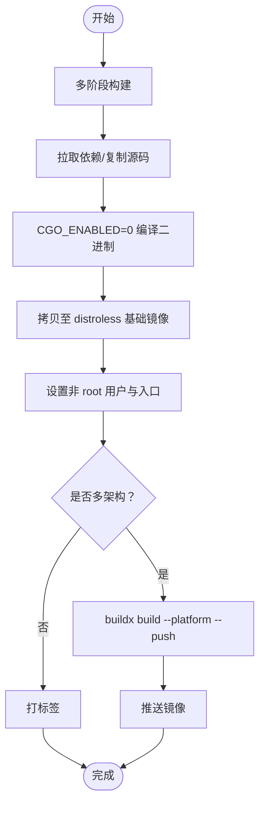
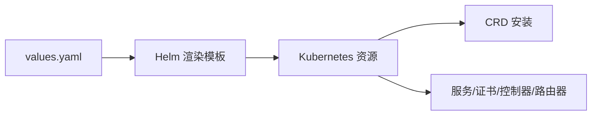
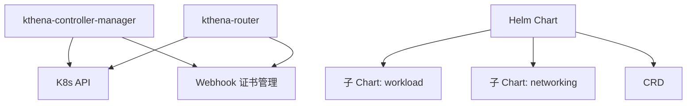

# 构建与部署

<cite>
**本文引用的文件**
- [Makefile](file://Makefile)
- [Chart.yaml](file://charts/kthena/Chart.yaml)
- [values.yaml](file://charts/kthena/values.yaml)
- [Dockerfile.kthena-controller-manager](file://docker/Dockerfile.kthena-controller-manager)
- [Dockerfile.kthena-router](file://docker/Dockerfile.kthena-router)
- [Dockerfile](file://python/Dockerfile)
- [main.go（kthena-router）](file://cmd/kthena-router/main.go)
- [main.go（kthena-controller-manager）](file://cmd/kthena-controller-manager/main.go)
- [.github/release.yml](file://.github/release.yml)
- [local-up-kthena.sh](file://hack/local-up-kthena.sh)
- [setup.sh（e2e）](file://test/e2e/setup.sh)
- [build.sh（benchmark）](file://benchmark/kthena-router/build.sh)
</cite>

## 目录
1. [简介](#简介)
2. [项目结构](#项目结构)
3. [核心组件](#核心组件)
4. [架构总览](#架构总览)
5. [详细组件分析](#详细组件分析)
6. [依赖关系分析](#依赖关系分析)
7. [性能考虑](#性能考虑)
8. [故障排查指南](#故障排查指南)
9. [结论](#结论)
10. [附录](#附录)

## 简介
本指南面向 Kthena 项目的构建与部署，覆盖以下主题：
- 二进制编译：Go 二进制产物的生成与交叉平台构建
- 容器镜像：基于多阶段构建的镜像制作与跨架构支持
- Helm Chart：Chart 版本管理、子 Chart 依赖与参数化配置
- Makefile 目标：常用构建、测试、文档生成、许可证检查等任务
- 本地开发环境：一键安装与卸载、集群准备、镜像加载
- CI/CD 与自动化：版本与变更日志、发布流程与镜像推送
- 多架构镜像：Buildx 平台列表与镜像推送策略
- 部署验证与回滚：健康检查、回滚策略与常见问题定位

## 项目结构
Kthena 采用模块化组织方式，核心目录职责如下：
- cmd：可执行程序入口（控制器与路由器）
- pkg：业务与控制器逻辑
- charts/kthena：主 Chart 及子 Chart（workload、networking）
- docker：Go 应用镜像多阶段构建
- python：Python 下载器与运行时镜像
- test/e2e：端到端测试脚本与集群准备
- hack：本地安装脚本与工具
- .github：发布配置（变更日志分类）

图表来源
- [Makefile:155-211](file://Makefile#L155-L211)
- [Dockerfile.kthena-controller-manager:1-33](file://docker/Dockerfile.kthena-controller-manager#L1-L33)
- [Dockerfile.kthena-router:1-33](file://docker/Dockerfile.kthena-router#L1-L33)
- [Dockerfile:1-55](file://python/Dockerfile#L1-L55)
- [Chart.yaml:1-22](file://charts/kthena/Chart.yaml#L1-L22)
- [values.yaml:1-97](file://charts/kthena/values.yaml#L1-L97)
- [local-up-kthena.sh:28-54](file://hack/local-up-kthena.sh#L28-L54)
- [setup.sh（e2e）:36-44](file://test/e2e/setup.sh#L36-L44)

章节来源
- [Makefile:155-211](file://Makefile#L155-L211)
- [Chart.yaml:1-22](file://charts/kthena/Chart.yaml#L1-L22)
- [values.yaml:1-97](file://charts/kthena/values.yaml#L1-L97)
- [Dockerfile.kthena-controller-manager:1-33](file://docker/Dockerfile.kthena-controller-manager#L1-L33)
- [Dockerfile.kthena-router:1-33](file://docker/Dockerfile.kthena-router#L1-L33)
- [Dockerfile:1-55](file://python/Dockerfile#L1-L55)
- [local-up-kthena.sh:28-54](file://hack/local-up-kthena.sh#L28-L54)
- [setup.sh（e2e）:36-44](file://test/e2e/setup.sh#L36-L44)

## 核心组件
- kthena-router：HTTP 路由与网关 API 支持、内置 Admission Webhook、调试服务器
- kthena-controller-manager：控制器集合（模型服务、模型增强器、自动伸缩）、统一 Webhook 服务
- Helm Chart：主 Chart 包含 workload 与 networking 子 Chart，支持 TLS、证书管理模式、功能开关
- Python 镜像：下载器与运行时镜像，分别作为独立容器或组合镜像的目标

章节来源
- [main.go（kthena-router）:40-122](file://cmd/kthena-router/main.go#L40-L122)
- [main.go（kthena-controller-manager）:54-111](file://cmd/kthena-controller-manager/main.go#L54-L111)
- [Chart.yaml:1-22](file://charts/kthena/Chart.yaml#L1-L22)
- [values.yaml:1-97](file://charts/kthena/values.yaml#L1-L97)
- [Dockerfile:1-55](file://python/Dockerfile#L1-L55)

## 架构总览
下图展示从源码到部署的关键路径：开发者在本地通过 Makefile 生成二进制与镜像；Helm 将应用与 CRD 部署到集群；控制器与路由器在集群内运行并通过 Webhook 提供准入控制。

图表来源
- [Makefile:155-211](file://Makefile#L155-L211)
- [Chart.yaml:1-22](file://charts/kthena/Chart.yaml#L1-L22)
- [values.yaml:1-97](file://charts/kthena/values.yaml#L1-L97)
- [main.go（kthena-controller-manager）:104-111](file://cmd/kthena-controller-manager/main.go#L104-L111)
- [main.go（kthena-router）:115-122](file://cmd/kthena-router/main.go#L115-L122)

## 详细组件分析

### Makefile 构建目标与使用方法
- 通用与开发类
  - help：打印所有可用目标与描述
  - generate/generate/generate-check：代码生成、DeepCopy、格式化、静态检查与版权头
  - test/test-e2e*：单元测试与多种分类的端到端测试
  - lint/lint-fix/lint-python：Go 与 Python 静态检查与修复
  - fmt/vet：代码格式化与静态分析
- 构建与二进制
  - build：编译 kthena-router、kthena-controller-manager、CLI 二进制
- 容器镜像
  - docker-build-router/docker-build-controller/docker-build-downloader/docker-build-runtime：分别构建 Go 控制器、路由器与 Python 下载器、运行时镜像
  - docker-build-all：一次性构建全部镜像
  - docker-push：推送控制器与路由器镜像
  - docker-buildx：使用 Buildx 进行多平台镜像构建与推送（默认平台列表见 Makefile）
- Helm 文档与 CRD
  - gen-crd：生成 CRD 并写入子 Chart
  - gen-docs：生成 CRD、CLI 与 Helm Chart 文档
- 依赖工具
  - controller-gen/crd-ref-docs/helm-docs/golangci-lint：按需下载与缓存工具
- 许可证与版权
  - mirror-licenses/lint-licenses/licenses-check：许可证镜像与校验
  - gen-copyright：添加版权头

章节来源
- [Makefile:25-295](file://Makefile#L25-L295)

### 二进制编译流程
- 目标：生成 kthena-router、kthena-controller-manager、CLI 三类二进制
- 步骤：先执行 generate（含代码生成与格式化），再 go build 输出到 bin/ 目录
- 适用场景：本地开发、CI 编译、离线分发

图表来源
- [Makefile:155-159](file://Makefile#L155-L159)

章节来源
- [Makefile:155-159](file://Makefile#L155-L159)

### Docker 镜像构建与多架构支持
- Go 应用镜像（kthena-controller-manager / kthena-router）
  - 多阶段构建：builder 阶段使用 golang:1.24 拉取依赖并编译，最终镜像基于 distroless/static:nonroot，非 root 用户运行
  - 支持交叉平台：通过 TARGETOS/TARGETARCH 参数传递，保持二进制与镜像平台一致
- Python 镜像（下载器/运行时）
  - 下载器镜像：预装 AWS CLI，用于模型下载
  - 运行时镜像：在下载器基础上增加运行时依赖，入口为运行时应用
- 多架构镜像
  - 使用 docker buildx，指定 PLATFORMS（默认 linux/arm64,linux/amd64），并启用 --push 推送至仓库

图表来源
- [Dockerfile.kthena-controller-manager:1-33](file://docker/Dockerfile.kthena-controller-manager#L1-L33)
- [Dockerfile.kthena-router:1-33](file://docker/Dockerfile.kthena-router#L1-L33)
- [Dockerfile:1-55](file://python/Dockerfile#L1-L55)
- [Makefile:199-211](file://Makefile#L199-L211)

章节来源
- [Dockerfile.kthena-controller-manager:1-33](file://docker/Dockerfile.kthena-controller-manager#L1-L33)
- [Dockerfile.kthena-router:1-33](file://docker/Dockerfile.kthena-router#L1-L33)
- [Dockerfile:1-55](file://python/Dockerfile#L1-L55)
- [Makefile:191-211](file://Makefile#L191-L211)

### Helm Chart 打包与参数化
- Chart 元数据
  - Chart.yaml：声明名称、类型、版本与应用版本，子 Chart 依赖 workload 与 networking
  - values.yaml：集中定义镜像仓库、标签、拉取策略、TLS、Webhook、功能开关与全局证书管理模式
- 部署要点
  - 通过 Helm 参数覆盖 values.yaml，实现不同环境差异化配置
  - 支持 cert-manager 或手动证书模式，以及 Gateway API 与推理扩展开关

图表来源
- [Chart.yaml:1-22](file://charts/kthena/Chart.yaml#L1-L22)
- [values.yaml:1-97](file://charts/kthena/values.yaml#L1-L97)

章节来源
- [Chart.yaml:1-22](file://charts/kthena/Chart.yaml#L1-L22)
- [values.yaml:1-97](file://charts/kthena/values.yaml#L1-L97)

### 本地构建环境配置与优化建议
- 工具链
  - 使用 Makefile 内置工具下载器，自动安装 controller-gen、helm-docs、crd-ref-docs、golangci-lint
  - 通过 LOCALBIN 统一管理二进制，避免系统级安装
- 一键安装
  - local-up-kthena.sh：准备镜像、创建命名空间、Helm 安装、清理与帮助
  - 支持自定义集群名、镜像前缀、Tag、命名空间与 Helm Release 名称
- 集群准备
  - e2e/setup.sh：创建 Kind 集群、构建镜像、加载到集群、安装 cert-manager 与所需 CRD

章节来源
- [Makefile:213-295](file://Makefile#L213-L295)
- [local-up-kthena.sh:17-151](file://hack/local-up-kthena.sh#L17-L151)
- [setup.sh（e2e）:17-85](file://test/e2e/setup.sh#L17-L85)

### CI/CD 流程与自动化部署
- 版本与变更日志
  - .github/release.yml：定义变更日志分类（Breaking Changes、Feature、Bug、Documentation 等），排除标签与作者
- 自动化建议
  - 触发条件：分支保护、PR 合并、标签推送
  - 步骤：代码生成与校验 → 单元测试 → 端到端测试 → 构建镜像（含多架构）→ 推送镜像 → Helm Chart 版本更新 → 发布制品
  - 注意：Chart.yaml 中 chartVersion 与 appVersion 由 CI 修改，避免手工冲突

章节来源
- [.github/release.yml:1-24](file://.github/release.yml#L1-L24)
- [Chart.yaml:5-15](file://charts/kthena/Chart.yaml#L5-L15)

### 多架构镜像构建与容器优化
- 多架构
  - 默认平台：linux/arm64,linux/amd64（可通过变量覆盖）
  - 使用 buildx 构建并推送，确保镜像可在不同 CPU 架构上运行
- 容器优化
  - distroless 基础镜像：最小化攻击面，仅包含运行时所需文件
  - 非 root 用户运行：提升安全性
  - CGO_ENABLED=0：减少动态链接与体积

章节来源
- [Makefile:191-211](file://Makefile#L191-L211)
- [Dockerfile.kthena-controller-manager:23-30](file://docker/Dockerfile.kthena-controller-manager#L23-L30)
- [Dockerfile.kthena-router:23-30](file://docker/Dockerfile.kthena-router#L23-L30)

### 部署验证与回滚策略
- 部署验证
  - 控制器：健康检查端点 /healthz
  - 路由器：调试端口 localhost 可访问，TLS 与 Webhook 证书就绪后启动
  - Helm：通过 values.yaml 开启功能开关与 TLS，结合 cert-manager 模式进行证书管理
- 回滚策略
  - Helm：升级失败时回滚到上一个版本；若需要，调整 values.yaml 关闭不兼容功能
  - 证书：当使用 cert-manager 时，确保其可用性；手动模式需提供正确的 caBundle

章节来源
- [main.go（kthena-controller-manager）:202-207](file://cmd/kthena-controller-manager/main.go#L202-L207)
- [main.go（kthena-router）:78-98](file://cmd/kthena-router/main.go#L78-L98)
- [values.yaml:85-97](file://charts/kthena/values.yaml#L85-L97)

## 依赖关系分析
- 组件耦合
  - 控制器与路由器均依赖 Kubernetes API 与 Webhook 证书管理
  - Helm Chart 依赖子 Chart 与 CRD
- 外部依赖
  - cert-manager（可选）
  - Gateway API 与推理扩展 CRD（按需）
  - Volcano LWS CRD（模型服务滚动更新相关）

图表来源
- [main.go（kthena-controller-manager）:127-151](file://cmd/kthena-controller-manager/main.go#L127-L151)
- [main.go（kthena-router）:135-152](file://cmd/kthena-router/main.go#L135-L152)
- [Chart.yaml:16-22](file://charts/kthena/Chart.yaml#L16-L22)

章节来源
- [main.go（kthena-controller-manager）:127-151](file://cmd/kthena-controller-manager/main.go#L127-L151)
- [main.go（kthena-router）:135-152](file://cmd/kthena-router/main.go#L135-L152)
- [Chart.yaml:16-22](file://charts/kthena/Chart.yaml#L16-L22)

## 性能考虑
- 构建性能
  - 使用多阶段构建与只读依赖缓存，缩短编译时间
  - 交叉编译时避免不必要的 CGO，减少体积与链接复杂度
- 运行性能
  - distroless 基础镜像减少启动与运行时开销
  - 控制器与路由器并发参数与 API QPS/Burst 可调，结合集群规模调整
- 网络与证书
  - Webhook 证书加载优先级：Secret > 文件 > 自动生成，减少启动等待
  - Gateway API 与推理扩展按需开启，降低额外处理开销

## 故障排查指南
- Webhook 证书问题
  - 现象：Webhook 无法启动或 CA Bundle 更新失败
  - 排查：确认 Secret 是否存在、证书文件路径与权限、DNS 名称是否匹配 Service
- TLS 配置错误
  - 现象：TLS 证书与密钥未成对或路径错误
  - 排查：确保同时提供证书与私钥，或启用自动生成
- 端口占用
  - 现象：调试端口或 Webhook 端口非法或被占用
  - 排查：检查端口范围与宿主占用情况
- E2E 集群准备
  - 现象：集群 Ready 超时或 CRD 未安装
  - 排查：确认 Kind 集群创建成功、镜像加载完成、CRD 安装顺序正确

章节来源
- [main.go（kthena-router）:84-98](file://cmd/kthena-router/main.go#L84-L98)
- [main.go（kthena-controller-manager）:153-184](file://cmd/kthena-controller-manager/main.go#L153-L184)
- [setup.sh（e2e）:33-80](file://test/e2e/setup.sh#L33-L80)

## 结论
本指南提供了 Kthena 从源码到部署的完整路径：通过 Makefile 统一管理构建、测试与打包；以多阶段与 distroless 镜像实现安全与高效；借助 Helm Chart 实现参数化与可维护性；配合 CI/CD 与证书管理策略保障生产可用。建议在本地使用 local-up-kthena.sh 快速验证，在 CI 中启用多架构镜像与端到端测试，确保版本与变更日志规范。

## 附录
- 本地一键安装命令参考
  - 准备镜像与安装：./hack/local-up-kthena.sh
  - 清理：./hack/local-up-kthena.sh -q
  - 预检：./hack/local-up-kthena.sh --check-only
- Benchmark 镜像构建
  - 使用 benchmark/kthena-router/build.sh 构建基准镜像

章节来源
- [local-up-kthena.sh:112-151](file://hack/local-up-kthena.sh#L112-L151)
- [build.sh（benchmark）:1-3](file://benchmark/kthena-router/build.sh#L1-L3)