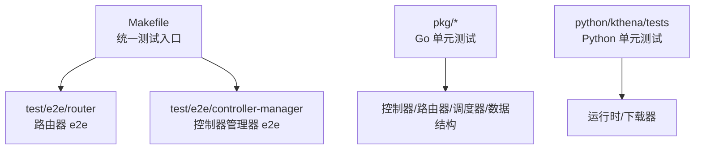
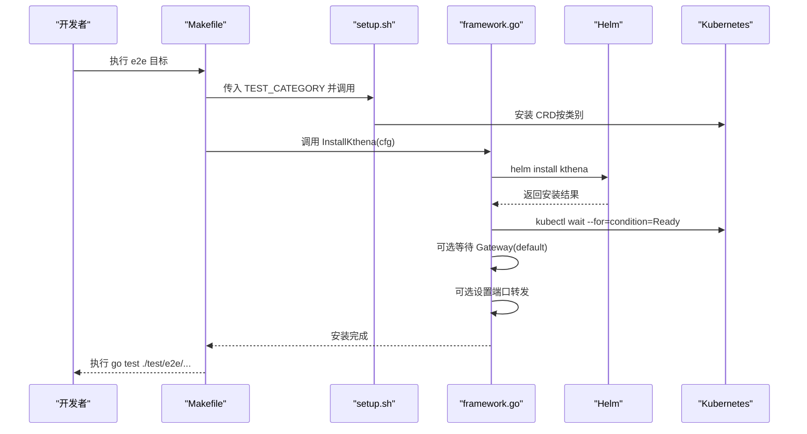
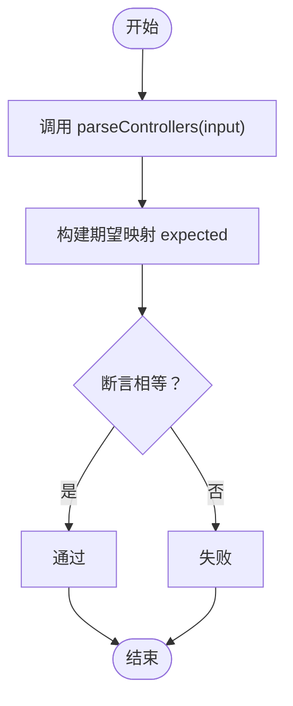
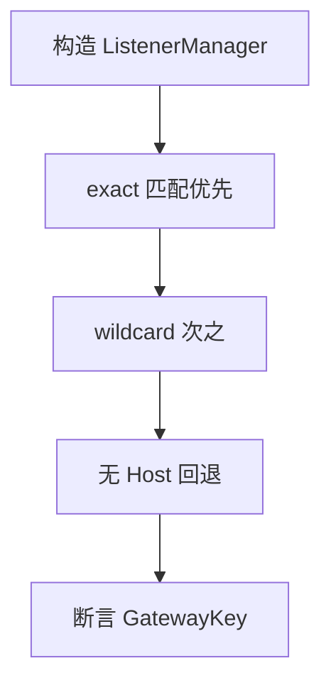
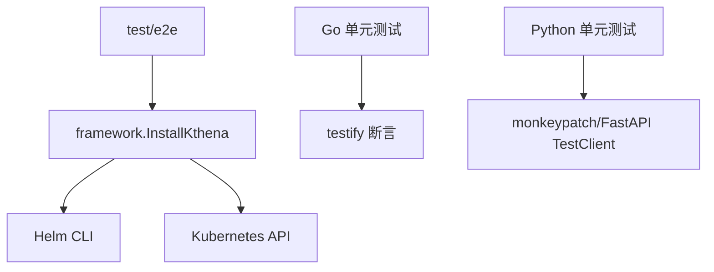

# 测试指南

<cite>
**本文引用的文件**
- [Makefile](file://Makefile)
- [test/e2e/setup.sh](file://test/e2e/setup.sh)
- [test/e2e/framework/framework.go](file://test/e2e/framework/framework.go)
- [test/e2e/router/e2e_test.go](file://test/e2e/router/e2e_test.go)
- [cmd/kthena-controller-manager/main_test.go](file://cmd/kthena-controller-manager/main_test.go)
- [cmd/kthena-router/app/router_listener_test.go](file://cmd/kthena-router/app/router_listener_test.go)
- [cmd/kthena-router/app/server_test.go](file://cmd/kthena-router/app/server_test.go)
- [pkg/autoscaler/datastructure/sliding_window_test.go](file://pkg/autoscaler/datastructure/sliding_window_test.go)
- [pkg/kthena-router/datastore/datarace_test.go](file://pkg/kthena-router/datastore/datarace_test.go)
- [pkg/kthena-router/datastore/ordering_test.go](file://pkg/kthena-router/datastore/ordering_test.go)
- [pkg/kthena-router/scheduler/plugins/kvcache_aware_test.go](file://pkg/kthena-router/scheduler/plugins/kvcache_aware_test.go)
- [pkg/kthena-router/scheduler/plugins/cache/prefix_store_test.go](file://pkg/kthena-router/scheduler/plugins/cache/prefix_store_test.go)
- [python/kthena/tests/test_runtime.py](file://python/kthena/tests/test_runtime.py)
- [python/kthena/tests/test_downloader_huggingface.py](file://python/kthena/tests/test_downloader_huggingface.py)
</cite>

## 目录
1. [简介](#简介)
2. [项目结构与测试分布](#项目结构与测试分布)
3. [核心组件与测试规范](#核心组件与测试规范)
4. [架构总览与测试关系](#架构总览与测试关系)
5. [详细组件测试分析](#详细组件测试分析)
6. [依赖关系与耦合分析](#依赖关系与耦合分析)
7. [性能与基准测试](#性能与基准测试)
8. [故障排查与常见问题](#故障排查与常见问题)
9. [结论](#结论)
10. [附录：测试环境搭建与维护](#附录测试环境搭建与维护)

## 简介
本指南面向 Kthena 项目的测试实践，覆盖单元测试、表驱动测试、并发敏感代码测试、集成测试（含 e2e）、覆盖率要求与报告、测试环境搭建与维护，以及性能与基准测试的实施建议。文档以仓库中现有测试文件为依据，提炼可复用的规范与流程，并通过图示帮助读者快速理解测试结构与关键路径。

## 项目结构与测试分布
- 单元测试（Go）广泛分布在各包内，如控制器、路由器、调度器、数据结构等模块均配有对应测试文件。
- Python 子项目在 python/kthena/tests 下提供运行时与下载器的测试。
- 集成测试位于 test/e2e，包含控制器管理器与路由器两类 e2e 场景，支持按类别选择安装 CRD 并执行测试。
- Makefile 提供统一的测试入口，包括 e2e 测试与分类执行。



**章节来源**
- [Makefile:92-120](file://Makefile#L92-L120)
- [test/e2e/setup.sh:53-84](file://test/e2e/setup.sh#L53-L84)

## 核心组件与测试规范
- 测试文件命名与组织
  - Go 单元测试文件以 _test.go 结尾，按包划分；例如控制器管理器入口测试位于 cmd/kthena-controller-manager/main_test.go。
  - Python 测试文件以 test_ 前缀与 .py 后缀命名，位于 python/kthena/tests。
- 测试函数命名
  - 使用 TestXxx 形式，描述性命名，如 TestParseControllers、TestWildcardHostnameMatch、TestNewServerDebugPortDefault。
  - 表驱动测试使用 tests 切片与 t.Run(tt.name, ...) 组织，便于扩展与维护。
- 断言与辅助库
  - 大量使用 github.com/stretchr/testify/assert 进行断言。
  - 对复杂场景使用自定义断言或错误检查，确保边界条件与异常路径被覆盖。
- 表驱动测试
  - 在多个测试文件中采用表驱动模式，覆盖正常、异常、边界与无效输入，提升可读性与可维护性。
- 并发测试
  - 使用 sync.WaitGroup 并发触发读写操作，验证锁与原子字段一致性，避免数据竞争。
  - 通过 go test -race 检测竞态条件。
- e2e 测试
  - 通过 Helm 安装 Kthena，自动等待 Pod 就绪，必要时等待 Gateway 资源生成。
  - 支持按类别安装 CRD（Gateway API、Gateway API Inference Extension、LeaderWorkerSet），并进行端口转发以便访问路由服务。
- 覆盖率与报告
  - Makefile 中未直接声明覆盖率命令；可在本地使用 go test -cover 生成覆盖率报告，结合 CI 工具统一收集与展示。

**章节来源**
- [cmd/kthena-controller-manager/main_test.go:27-156](file://cmd/kthena-controller-manager/main_test.go#L27-L156)
- [cmd/kthena-router/app/router_listener_test.go:21-130](file://cmd/kthena-router/app/router_listener_test.go#L21-L130)
- [cmd/kthena-router/app/server_test.go:25-43](file://cmd/kthena-router/app/server_test.go#L25-L43)
- [pkg/kthena-router/datastore/datarace_test.go:70-582](file://pkg/kthena-router/datastore/datarace_test.go#L70-L582)
- [test/e2e/framework/framework.go:67-136](file://test/e2e/framework/framework.go#L67-L136)

## 架构总览与测试关系
下图展示了 e2e 测试从安装到执行的关键流程，以及与 Helm、Kubernetes 资源的关系。



**图表来源**
- [Makefile:92-120](file://Makefile#L92-L120)
- [test/e2e/setup.sh:53-84](file://test/e2e/setup.sh#L53-L84)
- [test/e2e/framework/framework.go:67-136](file://test/e2e/framework/framework.go#L67-L136)

**章节来源**
- [Makefile:92-120](file://Makefile#L92-L120)
- [test/e2e/setup.sh:53-84](file://test/e2e/setup.sh#L53-L84)
- [test/e2e/framework/framework.go:67-136](file://test/e2e/framework/framework.go#L67-L136)

## 详细组件测试分析

### 控制器管理器入口解析测试
- 目标：验证控制器参数解析逻辑，支持通配符与多控制器组合，处理空格、重复与无效名称。
- 方法：表驱动测试，覆盖多种输入组合与预期映射。
- 断言：使用 assert.Equal 比较解析后的映射集合。



**图表来源**
- [cmd/kthena-controller-manager/main_test.go:27-156](file://cmd/kthena-controller-manager/main_test.go#L27-L156)

**章节来源**
- [cmd/kthena-controller-manager/main_test.go:27-156](file://cmd/kthena-controller-manager/main_test.go#L27-L156)

### 路由器监听器匹配测试
- 目标：验证通配符主机名匹配优先级与精确匹配优先级，以及无主机名监听器作为回退。
- 方法：构造 ListenerManager，分别对不同主机名进行最佳匹配查找。
- 断言：确认返回的 GatewayKey 符合优先级规则。



**图表来源**
- [cmd/kthena-router/app/router_listener_test.go:69-130](file://cmd/kthena-router/app/router_listener_test.go#L69-L130)

**章节来源**
- [cmd/kthena-router/app/router_listener_test.go:69-130](file://cmd/kthena-router/app/router_listener_test.go#L69-L130)

### 服务器调试端口默认值测试
- 目标：验证 NewServer 接受不同的调试端口值，确保 DebugPort 字段正确设置。
- 方法：表驱动测试，传入不同调试端口，断言 server.DebugPort。

**章节来源**
- [cmd/kthena-router/app/server_test.go:25-43](file://cmd/kthena-router/app/server_test.go#L25-L43)

### 自适应窗口数据结构测试
- 目标：验证最大/最小记录滑动窗口、折线图滑动窗口与快照滑动窗口的行为，包括 TTL 与时间戳控制。
- 方法：通过自定义时间戳函数模拟时间推进，逐步 Append 并 GetBest/GetLastUnfreshSnapshot。
- 断言：验证最佳值、过期行为与边界条件。

**章节来源**
- [pkg/autoscaler/datastructure/sliding_window_test.go:30-335](file://pkg/autoscaler/datastructure/sliding_window_test.go#L30-L335)

### 数据竞争检测测试
- 目标：并发更新 ModelServer 与删除/查询 Pod，确保无数据竞争，状态一致。
- 方法：多 goroutine 并发执行 AddOrUpdateModelServer、DeletePod、GetPrefillPodsForDecodeGroup 等操作。
- 断言：最终不 panic，且数据一致性满足预期。

```mermaid
sequenceDiagram
participant W as "Writer : 更新 ModelServer"
participant R1 as "Reader : 查询预填/解码组"
participant R2 as "Reader : 获取解码/预填列表"
participant D as "Deleter : 删除 Pod"
W->>W : 循环更新
D->>D : 循环删除
R1->>R1 : 循环查询
R2->>R2 : 循环查询
Note over W,D,R1,R2 : 并发执行，验证无数据竞争
```

**图表来源**
- [pkg/kthena-router/datastore/datarace_test.go:70-582](file://pkg/kthena-router/datastore/datarace_test.go#L70-L582)

**章节来源**
- [pkg/kthena-router/datastore/datarace_test.go:70-582](file://pkg/kthena-router/datastore/datarace_test.go#L70-L582)

### 数据存储关系与生命周期测试
- 目标：验证 ModelServer 与 Pod 的关系建立、更新与删除，以及多 ModelServer/多 Pod 的复杂场景。
- 方法：构造 Store 与 Mock 后端，按顺序添加/更新/删除，断言关系映射与计数。
- 断言：Pod 关联的 ModelServer 数量、是否存在、是否能正确获取 Pod 列表。

**章节来源**
- [pkg/kthena-router/datastore/ordering_test.go:75-546](file://pkg/kthena-router/datastore/ordering_test.go#L75-L546)

### 键值缓存感知插件哈希测试
- 目标：验证标准化哈希计算的正确性与分布性，确保不同顺序产生不同哈希，且分布均匀。
- 方法：生成序列并计算哈希，统计低半区与高半区数量，断言分布合理性。

**章节来源**
- [pkg/kthena-router/scheduler/plugins/kvcache_aware_test.go:1944-1990](file://pkg/kthena-router/scheduler/plugins/kvcache_aware_test.go#L1944-L1990)

### 缓存前缀存储并发压力测试
- 目标：验证并发 Add/FindTopMatches/Delete 的稳定性与性能特征。
- 方法：多 goroutine 混合操作，使用 WaitGroup 控制并发度，基准测试中批量执行。
- 断言：不 panic，操作成功，基准指标可记录。

**章节来源**
- [pkg/kthena-router/scheduler/plugins/cache/prefix_store_test.go:594-734](file://pkg/kthena-router/scheduler/plugins/cache/prefix_store_test.go#L594-L734)

### Python 运行时与下载器测试
- 目标：验证运行时接口（如加载/卸载 LoRA 适配器）与下载器（HuggingFace 等）的行为与异常处理。
- 方法：使用 FastAPI TestClient 与 httpx.AsyncClient/FakeClient 注入，模拟引擎响应与异步下载。
- 断言：HTTP 状态码、响应体结构与异步任务返回码。

**章节来源**
- [python/kthena/tests/test_runtime.py:79-154](file://python/kthena/tests/test_runtime.py#L79-L154)
- [python/kthena/tests/test_downloader_huggingface.py:33-127](file://python/kthena/tests/test_downloader_huggingface.py#L33-L127)

## 依赖关系与耦合分析
- e2e 测试依赖 Helm 与 Kubernetes 资源，通过 framework.InstallKthena 完成安装与等待，再进行端口转发以便访问路由服务。
- 单元测试之间相对独立，主要依赖标准库与 testify 断言库；部分测试通过 Mock 或 Fake 类型注入外部依赖。
- Python 测试通过 monkeypatch 注入假客户端，隔离网络与外部服务。



**图表来源**
- [test/e2e/framework/framework.go:67-136](file://test/e2e/framework/framework.go#L67-L136)
- [python/kthena/tests/test_runtime.py:80-154](file://python/kthena/tests/test_runtime.py#L80-L154)

**章节来源**
- [test/e2e/framework/framework.go:67-136](file://test/e2e/framework/framework.go#L67-L136)
- [python/kthena/tests/test_runtime.py:80-154](file://python/kthena/tests/test_runtime.py#L80-L154)

## 性能与基准测试
- 基准测试（Benchmark）已在部分模块中实现，如前缀存储的混合负载基准，用于评估并发场景下的吞吐与分配情况。
- 建议在关键路径（如调度器、数据存储、连接器）补充基准测试，使用 go test -bench=... 与 -benchmem 输出内存分配指标。
- 结合 Prometheus 指标与日志埋点，持续跟踪关键指标变化，配合 e2e 场景验证端到端性能。

**章节来源**
- [pkg/kthena-router/scheduler/plugins/cache/prefix_store_test.go:713-734](file://pkg/kthena-router/scheduler/plugins/cache/prefix_store_test.go#L713-L734)

## 故障排查与常见问题
- e2e 测试失败
  - 检查 Kind 是否安装，集群创建与 CRD 安装是否成功。
  - 查看安装日志与 Pod 就绪状态，确认 Gateway 资源是否按需生成。
- 数据竞争
  - 使用 go test -race 定位竞态；参考 datarace_test.go 中的并发场景设计，确保共享资源加锁或使用原子类型。
- 断言失败
  - 使用表驱动测试的详细用例定位边界条件；对复杂对象使用结构化断言与分步验证。
- Python 测试异常
  - 确认 TestClient 注入的假客户端与路径匹配；检查异步下载场景的状态码与响应体。

**章节来源**
- [test/e2e/setup.sh:53-84](file://test/e2e/setup.sh#L53-L84)
- [pkg/kthena-router/datastore/datarace_test.go:70-582](file://pkg/kthena-router/datastore/datarace_test.go#L70-L582)
- [python/kthena/tests/test_runtime.py:79-154](file://python/kthena/tests/test_runtime.py#L79-L154)

## 结论
本指南基于仓库现有测试文件，总结了 Kthena 项目的测试规范与实践路径。建议在后续迭代中：
- 统一覆盖率目标并在 CI 中强制报告；
- 在关键模块补充基准测试；
- 规范 e2e 测试的 CRD 选择与资源清理；
- 强化并发敏感代码的竞态检测与注释说明。

## 附录：测试环境搭建与维护
- 本地开发
  - 安装 Kind、Helm、kubectl，确保可用性。
  - 使用 Makefile 提供的 e2e 目标一键执行安装与测试。
- e2e 资源准备
  - setup.sh 根据 TEST_CATEGORY 安装相应 CRD；framework.InstallKthena 通过 Helm 安装 Kthena 并等待就绪。
- 测试数据与模拟
  - Go 单元测试通过结构体与函数注入依赖；Python 测试通过 monkeypatch 注入假客户端。
- 清理与回收
  - e2e 测试在 TestMain 中统一清理命名空间、卸载 Kthena，避免资源泄漏。

**章节来源**
- [Makefile:92-120](file://Makefile#L92-L120)
- [test/e2e/setup.sh:53-84](file://test/e2e/setup.sh#L53-L84)
- [test/e2e/framework/framework.go:138-158](file://test/e2e/framework/framework.go#L138-L158)
- [test/e2e/router/e2e_test.go:35-90](file://test/e2e/router/e2e_test.go#L35-L90)