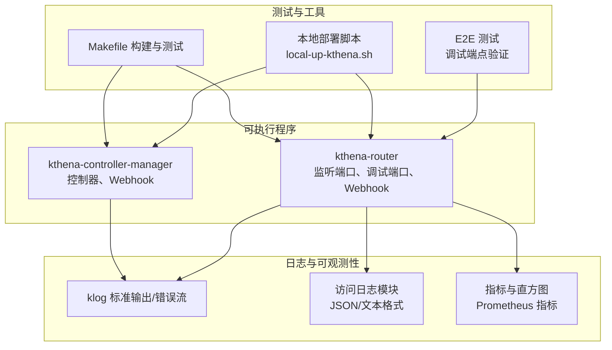
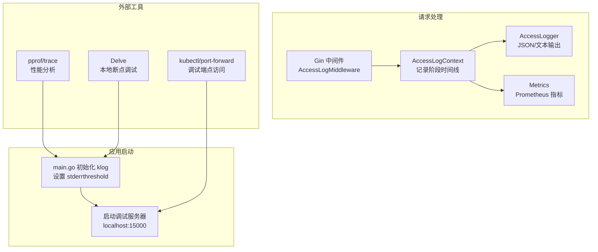
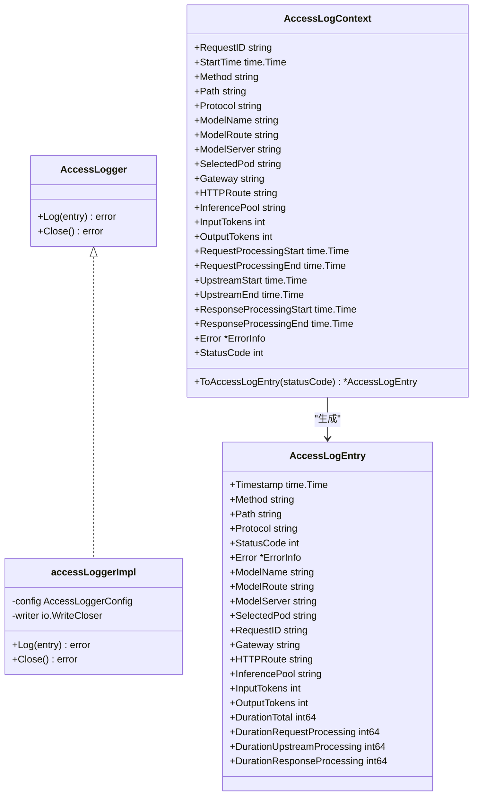
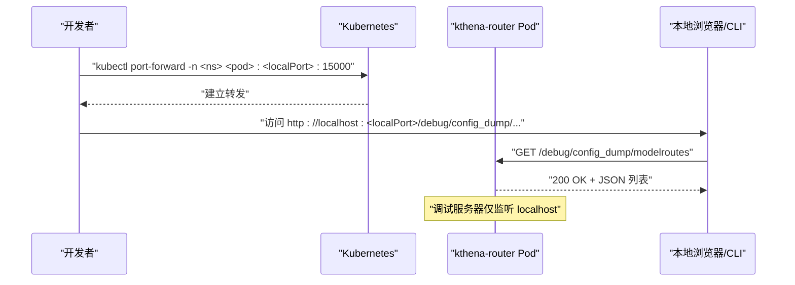
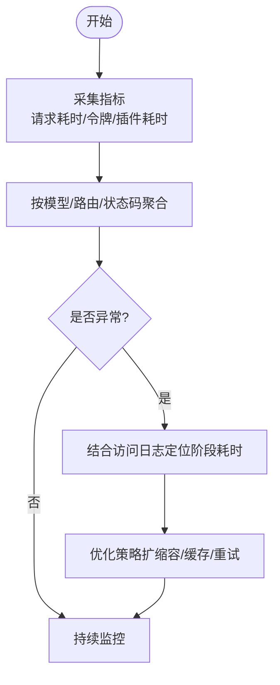

# 调试工具与技巧

<cite>
**本文引用的文件**   
- [cmd/kthena-router/main.go](file://cmd/kthena-router/main.go)
- [cmd/kthena-router/app/router.go](file://cmd/kthena-router/app/router.go)
- [pkg/kthena-router/accesslog/logger.go](file://pkg/kthena-router/accesslog/logger.go)
- [pkg/kthena-router/accesslog/middleware.go](file://pkg/kthena-router/accesslog/middleware.go)
- [pkg/kthena-router/accesslog/types.go](file://pkg/kthena-router/accesslog/types.go)
- [pkg/kthena-router/metrics/metrics.go](file://pkg/kthena-router/metrics/metrics.go)
- [test/e2e/router/debug_test.go](file://test/e2e/router/debug_test.go)
- [test/e2e/utils/pod.go](file://test/e2e/utils/pod.go)
- [hack/local-up-kthena.sh](file://hack/local-up-kthena.sh)
- [Makefile](file://Makefile)
- [.golangci.yaml](file://.golangci.yaml)
- [go.sum](file://go.sum)
</cite>

## 目录
1. [简介](#简介)
2. [项目结构](#项目结构)
3. [核心组件](#核心组件)
4. [架构总览](#架构总览)
5. [详细组件分析](#详细组件分析)
6. [依赖分析](#依赖分析)
7. [性能考虑](#性能考虑)
8. [故障排查指南](#故障排查指南)
9. [结论](#结论)
10. [附录](#附录)

## 简介
本指南面向 Kthena 项目的开发者与运维工程师，系统性介绍本地与集群环境下的调试方法与技巧，覆盖以下主题：
- 使用 Go 调试器（Delve）进行本地调试
- 日志系统与日志级别设置，区分访问日志与调试日志
- 性能分析工具使用：pprof、trace、内存分析
- 基于 kubectl 的问题诊断方法
- 容器内调试：日志查看、进程检查、网络诊断
- 常见问题排查流程与解决方案
- 开发工具链配置与优化建议

## 项目结构
Kthena 由两个主要可执行程序组成：kthena-router（AI 路由器）与 kthena-controller-manager（控制器管理器）。两者均采用 klog 进行结构化日志输出，并在启动时初始化 klog 标志位以控制日志级别。

图表来源
- [cmd/kthena-router/main.go:58-82](file://cmd/kthena-router/main.go#L58-L82)
- [cmd/kthena-controller-manager/main.go:60-85](file://cmd/kthena-controller-manager/main.go#L60-L85)
- [pkg/kthena-router/accesslog/logger.go:69-98](file://pkg/kthena-router/accesslog/logger.go#L69-L98)
- [pkg/kthena-router/metrics/metrics.go:236-447](file://pkg/kthena-router/metrics/metrics.go#L236-L447)
- [test/e2e/router/debug_test.go:32-107](file://test/e2e/router/debug_test.go#L32-L107)
- [hack/local-up-kthena.sh:37-54](file://hack/local-up-kthena.sh#L37-L54)
- [Makefile:155-160](file://Makefile#L155-L160)

章节来源
- [cmd/kthena-router/main.go:58-82](file://cmd/kthena-router/main.go#L58-L82)
- [cmd/kthena-controller-manager/main.go:60-85](file://cmd/kthena-controller-manager/main.go#L60-L85)
- [hack/local-up-kthena.sh:37-54](file://hack/local-up-kthena.sh#L37-L54)
- [Makefile:155-160](file://Makefile#L155-L160)

## 核心组件
- 启动参数与日志级别
  - 两可执行程序在启动时调用 klog.InitFlags 并显式设置 stderrthreshold，确保 INFO 及以上级别输出到标准错误，便于与业务日志分离。
  - kthena-router 提供 -debug-port 参数，默认 15000；kthena-controller-manager 支持 -workers、-controllers、-kube-api-qps/-kube-api-burst 等。
- 访问日志模块
  - 支持 JSON 与文本两种格式，输出到 stdout、stderr 或文件；默认启用。
  - 中间件在请求生命周期中记录关键阶段耗时与路由信息，便于定位延迟瓶颈。
- 指标模块
  - Prometheus 指标用于记录请求耗时、令牌数、调度插件耗时等，便于性能分析与告警。
- 调试端点
  - kthena-router 在 localhost 上启动独立调试服务器，暴露资源列表与详情接口，仅限本机访问，避免对外暴露。

章节来源
- [cmd/kthena-router/main.go:58-82](file://cmd/kthena-router/main.go#L58-L82)
- [cmd/kthena-controller-manager/main.go:60-85](file://cmd/kthena-controller-manager/main.go#L60-L85)
- [pkg/kthena-router/accesslog/logger.go:69-98](file://pkg/kthena-router/accesslog/logger.go#L69-L98)
- [pkg/kthena-router/accesslog/middleware.go:30-63](file://pkg/kthena-router/accesslog/middleware.go#L30-L63)
- [pkg/kthena-router/metrics/metrics.go:236-447](file://pkg/kthena-router/metrics/metrics.go#L236-L447)
- [cmd/kthena-router/app/router.go:107-156](file://cmd/kthena-router/app/router.go#L107-L156)

## 架构总览
下图展示本地调试与集群观测的关键交互路径：应用启动、日志输出、访问日志中间件、指标采集与调试端点。

图表来源
- [cmd/kthena-router/main.go:58-82](file://cmd/kthena-router/main.go#L58-L82)
- [cmd/kthena-router/app/router.go:107-156](file://cmd/kthena-router/app/router.go#L107-L156)
- [pkg/kthena-router/accesslog/middleware.go:30-63](file://pkg/kthena-router/accesslog/middleware.go#L30-L63)
- [pkg/kthena-router/accesslog/types.go:169-223](file://pkg/kthena-router/accesslog/types.go#L169-L223)
- [pkg/kthena-router/metrics/metrics.go:236-447](file://pkg/kthena-router/metrics/metrics.go#L236-L447)

## 详细组件分析

### 组件一：访问日志系统（AccessLog）
- 配置项
  - format: json 或 text
  - output: stdout、stderr 或文件路径
  - enabled: 是否启用
- 生命周期
  - 中间件在请求进入时生成请求 ID 与上下文，记录请求阶段起止时间；完成后生成 AccessLogEntry 并写入指定输出。
- 输出字段
  - 包含标准 HTTP 字段、错误类型与消息、模型路由与选择的后端 Pod、网关 API 相关信息、令牌统计与三段耗时（请求处理、上游处理、响应处理）。

图表来源
- [pkg/kthena-router/accesslog/logger.go:28-136](file://pkg/kthena-router/accesslog/logger.go#L28-L136)
- [pkg/kthena-router/accesslog/types.go:23-97](file://pkg/kthena-router/accesslog/types.go#L23-L97)
- [pkg/kthena-router/accesslog/types.go:169-223](file://pkg/kthena-router/accesslog/types.go#L169-L223)

章节来源
- [pkg/kthena-router/accesslog/logger.go:69-98](file://pkg/kthena-router/accesslog/logger.go#L69-L98)
- [pkg/kthena-router/accesslog/middleware.go:30-63](file://pkg/kthena-router/accesslog/middleware.go#L30-L63)
- [pkg/kthena-router/accesslog/types.go:169-223](file://pkg/kthena-router/accesslog/types.go#L169-L223)

### 组件二：调试端点与本地访问流程
- 调试端点
  - 仅绑定 localhost，避免从 Pod IP 直接访问；通过 kubectl port-forward 将 Pod 内 15000 映射到本地端口进行访问。
  - 支持列出与获取 modelroutes、modelservers、pods、gateways、httproutes、inferencepools 等资源。
- 本地验证
  - E2E 测试先尝试通过 Pod IP 访问失败，再通过 port-forward 成功访问，验证端点安全与可用性。

图表来源
- [test/e2e/router/debug_test.go:32-107](file://test/e2e/router/debug_test.go#L32-L107)
- [cmd/kthena-router/app/router.go:107-156](file://cmd/kthena-router/app/router.go#L107-L156)

章节来源
- [test/e2e/router/debug_test.go:32-107](file://test/e2e/router/debug_test.go#L32-L107)
- [cmd/kthena-router/app/router.go:107-156](file://cmd/kthena-router/app/router.go#L107-L156)

### 组件三：性能指标与分析
- 指标类别
  - 请求耗时、令牌统计、速率限制触发、调度插件耗时、活跃下游请求数等。
- 使用建议
  - 结合 Grafana/Prometheus 展示关键指标，定位异常峰值与慢请求。
  - 对热点模型或路由进行分组聚合，识别性能瓶颈。

图表来源
- [pkg/kthena-router/metrics/metrics.go:236-447](file://pkg/kthena-router/metrics/metrics.go#L236-L447)

章节来源
- [pkg/kthena-router/metrics/metrics.go:236-447](file://pkg/kthena-router/metrics/metrics.go#L236-L447)

## 依赖分析
- Go 工具链与构建
  - Makefile 提供构建、测试、文档生成、镜像构建与推送等目标，便于本地快速验证。
- 代码质量与静态检查
  - .golangci.yaml 配置了多类 linter，如 gofmt、govet、ineffassign、staticcheck、unused 等，确保代码一致性与潜在问题早发现。
- 外部依赖
  - go.sum 中包含 google/pprof，可用于性能分析与 CPU/内存采样。

章节来源
- [Makefile:155-160](file://Makefile#L155-L160)
- [.golangci.yaml:23-42](file://.golangci.yaml#L23-L42)
- [go.sum:109-110](file://go.sum#L109-L110)

## 性能考虑
- pprof
  - 在应用中启用 pprof（通常通过 net/http/pprof 注册），通过本地端口或 port-forward 访问 /debug/pprof/ 接口，抓取 CPU/heap/profile 数据。
  - 结合 go tool pprof 分析火焰图与热点函数，定位 CPU 占用高或内存分配异常的代码路径。
- trace
  - 使用 go tool trace 生成运行轨迹，观察 Goroutine、GC、锁竞争等并发行为，辅助定位阻塞与调度问题。
- 内存分析
  - 使用 pprof heap profile 与 go tool pprof 查看堆快照，识别对象泄漏与异常增长趋势。
- 指标联动
  - 将 Prometheus 指标与访问日志中的阶段耗时（请求处理、上游处理、响应处理）关联，定位具体环节的性能瓶颈。

[本节为通用指导，无需特定文件引用]

## 故障排查指南
- 日志级别与输出
  - 确认启动参数已设置 stderrthreshold 为 INFO，以便将业务日志与调试信息清晰分离。
- 访问日志验证
  - 通过 kubectl logs 获取 Pod 最新日志，结合 E2E 工具 WaitForPodLogsContain 等方法验证关键日志片段出现。
- 调试端点可用性
  - 先尝试通过 Pod IP 访问调试端点应失败（仅 localhost），再使用 port-forward 访问成功。
- 控制器与 Webhook
  - kthena-controller-manager 支持 -enable-webhook、-workers、-controllers 等参数；可通过健康检查端点 /healthz 验证服务可用性。
- 本地部署与回滚
  - 使用 hack/local-up-kthena.sh 快速安装/卸载，便于在本地集群验证问题与回归。

章节来源
- [cmd/kthena-router/main.go:58-82](file://cmd/kthena-router/main.go#L58-L82)
- [test/e2e/utils/pod.go:82-126](file://test/e2e/utils/pod.go#L82-L126)
- [test/e2e/router/debug_test.go:32-107](file://test/e2e/router/debug_test.go#L32-L107)
- [cmd/kthena-controller-manager/main.go:60-85](file://cmd/kthena-controller-manager/main.go#L60-L85)
- [hack/local-up-kthena.sh:37-54](file://hack/local-up-kthena.sh#L37-L54)

## 结论
通过统一的日志级别、结构化的访问日志、完善的指标体系以及受控的调试端点，Kthena 提供了从本地到集群的全链路可观测能力。配合 pprof/trace 与 kubectl 工具，能够高效定位性能瓶颈与异常根因，保障推理服务的稳定性与可维护性。

[本节为总结，无需特定文件引用]

## 附录

### 本地调试（Delve）
- 安装与配置
  - 使用 go install golang.org/dl/dlv 安装 Delve。
  - 在本地以可调试模式运行可执行程序（例如通过 Makefile 目标或直接 go run）。
- 断点与会话
  - 使用 dlv attach 或 dlv exec 连接到进程，设置断点后逐步执行，观察变量与调用栈。
- 注意事项
  - 确保可执行程序未被 systemd/systemd-managed 环境剥离符号信息；必要时使用非精简二进制。

[本节为通用指导，无需特定文件引用]

### 日志系统与日志级别
- 启动参数
  - kthena-router：-port、-tls-cert、-tls-key、-enable-webhook、-enable-gateway-api、-enable-gateway-api-inference-extension、-webhook-port、-webhook-tls-cert-file、-webhook-tls-private-key-file、-cert-secret-name、-webhook-service-name、-debug-port、-kube-api-qps、-kube-api-burst。
  - kthena-controller-manager：-kubeconfig、-master、-tls-cert-file、-tls-private-key-file、-port、-webhook-timeout、-cert-secret-name、-service-name、-leader-elect、-workers、-controllers、-kube-api-qps、-kube-api-burst。
- 日志级别
  - 启动时设置 stderrthreshold 为 INFO，确保业务日志与调试信息清晰分离。

章节来源
- [cmd/kthena-router/main.go:67-81](file://cmd/kthena-router/main.go#L67-L81)
- [cmd/kthena-controller-manager/main.go:69-85](file://cmd/kthena-controller-manager/main.go#L69-L85)
- [cmd/kthena-router/main.go:58-66](file://cmd/kthena-router/main.go#L58-L66)
- [cmd/kthena-controller-manager/main.go:60-68](file://cmd/kthena-controller-manager/main.go#L60-L68)

### 访问日志与调试日志
- 访问日志（AccessLog）
  - 由中间件在请求完成后生成，包含请求方法、路径、协议、状态码、错误信息、模型/路由/后端信息、令牌统计与三段耗时。
- 调试日志（应用日志）
  - 由 klog 输出，包含启动参数、证书加载、健康检查、关闭流程等关键事件。

章节来源
- [pkg/kthena-router/accesslog/middleware.go:30-63](file://pkg/kthena-router/accesslog/middleware.go#L30-L63)
- [pkg/kthena-router/accesslog/types.go:169-223](file://pkg/kthena-router/accesslog/types.go#L169-L223)
- [cmd/kthena-router/main.go:100-102](file://cmd/kthena-router/main.go#L100-L102)

### 性能分析工具使用
- pprof
  - 在应用中注册 pprof（net/http/pprof），通过本地端口或 port-forward 访问 /debug/pprof/，抓取 CPU/heap/profile。
- trace
  - 使用 go tool trace 生成运行轨迹，观察并发与调度行为。
- 内存分析
  - 使用 heap profile 与 go tool pprof 分析对象分配与泄漏。

章节来源
- [go.sum:109-110](file://go.sum#L109-L110)

### kubectl 与 Kubernetes 工具
- 常用命令
  - kubectl get pods -n <namespace>、kubectl logs -n <namespace> <pod> -c <container>、kubectl port-forward -n <namespace> <pod>:<local>:<remote>。
- 资源观测
  - 结合调试端点与指标面板，定位资源不足、调度异常或网络连通性问题。

章节来源
- [test/e2e/router/debug_test.go:63-107](file://test/e2e/router/debug_test.go#L63-L107)

### 容器内调试方法
- 日志查看
  - 使用 kubectl logs 获取最新日志；结合 E2E 工具等待日志片段出现。
- 进程检查
  - 使用 kubectl exec -it -n <namespace> <pod> -- ps aux 或 top 观察进程状态。
- 网络诊断
  - 使用 kubectl exec -it -n <namespace> <pod> -- curl/nc 检查端点可达性；结合调试端点验证内部状态。

章节来源
- [test/e2e/utils/pod.go:82-126](file://test/e2e/utils/pod.go#L82-L126)

### 开发工具链配置与优化
- 代码规范
  - 使用 golangci-lint（.golangci.yaml）进行静态检查，保持代码一致性与质量。
- 构建与测试
  - 使用 Makefile 目标进行构建、测试与文档生成；E2E 测试提供端到端验证。
- 本地部署
  - 使用 hack/local-up-kthena.sh 快速安装/卸载，便于本地验证与回归。

章节来源
- [.golangci.yaml:23-42](file://.golangci.yaml#L23-L42)
- [Makefile:83-101](file://Makefile#L83-L101)
- [hack/local-up-kthena.sh:37-54](file://hack/local-up-kthena.sh#L37-L54)