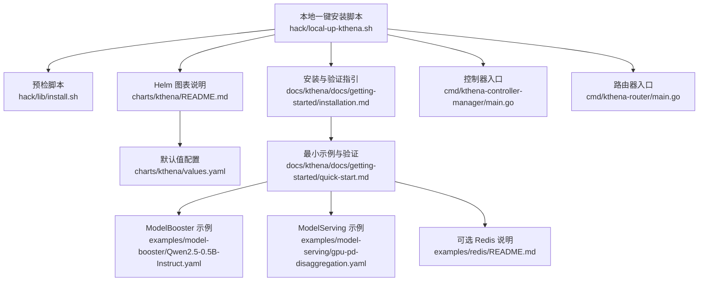
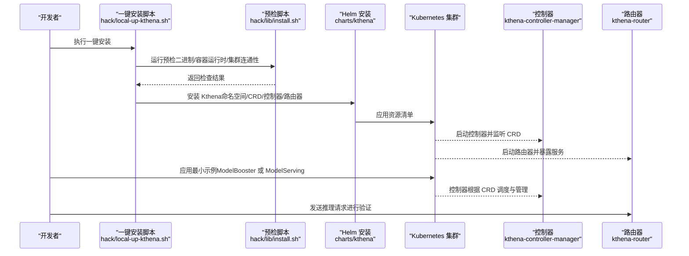
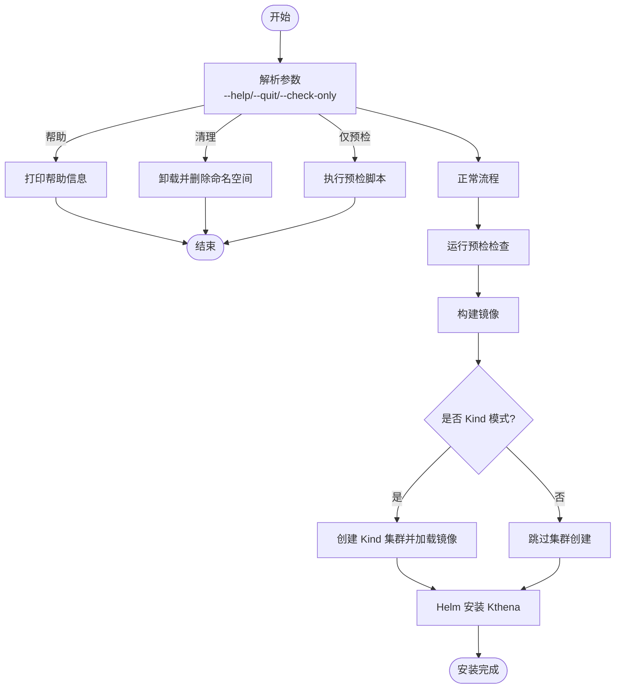
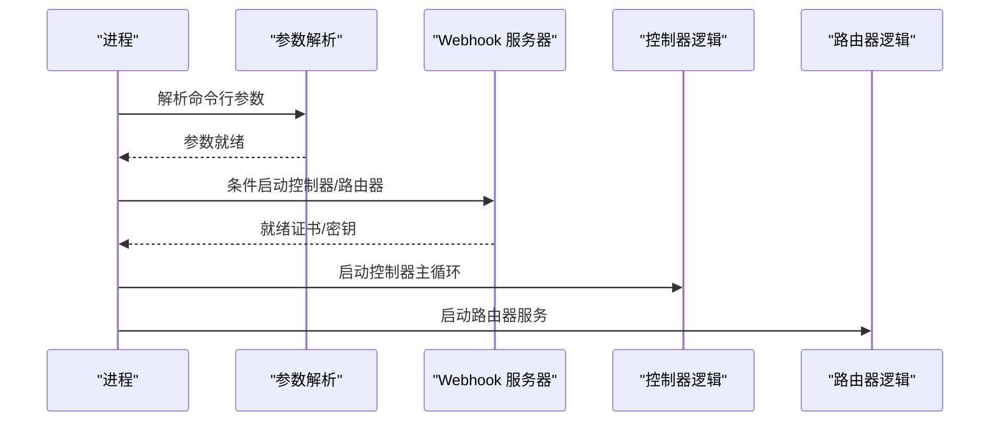
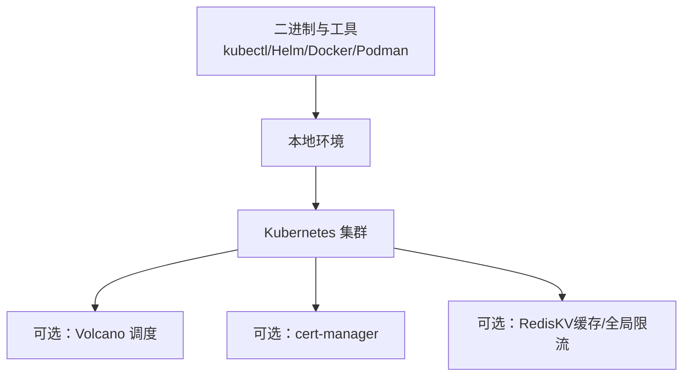

# 快速开始

<cite>
**本文引用的文件**   
- [README.md](file://README.md)
- [local-up-kthena.sh](file://hack/local-up-kthena.sh)
- [install.sh](file://hack/lib/install.sh)
- [charts/kthena/README.md](file://charts/kthena/README.md)
- [charts/kthena/values.yaml](file://charts/kthena/values.yaml)
- [docs/kthena/docs/getting-started/installation.md](file://docs/kthena/docs/getting-started/installation.md)
- [docs/kthena/docs/getting-started/quick-start.md](file://docs/kthena/docs/getting-started/quick-start.md)
- [examples/model-booster/Qwen2.5-0.5B-Instruct.yaml](file://examples/model-booster/Qwen2.5-0.5B-Instruct.yaml)
- [examples/model-serving/gpu-pd-disaggregation.yaml](file://examples/model-serving/gpu-pd-disaggregation.yaml)
- [cmd/kthena-controller-manager/main.go](file://cmd/kthena-controller-manager/main.go)
- [cmd/kthena-router/main.go](file://cmd/kthena-router/main.go)
- [examples/redis/README.md](file://examples/redis/README.md)
</cite>

## 目录
1. [简介](#简介)
2. [项目结构](#项目结构)
3. [核心组件](#核心组件)
4. [架构总览](#架构总览)
5. [详细组件解析](#详细组件解析)
6. [依赖关系分析](#依赖关系分析)
7. [性能与容量规划](#性能与容量规划)
8. [故障排查指南](#故障排查指南)
9. [结论](#结论)
10. [附录：后续学习路径与资源](#附录后续学习路径与资源)

## 简介
本“快速开始”面向希望在几分钟内完成 Kthena 平台部署与基础验证的用户，覆盖从环境准备、依赖安装、集群配置到最小可行部署与验证的全流程。文档同时提供一键安装脚本的使用方法与常用选项说明，并给出基于 ModelBooster 的最小示例，帮助你在最短时间内看到效果。

Kthena 是一个原生 Kubernetes 的大模型推理平台，通过 CRD 声明式管理模型生命周期，并以智能路由组件承载数据面流量，支持多后端（vLLM、SGLang、Triton 等）与前缀-解码拆分等高级特性。

**章节来源**
- [README.md:1-107](file://README.md#L1-L107)

## 项目结构
为便于快速上手，建议关注以下关键目录与文件：
- 一键安装与预检：hack/local-up-kthena.sh、hack/lib/install.sh
- Helm 部署说明与值配置：charts/kthena/README.md、charts/kthena/values.yaml
- 安装与验证指引：docs/kthena/docs/getting-started/installation.md
- 最小可行示例与推理验证：docs/kthena/docs/getting-started/quick-start.md、examples/model-booster/Qwen2.5-0.5B-Instruct.yaml、examples/model-serving/gpu-pd-disaggregation.yaml
- 控制器与路由器入口：cmd/kthena-controller-manager/main.go、cmd/kthena-router/main.go
- Redis 可选依赖：examples/redis/README.md

**图表来源**
- [local-up-kthena.sh:1-151](file://hack/local-up-kthena.sh#L1-L151)
- [install.sh:1-252](file://hack/lib/install.sh#L1-L252)
- [charts/kthena/README.md:1-255](file://charts/kthena/README.md#L1-L255)
- [charts/kthena/values.yaml:1-97](file://charts/kthena/values.yaml#L1-L97)
- [docs/kthena/docs/getting-started/installation.md:1-137](file://docs/kthena/docs/getting-started/installation.md#L1-L137)
- [docs/kthena/docs/getting-started/quick-start.md:1-161](file://docs/kthena/docs/getting-started/quick-start.md#L1-L161)
- [examples/model-booster/Qwen2.5-0.5B-Instruct.yaml:1-34](file://examples/model-booster/Qwen2.5-0.5B-Instruct.yaml#L1-L34)
- [examples/model-serving/gpu-pd-disaggregation.yaml:1-183](file://examples/model-serving/gpu-pd-disaggregation.yaml#L1-L183)
- [cmd/kthena-controller-manager/main.go:1-332](file://cmd/kthena-controller-manager/main.go#L1-L332)
- [cmd/kthena-router/main.go:1-226](file://cmd/kthena-router/main.go#L1-L226)
- [examples/redis/README.md:1-73](file://examples/redis/README.md#L1-L73)

**章节来源**
- [README.md:1-107](file://README.md#L1-L107)
- [local-up-kthena.sh:1-151](file://hack/local-up-kthena.sh#L1-L151)
- [charts/kthena/README.md:1-255](file://charts/kthena/README.md#L1-L255)
- [charts/kthena/values.yaml:1-97](file://charts/kthena/values.yaml#L1-L97)
- [docs/kthena/docs/getting-started/installation.md:1-137](file://docs/kthena/docs/getting-started/installation.md#L1-L137)
- [docs/kthena/docs/getting-started/quick-start.md:1-161](file://docs/kthena/docs/getting-started/quick-start.md#L1-L161)
- [examples/model-booster/Qwen2.5-0.5B-Instruct.yaml:1-34](file://examples/model-booster/Qwen2.5-0.5B-Instruct.yaml#L1-L34)
- [examples/model-serving/gpu-pd-disaggregation.yaml:1-183](file://examples/model-serving/gpu-pd-disaggregation.yaml#L1-L183)
- [cmd/kthena-controller-manager/main.go:1-332](file://cmd/kthena-controller-manager/main.go#L1-L332)
- [cmd/kthena-router/main.go:1-226](file://cmd/kthena-router/main.go#L1-L226)
- [examples/redis/README.md:1-73](file://examples/redis/README.md#L1-L73)

## 核心组件
- 控制平面（kthena-controller-manager）
  - 负责模型生命周期管理、滚动更新、弹性伸缩策略等；支持 Webhook（校验/变更）与领导者选举。
  - 关键入口与参数参见：[cmd/kthena-controller-manager/main.go:54-111](file://cmd/kthena-controller-manager/main.go#L54-L111)
- 数据平面（kthena-router）
  - 推理流量入口，负责请求分类、负载均衡与路由控制；可选内置 Webhook。
  - 关键入口与参数参见：[cmd/kthena-router/main.go:40-122](file://cmd/kthena-router/main.go#L40-L122)
- Helm 图表（charts/kthena）
  - 提供 CRD、RBAC、Deployment、Service 等资源的统一打包与安装；支持多种证书管理模式与可选 Redis。
  - 参考：[charts/kthena/README.md:17-255](file://charts/kthena/README.md#L17-L255)、[charts/kthena/values.yaml:1-97](file://charts/kthena/values.yaml#L1-L97)

**章节来源**
- [cmd/kthena-controller-manager/main.go:54-111](file://cmd/kthena-controller-manager/main.go#L54-L111)
- [cmd/kthena-router/main.go:40-122](file://cmd/kthena-router/main.go#L40-L122)
- [charts/kthena/README.md:17-255](file://charts/kthena/README.md#L17-L255)
- [charts/kthena/values.yaml:1-97](file://charts/kthena/values.yaml#L1-L97)

## 架构总览
下图展示从一键安装到最小示例验证的总体流程与组件交互：

**图表来源**
- [local-up-kthena.sh:126-139](file://hack/local-up-kthena.sh#L126-L139)
- [install.sh:184-223](file://hack/lib/install.sh#L184-L223)
- [charts/kthena/README.md:27-133](file://charts/kthena/README.md#L27-L133)
- [cmd/kthena-controller-manager/main.go:104-111](file://cmd/kthena-controller-manager/main.go#L104-L111)
- [cmd/kthena-router/main.go:121](file://cmd/kthena-router/main.go#L121)

**章节来源**
- [local-up-kthena.sh:126-139](file://hack/local-up-kthena.sh#L126-L139)
- [install.sh:184-223](file://hack/lib/install.sh#L184-L223)
- [charts/kthena/README.md:27-133](file://charts/kthena/README.md#L27-L133)
- [cmd/kthena-controller-manager/main.go:104-111](file://cmd/kthena-controller-manager/main.go#L104-L111)
- [cmd/kthena-router/main.go:121](file://cmd/kthena-router/main.go#L121)

## 详细组件解析

### 一键安装脚本（local-up-kthena.sh）
- 功能概览
  - 自动化构建镜像、创建命名空间、调用 Helm 安装 Kthena。
  - 支持 Kind 集群自动创建与镜像加载、现有集群模式切换、仅执行预检等。
- 常用选项
  - 查看帮助：--help
  - 清理安装：-q 或 --quit
  - 仅预检：--check-only
  - 自定义集群名、Kind 选项、镜像前缀、Tag、命名空间、Release 名称等环境变量
- 关键流程
  - 预检：check-prerequisites → 检查 kubectl、Helm、容器运行时、集群可达性
  - 准备：install-helm、make docker-build-all
  - 安装：helm upgrade --install 指向 charts/kthena
  - 输出安装成功信息与状态查询命令

**图表来源**
- [local-up-kthena.sh:71-109](file://hack/local-up-kthena.sh#L71-L109)
- [local-up-kthena.sh:118-124](file://hack/local-up-kthena.sh#L118-L124)
- [local-up-kthena.sh:126-139](file://hack/local-up-kthena.sh#L126-L139)
- [install.sh:184-223](file://hack/lib/install.sh#L184-L223)

**章节来源**
- [local-up-kthena.sh:71-109](file://hack/local-up-kthena.sh#L71-L109)
- [local-up-kthena.sh:118-124](file://hack/local-up-kthena.sh#L118-L124)
- [local-up-kthena.sh:126-139](file://hack/local-up-kthena.sh#L126-L139)
- [install.sh:184-223](file://hack/lib/install.sh#L184-L223)

### Helm 安装与配置（charts/kthena）
- 安装方式
  - 直接从 OCI 仓库安装（推荐）
  - 使用单文件清单直接应用
  - 下载 Chart 包离线安装
- 配置项
  - 控制器副本数、路由器副本数、TLS 开关、证书管理模式（auto/cert-manager/manual）
  - 子图表启用/禁用（workload/networking）
- 可选组件
  - Redis：当使用 KV 缓存或全局限流时需要单独部署
  - cert-manager：如需自动签发证书

**章节来源**
- [charts/kthena/README.md:26-133](file://charts/kthena/README.md#L26-L133)
- [charts/kthena/README.md:165-213](file://charts/kthena/README.md#L165-L213)
- [charts/kthena/README.md:214-255](file://charts/kthena/README.md#L214-L255)
- [charts/kthena/values.yaml:1-97](file://charts/kthena/values.yaml#L1-L97)

### 最小可行部署与验证（ModelBooster）
- 步骤
  - 创建 ModelBooster 资源（示例文件已提供）
  - 等待条件 Active 变为 True
  - 通过 kthena-router Service 进行推理请求
- 示例参考
  - 示例清单：[examples/model-booster/Qwen2.5-0.5B-Instruct.yaml:1-34](file://examples/model-booster/Qwen2.5-0.5B-Instruct.yaml#L1-L34)
  - 验证命令与路由地址获取：[docs/kthena/docs/getting-started/quick-start.md:32-98](file://docs/kthena/docs/getting-started/quick-start.md#L32-L98)

**章节来源**
- [docs/kthena/docs/getting-started/quick-start.md:24-98](file://docs/kthena/docs/getting-started/quick-start.md#L24-L98)
- [examples/model-booster/Qwen2.5-0.5B-Instruct.yaml:1-34](file://examples/model-booster/Qwen2.5-0.5B-Instruct.yaml#L1-L34)

### 最小可行部署与验证（ModelServing + PD 拆分）
- 步骤
  - 应用 ModelServing 示例（含 prefill/decode 角色）
  - 等待所有 Serving 组就绪
  - 配置 ModelRoute/ModelServer 后进行推理
- 示例参考
  - 示例清单：[examples/model-serving/gpu-pd-disaggregation.yaml:1-183](file://examples/model-serving/gpu-pd-disaggregation.yaml#L1-L183)
  - 验证命令与路由地址获取：[docs/kthena/docs/getting-started/quick-start.md:99-161](file://docs/kthena/docs/getting-started/quick-start.md#L99-L161)

**章节来源**
- [docs/kthena/docs/getting-started/quick-start.md:99-161](file://docs/kthena/docs/getting-started/quick-start.md#L99-L161)
- [examples/model-serving/gpu-pd-disaggregation.yaml:1-183](file://examples/model-serving/gpu-pd-disaggregation.yaml#L1-L183)

### 控制器与路由器启动流程
- 控制器（kthena-controller-manager）
  - 解析标志位（kubeconfig、leader-elect、workers、controllers 列表等）
  - 可选启动 Webhook（校验/变更），并处理健康检查
- 路由器（kthena-router）
  - 解析监听端口、TLS、Gateway API 开关、调试端口等
  - 可选启动 Webhook 并进行证书管理

**图表来源**
- [cmd/kthena-controller-manager/main.go:54-111](file://cmd/kthena-controller-manager/main.go#L54-L111)
- [cmd/kthena-router/main.go:40-122](file://cmd/kthena-router/main.go#L40-L122)

**章节来源**
- [cmd/kthena-controller-manager/main.go:54-111](file://cmd/kthena-controller-manager/main.go#L54-L111)
- [cmd/kthena-router/main.go:40-122](file://cmd/kthena-router/main.go#L40-L122)

## 依赖关系分析
- 二进制与工具
  - kubectl、Helm、容器运行时（Docker/Podman）、Kind/K3d/Minikube（任选其一）
- 集群要求
  - Kubernetes 版本、管理员权限、Volcano（可选，用于调度能力）
- 可选依赖
  - cert-manager（证书自动管理）
  - Redis（KV 缓存/全局限流）

**图表来源**
- [install.sh:46-92](file://hack/lib/install.sh#L46-L92)
- [install.sh:94-137](file://hack/lib/install.sh#L94-L137)
- [docs/kthena/docs/getting-started/installation.md:9-23](file://docs/kthena/docs/getting-started/installation.md#L9-L23)
- [examples/redis/README.md:5-10](file://examples/redis/README.md#L5-L10)

**章节来源**
- [install.sh:46-92](file://hack/lib/install.sh#L46-L92)
- [install.sh:94-137](file://hack/lib/install.sh#L94-L137)
- [docs/kthena/docs/getting-started/installation.md:9-23](file://docs/kthena/docs/getting-started/installation.md#L9-L23)
- [examples/redis/README.md:5-10](file://examples/redis/README.md#L5-L10)

## 性能与容量规划
- 控制器与路由器副本数
  - 通过 Helm 值调整副本数以满足高可用与吞吐需求
- 资源限制与请求
  - 为控制器与路由器设置合理的 CPU/Memory 请求与限制
- 调度与网络
  - 结合 Volcano 调度与网络拓扑感知，优化跨节点通信
- 可观测性
  - Prometheus/Grafana（可选）用于监控与告警

[本节为通用指导，不直接分析具体文件]

## 故障排查指南
- 预检失败
  - 检查二进制是否存在、版本是否满足要求；容器运行时是否安装；集群是否可达
  - 参考：[install.sh:184-223](file://hack/lib/install.sh#L184-L223)
- Kind 集群无法创建/镜像未加载
  - 确认 Kind 已安装且版本合适；检查镜像是否存在并正确加载
  - 参考：[install.sh:139-181](file://hack/lib/install.sh#L139-L181)
- Helm 安装异常
  - 使用 dry-run/template/lint 验证模板渲染；确认 CRD 管理策略与命名空间
  - 参考：[charts/kthena/README.md:114-133](file://charts/kthena/README.md#L114-L133)
- Webhook 证书问题
  - 检查证书生成顺序（Secret → 文件 → 自动生成）；确认 CA Bundle 更新
  - 参考：[cmd/kthena-controller-manager/main.go:117-184](file://cmd/kthena-controller-manager/main.go#L117-L184)、[cmd/kthena-router/main.go:124-195](file://cmd/kthena-router/main.go#L124-L195)
- Redis 未部署但功能启用
  - 若使用 KV 缓存或全局限流，需按示例部署 Redis 并提供 ConfigMap/Secret
  - 参考：[examples/redis/README.md:11-34](file://examples/redis/README.md#L11-L34)
- 示例资源未就绪
  - 等待 ModelBooster/ModelServing 条件 Active/Available 为 True；检查 Pod 日志与事件
  - 参考：[docs/kthena/docs/getting-started/quick-start.md:42-98](file://docs/kthena/docs/getting-started/quick-start.md#L42-L98)、[docs/kthena/docs/getting-started/quick-start.md:113-161](file://docs/kthena/docs/getting-started/quick-start.md#L113-L161)

**章节来源**
- [install.sh:184-223](file://hack/lib/install.sh#L184-L223)
- [install.sh:139-181](file://hack/lib/install.sh#L139-L181)
- [charts/kthena/README.md:114-133](file://charts/kthena/README.md#L114-L133)
- [cmd/kthena-controller-manager/main.go:117-184](file://cmd/kthena-controller-manager/main.go#L117-L184)
- [cmd/kthena-router/main.go:124-195](file://cmd/kthena-router/main.go#L124-L195)
- [examples/redis/README.md:11-34](file://examples/redis/README.md#L11-L34)
- [docs/kthena/docs/getting-started/quick-start.md:42-98](file://docs/kthena/docs/getting-started/quick-start.md#L42-L98)
- [docs/kthena/docs/getting-started/quick-start.md:113-161](file://docs/kthena/docs/getting-started/quick-start.md#L113-L161)

## 结论
通过一键安装脚本与 Helm 图表，你可以在几分钟内完成 Kthena 的部署，并借助 ModelBooster 或 ModelServing 的最小示例快速验证推理链路。建议在生产环境中结合 Volcano 调度、cert-manager 证书管理与 Redis 可选依赖，进一步提升稳定性与可观测性。

[本节为总结性内容，不直接分析具体文件]

## 附录：后续学习路径与资源
- 安装与验证
  - 安装指南：[docs/kthena/docs/getting-started/installation.md](file://docs/kthena/docs/getting-started/installation.md)
  - 快速开始：[docs/kthena/docs/getting-started/quick-start.md](file://docs/kthena/docs/getting-started/quick-start.md)
- Helm 图表与值配置
  - 图表说明：[charts/kthena/README.md](file://charts/kthena/README.md)
  - 默认值：[charts/kthena/values.yaml](file://charts/kthena/values.yaml)
- 控制器与路由器
  - 控制器入口：[cmd/kthena-controller-manager/main.go](file://cmd/kthena-controller-manager/main.go)
  - 路由器入口：[cmd/kthena-router/main.go](file://cmd/kthena-router/main.go)
- 示例与参考
  - ModelBooster 示例：[examples/model-booster/Qwen2.5-0.5B-Instruct.yaml](file://examples/model-booster/Qwen2.5-0.5B-Instruct.yaml)
  - ModelServing 示例（PD 拆分）：[examples/model-serving/gpu-pd-disaggregation.yaml](file://examples/model-serving/gpu-pd-disaggregation.yaml)
  - Redis 部署说明：[examples/redis/README.md](file://examples/redis/README.md)

**章节来源**
- [docs/kthena/docs/getting-started/installation.md:1-137](file://docs/kthena/docs/getting-started/installation.md#L1-L137)
- [docs/kthena/docs/getting-started/quick-start.md:1-161](file://docs/kthena/docs/getting-started/quick-start.md#L1-L161)
- [charts/kthena/README.md:1-255](file://charts/kthena/README.md#L1-L255)
- [charts/kthena/values.yaml:1-97](file://charts/kthena/values.yaml#L1-L97)
- [cmd/kthena-controller-manager/main.go:1-332](file://cmd/kthena-controller-manager/main.go#L1-L332)
- [cmd/kthena-router/main.go:1-226](file://cmd/kthena-router/main.go#L1-L226)
- [examples/model-booster/Qwen2.5-0.5B-Instruct.yaml:1-34](file://examples/model-booster/Qwen2.5-0.5B-Instruct.yaml#L1-L34)
- [examples/model-serving/gpu-pd-disaggregation.yaml:1-183](file://examples/model-serving/gpu-pd-disaggregation.yaml#L1-L183)
- [examples/redis/README.md:1-73](file://examples/redis/README.md#L1-L73)