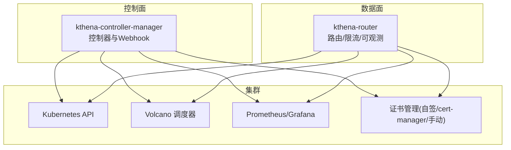
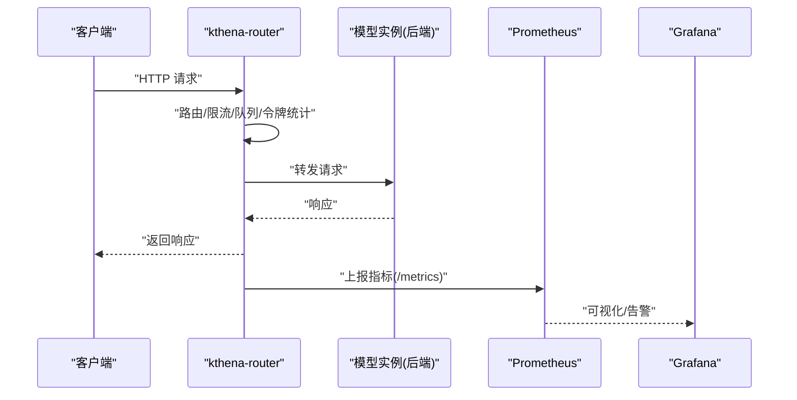
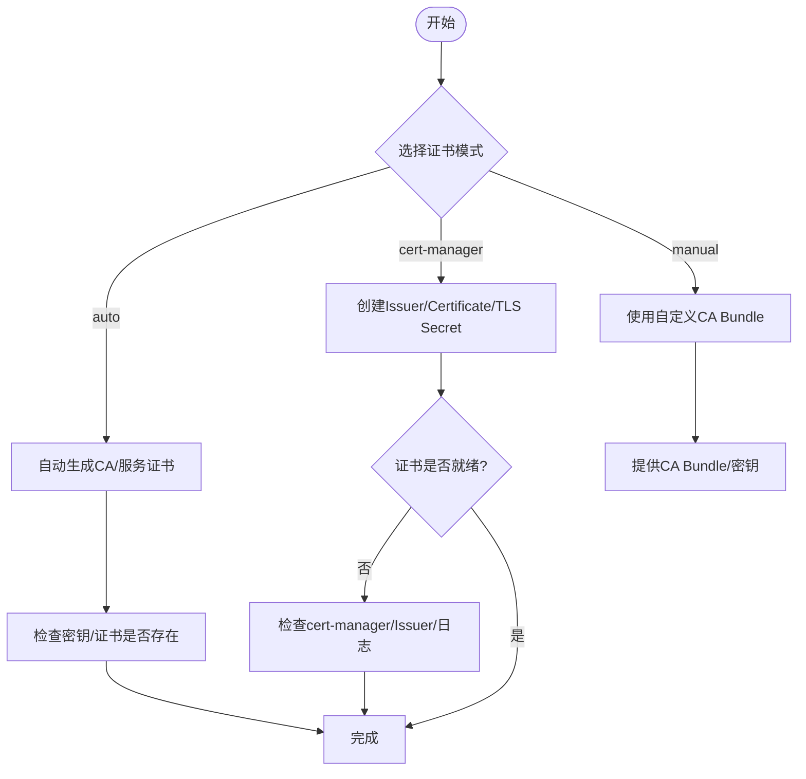
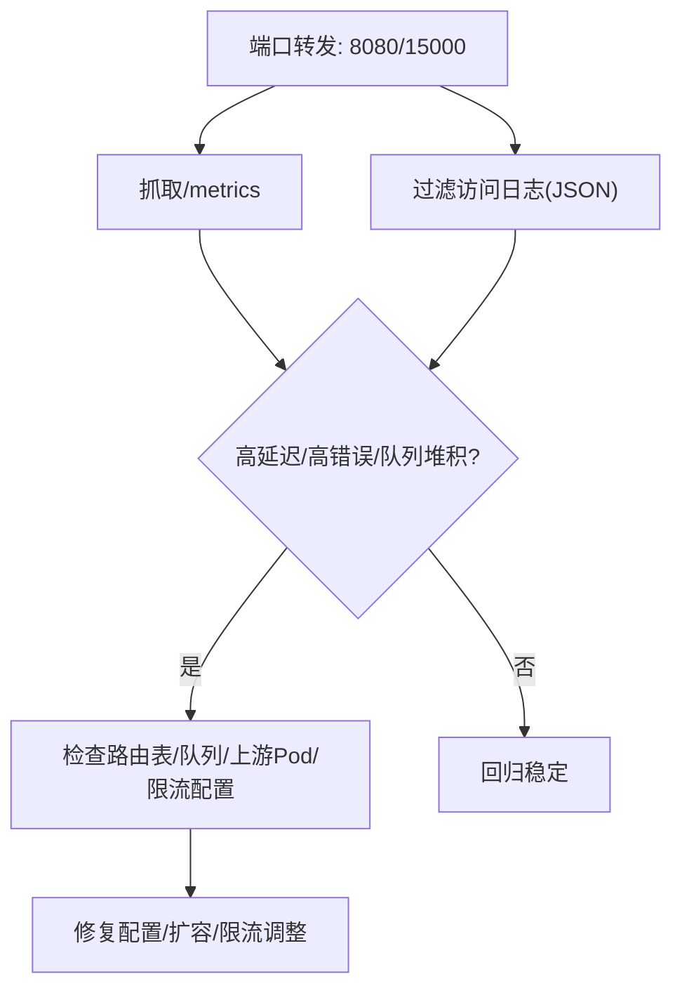
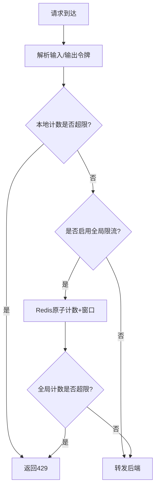
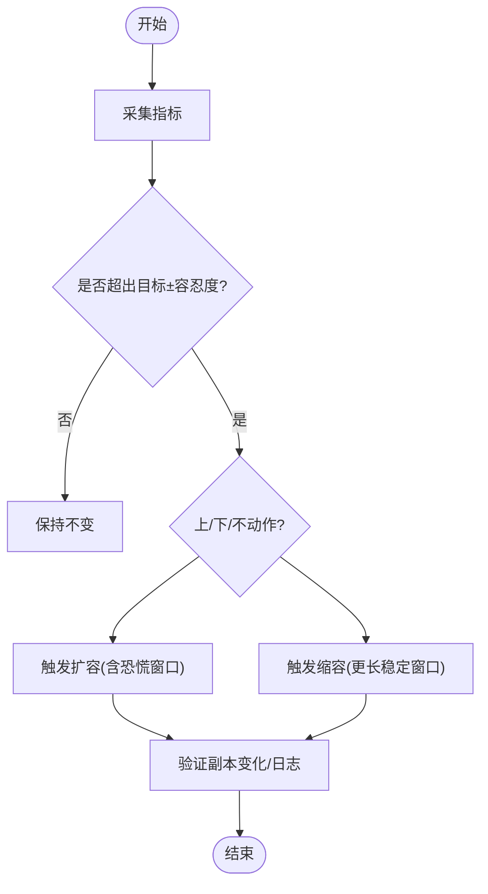
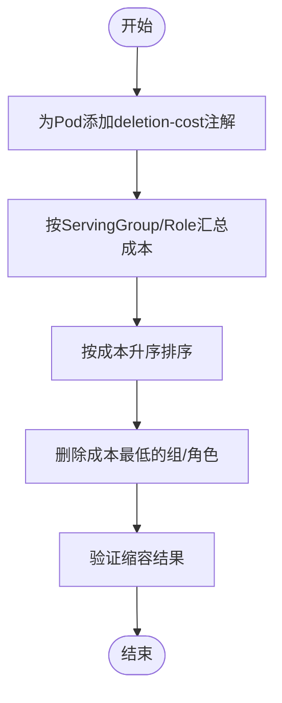
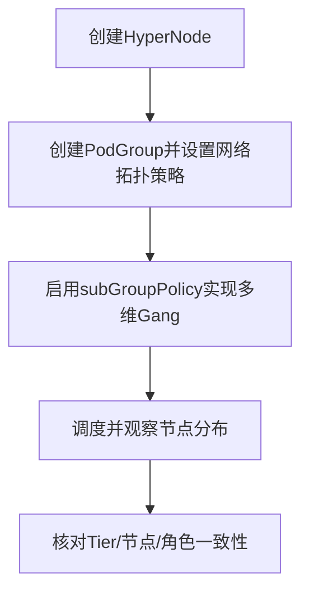
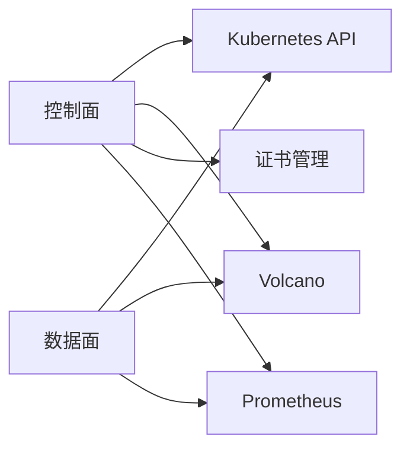
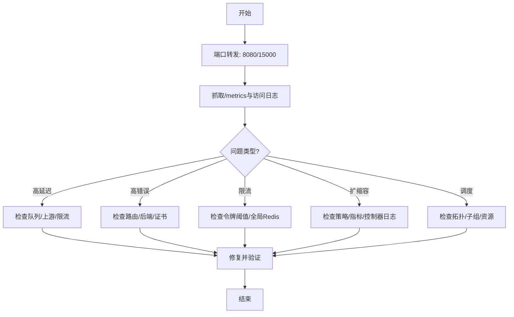

# 故障排查与常见问题

<cite>
**本文引用的文件**
- [README.md](file://README.md)
- [cert-manager.md](file://docs/kthena/docs/general/cert-manager.md)
- [router-observability.md](file://docs/kthena/docs/user-guide/router-observability.md)
- [prometheus.md](file://docs/kthena/docs/general/prometheus.md)
- [rate-limit.md](file://docs/kthena/docs/user-guide/rate-limit.md)
- [gang-scheduling.md](file://docs/kthena/docs/user-guide/gang-scheduling.md)
- [autoscaler.md](file://docs/kthena/docs/user-guide/autoscaler.md)
- [binpack-scale-down.md](file://docs/kthena/docs/user-guide/binpack-scale-down.md)
- [network-topology.md](file://docs/kthena/docs/user-guide/network-topology.md)
- [main.go](file://cmd/kthena-router/main.go)
- [main.go](file://cmd/kthena-controller-manager/main.go)
- [logger.go](file://pkg/kthena-router/accesslog/logger.go)
- [types.go](file://pkg/kthena-router/accesslog/types.go)
- [router.go](file://pkg/kthena-router/router/router.go)
- [router_test.go](file://pkg/kthena-router/router/router_test.go)
- [logger_test.go](file://pkg/kthena-router/accesslog/logger_test.go)
</cite>

## 目录
1. [简介](#简介)
2. [项目结构](#项目结构)
3. [核心组件](#核心组件)
4. [架构总览](#架构总览)
5. [详细组件分析](#详细组件分析)
6. [依赖关系分析](#依赖关系分析)
7. [性能考量](#性能考量)
8. [故障排查指南](#故障排查指南)
9. [结论](#结论)
10. [附录](#附录)

## 简介
本指南面向运维与平台工程团队，聚焦 Kthena 在安装、配置、运行与排障中的常见问题与系统化诊断流程。内容覆盖证书管理、网络拓扑与调度、路由可观测性、限流策略、弹性伸缩、容量回收（Binpack）以及监控告警等主题，并提供可操作的命令与定位思路，帮助快速定位根因并恢复服务。

## 项目结构
Kthena 是一个原生 Kubernetes 的大模型推理平台，采用“控制面 + 数据面”分离架构：
- 控制面：kthena-controller-manager，负责模型生命周期、自动伸缩策略、准入校验等
- 数据面：kthena-router，负责请求接入、路由、负载均衡、公平队列、令牌级限流、可观测性等

图示来源
- [README.md:57-62](file://README.md#L57-L62)
- [main.go:54-111](file://cmd/kthena-controller-manager/main.go#L54-L111)
- [main.go:124-195](file://cmd/kthena-router/main.go#L124-L195)

章节来源
- [README.md:53-62](file://README.md#L53-L62)

## 核心组件
- kthena-controller-manager：控制平面，负责 CRD 同步、Webhook、自动伸缩策略绑定、准入校验等
- kthena-router：数据平面入口，负责请求分类、路由、负载均衡、令牌级限流、公平队列、可观测性与调试端点
- 证书管理：支持自签、cert-manager 自动化、手动证书三种模式
- 监控与告警：Prometheus 指标、Grafana 可视化、AlertManager 告警、可选 Loki 日志聚合
- 调度与拓扑：基于 Volcano 的多维 Gang 调度、网络拓扑感知、Binpack 容量回收

章节来源
- [README.md:57-62](file://README.md#L57-L62)
- [cert-manager.md:1-275](file://docs/kthena/docs/general/cert-manager.md#L1-L275)
- [prometheus.md:1-927](file://docs/kthena/docs/general/prometheus.md#L1-L927)
- [router-observability.md:1-294](file://docs/kthena/docs/user-guide/router-observability.md#L1-L294)

## 架构总览
下图展示从客户端到后端模型实例的关键路径与关键观测点：

图示来源
- [router-observability.md:26-66](file://docs/kthena/docs/user-guide/router-observability.md#L26-L66)
- [prometheus.md:34-121](file://docs/kthena/docs/general/prometheus.md#L34-L121)

## 详细组件分析

### 组件一：证书管理（Webhook/Router）
- 模式选择：global.certManagementMode 支持 auto、cert-manager、manual 三类互斥模式
- 自签模式：默认启用，首次启动自动生成 CA 与服务证书，多副本安全共享
- cert-manager 模式：自动创建 Issuer/Certificate/TLS Secret，生产推荐
- 手动模式：提供自定义 CA Bundle，适合企业 PKI 或离线环境
- 常见问题：cert-manager 未安装、证书未就绪、DNS 名不匹配、Webhook 连接被拒
- 排查要点：检查证书状态、Issuer、cert-manager 日志；确认 DNS 与服务名；验证 TLS 密钥存在

图示来源
- [cert-manager.md:21-178](file://docs/kthena/docs/general/cert-manager.md#L21-L178)
- [main.go:124-195](file://cmd/kthena-router/main.go#L124-L195)
- [main.go:116-173](file://cmd/kthena-controller-manager/main.go#L116-L173)

章节来源
- [cert-manager.md:180-275](file://docs/kthena/docs/general/cert-manager.md#L180-L275)
- [main.go:124-225](file://cmd/kthena-router/main.go#L124-L225)
- [main.go:116-250](file://cmd/kthena-controller-manager/main.go#L116-L250)

### 组件二：路由器可观测性（指标/访问日志/调试端点）
- 指标端点：默认 8080/metrics，包含请求总量、时延、令牌统计、队列长度、限流计数等
- 访问日志：推荐 JSON 格式，包含请求/响应关键字段，便于日志聚合与检索
- 调试端点：15000 端口，导出 ModelRoute/ModelServer/Pod 视图，辅助定位路由与健康状态
- 快速诊断：端口转发、实时抓取指标、过滤访问日志、查看队列与上游健康

图示来源
- [router-observability.md:26-161](file://docs/kthena/docs/user-guide/router-observability.md#L26-L161)

章节来源
- [router-observability.md:169-294](file://docs/kthena/docs/user-guide/router-observability.md#L169-L294)
- [logger.go](file://pkg/kthena-router/accesslog/logger.go)
- [types.go](file://pkg/kthena-router/accesslog/types.go)

### 组件三：令牌级限流（本地/全局）
- 适用场景：AI 推理请求计算成本差异极大，需按输入/输出令牌限流，避免资源滥用
- 本地限流：每实例独立计数，简单有效，适合单实例保护
- 全局限流：通过 Redis 统一计数，跨实例一致限流，适合多副本场景
- 配置位置：ModelRoute 中 rateLimit 字段，支持单位（秒/分/时/天/月）与全局 Redis 地址
- 测试方法：降低阈值发送请求，观察 429 返回；多副本演示全局一致性

图示来源
- [rate-limit.md:1-167](file://docs/kthena/docs/user-guide/rate-limit.md#L1-L167)

章节来源
- [rate-limit.md:1-167](file://docs/kthena/docs/user-guide/rate-limit.md#L1-L167)

### 组件四：自动伸缩（同构/异构）
- 模式：同构目标（单一实例类型）、异构目标（多实例类型，成本优化）
- 关键参数：目标指标、容忍度、恐慌阈值、稳定窗口、周期、上下界
- 绑定：AutoscalingPolicy 与 AutoscalingPolicyBinding，支持角色级绑定
- 验证：检查 CR 状态、实例副本变化、控制器日志、指标采集

图示来源
- [autoscaler.md:1-331](file://docs/kthena/docs/user-guide/autoscaler.md#L1-L331)

章节来源
- [autoscaler.md:254-331](file://docs/kthena/docs/user-guide/autoscaler.md#L254-L331)

### 组件五：Binpack 容量回收
- 目标：最大化节点可用容量，为后续大作业准备
- 机制：利用 pod deletion-cost 注解，按组/角色聚合成本，优先删除成本最低者
- 行为：缩容按成本排序删除；扩容从最大索引回填，保证删除顺序可控

图示来源
- [binpack-scale-down.md:1-66](file://docs/kthena/docs/user-guide/binpack-scale-down.md#L1-L66)

章节来源
- [binpack-scale-down.md:1-66](file://docs/kthena/docs/user-guide/binpack-scale-down.md#L1-L66)

### 组件六：网络拓扑与多维 Gang 调度
- 网络拓扑：通过 HyperNode 抽象网络域，PodGroup 设置最高层级限制，实现硬/软约束
- 多维 Gang：结合 subGroupPolicy 实现 ServingGroup 与 Role 的同时就绪，避免部分部署
- 验证：创建 HyperNode、部署模型、观察 PodGroup 状态与节点分布

图示来源
- [network-topology.md:1-207](file://docs/kthena/docs/user-guide/network-topology.md#L1-L207)
- [gang-scheduling.md:1-129](file://docs/kthena/docs/user-guide/gang-scheduling.md#L1-L129)

章节来源
- [network-topology.md:1-207](file://docs/kthena/docs/user-guide/network-topology.md#L1-L207)
- [gang-scheduling.md:1-129](file://docs/kthena/docs/user-guide/gang-scheduling.md#L1-L129)

## 依赖关系分析
- 控制面依赖 Kubernetes API 与 Volcano 调度器；Webhook 依赖证书管理
- 数据面依赖控制面同步的路由/服务器配置；依赖 Prometheus 暴露指标
- 限流策略由控制面 CRD 配置，数据面生效；自动伸缩依赖指标采集与控制器逻辑

图示来源
- [README.md:57-62](file://README.md#L57-L62)
- [main.go:54-111](file://cmd/kthena-controller-manager/main.go#L54-L111)
- [main.go:124-195](file://cmd/kthena-router/main.go#L124-L195)

章节来源
- [README.md:57-62](file://README.md#L57-L62)

## 性能考量
- 指标体系：请求速率、时延（P50/P95/P99）、错误率、令牌统计、队列长度、上游活跃请求数
- 资源监控：CPU/内存/GPU 利用率与显存占用，结合模型加载耗时与缓存命中率
- 限流与排队：通过令牌级限流与公平队列避免尾部延迟；必要时提升副本或优化后端性能
- 弹性伸缩：合理设置目标值、容忍度与稳定窗口，避免抖动；异构模式平衡成本与性能
- 网络拓扑：将高频通信任务调度至同一网络域，减少跨域开销

章节来源
- [router-observability.md:26-66](file://docs/kthena/docs/user-guide/router-observability.md#L26-L66)
- [prometheus.md:123-196](file://docs/kthena/docs/general/prometheus.md#L123-L196)
- [autoscaler.md:1-331](file://docs/kthena/docs/user-guide/autoscaler.md#L1-L331)
- [network-topology.md:1-207](file://docs/kthena/docs/user-guide/network-topology.md#L1-L207)

## 故障排查指南

### 通用诊断流程
- 明确现象：高错误率/高延迟/队列堆积/限流拒绝/缩容异常/调度失败
- 快速定位：端口转发到 8080/15000，抓取指标与访问日志，检查路由表与后端健康
- 深入分析：结合 Prometheus/Grafana、限流配置、自动伸缩策略、网络拓扑与 Gang 调度
- 修复验证：变更后持续观察指标与日志，确保回归稳定

### 证书相关问题
- 症状：Webhook 连接被拒、证书未就绪、DNS 校验失败
- 排查步骤：
  - 确认 cert-manager 已安装且正常运行
  - 检查证书/Issuer 状态与日志
  - 校验 DNS 名称与服务域名
  - 确认 TLS 密钥文件存在
- 参考命令与资源：证书、Issuer、TLS Secret、cert-manager 日志

章节来源
- [cert-manager.md:180-275](file://docs/kthena/docs/general/cert-manager.md#L180-L275)
- [main.go:197-225](file://cmd/kthena-router/main.go#L197-L225)
- [main.go:219-250](file://cmd/kthena-controller-manager/main.go#L219-L250)

### 路由器可观测性问题
- 症状：无法获取指标、访问日志缺失、调试端点不可用
- 排查步骤：
  - 确认 8080 端口转发成功
  - 确认访问日志格式为 JSON，过滤非 JSON 行
  - 使用调试端点导出路由/服务器/Pod 视图
  - 结合指标定位慢请求、队列压力与限流拒绝
- 常用命令：端口转发、抓取指标、过滤日志、调试端点查询

章节来源
- [router-observability.md:169-294](file://docs/kthena/docs/user-guide/router-observability.md#L169-L294)

### 限流问题
- 症状：频繁 429、全局限流不一致、令牌统计异常
- 排查步骤：
  - 检查 ModelRoute 中 rateLimit 配置与单位
  - 若使用全局限流，确认 Redis 地址可达且计数正确
  - 通过访问日志与指标判断是否误伤
- 测试方法：降低阈值快速验证，多副本验证全局一致性

章节来源
- [rate-limit.md:1-167](file://docs/kthena/docs/user-guide/rate-limit.md#L1-L167)

### 自动伸缩问题
- 症状：缩扩容不生效、抖动严重、副本数异常
- 排查步骤：
  - 检查策略与绑定 CR 状态
  - 核对指标采集端点与标签选择器
  - 查看控制器日志与副本变化趋势
  - 调整目标值、容忍度与稳定窗口
- 建议：先同构后异构，逐步引入成本优化

章节来源
- [autoscaler.md:254-331](file://docs/kthena/docs/user-guide/autoscaler.md#L254-L331)

### 容量回收（Binpack）问题
- 症状：缩容删除了高价值组、扩容顺序不符合预期
- 排查步骤：
  - 为 Pod 添加 deletion-cost 注解并验证聚合
  - 检查缩容后索引变化与扩容回填行为
  - 如需保留旧副本，调整注解或切换删除策略

章节来源
- [binpack-scale-down.md:1-66](file://docs/kthena/docs/user-guide/binpack-scale-down.md#L1-L66)

### 网络拓扑与调度问题
- 症状：跨域通信导致延迟升高、Gang 调度失败、部分副本 Pending
- 排查步骤：
  - 创建并核对 HyperNode 层级与成员
  - 检查 PodGroup 的网络拓扑策略与最高层级限制
  - 核对 subGroupPolicy 与角色标签匹配
- 建议：硬约束用于强一致性，软约束用于就近原则

章节来源
- [network-topology.md:1-207](file://docs/kthena/docs/user-guide/network-topology.md#L1-L207)
- [gang-scheduling.md:1-129](file://docs/kthena/docs/user-guide/gang-scheduling.md#L1-L129)

### 日志分析与错误解读
- 访问日志：JSON 结构包含时间戳、方法、路径、状态码、模型名、请求/响应时长、令牌数、错误信息等
- 日志过滤：仅处理 JSON 行，避免非结构化日志导致解析错误
- 错误类型：超时、限流、队列满、上游不可达等，结合指标定位根因

章节来源
- [router-observability.md:67-92](file://docs/kthena/docs/user-guide/router-observability.md#L67-L92)
- [logger_test.go:125-176](file://pkg/kthena-router/accesslog/logger_test.go#L125-L176)

### 社区支持与获取帮助
- 文档与博客：官方文档、博客文章、版本化文档
- 讨论与问题：GitHub Issues 与 Discussions
- 贡献指南：遵循代码规范与测试要求

章节来源
- [README.md:82-101](file://README.md#L82-L101)

## 结论
通过标准化的诊断流程与可观测性工具，Kthena 能够在复杂的大模型推理环境中快速定位并解决问题。建议在生产中统一开启 Prometheus/Grafana、结构化访问日志与调试端点，配合令牌级限流、弹性伸缩与网络拓扑感知，构建稳定高效的推理平台。

## 附录

### 常用命令速查
- 端口转发与指标观测
  - kubectl port-forward -n kthena-system svc/kthena-router 8080:8080
  - kubectl port-forward -n kthena-system svc/kthena-router 15000:15000
  - curl http://localhost:8080/metrics
- 访问日志过滤
  - kubectl logs -n kthena-system deployment/kthena-router -f | grep -E '^{.*}$' | jq .
- 调试端点
  - curl http://localhost:15000/debug/config_dump/modelroutes
  - curl http://localhost:15000/debug/config_dump/pods

### 关键指标参考
- 请求与延迟：kthena_router_requests_total、kthena_router_request_duration_seconds
- 令牌与使用：kthena_router_tokens_total
- 公平队列与调度：kthena_router_fairness_queue_size、kthena_router_scheduler_plugin_duration_seconds
- 限流与保护：kthena_router_rate_limit_exceeded_total

章节来源
- [router-observability.md:26-66](file://docs/kthena/docs/user-guide/router-observability.md#L26-L66)
- [prometheus.md:123-196](file://docs/kthena/docs/general/prometheus.md#L123-L196)